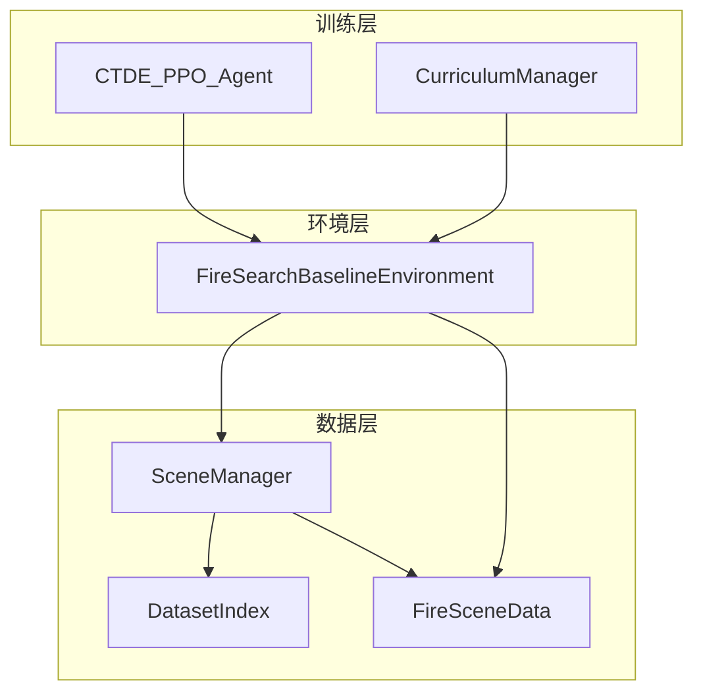
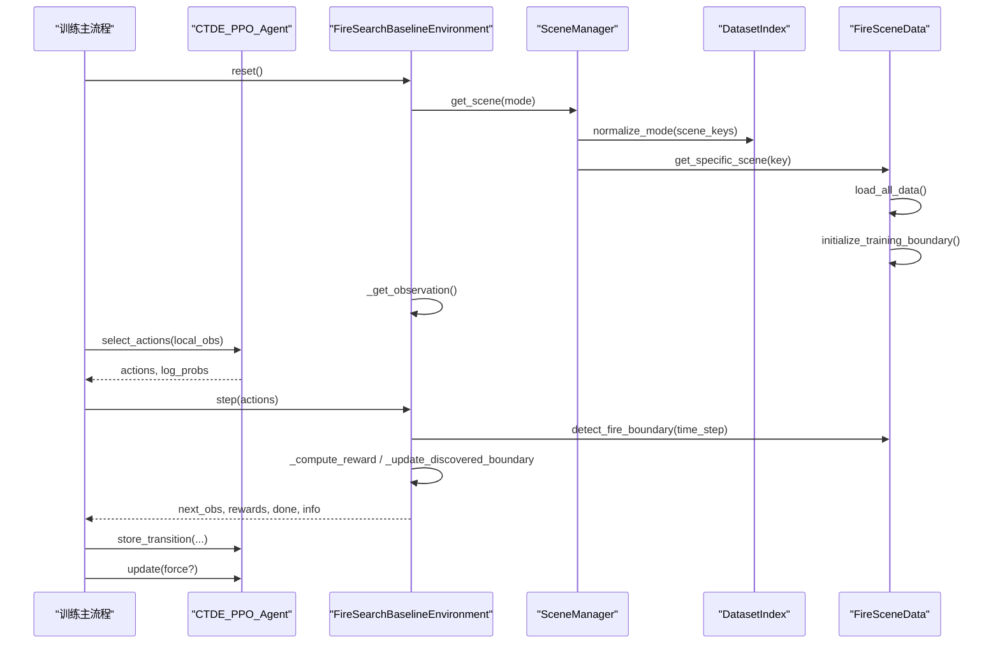
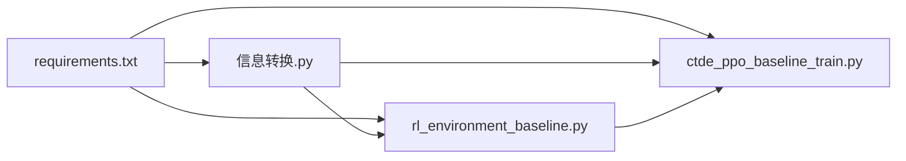

# API参考

<cite>
**本文引用的文件**   
- [信息转换.py](file://environment_variables/environment_variables/信息转换.py)
- [rl_environment_baseline.py](file://environment_variables/environment_variables/rl_environment_baseline.py)
- [ctde_ppo_baseline_train.py](file://environment_variables/environment_variables/ctde_ppo_baseline_train.py)
- [requirements.txt](file://environment_variables/requirements.txt)
</cite>

## 目录
1. [简介](#简介)
2. [项目结构](#项目结构)
3. [核心组件](#核心组件)
4. [架构总览](#架构总览)
5. [详细组件分析](#详细组件分析)
6. [依赖关系分析](#依赖关系分析)
7. [性能考量](#性能考量)
8. [故障排查指南](#故障排查指南)
9. [结论](#结论)
10. [附录：版本兼容与弃用策略](#附录版本兼容与弃用策略)

## 简介
本API参考面向多无人机火场边界搜索的CTDE-PPO基线系统，覆盖以下关键接口：
- FireSearchBaselineEnvironment：Gymnasium环境接口（reset、step等）
- DatasetIndex：数据集索引与场景路径解析
- FireSceneData：场景数据加载、归一化、热场与梯度计算、边界检测等
- CTDE_PPO_Agent：训练器接口（select_actions、update、save/load等）

文档提供方法签名、参数类型、返回值、异常说明、错误码与调试工具使用建议，并给出代码级图示与最佳实践。

## 项目结构
围绕三大模块组织：
- 数据与场景：DatasetIndex、FireSceneData、SceneManager
- 环境与交互：FireSearchBaselineEnvironment
- 训练与控制：CTDE_PPO_Agent、CurriculumManager、训练主流程

图表来源
- [信息转换.py:20-196](file://environment_variables/environment_variables/信息转换.py#L20-L196)
- [信息转换.py:219-390](file://environment_variables/environment_variables/信息转换.py#L219-L390)
- [信息转换.py:1282-1326](file://environment_variables/environment_variables/信息转换.py#L1282-L1326)
- [rl_environment_baseline.py:21-158](file://environment_variables/environment_variables/rl_environment_baseline.py#L21-L158)
- [ctde_ppo_baseline_train.py:759-834](file://environment_variables/environment_variables/ctde_ppo_baseline_train.py#L759-L834)

章节来源
- [信息转换.py:20-196](file://environment_variables/environment_variables/信息转换.py#L20-L196)
- [rl_environment_baseline.py:21-158](file://environment_variables/environment_variables/rl_environment_baseline.py#L21-L158)
- [ctde_ppo_baseline_train.py:759-834](file://environment_variables/environment_variables/ctde_ppo_baseline_train.py#L759-L834)

## 核心组件
本节概述各组件职责与对外暴露的关键API。

- DatasetIndex
  - 作用：读取dataset_index.json，规范化模式别名，提供场景键列表与记录解析。
  - 关键方法：scene_keys、get_record、scene_dir、scene_index、required_file_paths。
  - 异常：FileNotFoundError、ValueError、KeyError。

- FireSceneData
  - 作用：加载单场景栅格/矢量/元数据，构建归一化参数、热场、导航场、边界点序列；提供局部观测辅助函数。
  - 关键方法：load_all_data、normalized_map、detect_fire_boundary、severity_map、get_thermal_value、get_local_thermal_gradient、diagnose_thermal_health、get_circular_neighborhood、get_local_fire_info、check_boundary_closure、get_full_map。
  - 异常：FileNotFoundError、RuntimeError、InvalidSceneError。

- FireSearchBaselineEnvironment
  - 作用：Gymnasium环境，封装多无人机动作、观测、奖励、终止条件与课程学习阶段。
  - 关键方法：reset、step、set_curriculum_stage、get_env_info。
  - 异常：ValueError（配置校验）。

- CTDE_PPO_Agent
  - 作用：Actor-Critic网络、经验回放、PPO更新、KL自适应学习率。
  - 关键方法：select_actions、select_actions_deterministic、store_transition、compute_gae、update、save、load。
  - 异常：ValueError（lr_adapt_mode校验）。

章节来源
- [信息转换.py:20-196](file://environment_variables/environment_variables/信息转换.py#L20-L196)
- [信息转换.py:219-390](file://environment_variables/environment_variables/信息转换.py#L219-L390)
- [信息转换.py:821-1012](file://environment_variables/environment_variables/信息转换.py#L821-L1012)
- [rl_environment_baseline.py:21-158](file://environment_variables/environment_variables/rl_environment_baseline.py#L21-L158)
- [rl_environment_baseline.py:842-992](file://environment_variables/environment_variables/rl_environment_baseline.py#L842-L992)
- [ctde_ppo_baseline_train.py:759-834](file://environment_variables/environment_variables/ctde_ppo_baseline_train.py#L759-L834)
- [ctde_ppo_baseline_train.py:849-991](file://environment_variables/environment_variables/ctde_ppo_baseline_train.py#L849-L991)

## 架构总览
下图展示从训练脚本到环境、数据层的调用链路与数据流向。

图表来源
- [ctde_ppo_baseline_train.py:1278-1599](file://environment_variables/environment_variables/ctde_ppo_baseline_train.py#L1278-L1599)
- [rl_environment_baseline.py:331-360](file://environment_variables/environment_variables/rl_environment_baseline.py#L331-L360)
- [rl_environment_baseline.py:842-992](file://environment_variables/environment_variables/rl_environment_baseline.py#L842-L992)
- [信息转换.py:1282-1326](file://environment_variables/environment_variables/信息转换.py#L1282-L1326)
- [信息转换.py:821-887](file://environment_variables/environment_variables/信息转换.py#L821-L887)

## 详细组件分析

### DatasetIndex API
- 初始化
  - 构造参数：data_dir(str), index_name(str)
  - 行为：解析dataset_index.json，建立source_root、splits、scenes、all_scene_keys
  - 异常：FileNotFoundError（索引不存在）、ValueError（未知模式）
- 方法
  - scene_keys(mode="train") -> List[str]
    - 返回指定split的场景键列表
    - 异常：ValueError（split为空或未知）
  - get_record(scene_key) -> Dict
    - 返回包含绝对路径的完整记录（metadata_abs、static_map_abs、rasters_abs、scene_index）
    - 异常：KeyError（未知scene_key）
  - scene_dir(scene_key) -> Path
  - scene_index(scene_key) -> int
  - required_file_paths(scene_key) -> List[Tuple[str, Path]]
    - 列出必需文件及对应绝对路径，缺失项以占位符表示

示例用法（路径引用）
- 初始化与获取场景键：[信息转换.py:32-94](file://environment_variables/environment_variables/信息转换.py#L32-L94)
- 获取记录与路径解析：[信息转换.py:96-134](file://environment_variables/environment_variables/信息转换.py#L96-L134)
- 必需文件清单：[信息转换.py:136-196](file://environment_variables/environment_variables/信息转换.py#L136-L196)

章节来源
- [信息转换.py:20-196](file://environment_variables/environment_variables/信息转换.py#L20-L196)

### FireSceneData API
- 初始化
  - 构造参数：data_dir(str), scene_key(str|None), scene_record(Dict|None), dataset_index(DatasetIndex|None)
  - 行为：加载metadata、构建文件路径、静态地图与动态栅格、风场、归一化参数、初始边界、热场
  - 异常：FileNotFoundError、KeyError、RuntimeError、InvalidSceneError
- 关键属性与方法
  - normalized_map(variable) -> np.ndarray
    - 按场景统计量归一化，支持dem/slope/wind_speed等
  - load_all_data()
    - 加载静态地图、核心栅格、可选栅格、风场，推导norm_params
  - detect_fire_boundary(time_step=0, fire_threshold=None, init_percentile=None, init_area_percent=None, start_sim_time=None) -> List[Tuple[int,int]]
    - 基于时间步或面积百分比选择火场掩膜，计算边界点
  - severity_map() -> np.ndarray
    - 综合强度、长度、速度、热量、冠层火的严重度评分
  - get_thermal_value(row,col) -> float
  - get_local_thermal_gradient(row,col) -> (float,float)
    - 基于log压缩导航场的梯度，避免高值区梯度消失
  - diagnose_thermal_health() -> Dict
    - 诊断热场健康指标（饱和比例、零梯度比例等）
  - get_circular_neighborhood(row,col,radius,time_step=0) -> Optional[Dict]
  - get_local_fire_info(row,col,radius,time_step=0) -> Dict
    - 视野内火点数、边界数、平均/最大强度、最近距离、方向
  - check_boundary_closure(discovered_boundary,closure_threshold=0.8) -> Dict
  - get_full_map(variable,time_step=0) -> Optional[np.ndarray]

示例用法（路径引用）
- 初始化与数据加载：[信息转换.py:248-322](file://environment_variables/environment_variables/信息转换.py#L248-L322)
- 归一化与风场：[信息转换.py:559-602](file://environment_variables/environment_variables/信息转换.py#L559-L602)
- 边界检测与热场：[信息转换.py:759-820](file://environment_variables/environment_variables/信息转换.py#L759-L820)
- 局部信息与热力诊断：[信息转换.py:972-1012](file://environment_variables/environment_variables/信息转换.py#L972-L1012)

章节来源
- [信息转换.py:219-390](file://environment_variables/environment_variables/信息转换.py#L219-L390)
- [信息转换.py:821-1012](file://environment_variables/environment_variables/信息转换.py#L821-L1012)

### FireSearchBaselineEnvironment API
- 初始化
  - 构造参数：data_dir, num_drones, vision_radius, max_steps, use_metadata_uav_params, observation_profile, reward_profile, curriculum_stage, mode, fixed_scene_key, scene_keys, init_percentile, init_area_percent, stage2_target, stage3_target, stage3_near_prob
  - 行为：创建SceneManager，加载场景，设置观测空间与全局状态维度，初始化无人机位置/电池/动量等
  - 异常：ValueError（observation_profile/reward_profile非法）
- 方法
  - reset() -> Dict
    - 重置场景、无人机、访问计数、奖励分解等，返回{"local_obs": [...], "global_state": ...}
  - step(actions: List[int]) -> Tuple[Dict, List[float], bool, Dict]
    - 执行动作、更新位置/动量/电池、计算奖励与发现进度、更新边界与热场、判定终止
    - 返回(next_obs, rewards, done, info)，info含覆盖率、完成原因、阶段目标等
  - set_curriculum_stage(stage: int) -> None
  - get_env_info() -> Dict
    - 输出网格大小、传感器半径、最大步数、观测/奖励profile、阶段目标等

示例用法（路径引用）
- 初始化与空间定义：[rl_environment_baseline.py:49-158](file://environment_variables/environment_variables/rl_environment_baseline.py#L49-L158)
- reset流程：[rl_environment_baseline.py:331-360](file://environment_variables/environment_variables/rl_environment_baseline.py#L331-L360)
- step主循环与奖励：[rl_environment_baseline.py:842-992](file://environment_variables/environment_variables/rl_environment_baseline.py#L842-L992)
- 环境信息：[rl_environment_baseline.py:998-1018](file://environment_variables/environment_variables/rl_environment_baseline.py#L998-L1018)

章节来源
- [rl_environment_baseline.py:21-158](file://environment_variables/environment_variables/rl_environment_baseline.py#L21-L158)
- [rl_environment_baseline.py:331-360](file://environment_variables/environment_variables/rl_environment_baseline.py#L331-L360)
- [rl_environment_baseline.py:842-992](file://environment_variables/environment_variables/rl_environment_baseline.py#L842-L992)
- [rl_environment_baseline.py:998-1018](file://environment_variables/environment_variables/rl_environment_baseline.py#L998-L1018)

### CTDE_PPO_Agent API
- 初始化
  - 构造参数：local_obs_dim, global_state_dim, action_dim, num_agents, actor_lr, critic_lr, lr_adapt_mode, target_kl, actor_lr_min, actor_lr_max, kl_ema_beta, kl_lr_alpha, gamma, gae_lambda, clip_epsilon, entropy_coef, value_coef, max_grad_norm, ppo_epochs, batch_size, device
  - 行为：构建Actor/Critic网络、优化器、经验回放缓冲，设备自动选择
  - 异常：ValueError（lr_adapt_mode非法）
- 方法
  - select_actions(local_obs: List[np.ndarray]) -> Tuple[List[int], List[float]]
    - 采样动作与对数概率
  - select_actions_deterministic(local_obs: List[np.ndarray]) -> List[int]
    - 确定性取argmax动作
  - store_transition(local_obs, global_state, actions, log_probs, rewards, done)
  - compute_gae(rewards_list, dones, global_states) -> (advantages, returns)
  - update(force=False) -> Dict
    - PPO多轮小批量更新，返回损失、熵、近似KL、clip分数、学习率等
  - save(path:str), load(path:str)

示例用法（路径引用）
- 初始化与KL自适应：[ctde_ppo_baseline_train.py:759-834](file://environment_variables/environment_variables/ctde_ppo_baseline_train.py#L759-L834)
- 动作选择与存储：[ctde_ppo_baseline_train.py:849-866](file://environment_variables/environment_variables/ctde_ppo_baseline_train.py#L849-L866)
- GAE与更新：[ctde_ppo_baseline_train.py:867-991](file://environment_variables/environment_variables/ctde_ppo_baseline_train.py#L867-L991)
- 保存/加载：[ctde_ppo_baseline_train.py:993-1014](file://environment_variables/environment_variables/ctde_ppo_baseline_train.py#L993-L1014)

章节来源
- [ctde_ppo_baseline_train.py:759-834](file://environment_variables/environment_variables/ctde_ppo_baseline_train.py#L759-L834)
- [ctde_ppo_baseline_train.py:849-991](file://environment_variables/environment_variables/ctde_ppo_baseline_train.py#L849-L991)
- [ctde_ppo_baseline_train.py:993-1014](file://environment_variables/environment_variables/ctde_ppo_baseline_train.py#L993-L1014)

## 依赖关系分析
- 外部依赖
  - numpy、rasterio、matplotlib、scipy、opencv-python（可选RL依赖：torch、stable-baselines3、tensorboard）
- 内部依赖
  - rl_environment_baseline.py 通过动态导入“信息转换”模块中的SceneManager/DatasetIndex/FireSceneData
  - ctde_ppo_baseline_train.py 依赖rl_environment_baseline.py的环境与“信息转换”的数据能力

图表来源
- [requirements.txt:1-13](file://environment_variables/requirements.txt#L1-L13)
- [rl_environment_baseline.py:17-18](file://environment_variables/environment_variables/rl_environment_baseline.py#L17-L18)
- [ctde_ppo_baseline_train.py:30-36](file://environment_variables/environment_variables/ctde_ppo_baseline_train.py#L30-L36)

章节来源
- [requirements.txt:1-13](file://environment_variables/requirements.txt#L1-L13)
- [rl_environment_baseline.py:17-18](file://environment_variables/environment_variables/rl_environment_baseline.py#L17-L18)
- [ctde_ppo_baseline_train.py:30-36](file://environment_variables/environment_variables/ctde_ppo_baseline_train.py#L30-L36)

## 性能考量
- 热场计算
  - 采用降采样+高斯模糊+上采样，再按99百分位稳健归一化，减少极端值影响，提升梯度稳定性
  - 导航场使用log压缩，缓解高值区梯度消失
- 观测特征
  - 本地观测包含位置、电池、地形、风向、热梯度、动量、相机方向等，注意裁剪与归一化范围
- 奖励设计
  - 分阶段目标与探索引导，结合边界覆盖增量、前沿探测、严重度加权与重复惩罚
- 训练效率
  - PPO小批量迭代、KL自适应学习率、GAE优势估计，配合课程学习逐步提高难度

章节来源
- [信息转换.py:759-820](file://environment_variables/environment_variables/信息转换.py#L759-L820)
- [信息转换.py:933-970](file://environment_variables/environment_variables/信息转换.py#L933-L970)
- [rl_environment_baseline.py:692-806](file://environment_variables/environment_variables/rl_environment_baseline.py#L692-L806)
- [ctde_ppo_baseline_train.py:867-991](file://environment_variables/environment_variables/ctde_ppo_baseline_train.py#L867-L991)

## 故障排查指南
- 常见异常与处理
  - FileNotFoundError：dataset_index.json或场景文件缺失，检查路径与相对/绝对路径解析
  - KeyError：scene_key不在索引中或缺少static_map字段
  - ValueError：observation_profile/reward_profile/lr_adapt_mode非法
  - RuntimeError：栅格形状不匹配、风场尺寸不一致、未初始化热场即访问
  - InvalidSceneError：t=0边界为空或init_area_percent导致空边界
- 诊断工具
  - validate_scene_boundaries：预检所有场景文件完整性与边界有效性
  - diagnose_thermal_health：检查热场饱和比例、零梯度比例、非零比例等
- 调试建议
  - 打印env.get_env_info()核对vision_radius、sensor_radius_cells、max_steps
  - 观察info中的done_reason、boundary_coverage、zero_coverage_timeout
  - 在训练日志中关注approx_kl、clip_fraction、actor_lr变化

章节来源
- [信息转换.py:1329-1416](file://environment_variables/environment_variables/信息转换.py#L1329-L1416)
- [信息转换.py:972-1012](file://environment_variables/environment_variables/信息转换.py#L972-L1012)
- [rl_environment_baseline.py:998-1018](file://environment_variables/environment_variables/rl_environment_baseline.py#L998-L1018)
- [rl_environment_baseline.py:966-992](file://environment_variables/environment_variables/rl_environment_baseline.py#L966-L992)

## 结论
本API参考覆盖了从数据索引、场景加载、环境交互到PPO训练的完整链路。通过标准化的观测/奖励设计与热场语义层，系统在多无人机火场边界搜索任务上具备可复现性与可扩展性。建议在部署前运行预检与健康诊断，并结合课程学习逐步提升任务难度。

## 附录：版本兼容与弃用策略
- 兼容性
  - FireEnvironmentData为FireSceneData的向后兼容别名
  - 支持use_metadata_uav_params与use_scene_uav_params双名映射
- 弃用策略
  - 旧参数use_scene_uav_params将被映射至use_metadata_uav_params
  - 若未来移除别名，将保留默认行为不变并通过日志提示迁移

章节来源
- [信息转换.py:1278-1280](file://environment_variables/environment_variables/信息转换.py#L1278-L1280)
- [ctde_ppo_baseline_train.py:189-192](file://environment_variables/environment_variables/ctde_ppo_baseline_train.py#L189-L192)