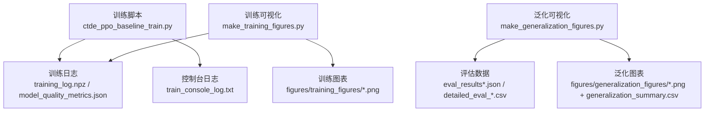
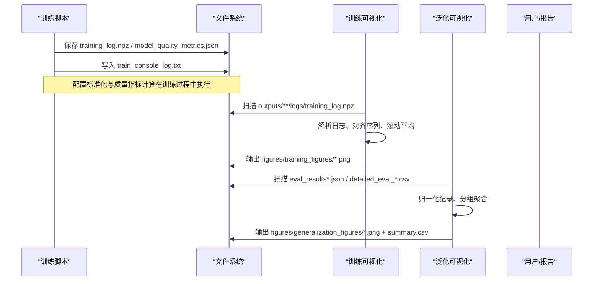
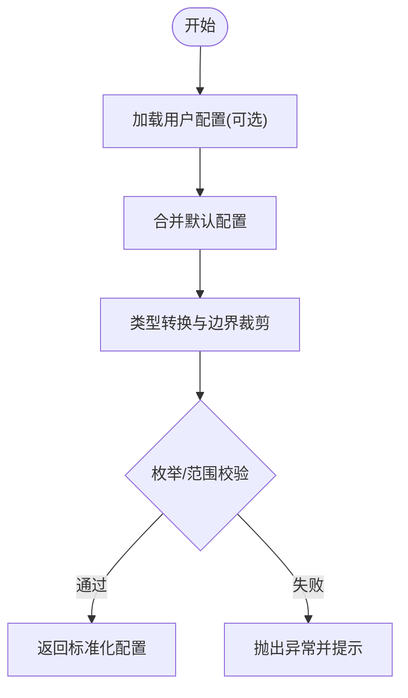
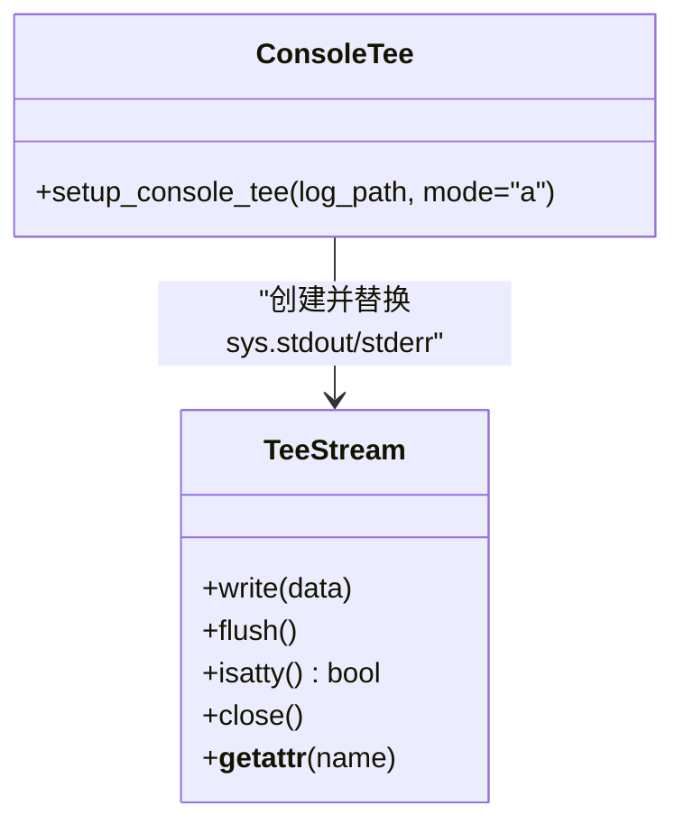
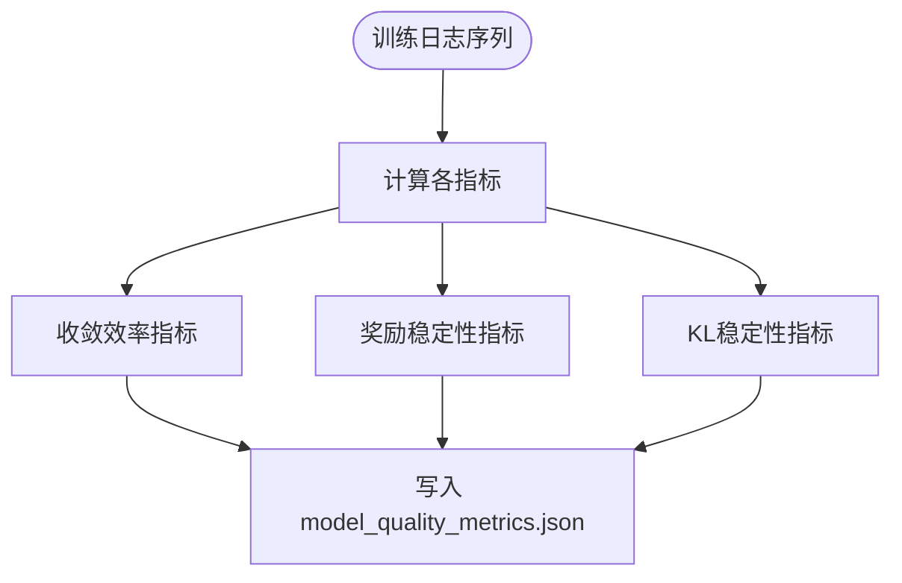
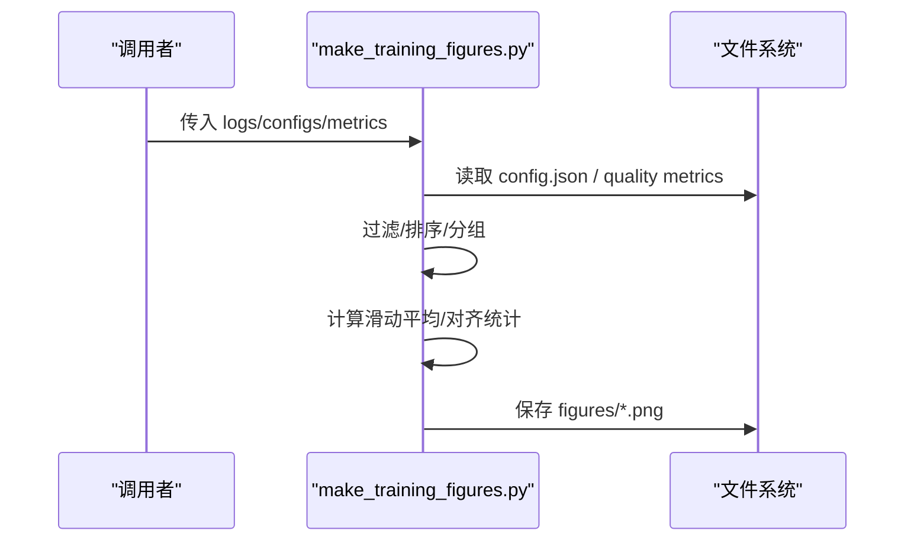
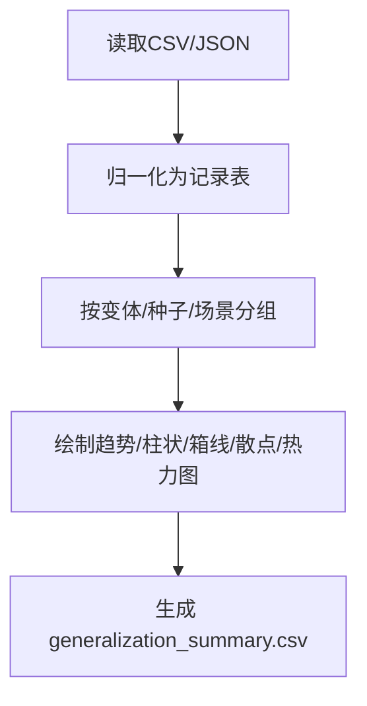
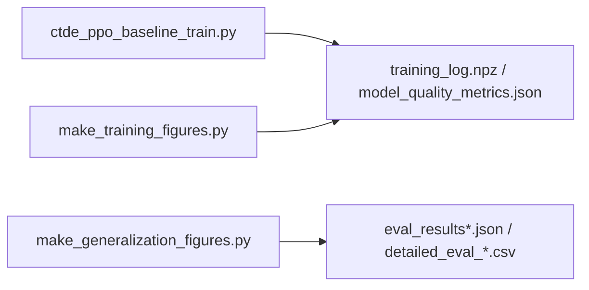

# 工具函数API

<cite>
**本文引用的文件**   
- [ctde_ppo_baseline_train.py](file://environment_variables/environment_variables/ctde_ppo_baseline_train.py)
- [make_training_figures.py](file://environment_variables/environment_variables/outputs/make_training_figures.py)
- [make_generalization_figures.py](file://environment_variables/environment_variables/outputs/make_generalization_figures.py)
- [test_training_diagnostics_log.py](file://environment_variables/environment_variables/test_training_diagnostics_log.py)
</cite>

## 目录
1. [简介](#简介)
2. [项目结构](#项目结构)
3. [核心组件](#核心组件)
4. [架构总览](#架构总览)
5. [详细组件分析](#详细组件分析)
6. [依赖关系分析](#依赖关系分析)
7. [性能考量](#性能考量)
8. [故障排查指南](#故障排查指南)
9. [结论](#结论)
10. [附录：使用示例与最佳实践](#附录使用示例与最佳实践)

## 简介
本文件面向“工具函数与辅助方法”的API文档，聚焦以下能力：
- 可视化绘图：训练曲线、结果对比、分布与汇总图
- 配置管理：JSON配置的读取与校验接口
- 日志记录与调试：控制台输出分流与诊断信息
- 性能监控与统计指标：收敛效率、稳定性、KL稳定性等
- 实验后处理：评估数据加载、归一化、分组聚合与报告生成
- 错误诊断与格式化输出：健康检查与失败报告

## 项目结构
本项目包含三类关键脚本：
- 训练与诊断：ctde_ppo_baseline_train.py（含配置标准化、质量指标计算、控制台Tee日志）
- 训练可视化：outputs/make_training_figures.py（从训练日志绘制曲线与汇总）
- 泛化可视化：outputs/make_generalization_figures.py（从评估CSV/JSON生成图表与汇总表）

图示来源
- [ctde_ppo_baseline_train.py:98-158](file://environment_variables/environment_variables/ctde_ppo_baseline_train.py#L98-L158)
- [ctde_ppo_baseline_train.py:358-433](file://environment_variables/environment_variables/ctde_ppo_baseline_train.py#L358-L433)
- [make_training_figures.py:101-155](file://environment_variables/environment_variables/outputs/make_training_figures.py#L101-L155)
- [make_generalization_figures.py:295-342](file://environment_variables/environment_variables/outputs/make_generalization_figures.py#L295-L342)

章节来源
- [ctde_ppo_baseline_train.py:98-158](file://environment_variables/environment_variables/ctde_ppo_baseline_train.py#L98-L158)
- [make_training_figures.py:101-155](file://environment_variables/environment_variables/outputs/make_training_figures.py#L101-L155)
- [make_generalization_figures.py:295-342](file://environment_variables/environment_variables/outputs/make_generalization_figures.py#L295-L342)

## 核心组件
- 配置标准化与校验
  - 提供默认配置字典与规范化流程，对字段类型、取值范围、枚举值进行校验与合并。
  - 支持字符串列表、逗号分隔、布尔转换、数值裁剪等。
- 模型质量指标计算
  - 基于训练日志序列计算收敛效率、奖励稳定性、KL稳定性等指标，并输出结构化JSON。
- 控制台日志分流
  - 通过TeeStream将stdout/stderr同时写入文件，便于离线分析与复现。
- 训练可视化
  - 自动发现训练日志，按变体排序，绘制平滑曲线、双面板图、阶段转移、完成原因分布、损失曲线、最后窗口汇总等。
- 泛化可视化
  - 支持多种评估输入格式（CSV/JSON），统一归一化为记录表，按变体/场景/种子分组，绘制趋势、柱状、箱线、散点、热力图等，并生成汇总表。

章节来源
- [ctde_ppo_baseline_train.py:161-281](file://environment_variables/environment_variables/ctde_ppo_baseline_train.py#L161-L281)
- [ctde_ppo_baseline_train.py:358-433](file://environment_variables/environment_variables/ctde_ppo_baseline_train.py#L358-L433)
- [ctde_ppo_baseline_train.py:47-96](file://environment_variables/environment_variables/ctde_ppo_baseline_train.py#L47-L96)
- [make_training_figures.py:118-176](file://environment_variables/environment_variables/outputs/make_training_figures.py#L118-L176)
- [make_generalization_figures.py:295-342](file://environment_variables/environment_variables/outputs/make_generalization_figures.py#L295-L342)

## 架构总览
下图展示训练、日志、可视化与后处理的端到端数据流。

图示来源
- [ctde_ppo_baseline_train.py:358-433](file://environment_variables/environment_variables/ctde_ppo_baseline_train.py#L358-L433)
- [make_training_figures.py:118-176](file://environment_variables/environment_variables/outputs/make_training_figures.py#L118-L176)
- [make_generalization_figures.py:295-342](file://environment_variables/environment_variables/outputs/make_generalization_figures.py#L295-L342)

## 详细组件分析

### 配置管理与验证接口
- 默认配置与标准化
  - 提供完整默认配置字典，覆盖环境、训练超参、评估策略、输出路径等。
  - 标准化流程负责类型转换、边界裁剪、枚举校验、兼容键映射（如旧键迁移）。
- 关键校验点
  - observation_profile/reward_profile 必须在允许集合中
  - init_area_percent/init_percentile 需在[0,100]
  - lr_adapt_mode 仅支持固定或KL自适应
  - target_kl/actor_lr_min/max 需满足单调性与正数约束
  - 各类窗口/批次/间隔参数需为正整数且满足最小值
- 输出
  - 返回深度拷贝后的标准化配置，供后续训练与可视化使用

图示来源
- [ctde_ppo_baseline_train.py:98-158](file://environment_variables/environment_variables/ctde_ppo_baseline_train.py#L98-L158)
- [ctde_ppo_baseline_train.py:161-281](file://environment_variables/environment_variables/ctde_ppo_baseline_train.py#L161-L281)

章节来源
- [ctde_ppo_baseline_train.py:98-158](file://environment_variables/environment_variables/ctde_ppo_baseline_train.py#L98-L158)
- [ctde_ppo_baseline_train.py:161-281](file://environment_variables/environment_variables/ctde_ppo_baseline_train.py#L161-L281)

### 日志记录与调试工具
- 控制台分流
  - 实现TeeStream类，将stdout/stderr同时写入指定日志文件，保持终端可见性。
  - setup_console_tee用于初始化分流，支持追加模式与路径绝对化。
- 适用场景
  - 长时间训练过程的可追溯性
  - 与训练日志、图表输出配合形成完整可复现实验包

图示来源
- [ctde_ppo_baseline_train.py:47-96](file://environment_variables/environment_variables/ctde_ppo_baseline_train.py#L47-L96)

章节来源
- [ctde_ppo_baseline_train.py:47-96](file://environment_variables/environment_variables/ctde_ppo_baseline_train.py#L47-L96)

### 性能监控与统计指标
- 指标类别
  - 收敛效率：AUC任务得分（按步数）、到达阈值所需步数/更新次数
  - 奖励稳定性：尾部奖励/任务得分标准差、均值/最大性能下降
  - KL稳定性：KL均值/方差、偏离目标KL的平均绝对误差、超调率、clip_fraction与学习率统计
- 输入与输出
  - 输入：training_log中的task_scores、rewards、total_steps、ppo_updates、approx_kl、clip_fraction、actor_lr等
  - 输出：model_quality_metrics.json，包含settings与各指标子项

图示来源
- [ctde_ppo_baseline_train.py:358-433](file://environment_variables/environment_variables/ctde_ppo_baseline_train.py#L358-L433)

章节来源
- [ctde_ppo_baseline_train.py:358-433](file://environment_variables/environment_variables/ctde_ppo_baseline_train.py#L358-L433)

### 训练可视化API
- 数据发现与加载
  - 自动扫描training_log.npz与config.json，推断运行名称并按预设顺序排列
  - 支持多seed聚合与基线变体分组
- 绘图函数概览
  - plot_smoothed_metric：单指标平滑曲线（支持原始线与滑动平均）
  - plot_aggregate_metric：按基线聚合的均值±标准差曲线
  - plot_aggregate_two_panel：双面板指标对比
  - plot_task_score：任务得分曲线（由覆盖率、成功率、长度组合）
  - plot_stage_curve：课程阶段转移阶梯图
  - plot_done_reasons：最近N回合结束原因堆叠占比
  - plot_loss_curves：Actor/Critic损失双面板
  - plot_aggregate_last_window_summary：最后N回合的多指标汇总柱状图
  - plot_aggregate_quality_summary：质量指标汇总（AUC、阈值步数、尾部标准差、KL超调率）
- 通用工具
  - rolling_mean/effective_window：滑动平均与窗口选择
  - aligned_mean_std：对齐序列的均值与标准差
  - values_for_metric：统一指标提取（含百分比换算）
  - label_for/color_for：标签与颜色映射

图示来源
- [make_training_figures.py:118-176](file://environment_variables/environment_variables/outputs/make_training_figures.py#L118-L176)
- [make_training_figures.py:308-316](file://environment_variables/environment_variables/outputs/make_training_figures.py#L308-L316)
- [make_training_figures.py:355-363](file://environment_variables/environment_variables/outputs/make_training_figures.py#L355-L363)
- [make_training_figures.py:366-381](file://environment_variables/environment_variables/outputs/make_training_figures.py#L366-L381)
- [make_training_figures.py:582-632](file://environment_variables/environment_variables/outputs/make_training_figures.py#L582-L632)
- [make_training_figures.py:635-666](file://environment_variables/environment_variables/outputs/make_training_figures.py#L635-L666)
- [make_training_figures.py:669-703](file://environment_variables/environment_variables/outputs/make_training_figures.py#L669-L703)
- [make_training_figures.py:706-752](file://environment_variables/environment_variables/outputs/make_training_figures.py#L706-L752)
- [make_training_figures.py:755-786](file://environment_variables/environment_variables/outputs/make_training_figures.py#L755-L786)
- [make_training_figures.py:486-535](file://environment_variables/environment_variables/outputs/make_training_figures.py#L486-L535)
- [make_training_figures.py:538-579](file://environment_variables/environment_variables/outputs/make_training_figures.py#L538-L579)

章节来源
- [make_training_figures.py:118-176](file://environment_variables/environment_variables/outputs/make_training_figures.py#L118-L176)
- [make_training_figures.py:308-316](file://environment_variables/environment_variables/outputs/make_training_figures.py#L308-L316)
- [make_training_figures.py:355-363](file://environment_variables/environment_variables/outputs/make_training_figures.py#L355-L363)
- [make_training_figures.py:366-381](file://environment_variables/environment_variables/outputs/make_training_figures.py#L366-L381)
- [make_training_figures.py:582-632](file://environment_variables/environment_variables/outputs/make_training_figures.py#L582-L632)
- [make_training_figures.py:635-666](file://environment_variables/environment_variables/outputs/make_training_figures.py#L635-L666)
- [make_training_figures.py:669-703](file://environment_variables/environment_variables/outputs/make_training_figures.py#L669-L703)
- [make_training_figures.py:706-752](file://environment_variables/environment_variables/outputs/make_training_figures.py#L706-L752)
- [make_training_figures.py:755-786](file://environment_variables/environment_variables/outputs/make_training_figures.py#L755-L786)
- [make_training_figures.py:486-535](file://environment_variables/environment_variables/outputs/make_training_figures.py#L486-L535)
- [make_training_figures.py:538-579](file://environment_variables/environment_variables/outputs/make_training_figures.py#L538-L579)

### 泛化可视化与后处理API
- 数据源与识别
  - 支持detailed_eval_*.csv、*_result_*.json、eval_results*.json、generalization_results*.json等
  - 自动推断变体名与阶段信息，去重并排序
- 记录归一化
  - 统一字段名与单位（覆盖率、成功率、步骤、超时、任务得分、信息增益等）
  - 兼容不同命名风格与缺失字段回退
- 分组与聚合
  - 按变体/种子分组，支持跨种子的均值与标准差对齐
  - 按场景聚合指标，支持变换函数与Y轴限制
- 绘图函数概览
  - plot_smoothed_eval_metric：泛化指标平滑曲线
  - plot_aggregate_smoothed_eval_metric：跨种子聚合曲线
  - plot_metric_by_scene：按场景的柱状图
  - plot_aggregate_metric_by_scene：跨种子按场景聚合柱状图
  - plot_done_reasons：结束原因堆叠占比
  - plot_summary / plot_aggregate_summary：多指标汇总
  - plot_score_distribution：箱线图
  - plot_efficiency_scatter：覆盖率vs步骤散点（气泡大小=任务得分）
- 报告生成
  - 生成generalization_summary.csv，汇总关键指标

图示来源
- [make_generalization_figures.py:295-342](file://environment_variables/environment_variables/outputs/make_generalization_figures.py#L295-L342)
- [make_generalization_figures.py:345-358](file://environment_variables/environment_variables/outputs/make_generalization_figures.py#L345-L358)
- [make_generalization_figures.py:393-411](file://environment_variables/environment_variables/outputs/make_generalization_figures.py#L393-L411)
- [make_generalization_figures.py:414-422](file://environment_variables/environment_variables/outputs/make_generalization_figures.py#L414-L422)
- [make_generalization_figures.py:448-483](file://environment_variables/environment_variables/outputs/make_generalization_figures.py#L448-L483)
- [make_generalization_figures.py:486-526](file://environment_variables/environment_variables/outputs/make_generalization_figures.py#L486-L526)
- [make_generalization_figures.py:537-575](file://environment_variables/environment_variables/outputs/make_generalization_figures.py#L537-L575)
- [make_generalization_figures.py:578-628](file://environment_variables/environment_variables/outputs/make_generalization_figures.py#L578-L628)
- [make_generalization_figures.py:631-672](file://environment_variables/environment_variables/outputs/make_generalization_figures.py#L631-L672)
- [make_generalization_figures.py:675-749](file://environment_variables/environment_variables/outputs/make_generalization_figures.py#L675-L749)
- [make_generalization_figures.py:752-770](file://environment_variables/environment_variables/outputs/make_generalization_figures.py#L752-L770)
- [make_generalization_figures.py:773-800](file://environment_variables/environment_variables/outputs/make_generalization_figures.py#L773-L800)

章节来源
- [make_generalization_figures.py:295-342](file://environment_variables/environment_variables/outputs/make_generalization_figures.py#L295-L342)
- [make_generalization_figures.py:345-358](file://environment_variables/environment_variables/outputs/make_generalization_figures.py#L345-L358)
- [make_generalization_figures.py:393-411](file://environment_variables/environment_variables/outputs/make_generalization_figures.py#L393-L411)
- [make_generalization_figures.py:414-422](file://environment_variables/environment_variables/outputs/make_generalization_figures.py#L414-L422)
- [make_generalization_figures.py:448-483](file://environment_variables/environment_variables/outputs/make_generalization_figures.py#L448-L483)
- [make_generalization_figures.py:486-526](file://environment_variables/environment_variables/outputs/make_generalization_figures.py#L486-L526)
- [make_generalization_figures.py:537-575](file://environment_variables/environment_variables/outputs/make_generalization_figures.py#L537-L575)
- [make_generalization_figures.py:578-628](file://environment_variables/environment_variables/outputs/make_generalization_figures.py#L578-L628)
- [make_generalization_figures.py:631-672](file://environment_variables/environment_variables/outputs/make_generalization_figures.py#L631-L672)
- [make_generalization_figures.py:675-749](file://environment_variables/environment_variables/outputs/make_generalization_figures.py#L675-L749)
- [make_generalization_figures.py:752-770](file://environment_variables/environment_variables/outputs/make_generalization_figures.py#L752-L770)
- [make_generalization_figures.py:773-800](file://environment_variables/environment_variables/outputs/make_generalization_figures.py#L773-L800)

### 错误诊断与健康检查
- 热健康检查
  - 依据sat_ratio、high_ratio、zero_grad_in_high_ratio等阈值判定是否健康
  - 提供失败记录收集与断言函数，便于测试与自动化流水线
- 使用建议
  - 在训练前后或定期触发健康检查，快速定位梯度饱和或高激活区域问题

章节来源
- [test_training_diagnostics_log.py:38-73](file://environment_variables/environment_variables/test_training_diagnostics_log.py#L38-L73)

## 依赖关系分析
- 模块耦合
  - 训练脚本负责产出日志与质量指标；可视化脚本仅消费已有数据，无耦合训练逻辑
  - 泛化可视化独立于训练，仅依赖评估输出
- 外部依赖
  - matplotlib（Agg后端）用于无头渲染
  - numpy/pandas/csv/json用于数据处理
- 潜在循环依赖
  - 当前设计为单向数据流，未见循环导入

图示来源
- [ctde_ppo_baseline_train.py:358-433](file://environment_variables/environment_variables/ctde_ppo_baseline_train.py#L358-L433)
- [make_training_figures.py:118-176](file://environment_variables/environment_variables/outputs/make_training_figures.py#L118-L176)
- [make_generalization_figures.py:295-342](file://environment_variables/environment_variables/outputs/make_generalization_figures.py#L295-L342)

章节来源
- [ctde_ppo_baseline_train.py:358-433](file://environment_variables/environment_variables/ctde_ppo_baseline_train.py#L358-L433)
- [make_training_figures.py:118-176](file://environment_variables/environment_variables/outputs/make_training_figures.py#L118-L176)
- [make_generalization_figures.py:295-342](file://environment_variables/environment_variables/outputs/make_generalization_figures.py#L295-L342)

## 性能考量
- 滑动平均窗口
  - effective_window根据序列长度动态调整窗口，避免过短序列导致无效平滑
- 内存与I/O
  - 训练日志以npz存储，按需加载；可视化采用批量聚合与向量化操作减少Python循环开销
- DPI与渲染
  - 可通过figure_dpi控制输出清晰度，建议在批处理时权衡文件大小与速度

## 故障排查指南
- 找不到训练日志
  - 确认outputs目录下存在training_log.npz或logs/training_log.npz
  - 若路径非绝对，脚本会尝试相对路径拼接
- 找不到泛化数据
  - 确保存在eval_results*.json或detailed_eval_*.csv
  - 检查文件名匹配模式与编码（CSV使用utf-8-sig）
- 指标为空或缺失
  - 检查training_log中是否存在对应键（如task_scores、coverages、success、lengths、timeout等）
  - 对于泛化数据，确认字段名兼容（coverage/coverage_percent、steps/length/episode_length等）
- 控制台日志未写入
  - 确认已调用setup_console_tee并传入有效路径
  - 检查目录权限与磁盘空间

章节来源
- [make_training_figures.py:147-176](file://environment_variables/environment_variables/outputs/make_training_figures.py#L147-L176)
- [make_generalization_figures.py:213-245](file://environment_variables/environment_variables/outputs/make_generalization_figures.py#L213-L245)
- [ctde_ppo_baseline_train.py:78-96](file://environment_variables/environment_variables/ctde_ppo_baseline_train.py#L78-L96)

## 结论
本工具集围绕“训练—日志—可视化—后处理”闭环构建，提供：
- 稳健的配置标准化与校验
- 完整的训练与泛化可视化能力
- 标准化的质量指标与健康检查
- 良好的可扩展性与易用性

## 附录：使用示例与最佳实践
- 配置管理
  - 使用标准化接口加载与校验配置，避免非法参数进入训练
  - 优先使用默认配置，再按需覆盖关键字段
- 日志记录
  - 在训练入口尽早调用控制台分流，确保全程可追踪
- 训练可视化
  - 先运行训练，再执行训练可视化脚本，自动生成figures/training_figures
  - 使用plot_aggregate_*系列进行跨seed对比，结合quality_summary理解收敛与稳定性
- 泛化可视化
  - 确保评估输出符合命名约定与字段规范
  - 使用group_by_variant/group_by_base_and_seed进行分层分析
  - 用generalization_summary.csv做横向比较与报告撰写
- 性能优化
  - 合理设置figure_window与dpi，平衡速度与质量
  - 对长序列优先使用滑动平均与聚合统计，降低噪声干扰