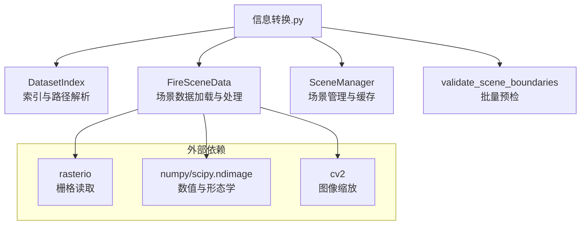
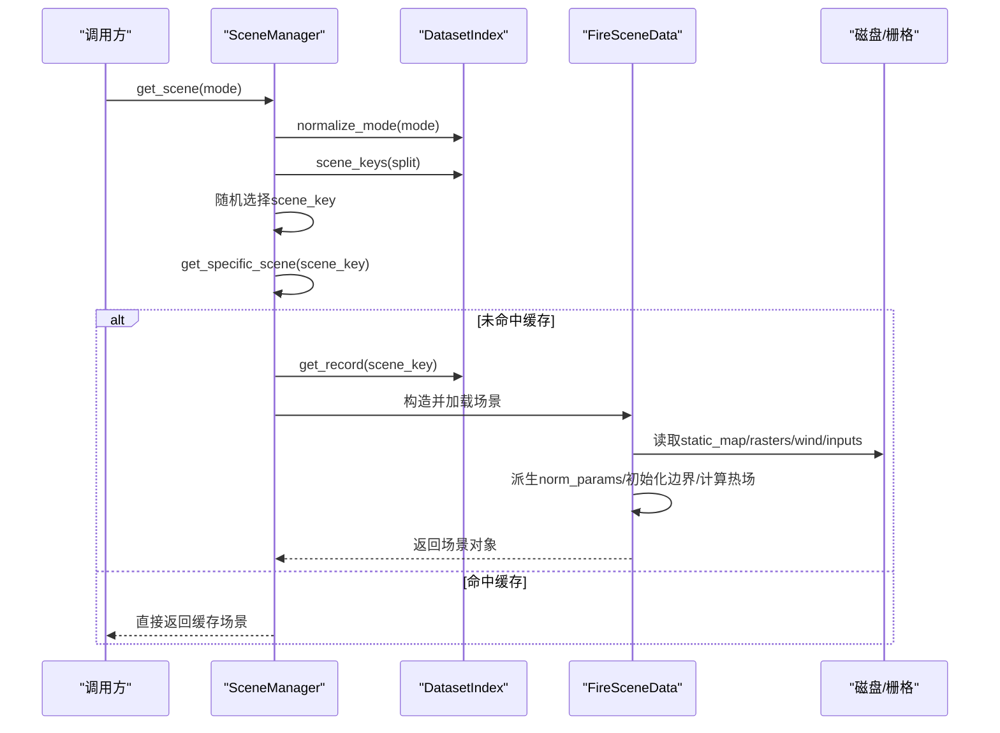
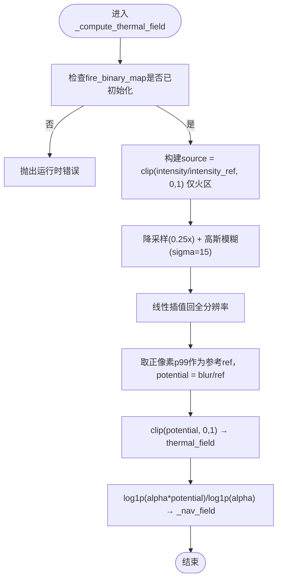
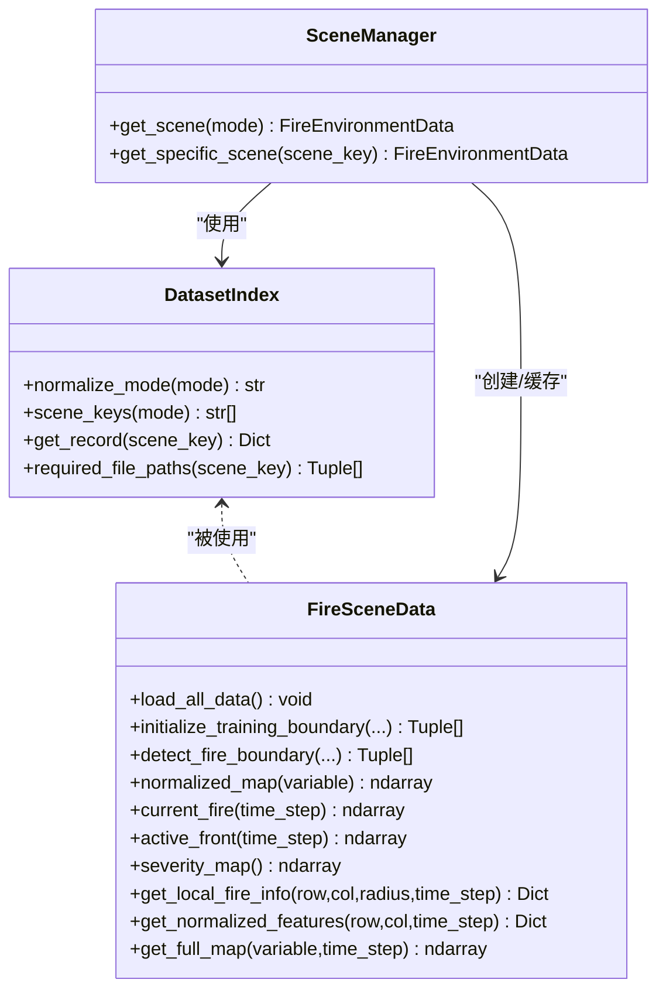

# 数据处理API

<cite>
**本文引用的文件**   
- [信息转换.py](file://environment_variables/environment_variables/信息转换.py)
- [test_fire_scene_data.py](file://environment_variables/environment_variables/test_fire_scene_data.py)
</cite>

## 目录
1. [简介](#简介)
2. [项目结构](#项目结构)
3. [核心组件](#核心组件)
4. [架构总览](#架构总览)
5. [详细组件分析](#详细组件分析)
6. [依赖关系分析](#依赖关系分析)
7. [性能考虑](#性能考虑)
8. [故障排查指南](#故障排查指南)
9. [结论](#结论)
10. [附录：数据加载与使用示例](#附录数据加载与使用示例)

## 简介
本文件为数据处理模块的API文档，聚焦以下能力：
- DatasetIndex：数据集索引管理接口（模式归一化、场景键查询、记录解析等）
- FireSceneData：单场景数据加载与栅格处理（热场计算、边界检测、归一化、局部特征提取等）
- SceneManager：训练/验证/泛化/压力场景管理器（随机取场景、按key获取、跨实例共享缓存）
- 辅助函数：validate_scene_boundaries（批量预检）、诊断工具（热场健康检查）
- FARSITE数据格式解析流程说明与完整使用示例
- 错误处理与性能优化建议

## 项目结构
该模块位于 environment_variables/environment_variables/信息转换.py，提供三类核心类与若干辅助函数。测试用例位于同目录下的 test_fire_scene_data.py。

图表来源
- [信息转换.py:20-196](file://environment_variables/environment_variables/信息转换.py#L20-L196)
- [信息转换.py:219-1275](file://environment_variables/environment_variables/信息转换.py#L219-L1275)
- [信息转换.py:1282-1326](file://environment_variables/environment_variables/信息转换.py#L1282-L1326)
- [信息转换.py:1329-1416](file://environment_variables/environment_variables/信息转换.py#L1329-L1416)

章节来源
- [信息转换.py:20-196](file://environment_variables/environment_variables/信息转换.py#L20-L196)
- [信息转换.py:219-1275](file://environment_variables/environment_variables/信息转换.py#L219-L1275)
- [信息转换.py:1282-1326](file://environment_variables/environment_variables/信息转换.py#L1282-L1326)
- [信息转换.py:1329-1416](file://environment_variables/environment_variables/信息转换.py#L1329-L1416)

## 核心组件
- DatasetIndex：基于 dataset_index.json 的索引管理，负责模式别名映射、场景键列表、绝对路径解析、必需文件清单生成。
- FireSceneData：加载单个FARSITE场景，完成静态地图与动态栅格加载、风场推导、归一化参数派生、初始边界初始化、热场计算、边界检测、局部邻域与特征提取。
- SceneManager：按训练/验证/泛化/压力划分随机或指定获取场景，内部维护跨实例共享的场景缓存，避免重复IO与计算。
- validate_scene_boundaries：对一批场景进行预检，校验必需文件存在性、t=0边界有效性、按面积百分比的初始边界有效性。

章节来源
- [信息转换.py:20-196](file://environment_variables/environment_variables/信息转换.py#L20-L196)
- [信息转换.py:219-1275](file://environment_variables/environment_variables/信息转换.py#L219-L1275)
- [信息转换.py:1282-1326](file://environment_variables/environment_variables/信息转换.py#L1282-L1326)
- [信息转换.py:1329-1416](file://environment_variables/environment_variables/信息转换.py#L1329-L1416)

## 架构总览
整体数据流从索引到场景对象再到上层环境/训练管线：

图表来源
- [信息转换.py:1282-1326](file://environment_variables/environment_variables/信息转换.py#L1282-L1326)
- [信息转换.py:219-1275](file://environment_variables/environment_variables/信息转换.py#L219-L1275)
- [信息转换.py:20-196](file://environment_variables/environment_variables/信息转换.py#L20-L196)

## 详细组件分析

### DatasetIndex 类（数据索引管理）
职责
- 模式别名归一化：train/validation/generalization/stress/test/eval → 标准split名
- 场景键集合：按split返回scene_key列表
- 记录解析：将相对路径转换为绝对路径，补充metadata_abs、rasters_abs、scene_dir_abs等
- 必需文件清单：根据record生成所需文件路径列表（metadata、static_map、核心栅格、向量、输入、报告等）

关键方法
- normalize_mode(mode): 将任意模式字符串标准化为内置split名；未知模式抛出异常
- scene_keys(mode): 返回对应split的所有scene_key；空集合抛异常
- get_record(scene_key): 返回包含绝对路径的完整记录字典；未知key抛异常
- required_file_paths(scene_key): 返回(标签, Path)列表，便于预检缺失文件

错误处理
- 找不到dataset_index.json：FileNotFoundError
- 未知mode：ValueError
- 未知scene_key：KeyError
- split无场景：ValueError

章节来源
- [信息转换.py:20-196](file://environment_variables/environment_variables/信息转换.py#L20-L196)

### FireSceneData 类（场景数据加载与栅格处理）
职责
- 加载静态多波段地图（DEM、坡度、坡向、燃料模型、冠层属性等）
- 加载核心栅格（强度、火焰长度、时间、蔓延速率）与可选扩展栅格（蔓延方向、单位面积热量、树冠火）
- 推导风场（优先读wind栅格，否则从weather_stream或metadata推断）
- 派生归一化参数（分位数/极值策略，含dem/slope/wind等）
- 初始化训练边界（支持按面积百分比选取初始燃烧区域）
- 计算热场（语义重建：强度→高斯模糊→稳健归一化→导航势场）
- 边界检测与活跃前沿提取
- 局部邻域与特征提取（热力梯度、风向影响、严重度图、单元格信息等）

关键方法与属性
- load_all_data(): 顺序加载static_map、核心栅格、可选栅格、风场，校验形状一致性，打印统计
- initialize_training_boundary(init_percentile=None, init_area_percent=None): 设置训练起始边界；若为空则标记场景无效并抛异常
- detect_fire_boundary(time_step=0, fire_threshold=None, init_percentile=None, init_area_percent=None, start_sim_time=None): 基于阈值和时间切片得到边界点集；支持按面积百分比裁剪
- normalized_map(variable): 按派生参数归一化输出[0,1]张量；支持dem/slope/wind_speed特殊分支
- _compute_thermal_field(): 方案C热场重建，产出thermal_field与_nav_field（log压缩）
- current_fire(time_step)/active_front(time_step): 当前火场二值掩码与活跃前沿
- severity_map(): 多指标加权严重度图
- get_local_fire_info(row,col,radius,time_step): 圆形邻域内火情统计（数量、边界、均值/最大值、最近距离、方向）
- get_normalized_features(row,col,time_step): 单元级归一化特征字典
- get_full_map(variable,time_step): 按变量与时步返回二维数组副本
- boundary_points/boundary_points_cache/_boundary_points_at: 边界点访问器

数据结构与复杂度
- data: Dict[str, np.ndarray]，存储各栅格；空间O(HW×B)，B为波段数
- norm_params: Dict[str, float]，每场景一次派生，时间O(BHW)
- thermal_field/nav_field: O(HW)
- 边界检测：形态学腐蚀+差分，时间O(HW)

错误处理
- 缺少static_map或核心栅格：FileNotFoundError
- 栅格形状不一致：RuntimeError
- 无法计算热场（缺火场或强度）：RuntimeError
- 训练边界为空：InvalidSceneError

章节来源
- [信息转换.py:219-1275](file://environment_variables/environment_variables/信息转换.py#L219-L1275)

#### 热场计算流程图

图表来源
- [信息转换.py:759-819](file://environment_variables/environment_variables/信息转换.py#L759-L819)

### SceneManager 类（场景管理器）
职责
- 按split随机或指定获取场景
- 跨所有实例共享场景缓存，避免重复IO与计算
- 暴露get_scene/get_specific_scene两个入口

关键方法
- get_scene(mode="train"): 归一化mode后随机选一个scene_key，再调用get_specific_scene
- get_specific_scene(scene_key): 若缓存未命中则通过DatasetIndex.get_record创建FireEnvironmentData并缓存

注意
- 缓存为类级共享_dict_，在评估阶段可显著降低重复开销

章节来源
- [信息转换.py:1282-1326](file://environment_variables/environment_variables/信息转换.py#L1282-L1326)

### 辅助函数
- validate_scene_boundaries(base_dir, scene_keys=None, splits=None, init_percentile=5.0, init_area_percent=None, verbose=True): 
  - 遍历场景，检查必需文件是否存在
  - 构造场景对象，统计t=0边界点数
  - 如指定init_area_percent，进一步统计按面积百分比的初始边界点数与实际占比
  - 汇总结果并抛出InvalidSceneError（当发现无效场景）

章节来源
- [信息转换.py:1329-1416](file://environment_variables/environment_variables/信息转换.py#L1329-L1416)

## 依赖关系分析

图表来源
- [信息转换.py:20-196](file://environment_variables/environment_variables/信息转换.py#L20-L196)
- [信息转换.py:219-1275](file://environment_variables/environment_variables/信息转换.py#L219-L1275)
- [信息转换.py:1282-1326](file://environment_variables/environment_variables/信息转换.py#L1282-L1326)

章节来源
- [信息转换.py:20-196](file://environment_variables/environment_variables/信息转换.py#L20-L196)
- [信息转换.py:219-1275](file://environment_variables/environment_variables/信息转换.py#L219-L1275)
- [信息转换.py:1282-1326](file://environment_variables/environment_variables/信息转换.py#L1282-L1326)

## 性能考虑
- 场景缓存：SceneManager使用类级共享缓存，避免多次evaluate时重复加载与归一化参数计算
- 栅格I/O：优先复用已有shape与transform，减少重采样；wind字段缺失时采用广播填充
- 热场计算：先降采样再高斯模糊，最后上采样，兼顾平滑效果与计算效率
- 归一化参数：按场景分位数/极值派生，避免全局扫描带来的额外开销
- 内存占用：data中保存多波段栅格，建议在批处理中按需释放或限制并发场景数

## 故障排查指南
常见问题与定位
- FileNotFoundError: dataset_index.json不存在或路径解析失败
  - 确认data_dir指向正确目录，且index_name存在
- KeyError: Unknown scene_key
  - 检查dataset_index.json中的scenes与splits配置
- ValueError: Unknown scene mode / No scenes configured for split
  - 检查传入mode是否在MODE_ALIASES中，以及对应split是否有场景
- RuntimeError: Raster shape mismatch / Wind field shape mismatch
  - 确保所有栅格与static_map具有相同H×W
- InvalidSceneError: t=0边界为空或按面积百分比初始边界为空
  - 调整fire_threshold/init_area_percent，或检查time栅格与intensity栅格质量

章节来源
- [信息转换.py:20-196](file://environment_variables/environment_variables/信息转换.py#L20-L196)
- [信息转换.py:219-1275](file://environment_variables/environment_variables/信息转换.py#L219-L1275)
- [信息转换.py:1329-1416](file://environment_variables/environment_variables/信息转换.py#L1329-L1416)

## 结论
该数据处理模块围绕“索引—场景—管理”三层设计，提供了完整的FARSITE场景加载、栅格预处理、热场语义重建与边界检测能力。配合SceneManager的共享缓存机制，可在大规模评估与训练中显著降低IO与计算成本。通过validate_scene_boundaries可进行快速的数据完整性与可用性自检，保障训练稳定性。

## 附录：数据加载与使用示例
以下为端到端使用流程（不展示具体代码内容，仅提供步骤与路径引用）：

- 初始化索引与管理器
  - 使用DatasetIndex(data_dir)加载dataset_index.json
  - 使用SceneManager(base_dir)创建场景管理器
  - 参考：[信息转换.py:20-196](file://environment_variables/environment_variables/信息转换.py#L20-L196)、[信息转换.py:1282-1326](file://environment_variables/environment_variables/信息转换.py#L1282-L1326)

- 获取场景
  - 随机场景：manager.get_scene("train")
  - 指定场景：manager.get_specific_scene("train_area001_scenario001")
  - 参考：[信息转换.py:1282-1326](file://environment_variables/environment_variables/信息转换.py#L1282-L1326)

- 场景数据加载与预处理
  - 自动加载static_map、核心栅格、可选栅格、风场，派生norm_params
  - 参考：[信息转换.py:639-682](file://environment_variables/environment_variables/信息转换.py#L639-L682)

- 初始化训练边界
  - 默认t=0边界：scene.initialize_training_boundary()
  - 按面积百分比：scene.initialize_training_boundary(init_area_percent=5.0)
  - 参考：[信息转换.py:698-721](file://environment_variables/environment_variables/信息转换.py#L698-L721)

- 热场与边界检测
  - 热场：scene._compute_thermal_field()（构造时自动执行）
  - 边界点：scene.detect_fire_boundary(time_step=0, init_area_percent=...)
  - 参考：[信息转换.py:759-819](file://environment_variables/environment_variables/信息转换.py#L759-L819)、[信息转换.py:821-887](file://environment_variables/environment_variables/信息转换.py#L821-L887)

- 归一化与特征提取
  - 整图归一化：scene.normalized_map("intensity")
  - 单元特征：scene.get_normalized_features(row, col, time_step)
  - 参考：[信息转换.py:616-637](file://environment_variables/environment_variables/信息转换.py#L616-L637)、[信息转换.py:1187-1234](file://environment_variables/environment_variables/信息转换.py#L1187-L1234)

- 局部火情信息
  - 圆形邻域统计：scene.get_local_fire_info(row, col, radius, time_step)
  - 参考：[信息转换.py:1070-1123](file://environment_variables/environment_variables/信息转换.py#L1070-L1123)

- 批量预检
  - 运行validate_scene_boundaries(base_dir="./dataset", verbose=True)
  - 参考：[信息转换.py:1329-1416](file://environment_variables/environment_variables/信息转换.py#L1329-L1416)

- 单元测试参考
  - 参考：[test_fire_scene_data.py:28-37](file://environment_variables/environment_variables/test_fire_scene_data.py#L28-L37)