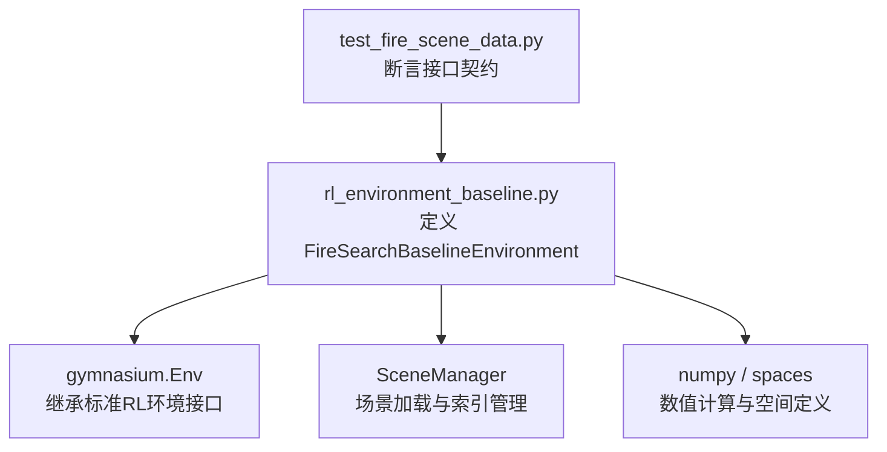
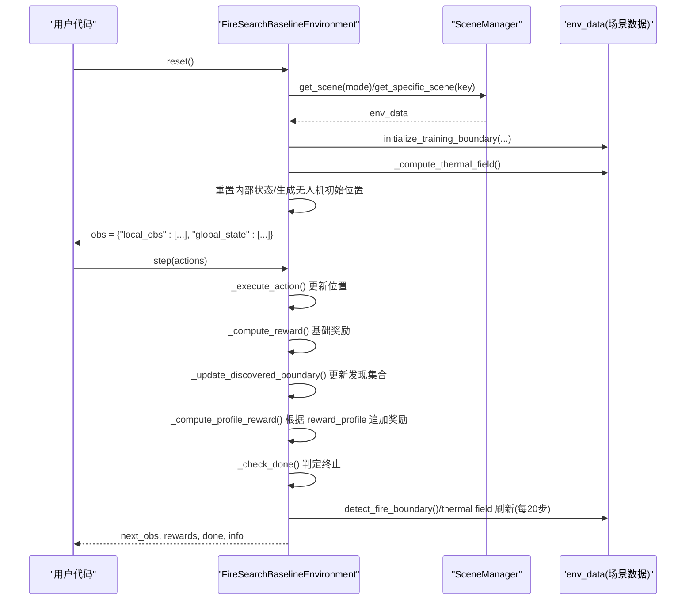
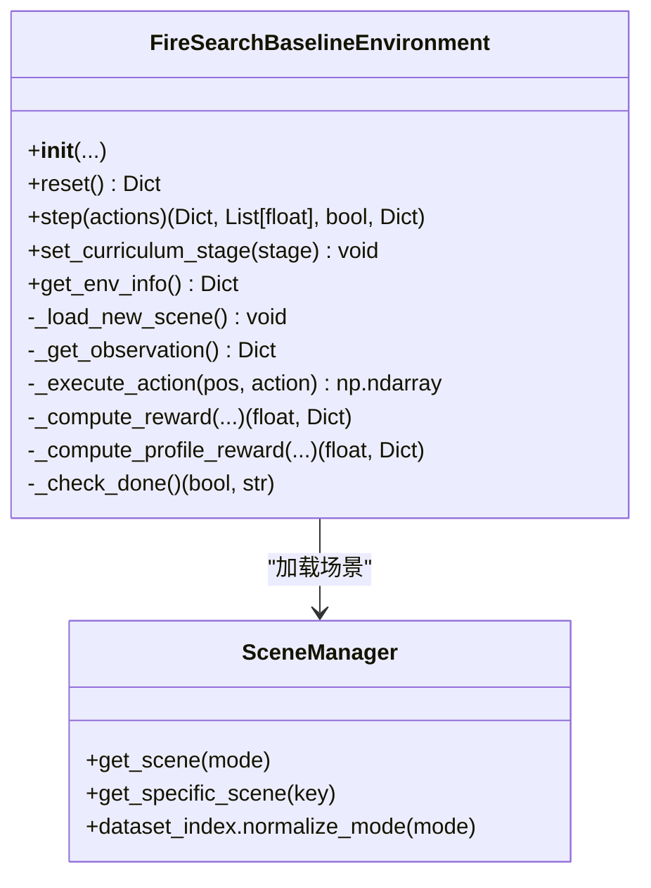

# 环境接口API

<cite>
**本文引用的文件**   
- [rl_environment_baseline.py](file://environment_variables/environment_variables/rl_environment_baseline.py)
- [test_fire_scene_data.py](file://environment_variables/environment_variables/test_fire_scene_data.py)
</cite>

## 目录
1. [简介](#简介)
2. [项目结构](#项目结构)
3. [核心组件](#核心组件)
4. [架构总览](#架构总览)
5. [详细组件分析](#详细组件分析)
6. [依赖关系分析](#依赖关系分析)
7. [性能考量](#性能考量)
8. [故障排查指南](#故障排查指南)
9. [结论](#结论)
10. [附录：使用示例与调试输出](#附录使用示例与调试输出)

## 简介
本文件为 FireSearchBaselineEnvironment 类的完整 API 文档，面向多无人机火场边界搜索的基线环境。该环境遵循 gymnasium 接口，提供去中心化的局部观测与集中式全局状态，支持多种观测配置（observation_profile）与奖励配置（reward_profile），并内置课程学习阶段控制、电池消耗、热信号探测与边界覆盖率评估等机制。

## 项目结构
- 环境与数据模块位于 environment_variables/environment_variables 目录下，其中 rl_environment_baseline.py 定义了 FireSearchBaselineEnvironment 类及其全部行为。
- 测试用例 test_fire_scene_data.py 验证了构造参数、观测维度、奖励分解键以及元数据参数注入等行为，可作为接口契约的权威参考。

图表来源
- [rl_environment_baseline.py:20-131](file://environment_variables/environment_variables/rl_environment_baseline.py#L20-L131)
- [test_fire_scene_data.py:133-242](file://environment_variables/environment_variables/test_fire_scene_data.py#L133-L242)

章节来源
- [rl_environment_baseline.py:1-131](file://environment_variables/environment_variables/rl_environment_baseline.py#L1-L131)
- [test_fire_scene_data.py:133-242](file://environment_variables/environment_variables/test_fire_scene_data.py#L133-L242)

## 核心组件
- 类名：FireSearchBaselineEnvironment
- 父类：gymnasium.Env
- 关键能力：
  - 初始化与场景加载（含固定场景或按模式随机选择）
  - 观测构建（local_obs 与 global_state）
  - 动作执行（离散动作集）
  - 奖励计算（基础奖励 + 配置化奖励剖面）
  - 终止条件（任务完成、步数上限、电量耗尽）
  - 课程学习阶段切换与目标阈值
  - 信息收集（info 字典包含丰富诊断字段）

章节来源
- [rl_environment_baseline.py:20-131](file://environment_variables/environment_variables/rl_environment_baseline.py#L20-L131)

## 架构总览
下图展示了环境在 reset 与 step 两个关键流程中的调用链路与数据流向。

图表来源
- [rl_environment_baseline.py:331-360](file://environment_variables/environment_variables/rl_environment_baseline.py#L331-L360)
- [rl_environment_baseline.py:842-992](file://environment_variables/environment_variables/rl_environment_baseline.py#L842-L992)
- [rl_environment_baseline.py:159-194](file://environment_variables/environment_variables/rl_environment_baseline.py#L159-L194)

## 详细组件分析

### 构造函数 __init__()
- 作用：创建环境实例，加载场景，设置动作空间与观测空间，初始化内部状态与常量。
- 参数与默认值（类型与含义）：
  - data_dir: str，默认 "./dataset"，数据集根目录路径
  - num_drones: int，默认 2，无人机数量
  - vision_radius: int，默认 16，视野半径（单元格）
  - max_steps: int，默认 600，最大步数
  - use_metadata_uav_params: bool，默认 False，是否从场景元数据覆盖 vision_radius/max_steps
  - observation_profile: str，默认 "baseline"，观测特征配置
  - reward_profile: str，默认 "boundary_coverage"，奖励配置
  - curriculum_stage: int，默认 1，课程阶段（1/2/3）
  - mode: str，默认 "train"，场景划分模式（如 train/val/test）
  - fixed_scene_key: Optional[str]，默认 None，固定场景键
  - scene_keys: Optional[List[str]]，默认 None，指定场景键列表
  - init_percentile: Optional[float]，默认 5.0，初始边界百分比百分位
  - init_area_percent: Optional[float]，默认 None，初始边界面积百分比（若提供则优先于 init_percentile）
  - stage2_target: float，默认 0.15，第二阶段覆盖率目标
  - stage3_target: float，默认 0.60，第三阶段覆盖率目标
  - stage3_near_prob: float，默认 0.25，第三阶段近端生成概率
- 关键副作用：
  - 设置 action_space 为 Discrete(5)，动作映射见 step 部分
  - 设置 observation_space 为 Dict{"local_obs": Tuple[Box(local_obs_dim)], "global_state": Box(global_state_dim)}
  - 初始化内部状态：步计数、无人机位置/电量/动量、已访问/已发现集合、热力场缓存等
  - 打印初始化日志（包含模式、观测/全局维度、profile 名称）

章节来源
- [rl_environment_baseline.py:49-157](file://environment_variables/environment_variables/rl_environment_baseline.py#L49-L157)

### 观测空间与 reset()
- 返回格式：obs = {"local_obs": List[np.ndarray], "global_state": np.ndarray}
- local_obs：长度为 num_drones 的列表，每个元素形状为 (local_obs_dim,)，dtype=float32
- global_state：形状为 (global_state_dim,)，dtype=float32
- 维度定义（由 observation_profile 决定）：
  - baseline: local_obs_dim=17, global_state_dim=19
  - static_terrain: local_obs_dim=24, global_state_dim=19
  - dynamic_front: local_obs_dim=23, global_state_dim=19
  - risk_aware: local_obs_dim=20, global_state_dim=19
- reset() 行为：
  - 加载新场景（固定场景或按 mode 随机选择）
  - 初始化训练边界点与热力场
  - 重置所有内部状态与无人机初始位置（可能靠近边界或远离火源，取决于课程阶段与概率）
  - 返回当前观测

章节来源
- [rl_environment_baseline.py:24-35](file://environment_variables/environment_variables/rl_environment_baseline.py#L24-L35)
- [rl_environment_baseline.py:108-131](file://environment_variables/environment_variables/rl_environment_baseline.py#L108-L131)
- [rl_environment_baseline.py:331-360](file://environment_variables/environment_variables/rl_environment_baseline.py#L331-L360)
- [test_fire_scene_data.py:158-189](file://environment_variables/environment_variables/test_fire_scene_data.py#L158-L189)

### 动作空间与 step()
- 动作空间：Discrete(5)
  - 0: 下移（y+1）
  - 1: 上移（y-1）
  - 2: 左移（x-1）
  - 3: 右移（x+1）
  - 4: 停留不动
- 返回值：(next_obs, rewards, done, info)
  - next_obs：同 reset() 返回的观测结构
  - rewards：长度为 num_drones 的浮点数列表，表示各无人机的单步奖励
  - done：布尔值，表示回合是否结束
  - info：字典，包含丰富的诊断与统计信息（见下文“信息字段”）
- 状态更新机制（step 内主要逻辑）：
  - 执行动作并裁剪到网格边界
  - 更新无人机位置与动量
  - 根据移动方向与环境风场计算能耗，扣除电池；静止也有少量耗电
  - 记录已访问单元格
  - 检测热信号（分层判定：视野内真实火点或热势阈值）
  - 更新已发现边界点与可见区域掩码
  - 根据 reward_profile 计算附加奖励（前沿探测、严重度加权、探索平衡等）
  - 每20步刷新火场边界与热力场，更新边界集合与重心
  - 判定终止条件（任务完成、步数上限、电量耗尽）
  - 根据终止原因施加终端奖励/惩罚，并累计 episode 奖励分解
  - 填充 info 字典并返回

章节来源
- [rl_environment_baseline.py:660-669](file://environment_variables/environment_variables/rl_environment_baseline.py#L660-L669)
- [rl_environment_baseline.py:842-992](file://environment_variables/environment_variables/rl_environment_baseline.py#L842-L992)
- [test_fire_scene_data.py:133-157](file://environment_variables/environment_variables/test_fire_scene_data.py#L133-L157)

### 观测特征构成（local_obs 与 global_state）
- local_obs 组成（以 baseline 为例，共17维）：
  - 归一化坐标（y/x）、电池占比、强度归一化、视野内火点密度、距地图中心距离、风速归一化、风向正弦/余弦、DEM归一化、坡度归一化、热梯度(y,x)、动量(y,x)、相机指向(y,x)
  - 其他 profile 会在末尾拼接额外特征：
    - static_terrain：坡向(sin/cos)、燃料模型、冠层覆盖/高度/底高/体密度等静态地形特征
    - dynamic_front：视野内火/前沿比例、边界点密度、平均/最大强度归一化、最近火点距离归一化
    - risk_aware：严重度图当前位置/均值/最大值
- global_state 组成（19维）：
  - 覆盖率、平均/最小电池、团队质心与散布、平均距火距离、步数进度、已访问密度、课程阶段、平均风速/高程、已发现边界特征、低电量指示、无人机数量、占位符、覆盖率梯度、未探索密度

章节来源
- [rl_environment_baseline.py:565-658](file://environment_variables/environment_variables/rl_environment_baseline.py#L565-L658)
- [rl_environment_baseline.py:521-563](file://environment_variables/environment_variables/rl_environment_baseline.py#L521-L563)

### 奖励剖面（reward_profile）
- 可用值：
  - boundary_coverage（默认）
  - front_detection
  - severity_weighted
  - exploration_balanced
- 行为要点：
  - boundary_coverage：基于新发现的边界点贡献覆盖率增益奖励，并对重复访问、空闲、过近等施加惩罚
  - front_detection：对首次发现的前沿点按比例给予奖励
  - severity_weighted：对新可见区域的严重度均值/最大值加权奖励
  - exploration_balanced：基于新可见区域面积与重复访问惩罚的探索奖励
- 奖励分解键（episode 级累计，done=True 时通过 info["reward_breakdown"] 返回）：
  - r_discover, r_coverage_gain, r_area_gain, r_boundary, r_front, r_severity, r_explore, r_search, r_penalty, r_terminal
- 注意：不同 profile 会写入不同的分解键，但始终保证上述键存在且为浮点数

章节来源
- [rl_environment_baseline.py:30-47](file://environment_variables/environment_variables/rl_environment_baseline.py#L30-L47)
- [rl_environment_baseline.py:692-806](file://environment_variables/environment_variables/rl_environment_baseline.py#L692-L806)
- [test_fire_scene_data.py:191-220](file://environment_variables/environment_variables/test_fire_scene_data.py#L191-L220)

### 观测剖面（observation_profile）
- 可用值：
  - baseline
  - static_terrain
  - dynamic_front
  - risk_aware
- 影响：
  - local_obs_dim 与 global_state_dim 的取值
  - local_obs 末尾拼接的特征子集
- 校验：
  - 非法值将抛出 ValueError，提示期望的可选值集合

章节来源
- [rl_environment_baseline.py:24-35](file://environment_variables/environment_variables/rl_environment_baseline.py#L24-L35)
- [rl_environment_baseline.py:208-226](file://environment_variables/environment_variables/rl_environment_baseline.py#L208-L226)
- [test_fire_scene_data.py:158-189](file://environment_variables/environment_variables/test_fire_scene_data.py#L158-L189)

### 课程学习与终止条件
- 课程阶段（curriculum_stage）：
  - 1：快速达成小目标（例如发现若干边界点即完成）
  - 2/3：达到覆盖率目标（stage2_target/stage3_target）
  - 近端生成概率随阶段变化（stage3_near_prob）
- 终止条件：
  - mission_complete：达到阶段目标
  - max_steps_reached：超过最大步数
  - battery_depleted：任一无人机电量耗尽
- 终端奖励/惩罚：
  - 完成任务：根据效率获得终端奖励
  - 超时：根据覆盖率缺口施加惩罚（零覆盖率额外惩罚）
  - 电量耗尽：固定惩罚

章节来源
- [rl_environment_baseline.py:824-841](file://environment_variables/environment_variables/rl_environment_baseline.py#L824-L841)
- [rl_environment_baseline.py:943-962](file://environment_variables/environment_variables/rl_environment_baseline.py#L943-L962)
- [rl_environment_baseline.py:994-996](file://environment_variables/environment_variables/rl_environment_baseline.py#L994-L996)

### 信息字段（info）
- 常用字段：
  - step, boundary_coverage, observable_progress, avg_distance_to_fire, done_reason
  - scene_id, scene_key, observation_profile, reward_profile
  - vision_radius, sensor_radius_cells, max_steps
  - first_heat_step, first_boundary_step, timeout, zero_coverage_timeout
  - spawn_modes, reward_breakdown（仅在 done=True 时非空）
  - stage_target（当前阶段目标覆盖率）
- 用途：用于训练日志、可视化与调试分析

章节来源
- [rl_environment_baseline.py:966-990](file://environment_variables/environment_variables/rl_environment_baseline.py#L966-L990)

## 依赖关系分析
- 外部依赖：
  - gymnasium：标准 RL 环境接口与空间定义
  - numpy：数值计算与数组操作
  - 自定义数据模块（信息转换）：通过 importlib 动态导入 SceneManager，负责场景加载、边界检测、热力场计算等
- 内部耦合：
  - 环境类与 SceneManager/env_data 强耦合，负责场景生命周期与物理/热力属性
  - 观测与奖励逻辑均围绕 env_data 提供的栅格数据与归一化参数进行

图表来源
- [rl_environment_baseline.py:20-131](file://environment_variables/environment_variables/rl_environment_baseline.py#L20-L131)
- [rl_environment_baseline.py:159-194](file://environment_variables/environment_variables/rl_environment_baseline.py#L159-L194)

章节来源
- [rl_environment_baseline.py:1-131](file://environment_variables/environment_variables/rl_environment_baseline.py#L1-L131)

## 性能考量
- 视野窗口与网格裁剪：通过圆形窗口与掩码避免全图扫描，降低 O(HW) 开销
- 热力场与边界检测：每20步刷新一次，平衡精度与性能
- 奖励计算：增量式更新已发现集合与掩码，避免重复计算
- 内存占用：discovered_area_mask 与 confirmed_boundary_mask 为布尔矩阵，建议保持与网格尺寸一致

[本节为通用指导，不直接分析具体文件]

## 故障排查指南
- 常见异常：
  - 传入非法 observation_profile 或 reward_profile 将触发 ValueError，请检查字符串是否在允许集合中
- 调试信息：
  - 初始化时会打印模式、观测/全局维度与 profile 名称
  - set_curriculum_stage 会打印阶段切换信息
  - info 中包含大量诊断字段，可用于定位问题（如 first_heat_step、first_boundary_step、spawn_modes、reward_breakdown）
- 典型问题定位：
  - 观测维度不符：核对 observation_profile 与 expected_dims 表
  - 奖励分解缺失键：确认 reward_profile 与 REWARD_BREAKDOWN_KEYS 一致性
  - 场景加载失败：检查 data_dir 与 fixed_scene_key 是否正确

章节来源
- [rl_environment_baseline.py:208-226](file://environment_variables/environment_variables/rl_environment_baseline.py#L208-L226)
- [rl_environment_baseline.py:151-157](file://environment_variables/environment_variables/rl_environment_baseline.py#L151-L157)
- [rl_environment_baseline.py:994-996](file://environment_variables/environment_variables/rl_environment_baseline.py#L994-L996)
- [rl_environment_baseline.py:966-990](file://environment_variables/environment_variables/rl_environment_baseline.py#L966-L990)

## 结论
FireSearchBaselineEnvironment 提供了完整的 gymnasium 兼容接口，具备灵活的观测与奖励配置、清晰的终止条件与丰富的诊断信息，适合用于多无人机火场边界搜索任务的基线研究与算法对比。通过合理的 observation_profile 与 reward_profile 组合，可针对不同训练阶段与目标进行调优。

[本节为总结性内容，不直接分析具体文件]

## 附录：使用示例与调试输出

### 基本使用模式（无代码片段，仅步骤说明）
- 初始化环境：
  - 指定 data_dir、num_drones、vision_radius、max_steps、observation_profile、reward_profile 等参数
  - 可选择 use_metadata_uav_params 以从场景元数据覆盖传感器半径与最大步数
- 启动回合：
  - 调用 reset() 获取初始观测
  - 循环调用 step([action]*num_drones) 直到 done=True
- 读取结果：
  - 从 info 中读取 boundary_coverage、done_reason、reward_breakdown 等指标
  - 从 rewards 中查看各无人机单步奖励

章节来源
- [rl_environment_baseline.py:49-157](file://environment_variables/environment_variables/rl_environment_baseline.py#L49-L157)
- [rl_environment_baseline.py:331-360](file://environment_variables/environment_variables/rl_environment_baseline.py#L331-L360)
- [rl_environment_baseline.py:842-992](file://environment_variables/environment_variables/rl_environment_baseline.py#L842-L992)

### 调试输出格式
- 初始化日志：
  - 包含模式、本地观测维度、全局状态维度、observation_profile、reward_profile
- 阶段切换日志：
  - 打印新的 curriculum_stage 值
- 运行时 info：
  - 包含 step、coverage、done_reason、scene_key、observation/reward profile、vision/sensor 半径、时间戳（first_heat/boundary_step）、timeout 标志、reward_breakdown 等

章节来源
- [rl_environment_baseline.py:151-157](file://environment_variables/environment_variables/rl_environment_baseline.py#L151-L157)
- [rl_environment_baseline.py:994-996](file://environment_variables/environment_variables/rl_environment_baseline.py#L994-L996)
- [rl_environment_baseline.py:966-990](file://environment_variables/environment_variables/rl_environment_baseline.py#L966-L990)