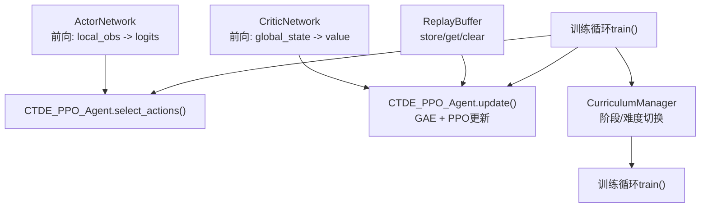
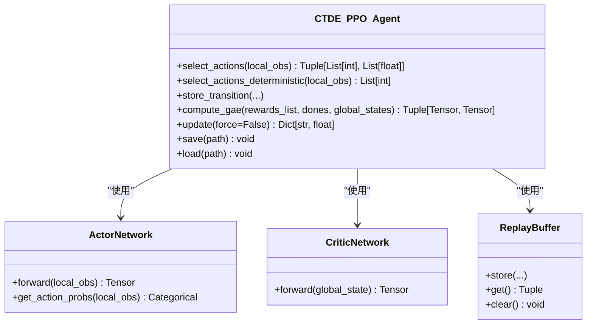
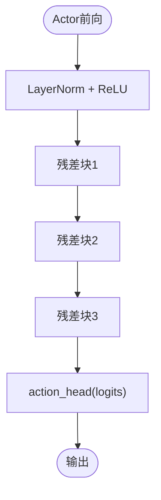
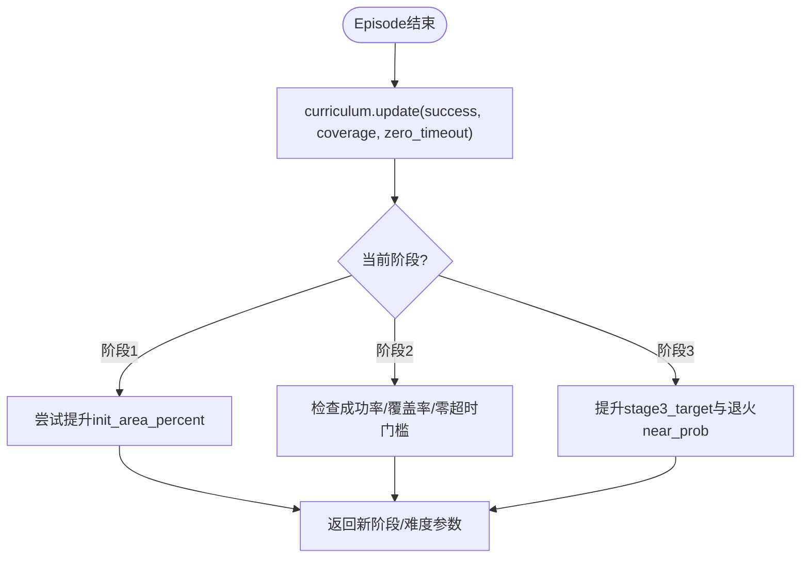
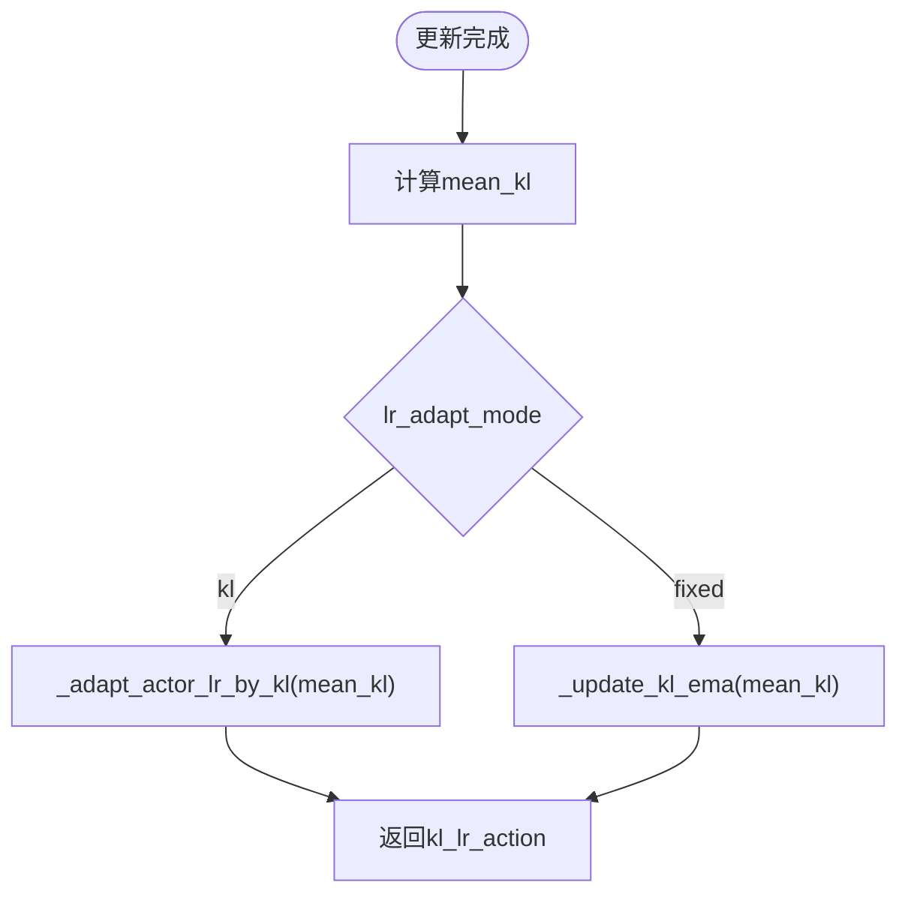
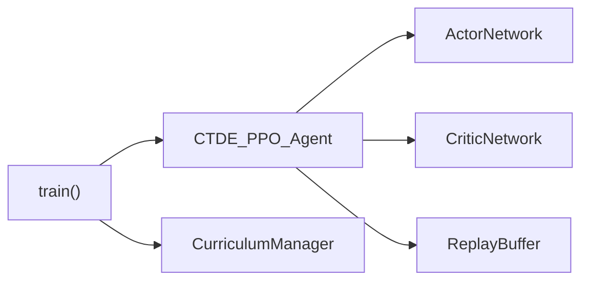

# 训练接口API

<cite>
**本文引用的文件**   
- [ctde_ppo_baseline_train.py](file://environment_variables/environment_variables/ctde_ppo_baseline_train.py)
</cite>

## 目录
1. [简介](#简介)
2. [项目结构](#项目结构)
3. [核心组件](#核心组件)
4. [架构总览](#架构总览)
5. [详细组件分析](#详细组件分析)
6. [依赖关系分析](#依赖关系分析)
7. [性能与稳定性考虑](#性能与稳定性考虑)
8. [故障排查指南](#故障排查指南)
9. [结论](#结论)
10. [附录：训练循环与日志格式](#附录训练循环与日志格式)

## 简介
本文件面向CTDE-PPO训练系统的API文档，聚焦以下能力：
- CTDE_PPO_Agent类的核心训练接口：select_actions()动作选择、update()参数更新机制
- ActorNetwork与CriticNetwork的前向传播接口与参数配置
- ReplayBuffer经验回放缓冲区的存储与采样接口
- CurriculumManager课程学习管理器的阶段切换与难度调整逻辑
- 自适应学习率调整的KL散度计算与策略
- 完整训练循环示例与回调使用模式
- 训练监控指标的计算与日志记录格式

## 项目结构
该仓库包含一个完整的CTDE-PPO基线训练脚本，核心实现集中在单一文件中。关键模块包括：
- 网络模型：ActorNetwork（策略）、CriticNetwork（价值）
- 智能体：CTDE_PPO_Agent（封装PPO训练流程）
- 经验回放：ReplayBuffer（轨迹收集）
- 课程学习：CurriculumManager（动态难度与阶段控制）
- 训练主循环：train()（环境交互、日志、评估、保存）



图表来源
- [ctde_ppo_baseline_train.py:460-534](file://environment_variables/environment_variables/ctde_ppo_baseline_train.py#L460-L534)
- [ctde_ppo_baseline_train.py:537-566](file://environment_variables/environment_variables/ctde_ppo_baseline_train.py#L537-L566)
- [ctde_ppo_baseline_train.py:569-757](file://environment_variables/environment_variables/ctde_ppo_baseline_train.py#L569-L757)
- [ctde_ppo_baseline_train.py:758-1014](file://environment_variables/environment_variables/ctde_ppo_baseline_train.py#L758-L1014)
- [ctde_ppo_baseline_train.py:1278-1600](file://environment_variables/environment_variables/ctde_ppo_baseline_train.py#L1278-L1600)

章节来源
- [ctde_ppo_baseline_train.py:460-534](file://environment_variables/environment_variables/ctde_ppo_baseline_train.py#L460-L534)
- [ctde_ppo_baseline_train.py:537-566](file://environment_variables/environment_variables/ctde_ppo_baseline_train.py#L537-L566)
- [ctde_ppo_baseline_train.py:569-757](file://environment_variables/environment_variables/ctde_ppo_baseline_train.py#L569-L757)
- [ctde_ppo_baseline_train.py:758-1014](file://environment_variables/environment_variables/ctde_ppo_baseline_train.py#L758-L1014)
- [ctde_ppo_baseline_train.py:1278-1600](file://environment_variables/environment_variables/ctde_ppo_baseline_train.py#L1278-L1600)

## 核心组件
本节概述各核心类及其对外暴露的API要点。

- ActorNetwork
  - 输入：本地观测张量
  - 输出：动作对数几率（logits），供离散动作分布采样
  - 提供get_action_probs(local_obs)返回分类分布对象
- CriticNetwork
  - 输入：全局状态张量
  - 输出：标量价值估计
- ReplayBuffer
  - store(local_obs, global_state, actions, log_probs, rewards, done)
  - get()返回批量数据
  - clear()清空缓冲区
- CurriculumManager
  - update(success, coverage, zero_coverage_timeout=False)驱动阶段切换与难度调整
  - 属性：current_init_percentile、current_stage3_target、stage3_near_prob
  - get_stage_info()返回当前阶段统计信息
- CTDE_PPO_Agent
  - select_actions(local_obs_list) -> (actions, log_probs)
  - select_actions_deterministic(local_obs_list) -> actions
  - store_transition(...)
  - compute_gae(rewards_list, dones, global_states) -> advantages, returns
  - update(force=False) -> 字典形式的训练指标
  - save()/load()用于模型持久化

章节来源
- [ctde_ppo_baseline_train.py:460-534](file://environment_variables/environment_variables/ctde_ppo_baseline_train.py#L460-L534)
- [ctde_ppo_baseline_train.py:537-566](file://environment_variables/environment_variables/ctde_ppo_baseline_train.py#L537-L566)
- [ctde_ppo_baseline_train.py:569-757](file://environment_variables/environment_variables/ctde_ppo_baseline_train.py#L569-L757)
- [ctde_ppo_baseline_train.py:758-1014](file://environment_variables/environment_variables/ctde_ppo_baseline_train.py#L758-L1014)

## 架构总览
下图展示了从环境交互到参数更新的端到端流程，以及课程管理与KL自适应学习率的集成点。

```mermaid
sequenceDiagram
participant Env as "环境"
participant Agent as "CTDE_PPO_Agent"
participant Actor as "ActorNetwork"
participant Critic as "CriticNetwork"
participant Buffer as "ReplayBuffer"
participant Cur as "CurriculumManager"
Env->>Agent : reset()
loop 每步
Agent->>Actor : get_action_probs(local_obs)
Agent-->>Env : actions
Env-->>Agent : next_obs, rewards, done, info
Agent->>Buffer : store_transition(...)
Agent->>Agent : compute_gae(...)
alt 满足更新条件
Agent->>Critic : forward(global_states)
Agent->>Actor : forward(local_obs)
Agent->>Agent : PPO损失与KL计算
Agent->>Agent : 优化器step()
end
Agent->>Cur : update(success, coverage, ...)
Cur-->>Agent : new_stage / difficulty params
end
```

图表来源
- [ctde_ppo_baseline_train.py:758-1014](file://environment_variables/environment_variables/ctde_ppo_baseline_train.py#L758-L1014)
- [ctde_ppo_baseline_train.py:1278-1600](file://environment_variables/environment_variables/ctde_ppo_baseline_train.py#L1278-L1600)

## 详细组件分析

### CTDE_PPO_Agent类
- 构造参数
  - 学习率与自适应：actor_lr、critic_lr、lr_adapt_mode（fixed/kl）、target_kl、actor_lr_min/max、kl_ema_beta、kl_lr_alpha
  - PPO超参：gamma、gae_lambda、clip_epsilon、entropy_coef、value_coef、max_grad_norm、ppo_epochs、batch_size
  - 设备：device（auto/cpu/cuda）
- 动作选择
  - select_actions(local_obs): 将本地观测转为张量，通过Actor得到分布并采样动作，同时记录log_probs
  - select_actions_deterministic(local_obs): 取argmax作为确定性动作
- 经验存储
  - store_transition(...): 调用ReplayBuffer.store(...)
- GAE计算
  - compute_gae(rewards_list, dones, global_states): 基于Critic预测值计算优势与回报
- 参数更新
  - update(force=False): 
    - 当缓冲区长度不足时直接返回空指标
    - 归一化优势后，按mini-batch迭代进行Critic与Actor的梯度更新
    - 计算近似KL与裁剪比例，并在KL模式下根据mean_kl调整Actor学习率；否则仅维护KL指数移动平均
    - 返回包含actor_loss、critic_loss、entropy、approx_kl、kl_ema、kl_lr_action、clip_fraction、actor_lr、critic_lr等指标的字典
- 模型持久化
  - save(path)/load(path)



图表来源
- [ctde_ppo_baseline_train.py:758-1014](file://environment_variables/environment_variables/ctde_ppo_baseline_train.py#L758-L1014)
- [ctde_ppo_baseline_train.py:460-534](file://environment_variables/environment_variables/ctde_ppo_baseline_train.py#L460-L534)
- [ctde_ppo_baseline_train.py:537-566](file://environment_variables/environment_variables/ctde_ppo_baseline_train.py#L537-L566)

章节来源
- [ctde_ppo_baseline_train.py:758-1014](file://environment_variables/environment_variables/ctde_ppo_baseline_train.py#L758-L1014)

### ActorNetwork与CriticNetwork
- ActorNetwork
  - 前向：多层全连接+层归一化+残差块，最后经action_head输出动作logits
  - get_action_probs(local_obs)：基于logits构建分类分布，支持sample与log_prob
- CriticNetwork
  - 前向：多层全连接+层归一化+残差块，最终value_head输出标量价值
- 权重初始化
  - 线性层采用正交初始化，偏置初始化为0；head层有特定增益



图表来源
- [ctde_ppo_baseline_train.py:460-502](file://environment_variables/environment_variables/ctde_ppo_baseline_train.py#L460-L502)

章节来源
- [ctde_ppo_baseline_train.py:460-534](file://environment_variables/environment_variables/ctde_ppo_baseline_train.py#L460-L534)

### ReplayBuffer
- 接口说明
  - store(local_obs, global_state, actions, log_probs, rewards, done)：追加单步轨迹
  - get()：一次性取出所有历史轨迹列表
  - clear()：清空缓冲区
  - __len__()：返回已存储步数
- 注意
  - 未实现随机采样方法，训练循环中直接使用全部历史数据进行mini-batch遍历

章节来源
- [ctde_ppo_baseline_train.py:537-566](file://environment_variables/environment_variables/ctde_ppo_baseline_train.py#L537-L566)

### CurriculumManager
- 目标
  - 在训练过程中动态提升任务难度，包括初始位置百分位、阶段3成功率目标、近距生成概率等
- 主要接口
  - update(success, coverage, zero_coverage_timeout=False)：依据滑动窗口统计判断是否推进阶段或调整难度
  - current_init_percentile：当前初始面积百分比
  - current_stage3_target：阶段3目标成功率
  - stage3_near_prob：阶段3近距生成概率
  - get_stage_info()：返回当前阶段统计摘要
- 阶段切换与难度调整逻辑
  - 阶段1：逐步提高初始面积百分比，直至达到阈值
  - 阶段2：以成功率和覆盖率门槛推进
  - 阶段3：阶梯式提升目标成功率，并同步退火near_prob，且near_prob退火不超前于目标进度
  - 终末专注：在最后若干回合强制切换到最终目标与最小near_prob



图表来源
- [ctde_ppo_baseline_train.py:569-757](file://environment_variables/environment_variables/ctde_ppo_baseline_train.py#L569-L757)

章节来源
- [ctde_ppo_baseline_train.py:569-757](file://environment_variables/environment_variables/ctde_ppo_baseline_train.py#L569-L757)

### KL散度与自适应学习率
- 近似KL计算
  - 在每次mini-batch更新后，使用ratio与log_ratio计算近似KL均值
- 自适应策略
  - lr_adapt_mode="kl"：根据mean_kl与target_kl比较，按kl_lr_alpha调整actor学习率，并限制在[min,max]范围内
  - lr_adapt_mode="fixed"：仅维护KL指数移动平均（kl_ema），不改变学习率
- 返回指标
  - approx_kl、kl_ema、kl_lr_action（keep/down/up/fixed）



图表来源
- [ctde_ppo_baseline_train.py:888-991](file://environment_variables/environment_variables/ctde_ppo_baseline_train.py#L888-L991)

章节来源
- [ctde_ppo_baseline_train.py:888-991](file://environment_variables/environment_variables/ctde_ppo_baseline_train.py#L888-L991)

## 依赖关系分析
- 外部依赖
  - torch.nn.functional、torch.optim、torch.distributions.Categorical
  - numpy用于数值处理
- 内部耦合
  - CTDE_PPO_Agent强依赖ActorNetwork、CriticNetwork与ReplayBuffer
  - 训练循环train()协调CurriculumManager与环境交互，并将Agent与CurriculumManager的输出写入日志



图表来源
- [ctde_ppo_baseline_train.py:1278-1600](file://environment_variables/environment_variables/ctde_ppo_baseline_train.py#L1278-L1600)
- [ctde_ppo_baseline_train.py:758-1014](file://environment_variables/environment_variables/ctde_ppo_baseline_train.py#L758-L1014)

章节来源
- [ctde_ppo_baseline_train.py:1278-1600](file://environment_variables/environment_variables/ctde_ppo_baseline_train.py#L1278-L1600)
- [ctde_ppo_baseline_train.py:758-1014](file://environment_variables/environment_variables/ctde_ppo_baseline_train.py#L758-L1014)

## 性能与稳定性考虑
- 批大小与子批
  - batch_size决定一次更新所需的最小样本数；mini_batch_size用于内部分片，默认至少为batch_size//8
- 梯度裁剪
  - max_grad_norm用于Actor与Critic的梯度范数裁剪，防止爆炸
- 优势归一化
  - 在update中对advantages进行标准化，提升训练稳定性
- KL约束
  - clip_epsilon限制策略更新幅度；mean_kl与target_kl配合自适应学习率，避免策略突变
- 课程学习
  - 通过阶段性提升难度，帮助模型在复杂场景下稳定收敛

[本节为通用指导，无需具体文件引用]

## 故障排查指南
- 常见问题
  - 缓冲区不足导致无更新：确保episode结束后buffer长度达到batch_size再调用update()
  - KL过大导致学习率频繁下降：适当增大clip_epsilon或降低kl_lr_alpha
  - 阶段无法推进：检查success_rate、coverage与zero_timeout_rate是否达到阈值
- 诊断指标
  - approx_kl、clip_fraction、kl_ema、actor_lr、critic_lr可用于定位不稳定原因
  - reward_breakdown、done_reasons、timeout、zero_coverage_timeout有助于理解失败原因

章节来源
- [ctde_ppo_baseline_train.py:888-991](file://environment_variables/environment_variables/ctde_ppo_baseline_train.py#L888-L991)
- [ctde_ppo_baseline_train.py:1278-1600](file://environment_variables/environment_variables/ctde_ppo_baseline_train.py#L1278-L1600)

## 结论
本API文档梳理了CTDE-PPO训练系统的关键接口与流程，涵盖动作选择、参数更新、经验回放、课程学习与KL自适应学习率。通过合理的超参设置与监控指标，可在多阶段难度下实现稳定的策略学习。

[本节为总结性内容，无需具体文件引用]

## 附录：训练循环与日志格式

### 训练循环示例
- 初始化
  - 创建CurriculumManager与FireSearchBaselineEnvironment
  - 实例化CTDE_PPO_Agent，传入观测/状态维度、动作维度与超参
- 主循环
  - 每回合reset环境，循环执行select_actions、env.step、store_transition
  - 当buffer长度达到batch_size时调用agent.update()
  - 每log_interval打印滚动统计与KL相关指标
  - 调用curriculum.update()并根据返回的难度变化同步环境参数
- 评估与保存
  - 定期保存模型与日志，必要时进行验证集评估

章节来源
- [ctde_ppo_baseline_train.py:1278-1600](file://environment_variables/environment_variables/ctde_ppo_baseline_train.py#L1278-L1600)

### 回调函数使用模式
- 训练循环中在以下时机插入自定义回调：
  - episode结束后：可记录episode级指标（奖励、长度、覆盖率、成功率、任务得分）
  - update()返回后：可记录actor_loss、critic_loss、entropy、approx_kl、kl_ema、kl_lr_action、clip_fraction、actor_lr、critic_lr
  - curriculum.update()后：可根据new_stage与difficulty_changed触发额外行为（如提前flush缓冲区、打印调试信息）

章节来源
- [ctde_ppo_baseline_train.py:1278-1600](file://environment_variables/environment_variables/ctde_ppo_baseline_train.py#L1278-L1600)

### 训练监控指标与日志字段
- 训练日志关键字段
  - episodes、rewards、task_scores、lengths、coverages、success、done_reasons、timeout、zero_coverage_timeout
  - avg_distance_to_fire、first_heat_step、first_boundary_step、spawn_modes、reward_breakdown
  - stage、scene_ids、scene_keys、vision_radius、sensor_radius_cells、max_steps、total_steps
  - ppo_updates、actor_loss、critic_loss、entropy、approx_kl、kl_ema、kl_lr_action、clip_fraction
  - actor_lr、critic_lr、init_area_percent、stage3_target、stage3_near_prob、terminal_focus
- 质量评估指标
  - convergence_efficiency：AUC、到达阈值的步骤/更新次数
  - reward_stability：尾部标准差、性能下降均值/最大值
  - kl_stability：KL均值/方差、绝对误差、超调率、clip_fraction统计、actor_lr范围

章节来源
- [ctde_ppo_baseline_train.py:1393-1450](file://environment_variables/environment_variables/ctde_ppo_baseline_train.py#L1393-L1450)
- [ctde_ppo_baseline_train.py:358-433](file://environment_variables/environment_variables/ctde_ppo_baseline_train.py#L358-L433)