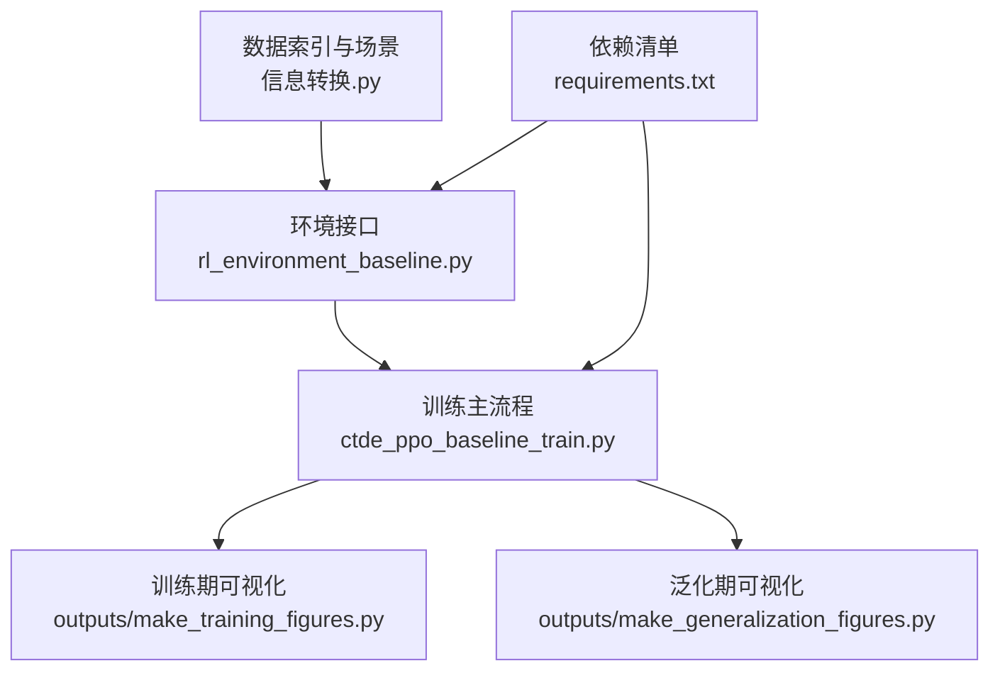
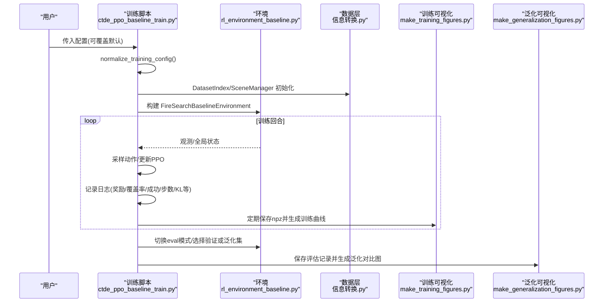
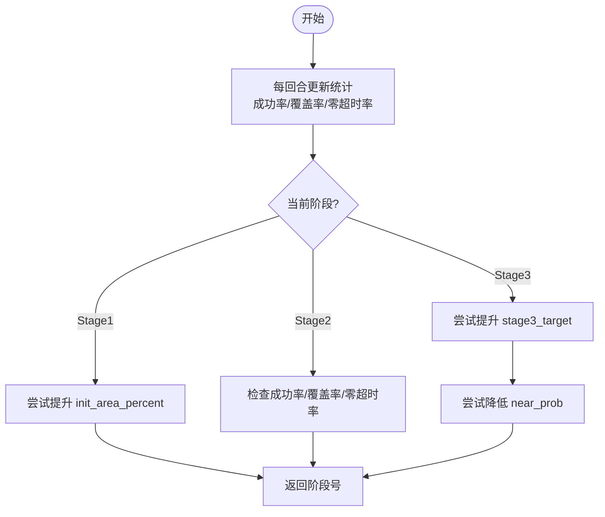
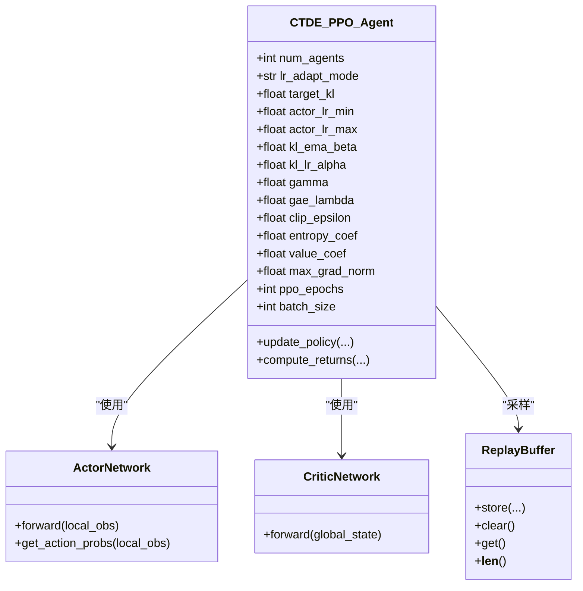
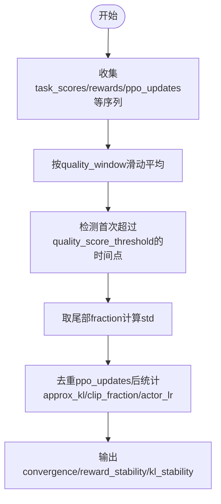
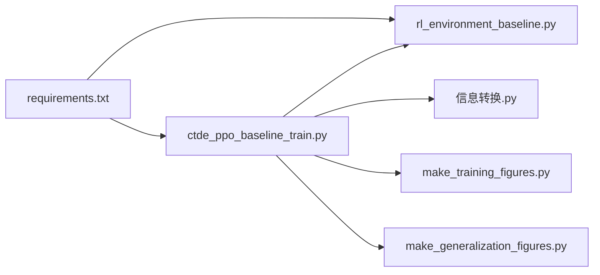

# 实验管理

<cite>
**本文引用的文件**   
- [ctde_ppo_baseline_train.py](file://environment_variables/environment_variables/ctde_ppo_baseline_train.py)
- [rl_environment_baseline.py](file://environment_variables/environment_variables/rl_environment_baseline.py)
- [信息转换.py](file://environment_variables/environment_variables/信息转换.py)
- [make_training_figures.py](file://environment_variables/environment_variables/outputs/make_training_figures.py)
- [make_generalization_figures.py](file://environment_variables/environment_variables/outputs/make_generalization_figures.py)
- [requirements.txt](file://environment_variables/requirements.txt)
</cite>

## 目录
1. [简介](#简介)
2. [项目结构](#项目结构)
3. [核心组件](#核心组件)
4. [架构总览](#架构总览)
5. [详细组件分析](#详细组件分析)
6. [依赖关系分析](#依赖关系分析)
7. [性能与稳定性考量](#性能与稳定性考量)
8. [故障排查指南](#故障排查指南)
9. [结论](#结论)
10. [附录：配置项与指标说明](#附录配置项与指标说明)

## 简介
本文件面向“实验管理系统”的配置、监控与可视化，覆盖以下目标：
- 配置文件结构与可调参数说明
- 训练日志记录与指标收集机制
- 结果可视化（训练曲线、泛化对比等）
- 性能评估指标的计算方法与标准
- 实验复现最佳实践与版本控制策略
- 超参数调优指南与自动化实验管理方案
- 不同实验结果的比较与差异分析方法

## 项目结构
仓库围绕“数据加载—环境—训练—评估—可视化”的流水线组织。关键路径如下：
- 数据索引与场景加载：信息转换.py
- 强化学习环境接口：rl_environment_baseline.py
- 训练主流程与配置归一化：ctde_ppo_baseline_train.py
- 训练期可视化：outputs/make_training_figures.py
- 泛化期可视化：outputs/make_generalization_figures.py
- 依赖清单：environment_variables/requirements.txt

图示来源
- [ctde_ppo_baseline_train.py:1-120](file://environment_variables/environment_variables/ctde_ppo_baseline_train.py#L1-L120)
- [rl_environment_baseline.py:1-120](file://environment_variables/environment_variables/rl_environment_baseline.py#L1-L120)
- [信息转换.py:1-120](file://environment_variables/environment_variables/信息转换.py#L1-L120)
- [make_training_figures.py:1-120](file://environment_variables/environment_variables/outputs/make_training_figures.py#L1-L120)
- [make_generalization_figures.py:1-120](file://environment_variables/environment_variables/outputs/make_generalization_figures.py#L1-L120)
- [requirements.txt:1-13](file://environment_variables/requirements.txt#L1-L13)

章节来源
- [ctde_ppo_baseline_train.py:1-120](file://environment_variables/environment_variables/ctde_ppo_baseline_train.py#L1-L120)
- [rl_environment_baseline.py:1-120](file://environment_variables/environment_variables/rl_environment_baseline.py#L1-L120)
- [信息转换.py:1-120](file://environment_variables/environment_variables/信息转换.py#L1-L120)
- [make_training_figures.py:1-120](file://environment_variables/environment_variables/outputs/make_training_figures.py#L1-L120)
- [make_generalization_figures.py:1-120](file://environment_variables/environment_variables/outputs/make_generalization_figures.py#L1-L120)
- [requirements.txt:1-13](file://environment_variables/requirements.txt#L1-L13)

## 核心组件
- 配置归一化与默认值：提供完整的默认训练配置字典，并对用户输入进行类型校验、范围裁剪与合并。
- 课程管理器：按阶段推进难度（初始火场面积百分比、目标成功率、近界生成概率等）。
- PPO智能体：Actor/Critic网络、KL自适应学习率、GAE回报估计、经验回放缓冲。
- 环境接口：多无人机边界搜索任务，支持多种观测/奖励配置、热势场与风险感知特征。
- 数据层：数据集索引、场景元数据解析、栅格/矢量读取、规范化参数推导。
- 可视化：训练期指标曲线与质量摘要；泛化期跨场景/跨变体的汇总图。

章节来源
- [ctde_ppo_baseline_train.py:98-281](file://environment_variables/environment_variables/ctde_ppo_baseline_train.py#L98-L281)
- [ctde_ppo_baseline_train.py:569-758](file://environment_variables/environment_variables/ctde_ppo_baseline_train.py#L569-L758)
- [ctde_ppo_baseline_train.py:759-800](file://environment_variables/environment_variables/ctde_ppo_baseline_train.py#L759-L800)
- [rl_environment_baseline.py:21-158](file://environment_variables/environment_variables/rl_environment_baseline.py#L21-L158)
- [信息转换.py:20-196](file://environment_variables/environment_variables/信息转换.py#L20-L196)
- [make_training_figures.py:1-120](file://environment_variables/environment_variables/outputs/make_training_figures.py#L1-L120)
- [make_generalization_figures.py:1-120](file://environment_variables/environment_variables/outputs/make_generalization_figures.py#L1-L120)

## 架构总览
下图展示从配置到训练、评估与可视化的端到端流程。

图示来源
- [ctde_ppo_baseline_train.py:151-281](file://environment_variables/environment_variables/ctde_ppo_baseline_train.py#L151-L281)
- [rl_environment_baseline.py:49-158](file://environment_variables/environment_variables/rl_environment_baseline.py#L49-L158)
- [信息转换.py:20-196](file://environment_variables/environment_variables/信息转换.py#L20-L196)
- [make_training_figures.py:118-176](file://environment_variables/environment_variables/outputs/make_training_figures.py#L118-L176)
- [make_generalization_figures.py:169-246](file://environment_variables/environment_variables/outputs/make_generalization_figures.py#L169-L246)

## 详细组件分析

### 配置系统与参数规范
- 默认配置集中定义于 DEFAULT_TRAIN_CONFIG，涵盖数据划分、环境参数、PPO超参、日志与绘图设置、输出目录等。
- normalize_training_config 负责：
  - 深拷贝默认配置并与用户配置合并
  - 字符串列表/键名标准化（大小写、逗号分隔）
  - 数值范围裁剪与类型转换（如学习率、KL阈值、窗口大小等）
  - 兼容别名（如 use_scene_uav_params → use_metadata_uav_params）
  - 校验 observation_profile 与 reward_profile 是否在环境允许集合内
- 关键可调参数类别：
  - 数据与场景：data_dir, train_split, eval_split, train_scene_keys, eval_scene_keys, final_eval_splits
  - 环境与观测：num_drones, vision_radius, max_steps, use_metadata_uav_params, observation_profile, reward_profile, norm_params_source
  - 课程与初始化：init_percentile/init_area_percent, stage2_success_target, stage3_success_target, stage3_near_prob
  - PPO优化器：actor_lr, critic_lr, lr_adapt_mode, target_kl, actor_lr_min/max, kl_ema_beta, kl_lr_alpha, gamma, gae_lambda, clip_epsilon, entropy_coef, value_coef, max_grad_norm, ppo_epochs, batch_size
  - 训练控制：total_episodes, max_train_updates, save_interval, log_interval, seed, comparison_seeds
  - 验证与评估：validation_split, validation_interval, validation_episodes_per_scene, save_best_by_validation, eval_episodes_per_scene, eval_stages, eval_seed_stride, eval_after_train, final_eval_episodes_per_scene, evaluate_best_val_after_train
  - 质量度量：quality_score_threshold, quality_window, quality_tail_fraction, quality_target_kl
  - 可视化：plot_after_train, figure_window, figure_dpi, output_root_dir, output_subdir

章节来源
- [ctde_ppo_baseline_train.py:98-281](file://environment_variables/environment_variables/ctde_ppo_baseline_train.py#L98-L281)
- [rl_environment_baseline.py:21-35](file://environment_variables/environment_variables/rl_environment_baseline.py#L21-L35)

### 课程管理与阶段推进
- CurriculumManager 维护三阶段能力门槛与退火策略：
  - 阶段1：提升初始火场面积百分比阶梯（PERCENTILE_LADDER），基于成功率与零超时率推进
  - 阶段2：提高目标成功率与约束零超时率
  - 阶段3：逐步逼近最终目标成功率，同时降低 near_prob（近界生成概率）以增强探索
- 推进条件包含最小回合数、成功率、覆盖率、零超时率等多维门限，并提供强制推进上限防止卡死。

图示来源
- [ctde_ppo_baseline_train.py:569-758](file://environment_variables/environment_variables/ctde_ppo_baseline_train.py#L569-L758)

章节来源
- [ctde_ppo_baseline_train.py:569-758](file://environment_variables/environment_variables/ctde_ppo_baseline_train.py#L569-L758)

### PPO智能体与KL自适应学习率
- ActorNetwork/CriticNetwork：多层全连接+LayerNorm+正交初始化，Actor输出离散动作分布，Critic输出标量价值。
- KL自适应：根据近似KL误差EMA调整actor学习率，限制在[min,max]区间，避免策略崩溃或过慢收敛。
- GAE回报估计与PPO裁剪，支持批量更新与梯度裁剪。

图示来源
- [ctde_ppo_baseline_train.py:460-535](file://environment_variables/environment_variables/ctde_ppo_baseline_train.py#L460-L535)
- [ctde_ppo_baseline_train.py:537-567](file://environment_variables/environment_variables/ctde_ppo_baseline_train.py#L537-L567)
- [ctde_ppo_baseline_train.py:759-800](file://environment_variables/environment_variables/ctde_ppo_baseline_train.py#L759-L800)

章节来源
- [ctde_ppo_baseline_train.py:460-535](file://environment_variables/environment_variables/ctde_ppo_baseline_train.py#L460-L535)
- [ctde_ppo_baseline_train.py:537-567](file://environment_variables/environment_variables/ctde_ppo_baseline_train.py#L537-L567)
- [ctde_ppo_baseline_train.py:759-800](file://environment_variables/environment_variables/ctde_ppo_baseline_train.py#L759-L800)

### 环境接口与观测/奖励设计
- 观测配置：
  - baseline/static_terrain/dynamic_front/risk_aware 四种profile，分别对应不同的本地观测维度与全局状态维度。
- 奖励配置：
  - boundary_coverage/front_detection/severity_weighted/exploration_balanced 四种profile，支持细粒度分解（r_discover, r_boundary, r_front, r_severity, r_explore, r_search, r_penalty, r_terminal等）。
- 热势场与风险感知：
  - 基于强度栅格与二值火场掩码构造thermal_potential，用于导航与信息增益引导。
- 无人机参数：
  - 可选从场景元数据读取sensor_radius_cells与max_steps，否则使用配置值。

章节来源
- [rl_environment_baseline.py:21-158](file://environment_variables/environment_variables/rl_environment_baseline.py#L21-L158)
- [rl_environment_baseline.py:208-226](file://environment_variables/environment_variables/rl_environment_baseline.py#L208-L226)
- [rl_environment_baseline.py:231-252](file://environment_variables/environment_variables/rl_environment_baseline.py#L231-L252)
- [rl_environment_baseline.py:516-563](file://environment_variables/environment_variables/rl_environment_baseline.py#L516-L563)
- [信息转换.py:759-800](file://environment_variables/environment_variables/信息转换.py#L759-L800)

### 数据层与场景加载
- DatasetIndex：
  - 基于 dataset_index.json 管理 splits/scenes/source_root，提供 scene_keys/get_record/required_file_paths 等方法。
- FireSceneData：
  - 加载静态地图与核心栅格，推导norm_params（分位数/极值），计算热势场与导航场，初始化t=0边界点。
- 场景有效性：
  - 若t=0边界为空则抛出InvalidSceneError，阻止无效场景参与训练。

章节来源
- [信息转换.py:20-196](file://environment_variables/environment_variables/信息转换.py#L20-L196)
- [信息转换.py:219-323](file://environment_variables/environment_variables/信息转换.py#L219-L323)
- [信息转换.py:639-683](file://environment_variables/environment_variables/信息转换.py#L639-L683)
- [信息转换.py:684-721](file://environment_variables/environment_variables/信息转换.py#L684-L721)
- [信息转换.py:759-800](file://environment_variables/environment_variables/信息转换.py#L759-L800)

### 训练日志与质量度量
- 日志内容：
  - episodes/rewards/task_scores/coverages/success/lengths/timeout/zero_coverage_timeout/stage/ppo_updates/approx_kl/clip_fraction/actor_loss/critic_loss等。
- 控制台重定向：
  - TeeStream将stdout/stderr同步写入日志文件，便于离线回溯。
- 模型质量指标：
  - convergence_efficiency：AUC任务分数、到达阈值的步骤/更新次数
  - reward_stability：尾部奖励/任务分数标准差、均值/最大性能下降
  - kl_stability：KL均值/方差、平均绝对误差、超调率、裁剪比例、学习率统计

图示来源
- [ctde_ppo_baseline_train.py:358-433](file://environment_variables/environment_variables/ctde_ppo_baseline_train.py#L358-L433)
- [ctde_ppo_baseline_train.py:47-96](file://environment_variables/environment_variables/ctde_ppo_baseline_train.py#L47-L96)

章节来源
- [ctde_ppo_baseline_train.py:47-96](file://environment_variables/environment_variables/ctde_ppo_baseline_train.py#L47-L96)
- [ctde_ppo_baseline_train.py:358-433](file://environment_variables/environment_variables/ctde_ppo_baseline_train.py#L358-L433)

### 结果可视化
- 训练期可视化（make_training_figures.py）：
  - 自动发现training_log.npz与config.json，聚合多运行/多随机种子，绘制任务分数、覆盖率、成功率、超时率、损失曲线、课程阶段转移、完成原因分布、质量指标汇总等。
- 泛化期可视化（make_generalization_figures.py）：
  - 读取CSV/JSON评估记录，按变体/阶段/场景分组，绘制平滑曲线、按场景柱状图、箱线图、效率散点图与汇总表格。

章节来源
- [make_training_figures.py:118-176](file://environment_variables/environment_variables/outputs/make_training_figures.py#L118-L176)
- [make_training_figures.py:366-381](file://environment_variables/environment_variables/outputs/make_training_figures.py#L366-L381)
- [make_training_figures.py:486-579](file://environment_variables/environment_variables/outputs/make_training_figures.py#L486-L579)
- [make_generalization_figures.py:169-246](file://environment_variables/environment_variables/outputs/make_generalization_figures.py#L169-L246)
- [make_generalization_figures.py:537-628](file://environment_variables/environment_variables/outputs/make_generalization_figures.py#L537-L628)
- [make_generalization_figures.py:752-800](file://environment_variables/environment_variables/outputs/make_generalization_figures.py#L752-L800)

## 依赖关系分析
- 运行时依赖：
  - numpy/rasterio/matplotlib/scipy/opencv-python为核心依赖；torch/gymnasium为训练与环境必需（requirements中部分为可选注释，实际代码已导入）。
- 模块耦合：
  - 训练脚本依赖环境与数据层；可视化脚本仅消费训练/评估产物，不反向依赖训练逻辑。

图示来源
- [requirements.txt:1-13](file://environment_variables/requirements.txt#L1-L13)
- [ctde_ppo_baseline_train.py:1-35](file://environment_variables/environment_variables/ctde_ppo_baseline_train.py#L1-L35)
- [rl_environment_baseline.py:1-20](file://environment_variables/environment_variables/rl_environment_baseline.py#L1-L20)
- [信息转换.py:1-20](file://environment_variables/environment_variables/信息转换.py#L1-L20)
- [make_training_figures.py:1-35](file://environment_variables/environment_variables/outputs/make_training_figures.py#L1-L35)
- [make_generalization_figures.py:1-35](file://environment_variables/environment_variables/outputs/make_generalization_figures.py#L1-L35)

章节来源
- [requirements.txt:1-13](file://environment_variables/requirements.txt#L1-L13)
- [ctde_ppo_baseline_train.py:1-35](file://environment_variables/environment_variables/ctde_ppo_baseline_train.py#L1-L35)
- [rl_environment_baseline.py:1-20](file://environment_variables/environment_variables/rl_environment_baseline.py#L1-L20)
- [信息转换.py:1-20](file://environment_variables/environment_variables/信息转换.py#L1-L20)
- [make_training_figures.py:1-35](file://environment_variables/environment_variables/outputs/make_training_figures.py#L1-L35)
- [make_generalization_figures.py:1-35](file://environment_variables/environment_variables/outputs/make_generalization_figures.py#L1-L35)

## 性能与稳定性考量
- 数值稳定：
  - 所有数值型配置均做范围裁剪与类型转换，避免除零或溢出。
  - KL自适应学习率限制上下界，防止策略发散。
- 训练稳定性：
  - 课程管理通过成功率/覆盖率/零超时率多维门限推进，避免过早进入高难阶段。
  - 观察/奖励profile严格校验，确保维度一致。
- I/O与存储：
  - 控制台双写（TeeStream）保障日志完整性；npz/json结构化存储便于后续分析。
- 可视化性能：
  - 使用Agg后端无头渲染，适合批处理；滚动平均与对齐聚合减少噪声干扰。

[本节为通用指导，无需特定文件引用]

## 故障排查指南
- 常见错误与定位：
  - 未知observation_profile/reward_profile：检查配置是否属于环境允许集合。
  - 场景无效（t=0边界为空）：确认dataset_index与场景栅格/矢量完整，必要时更换场景或调整init_area_percent。
  - 找不到dataset_index.json：核对data_dir路径与工作目录。
  - 缺少源文件快照：训练会复制核心脚本至“训练源码”目录，若缺失需检查权限与路径。
- 建议操作：
  - 查看训练控制台日志与model_quality_metrics.json，关注KL超调率与尾部奖励波动。
  - 使用可视化脚本快速定位异常曲线与阶段停滞。

章节来源
- [rl_environment_baseline.py:208-226](file://environment_variables/environment_variables/rl_environment_baseline.py#L208-L226)
- [信息转换.py:684-721](file://environment_variables/environment_variables/信息转换.py#L684-L721)
- [ctde_ppo_baseline_train.py:47-96](file://environment_variables/environment_variables/ctde_ppo_baseline_train.py#L47-L96)

## 结论
本系统提供了从配置、训练、评估到可视化的完整闭环。通过严格的配置归一化、课程化训练与KL自适应学习率，提升了训练稳定性与可复现性；配套的训练与泛化可视化脚本帮助快速诊断与对比不同实验。建议在团队内统一采用该配置与产出规范，并结合版本控制与自动化脚本实现高效实验管理。

[本节为总结，无需特定文件引用]

## 附录：配置项与指标说明

### 配置项分类速览
- 数据与场景
  - data_dir, train_split, eval_split, train_scene_keys, eval_scene_keys, final_eval_splits
- 环境与观测/奖励
  - num_drones, vision_radius, max_steps, use_metadata_uav_params, observation_profile, reward_profile, norm_params_source
- 课程与初始化
  - init_percentile/init_area_percent, stage2_success_target, stage3_success_target, stage3_near_prob
- PPO优化器
  - actor_lr, critic_lr, lr_adapt_mode, target_kl, actor_lr_min/max, kl_ema_beta, kl_lr_alpha, gamma, gae_lambda, clip_epsilon, entropy_coef, value_coef, max_grad_norm, ppo_epochs, batch_size
- 训练控制
  - total_episodes, max_train_updates, save_interval, log_interval, seed, comparison_seeds
- 验证与评估
  - validation_split, validation_interval, validation_episodes_per_scene, save_best_by_validation, eval_episodes_per_scene, eval_stages, eval_seed_stride, eval_after_train, final_eval_episodes_per_scene, evaluate_best_val_after_train
- 质量度量
  - quality_score_threshold, quality_window, quality_tail_fraction, quality_target_kl
- 可视化与输出
  - plot_after_train, figure_window, figure_dpi, output_root_dir, output_subdir

章节来源
- [ctde_ppo_baseline_train.py:98-281](file://environment_variables/environment_variables/ctde_ppo_baseline_train.py#L98-L281)

### 评估指标计算方法与标准
- 任务得分（单回合）：
  - task_score = 0.5 × coverage + 0.3 × success + 0.2 × efficiency
  - efficiency = success × (1 − steps/max_steps)
- 验证模型评分（用于保存最佳模型）：
  - val_score = mean_task_score + 0.10 × mean_coverage − 0.20 × timeout_rate − 0.45 × zero_coverage_timeout_rate
- 质量指标（训练后期）：
  - 收敛效率：AUC任务分数、达到阈值的步骤/更新次数
  - 奖励稳定性：尾部reward/task_score标准差、均值/最大性能下降
  - KL稳定性：KL均值/方差、平均绝对误差、超调率、裁剪比例、学习率统计

章节来源
- [ctde_ppo_baseline_train.py:295-306](file://environment_variables/environment_variables/ctde_ppo_baseline_train.py#L295-L306)
- [ctde_ppo_baseline_train.py:358-433](file://environment_variables/environment_variables/ctde_ppo_baseline_train.py#L358-L433)

### 实验复现与版本控制策略
- 固定随机种子：seed与comparison_seeds，配合set_seed确保可复现。
- 源码快照：训练时复制核心脚本至“训练源码”目录，保证结果可追溯。
- 配置归档：每次运行保存config.json与training_log.npz，便于事后分析与对比。
- 数据集版本：DatasetIndex.version与scene_split_counts纳入实验元数据，便于追踪数据变更。

章节来源
- [ctde_ppo_baseline_train.py:284-293](file://environment_variables/environment_variables/ctde_ppo_baseline_train.py#L284-L293)
- [ctde_ppo_baseline_train.py:1029-1045](file://environment_variables/environment_variables/ctde_ppo_baseline_train.py#L1029-L1045)
- [ctde_ppo_baseline_train.py:1128-1153](file://environment_variables/environment_variables/ctde_ppo_baseline_train.py#L1128-L1153)

### 超参数调优指南
- 学习率与KL自适应：
  - 优先启用lr_adapt_mode="kl"，调节target_kl与kl_lr_alpha，观察KL超调率与actor_lr轨迹。
- 课程参数：
  - 若早期成功率低，适当增大stage2_success_target或延长min_episodes；若near_prob过高导致探索不足，可降低stage3_near_prob。
- 奖励权重：
  - 对边界覆盖敏感的任务可提高boundary_coverage相关权重；对前沿探测任务可启用front_detection profile。
- 批次与更新：
  - 增大batch_size与ppo_epochs可提升样本效率，但需关注显存与训练时长。

章节来源
- [ctde_ppo_baseline_train.py:98-281](file://environment_variables/environment_variables/ctde_ppo_baseline_train.py#L98-L281)
- [ctde_ppo_baseline_train.py:569-758](file://environment_variables/environment_variables/ctde_ppo_baseline_train.py#L569-L758)

### 自动化实验管理方案
- 批量变体：
  - 通过组合不同variant_name与seed，自动生成多目录结果，并由可视化脚本聚合。
- 自动绘图：
  - 训练结束后调用_run_figure_scripts，按需生成训练与泛化图表。
- 结果筛选：
  - 使用run_filter与aggregate_seeds选项聚焦特定变体或聚合多种子结果。

章节来源
- [ctde_ppo_baseline_train.py:1048-1061](file://environment_variables/environment_variables/ctde_ppo_baseline_train.py#L1048-L1061)
- [make_training_figures.py:118-176](file://environment_variables/environment_variables/outputs/make_training_figures.py#L118-L176)
- [make_generalization_figures.py:169-246](file://environment_variables/environment_variables/outputs/make_generalization_figures.py#L169-L246)

### 比较不同实验与分析性能差异
- 训练期对比：
  - 使用make_training_figures.py聚合多条运行，观察任务分数、成功率、超时率与KL稳定性差异。
- 泛化期对比：
  - 使用make_generalization_figures.py按变体/场景/阶段汇总，结合箱线图与散点图识别不稳定场景。
- 决策依据：
  - 综合val_score、tail_std、KL超调率与泛化表现，选择鲁棒且高效的配置。

章节来源
- [make_training_figures.py:486-579](file://environment_variables/environment_variables/outputs/make_training_figures.py#L486-L579)
- [make_generalization_figures.py:537-628](file://environment_variables/environment_variables/outputs/make_generalization_figures.py#L537-L628)
- [make_generalization_figures.py:752-800](file://environment_variables/environment_variables/outputs/make_generalization_figures.py#L752-L800)