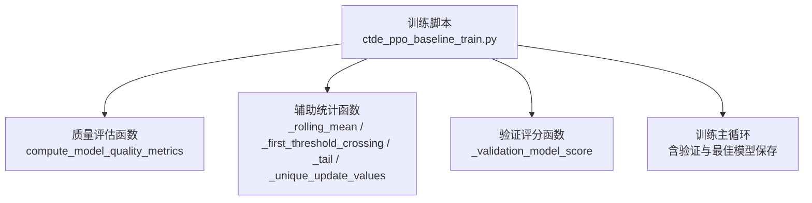
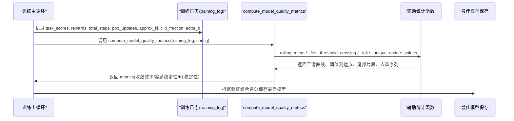
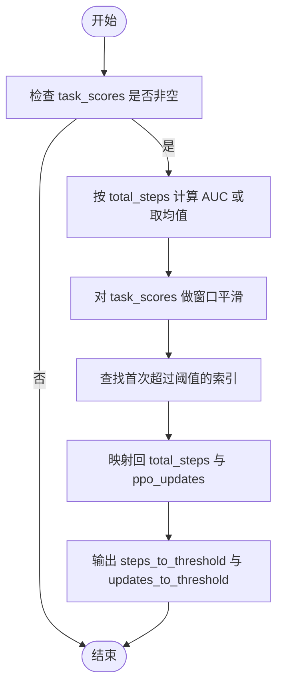
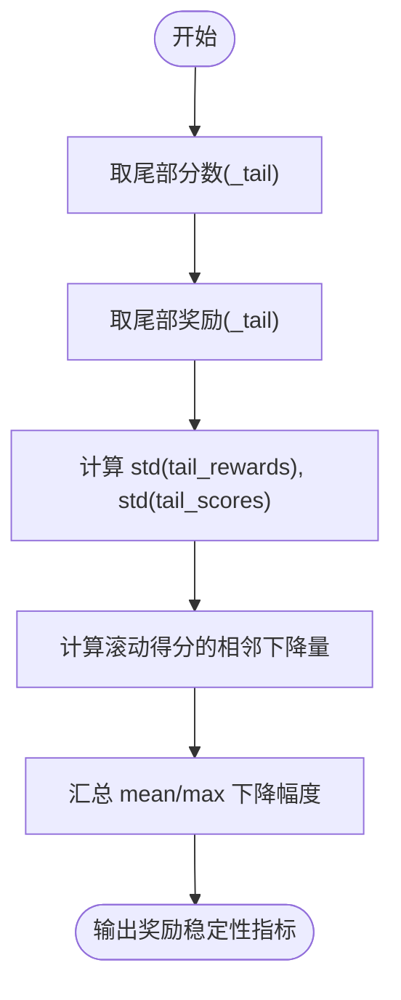
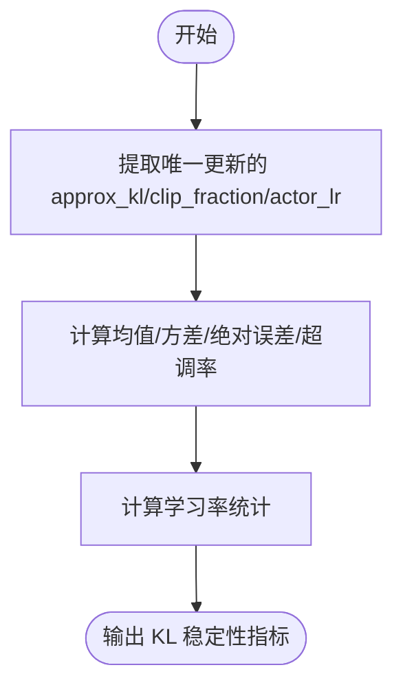
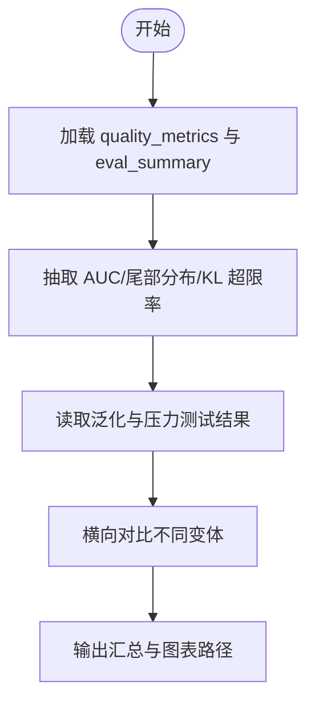
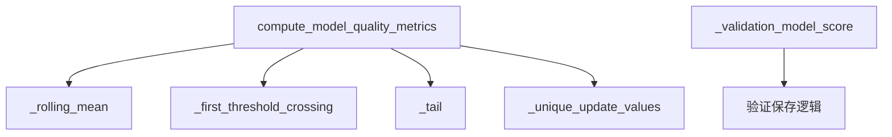

# 性能评估

<cite>
**本文引用的文件**   
- [ctde_ppo_baseline_train.py](file://environment_variables/environment_variables/ctde_ppo_baseline_train.py)
</cite>

## 目录
1. [简介](#简介)
2. [项目结构](#项目结构)
3. [核心组件](#核心组件)
4. [架构总览](#架构总览)
5. [详细组件分析](#详细组件分析)
6. [依赖关系分析](#依赖关系分析)
7. [性能考量](#性能考量)
8. [故障排查指南](#故障排查指南)
9. [结论](#结论)
10. [附录](#附录)

## 简介
本文件面向“性能评估系统”，聚焦于质量评估指标的计算与解释，尤其是 compute_model_quality_metrics 函数。文档将详细说明：
- 收敛效率指标（AUC、阈值到达时间）的计算逻辑
- 奖励稳定性指标（标准差、性能下降幅度）的分析方法
- KL 稳定性指标（均值、方差、超调率）的评估标准
- 模型选择策略与最佳模型保存机制的实现细节
- 不同实验结果的比较分析方法

## 项目结构
本项目为单脚本驱动的训练与评估流程，核心实现集中在一个训练脚本中，包含：
- 训练配置与默认参数
- 课程学习管理器
- PPO 智能体与网络定义
- 训练循环、日志记录与可视化
- 质量评估指标计算与模型选择



图表来源
- [ctde_ppo_baseline_train.py:358-433](file://environment_variables/environment_variables/ctde_ppo_baseline_train.py#L358-L433)
- [ctde_ppo_baseline_train.py:300-306](file://environment_variables/environment_variables/ctde_ppo_baseline_train.py#L300-L306)
- [ctde_ppo_baseline_train.py:308-356](file://environment_variables/environment_variables/ctde_ppo_baseline_train.py#L308-L356)
- [ctde_ppo_baseline_train.py:1606-1656](file://environment_variables/environment_variables/ctde_ppo_baseline_train.py#L1606-L1656)

章节来源
- [ctde_ppo_baseline_train.py:98-158](file://environment_variables/environment_variables/ctde_ppo_baseline_train.py#L98-L158)

## 核心组件
- 质量评估入口：compute_model_quality_metrics
- 收敛效率：基于任务得分序列与步数/更新次数计算的 AUC 与首次达到阈值的时间
- 奖励稳定性：尾部窗口内的标准差与滚动得分的下降幅度
- KL 稳定性：KL 散度的均值、方差、绝对误差与超调率，以及 clip_fraction 与学习率的统计
- 模型选择：基于验证集的综合评分进行最佳模型保存

章节来源
- [ctde_ppo_baseline_train.py:358-433](file://environment_variables/environment_variables/ctde_ppo_baseline_train.py#L358-L433)
- [ctde_ppo_baseline_train.py:300-306](file://environment_variables/environment_variables/ctde_ppo_baseline_train.py#L300-L306)

## 架构总览
下图展示了从训练日志到质量指标输出的关键数据流与处理步骤。



图表来源
- [ctde_ppo_baseline_train.py:358-433](file://environment_variables/environment_variables/ctde_ppo_baseline_train.py#L358-L433)
- [ctde_ppo_baseline_train.py:308-356](file://environment_variables/environment_variables/ctde_ppo_baseline_train.py#L308-L356)
- [ctde_ppo_baseline_train.py:1606-1656](file://environment_variables/environment_variables/ctde_ppo_baseline_train.py#L1606-L1656)

## 详细组件分析

### 收敛效率指标（AUC、阈值到达时间）
- AUC 计算
  - 若 total_steps 与 task_scores 长度一致且 total_steps[-1] > total_steps[0]，则使用梯形积分对任务得分关于总步数求面积，再除以步数区间长度得到平均 AUC；否则退化为任务得分的均值。
  - 该指标衡量“单位步数”的任务得分累积表现，数值越高表示收敛越快、整体表现越好。
- 阈值到达时间
  - 使用滑动窗口对任务得分做移动平均，寻找首次超过阈值的时刻，分别以 total_steps 和 ppo_updates 作为横轴，输出 steps_to_threshold 与 updates_to_threshold。
  - 若未达阈值或数据不足，返回空值。



图表来源
- [ctde_ppo_baseline_train.py:381-395](file://environment_variables/environment_variables/ctde_ppo_baseline_train.py#L381-L395)
- [ctde_ppo_baseline_train.py:317-332](file://environment_variables/environment_variables/ctde_ppo_baseline_train.py#L317-L332)

章节来源
- [ctde_ppo_baseline_train.py:381-395](file://environment_variables/environment_variables/ctde_ppo_baseline_train.py#L381-L395)
- [ctde_ppo_baseline_train.py:317-332](file://environment_variables/environment_variables/ctde_ppo_baseline_train.py#L317-L332)

### 奖励稳定性指标（标准差、性能下降幅度）
- 尾部标准差
  - 取最后 tail_fraction 比例的 rewards 与 task_scores，分别计算标准差 reward_std_tail 与 task_score_std_tail，反映训练后期的波动性。
- 性能下降幅度
  - 在滚动得分上计算相邻点的正向下降量（仅保留正值），汇总 mean_performance_drop 与 max_performance_drop，用于衡量训练后期是否存在明显退化。



图表来源
- [ctde_ppo_baseline_train.py:406-413](file://environment_variables/environment_variables/ctde_ppo_baseline_train.py#L406-L413)
- [ctde_ppo_baseline_train.py:397-404](file://environment_variables/environment_variables/ctde_ppo_baseline_train.py#L397-L404)
- [ctde_ppo_baseline_train.py:334-339](file://environment_variables/environment_variables/ctde_ppo_baseline_train.py#L334-L339)

章节来源
- [ctde_ppo_baseline_train.py:397-413](file://environment_variables/environment_variables/ctde_ppo_baseline_train.py#L397-L413)
- [ctde_ppo_baseline_train.py:334-339](file://environment_variables/environment_variables/ctde_ppo_baseline_train.py#L334-L339)

### KL 稳定性指标（均值、方差、超调率）
- 数据来源
  - 通过 _unique_update_values 从 training_log 中提取每个唯一 PPO 更新的 approx_kl、clip_fraction、actor_lr，避免重复更新导致的偏差。
- 指标含义
  - mean_kl：KL 散度均值，衡量策略更新的总体偏离程度
  - kl_std：KL 散度标准差，衡量波动性
  - mean_abs_kl_error：KL 与目标 target_kl 的平均绝对误差，衡量控制精度
  - kl_overshoot_rate：KL 超过两倍 target_kl 的比例，衡量超调风险
  - clip_fraction_mean/std：裁剪比例均值与标准差，反映策略更新的裁剪强度
  - actor_lr_*：学习率的均值、最小值、最大值，反映自适应学习率行为
  - num_ppo_updates_measured：实际测量的唯一更新次数



图表来源
- [ctde_ppo_baseline_train.py:415-431](file://environment_variables/environment_variables/ctde_ppo_baseline_train.py#L415-L431)
- [ctde_ppo_baseline_train.py:342-355](file://environment_variables/environment_variables/ctde_ppo_baseline_train.py#L342-L355)

章节来源
- [ctde_ppo_baseline_train.py:415-431](file://environment_variables/environment_variables/ctde_ppo_baseline_train.py#L415-L431)
- [ctde_ppo_baseline_train.py:342-355](file://environment_variables/environment_variables/ctde_ppo_baseline_train.py#L342-L355)

### 模型选择策略与最佳模型保存机制
- 验证评分函数
  - 综合任务得分、覆盖率、超时率与零覆盖超时率，加权得到验证模型分数，用于更稳健地选择最佳模型。
- 保存条件
  - 仅在启用 save_best_by_validation、处于课程阶段 3、满足最低回合数要求、且终末专注已激活时，才允许更新最佳模型。
  - 当验证模型分数优于历史最佳时，保存至 ppo_best_val.pth，并记录路径。
- 训练主循环中的验证与记录
  - 每隔 validation_interval 回合进行一次验证评估，记录训练与验证任务得分、泛化差距等，便于后续分析与对比。

```mermaid
sequenceDiagram
participant Loop as "训练主循环"
participant Val as "验证评估"
participant Score as "_validation_model_score"
participant Save as "保存最佳模型"
Loop->>Val : 每 N 回合执行验证评估
Val-->>Loop : 返回各场景汇总结果
Loop->>Score : 计算验证模型分数
Score-->>Loop : 返回综合分数
Loop->>Save : 若满足条件且优于历史最佳，保存 ppo_best_val.pth
```

图表来源
- [ctde_ppo_baseline_train.py:300-306](file://environment_variables/environment_variables/ctde_ppo_baseline_train.py#L300-L306)
- [ctde_ppo_baseline_train.py:1606-1656](file://environment_variables/environment_variables/ctde_ppo_baseline_train.py#L1606-L1656)

章节来源
- [ctde_ppo_baseline_train.py:300-306](file://environment_variables/environment_variables/ctde_ppo_baseline_train.py#L300-L306)
- [ctde_ppo_baseline_train.py:1606-1656](file://environment_variables/environment_variables/ctde_ppo_baseline_train.py#L1606-L1656)

### 不同实验结果的比较分析方法
- 指标聚合
  - 从 quality_metrics 中抽取 convergence_efficiency、reward_stability、kl_stability 的关键字段，如 AUC、tail 得分标准差、KL 超限率等。
- 泛化与压力测试
  - 读取 generalization 与 stress 分区的阶段结果，汇总 mean_task_score、success_rate 等，用于跨数据集对比。
- 输出与可视化
  - 打印各变体的关键指标与输出目录，便于快速定位与复现实验；结合绘图脚本生成对比图。



图表来源
- [ctde_ppo_baseline_train.py:1848-1885](file://environment_variables/environment_variables/ctde_ppo_baseline_train.py#L1848-L1885)

章节来源
- [ctde_ppo_baseline_train.py:1848-1885](file://environment_variables/environment_variables/ctde_ppo_baseline_train.py#L1848-L1885)

## 依赖关系分析
- 模块内依赖
  - compute_model_quality_metrics 依赖多个辅助函数完成数据预处理与统计。
  - 模型选择依赖验证评分函数与训练主循环中的保存逻辑。
- 外部依赖
  - 主要依赖 numpy 进行数值计算，torch 用于模型与优化器（不在本小节展开）。



图表来源
- [ctde_ppo_baseline_train.py:358-433](file://environment_variables/environment_variables/ctde_ppo_baseline_train.py#L358-L433)
- [ctde_ppo_baseline_train.py:300-306](file://environment_variables/environment_variables/ctde_ppo_baseline_train.py#L300-L306)

章节来源
- [ctde_ppo_baseline_train.py:358-433](file://environment_variables/environment_variables/ctde_ppo_baseline_train.py#L358-L433)

## 性能考量
- 窗口大小与尾部比例
  - quality_window 影响平滑效果与阈值到达时间的稳定性；quality_tail_fraction 决定尾部统计的代表性。建议根据训练长度与噪声水平调整。
- AUC 归一化
  - 使用步数区间长度归一化，使不同训练长度的实验具备可比性。
- KL 控制
  - 通过 mean_abs_kl_error 与 kl_overshoot_rate 监控策略更新稳定性；clip_fraction 与 actor_lr 的统计有助于诊断自适应学习率行为。
- 验证频率与保存条件
  - 合理的 validation_interval 与严格的保存条件可避免过拟合早期不稳定阶段的权重。

## 故障排查指南
- 指标为空或缺失
  - 若 task_scores 为空，收敛效率与奖励稳定性指标不会填充；需检查训练日志是否正确记录。
- 阈值未到达
  - 若滑动平均从未超过阈值，steps_to_threshold 与 updates_to_threshold 将为空；可考虑降低阈值或增大窗口。
- KL 异常
  - 若 kl_overshoot_rate 较高，说明策略更新过于激进；可调整 target_kl 或学习率范围。
- 最佳模型未保存
  - 检查是否启用 save_best_by_validation、是否处于阶段 3、是否满足最低回合数与终末专注条件。

章节来源
- [ctde_ppo_baseline_train.py:381-433](file://environment_variables/environment_variables/ctde_ppo_baseline_train.py#L381-L433)
- [ctde_ppo_baseline_train.py:1606-1656](file://environment_variables/environment_variables/ctde_ppo_baseline_train.py#L1606-L1656)

## 结论
本性能评估体系围绕三个维度构建：收敛效率、奖励稳定性与 KL 稳定性。通过 AUC 与阈值到达时间量化收敛速度，通过尾部标准差与下降幅度评估稳定性，通过 KL 相关指标监控策略更新质量。配合基于验证综合评分的最佳模型保存机制，可在复杂训练过程中稳定选出泛化能力更强的模型。最终，通过统一的比较分析流程，可对不同实验变体进行横向对比，指导参数调优与算法改进。

## 附录
- 关键配置项
  - quality_score_threshold：收敛阈值
  - quality_window：平滑窗口
  - quality_tail_fraction：尾部比例
  - quality_target_kl：KL 目标值
  - save_best_by_validation：是否基于验证保存最佳模型
  - validation_interval：验证间隔
  - eval_stages：评估阶段列表

章节来源
- [ctde_ppo_baseline_train.py:149-152](file://environment_variables/environment_variables/ctde_ppo_baseline_train.py#L149-L152)
- [ctde_ppo_baseline_train.py:137-148](file://environment_variables/environment_variables/ctde_ppo_baseline_train.py#L137-L148)