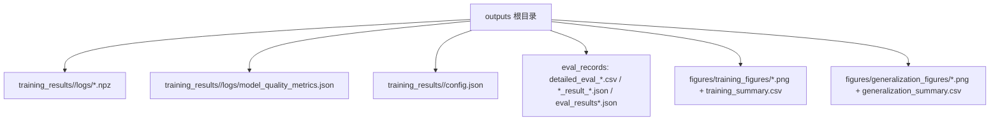
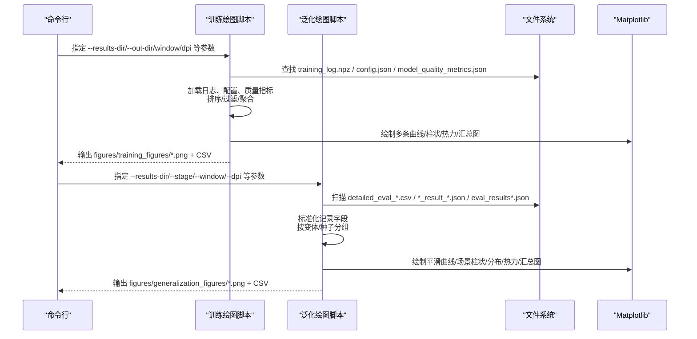
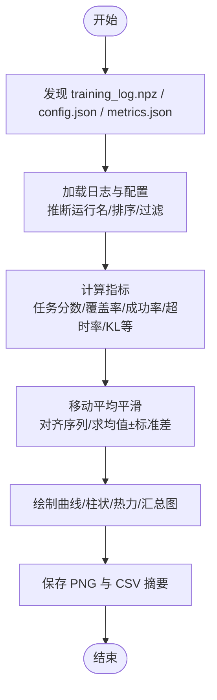
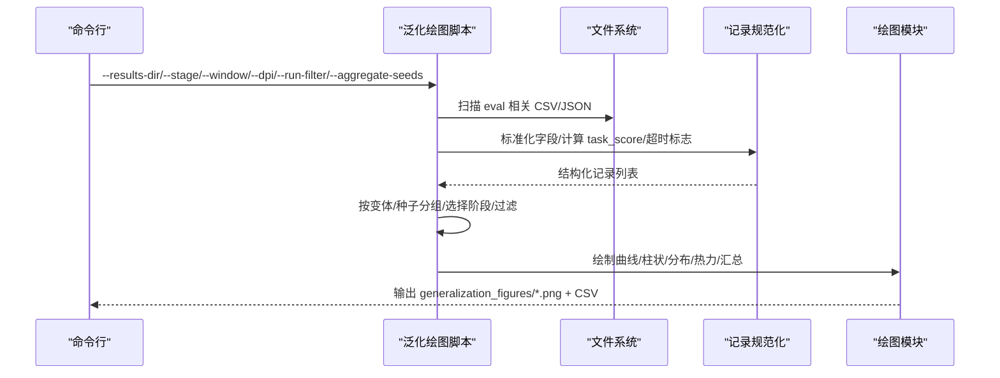
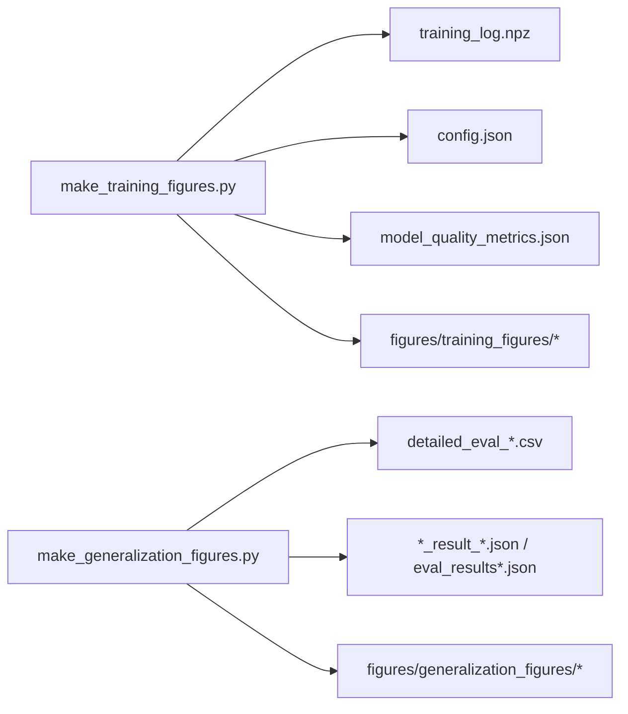

# 结果可视化

<cite>
**本文引用的文件**
- [make_training_figures.py](file://environment_variables/environment_variables/outputs/make_training_figures.py)
- [make_generalization_figures.py](file://environment_variables/environment_variables/outputs/make_generalization_figures.py)
- [config.json](file://environment_variables/environment_variables/outputs/lr_comparison_20260611_093948/训练结果/Fixed_LR_CTDE_PPO_seed42/config.json)
- [model_quality_metrics.json](file://environment_variables/environment_variables/outputs/lr_comparison_20260611_093948/训练结果/Fixed_LR_CTDE_PPO_seed42/logs/model_quality_metrics.json)
- [training_summary.csv](file://environment_variables/environment_variables/outputs/lr_comparison_20260611_093948/figures/seed42/training_figures/training_summary.csv)
</cite>

## 目录
1. [简介](#简介)
2. [项目结构](#项目结构)
3. [核心组件](#核心组件)
4. [架构总览](#架构总览)
5. [详细组件分析](#详细组件分析)
6. [依赖关系分析](#依赖关系分析)
7. [性能与样式配置](#性能与样式配置)
8. [故障排查指南](#故障排查指南)
9. [结论](#结论)
10. [附录：自定义可视化脚本开发指南](#附录自定义可视化脚本开发指南)

## 简介
本文件面向“结果可视化系统”，聚焦两个关键脚本：
- make_training_figures.py：从已保存的训练日志（npz、json）生成训练曲线图，包括任务分数、奖励、覆盖率、成功率、KL散度、学习率、PPO诊断等指标。
- make_generalization_figures.py：从已保存的泛化评估记录（CSV/JSON）生成对比图表，支持按场景、汇总统计、分布与热力图等。

文档将解释数据读取、指标计算、平滑与聚合、绘图输出流程，并给出批量生成与自动化报告示例。

## 项目结构
可视化脚本位于 outputs 目录下，输入数据来自训练与评估产出的 logs 与 figures 目录；输出统一写入 figures 子目录。

图示来源
- [make_training_figures.py:118-154](file://environment_variables/environment_variables/outputs/make_training_figures.py#L118-L154)
- [make_generalization_figures.py:169-224](file://environment_variables/environment_variables/outputs/make_generalization_figures.py#L169-L224)

章节来源
- [make_training_figures.py:118-154](file://environment_variables/environment_variables/outputs/make_training_figures.py#L118-L154)
- [make_generalization_figures.py:169-224](file://environment_variables/environment_variables/outputs/make_generalization_figures.py#L169-L224)

## 核心组件
- 训练曲线生成器（make_training_figures.py）
  - 负责发现与加载训练日志（npz）、配置文件（config.json）、质量指标（model_quality_metrics.json）。
  - 提供多种曲线与汇总图：奖励、任务分数、边界覆盖率、成功率、步数、超时率、阶段转换、完成原因、损失曲线、熵、PPO KL/Clip、学习率动作计数、进度预算、场景维度分析、最后窗口汇总、模型质量摘要等。
  - 支持多运行分组、种子聚合（mean±std）、移动平均平滑、滚动窗口统计。
- 泛化能力对比生成器（make_generalization_figures.py）
  - 负责扫描与解析评估记录（CSV/JSON），归一化为统一字段，按变体/种子分组。
  - 提供平滑曲线、按场景柱状图、汇总图、箱线图、效率散点、热力图等。
  - 支持选择评估阶段、过滤运行、种子聚合。

章节来源
- [make_training_figures.py:225-249](file://environment_variables/environment_variables/outputs/make_training_figures.py#L225-L249)
- [make_training_figures.py:1208-1262](file://environment_variables/environment_variables/outputs/make_training_figures.py#L1208-L1262)
- [make_generalization_figures.py:345-358](file://environment_variables/environment_variables/outputs/make_generalization_figures.py#L345-L358)
- [make_generalization_figures.py:882-940](file://environment_variables/environment_variables/outputs/make_generalization_figures.py#L882-L940)

## 架构总览
下图展示训练与泛化两条主流程：从结果目录定位、数据加载、指标计算、绘图到输出。

图示来源
- [make_training_figures.py:1265-1322](file://environment_variables/environment_variables/outputs/make_training_figures.py#L1265-L1322)
- [make_generalization_figures.py:943-997](file://environment_variables/environment_variables/outputs/make_generalization_figures.py#L943-L997)

## 详细组件分析

### 训练曲线生成逻辑（make_training_figures.py）
- 数据发现与加载
  - 自动搜索 training_log.npz、config.json、model_quality_metrics.json，兼容新旧目录结构。
  - 根据 variant_name 或目录名推断运行名称，支持 _seedN 后缀去重与排序。
- 指标计算
  - 任务分数：优先使用 task_scores；否则由覆盖率、成功率、长度组合计算。
  - 超时率、零覆盖超时率、阶段转换、完成原因分布、Actor/Critic Loss、策略熵、PPO KL/Clip、学习率与动作计数、环境步数与更新次数、按场景均值等。
- 平滑与聚合
  - 移动平均窗口（可配置），对齐不同长度的序列后求均值与标准差，用于种子聚合。
- 输出
  - 生成 fig*.png 系列与 training_summary.csv。

图示来源
- [make_training_figures.py:118-154](file://environment_variables/environment_variables/outputs/make_training_figures.py#L118-L154)
- [make_training_figures.py:338-346](file://environment_variables/environment_variables/outputs/make_training_figures.py#L338-L346)
- [make_training_figures.py:308-316](file://environment_variables/environment_variables/outputs/make_training_figures.py#L308-L316)
- [make_training_figures.py:1208-1262](file://environment_variables/environment_variables/outputs/make_training_figures.py#L1208-L1262)

章节来源
- [make_training_figures.py:225-249](file://environment_variables/environment_variables/outputs/make_training_figures.py#L225-L249)
- [make_training_figures.py:338-346](file://environment_variables/environment_variables/outputs/make_training_figures.py#L338-L346)
- [make_training_figures.py:308-316](file://environment_variables/environment_variables/outputs/make_training_figures.py#L308-L316)
- [make_training_figures.py:1208-1262](file://environment_variables/environment_variables/outputs/make_training_figures.py#L1208-L1262)

### 泛化能力对比图表实现（make_generalization_figures.py）
- 数据发现与解析
  - 支持多种文件名模式：detailed_eval_*.csv、*_result_*.json、eval_results*.json、generalization_results*.json 等。
  - 将 CSV/JSON 记录标准化为统一字段（coverage、success、steps、timeout、task_score、done_reason、info_gain 等）。
- 分组与筛选
  - 按变体名称分组，支持 _seedN 聚合；可选择特定评估阶段；支持运行名过滤。
- 图表类型
  - 平滑曲线（任务分数、奖励、覆盖率、成功率、步数）、完成原因分布、按场景柱状图、汇总图、箱线图、效率散点（步骤 vs 覆盖率，气泡大小为任务分数）、任务分数热力图（变体×场景）。
- 输出
  - 生成 gen*.png 系列与 generalization_summary.csv。

图示来源
- [make_generalization_figures.py:169-224](file://environment_variables/environment_variables/outputs/make_generalization_figures.py#L169-L224)
- [make_generalization_figures.py:256-292](file://environment_variables/environment_variables/outputs/make_generalization_figures.py#L256-L292)
- [make_generalization_figures.py:882-940](file://environment_variables/environment_variables/outputs/make_generalization_figures.py#L882-L940)

章节来源
- [make_generalization_figures.py:256-292](file://environment_variables/environment_variables/outputs/make_generalization_figures.py#L256-L292)
- [make_generalization_figures.py:882-940](file://environment_variables/environment_variables/outputs/make_generalization_figures.py#L882-L940)

### 图表样式配置、DPI设置与输出格式
- Matplotlib 全局样式
  - 字体族与回退顺序、网格线样式与透明度、边框隐藏、savefig.bbox=tight。
  - figure.dpi 默认 120；命令行 --dpi 可覆盖（默认 300）。
- 颜色与标签映射
  - 内置 RUN_ORDER/LABELS/COLORS 字典，保证跨脚本一致的视觉风格。
- 输出路径与命名
  - 训练：figures/training_figures/fig*.png + training_summary.csv
  - 泛化：figures/generalization_figures/gen*.png + generalization_summary.csv
- 示例输出
  - training_summary.csv 包含各运行的关键指标汇总（如 last_task_score_percent、auc_task_score_percent、kl_overshoot_percent 等）。

章节来源
- [make_training_figures.py:79-98](file://environment_variables/environment_variables/outputs/make_training_figures.py#L79-L98)
- [make_training_figures.py:1265-1284](file://environment_variables/environment_variables/outputs/make_training_figures.py#L1265-L1284)
- [make_generalization_figures.py:75-94](file://environment_variables/environment_variables/outputs/make_generalization_figures.py#L75-L94)
- [make_generalization_figures.py:943-963](file://environment_variables/environment_variables/outputs/make_generalization_figures.py#L943-L963)
- [training_summary.csv:1-4](file://environment_variables/environment_variables/outputs/lr_comparison_20260611_093948/figures/seed42/training_figures/training_summary.csv#L1-L4)

## 依赖关系分析
- 外部库
  - matplotlib（Agg 后端，无头渲染）、numpy（数组与卷积平滑）、argparse（命令行）、pathlib（路径处理）、csv/json（I/O）。
- 内部依赖
  - 训练脚本依赖 training_log.npz、config.json、model_quality_metrics.json。
  - 泛化脚本依赖 eval 记录的 CSV/JSON 集合。
- 耦合与内聚
  - 两脚本各自独立，职责清晰；通过统一的 RUN_ORDER/LABELS/COLORS 约定保持风格一致。
  - 聚合函数 aligned_mean_std、rolling_mean 在两个脚本中重复实现，便于独立运行但存在轻微冗余。

图示来源
- [make_training_figures.py:118-154](file://environment_variables/environment_variables/outputs/make_training_figures.py#L118-L154)
- [make_generalization_figures.py:169-224](file://environment_variables/environment_variables/outputs/make_generalization_figures.py#L169-L224)

章节来源
- [make_training_figures.py:118-154](file://environment_variables/environment_variables/outputs/make_training_figures.py#L118-L154)
- [make_generalization_figures.py:169-224](file://environment_variables/environment_variables/outputs/make_generalization_figures.py#L169-L224)

## 性能与样式配置
- 性能要点
  - 移动平均采用 numpy.convolve，时间复杂度 O(n·w)，对长序列建议合理设置 window。
  - 对齐聚合时以最短序列长度为基准，避免越界与内存膨胀。
  - Agg 后端适合服务器/CI 环境无头渲染。
- 样式与 DPI
  - 默认 figure.dpi=120，命令行 --dpi 可设为 300 或更高以满足出版要求。
  - savefig.bbox=tight 减少白边；网格 alpha 与虚线提升可读性。
- 输出格式
  - PNG 图片 + CSV 摘要，便于后续自动化报告拼接。

章节来源
- [make_training_figures.py:79-98](file://environment_variables/environment_variables/outputs/make_training_figures.py#L79-L98)
- [make_training_figures.py:1265-1284](file://environment_variables/environment_variables/outputs/make_training_figures.py#L1265-L1284)
- [make_generalization_figures.py:75-94](file://environment_variables/environment_variables/outputs/make_generalization_figures.py#L75-L94)
- [make_generalization_figures.py:943-963](file://environment_variables/environment_variables/outputs/make_generalization_figures.py#L943-L963)

## 故障排查指南
- 未找到训练日志
  - 现象：报错提示找不到 training_log.npz。
  - 排查：确认 --results-dir 指向包含 training_results 或 logs 的目录；检查文件是否存在且非空。
- 未找到泛化数据
  - 现象：报错提示未找到 eval 相关 CSV/JSON。
  - 排查：确保评估运行已产出 detailed_eval_*.csv 或 *_result_*.json / eval_results*.json。
- 运行名过滤无效
  - 现象：--run-filter 未匹配任何运行。
  - 排查：检查运行名是否包含目标文本；必要时移除过滤或调整匹配词。
- 阶段选择错误
  - 现象：--stage 指定的阶段不存在。
  - 排查：查看可用阶段（脚本会列出），选择最高或存在的阶段。
- 中文显示异常
  - 现象：中文字体缺失导致乱码。
  - 排查：确保系统安装 Times New Roman/Microsoft YaHei/SimHei/DejaVu Sans 之一。

章节来源
- [make_training_figures.py:147-175](file://environment_variables/environment_variables/outputs/make_training_figures.py#L147-L175)
- [make_generalization_figures.py:213-245](file://environment_variables/environment_variables/outputs/make_generalization_figures.py#L213-L245)
- [make_training_figures.py:79-98](file://environment_variables/environment_variables/outputs/make_training_figures.py#L79-L98)
- [make_generalization_figures.py:75-94](file://environment_variables/environment_variables/outputs/make_generalization_figures.py#L75-L94)

## 结论
该可视化系统围绕“训练”和“泛化”两大主题，提供了从数据发现、指标计算、平滑聚合到高质量出图的完整流水线。通过统一的样式与命名约定，以及灵活的命令行参数，用户可快速复现实验结果并进行对比分析。

## 附录：自定义可视化脚本开发指南
- 基本步骤
  - 确定输入数据源（npz 或 CSV/JSON），参考现有脚本的路径发现与解析逻辑。
  - 定义指标计算函数（例如任务分数、覆盖率、成功率、KL 等），复用 rolling_mean 与 aligned_mean_std。
  - 编写绘图函数（单轴/双轴/多图），遵循统一的颜色与标签映射。
  - 在主流程中注册新图表，并输出 PNG 与可选的 CSV 摘要。
- 常用参数
  - --results-dir/--out-dir：输入/输出目录
  - --window：移动平均窗口
  - --dpi：图像分辨率
  - --max-steps：最大步数（影响 y 轴上限与效率计算）
  - --run-filter：运行名过滤
  - --aggregate-seeds：按方法聚合种子（mean±std）
  - --stage：选择评估阶段（泛化脚本）
- 批量生成与自动化报告示例
  - 批量训练图
    - python make_training_figures.py --results-dir <结果根目录> --out-dir <输出目录> --window 100 --dpi 300 --aggregate-seeds
  - 批量泛化图
    - python make_generalization_figures.py --results-dir <结果根目录> --out-dir <输出目录> --window 10 --dpi 300 --stage 3 --aggregate-seeds
  - 结合 shell 循环遍历多个实验目录，生成统一风格的报告图集与 CSV 汇总，便于后续插入论文或汇报材料。

章节来源
- [make_training_figures.py:1265-1322](file://environment_variables/environment_variables/outputs/make_training_figures.py#L1265-L1322)
- [make_generalization_figures.py:943-997](file://environment_variables/environment_variables/outputs/make_generalization_figures.py#L943-L997)
- [config.json:1-105](file://environment_variables/environment_variables/outputs/lr_comparison_20260611_093948/训练结果/Fixed_LR_CTDE_PPO_seed42/config.json#L1-L105)
- [model_quality_metrics.json:1-31](file://environment_variables/environment_variables/outputs/lr_comparison_20260611_093948/训练结果/Fixed_LR_CTDE_PPO_seed42/logs/model_quality_metrics.json#L1-L31)