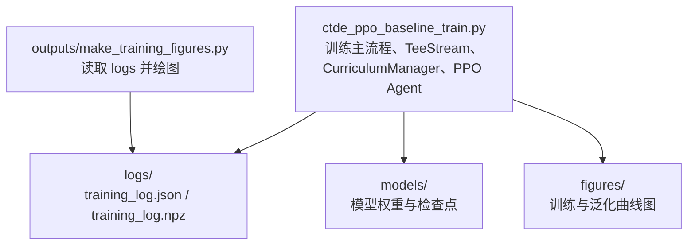
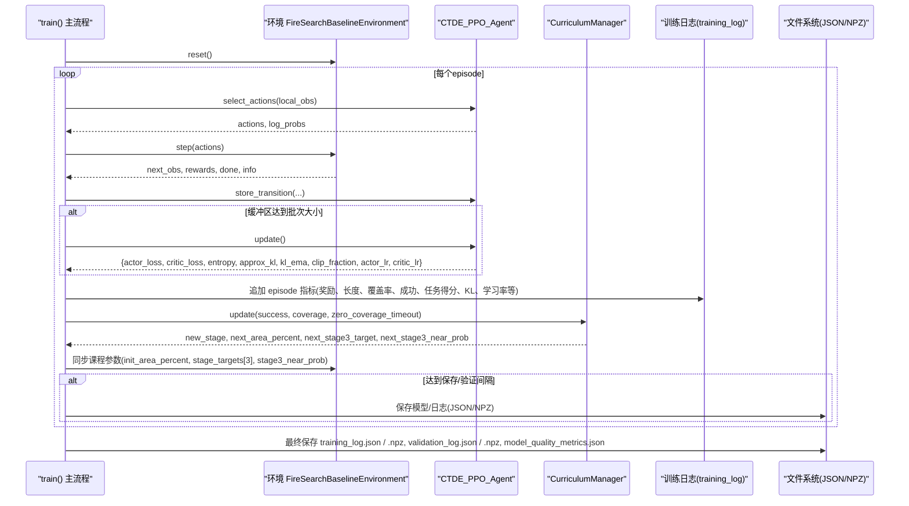
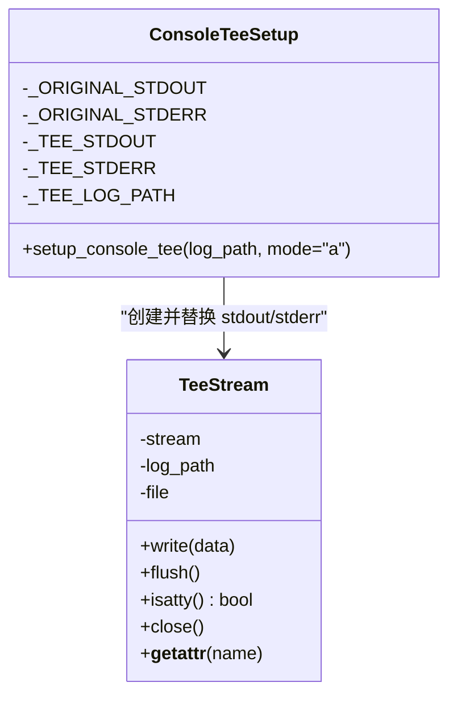
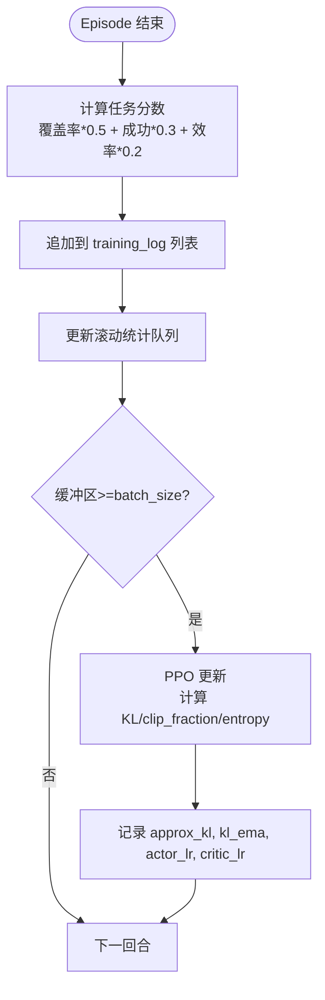
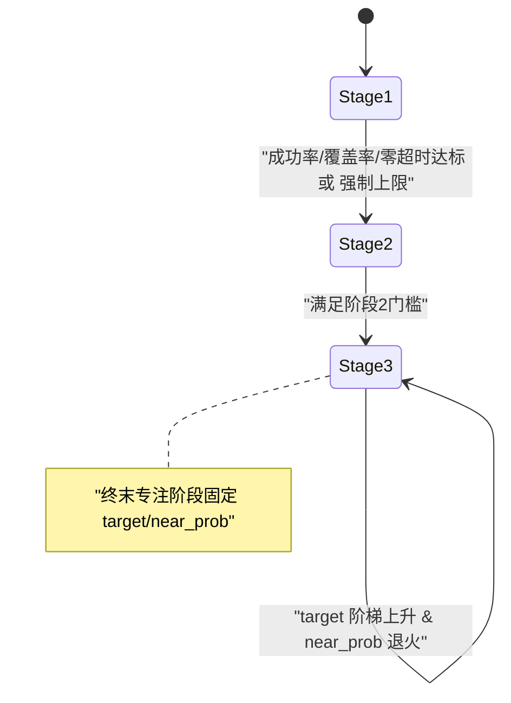
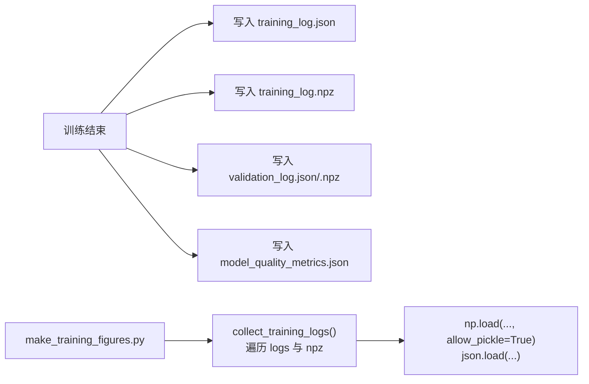
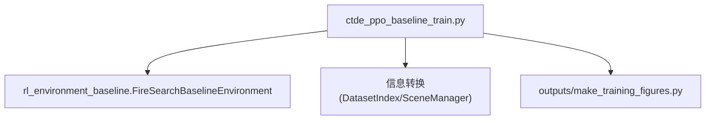

# 训练监控

<cite>
**本文引用的文件**   
- [ctde_ppo_baseline_train.py](file://environment_variables/environment_variables/ctde_ppo_baseline_train.py)
- [make_training_figures.py](file://environment_variables/environment_variables/outputs/make_training_figures.py)
</cite>

## 目录
1. [简介](#简介)
2. [项目结构](#项目结构)
3. [核心组件](#核心组件)
4. [架构总览](#架构总览)
5. [详细组件分析](#详细组件分析)
6. [依赖关系分析](#依赖关系分析)
7. [性能与稳定性考量](#性能与稳定性考量)
8. [故障排查指南](#故障排查指南)
9. [结论](#结论)
10. [附录：日志结构与字段说明](#附录日志结构与字段说明)

## 简介
本文件面向训练监控系统，聚焦以下目标：
- 详细说明 TeeStream 类的控制台日志记录机制
- 解释训练过程中的指标收集（任务分数、覆盖率、KL散度、学习率等）的计算与存储
- 描述 CurriculumManager 的课程学习状态监控与阶段切换逻辑
- 说明训练日志的结构与格式（JSON 与 NPZ），以及可视化脚本如何读取
- 提供实时监控与调试技巧

## 项目结构
本项目围绕一个基线 CTDE-PPO 训练脚本组织，关键路径如下：
- 训练主流程与监控实现位于 ctde_ppo_baseline_train.py
- 图表生成与日志汇总读取位于 outputs/make_training_figures.py

图示来源
- [ctde_ppo_baseline_train.py:1278-1813](file://environment_variables/environment_variables/ctde_ppo_baseline_train.py#L1278-L1813)
- [make_training_figures.py:101-144](file://environment_variables/environment_variables/outputs/make_training_figures.py#L101-L144)

章节来源
- [ctde_ppo_baseline_train.py:1278-1813](file://environment_variables/environment_variables/ctde_ppo_baseline_train.py#L1278-L1813)
- [make_training_figures.py:101-144](file://environment_variables/environment_variables/outputs/make_training_figures.py#L101-L144)

## 核心组件
- TeeStream：将 stdout/stderr 同时写入控制台与文件，保证可复现的文本日志
- CurriculumManager：基于成功率、覆盖率、零覆盖超时率等指标动态调整课程难度与参数
- CTDE_PPO_Agent：PPO 更新、KL 自适应学习率、GAE 优势估计、熵正则等
- 训练循环：每回合计算任务分数、记录滚动统计、按间隔保存模型与日志
- 质量评估：训练后对验证集与泛化集进行评估，输出 JSON/NPZ 日志与图表

章节来源
- [ctde_ppo_baseline_train.py:47-96](file://environment_variables/environment_variables/ctde_ppo_baseline_train.py#L47-L96)
- [ctde_ppo_baseline_train.py:569-758](file://environment_variables/environment_variables/ctde_ppo_baseline_train.py#L569-L758)
- [ctde_ppo_baseline_train.py:759-1014](file://environment_variables/environment_variables/ctde_ppo_baseline_train.py#L759-L1014)
- [ctde_ppo_baseline_train.py:1278-1813](file://environment_variables/environment_variables/ctde_ppo_baseline_train.py#L1278-L1813)

## 架构总览
下图展示了训练主流程中各模块的交互与数据流向。

图示来源
- [ctde_ppo_baseline_train.py:1469-1604](file://environment_variables/environment_variables/ctde_ppo_baseline_train.py#L1469-L1604)
- [ctde_ppo_baseline_train.py:1554-1586](file://environment_variables/environment_variables/ctde_ppo_baseline_train.py#L1554-L1586)
- [ctde_ppo_baseline_train.py:1684-1697](file://environment_variables/environment_variables/ctde_ppo_baseline_train.py#L1684-L1697)

## 详细组件分析

### TeeStream 控制台日志记录机制
- 设计要点
  - 通过重写 write/flush/isatty/close 等方法，将同一份输出同时写入原始流（控制台）与本地文件
  - setup_console_tee 在训练开始时替换 sys.stdout/sys.stderr，确保所有 print 与异常信息均被持久化
  - 使用单行缓冲与 UTF-8 编码，避免乱码与丢失
- 典型调用
  - 训练入口创建输出目录后，立即设置控制台 tee，随后打印配置与环境信息
- 注意事项
  - 若多次调用且路径相同则跳过重复初始化；否则先关闭旧实例再重建
  - 仅关闭文件句柄，isatty 透传给原流以维持终端特性

图示来源
- [ctde_ppo_baseline_train.py:47-96](file://environment_variables/environment_variables/ctde_ppo_baseline_train.py#L47-L96)

章节来源
- [ctde_ppo_baseline_train.py:47-96](file://environment_variables/environment_variables/ctde_ppo_baseline_train.py#L47-L96)
- [ctde_ppo_baseline_train.py:1286-1287](file://environment_variables/environment_variables/ctde_ppo_baseline_train.py#L1286-L1287)

### 指标收集与计算
- 任务分数
  - 由覆盖率、是否成功、步长与最大步数加权合成，体现“完成+效率”的综合评价
- 覆盖率与超时
  - 边界覆盖率来自环境返回；超时与“零覆盖超时”用于惩罚无效探索
- KL 散度与学习率
  - PPO 更新时计算近似 KL 与裁剪比例；支持固定或基于 KL EMA 的学习率自适应
- 滚动统计
  - 最近窗口内的奖励、长度、覆盖率、成功率、任务得分、超时率等用于实时打印与质量评估

图示来源
- [ctde_ppo_baseline_train.py:295-297](file://environment_variables/environment_variables/ctde_ppo_baseline_train.py#L295-L297)
- [ctde_ppo_baseline_train.py:889-991](file://environment_variables/environment_variables/ctde_ppo_baseline_train.py#L889-L991)
- [ctde_ppo_baseline_train.py:1520-1552](file://environment_variables/environment_variables/ctde_ppo_baseline_train.py#L1520-L1552)

章节来源
- [ctde_ppo_baseline_train.py:295-297](file://environment_variables/environment_variables/ctde_ppo_baseline_train.py#L295-L297)
- [ctde_ppo_baseline_train.py:889-991](file://environment_variables/environment_variables/ctde_ppo_baseline_train.py#L889-L991)
- [ctde_ppo_baseline_train.py:1520-1552](file://environment_variables/environment_variables/ctde_ppo_baseline_train.py#L1520-L1552)

### CurriculumManager 课程学习状态监控与阶段切换
- 阶段定义
  - 阶段1：提升初始位置百分位（init_area_percent）
  - 阶段2：提高成功率门槛与最小回合数
  - 阶段3：逐步提升目标成功率与退火 near_prob（近端采样概率）
- 能力门控
  - 依据成功率、平均覆盖率、零覆盖超时率与回合数阈值判断是否推进
- 终末专注
  - 最后若干回合强制切换到最终 target 与 near_prob=0，稳定评估条件
- 与环境的耦合
  - 当课程参数变化时，同步至 env.init_area_percent、env.stage_targets[3]、env.stage3_near_prob，并在必要时触发一次强制更新

图示来源
- [ctde_ppo_baseline_train.py:569-758](file://environment_variables/environment_variables/ctde_ppo_baseline_train.py#L569-L758)
- [ctde_ppo_baseline_train.py:1554-1586](file://environment_variables/environment_variables/ctde_ppo_baseline_train.py#L1554-L1586)

章节来源
- [ctde_ppo_baseline_train.py:569-758](file://environment_variables/environment_variables/ctde_ppo_baseline_train.py#L569-L758)
- [ctde_ppo_baseline_train.py:1554-1586](file://environment_variables/environment_variables/ctde_ppo_baseline_train.py#L1554-L1586)

### 训练日志结构与保存机制
- 保存时机
  - 训练结束时统一写入 training_log.json 与 training_log.npz；验证日志同理
  - 定期保存模型检查点（含最佳训练/验证模型）
- 内容结构
  - training_log：包含实验元信息、每回合指标、PPO 更新指标、课程参数序列等
  - validation_log：验证集指标与泛化差距
  - model_quality_metrics.json：收敛效率、奖励稳定性、KL 稳定性等汇总
- 可视化读取
  - make_training_figures.py 会扫描结果目录下的 logs/training_log.* 与顶层 npz，去重后加载绘制

图示来源
- [ctde_ppo_baseline_train.py:1684-1697](file://environment_variables/environment_variables/ctde_ppo_baseline_train.py#L1684-L1697)
- [make_training_figures.py:118-144](file://environment_variables/environment_variables/outputs/make_training_figures.py#L118-L144)
- [make_training_figures.py:225-249](file://environment_variables/environment_variables/outputs/make_training_figures.py#L225-L249)

章节来源
- [ctde_ppo_baseline_train.py:1684-1697](file://environment_variables/environment_variables/ctde_ppo_baseline_train.py#L1684-L1697)
- [make_training_figures.py:118-144](file://environment_variables/environment_variables/outputs/make_training_figures.py#L118-L144)
- [make_training_figures.py:225-249](file://environment_variables/environment_variables/outputs/make_training_figures.py#L225-L249)

### 实时监控与调试技巧
- 控制台日志
  - 使用 setup_console_tee 后，所有 print 与异常都会同时落盘，便于离线回溯
- 训练期打印
  - 每隔 log_interval 打印滚动均值与 KL/学习率/裁剪比例等关键信号，快速定位不稳定
- 课程阶段变更
  - 当 init_area_percent、stage3_target、stage3_near_prob 变化时会打印提示，便于观察课程推进
- 诊断指标
  - 关注 KL 均值与标准差、KL 超限率、clip_fraction 分布、actor_lr 范围，结合 reward/task_score 尾部稳定性判断收敛
- 可视化辅助
  - 训练结束后自动调用 make_training_figures.py 生成曲线，便于对比不同种子/变体

章节来源
- [ctde_ppo_baseline_train.py:1286-1287](file://environment_variables/environment_variables/ctde_ppo_baseline_train.py#L1286-L1287)
- [ctde_ppo_baseline_train.py:1588-1604](file://environment_variables/environment_variables/ctde_ppo_baseline_train.py#L1588-L1604)
- [ctde_ppo_baseline_train.py:1574-1586](file://environment_variables/environment_variables/ctde_ppo_baseline_train.py#L1574-L1586)
- [ctde_ppo_baseline_train.py:1777-1811](file://environment_variables/environment_variables/ctde_ppo_baseline_train.py#L1777-L1811)

## 依赖关系分析
- 训练脚本内部依赖
  - 环境类 FireSearchBaselineEnvironment 提供观测、动作、奖励与课程相关参数
  - 数据模块“信息转换”提供数据集索引与场景管理
- 外部工具
  - make_training_figures.py 作为独立脚本读取训练产物进行绘图
- 关键耦合点
  - CurriculumManager 与环境的参数同步
  - PPO Agent 的 KL 自适应与日志字段一致性

图示来源
- [ctde_ppo_baseline_train.py:30-36](file://environment_variables/environment_variables/ctde_ppo_baseline_train.py#L30-L36)
- [ctde_ppo_baseline_train.py:1048-1116](file://environment_variables/environment_variables/ctde_ppo_baseline_train.py#L1048-L1116)

章节来源
- [ctde_ppo_baseline_train.py:30-36](file://environment_variables/environment_variables/ctde_ppo_baseline_train.py#L30-L36)
- [ctde_ppo_baseline_train.py:1048-1116](file://environment_variables/environment_variables/ctde_ppo_baseline_train.py#L1048-L1116)

## 性能与稳定性考量
- 批处理与内存
  - ReplayBuffer 累积轨迹，达到 batch_size 才更新；min_update_batch_size 用于课程切换时的强制更新
- KL 自适应学习率
  - 基于 KL EMA 与目标 KL 的动态因子调节 actor_lr，有助于稳定策略更新
- 梯度裁剪与数值稳定
  - 使用 max_grad_norm 限制梯度范数，优化器 eps 防止除零
- 质量评估
  - 通过尾部分布标准差、AUC、KL 超限率等指标综合衡量收敛与稳定性

章节来源
- [ctde_ppo_baseline_train.py:889-991](file://environment_variables/environment_variables/ctde_ppo_baseline_train.py#L889-L991)
- [ctde_ppo_baseline_train.py:358-433](file://environment_variables/environment_variables/ctde_ppo_baseline_train.py#L358-L433)

## 故障排查指南
- 控制台无日志
  - 确认 setup_console_tee 已调用且输出目录存在；检查权限与磁盘空间
- 课程不推进
  - 检查成功率、覆盖率、零覆盖超时率是否达到阈值；查看阶段回合数是否超过最小值
- KL 过大或不稳定
  - 降低 target_kl 或增大 kl_ema_beta；检查 clip_epsilon 与 batch_size 是否合适
- 无法生成图表
  - 确认 logs 目录下存在 training_log.json 或 training_log.npz；检查 make_training_figures.py 是否能访问结果目录

章节来源
- [ctde_ppo_baseline_train.py:1286-1287](file://environment_variables/environment_variables/ctde_ppo_baseline_train.py#L1286-L1287)
- [ctde_ppo_baseline_train.py:1554-1586](file://environment_variables/environment_variables/ctde_ppo_baseline_train.py#L1554-L1586)
- [ctde_ppo_baseline_train.py:1684-1697](file://environment_variables/environment_variables/ctde_ppo_baseline_train.py#L1684-L1697)
- [make_training_figures.py:118-144](file://environment_variables/environment_variables/outputs/make_training_figures.py#L118-L144)

## 结论
该训练监控系统通过 TeeStream 保障完整控制台日志，利用 CurriculumManager 实现渐进式难度控制，并以 PPO 的 KL 自适应学习率增强稳定性。训练日志采用 JSON 与 NPZ 双格式保存，配合独立的绘图脚本形成闭环，便于实时监控、回溯分析与结果可视化。

## 附录：日志结构与字段说明
- training_log.json/.npz 关键字段（节选）
  - episodes/rewards/lengths/coverages/success/done_reasons/timeout/zero_coverage_timeout
  - avg_distance_to_fire/first_heat_step/first_boundary_step/spawn_modes/reward_breakdown
  - stage/scene_ids/scene_keys/vision_radius/sensor_radius_cells/max_steps/total_steps
  - ppo_updates/actor_loss/critic_loss/entropy/approx_kl/kl_ema/kl_lr_action/clip_fraction
  - actor_lr/critic_lr/init_area_percent/stage3_target/stage3_near_prob/terminal_focus
- validation_log.json/.npz 关键字段（节选）
  - episodes/stage/train_task_score/val_mean_task_score/val_mean_coverage/val_success_rate
  - val_mean_length/val_timeout_rate/val_zero_coverage_timeout_rate/generalization_gap/is_best_val
- model_quality_metrics.json 关键字段（节选）
  - convergence_efficiency/auc_task_score_by_steps/steps_to_threshold/updates_to_threshold
  - reward_stability/reward_std_tail/task_score_std_tail/mean_performance_drop/max_performance_drop
  - kl_stability/mean_kl/kl_std/mean_abs_kl_error/kl_overshoot_rate/clip_fraction_mean/actor_lr_*

章节来源
- [ctde_ppo_baseline_train.py:1393-1436](file://environment_variables/environment_variables/ctde_ppo_baseline_train.py#L1393-L1436)
- [ctde_ppo_baseline_train.py:1438-1450](file://environment_variables/environment_variables/ctde_ppo_baseline_train.py#L1438-L1450)
- [ctde_ppo_baseline_train.py:358-433](file://environment_variables/environment_variables/ctde_ppo_baseline_train.py#L358-L433)