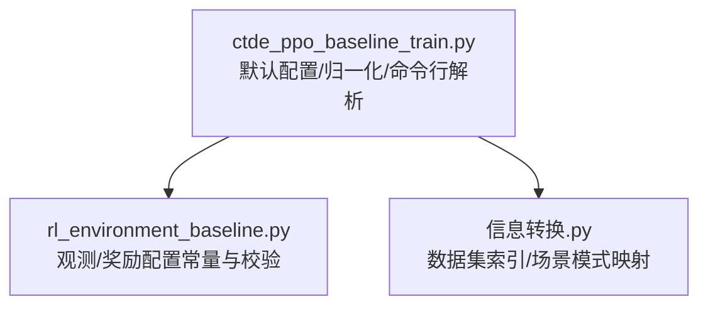
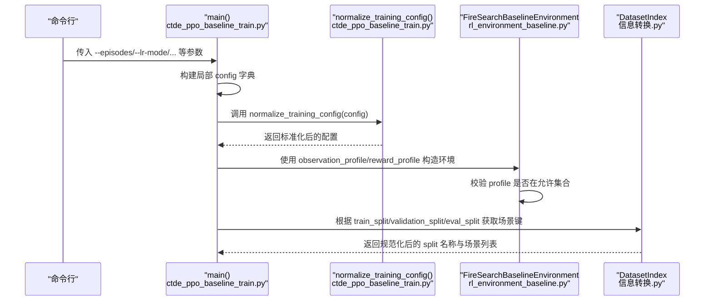
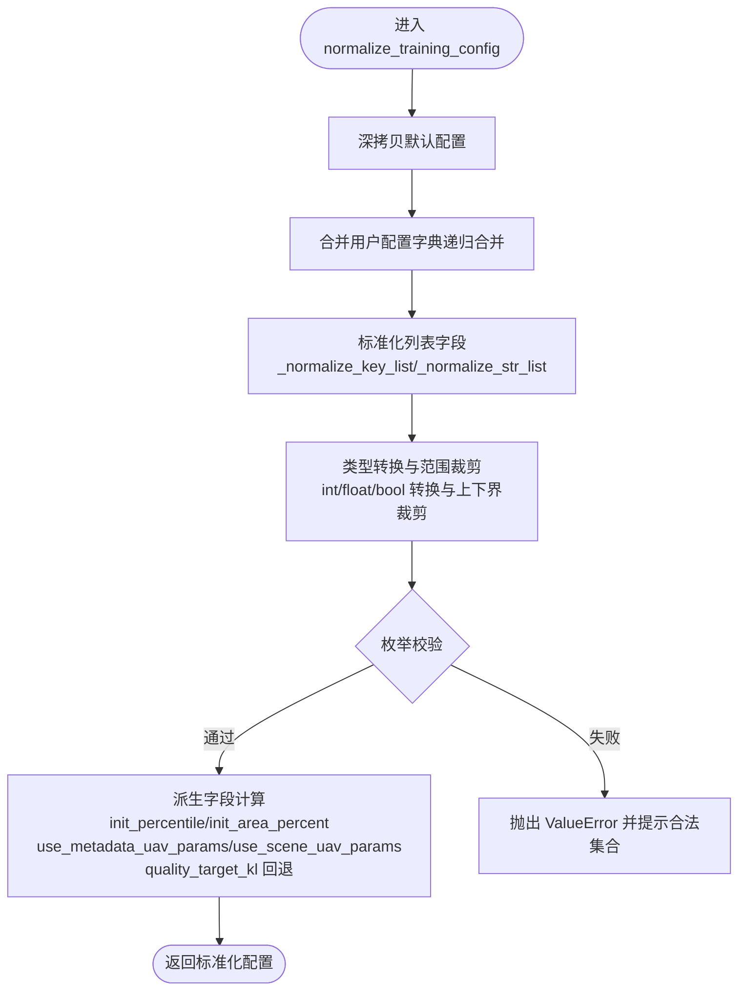
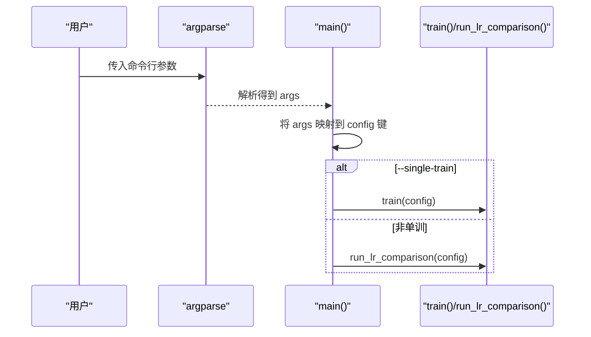
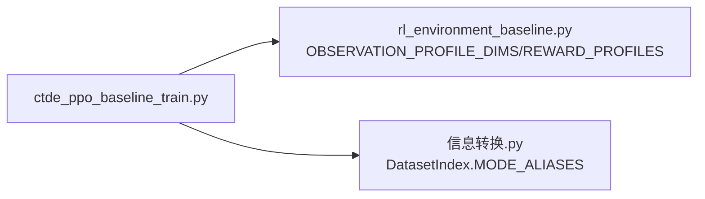

# 配置系统

<cite>
**本文引用的文件**
- [ctde_ppo_baseline_train.py](file://environment_variables/environment_variables/ctde_ppo_baseline_train.py)
- [rl_environment_baseline.py](file://environment_variables/environment_variables/rl_environment_baseline.py)
- [信息转换.py](file://environment_variables/environment_variables/信息转换.py)
</cite>

## 目录
1. [简介](#简介)
2. [项目结构](#项目结构)
3. [核心组件](#核心组件)
4. [架构总览](#架构总览)
5. [详细组件分析](#详细组件分析)
6. [依赖关系分析](#依赖关系分析)
7. [性能与稳定性考量](#性能与稳定性考量)
8. [故障排查指南](#故障排查指南)
9. [结论](#结论)
10. [附录：参数调优与版本迁移](#附录参数调优与版本迁移)

## 简介
本文件面向“配置系统”，聚焦以下目标：
- 解释默认训练配置 DEFAULT_TRAIN_CONFIG 中各参数的含义、默认值与有效范围。
- 详细说明 normalize_training_config 的参数验证与转换逻辑。
- 描述配置文件格式与命令行参数解析机制（当前实现以命令行为主，未提供独立配置文件加载器）。
- 提供关键超参（学习率、网络结构、训练策略等）的调优建议。
- 给出配置项的版本管理与迁移策略建议。

## 项目结构
与配置系统直接相关的代码集中在训练脚本与环境定义中：
- 训练入口与配置归一化：ctde_ppo_baseline_train.py
- 环境观测/奖励配置常量与校验：rl_environment_baseline.py
- 数据集索引与场景路径解析（影响数据切分与场景选择）：信息转换.py

图表来源
- [ctde_ppo_baseline_train.py:98-281](file://environment_variables/environment_variables/ctde_ppo_baseline_train.py#L98-L281)
- [rl_environment_baseline.py:21-35](file://environment_variables/environment_variables/rl_environment_baseline.py#L21-L35)
- [信息转换.py:20-94](file://environment_variables/environment_variables/信息转换.py#L20-L94)

章节来源
- [ctde_ppo_baseline_train.py:98-281](file://environment_variables/environment_variables/ctde_ppo_baseline_train.py#L98-L281)
- [rl_environment_baseline.py:21-35](file://environment_variables/environment_variables/rl_environment_baseline.py#L21-L35)
- [信息转换.py:20-94](file://environment_variables/environment_variables/信息转换.py#L20-L94)

## 核心组件
- 默认训练配置 DEFAULT_TRAIN_CONFIG：集中声明所有可配置项及其默认值。
- 配置归一化函数 normalize_training_config：合并用户配置、类型转换、范围裁剪、枚举校验、派生字段生成。
- 命令行参数解析 main()：将命令行参数映射到配置键，并驱动单训或对比流程。
- 环境与数据侧约束：通过 rl_environment_baseline.py 中的枚举集合与 信息转换.py 的模式别名进行强校验与映射。

章节来源
- [ctde_ppo_baseline_train.py:98-281](file://environment_variables/environment_variables/ctde_ppo_baseline_train.py#L98-L281)
- [ctde_ppo_baseline_train.py:2092-2168](file://environment_variables/environment_variables/ctde_ppo_baseline_train.py#L2092-L2168)
- [rl_environment_baseline.py:21-35](file://environment_variables/environment_variables/rl_environment_baseline.py#L21-L35)
- [信息转换.py:20-94](file://environment_variables/environment_variables/信息转换.py#L20-L94)

## 架构总览
下图展示了从命令行到最终可用配置的完整链路，以及配置对环境的约束。

图表来源
- [ctde_ppo_baseline_train.py:2092-2168](file://environment_variables/environment_variables/ctde_ppo_baseline_train.py#L2092-L2168)
- [ctde_ppo_baseline_train.py:160-281](file://environment_variables/environment_variables/ctde_ppo_baseline_train.py#L160-L281)
- [rl_environment_baseline.py:21-35](file://environment_variables/environment_variables/rl_environment_baseline.py#L21-L35)
- [信息转换.py:20-94](file://environment_variables/environment_variables/信息转换.py#L20-L94)

## 详细组件分析

### 默认训练配置 DEFAULT_TRAIN_CONFIG
该字典定义了全部可调参数及默认值，覆盖数据、环境、训练、评估、输出与可视化等维度。为便于查阅，按功能分组说明如下（仅列出字段名、默认值与有效范围；具体数值请参见源码位置）：

- 数据与场景
  - data_dir: 数据集根目录（字符串路径）
  - train_split / eval_split / validation_split: 数据切分名称（小写字符串，需满足 DatasetIndex.MODE_ALIASES）
  - train_scene_keys / eval_scene_keys: 指定场景键列表（支持逗号分隔字符串或列表）
  - norm_params_source: 归一化统计来源标识（字符串）
- 环境与任务
  - num_drones: 无人机数量（整数，≥1）
  - vision_radius: 感知半径（整数，≥1）
  - max_steps: 每回合最大步数（整数，≥1）
  - use_metadata_uav_params: 是否启用元数据中的UAV参数（布尔）
  - observation_profile: 观测配置（枚举，见下方）
  - reward_profile: 奖励配置（枚举，见下方）
  - init_percentile / init_area_percent: 初始边界百分位/面积百分比（浮点，0~100）
- PPO 与优化
  - actor_lr / critic_lr: 学习率（正浮点）
  - lr_adapt_mode: 自适应模式（固定或KL自适应）
  - target_kl / kl_ema_beta / kl_lr_alpha: KL控制相关（target_kl>0，beta∈[0,0.999]，alpha≥0）
  - gamma / gae_lambda / clip_epsilon / entropy_coef / value_coef / max_grad_norm: PPO标准超参（合理区间见下文）
  - ppo_epochs / batch_size: 更新轮次与批次大小（ppo_epochs≥1，batch_size≥32）
- 训练控制与课程学习
  - total_episodes / max_train_updates: 训练终止条件（total_episodes≥1；max_train_updates>0或None）
  - stage2_success_target / stage3_success_target / stage3_near_prob: 课程学习门槛（0~1）
- 验证与评估
  - validation_interval / validation_episodes_per_scene / save_best_by_validation: 验证频率与指标
  - eval_episodes_per_scene / eval_stages / eval_seed_stride / eval_after_train: 评估设置
  - final_eval_splits / final_eval_episodes_per_scene / evaluate_best_val_after_train: 最终评估集与流程
- 质量度量
  - quality_score_threshold / quality_window / quality_tail_fraction / quality_target_kl: 收敛与稳定性度量阈值
- 输出与可视化
  - output_root_dir / output_subdir: 输出目录
  - plot_after_train / figure_window / figure_dpi: 绘图开关与分辨率
  - seed / comparison_seeds: 随机种子与对比种子列表

注意：
- observation_profile 必须属于 FireSearchBaselineEnvironment.OBSERVATION_PROFILE_DIMS 的键集合。
- reward_profile 必须属于 FireSearchBaselineEnvironment.REWARD_PROFILES 的集合。
- 部分字段在归一化过程中会被裁剪到安全范围或转换为期望类型。

章节来源
- [ctde_ppo_baseline_train.py:98-158](file://environment_variables/environment_variables/ctde_ppo_baseline_train.py#L98-L158)
- [rl_environment_baseline.py:21-35](file://environment_variables/environment_variables/rl_environment_baseline.py#L21-L35)

### 配置归一化 normalize_training_config
职责与流程要点：
- 深拷贝默认配置作为基底，再合并用户传入的配置。
- 内置辅助函数处理列表类字段：
  - _normalize_key_list：将逗号分隔字符串转为去空白字符串列表；若为None则保持None。
  - _normalize_str_list：同上，但统一转小写。
- 逐字段进行类型转换与范围裁剪，常见规则包括：
  - 整型且最小值限制：num_drones、vision_radius、max_steps、ppo_epochs、save_interval、log_interval、validation_interval、validation_episodes_per_scene、eval_episodes_per_scene、eval_seed_stride、figure_window、figure_dpi 等均被强制为≥1（或≥32等），seed 强制为 int。
  - 浮点范围裁剪：kl_ema_beta ∈ [0, 0.999]；stage2/3 成功率与 near_prob ∈ [0, 1]；quality_tail_fraction ∈ [0.05, 1]；target_kl、actor_lr_min、actor_lr_max 有下界保护；actor_lr_max ≥ actor_lr_min。
  - 枚举校验：observation_profile 必须在 OBSERVATION_PROFILE_DIMS 中；reward_profile 必须在 REWARD_PROFILES 中；lr_adapt_mode 必须为 'fixed' 或 'kl'。
  - 派生字段：
    - observation_profile_dims 复制自环境类的维度表。
    - init_percentile 与 init_area_percent 互备：若只设其一，另一自动同步。
    - use_metadata_uav_params 与 use_scene_uav_params 保持一致。
    - quality_target_kl 若未显式设置，则回退为 target_kl。
    - max_train_updates 非正数时视为 None。
- 错误处理：当枚举不合法或范围越界时抛出 ValueError，提示合法取值集合。

图表来源
- [ctde_ppo_baseline_train.py:160-281](file://environment_variables/environment_variables/ctde_ppo_baseline_train.py#L160-L281)
- [rl_environment_baseline.py:21-35](file://environment_variables/environment_variables/rl_environment_baseline.py#L21-L35)

章节来源
- [ctde_ppo_baseline_train.py:160-281](file://environment_variables/environment_variables/ctde_ppo_baseline_train.py#L160-L281)

### 命令行参数解析机制
main() 使用 argparse 定义一组短横线风格的参数，并将它们映射到配置键。主要映射关系（节选）：
- --episodes → total_episodes
- --max-updates → max_train_updates
- --data-dir → data_dir
- --output-dir → output_dir
- --train-split → train_split
- --eval-split → eval_split
- --eval-scene-keys → eval_scene_keys（逗号分隔字符串→列表）
- --seed → seed
- --lr-comparison / --single-train → 控制运行模式（对比或单训）
- --lr-mode → lr_adapt_mode（choices: fixed, kl）
- --target-kl → target_kl（同时写入 quality_target_kl）
- --kl-lr-alpha → kl_lr_alpha
- --init-percentile / --init-area-percent → 双向同步写入两个字段
- --use-metadata-uav-params → use_metadata_uav_params
- --observation-profile / --reward-profile → 对应 profile 字段
- --no-eval → eval_after_train=False
- --no-plot → plot_after_train=False

随后根据 --single-train 决定调用 train(config) 还是 run_lr_comparison(base_config)。

图表来源
- [ctde_ppo_baseline_train.py:2092-2168](file://environment_variables/environment_variables/ctde_ppo_baseline_train.py#L2092-L2168)

章节来源
- [ctde_ppo_baseline_train.py:2092-2168](file://environment_variables/environment_variables/ctde_ppo_baseline_train.py#L2092-L2168)

### 配置文件格式说明
- 当前仓库未提供独立的配置文件加载器（如 JSON/YAML 读取）。配置主要通过命令行参数注入，并在内部以字典形式传递。
- 如需持久化配置，建议在外部封装一个轻量加载器，将 JSON/YAML 内容转换为字典后传入 normalize_training_config。

章节来源
- [ctde_ppo_baseline_train.py:2092-2168](file://environment_variables/environment_variables/ctde_ppo_baseline_train.py#L2092-L2168)

## 依赖关系分析
- 训练脚本依赖环境类提供的枚举集合进行强校验，确保 observation_profile 与 reward_profile 合法。
- 数据切分名称由 DatasetIndex 的模式别名规范，train_split/validation_split/eval_split 将被规范化为受支持的键。

图表来源
- [ctde_ppo_baseline_train.py:193-202](file://environment_variables/environment_variables/ctde_ppo_baseline_train.py#L193-L202)
- [rl_environment_baseline.py:21-35](file://environment_variables/environment_variables/rl_environment_baseline.py#L21-L35)
- [信息转换.py:20-94](file://environment_variables/environment_variables/信息转换.py#L20-L94)

章节来源
- [ctde_ppo_baseline_train.py:193-202](file://environment_variables/environment_variables/ctde_ppo_baseline_train.py#L193-L202)
- [rl_environment_baseline.py:21-35](file://environment_variables/environment_variables/rl_environment_baseline.py#L21-L35)
- [信息转换.py:20-94](file://environment_variables/environment_variables/信息转换.py#L20-L94)

## 性能与稳定性考量
- 批大小与更新轮次：batch_size 过小会导致梯度估计方差大，过大可能超出内存；ppo_epochs 增加会提升样本利用率但易过拟合。
- KL 自适应：target_kl 过小可能导致步长过小、收敛缓慢；过大则不稳定。kl_ema_beta 接近上限时响应更灵敏但噪声更大。
- 价值与熵系数：value_coef 过高可能抑制探索；entropy_coef 过低导致策略退化。
- 梯度裁剪：max_grad_norm 用于稳定训练，避免爆炸。
- 课程学习：stage2/stage3 的成功率与覆盖率阈值需要与任务难度匹配，避免过早推进或停滞。

## 故障排查指南
- 枚举非法
  - 现象：初始化或归一化时报错，提示 observation_profile 或 reward_profile 不在允许集合。
  - 排查：确认传入值是否为 baseline/static_terrain/dynamic_front/risk_aware 之一，以及 reward_profile 是否为 boundary_coverage/front_detection/severity_weighted/exploration_balanced 之一。
- 范围越界
  - 现象：初始化时报错，提示某参数必须在 0~100 或 >0 等。
  - 排查：检查 init_percentile/init_area_percent、target_kl、actor_lr_min/max、kl_ema_beta、stageX_target、quality_tail_fraction 等是否在合法区间。
- 数据切分无效
  - 现象：报错 Unknown scene mode。
  - 排查：train_split/validation_split/eval_split 必须为 train/validation/generalization/stress/test/eval 之一（test/eval 会被映射为 generalization）。
- 命令行参数冲突
  - 现象：init_percentile 与 init_area_percent 同时设置时的行为。
  - 说明：两者会互相同步，最终以最后一次赋值为准；归一化时会保证二者一致。

章节来源
- [ctde_ppo_baseline_train.py:193-202](file://environment_variables/environment_variables/ctde_ppo_baseline_train.py#L193-L202)
- [ctde_ppo_baseline_train.py:209-220](file://environment_variables/environment_variables/ctde_ppo_baseline_train.py#L209-L220)
- [信息转换.py:80-94](file://environment_variables/environment_variables/信息转换.py#L80-L94)

## 结论
本配置系统通过“默认配置 + 归一化 + 强校验”的方式，提供了稳健且易用的超参管理方案。命令行参数可直接覆盖默认值，归一化过程负责类型转换、范围裁剪与派生字段生成，从而降低使用门槛并提高可复现性。结合环境枚举与数据集模式别名，系统在易用性与正确性之间取得良好平衡。

## 附录：参数调优与版本迁移

### 学习率与KL自适应
- lr_adapt_mode=fixed：适合快速基线实验；建议先以 actor_lr≈2e-4、critic_lr≈5e-4 起步。
- lr_adapt_mode=kl：推荐 target_kl≈0.01，kl_ema_beta≈0.9，kl_lr_alpha≈0.1；观察 KL 均值与 overshoot 比率，逐步微调。

### 网络结构与PPO超参
- ppo_epochs 与 batch_size：优先增大 batch_size 至稳定（≥32），再适度增加 ppo_epochs（4~8）。
- clip_epsilon：常用 0.1~0.3；entropy_coef 0.01~0.05；value_coef 0.5~1.0；max_grad_norm 0.5~1.0。
- gamma/gae_lambda：gamma≈0.99，gae_lambda≈0.95 是稳健起点。

### 课程学习与任务难度
- stage2_success_target 与 stage3_success_target：随任务复杂度上调，避免过快推进导致不稳定。
- stage3_near_prob：渐进退火，配合成功率与零超时率门限，防止过早放弃近端采样。

### 数据与评估
- train_split/validation_split/eval_split：确保 dataset_index.json 中存在对应切分；必要时添加 test/eval 别名。
- eval_episodes_per_scene 与 final_eval_splits：评估充分性取决于场景多样性与随机种子跨度。

### 版本管理与迁移策略
- 向后兼容：DEFAULT_TRAIN_CONFIG 作为唯一权威源，新增字段应提供合理默认值，避免破坏旧配置。
- 弃用字段：保留旧键名但在归一化阶段发出警告并映射到新字段，逐步淘汰。
- 配置快照：每次重要变更记录配置差异（diff），并在输出目录保存本次运行的完整配置副本，便于回溯。
- 枚举扩展：新增 observation_profile/reward_profile 时，先在环境类注册，再在归一化处校验生效。
- 数据切分别名：新增模式需在 DatasetIndex.MODE_ALIASES 中登记，避免运行时异常。