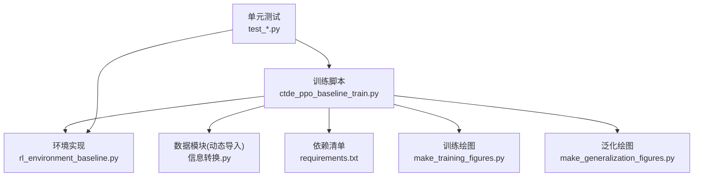
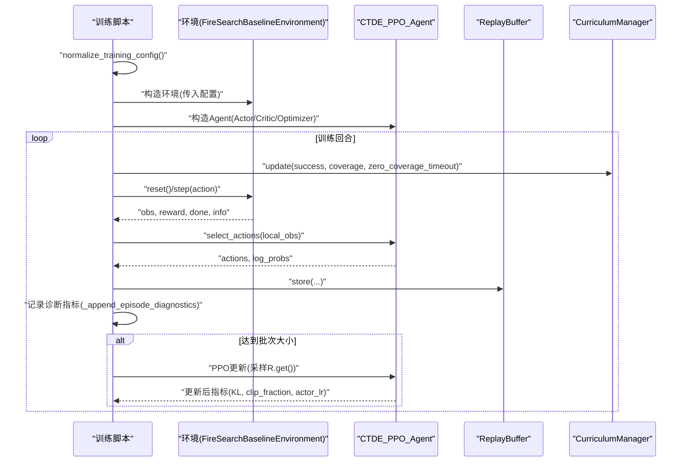
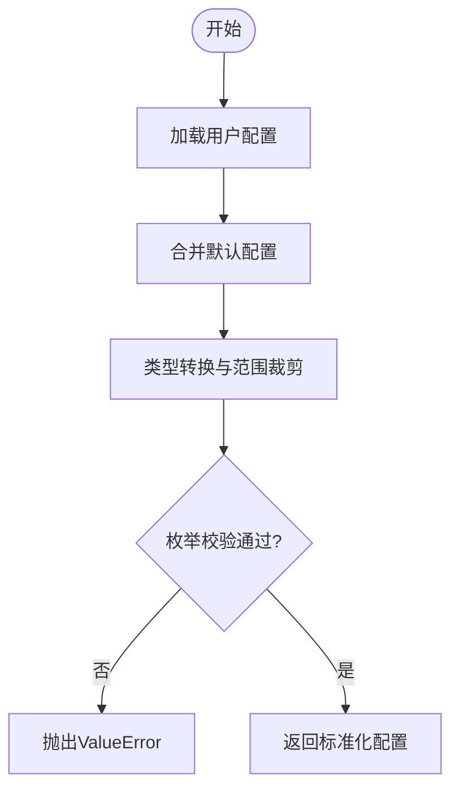
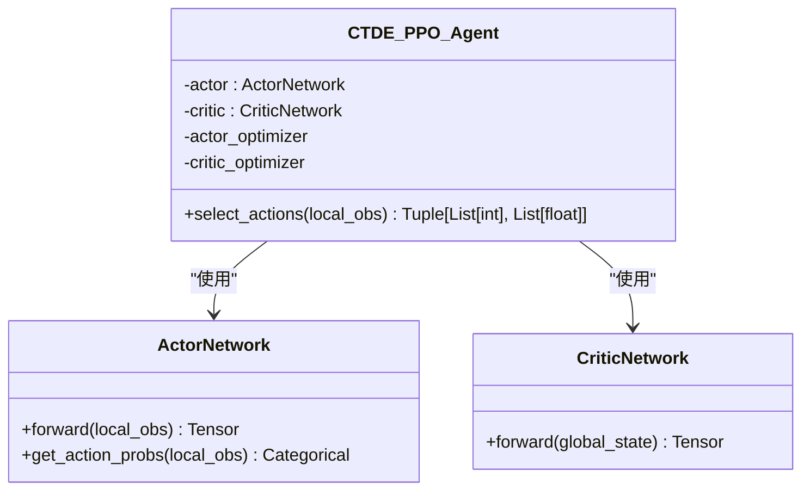
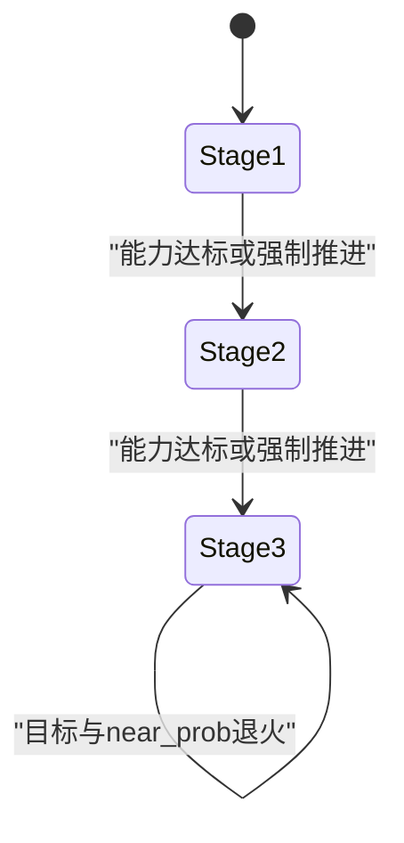
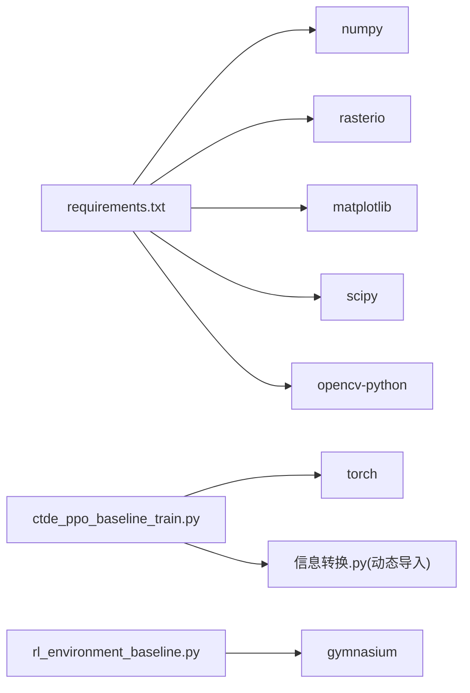

# 开发指南

<cite>
**本文引用的文件**   
- [ctde_ppo_baseline_train.py](file://environment_variables/environment_variables/ctde_ppo_baseline_train.py)
- [rl_environment_baseline.py](file://environment_variables/environment_variables/rl_environment_baseline.py)
- [requirements.txt](file://environment_variables/requirements.txt)
- [test_area_percent_curriculum.py](file://environment_variables/environment_variables/test_area_percent_curriculum.py)
- [test_distance_field_removed.py](file://environment_variables/environment_variables/test_distance_field_removed.py)
- [make_training_figures.py](file://environment_variables/environment_variables/outputs/make_training_figures.py)
- [make_generalization_figures.py](file://environment_variables/environment_variables/outputs/make_generalization_figures.py)
</cite>

## 目录
1. [简介](#简介)
2. [项目结构](#项目结构)
3. [核心组件](#核心组件)
4. [架构总览](#架构总览)
5. [详细组件分析](#详细组件分析)
6. [依赖分析](#依赖分析)
7. [性能考虑](#性能考虑)
8. [故障排查指南](#故障排查指南)
9. [结论](#结论)
10. [附录](#附录)

## 简介
本指南面向贡献者，提供代码规范、命名约定、测试与覆盖率要求、调试与性能分析方法、代码审查流程、新功能开发工作流、常见问题解决方案以及扩展现有功能与新增算法组件的实践建议。内容基于仓库中训练脚本、环境实现、测试与可视化脚本的实际结构与行为进行总结，确保可操作性与一致性。

## 项目结构
- 训练主入口与算法实现位于 environment_variables/environment_variables/ctde_ppo_baseline_train.py，包含配置归一化、日志分流、模型网络、回放缓冲、课程管理器、CTDE-PPO智能体等。
- 环境实现位于 environment_variables/environment_variables/rl_environment_baseline.py，定义多无人机火场边界搜索的Gymnasium环境、观测/奖励配置、状态推进与评估指标。
- 依赖清单位于 environment_variables/requirements.txt，列出核心与可选依赖。
- 单元测试位于 environment_variables/environment_variables/test_*.py，覆盖课程管理逻辑与源码约束检查。
- 结果可视化脚本位于 outputs/make_training_figures.py 与 outputs/make_generalization_figures.py，用于绘制训练曲线与泛化对比图。

图表来源
- [ctde_ppo_baseline_train.py:1-120](file://environment_variables/environment_variables/ctde_ppo_baseline_train.py#L1-L120)
- [rl_environment_baseline.py:1-120](file://environment_variables/environment_variables/rl_environment_baseline.py#L1-L120)
- [requirements.txt:1-13](file://environment_variables/requirements.txt#L1-L13)
- [make_training_figures.py:1069-1109](file://environment_variables/environment_variables/outputs/make_training_figures.py#L1069-L1109)
- [make_generalization_figures.py:106-153](file://environment_variables/environment_variables/outputs/make_generalization_figures.py#L106-L153)

章节来源
- [ctde_ppo_baseline_train.py:1-120](file://environment_variables/environment_variables/ctde_ppo_baseline_train.py#L1-L120)
- [rl_environment_baseline.py:1-120](file://environment_variables/environment_variables/rl_environment_baseline.py#L1-L120)
- [requirements.txt:1-13](file://environment_variables/requirements.txt#L1-L13)

## 核心组件
- 配置与参数校验：集中式默认配置字典与归一化函数，统一类型、范围与枚举值校验，保证训练可复现性与鲁棒性。
- 控制台日志分流：TeeStream将标准输出与错误同时写入文件，便于离线分析与回溯。
- 随机种子设置：统一Python、NumPy、PyTorch（含CUDA）随机源，并启用确定性后端开关。
- 模型质量指标：基于任务得分、KL散度、裁剪比例、学习率轨迹计算收敛效率与稳定性指标。
- Actor/Critic网络：多层全连接+残差连接+层归一化，正交初始化策略稳定训练。
- 回放缓冲：按步收集局部观测、全局状态、动作、对数概率、奖励与终止信号。
- 课程管理器：三阶段课程学习，控制初始面积百分比、目标覆盖率与近端生成概率的阶梯式退火。
- CTDE-PPO智能体：封装Actor/Critic优化器、KL自适应学习率、PPO更新循环与批量采样。
- Gymnasium环境：支持多种观测/奖励配置，分层热信号判定、边界发现与覆盖率统计、超时惩罚与探索引导。

章节来源
- [ctde_ppo_baseline_train.py:98-281](file://environment_variables/environment_variables/ctde_ppo_baseline_train.py#L98-L281)
- [ctde_ppo_baseline_train.py:47-96](file://environment_variables/environment_variables/ctde_ppo_baseline_train.py#L47-L96)
- [ctde_ppo_baseline_train.py:284-293](file://environment_variables/environment_variables/ctde_ppo_baseline_train.py#L284-L293)
- [ctde_ppo_baseline_train.py:358-433](file://environment_variables/environment_variables/ctde_ppo_baseline_train.py#L358-L433)
- [ctde_ppo_baseline_train.py:460-535](file://environment_variables/environment_variables/ctde_ppo_baseline_train.py#L460-L535)
- [ctde_ppo_baseline_train.py:537-567](file://environment_variables/environment_variables/ctde_ppo_baseline_train.py#L537-L567)
- [ctde_ppo_baseline_train.py:569-757](file://environment_variables/environment_variables/ctde_ppo_baseline_train.py#L569-L757)
- [ctde_ppo_baseline_train.py:759-800](file://environment_variables/environment_variables/ctde_ppo_baseline_train.py#L759-L800)
- [rl_environment_baseline.py:21-158](file://environment_variables/environment_variables/rl_environment_baseline.py#L21-L158)
- [rl_environment_baseline.py:660-670](file://environment_variables/environment_variables/rl_environment_baseline.py#L660-L670)
- [rl_environment_baseline.py:692-767](file://environment_variables/environment_variables/rl_environment_baseline.py#L692-L767)

## 架构总览
下图展示训练主流程与环境交互的关键调用链，包括配置归一化、环境实例化、回合步进、奖励计算与指标记录。

图表来源
- [ctde_ppo_baseline_train.py:161-281](file://environment_variables/environment_variables/ctde_ppo_baseline_train.py#L161-L281)
- [ctde_ppo_baseline_train.py:569-757](file://environment_variables/environment_variables/ctde_ppo_baseline_train.py#L569-L757)
- [ctde_ppo_baseline_train.py:759-800](file://environment_variables/environment_variables/ctde_ppo_baseline_train.py#L759-L800)
- [rl_environment_baseline.py:331-361](file://environment_variables/environment_variables/rl_environment_baseline.py#L331-L361)
- [rl_environment_baseline.py:660-670](file://environment_variables/environment_variables/rl_environment_baseline.py#L660-L670)

## 详细组件分析

### 配置与参数校验
- 默认配置字典集中管理所有超参与路径选项，避免分散硬编码。
- 归一化函数负责类型转换、范围裁剪、枚举校验与兼容键映射（如旧键名迁移）。
- 关键校验点包括observation_profile与reward_profile必须为环境支持的枚举；init_percentile/init_area_percent需在[0,100]；lr_adapt_mode仅允许'fixed'或'kl'等。

图表来源
- [ctde_ppo_baseline_train.py:161-281](file://environment_variables/environment_variables/ctde_ppo_baseline_train.py#L161-L281)
- [rl_environment_baseline.py:208-226](file://environment_variables/environment_variables/rl_environment_baseline.py#L208-L226)

章节来源
- [ctde_ppo_baseline_train.py:161-281](file://environment_variables/environment_variables/ctde_ppo_baseline_train.py#L161-L281)
- [rl_environment_baseline.py:208-226](file://environment_variables/environment_variables/rl_environment_baseline.py#L208-L226)

### 控制台日志分流
- TeeStream包装sys.stdout/sys.stderr，将输出同时写入文件，便于离线分析。
- setup_console_tee确保幂等，避免重复打开文件句柄。

章节来源
- [ctde_ppo_baseline_train.py:47-96](file://environment_variables/environment_variables/ctde_ppo_baseline_train.py#L47-L96)

### 随机种子与可复现性
- set_seed统一设置Python、NumPy、PyTorch及CUDA随机源，并在可用时启用cudnn确定性模式。

章节来源
- [ctde_ppo_baseline_train.py:284-293](file://environment_variables/environment_variables/ctde_ppo_baseline_train.py#L284-L293)

### 模型质量指标
- compute_model_quality_metrics汇总收敛效率（AUC、阈值到达步数）、奖励稳定性（尾部方差、性能下降）、KL稳定性（均值、方差、越界率、裁剪比例、学习率分布）。

章节来源
- [ctde_ppo_baseline_train.py:358-433](file://environment_variables/environment_variables/ctde_ppo_baseline_train.py#L358-L433)

### Actor/Critic网络
- ActorNetwork：多层线性+层归一化+ReLU+残差连接，动作头小增益初始化。
- CriticNetwork：类似结构，价值头单位增益初始化。
- 使用torch.distributions.Categorical采样离散动作。

图表来源
- [ctde_ppo_baseline_train.py:460-535](file://environment_variables/environment_variables/ctde_ppo_baseline_train.py#L460-L535)
- [ctde_ppo_baseline_train.py:759-800](file://environment_variables/environment_variables/ctde_ppo_baseline_train.py#L759-L800)

章节来源
- [ctde_ppo_baseline_train.py:460-535](file://environment_variables/environment_variables/ctde_ppo_baseline_train.py#L460-L535)
- [ctde_ppo_baseline_train.py:759-800](file://environment_variables/environment_variables/ctde_ppo_baseline_train.py#L759-L800)

### 回放缓冲
- ReplayBuffer以列表形式累积每步元组，提供clear与get接口供PPO采样。

章节来源
- [ctde_ppo_baseline_train.py:537-567](file://environment_variables/environment_variables/ctde_ppo_baseline_train.py#L537-L567)

### 课程管理器
- CurriculumManager维护阶段切换、初始面积百分比阶梯、阶段3目标覆盖率与近端生成概率退火。
- update方法根据成功率、覆盖率与零覆盖超时率判断是否提升阶段或调整难度。

图表来源
- [ctde_ppo_baseline_train.py:569-757](file://environment_variables/environment_variables/ctde_ppo_baseline_train.py#L569-L757)

章节来源
- [ctde_ppo_baseline_train.py:569-757](file://environment_variables/environment_variables/ctde_ppo_baseline_train.py#L569-L757)

### Gymnasium环境
- FireSearchBaselineEnvironment支持baseline/static_terrain/dynamic_front/risk_aware观测与boundary_coverage/front_detection/severity_weighted/exploration_balanced奖励。
- 分层热信号判定替代全局阈值检测，增强早期引导。
- 超时惩罚与零覆盖额外惩罚在阶段2/3更严格，促进收敛。

章节来源
- [rl_environment_baseline.py:21-158](file://environment_variables/environment_variables/rl_environment_baseline.py#L21-L158)
- [rl_environment_baseline.py:660-670](file://environment_variables/environment_variables/rl_environment_baseline.py#L660-L670)
- [rl_environment_baseline.py:692-767](file://environment_variables/environment_variables/rl_environment_baseline.py#L692-L767)

## 依赖分析
- 核心依赖：numpy、rasterio、matplotlib、scipy、opencv-python。
- 可选依赖（强化学习训练）：stable-baselines3、torch、tensorboard（注释掉，按需启用）。
- 训练脚本直接依赖torch、gymnasium（环境实现），并通过importlib动态导入“信息转换”模块访问数据集索引与场景管理。

图表来源
- [requirements.txt:1-13](file://environment_variables/requirements.txt#L1-L13)
- [ctde_ppo_baseline_train.py:1-30](file://environment_variables/environment_variables/ctde_ppo_baseline_train.py#L1-L30)
- [rl_environment_baseline.py:1-20](file://environment_variables/environment_variables/rl_environment_baseline.py#L1-L20)

章节来源
- [requirements.txt:1-13](file://environment_variables/requirements.txt#L1-L13)
- [ctde_ppo_baseline_train.py:1-30](file://environment_variables/environment_variables/ctde_ppo_baseline_train.py#L1-L30)
- [rl_environment_baseline.py:1-20](file://environment_variables/environment_variables/rl_environment_baseline.py#L1-L20)

## 性能考虑
- 批处理与最小批大小：Agent内部维护batch_size与min_batch_size，确保GPU利用率与内存占用平衡。
- KL自适应学习率：当KL偏离目标时指数缩放学习率，抑制策略崩溃。
- 梯度裁剪：max_grad_norm限制参数更新幅度，提高稳定性。
- 窗口平滑与尾部统计：滚动平均与尾部方差用于监控收敛与稳定性，辅助调参。
- 设备选择：自动选择CUDA或CPU，便于本地与服务器部署。

章节来源
- [ctde_ppo_baseline_train.py:759-800](file://environment_variables/environment_variables/ctde_ppo_baseline_train.py#L759-L800)
- [ctde_ppo_baseline_train.py:358-433](file://environment_variables/environment_variables/ctde_ppo_baseline_train.py#L358-L433)

## 故障排查指南
- 配置错误：若observation_profile或reward_profile不在环境支持集合，会抛出ValueError。请检查DEFAULT_TRAIN_CONFIG与用户覆盖项。
- 课程不推进：检查成功率、覆盖率与零覆盖超时率是否满足阶段门槛；必要时调整stage_thresholds或force_advance_min_coverage。
- 训练不稳定：观察KL均值与越界率、裁剪比例与学习率分布；适当降低target_kl或增大clip_epsilon。
- 可视化缺失：确认outputs目录下存在训练日志与评估结果，再运行make_training_figures.py与make_generalization_figures.py。

章节来源
- [ctde_ppo_baseline_train.py:161-281](file://environment_variables/environment_variables/ctde_ppo_baseline_train.py#L161-L281)
- [ctde_ppo_baseline_train.py:569-757](file://environment_variables/environment_variables/ctde_ppo_baseline_train.py#L569-L757)
- [ctde_ppo_baseline_train.py:358-433](file://environment_variables/environment_variables/ctde_ppo_baseline_train.py#L358-L433)
- [make_training_figures.py:1069-1109](file://environment_variables/environment_variables/outputs/make_training_figures.py#L1069-L1109)
- [make_generalization_figures.py:106-153](file://environment_variables/environment_variables/outputs/make_generalization_figures.py#L106-L153)

## 结论
本项目围绕CTDE-PPO基线在多无人机火场边界搜索任务上的训练与评估展开，具备完善的配置校验、日志分流、课程学习与质量指标体系。遵循本文的开发规范与工作流，可有效提升代码质量、可复现性与可扩展性。

## 附录

### 代码规范与命名约定
- Python风格：遵循PEP8，使用双引号字符串与空行分隔逻辑块；类名采用大驼峰，函数与变量采用小写下划线。
- 类型提示：公共接口与方法签名应包含类型注解，便于静态检查与IDE支持。
- 注释规范：复杂逻辑需添加行内注释说明意图与边界条件；对外暴露的API需补充docstring。
- 文档字符串格式：模块级docstring描述用途与依赖；类与方法docstring包含参数、返回值与异常说明。

### 单元测试与集成测试
- 单元测试：针对课程管理器与源码约束进行检查，确保关键行为与禁止项不被引入。
- 集成测试：端到端验证训练流程与评估输出，确保配置与环境交互正确。
- 设计原则：用例应小而聚焦，断言明确，覆盖正常路径与异常分支；使用固定种子保证可复现。
- 覆盖率要求：核心逻辑（配置归一化、课程管理、环境奖励计算）建议达到较高行覆盖率；可视化脚本可放宽。

章节来源
- [test_area_percent_curriculum.py:130-169](file://environment_variables/environment_variables/test_area_percent_curriculum.py#L130-L169)
- [test_distance_field_removed.py:1-23](file://environment_variables/environment_variables/test_distance_field_removed.py#L1-L23)

### 调试技巧与性能分析
- 控制台日志：利用setup_console_tee将stdout/stderr同步到文件，结合grep/awk快速定位问题。
- 指标监控：关注任务得分、KL散度、裁剪比例与学习率变化；使用compute_model_quality_metrics生成的指标进行回归分析。
- 性能剖析：在关键循环前后插入时间戳，或使用cProfile/profile工具定位热点；合理调整batch_size与ppo_epochs。

章节来源
- [ctde_ppo_baseline_train.py:47-96](file://environment_variables/environment_variables/ctde_ppo_baseline_train.py#L47-L96)
- [ctde_ppo_baseline_train.py:358-433](file://environment_variables/environment_variables/ctde_ppo_baseline_train.py#L358-L433)

### 代码审查流程与标准
- 提交前自检：运行单元测试与基础lint检查；确保新增/修改处有相应测试覆盖。
- 变更说明：PR描述需包含动机、影响范围、测试方法与预期结果。
- 审查要点：接口契约、错误处理、性能影响、可复现性（种子与配置）、文档更新。

### 新功能开发工作流
- 需求分析：明确目标、输入输出、约束与验收标准。
- 设计与评审：绘制流程图/类图，评估复杂度与风险，组织评审。
- 实现与测试：分模块实现，编写单测与集成测试，逐步合并。
- 验证与发布：完成回归测试与性能基准，更新文档与依赖清单，打标签发布。

### 常见开发问题与最佳实践
- 依赖冲突：优先使用requirements.txt锁定版本；虚拟环境隔离。
- 数据路径错误：统一使用相对路径与配置项，避免硬编码绝对路径。
- 随机性不可复现：确保set_seed在所有相关库上生效，并关闭cudnn benchmark。
- 奖励稀疏：利用分层热信号与探索引导奖励，加速早期学习。

### 扩展现有功能与新增算法组件
- 扩展观测/奖励配置：在环境的OBSERVATION_PROFILE_DIMS与REWARD_PROFILES中添加新选项，并实现对应特征提取与奖励计算。
- 新增算法组件：在训练脚本中定义新的网络或策略类，保持与CTDE_PPO_Agent的接口一致；在配置中暴露可调参数。
- 课程策略升级：在CurriculumManager中增加新的难度调节维度（如near_prob退火阶梯），并确保update逻辑与阶段切换一致。

章节来源
- [rl_environment_baseline.py:21-158](file://environment_variables/environment_variables/rl_environment_baseline.py#L21-L158)
- [ctde_ppo_baseline_train.py:569-757](file://environment_variables/environment_variables/ctde_ppo_baseline_train.py#L569-L757)
- [ctde_ppo_baseline_train.py:759-800](file://environment_variables/environment_variables/ctde_ppo_baseline_train.py#L759-L800)