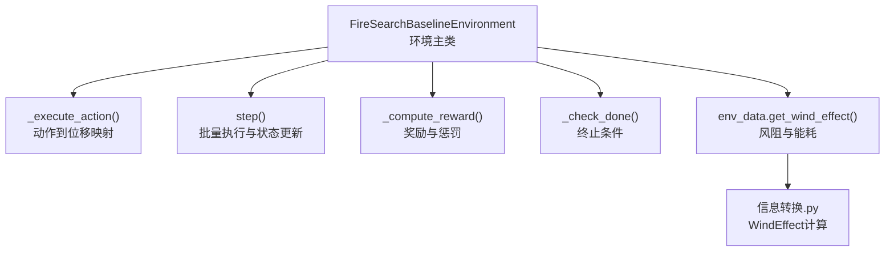
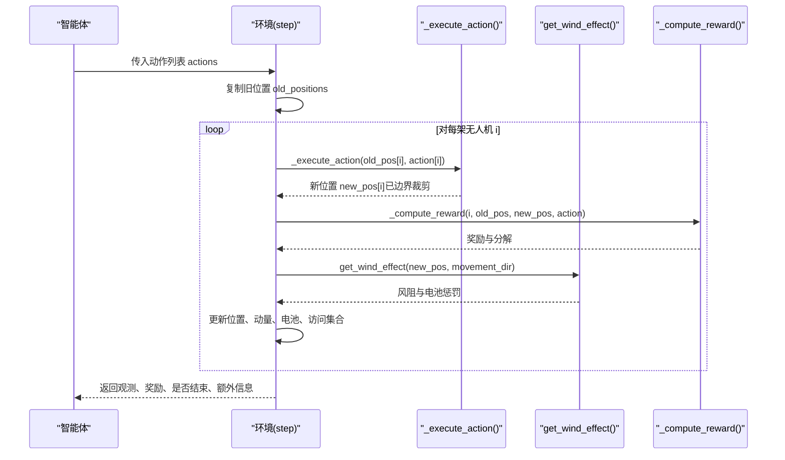
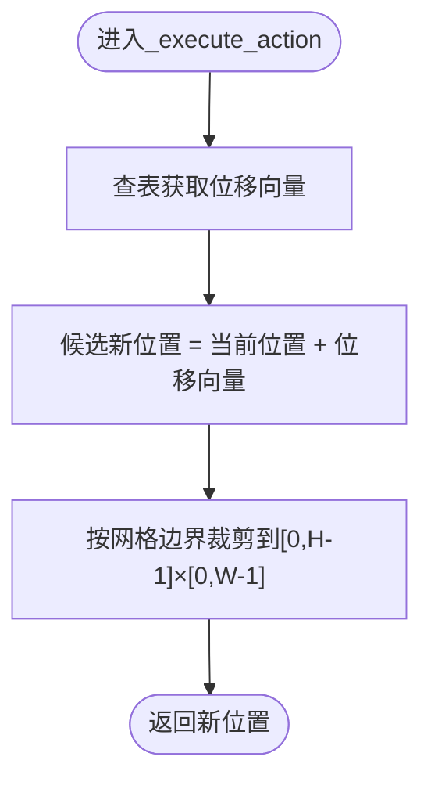
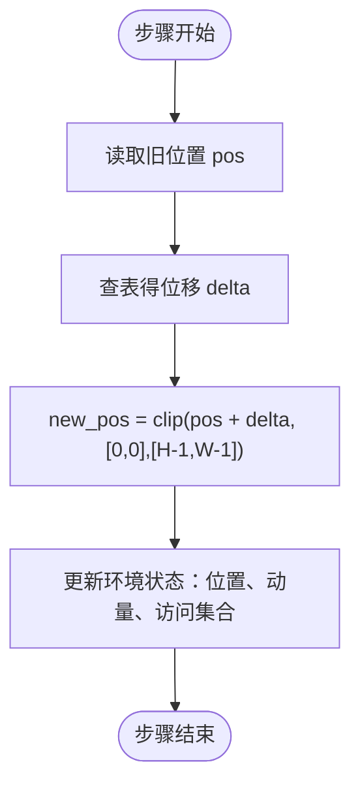
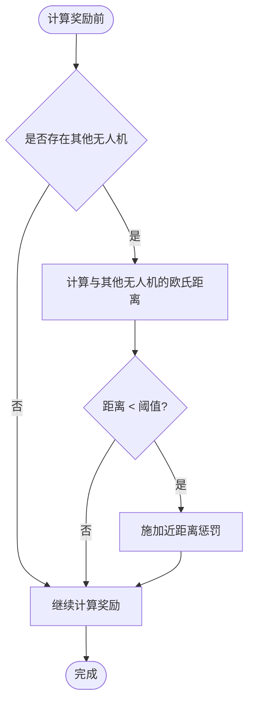
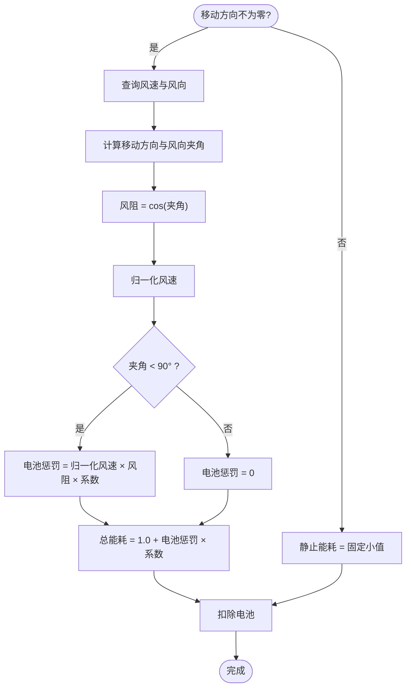
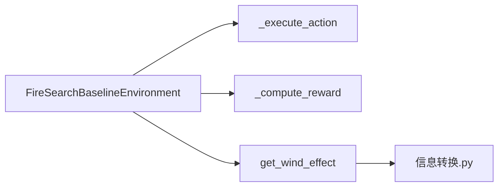

# 动作空间定义

<cite>
**本文引用的文件**   
- [rl_environment_baseline.py](file://environment_variables/environment_variables/rl_environment_baseline.py)
- [信息转换.py](file://environment_variables/environment_variables/信息转换.py)
</cite>

## 目录
1. [简介](#简介)
2. [项目结构](#项目结构)
3. [核心组件](#核心组件)
4. [架构总览](#架构总览)
5. [详细组件分析](#详细组件分析)
6. [依赖关系分析](#依赖关系分析)
7. [性能考量](#性能考量)
8. [故障排查指南](#故障排查指南)
9. [结论](#结论)
10. [附录](#附录)

## 简介
本文件面向多无人机火场边界搜索任务的动作空间系统，聚焦于离散动作的定义、执行机制与物理规则。系统提供五个离散动作：上移、下移、左移、右移、静止。每个动作在网格坐标系中对应一个单位位移或零位移，随后进行边界约束与碰撞惩罚等处理，并依据风向与速度计算能耗。文档同时给出动作映射表设计原理、坐标变换过程、运动学约束（最大移动速度、转向限制、能量消耗）、策略建议与扩展方案（连续动作空间与更复杂运动）。

## 项目结构
本项目围绕一个基于 Gymnasium 的基线环境展开，核心逻辑位于环境类中，数据与环境属性由“信息转换”模块提供。关键路径如下：
- 环境与动作执行：rl_environment_baseline.py
- 场景数据、风场与能耗模型：信息转换.py

图表来源
- [rl_environment_baseline.py:660-669](file://environment_variables/environment_variables/rl_environment_baseline.py#L660-L669)
- [rl_environment_baseline.py:842-870](file://environment_variables/environment_variables/rl_environment_baseline.py#L842-L870)
- [信息转换.py:1125-1165](file://environment_variables/environment_variables/信息转换.py#L1125-L1165)

章节来源
- [rl_environment_baseline.py:1-120](file://environment_variables/environment_variables/rl_environment_baseline.py#L1-L120)
- [信息转换.py:1-200](file://environment_variables/environment_variables/信息转换.py#L1-L200)

## 核心组件
- 离散动作空间：大小为5，使用 Discrete(5)。
- 动作映射表：将整数动作映射为二维位移向量，并在网格内裁剪。
- 位置更新与边界约束：新位置按位移相加后，被裁剪到[0, H-1]×[0, W-1]范围。
- 碰撞检测与惩罚：通过与其他无人机的距离阈值施加惩罚；未实现硬碰撞阻止。
- 能耗模型：移动时根据风向与相对角度计算电池消耗；静止有固定小消耗。
- 动量记录：每步记录上一时刻到当前时刻的位移作为动量，用于观测与后续控制。

章节来源
- [rl_environment_baseline.py:89-91](file://environment_variables/environment_variables/rl_environment_baseline.py#L89-L91)
- [rl_environment_baseline.py:660-669](file://environment_variables/environment_variables/rl_environment_baseline.py#L660-L669)
- [rl_environment_baseline.py:860-870](file://environment_variables/environment_variables/rl_environment_baseline.py#L860-L870)
- [信息转换.py:1125-1165](file://environment_variables/environment_variables/信息转换.py#L1125-L1165)

## 架构总览
下图展示了从动作输入到状态更新的完整流程，包括动作映射、边界约束、能耗计算与奖励反馈。

图表来源
- [rl_environment_baseline.py:842-870](file://environment_variables/environment_variables/rl_environment_baseline.py#L842-L870)
- [rl_environment_baseline.py:660-669](file://environment_variables/environment_variables/rl_environment_baseline.py#L660-L669)
- [信息转换.py:1125-1165](file://environment_variables/environment_variables/信息转换.py#L1125-L1165)

## 详细组件分析

### 离散动作定义与映射表
- 动作集大小：5
- 动作编号与语义：
  - 0：向右移动（x+1）
  - 1：向左移动（x-1）
  - 2：向上移动（y-1）
  - 3：向下移动（y+1）
  - 4：静止不动（无位移）
- 映射表实现：以字典形式将动作编号映射为二维位移向量，随后与新位置相加得到候选新位置。

图表来源
- [rl_environment_baseline.py:660-669](file://environment_variables/environment_variables/rl_environment_baseline.py#L660-L669)

章节来源
- [rl_environment_baseline.py:89-91](file://environment_variables/environment_variables/rl_environment_baseline.py#L89-L91)
- [rl_environment_baseline.py:660-669](file://environment_variables/environment_variables/rl_environment_baseline.py#L660-L669)

### 位置更新与边界约束
- 位置更新：新位置 = 旧位置 + 动作位移向量。
- 边界约束：使用裁剪函数确保坐标落在网格范围内，防止越界。
- 坐标系统：采用行优先(y,x)索引，y为行号，x为列号。

图表来源
- [rl_environment_baseline.py:660-669](file://environment_variables/environment_variables/rl_environment_baseline.py#L660-L669)
- [rl_environment_baseline.py:860-870](file://environment_variables/environment_variables/rl_environment_baseline.py#L860-L870)

章节来源
- [rl_environment_baseline.py:660-669](file://environment_variables/environment_variables/rl_environment_baseline.py#L660-L669)
- [rl_environment_baseline.py:860-870](file://environment_variables/environment_variables/rl_environment_baseline.py#L860-L870)

### 碰撞检测与惩罚
- 碰撞检测：不阻止移动，而是当某无人机与其他无人机距离小于阈值（与视野半径相关）时施加惩罚。
- 惩罚强度：每次检测到过近时给予负奖励，避免集群聚集。
- 注意：该机制为软约束，不会改变目标位置。

图表来源
- [rl_environment_baseline.py:746-754](file://environment_variables/environment_variables/rl_environment_baseline.py#L746-L754)

章节来源
- [rl_environment_baseline.py:746-754](file://environment_variables/environment_variables/rl_environment_baseline.py#L746-L754)

### 能耗与风场影响
- 能耗模型：
  - 若发生移动（位移非零），基础能耗为1.0，并根据风场增加额外惩罚项。
  - 若静止，固定消耗较小值。
- 风场计算：
  - 读取当前格点的风速与风向。
  - 计算移动方向与风向的角度差，得到风阻系数。
  - 当角度差小于90度（顺风或侧顺风）时，产生电池惩罚；否则为零。
- 电池耗尽终止：任一无人机电池降至0则回合结束。

图表来源
- [rl_environment_baseline.py:860-870](file://environment_variables/environment_variables/rl_environment_baseline.py#L860-L870)
- [信息转换.py:1125-1165](file://environment_variables/environment_variables/信息转换.py#L1125-L1165)

章节来源
- [rl_environment_baseline.py:860-870](file://environment_variables/environment_variables/rl_environment_baseline.py#L860-L870)
- [信息转换.py:1125-1165](file://environment_variables/environment_variables/信息转换.py#L1125-L1165)

### 动量与观测
- 动量记录：每步记录新旧位置的差值作为动量，用于观测特征。
- 观测维度：包含位置、电池、热信号、地形、风场、动量、相机方向等。
- 全局状态：汇总团队平均电池、中心位置、扩散程度、距火源平均距离等。

章节来源
- [rl_environment_baseline.py:860-870](file://environment_variables/environment_variables/rl_environment_baseline.py#L860-L870)
- [rl_environment_baseline.py:565-658](file://environment_variables/environment_variables/rl_environment_baseline.py#L565-L658)

### 终止条件
- 课程阶段目标达成：发现一定数量边界点或覆盖率达标。
- 步数上限：超过最大步数终止。
- 电池耗尽：任一无人机电池≤0终止。

章节来源
- [rl_environment_baseline.py:824-840](file://environment_variables/environment_variables/rl_environment_baseline.py#L824-L840)

## 依赖关系分析
- 环境类依赖“信息转换”模块提供的风场与能耗计算。
- 动作执行仅依赖环境内部的状态与网格尺寸。
- 奖励计算依赖边界集合、已发现区域掩码、热势图等。

图表来源
- [rl_environment_baseline.py:660-669](file://environment_variables/environment_variables/rl_environment_baseline.py#L660-L669)
- [rl_environment_baseline.py:842-870](file://environment_variables/environment_variables/rl_environment_baseline.py#L842-L870)
- [信息转换.py:1125-1165](file://environment_variables/environment_variables/信息转换.py#L1125-L1165)

章节来源
- [rl_environment_baseline.py:660-669](file://environment_variables/environment_variables/rl_environment_baseline.py#L660-L669)
- [信息转换.py:1125-1165](file://environment_variables/environment_variables/信息转换.py#L1125-L1165)

## 性能考量
- 动作映射与边界裁剪为常数时间操作，复杂度O(1)。
- 碰撞惩罚需遍历其他无人机，复杂度O(N)，N为无人机数量。
- 风场能耗计算涉及三角函数与数组访问，整体开销较低。
- 建议：
  - 批量向量化更新位置与动量以减少Python循环开销。
  - 缓存最近邻距离或使用空间索引加速碰撞检测。
  - 预计算风场归一化参数以降低重复除法。

[本节为通用指导，无需具体文件引用]

## 故障排查指南
- 动作越界：检查网格尺寸与裁剪逻辑是否正确；确认坐标索引顺序(y,x)。
- 能耗异常：核对风场数据有效性（风速、风向）与角度差计算；确认静止与移动分支。
- 碰撞惩罚频繁：调整距离阈值或与视野半径的比例；检查初始分布与最小间距。
- 过早终止：检查电池初始容量与每步能耗设置；确认终止条件阈值。

章节来源
- [rl_environment_baseline.py:824-840](file://environment_variables/environment_variables/rl_environment_baseline.py#L824-L840)
- [信息转换.py:1125-1165](file://environment_variables/environment_variables/信息转换.py#L1125-L1165)

## 结论
本系统实现了简洁而有效的五动作离散空间，结合边界约束、软碰撞惩罚与风场能耗模型，支持多无人机在动态火场中的探索与边界覆盖。通过合理的奖励设计与终止条件，训练可收敛至高效策略。未来可扩展为连续动作空间与更复杂的动力学模型，以提升真实场景适配性。

[本节为总结，无需具体文件引用]

## 附录

### 动作选择策略指导
- 初期探索：鼓励随机与热点梯度上升，利用热势增量奖励引导靠近火场。
- 中期覆盖：偏向沿边界移动，减少重复访问与过度聚集。
- 后期优化：考虑风向与能耗，选择顺风或低能耗路径，避免长时间静止。

[本节为概念性内容，无需具体文件引用]

### 动作空间扩展机制
- 连续动作空间：
  - 将Discrete(5)替换为Box([-1,1],[-1,1])，输出二维位移向量。
  - 引入加速度与速度上限，模拟惯性；新增角速度与转向速率限制。
  - 能耗模型扩展为与速度平方成正比，并叠加风阻项。
- 更复杂运动：
  - 支持对角移动与变步长移动，但需重新标定奖励与能耗。
  - 加入避障与路径规划层，结合局部地图与障碍物信息。
  - 引入多旋翼动力学约束（升力、扭矩、姿态角），提升仿真真实性。

[本节为概念性内容，无需具体文件引用]