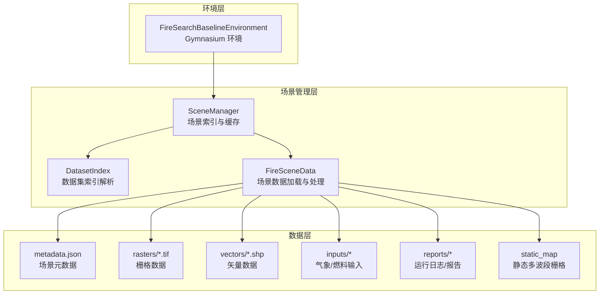
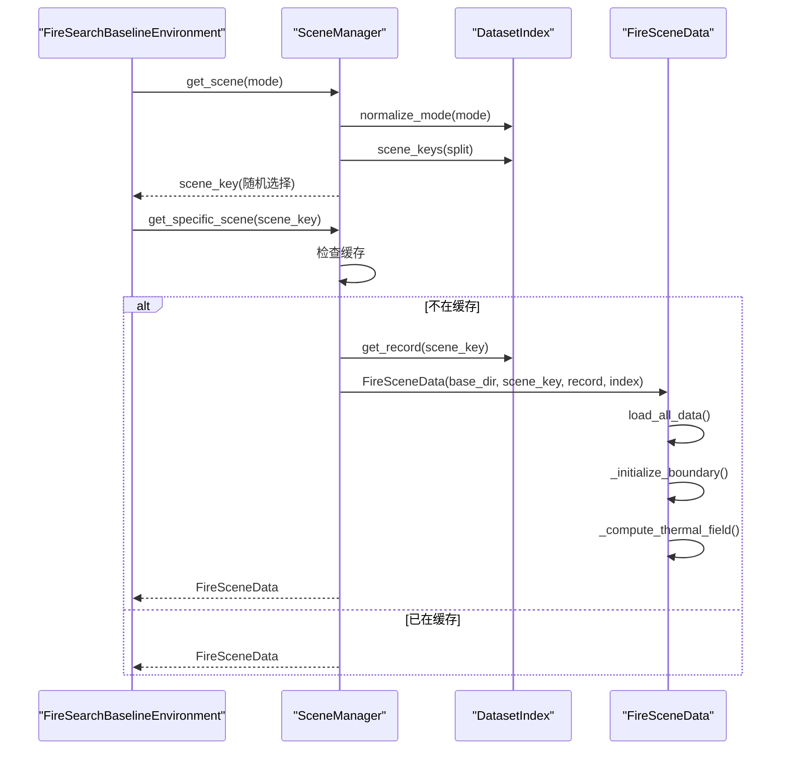
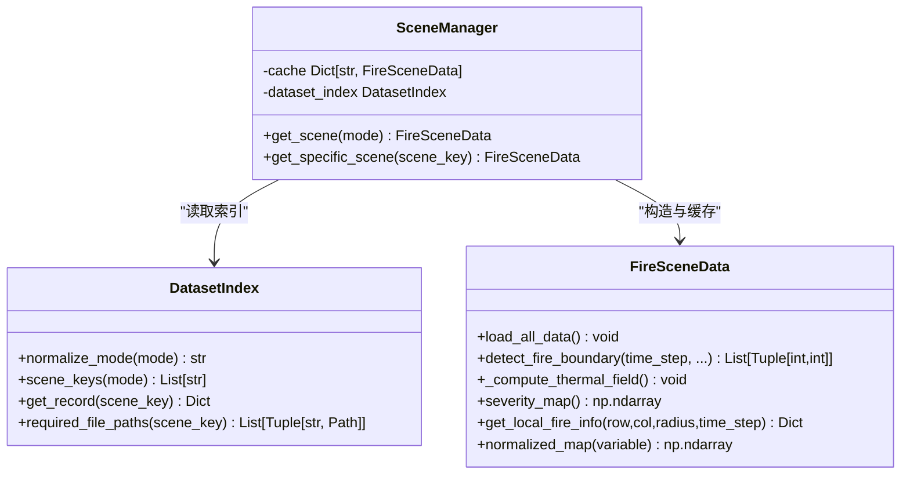
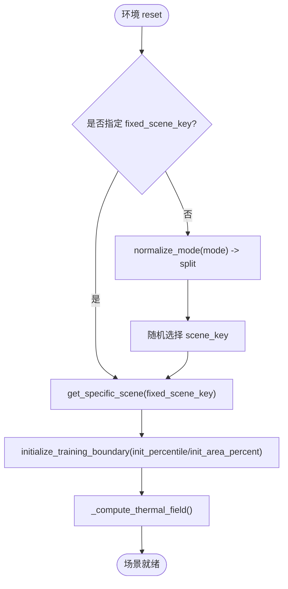
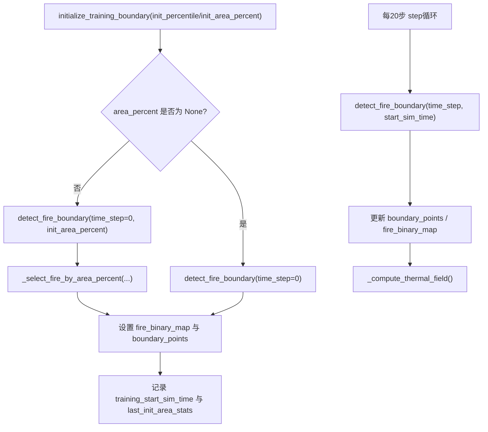
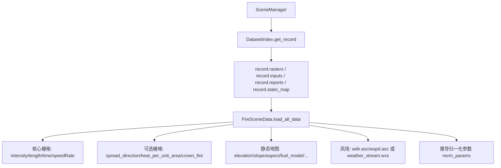
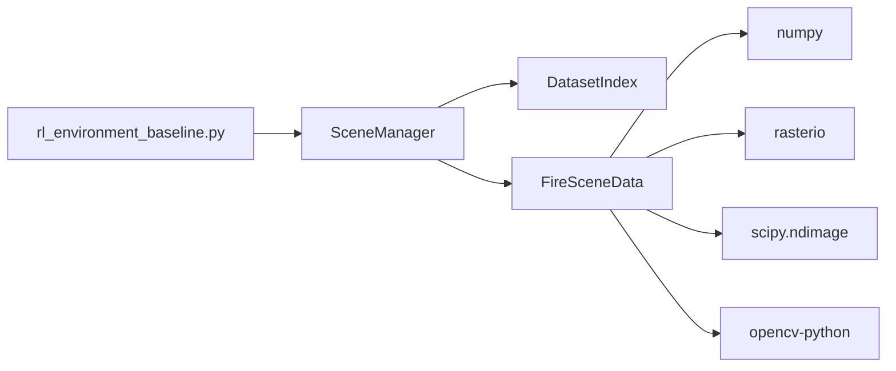

# 场景管理系统

<cite>
**本文引用的文件**   
- [信息转换.py](file://environment_variables/environment_variables/信息转换.py)
- [rl_environment_baseline.py](file://environment_variables/environment_variables/rl_environment_baseline.py)
- [requirements.txt](file://environment_variables/requirements.txt)
</cite>

## 目录
1. [简介](#简介)
2. [项目结构](#项目结构)
3. [核心组件](#核心组件)
4. [架构总览](#架构总览)
5. [详细组件分析](#详细组件分析)
6. [依赖关系分析](#依赖关系分析)
7. [性能考量](#性能考量)
8. [故障排查指南](#故障排查指南)
9. [结论](#结论)
10. [附录：新场景添加流程与格式规范](#附录新场景添加流程与格式规范)

## 简介
本文件面向“火灾搜索环境”的场景管理系统，重点围绕 SceneManager 类的设计架构、数据流处理机制、场景加载流程（固定场景选择与随机场景切换）、训练边界点的初始化与动态更新、多源数据（地形、气象、燃料模型等）集成、场景元数据管理（地图尺寸、传感器半径、最大步数等），以及场景数据的验证与调试工具使用方法进行系统化说明。同时提供新场景的添加流程与格式规范，帮助读者快速扩展数据集并稳定接入训练与评估流程。

## 项目结构
仓库中与场景管理相关的核心代码位于 environment_variables/environment_variables 目录下：
- 信息转换.py：包含 DatasetIndex、FireSceneData、SceneManager 及场景验证工具 validate_scene_boundaries 等实现。
- rl_environment_baseline.py：基于 Gymnasium 的基线环境 FireSearchBaselineEnvironment，负责与环境交互、观测构建、奖励计算、课程阶段控制，并通过 SceneManager 获取场景数据。
- requirements.txt：列出运行所需的核心依赖库。

图表来源
- [信息转换.py:1282-1326](file://environment_variables/environment_variables/信息转换.py#L1282-L1326)
- [rl_environment_baseline.py:159-194](file://environment_variables/environment_variables/rl_environment_baseline.py#L159-L194)

章节来源
- [信息转换.py:1-1426](file://environment_variables/environment_variables/信息转换.py#L1-L1426)
- [rl_environment_baseline.py:1-1027](file://environment_variables/environment_variables/rl_environment_baseline.py#L1-L1027)
- [requirements.txt:1-13](file://environment_variables/requirements.txt#L1-L13)

## 核心组件
- DatasetIndex：从 dataset_index.json 解析场景索引，支持模式别名（train/validation/generalization/stress/test/eval），提供 scene_keys、get_record、required_file_paths 等方法，统一场景路径解析与校验。
- FireSceneData：加载单个 FARSITE 场景，整合静态地图、核心栅格（intensity/length/time/speedRate）、可选栅格（spread_direction/heat_per_unit_area/crown_fire）、风场、归一化参数、边界点检测、热势场与导航场计算、局部邻域与火情信息等。
- SceneManager：跨实例共享场景缓存，按 split 随机或固定选择场景，避免重复读盘与重复计算。
- FireSearchBaselineEnvironment：封装 Gymnasium 接口，驱动场景数据更新、观测构建、奖励计算、课程阶段与终止条件。

章节来源
- [信息转换.py:20-196](file://environment_variables/environment_variables/信息转换.py#L20-L196)
- [信息转换.py:219-1276](file://environment_variables/environment_variables/信息转换.py#L219-L1276)
- [信息转换.py:1282-1326](file://environment_variables/environment_variables/信息转换.py#L1282-L1326)
- [rl_environment_baseline.py:21-194](file://environment_variables/environment_variables/rl_environment_baseline.py#L21-L194)

## 架构总览
场景管理的整体数据流如下：
- 环境初始化时通过 SceneManager 获取场景；若未指定固定场景，则根据 mode 在对应 split 中随机选择一个 scene_key。
- SceneManager 使用 DatasetIndex 解析场景记录，构造 FireSceneData 对象，并将结果放入全局缓存。
- FireSceneData 在构造时加载 metadata、静态地图、核心与可选栅格、风场，推导归一化参数，初始化 t=0 边界点，计算热势场与导航场。
- 环境每若干步调用 detect_fire_boundary 更新当前边界点集合与热力场，用于观测与奖励计算。

图表来源
- [rl_environment_baseline.py:159-194](file://environment_variables/environment_variables/rl_environment_baseline.py#L159-L194)
- [信息转换.py:1282-1326](file://environment_variables/environment_variables/信息转换.py#L1282-L1326)
- [信息转换.py:639-683](file://environment_variables/environment_variables/信息转换.py#L639-L683)
- [信息转换.py:684-721](file://environment_variables/environment_variables/信息转换.py#L684-L721)
- [信息转换.py:759-819](file://environment_variables/environment_variables/信息转换.py#L759-L819)

## 详细组件分析

### SceneManager 设计与数据流
- 职责：按 split 随机选择场景或固定场景；维护跨实例共享的 FireSceneData 缓存，减少重复 I/O 与计算。
- 关键方法：
  - get_scene(mode)：将 mode 标准化为 split，随机选择 scene_key，再调用 get_specific_scene。
  - get_specific_scene(scene_key)：若缓存命中直接返回；否则通过 DatasetIndex.get_record 构造 FireSceneData 并缓存。
- 设计要点：
  - 共享缓存类变量 _shared_scene_cache，确保 evaluate() 多次创建环境时复用同一场景对象。
  - 支持外部覆盖 scene_keys_by_split，便于测试与对比实验。

图表来源
- [信息转换.py:20-196](file://environment_variables/environment_variables/信息转换.py#L20-L196)
- [信息转换.py:219-1276](file://environment_variables/environment_variables/信息转换.py#L219-L1276)
- [信息转换.py:1282-1326](file://environment_variables/environment_variables/信息转换.py#L1282-L1326)

章节来源
- [信息转换.py:1282-1326](file://environment_variables/environment_variables/信息转换.py#L1282-L1326)

### 场景加载流程与随机/固定选择逻辑
- 固定场景：当环境构造传入 fixed_scene_key 时，直接通过 get_specific_scene 加载该场景。
- 随机场景：未指定 fixed_scene_key 时，根据 mode 映射到 split，并从该 split 的 scene_keys 中随机选取一个 scene_key。
- 加载后执行：
  - initialize_training_boundary：根据 init_percentile 或 init_area_percent 选择初始边界点集合，设置 training_start_sim_time。
  - _compute_thermal_field：基于 intensity 与 fire_binary_map 生成 per-scene 鲁棒归一化的热势场与导航场。

图表来源
- [rl_environment_baseline.py:159-194](file://environment_variables/environment_variables/rl_environment_baseline.py#L159-L194)
- [信息转换.py:698-721](file://environment_variables/environment_variables/信息转换.py#L698-L721)
- [信息转换.py:759-819](file://environment_variables/environment_variables/信息转换.py#L759-L819)

章节来源
- [rl_environment_baseline.py:159-194](file://environment_variables/environment_variables/rl_environment_baseline.py#L159-L194)
- [信息转换.py:698-721](file://environment_variables/environment_variables/信息转换.py#L698-L721)
- [信息转换.py:759-819](file://environment_variables/environment_variables/信息转换.py#L759-L819)

### 训练边界点的初始化与动态更新机制
- 初始化：
  - initialize_training_boundary 支持两种策略：
    - 基于时间步百分比：init_percentile（默认 5%），等价于 init_area_percent。
    - 基于面积百分比：init_area_percent，内部通过 _select_fire_by_area_percent 选择截止时间的火区掩码，得到初始边界点集合，并记录 last_init_area_stats。
  - 若结果为空，标记 is_valid_scene=False 并抛出 InvalidSceneError，阻止训练继续。
- 动态更新：
  - 环境每 20 步调用 detect_fire_boundary(time_step=self.step_count, start_sim_time=training_start_sim_time)，根据 time_map 推进模拟时间，更新 fire_binary_map 与 boundary_points。
  - 同步更新 thermal_field 与 confirmed_boundary_mask，保证观测与奖励计算的一致性。

图表来源
- [信息转换.py:698-721](file://environment_variables/environment_variables/信息转换.py#L698-L721)
- [信息转换.py:723-757](file://environment_variables/environment_variables/信息转换.py#L723-L757)
- [信息转换.py:821-887](file://environment_variables/environment_variables/信息转换.py#L821-L887)
- [rl_environment_baseline.py:927-941](file://environment_variables/environment_variables/rl_environment_baseline.py#L927-L941)

章节来源
- [信息转换.py:698-721](file://environment_variables/environment_variables/信息转换.py#L698-L721)
- [信息转换.py:723-757](file://environment_variables/environment_variables/信息转换.py#L723-L757)
- [信息转换.py:821-887](file://environment_variables/environment_variables/信息转换.py#L821-L887)
- [rl_environment_baseline.py:927-941](file://environment_variables/environment_variables/rl_environment_baseline.py#L927-L941)

### 多源数据集成与处理方法
- 静态地图：要求多波段栅格，包含 elevation/slope/aspect/fuel_model/canopy_cover/canopy_height/canopy_base_height/canopy_bulk_density 等波段，作为 DEM、坡度、坡向、燃料模型等基础地形与植被特征。
- 核心栅格：intensity/length/time/speedRate 必须存在，分别表示火焰强度、长度、到达时间与蔓延速度。
- 可选栅格：spread_direction/heat_per_unit_area/crown_fire 可选，用于更丰富的风险与严重度建模。
- 风场：优先读取 wind/wdir.asc 与 wind/wspd.asc；若缺失，则从 inputs/weather_stream.wxs 解析平均风速与风向，或回退至 metadata.wind 字段。
- 输入与报告：inputs/fuel_moisture_dry.fms、inputs/weather_stream.wxs、reports/fire_growth_report.csv、reports/Run_log.txt 等用于完整场景复现与诊断。
- 归一化参数：基于各栅格的百分位统计与元数据中的风场范围推导，包括 intensity_max/length_max/speedRate_max/spread_direction_max/heat_per_unit_area_max/crown_fire_max/dem_min/dem_max/slope_max/wind_speed_max/fire_threshold 等。

图表来源
- [信息转换.py:370-390](file://environment_variables/environment_variables/信息转换.py#L370-L390)
- [信息转换.py:473-491](file://environment_variables/environment_variables/信息转换.py#L473-L491)
- [信息转换.py:559-602](file://environment_variables/environment_variables/信息转换.py#L559-L602)
- [信息转换.py:639-683](file://environment_variables/environment_variables/信息转换.py#L639-L683)

章节来源
- [信息转换.py:370-390](file://environment_variables/environment_variables/信息转换.py#L370-L390)
- [信息转换.py:473-491](file://environment_variables/environment_variables/信息转换.py#L473-L491)
- [信息转换.py:559-602](file://environment_variables/environment_variables/信息转换.py#L559-L602)
- [信息转换.py:639-683](file://environment_variables/environment_variables/信息转换.py#L639-L683)

### 场景元数据管理与关键参数配置
- 元数据来源：每个场景目录下的 metadata.json，包含 resolution_m、uav.sensor_radius_m、uav.max_steps、wind.* 等字段。
- 关键参数：
  - 地图尺寸：由 static_map 的 shape 决定，所有栅格需与其一致。
  - 传感器半径：sensor_radius_m 转换为 sensor_radius_cells = ceil(sensor_radius_m / resolution_m)。
  - 最大步数：max_steps 来自 uav.max_steps，可被环境覆盖或启用 use_metadata_uav_params 自动应用。
- 路径解析：DatasetIndex 支持相对路径与 source_root 绝对路径混合，确保 static_map 与 scene 内资源定位正确。

章节来源
- [信息转换.py:274-284](file://environment_variables/environment_variables/信息转换.py#L274-L284)
- [信息转换.py:123-134](file://environment_variables/environment_variables/信息转换.py#L123-L134)
- [信息转换.py:370-390](file://environment_variables/environment_variables/信息转换.py#L370-L390)

### 场景数据验证与调试工具使用方法
- 预检工具：validate_scene_boundaries(base_dir, scene_keys=None, splits=None, init_percentile=5.0, init_area_percent=None, verbose=True)
  - 功能：遍历指定场景集合，检查必需文件是否存在，构造 FireSceneData，统计 t=0 边界点数与 init_area_percent 对应的边界点数，输出实际面积比例与截止模拟时间。
  - 异常：若发现任意场景无效（如 t=0 边界为空），抛出 InvalidSceneError 并汇总错误消息。
- 热场健康诊断：FireSceneData.diagnose_thermal_health()
  - 功能：统计饱和像素比例、高值区域零梯度比例、分位数等指标，辅助确认热势场语义层正常。
- 使用建议：
  - 在训练前调用 validate_scene_boundaries 进行全量预检。
  - 针对特定场景单独构造 FireSceneData 并调用 diagnose_thermal_health 进行细粒度诊断。

章节来源
- [信息转换.py:1329-1416](file://environment_variables/environment_variables/信息转换.py#L1329-L1416)
- [信息转换.py:972-1012](file://environment_variables/environment_variables/信息转换.py#L972-L1012)

## 依赖关系分析
- 模块耦合：
  - FireSearchBaselineEnvironment 依赖 SceneManager 获取场景数据。
  - SceneManager 依赖 DatasetIndex 解析索引与路径，构造 FireSceneData。
  - FireSceneData 依赖 rasterio、scipy.ndimage、cv2、numpy 等库进行栅格读写、形态学操作与图像处理。
- 外部依赖：
  - numpy/rasterio/scipy/opencv-python/matplotlib 为核心依赖，满足栅格与数值计算需求。
  - gymnasium 用于环境接口封装。

图表来源
- [rl_environment_baseline.py:17-19](file://environment_variables/environment_variables/rl_environment_baseline.py#L17-L19)
- [信息转换.py:1-14](file://environment_variables/environment_variables/信息转换.py#L1-L14)
- [requirements.txt:1-13](file://environment_variables/requirements.txt#L1-L13)

章节来源
- [rl_environment_baseline.py:17-19](file://environment_variables/environment_variables/rl_environment_baseline.py#L17-L19)
- [信息转换.py:1-14](file://environment_variables/environment_variables/信息转换.py#L1-L14)
- [requirements.txt:1-13](file://environment_variables/requirements.txt#L1-L13)

## 性能考量
- 场景缓存：SceneManager 使用类级共享缓存，避免 evaluate() 频繁重建场景导致的重复 I/O 与归一化参数计算。
- 热势场计算优化：采用先下采样再高斯模糊、再上采样的方案，降低计算开销并保持语义一致性。
- 边界更新频率：每 20 步更新一次边界与热场，平衡实时性与计算成本。
- 内存占用：大量栅格数据以 float32 存储，注意显存/内存峰值；可通过减少可选栅格或调整分辨率缓解。

[本节为通用指导，不直接分析具体文件]

## 故障排查指南
- 常见错误：
  - 缺少必需栅格或静态地图：load_all_data 会抛出 FileNotFoundError 或 RuntimeError。
  - 栅格形状不一致：_assert_raster_shape 会报错提示 static_map 与目标栅格形状不匹配。
  - t=0 边界为空：initialize_training_boundary 抛出 InvalidSceneError，需检查 intensity/time 阈值与时间分布。
- 诊断步骤：
  - 使用 validate_scene_boundaries 进行批量预检，定位缺失文件或无效场景。
  - 对单个场景构造 FireSceneData 并调用 diagnose_thermal_health，检查热势场质量。
  - 检查 metadata.json 的 resolution_m 与 uav 参数是否与场景规模匹配。

章节来源
- [信息转换.py:639-683](file://environment_variables/environment_variables/信息转换.py#L639-L683)
- [信息转换.py:684-721](file://environment_variables/environment_variables/信息转换.py#L684-L721)
- [信息转换.py:1329-1416](file://environment_variables/environment_variables/信息转换.py#L1329-L1416)
- [信息转换.py:972-1012](file://environment_variables/environment_variables/信息转换.py#L972-L1012)

## 结论
本场景管理系统通过 SceneManager 与 FireSceneData 的协作，实现了高效、可扩展的多源数据集成与场景加载流程。其随机/固定场景选择、边界点初始化与动态更新、热势场与导航场的鲁棒计算，为强化学习训练提供了稳定的环境支撑。配合 validate_scene_boundaries 与 diagnose_thermal_health 等工具，可有效保障数据质量与系统稳定性。

[本节为总结性内容，不直接分析具体文件]

## 附录：新场景添加流程与格式规范
- 目录结构建议：
  - mapN/：包含静态地图（FlamMapN.fmp、mapN.tif.aux.xml、mapN.tfw）。
  - sceneK/：
    - inputs/：fuel_moisture_dry.fms、weather_stream.wxs。
    - rasters/：core 与 optional 栅格（intensity/length/time/speedRate 必选；spread_direction/heat_per_unit_area/crown_fire 可选）。
    - vectors/：ignition.shp、fire_perimeter.shp 等。
    - reports/：Run_log.txt、fire_growth_report.csv。
    - metadata.json：包含 resolution_m、uav.sensor_radius_m、uav.max_steps、wind.* 等。
- 索引配置：
  - 在 dataset_index.json 的 scenes 中添加新场景记录，指定 scene_dir、metadata、static_map、rasters、inputs、reports 等相对路径。
  - 在 splits 中将新场景 key 加入 train/validation/generalization/stress 相应列表。
- 验证步骤：
  - 运行 validate_scene_boundaries(base_dir="./dataset", splits=["train","validation","generalization","stress"], init_percentile=5.0) 进行全量预检。
  - 针对新场景单独构造 FireSceneData，检查 boundary_points 数量与热势场健康指标。
- 注意事项：
  - 所有栅格必须与 static_map 形状一致。
  - time 栅格需合理定义到达时间，确保 t=0 边界非空。
  - metadata.uav.sensor_radius_m 与 resolution_m 需匹配，避免传感器半径过小或过大导致观测不合理。

章节来源
- [信息转换.py:136-196](file://environment_variables/environment_variables/信息转换.py#L136-L196)
- [信息转换.py:1329-1416](file://environment_variables/environment_variables/信息转换.py#L1329-L1416)