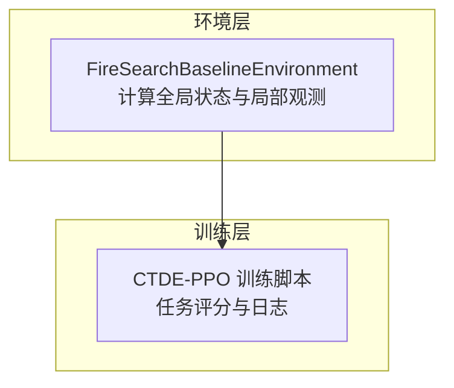
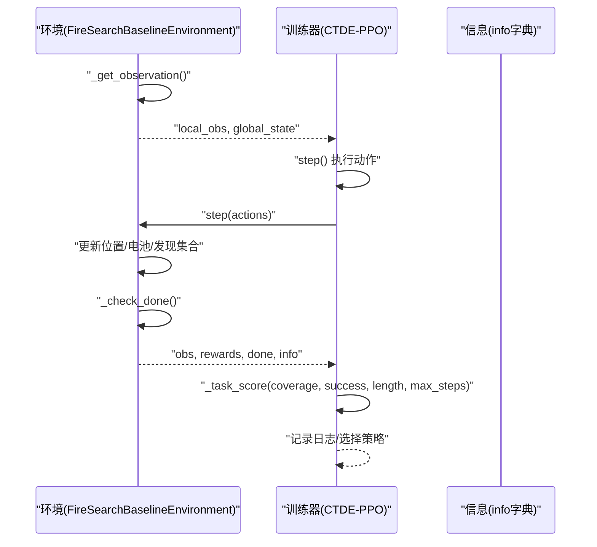
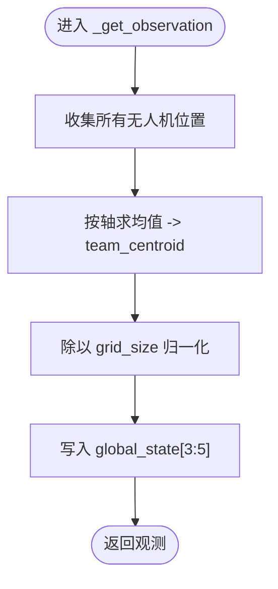
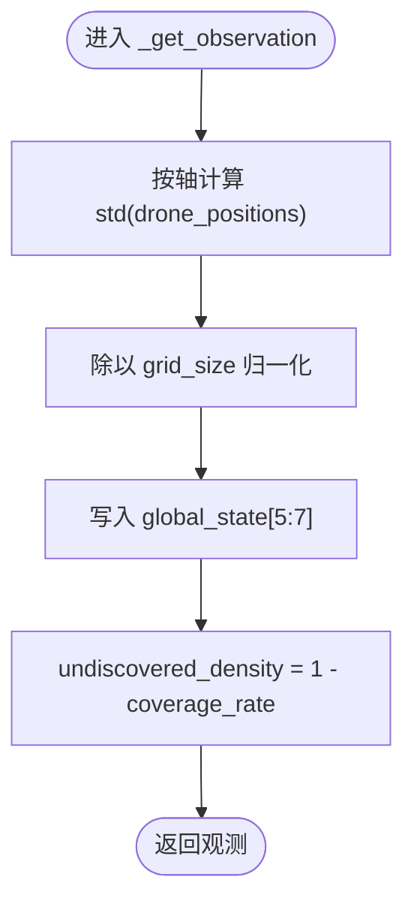
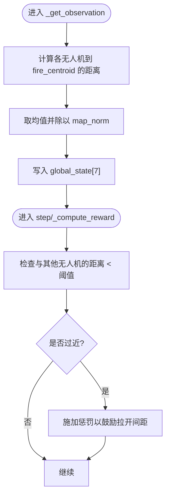
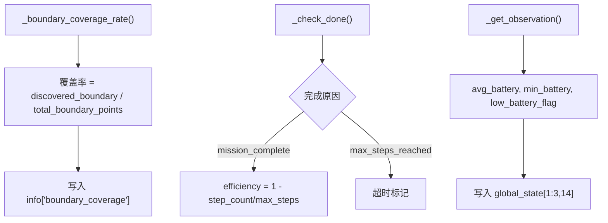
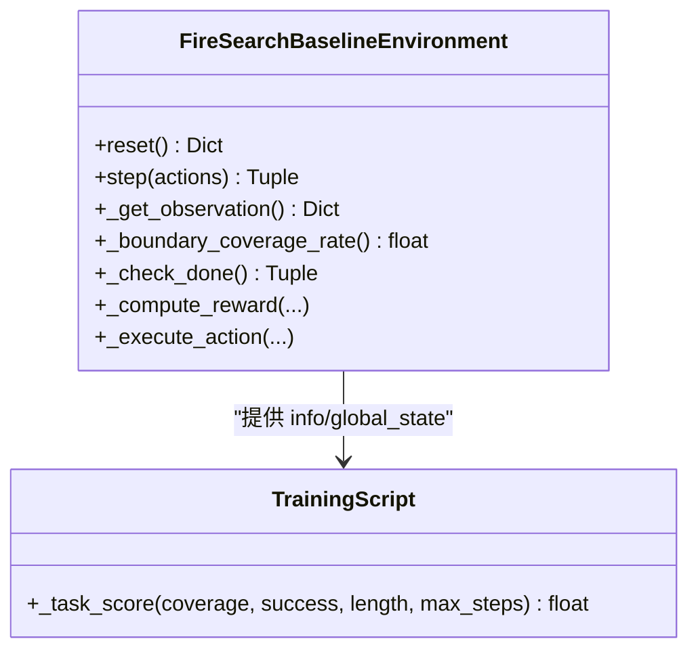

# 团队协作指标

<cite>
**本文引用的文件**   
- [rl_environment_baseline.py](file://environment_variables/environment_variables/rl_environment_baseline.py)
- [ctde_ppo_baseline_train.py](file://environment_variables/environment_variables/ctde_ppo_baseline_train.py)
</cite>

## 目录
1. [引言](#引言)
2. [项目结构](#项目结构)
3. [核心组件](#核心组件)
4. [架构总览](#架构总览)
5. [详细组件分析](#详细组件分析)
6. [依赖关系分析](#依赖关系分析)
7. [性能考量](#性能考量)
8. [故障排查指南](#故障排查指南)
9. [结论](#结论)
10. [附录](#附录)

## 引言
本文件面向多无人机（UAV）团队协作的“协作指标系统”，围绕以下目标展开：
- 团队质心计算与动态重心追踪
- 分散度统计（标准差、分布均匀性、覆盖范围评估）
- 平均距离测量（到火源中心、无人机间距离、最优间距保持）
- 协作效率评估（搜索覆盖率、任务完成时间、资源利用率）
- 团队协作质量的量化指标与性能基准
- 协作模式的自适应调整与优化建议

上述指标在环境类中集中计算并输出，供训练器或评估器使用。

## 项目结构
本项目包含一个基于 Gymnasium 的多机火灾边界搜索基线环境，以及配套的 CTDE-PPO 训练脚本。协作指标主要集中于环境类的观测与全局状态构建流程中，并在训练脚本中进行任务评分与日志记录。

图表来源
- [rl_environment_baseline.py:565-658](file://environment_variables/environment_variables/rl_environment_baseline.py#L565-L658)
- [ctde_ppo_baseline_train.py:294-296](file://environment_variables/environment_variables/ctde_ppo_baseline_train.py#L294-L296)

章节来源
- [rl_environment_baseline.py:1-120](file://environment_variables/environment_variables/rl_environment_baseline.py#L1-L120)
- [ctde_ppo_baseline_train.py:100-120](file://environment_variables/environment_variables/ctde_ppo_baseline_train.py#L100-L120)

## 核心组件
- 全局状态向量：包含覆盖率、电池均值/最小值、团队质心、团队分散度、平均距火源距离、步数进度、已访问区域比例、课程阶段、风速/高程均值、当前边界发现率、低电量标志、无人机数量、覆盖梯度、未探索密度等。
- 局部观测向量：每架无人机的位置、电量、热信号、风向风速、地形特征、动量、相机方向等。
- 任务评分函数：结合覆盖率、是否成功、长度与最大步数，得到效率分数。

章节来源
- [rl_environment_baseline.py:565-658](file://environment_variables/environment_variables/rl_environment_baseline.py#L565-L658)
- [ctde_ppo_baseline_train.py:294-296](file://environment_variables/environment_variables/ctde_ppo_baseline_train.py#L294-L296)

## 架构总览
下图展示了从环境生成观测到训练器评分的关键数据流。

图表来源
- [rl_environment_baseline.py:842-992](file://environment_variables/environment_variables/rl_environment_baseline.py#L842-L992)
- [ctde_ppo_baseline_train.py:294-296](file://environment_variables/environment_variables/ctde_ppo_baseline_train.py#L294-L296)

## 详细组件分析

### 团队质心与动态重心追踪
- 团队质心：对所有无人机位置按轴求均值，得到二维质心坐标。
- 归一化：将质心坐标除以网格尺寸，得到相对位置，便于跨场景比较。
- 动态追踪：每步调用 _get_observation 时重新计算，反映实时重心变化。

图表来源
- [rl_environment_baseline.py:613-618](file://environment_variables/environment_variables/rl_environment_baseline.py#L613-L618)
- [rl_environment_baseline.py:633-641](file://environment_variables/environment_variables/rl_environment_baseline.py#L633-L641)

章节来源
- [rl_environment_baseline.py:613-618](file://environment_variables/environment_variables/rl_environment_baseline.py#L613-L618)
- [rl_environment_baseline.py:633-641](file://environment_variables/environment_variables/rl_environment_baseline.py#L633-L641)

### 分散度统计（标准差、分布均匀性、覆盖范围评估）
- 标准差：对无人机位置按轴计算标准差，表征团队在X/Y方向的离散程度。
- 归一化：同样除以网格尺寸，得到相对分散度。
- 覆盖范围评估：可结合团队质心与标准差估计覆盖椭圆；同时可用“未探索密度”作为补充指标。

图表来源
- [rl_environment_baseline.py:615-616](file://environment_variables/environment_variables/rl_environment_baseline.py#L615-L616)
- [rl_environment_baseline.py:637-640](file://environment_variables/environment_variables/rl_environment_baseline.py#L637-L640)
- [rl_environment_baseline.py:631](file://environment_variables/environment_variables/rl_environment_baseline.py#L631)

章节来源
- [rl_environment_baseline.py:615-616](file://environment_variables/environment_variables/rl_environment_baseline.py#L615-L616)
- [rl_environment_baseline.py:637-640](file://environment_variables/environment_variables/rl_environment_baseline.py#L637-L640)
- [rl_environment_baseline.py:631](file://environment_variables/environment_variables/rl_environment_baseline.py#L631)

### 平均距离测量（到火源中心、无人机间距离、最优间距保持）
- 到火源中心距离：对每架无人机计算到 fire_centroid 的欧氏距离，再取均值并按地图范数归一化。
- 无人机间距离：在奖励计算中对相邻无人机进行距离检查，若小于阈值则施加惩罚，间接体现“最优间距保持”。
- 最优间距：通过惩罚机制引导无人机避免过近聚集，维持合理间距。

图表来源
- [rl_environment_baseline.py:617-618](file://environment_variables/environment_variables/rl_environment_baseline.py#L617-L618)
- [rl_environment_baseline.py:746-754](file://environment_variables/environment_variables/rl_environment_baseline.py#L746-L754)

章节来源
- [rl_environment_baseline.py:617-618](file://environment_variables/environment_variables/rl_environment_baseline.py#L617-L618)
- [rl_environment_baseline.py:746-754](file://environment_variables/environment_variables/rl_environment_baseline.py#L746-L754)

### 协作效率评估（覆盖率、任务完成时间、资源利用率）
- 搜索覆盖率：基于当前边界点集的计算，_boundary_coverage_rate 返回已发现边界点占比。
- 任务完成时间：通过 step_count 与 max_steps 的比例衡量；训练器使用 _task_score 将成功率与时间效率结合。
- 资源利用率：通过 avg_battery/min_battery 及低电量标志反映资源消耗情况。

图表来源
- [rl_environment_baseline.py:256-257](file://environment_variables/environment_variables/rl_environment_baseline.py#L256-L257)
- [rl_environment_baseline.py:824-840](file://environment_variables/environment_variables/rl_environment_baseline.py#L824-L840)
- [rl_environment_baseline.py:948-961](file://environment_variables/environment_variables/rl_environment_baseline.py#L948-L961)
- [rl_environment_baseline.py:613-614](file://environment_variables/environment_variables/rl_environment_baseline.py#L613-L614)
- [rl_environment_baseline.py:648](file://environment_variables/environment_variables/rl_environment_baseline.py#L648)
- [ctde_ppo_baseline_train.py:294-296](file://environment_variables/environment_variables/ctde_ppo_baseline_train.py#L294-L296)

章节来源
- [rl_environment_baseline.py:256-257](file://environment_variables/environment_variables/rl_environment_baseline.py#L256-L257)
- [rl_environment_baseline.py:824-840](file://environment_variables/environment_variables/rl_environment_baseline.py#L824-L840)
- [rl_environment_baseline.py:948-961](file://environment_variables/environment_variables/rl_environment_baseline.py#L948-L961)
- [rl_environment_baseline.py:613-614](file://environment_variables/environment_variables/rl_environment_baseline.py#L613-L614)
- [rl_environment_baseline.py:648](file://environment_variables/environment_variables/rl_environment_baseline.py#L648)
- [ctde_ppo_baseline_train.py:294-296](file://environment_variables/environment_variables/ctde_ppo_baseline_train.py#L294-L296)

### 团队协作质量量化指标与性能基准
- 团队质心稳定性：质心方差随时间的波动越小，说明团队协同越稳定。
- 分散度均衡性：X/Y方向标准差比值接近1表示各向同性分散。
- 间距一致性：过近距离惩罚触发频率越低，表明间距控制越好。
- 覆盖率趋势：_coverage_gradient 提供单位时间内的覆盖率增量，用于评估收敛速度。
- 任务效率：_task_score 将成功率与时间效率结合，可作为统一基准。

章节来源
- [rl_environment_baseline.py:637-640](file://environment_variables/environment_variables/rl_environment_baseline.py#L637-L640)
- [rl_environment_baseline.py:746-754](file://environment_variables/environment_variables/rl_environment_baseline.py#L746-L754)
- [rl_environment_baseline.py:924-925](file://environment_variables/environment_variables/rl_environment_baseline.py#L924-L925)
- [ctde_ppo_baseline_train.py:294-296](file://environment_variables/environment_variables/ctde_ppo_baseline_train.py#L294-L296)

### 协作模式的自适应调整与优化建议
- 课程阶段自适应：不同阶段的目标覆盖率不同，影响终止条件与奖励强度。
- 初始位置策略：根据课程阶段采用“靠近边界”或“远离火源”的随机初始化，有助于学习多样化策略。
- 间距约束自适应：最小间距与视野半径相关，随参数调整而改变。
- 建议优化：
  - 引入更精细的间距控制（如期望间距与容差带），减少过度惩罚带来的震荡。
  - 增加“覆盖梯度”的正向奖励，加速早期探索。
  - 对低电量无人机实施差异化行为（如返航或保守搜索）。

章节来源
- [rl_environment_baseline.py:373-436](file://environment_variables/environment_variables/rl_environment_baseline.py#L373-L436)
- [rl_environment_baseline.py:824-840](file://environment_variables/environment_variables/rl_environment_baseline.py#L824-L840)
- [rl_environment_baseline.py:746-754](file://environment_variables/environment_variables/rl_environment_baseline.py#L746-L754)

## 依赖关系分析
- 环境类负责计算所有协作指标，并通过 global_state 暴露给上层。
- 训练器读取 info 中的覆盖率与完成原因，并使用 _task_score 计算任务得分。
- 关键依赖包括：
  - 边界点集与火源质心的维护与更新
  - 视野半径与网格尺寸的归一化
  - 课程阶段与目标覆盖率

图表来源
- [rl_environment_baseline.py:565-658](file://environment_variables/environment_variables/rl_environment_baseline.py#L565-L658)
- [rl_environment_baseline.py:842-992](file://environment_variables/environment_variables/rl_environment_baseline.py#L842-L992)
- [ctde_ppo_baseline_train.py:294-296](file://environment_variables/environment_variables/ctde_ppo_baseline_train.py#L294-L296)

章节来源
- [rl_environment_baseline.py:565-658](file://environment_variables/environment_variables/rl_environment_baseline.py#L565-L658)
- [rl_environment_baseline.py:842-992](file://environment_variables/environment_variables/rl_environment_baseline.py#L842-L992)
- [ctde_ppo_baseline_train.py:294-296](file://environment_variables/environment_variables/ctde_ppo_baseline_train.py#L294-L296)

## 性能考量
- 计算复杂度：
  - 团队质心与分散度为 O(N)，N 为无人机数量。
  - 到火源距离为 O(N)。
  - 边界点可见性检测与更新与边界点数相关，但通常远小于网格规模。
- 归一化与数值稳定性：
  - 所有空间指标均按网格尺寸或地图范数归一化，避免尺度差异。
- 内存占用：
  - 已访问集合与确认边界掩码随网格增长，需注意大地图下的内存开销。

[本节为通用指导，不直接分析具体文件]

## 故障排查指南
- 覆盖率始终为零：
  - 检查 _boundary_coverage_rate 的分母是否为零，确保 boundary_points 非空。
  - 查看 _check_done 的终止条件与课程阶段目标是否过于严格。
- 无人机聚集严重：
  - 检查间距惩罚阈值与视野半径的关系，适当增大最小间距。
- 任务超时频繁：
  - 观察 _task_score 的时间效率项，考虑提高早期探索奖励或降低步长惩罚。

章节来源
- [rl_environment_baseline.py:256-257](file://environment_variables/environment_variables/rl_environment_baseline.py#L256-L257)
- [rl_environment_baseline.py:824-840](file://environment_variables/environment_variables/rl_environment_baseline.py#L824-L840)
- [rl_environment_baseline.py:746-754](file://environment_variables/environment_variables/rl_environment_baseline.py#L746-L754)
- [ctde_ppo_baseline_train.py:294-296](file://environment_variables/environment_variables/ctde_ppo_baseline_train.py#L294-L296)

## 结论
该协作指标体系以环境为中心，提供了从团队几何形态（质心、分散度）、空间关系（到火源距离、间距保持）到任务效率（覆盖率、时间效率、资源利用）的全方位度量。通过课程阶段与自适应初始化，系统在探索与利用之间取得平衡。建议在后续迭代中引入更细粒度的间距控制与覆盖梯度奖励，以提升整体协作质量与收敛速度。

[本节为总结性内容，不直接分析具体文件]

## 附录
- 全局状态字段参考（部分）：
  - 覆盖率、电池均值/最小值、团队质心（归一化）、团队分散度（归一化）、平均距火源距离（归一化）、步数进度、已访问区域比例、课程阶段、风速/高程均值、当前边界发现率、低电量标志、无人机数量、覆盖梯度、未探索密度。
- 任务评分公式参考：
  - 效率 = 成功率 × (1 - clip(长度/最大步数))

章节来源
- [rl_environment_baseline.py:633-653](file://environment_variables/environment_variables/rl_environment_baseline.py#L633-L653)
- [ctde_ppo_baseline_train.py:294-296](file://environment_variables/environment_variables/ctde_ppo_baseline_train.py#L294-L296)