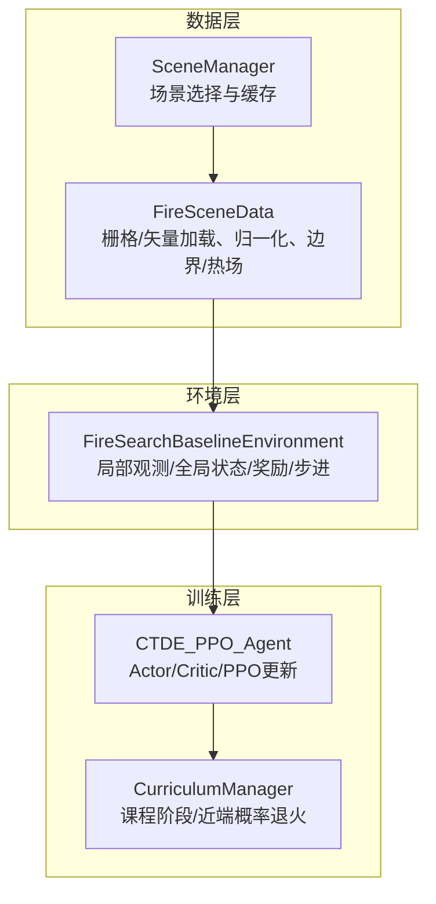
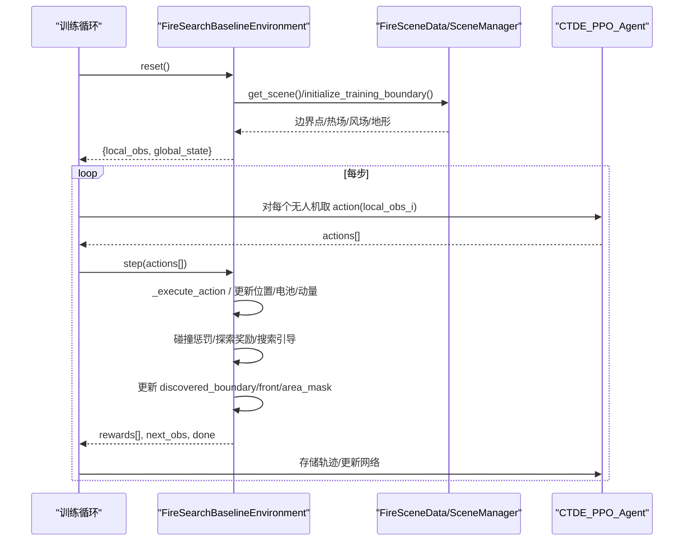
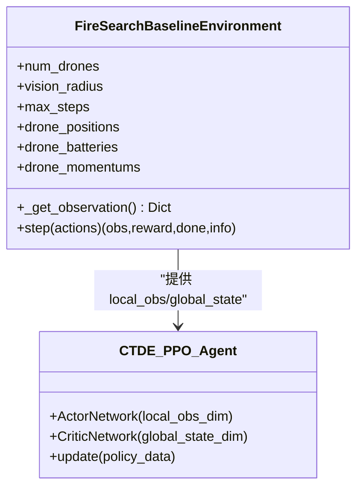
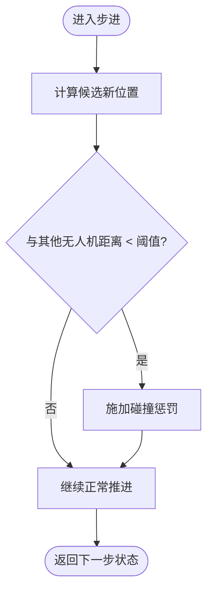
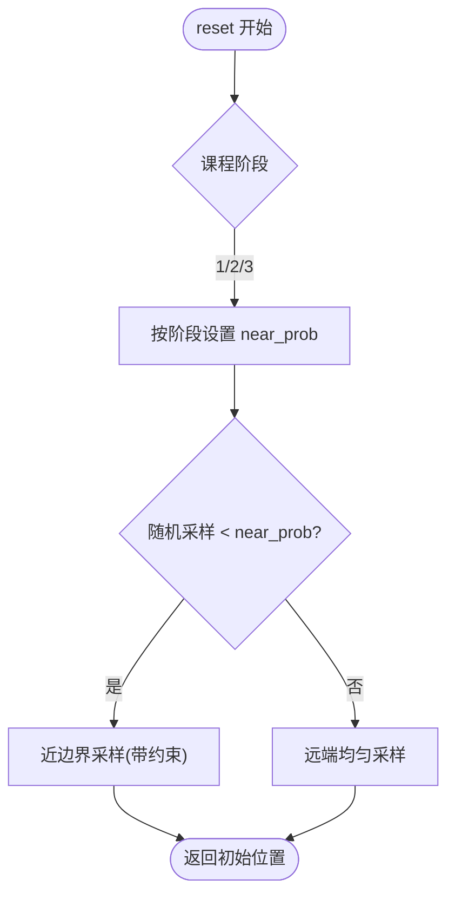
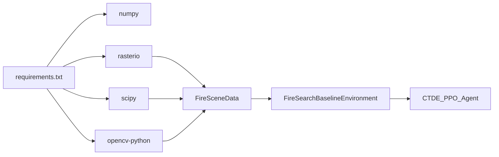
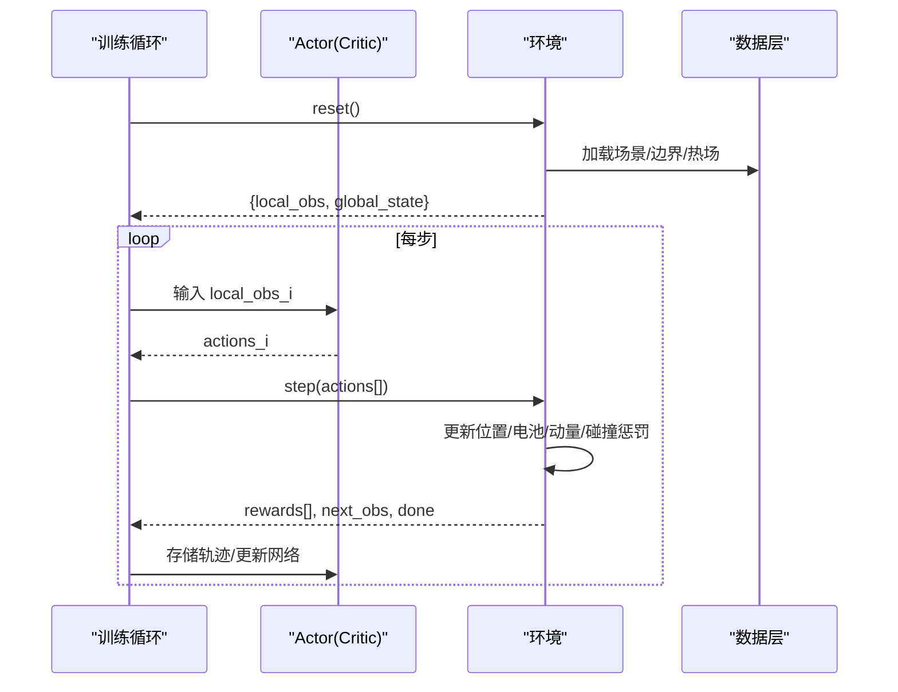

# 多无人机协同机制

<cite>
**本文引用的文件**   
- [ctde_ppo_baseline_train.py](file://environment_variables/environment_variables/ctde_ppo_baseline_train.py)
- [rl_environment_baseline.py](file://environment_variables/environment_variables/rl_environment_baseline.py)
- [信息转换.py](file://environment_variables/environment_variables/信息转换.py)
</cite>

## 目录
1. [引言](#引言)
2. [项目结构](#项目结构)
3. [核心组件](#核心组件)
4. [架构总览](#架构总览)
5. [详细组件分析](#详细组件分析)
6. [依赖关系分析](#依赖关系分析)
7. [性能与可扩展性](#性能与可扩展性)
8. [故障排查指南](#故障排查指南)
9. [结论](#结论)
10. [附录：关键流程时序图](#附录关键流程时序图)

## 引言
本文件面向“多无人机协同搜索系统”的协同机制，围绕状态管理（位置、电池、动量）、通信协议与信息共享（全局状态与局部观测）、碰撞检测与避免、初始化与随机生成策略、团队协作指标计算，以及动态扩展与优化建议进行系统化说明。文档严格基于仓库中的环境实现与训练脚本进行分析，确保所有技术细节均可溯源到具体源码位置。

## 项目结构
本项目采用“环境 + 数据层 + 训练器”的分层组织方式：
- 数据层：场景索引、栅格加载、归一化、边界提取、热场构建等
- 环境层：Gymnasium 风格的多无人机离散动作环境，提供局部观测与全局状态
- 训练层：CTDE-PPO 基线训练脚本，含课程学习、自适应学习率、评估与质量度量

图表来源
- [信息转换.py:1282-1326](file://environment_variables/environment_variables/信息转换.py#L1282-L1326)
- [信息转换.py:219-322](file://environment_variables/environment_variables/信息转换.py#L219-L322)
- [rl_environment_baseline.py:21-106](file://environment_variables/environment_variables/rl_environment_baseline.py#L21-L106)
- [ctde_ppo_baseline_train.py:569-758](file://environment_variables/environment_variables/ctde_ppo_baseline_train.py#L569-L758)
- [ctde_ppo_baseline_train.py:759-800](file://environment_variables/environment_variables/ctde_ppo_baseline_train.py#L759-L800)

章节来源
- [信息转换.py:1282-1326](file://environment_variables/environment_variables/信息转换.py#L1282-L1326)
- [rl_environment_baseline.py:21-106](file://environment_variables/environment_variables/rl_environment_baseline.py#L21-L106)
- [ctde_ppo_baseline_train.py:569-758](file://environment_variables/environment_variables/ctde_ppo_baseline_train.py#L569-L758)

## 核心组件
- FireSceneData：负责场景数据加载、归一化参数推导、t=0 或按面积百分比的初始边界提取、热势场与导航场的构建、局部热力梯度与风场影响等。
- SceneManager：按模式（train/validation/generalization/stress）选择场景并共享缓存，避免重复读盘与重复计算。
- FireSearchBaselineEnvironment：定义多无人机离散动作空间、局部观测与全局状态构造、边界覆盖统计、碰撞惩罚、探索与搜索引导奖励、超时终止与阶段目标惩罚等。
- CTDE_PPO_Agent：分布式 Actor（仅本地观测）+ 集中式 Critic（全局状态），PPO 更新、KL 自适应学习率、回放缓冲等。
- CurriculumManager：三阶段课程学习，包含初始面积百分位阶梯、阶段3成功率/覆盖率门槛、near_prob 能力绑定退火等。

章节来源
- [信息转换.py:219-322](file://environment_variables/environment_variables/信息转换.py#L219-L322)
- [信息转换.py:684-721](file://environment_variables/environment_variables/信息转换.py#L684-L721)
- [信息转换.py:759-819](file://environment_variables/environment_variables/信息转换.py#L759-L819)
- [信息转换.py:821-887](file://environment_variables/environment_variables/信息转换.py#L821-L887)
- [信息转换.py:933-970](file://environment_variables/environment_variables/信息转换.py#L933-L970)
- [信息转换.py:1125-1165](file://environment_variables/environment_variables/信息转换.py#L1125-L1165)
- [rl_environment_baseline.py:21-106](file://environment_variables/environment_variables/rl_environment_baseline.py#L21-L106)
- [rl_environment_baseline.py:331-360](file://environment_variables/environment_variables/rl_environment_baseline.py#L331-L360)
- [rl_environment_baseline.py:362-436](file://environment_variables/environment_variables/rl_environment_baseline.py#L362-L436)
- [rl_environment_baseline.py:565-658](file://environment_variables/environment_variables/rl_environment_baseline.py#L565-L658)
- [rl_environment_baseline.py:660-669](file://environment_variables/environment_variables/rl_environment_baseline.py#L660-L669)
- [rl_environment_baseline.py:692-767](file://environment_variables/environment_variables/rl_environment_baseline.py#L692-L767)
- [ctde_ppo_baseline_train.py:569-758](file://environment_variables/environment_variables/ctde_ppo_baseline_train.py#L569-L758)
- [ctde_ppo_baseline_train.py:759-800](file://environment_variables/environment_variables/ctde_ppo_baseline_train.py#L759-L800)

## 架构总览
下图展示了从数据加载到环境步进、再到 PPO 更新的端到端流程，突出“局部观测 + 全局状态”的 CTDE 范式。

图表来源
- [rl_environment_baseline.py:331-360](file://environment_variables/environment_variables/rl_environment_baseline.py#L331-L360)
- [rl_environment_baseline.py:565-658](file://environment_variables/environment_variables/rl_environment_baseline.py#L565-L658)
- [rl_environment_baseline.py:660-669](file://environment_variables/environment_variables/rl_environment_baseline.py#L660-L669)
- [rl_environment_baseline.py:692-767](file://environment_variables/environment_variables/rl_environment_baseline.py#L692-L767)
- [信息转换.py:684-721](file://environment_variables/environment_variables/信息转换.py#L684-L721)
- [信息转换.py:759-819](file://environment_variables/environment_variables/信息转换.py#L759-L819)
- [ctde_ppo_baseline_train.py:759-800](file://environment_variables/environment_variables/ctde_ppo_baseline_train.py#L759-L800)

## 详细组件分析

### 1) 状态管理机制（位置跟踪、电池管理、动量控制）
- 位置跟踪
  - 每架无人机维护二维网格坐标，动作映射为四方向移动或静止，执行后裁剪至地图边界。
  - 可见区域以圆形窗口切取，用于统计新发现面积、前沿点、边界点等。
- 电池管理
  - 最大电量与最大步数关联，重置时恢复满电；全局状态中包含平均/最低电量比例与低电量标志位。
- 动量控制
  - 每架无人机维护二维动量向量，作为局部观测的一部分参与策略决策，有助于平滑运动与惯性建模。

章节来源
- [rl_environment_baseline.py:133-147](file://environment_variables/environment_variables/rl_environment_baseline.py#L133-L147)
- [rl_environment_baseline.py:331-360](file://environment_variables/environment_variables/rl_environment_baseline.py#L331-L360)
- [rl_environment_baseline.py:565-658](file://environment_variables/environment_variables/rl_environment_baseline.py#L565-L658)
- [rl_environment_baseline.py:660-669](file://environment_variables/environment_variables/rl_environment_baseline.py#L660-L669)

### 2) 通信协议与信息共享（全局状态与局部观测）
- 局部观测（per-drone）
  - 包含自身位置归一化、电池比例、单元特征（强度/DEM/坡度/风速风向）、热力梯度、动量、相机朝向等，维度随 observation_profile 变化。
- 全局状态（centralized critic）
  - 汇总团队覆盖率、平均/最低电量、团队质心与分散度、距火中心平均距离、时间进度、已访问密度、阶段编号、平均风速/高程、当前边界发现比例、低电量标志、无人机数量、覆盖率梯度、未覆盖密度等。
- 通信语义
  - 无显式消息传递，通过集中式 Critic 使用全局状态完成价值估计，符合 CTDE 范式。

图表来源
- [rl_environment_baseline.py:565-658](file://environment_variables/environment_variables/rl_environment_baseline.py#L565-L658)
- [ctde_ppo_baseline_train.py:460-535](file://environment_variables/environment_variables/ctde_ppo_baseline_train.py#L460-L535)

章节来源
- [rl_environment_baseline.py:565-658](file://environment_variables/environment_variables/rl_environment_baseline.py#L565-L658)
- [ctde_ppo_baseline_train.py:460-535](file://environment_variables/environment_variables/ctde_ppo_baseline_train.py#L460-L535)

### 3) 碰撞检测与避免算法（最小间距约束与冲突解决）
- 最小间距约束
  - 在生成近边界初始位置时，检查与其他无人机的欧氏距离是否小于阈值（与视野半径成比例），不满足则拒绝该候选位置并重试。
- 运行时冲突惩罚
  - 若某步中任意两机距离小于阈值，施加负奖励，促使策略学会保持安全间距。
- 冲突解决策略
  - 通过奖励塑形驱动策略自发规避，而非硬约束剪枝；同时结合“预边界搜索引导”鼓励远离热点区域的探索，降低聚集风险。

图表来源
- [rl_environment_baseline.py:417-419](file://environment_variables/environment_variables/rl_environment_baseline.py#L417-L419)
- [rl_environment_baseline.py:746-754](file://environment_variables/environment_variables/rl_environment_baseline.py#L746-L754)

章节来源
- [rl_environment_baseline.py:417-419](file://environment_variables/environment_variables/rl_environment_baseline.py#L417-L419)
- [rl_environment_baseline.py:746-754](file://environment_variables/environment_variables/rl_environment_baseline.py#L746-L754)

### 4) 初始化与随机生成机制（近边界/远端生成与概率控制）
- 近边界生成
  - 根据课程阶段设定不同概率（阶段1/2/3），优先尝试在边界附近按角度与半径采样，并满足边界内边距、距离区间、与已有无人机最小间距等约束。
- 远端生成
  - 当近端失败或概率未命中时，在离火中心较远处均匀采样，保证初始多样性。
- 概率控制
  - 阶段3的 near_prob 由课程管理器能力绑定退火，逐步降低近端生成概率，提升泛化与鲁棒性。

图表来源
- [rl_environment_baseline.py:362-436](file://environment_variables/environment_variables/rl_environment_baseline.py#L362-L436)
- [ctde_ppo_baseline_train.py:569-758](file://environment_variables/environment_variables/ctde_ppo_baseline_train.py#L569-L758)

章节来源
- [rl_environment_baseline.py:362-436](file://environment_variables/environment_variables/rl_environment_baseline.py#L362-L436)
- [ctde_ppo_baseline_train.py:569-758](file://environment_variables/environment_variables/ctde_ppo_baseline_train.py#L569-L758)

### 5) 团队协作指标（团队质心、分散度、平均距离等）
- 团队质心
  - 对所有无人机位置求均值，归一化到地图尺度，反映整体聚集中心。
- 分散度
  - 对各轴位置标准差，衡量团队展开程度。
- 平均距离
  - 各无人机到火中心的平均距离，归一化到地图尺度，体现整体靠近目标的程度。
- 其他统计
  - 平均/最低电量、已访问密度、未覆盖密度、覆盖率梯度等，均纳入全局状态供 Critic 使用。

章节来源
- [rl_environment_baseline.py:613-653](file://environment_variables/environment_variables/rl_environment_baseline.py#L613-L653)

### 6) 数据与热场支撑（边界、热势、梯度、风场）
- 边界提取
  - 支持 t=0 或按面积百分比选取初始边界，内部通过二值化与形态学侵蚀得到边界点集。
- 热势场
  - 基于强度图与火掩码构建，经下采样高斯模糊与稳健归一化，输出 [0,1] 的热势；另提供 log 压缩导航场用于稳定梯度。
- 局部热力梯度
  - 在导航场上差分计算单位方向梯度，用于引导搜索。
- 风场影响
  - 提供风阻与额外能耗估算，辅助更真实的移动代价建模。

章节来源
- [信息转换.py:684-721](file://environment_variables/environment_variables/信息转换.py#L684-L721)
- [信息转换.py:759-819](file://environment_variables/environment_variables/信息转换.py#L759-L819)
- [信息转换.py:821-887](file://environment_variables/environment_variables/信息转换.py#L821-L887)
- [信息转换.py:933-970](file://environment_variables/environment_variables/信息转换.py#L933-L970)
- [信息转换.py:1125-1165](file://environment_variables/environment_variables/信息转换.py#L1125-L1165)

### 7) 课程学习与阶段目标（成功率/覆盖率/零超时率）
- 阶段1：提高基础成功率与覆盖率，逐步提升初始面积百分位。
- 阶段2：提高目标覆盖率，强化零超时率控制。
- 阶段3：进一步提升最终目标覆盖率，同时退火 near_prob，增强远端生成与泛化能力。
- 能力门控：依据成功率、零超时率、覆盖率三重门限决定是否推进阶段或退火 near_prob。

章节来源
- [ctde_ppo_baseline_train.py:569-758](file://environment_variables/environment_variables/ctde_ppo_baseline_train.py#L569-L758)

## 依赖关系分析
- 数据层与环境层
  - 环境依赖 FireSceneData 提供的边界、热场、风场、地形等数据；SceneManager 负责场景选择与缓存，减少 I/O 与重复计算。
- 环境与训练器
  - 训练器通过 Gymnasium 接口与环境交互，Actor 仅见局部观测，Critic 使用全局状态，PPO 更新策略与价值函数。
- 外部库
  - numpy/rasterio/scipy/opencv 用于栅格读写、形态学操作、滤波与插值等。

图表来源
- [environment_variables/requirements.txt:1-13](file://environment_variables/requirements.txt#L1-L13)
- [信息转换.py:219-322](file://environment_variables/environment_variables/信息转换.py#L219-L322)
- [rl_environment_baseline.py:21-106](file://environment_variables/environment_variables/rl_environment_baseline.py#L21-L106)
- [ctde_ppo_baseline_train.py:759-800](file://environment_variables/environment_variables/ctde_ppo_baseline_train.py#L759-L800)

章节来源
- [environment_variables/requirements.txt:1-13](file://environment_variables/requirements.txt#L1-L13)
- [信息转换.py:219-322](file://environment_variables/environment_variables/信息转换.py#L219-L322)
- [rl_environment_baseline.py:21-106](file://environment_variables/environment_variables/rl_environment_baseline.py#L21-L106)
- [ctde_ppo_baseline_train.py:759-800](file://environment_variables/environment_variables/ctde_ppo_baseline_train.py#L759-L800)

## 性能与可扩展性
- 性能要点
  - 场景缓存：SceneManager 跨实例共享 FireSceneData，避免重复读取与归一化计算。
  - 热场稳健归一化：按场景 p99 参考值缩放，避免极端值导致梯度不稳定。
  - 局部窗口切片：圆形窗口与布尔掩码加速局部统计。
- 可扩展性建议
  - 增加无人机数量：直接调整 num_drones，注意全局状态维度固定，但团队统计会聚合更多样本；需关注内存与 PPO 批次大小。
  - 观测/奖励配置：observation_profile 与 reward_profile 可切换，便于在不同任务侧重上快速迭代。
  - 课程参数：可通过 CurriculumManager 的门限与退火曲线调节难度曲线，平衡收敛速度与稳定性。

[本节为通用指导，无需特定源码引用]

## 故障排查指南
- 场景无效
  - 若 t=0 或指定面积百分比的边界为空，将抛出 InvalidSceneError。应检查数据集路径、元数据与栅格一致性。
- 热场健康
  - 诊断工具可检查饱和比例、高热区零梯度比例、分位数等，帮助定位热场构建异常。
- 训练日志
  - 控制台 TeeStream 将 stdout/stderr 同步写入日志文件，便于回溯 KL、clip_fraction、学习率与阶段切换信息。

章节来源
- [信息转换.py:684-721](file://environment_variables/environment_variables/信息转换.py#L684-L721)
- [信息转换.py:972-1012](file://environment_variables/environment_variables/信息转换.py#L972-L1012)
- [ctde_ppo_baseline_train.py:47-96](file://environment_variables/environment_variables/ctde_ppo_baseline_train.py#L47-L96)

## 结论
本系统以 CTDE-PPO 为核心，结合稳健热场与风场建模，实现了多无人机在火灾边界搜索任务中的协同。其关键优势在于：
- 清晰的“局部观测 + 全局状态”分工，兼顾分布式决策与集中式价值评估
- 完善的课程学习体系，自动调节初始分布与难度，提升收敛效率
- 合理的碰撞惩罚与近/远端生成策略，保障安全性与探索多样性
- 丰富的协作指标与诊断工具，便于监控与调优

[本节为总结性内容，无需特定源码引用]

## 附录：关键流程时序图

### 单步交互时序（环境 + 训练器）

图表来源
- [rl_environment_baseline.py:331-360](file://environment_variables/environment_variables/rl_environment_baseline.py#L331-L360)
- [rl_environment_baseline.py:565-658](file://environment_variables/environment_variables/rl_environment_baseline.py#L565-L658)
- [rl_environment_baseline.py:660-669](file://environment_variables/environment_variables/rl_environment_baseline.py#L660-L669)
- [ctde_ppo_baseline_train.py:759-800](file://environment_variables/environment_variables/ctde_ppo_baseline_train.py#L759-L800)