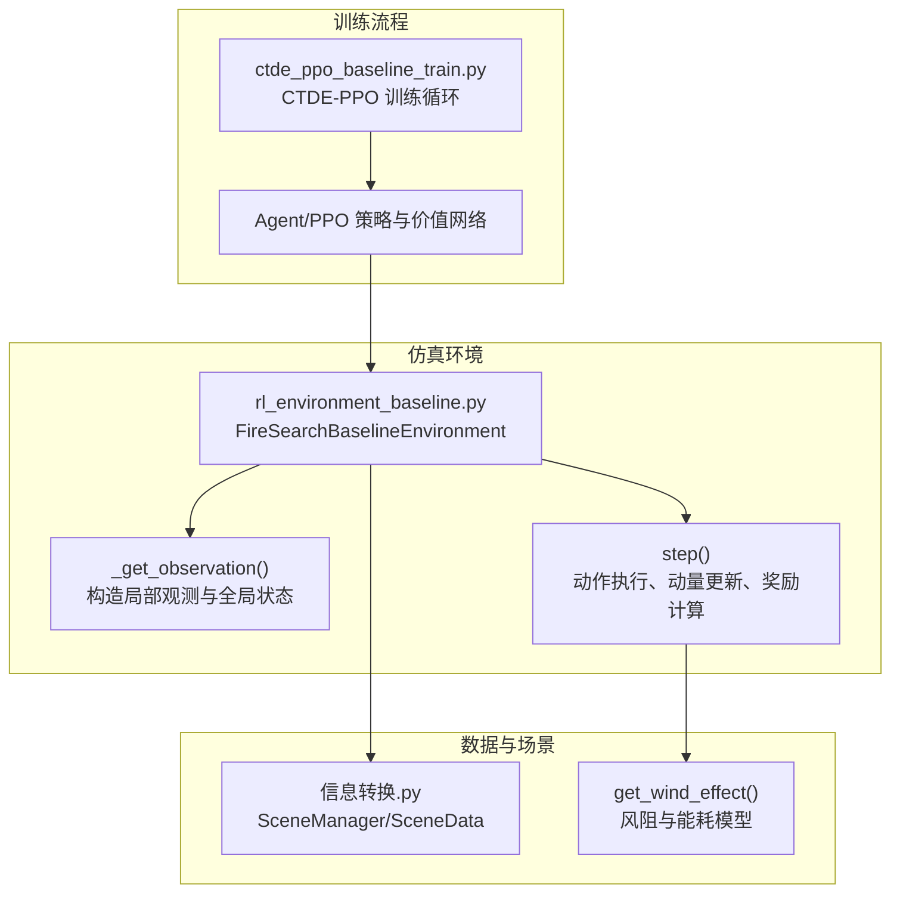
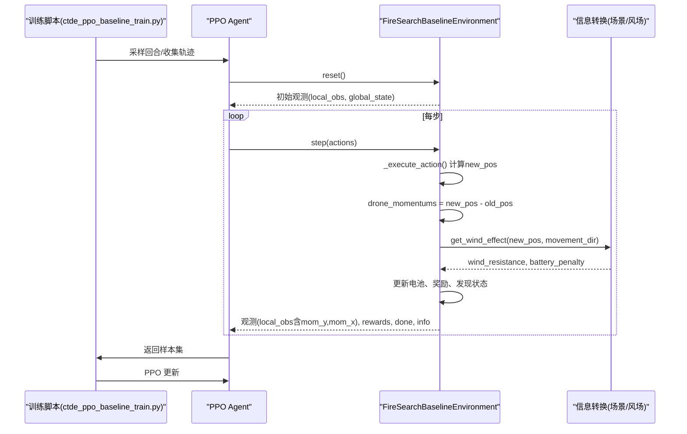
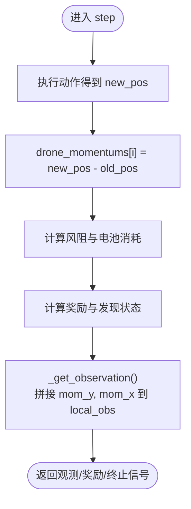
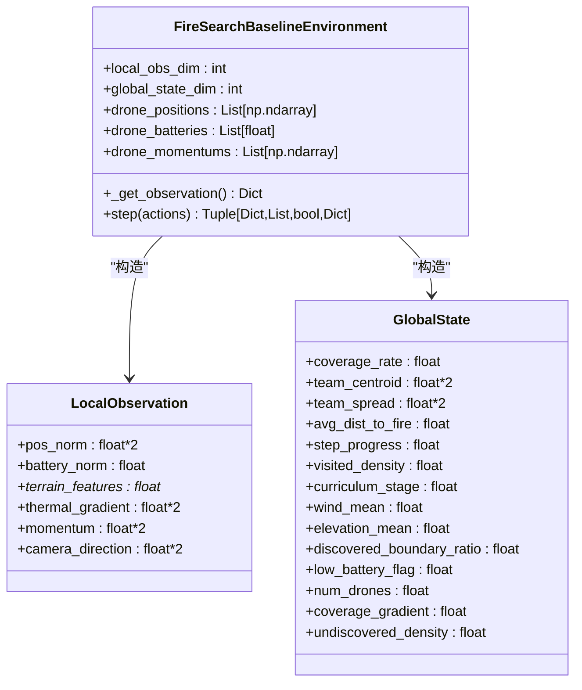
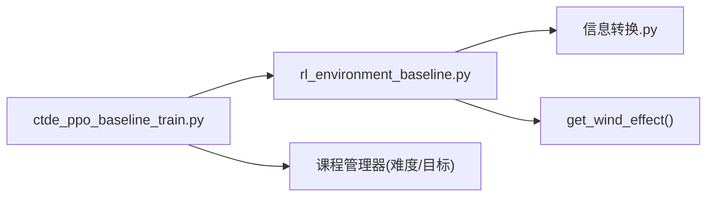

# 动量控制系统

<cite>
**本文引用的文件**   
- [rl_environment_baseline.py](file://environment_variables/environment_variables/rl_environment_baseline.py)
- [ctde_ppo_baseline_train.py](file://environment_variables/environment_variables/ctde_ppo_baseline_train.py)
- [信息转换.py](file://environment_variables/environment_variables/信息转换.py)
</cite>

## 目录
1. [引言](#引言)
2. [项目结构](#项目结构)
3. [核心组件](#核心组件)
4. [架构总览](#架构总览)
5. [详细组件分析](#详细组件分析)
6. [依赖关系分析](#依赖关系分析)
7. [性能与数值稳定性](#性能与数值稳定性)
8. [故障排查指南](#故障排查指南)
9. [结论](#结论)
10. [附录：调参与观测空间说明](#附录：调参与观测空间说明)

## 引言
本文件围绕无人机动量控制系统的实现，系统阐述惯性模拟机制、动量更新逻辑、观测空间编码方式、物理约束与数值稳定性保证，以及动量对搜索行为的影响与调优建议。该动量系统用于在离散网格环境中为无人机提供“方向保持”和“运动平滑”的隐式惯性特性，并通过观测空间向策略网络传递动量特征，从而提升探索与边界覆盖的稳定性与效率。

## 项目结构
本项目采用“环境 + 训练脚本 + 数据/场景处理”的分层组织：
- 环境与仿真：FireSearchBaselineEnvironment 负责多机火场边界搜索任务的状态推进、奖励计算、观测生成与动量维护。
- 训练与算法：CTDE-PPO 基线训练脚本管理课程学习、PPO 更新、日志与评估。
- 数据与场景：信息转换模块提供场景加载、热势场、风场等栅格数据的读取与局部统计。

图表来源
- [ctde_ppo_baseline_train.py:1-120](file://environment_variables/environment_variables/ctde_ppo_baseline_train.py#L1-L120)
- [rl_environment_baseline.py:565-658](file://environment_variables/environment_variables/rl_environment_baseline.py#L565-L658)
- [rl_environment_baseline.py:842-992](file://environment_variables/environment_variables/rl_environment_baseline.py#L842-L992)
- [信息转换.py:1125-1158](file://environment_variables/environment_variables/信息转换.py#L1125-L1158)

章节来源
- [ctde_ppo_baseline_train.py:1-120](file://environment_variables/environment_variables/ctde_ppo_baseline_train.py#L1-L120)
- [rl_environment_baseline.py:21-158](file://environment_variables/environment_variables/rl_environment_baseline.py#L21-L158)
- [信息转换.py:1-200](file://environment_variables/environment_variables/信息转换.py#L1-L200)

## 核心组件
- 动量向量定义与存储
  - 每架无人机维护一个二维动量向量，表示最近一步的位置增量（即位移），作为“瞬时速度”的代理。
  - 初始化时为零向量；每步根据新位置与旧位置的差值更新。
- 动量更新逻辑
  - 在 step 中，先计算新位置，再记录动量为 new_pos - old_pos。
  - 由于动作是四邻域或静止，动量分量取值仅为 {-1, 0, 1}，因此动量大小天然受限，具备内在的数值稳定性。
- 动量衰减与方向保持
  - 当前实现未引入显式的动量衰减系数（如乘以小于1的因子）。
  - “方向保持”通过观测空间中直接输入上一时刻的动量向量，使策略网络能够学习到延续相同方向的偏好，从而实现隐性的方向保持。
- 观测空间中的动量编码
  - 局部观测包含每个无人机的动量分量（mom_y, mom_x），并与其他局部特征拼接。
  - 全局状态不包含团队动量统计，但包含团队质心、散布、平均距离等聚合特征。
- 物理约束与数值稳定性
  - 动作空间为离散四邻域+静止，动量被限制在 [-1, 1] 范围内，避免发散。
  - 电池消耗与风阻耦合，间接约束了持续同向运动的成本，防止无界加速。

章节来源
- [rl_environment_baseline.py:331-360](file://environment_variables/environment_variables/rl_environment_baseline.py#L331-L360)
- [rl_environment_baseline.py:565-602](file://environment_variables/environment_variables/rl_environment_baseline.py#L565-L602)
- [rl_environment_baseline.py:842-873](file://environment_variables/environment_variables/rl_environment_baseline.py#L842-L873)

## 架构总览
下图展示了从训练到环境步进的关键调用链，以及动量在各环节的作用点。

图表来源
- [ctde_ppo_baseline_train.py:1-120](file://environment_variables/environment_variables/ctde_ppo_baseline_train.py#L1-L120)
- [rl_environment_baseline.py:842-992](file://environment_variables/environment_variables/rl_environment_baseline.py#L842-L992)
- [信息转换.py:1125-1158](file://environment_variables/environment_variables/信息转换.py#L1125-L1158)

## 详细组件分析

### 动量向量与更新流程
- 动量定义
  - 每架无人机的动量为二维向量，表示最近一步的位移。
  - 初始化置零，确保起始无惯性。
- 更新时机
  - 在 step 中，先执行动作得到新位置，随后将动量设置为新位置与旧位置的差值。
- 影响范围
  - 动量仅用于观测构建，不直接参与位置积分或动力学方程。
  - 通过策略网络的端到端学习，动量特征可引导无人机保持方向或平滑转向。

图表来源
- [rl_environment_baseline.py:842-873](file://environment_variables/environment_variables/rl_environment_baseline.py#L842-L873)
- [rl_environment_baseline.py:565-602](file://environment_variables/environment_variables/rl_environment_baseline.py#L565-L602)

章节来源
- [rl_environment_baseline.py:331-360](file://environment_variables/environment_variables/rl_environment_baseline.py#L331-L360)
- [rl_environment_baseline.py:842-873](file://environment_variables/environment_variables/rl_environment_baseline.py#L842-L873)
- [rl_environment_baseline.py:565-602](file://environment_variables/environment_variables/rl_environment_baseline.py#L565-L602)

### 观测空间中的动量编码
- 局部观测
  - 每个无人机的 local_obs 包含其当前位置归一化坐标、电量、局部热力/地形/风场特征、热梯度、相机指向，以及动量分量 mom_y、mom_x。
  - 动量分量直接以浮点数形式拼接，供 Actor 网络使用。
- 全局状态
  - 全局状态包含覆盖率、平均/最小电量、团队质心与散布、距火中心平均距离、步数进度、已访问密度、课程阶段、平均风速/高程、发现边界比例、低电量指示、无人机数量、覆盖率梯度、未发现密度等。
  - 当前未包含团队动量的统计（如平均动量、动量方差），如需团队级惯性建模可在后续扩展。

图表来源
- [rl_environment_baseline.py:565-658](file://environment_variables/environment_variables/rl_environment_baseline.py#L565-L658)

章节来源
- [rl_environment_baseline.py:565-658](file://environment_variables/environment_variables/rl_environment_baseline.py#L565-L658)

### 动量对搜索行为的影响
- 方向保持与平滑
  - 由于动量特征直接进入策略网络，网络可以学习到“延续上一时刻方向”的策略，减少频繁转向带来的路径抖动。
  - 在边界搜索初期，方向保持有助于快速建立稳定的探索轨迹，提高首次发现边界的效率。
- 累积效应
  - 动量本身不累积（每步重置为最新位移），但策略网络可通过历史观测序列（若存在）或长期训练形成“惯性偏好”，表现为一段时间内维持同一方向。
- 与风阻/能耗的耦合
  - 风阻与能耗模型对逆风移动施加额外惩罚，促使策略在强风区域更谨慎地选择方向，间接抑制不必要的长直线路径。

章节来源
- [rl_environment_baseline.py:565-602](file://environment_variables/environment_variables/rl_environment_baseline.py#L565-L602)
- [rl_environment_baseline.py:866-873](file://environment_variables/environment_variables/rl_environment_baseline.py#L866-L873)
- [信息转换.py:1125-1158](file://environment_variables/environment_variables/信息转换.py#L1125-L1158)

### 动量相关的物理约束与数值稳定性
- 动作空间限制
  - 动作集合为四邻域移动与静止，导致动量分量取值仅为 {-1, 0, 1}，避免了数值爆炸。
- 能量约束
  - 每步移动消耗基础电量，逆风移动增加额外能耗；长时间同向移动会更快耗尽电量，从而自然限制无限惯性。
- 边界与越界保护
  - 新位置经 clip 操作限制在地图范围内，确保动量不会导致越界或异常状态。

章节来源
- [rl_environment_baseline.py:660-669](file://environment_variables/environment_variables/rl_environment_baseline.py#L660-L669)
- [rl_environment_baseline.py:866-873](file://environment_variables/environment_variables/rl_environment_baseline.py#L866-L873)

## 依赖关系分析
- 环境与环境数据
  - FireSearchBaselineEnvironment 依赖 SceneManager 与 SceneData 提供的栅格数据、热势场、边界检测与风场信息。
- 风场与能耗
  - get_wind_effect 基于风向与风速计算阻力与电池惩罚，影响步进的能耗与策略倾向。
- 训练与课程学习
  - 训练脚本管理课程阶段切换与难度参数（如 near_prob、目标覆盖率），这些参数会影响无人机初始分布与任务目标，间接改变动量特征的使用效果。

图表来源
- [ctde_ppo_baseline_train.py:1-120](file://environment_variables/environment_variables/ctde_ppo_baseline_train.py#L1-L120)
- [rl_environment_baseline.py:842-992](file://environment_variables/environment_variables/rl_environment_baseline.py#L842-L992)
- [信息转换.py:1125-1158](file://environment_variables/environment_variables/信息转换.py#L1125-L1158)

章节来源
- [ctde_ppo_baseline_train.py:1-120](file://environment_variables/environment_variables/ctde_ppo_baseline_train.py#L1-L120)
- [rl_environment_baseline.py:842-992](file://environment_variables/environment_variables/rl_environment_baseline.py#L842-L992)
- [信息转换.py:1125-1158](file://environment_variables/environment_variables/信息转换.py#L1125-L1158)

## 性能与数值稳定性
- 时间复杂度
  - 每步主要开销在于局部视野扫描、边界点可见性判断与风场计算，均为常数或线性于视野面积的操作，整体 O(V) 级别。
- 数值稳定性
  - 动量分量有界且离散，避免溢出；位置 clip 与电量非负检查保障状态合法性。
- 内存占用
  - 动量列表与位置/电量数组随无人机数量线性增长，内存占用可控。

[本节为通用指导，无需特定文件引用]

## 故障排查指南
- 现象：无人机频繁原地不动或短促抖动
  - 可能原因：奖励中对 idle 动作的惩罚较强，或风阻导致逆风移动代价高。
  - 排查要点：检查 reward_profile 与步骤惩罚权重；观察动量特征是否接近零。
- 现象：无人机沿固定方向直线移动导致电量快速耗尽
  - 可能原因：风阻与能耗模型对逆风移动惩罚不足，或策略尚未学会在强风区调整方向。
  - 排查要点：查看 get_wind_effect 的风速/风向配置；适当增大逆风能耗系数或调整课程阶段目标。
- 现象：边界覆盖率提升缓慢
  - 可能原因：near_prob 过低导致初始分布过远，或动量特征未被有效利用。
  - 排查要点：调整课程阶段的 near_prob 与目标覆盖率；确认 local_obs 中 mom_y/mom_x 维度正确。

章节来源
- [rl_environment_baseline.py:737-744](file://environment_variables/environment_variables/rl_environment_baseline.py#L737-L744)
- [rl_environment_baseline.py:866-873](file://environment_variables/environment_variables/rl_environment_baseline.py#L866-L873)
- [信息转换.py:1125-1158](file://environment_variables/environment_variables/信息转换.py#L1125-L1158)

## 结论
当前动量控制系统通过“位移即动量”的简洁设计，结合观测空间的动量特征输入，实现了隐性的方向保持与运动平滑。由于动量更新简单且有界，系统在数值上稳定可靠；同时，风阻与能耗模型提供了自然的物理约束，避免无界惯性。未来可在以下方面增强：
- 引入显式动量衰减系数，调节惯性强度与响应速度。
- 在全局状态中加入团队动量统计（均值、方差），支持协同惯性建模。
- 针对强风区域动态调整能耗系数，提升鲁棒性。

[本节为总结性内容，无需特定文件引用]

## 附录：调参与观测空间说明
- 关键参数
  - 动作空间：四邻域+静止，直接影响动量取值范围。
  - 课程阶段与 near_prob：影响初始分布与探索难度，间接影响动量特征的学习效果。
  - 风场与能耗：影响逆风移动的代价，调节策略对方向选择的敏感度。
- 观测空间
  - 局部观测包含动量分量 mom_y、mom_x，供 Actor 网络直接使用。
  - 全局状态未包含团队动量统计，如需可考虑添加 team_momentum_mean、team_momentum_std 等特征。

章节来源
- [rl_environment_baseline.py:565-658](file://environment_variables/environment_variables/rl_environment_baseline.py#L565-L658)
- [ctde_ppo_baseline_train.py:98-158](file://environment_variables/environment_variables/ctde_ppo_baseline_train.py#L98-L158)