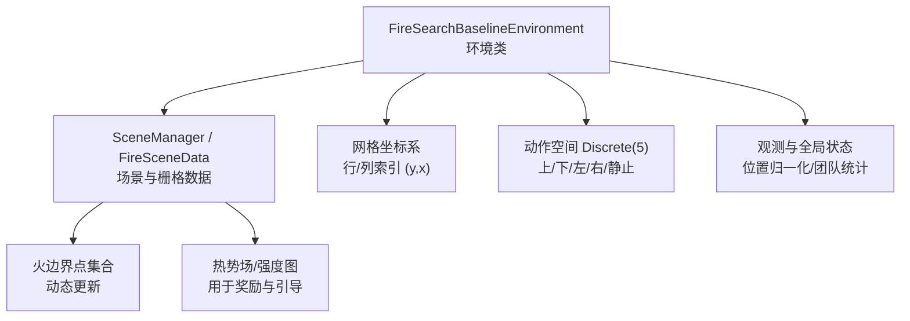
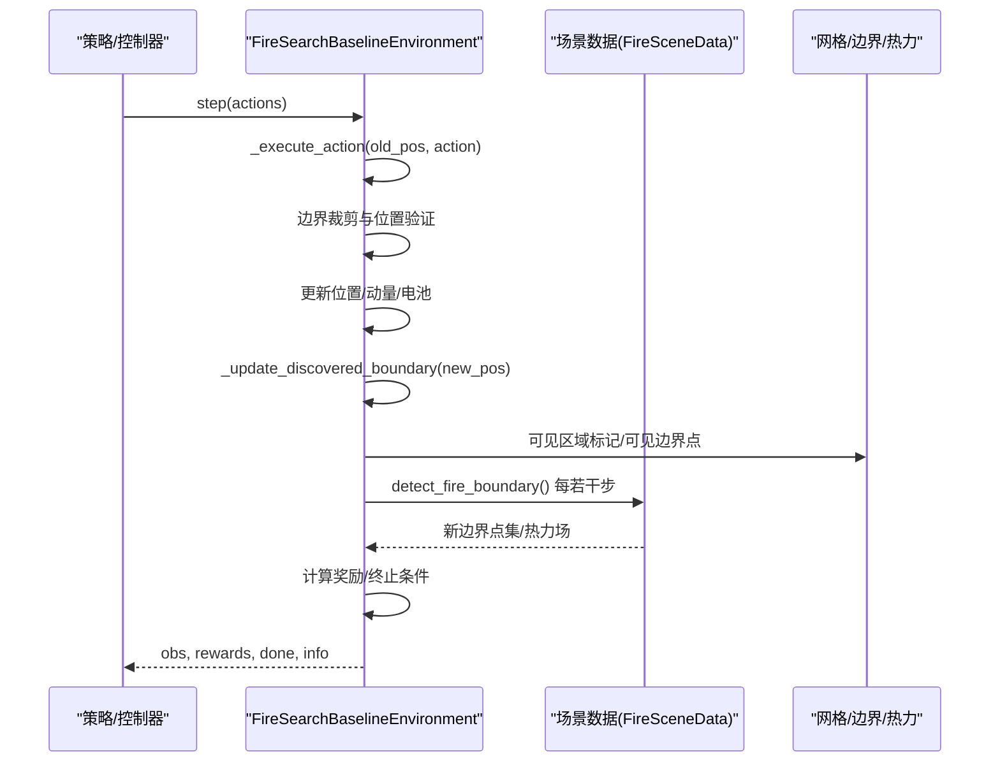
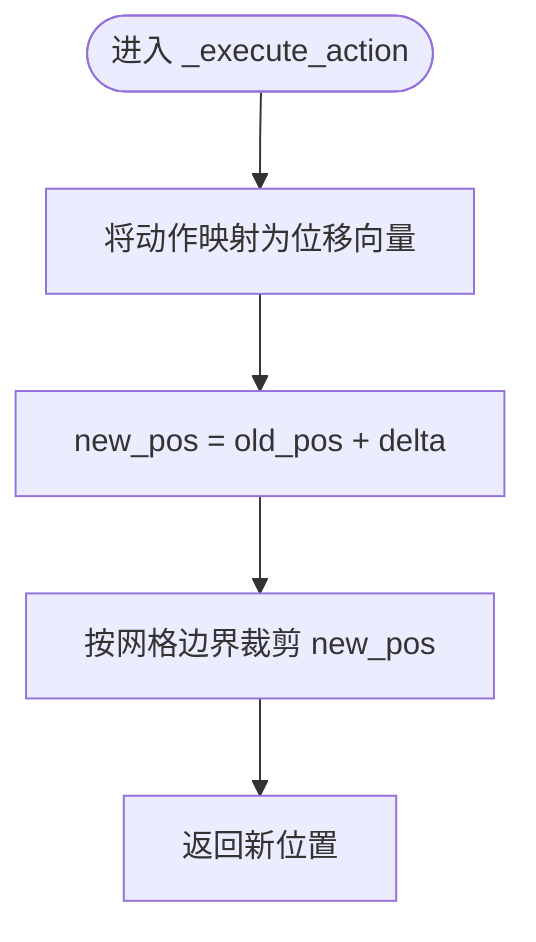
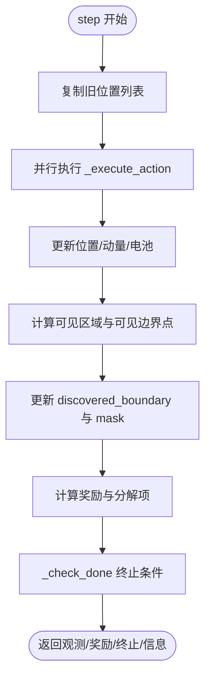
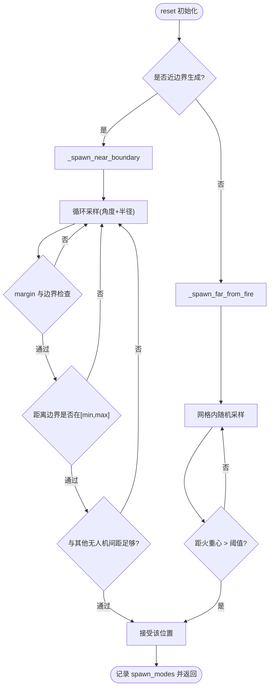
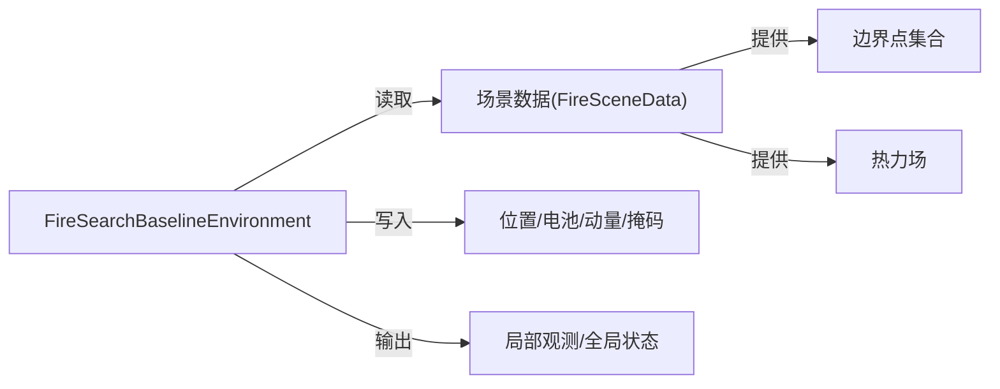

# 无人机位置跟踪系统

<cite>
**本文引用的文件**   
- [rl_environment_baseline.py](file://environment_variables/environment_variables/rl_environment_baseline.py)
- [信息转换.py](file://environment_variables/environment_variables/信息转换.py)
</cite>

## 目录
1. [简介](#简介)
2. [项目结构](#项目结构)
3. [核心组件](#核心组件)
4. [架构总览](#架构总览)
5. [详细组件分析](#详细组件分析)
6. [依赖关系分析](#依赖关系分析)
7. [性能考量](#性能考量)
8. [故障排查指南](#故障排查指南)
9. [结论](#结论)
10. [附录](#附录)

## 简介
本文件面向“无人机位置跟踪系统”，聚焦以下目标：
- 坐标系统与网格定义、边界约束与移动限制规则
- 位置更新算法：动作到位移向量的映射、边界裁剪与位置验证
- 初始位置生成策略：近边界与远端生成的概率控制、随机采样与碰撞避免
- 位置状态的数据结构与存储方式
- 位置相关的观测特征计算与全局状态中的位置编码

该系统基于离散网格环境，采用多智能体（多无人机）强化学习接口，提供局部观测与全局状态。位置在二维网格坐标系中表示，支持视域半径、边界发现、热势场等与环境数据的耦合。

## 项目结构
与位置跟踪直接相关的核心代码位于两个模块：
- 环境与交互逻辑：rl_environment_baseline.py
- 场景数据与地理栅格处理：信息转换.py

图表来源
- [rl_environment_baseline.py:21-157](file://environment_variables/environment_variables/rl_environment_baseline.py#L21-L157)
- [信息转换.py:753-820](file://environment_variables/environment_variables/信息转换.py#L753-L820)

章节来源
- [rl_environment_baseline.py:21-157](file://environment_variables/environment_variables/rl_environment_baseline.py#L21-L157)
- [信息转换.py:1-200](file://environment_variables/environment_variables/信息转换.py#L1-L200)

## 核心组件
- 环境类 FireSearchBaselineEnvironment：封装网格、边界、无人机位置、电池、动量、观测与奖励计算、步进流程。
- 场景数据模块（信息转换.py）：提供火边界检测、热势场计算、风场与地形等栅格数据访问。

关键职责划分：
- 位置与运动：由环境类维护并执行；边界与地图由场景数据模块提供。
- 观测与全局状态：环境类聚合位置、电池、团队中心与扩散等信息。
- 边界与热力：场景数据模块负责从栅格中推导边界与热势场，环境类周期性刷新。

章节来源
- [rl_environment_baseline.py:21-157](file://environment_variables/environment_variables/rl_environment_baseline.py#L21-L157)
- [信息转换.py:753-820](file://environment_variables/environment_variables/信息转换.py#L753-L820)

## 架构总览
下图展示位置跟踪相关的关键调用链与数据流：

图表来源
- [rl_environment_baseline.py:841-992](file://environment_variables/environment_variables/rl_environment_baseline.py#L841-L992)
- [rl_environment_baseline.py:659-669](file://environment_variables/environment_variables/rl_environment_baseline.py#L659-L669)
- [rl_environment_baseline.py:807-822](file://environment_variables/environment_variables/rl_environment_baseline.py#L807-L822)
- [信息转换.py:753-820](file://environment_variables/environment_variables/信息转换.py#L753-L820)

## 详细组件分析

### 坐标系统与网格定义
- 坐标系：二维离散网格，使用行/列索引 (y, x)，其中 y 为行号，x 为列号。
- 网格尺寸：grid_size = (H, W)，来源于场景数据 shape。
- 边界点：boundary_points 为 List[Tuple[int,int]]，表示火边界上的网格单元。
- 边界集合：_boundary_set 用于 O(1) 判断某单元格是否为边界。
- 视野窗口：以当前位置为中心、半径为 vision_radius 的圆形区域，通过掩码 local_mask 标识可见单元格。

章节来源
- [rl_environment_baseline.py:172-196](file://environment_variables/environment_variables/rl_environment_baseline.py#L172-L196)
- [rl_environment_baseline.py:259-267](file://environment_variables/environment_variables/rl_environment_baseline.py#L259-L267)
- [信息转换.py:753-820](file://environment_variables/environment_variables/信息转换.py#L753-L820)

### 边界约束机制与移动限制规则
- 动作空间：Discrete(5)，分别对应上、下、左、右、静止。
- 位移向量映射：每个动作映射为一个单位位移向量或零向量。
- 边界裁剪：新位置按 grid_size 进行 clip，确保始终落在 [0, H-1] × [0, W-1] 范围内。
- 移动限制：仅允许四邻域移动或原地不动；对角线移动不被允许。
- 碰撞避免：初始化时保证与其他无人机最小间距；运行时对过近距离施加惩罚，但不阻止移动。

图表来源
- [rl_environment_baseline.py:659-669](file://environment_variables/environment_variables/rl_environment_baseline.py#L659-L669)

章节来源
- [rl_environment_baseline.py:659-669](file://environment_variables/environment_variables/rl_environment_baseline.py#L659-L669)
- [rl_environment_baseline.py:417-419](file://environment_variables/environment_variables/rl_environment_baseline.py#L417-L419)

### 位置更新算法与位置验证
- 步进流程：step(actions) 批量执行各无人机的动作，记录旧位置，计算新位置，更新状态。
- 位置验证：
  - 边界裁剪已在 _execute_action 内完成，保证位置合法。
  - 可见性判定：根据 vision_radius 计算可见边界点集合，用于奖励与覆盖统计。
  - 已发现边界更新：将可见且未发现的边界点加入 discovered_boundary，并标记 confirmed_boundary_mask。
- 电池消耗：若发生移动则按基础能耗加上风阻影响；静止也有少量能耗。
- 动量更新：记录当前步位移作为动量，供观测使用。

图表来源
- [rl_environment_baseline.py:841-992](file://environment_variables/environment_variables/rl_environment_baseline.py#L841-L992)
- [rl_environment_baseline.py:807-822](file://environment_variables/environment_variables/rl_environment_baseline.py#L807-L822)

章节来源
- [rl_environment_baseline.py:841-992](file://environment_variables/environment_variables/rl_environment_baseline.py#L841-L992)
- [rl_environment_baseline.py:807-822](file://environment_variables/environment_variables/rl_environment_baseline.py#L807-L822)

### 初始位置生成策略
- 选择策略：训练模式下，按课程阶段概率选择“近边界”或“远端”生成。
  - 近边界概率：阶段1=0.70，阶段2=0.50，阶段3=可配置 stage3_near_prob。
- 近边界生成：
  - 从 boundary_points 中随机选取一个参考点，沿随机角度与半径采样偏移，取整后得到候选位置。
  - 距离约束：根据课程阶段设置 min_dist/max_dist 范围，确保离边界有一定距离。
  - 边界外切：使用 margin 防止贴边太近。
  - 碰撞避免：检查与其他无人机最小间距，不满足则重试。
  - 最多尝试固定次数，失败则回退到远端生成。
- 远端生成：
  - 在网格内部随机采样，要求距火重心 fire_centroid 大于阈值（与 vision_radius 相关）。
  - 同样受 margin 约束。

图表来源
- [rl_environment_baseline.py:362-436](file://environment_variables/environment_variables/rl_environment_baseline.py#L362-L436)
- [rl_environment_baseline.py:373-415](file://environment_variables/environment_variables/rl_environment_baseline.py#L373-L415)

章节来源
- [rl_environment_baseline.py:362-436](file://environment_variables/environment_variables/rl_environment_baseline.py#L362-L436)
- [rl_environment_baseline.py:373-415](file://environment_variables/environment_variables/rl_environment_baseline.py#L373-L415)

### 位置状态的数据结构与存储方式
- 无人机位置：drone_positions: List[np.ndarray]，每个元素为形状 (2,) 的浮点数组，表示 (y, x)。
- 电池电量：drone_batteries: List[float]，随移动与风阻递减。
- 动量：drone_momentums: List[np.ndarray]，记录最近一步位移。
- 已访问单元格：visited_cells: set，用于探索奖励与重复惩罚。
- 已发现边界：discovered_boundary: set，用于覆盖率统计与任务终止。
- 确认边界掩码：confirmed_boundary_mask: np.zeros(grid_size, dtype=bool)，用于刷新已发现集合。
- 可见区域掩码：discovered_area_mask: np.zeros(grid_size, dtype=bool)，用于面积增益奖励。

章节来源
- [rl_environment_baseline.py:133-148](file://environment_variables/environment_variables/rl_environment_baseline.py#L133-L148)
- [rl_environment_baseline.py:807-822](file://environment_variables/environment_variables/rl_environment_baseline.py#L807-L822)

### 位置相关的观测特征与全局状态编码
- 局部观测（每架无人机）：
  - 位置归一化：pos[0]/H, pos[1]/W
  - 电池归一化：battery/max_battery
  - 本地热信号与风向风速、DEM、坡度等标准化特征
  - 热梯度方向、动量、相机指向（朝向火源方向）
  - 可选扩展特征：静态地形、动态前沿、风险感知等
- 全局状态（集中式）：
  - 覆盖率、平均/最低电池、团队中心与扩散、平均距火距离、时间进度、已访问密度、课程阶段、平均风速/高程、低电量指示、无人机数量、覆盖率梯度、未探索密度等。

章节来源
- [rl_environment_baseline.py:565-658](file://environment_variables/environment_variables/rl_environment_baseline.py#L565-L658)

### 边界检测与热力场更新
- 边界检测：detect_fire_boundary 基于 intensity 与 time 等栅格，结合阈值与面积百分比策略，输出 t 时刻的边界点集合。
- 热力场：_compute_thermal_field 基于当前火区二值图与强度图，经高斯平滑与缩放得到热势场，用于奖励与搜索引导。
- 周期更新：每若干步（如 20 步）重新检测边界并更新热力场，同时刷新已确认边界集合。

章节来源
- [信息转换.py:753-820](file://environment_variables/environment_variables/信息转换.py#L753-L820)
- [rl_environment_baseline.py:927-941](file://environment_variables/environment_variables/rl_environment_baseline.py#L927-L941)

## 依赖关系分析
- 环境类依赖场景数据模块获取边界点、热力场、风场与地形等栅格数据。
- 位置更新与奖励计算强依赖边界集合与热力场，二者由场景数据模块周期性刷新。
- 观测与全局状态聚合了位置、电池、团队统计与环境特征，形成 RL 输入。

图表来源
- [rl_environment_baseline.py:159-188](file://environment_variables/environment_variables/rl_environment_baseline.py#L159-L188)
- [信息转换.py:753-820](file://environment_variables/environment_variables/信息转换.py#L753-L820)

章节来源
- [rl_environment_baseline.py:159-188](file://environment_variables/environment_variables/rl_environment_baseline.py#L159-L188)
- [信息转换.py:753-820](file://environment_variables/environment_variables/信息转换.py#L753-L820)

## 性能考量
- 可见区域计算使用圆形窗口掩码与布尔矩阵切片，复杂度与视野面积成正比，适合中等 vision_radius。
- 边界点可见性检查遍历所有边界点，建议保持 boundary_points 规模可控或在大规模场景中采用空间索引。
- 热力场缓存与降采样策略可减少重复计算开销。
- 电池与动量更新为常数时间操作，整体步进复杂度主要受边界与热力计算影响。

## 故障排查指南
- 无有效边界点：当 boundary_points 为空时，近边界生成会返回 None，需回退到远端生成；检查场景数据加载与边界检测参数。
- 位置越界：若出现越界，检查 _execute_action 的裁剪逻辑与 grid_size 是否正确。
- 碰撞频繁：若无人机过于靠近，检查 _too_close_to_existing_drones 的最小间距阈值与初始化重试次数。
- 热力场缺失：若热力场未初始化，检查 _compute_thermal_field 的前置条件（fire_binary_map 与 intensity 是否存在）。

章节来源
- [rl_environment_baseline.py:379-415](file://environment_variables/environment_variables/rl_environment_baseline.py#L379-L415)
- [rl_environment_baseline.py:659-669](file://environment_variables/environment_variables/rl_environment_baseline.py#L659-L669)
- [信息转换.py:753-766](file://environment_variables/environment_variables/信息转换.py#L753-L766)

## 结论
本位置跟踪系统在离散网格坐标系下实现了清晰的动作-位移映射、严格的边界裁剪与位置验证，并通过近/远端混合的初始位置生成策略提升探索效率。位置状态以列表与掩码形式高效存储，观测与全局状态对位置进行了归一化与聚合编码，便于强化学习策略学习。边界与热力场的周期性更新保证了环境的动态性与奖励信号的稳定性。

## 附录
- 术语说明：
  - 网格坐标系：(y, x) 行/列索引
  - 视域半径：vision_radius，决定可见区域大小
  - 边界点：boundary_points，火边界上的网格单元集合
  - 热力场：thermal_field，用于奖励与搜索引导的平滑热势分布