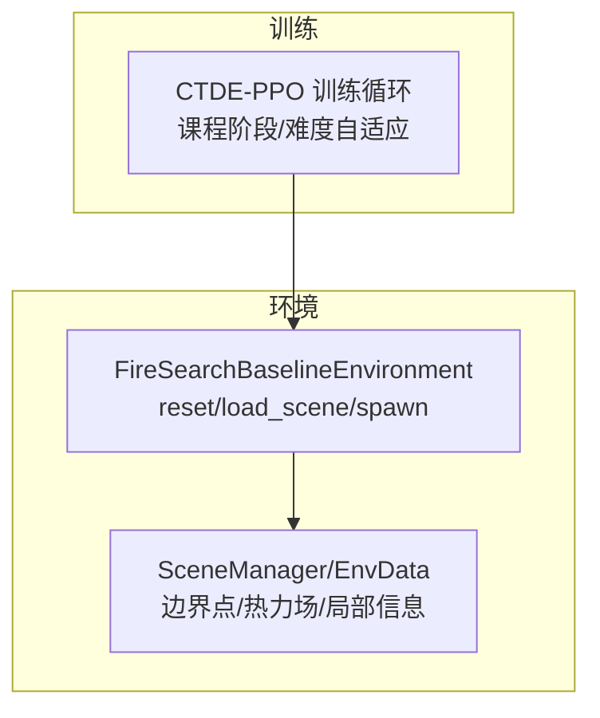
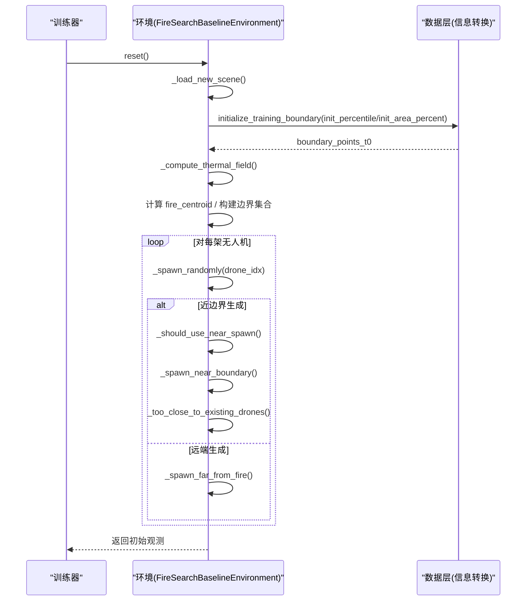
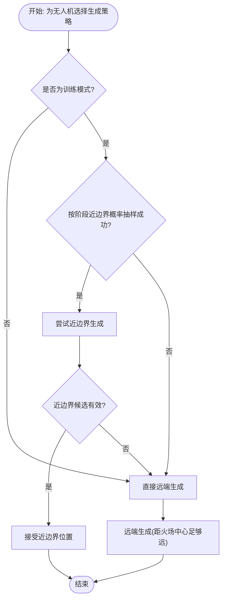
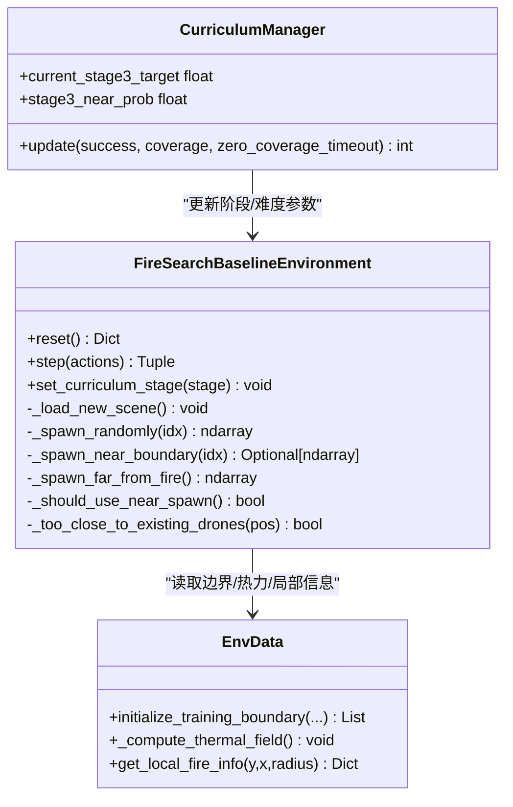

# 无人机初始化系统

<cite>
**本文引用的文件**   
- [rl_environment_baseline.py](file://environment_variables/environment_variables/rl_environment_baseline.py)
- [ctde_ppo_baseline_train.py](file://environment_variables/environment_variables/ctde_ppo_baseline_train.py)
- [信息转换.py](file://environment_variables/environment_variables/信息转换.py)
</cite>

## 目录
1. [引言](#引言)
2. [项目结构](#项目结构)
3. [核心组件](#核心组件)
4. [架构总览](#架构总览)
5. [详细组件分析](#详细组件分析)
6. [依赖关系分析](#依赖关系分析)
7. [性能考量](#性能考量)
8. [故障排查指南](#故障排查指南)
9. [结论](#结论)

## 引言
本文件面向“无人机初始化系统”，围绕环境重置、状态清理与参数配置流程，深入解析近边界生成策略（概率控制、距离范围、角度均匀分布）、远端生成机制（与火场中心距离约束、边界安全距离检查、碰撞避免），以及不同课程学习阶段的难度递增调整。同时说明初始化失败的处理与重试逻辑，帮助读者快速理解并正确使用该系统的初始化能力。

## 项目结构
本项目为多无人机火灾边界搜索的强化学习环境基线实现，包含：
- 环境类：负责场景加载、边界点管理、无人机随机生成、观测与奖励计算等
- 训练器：负责课程学习阶段切换、难度自适应与超参更新
- 数据层：负责从栅格数据中构建火场边界、热力场与局部信息

图表来源
- [rl_environment_baseline.py:159-188](file://environment_variables/environment_variables/rl_environment_baseline.py#L159-L188)
- [ctde_ppo_baseline_train.py:1523-1581](file://environment_variables/environment_variables/ctde_ppo_baseline_train.py#L1523-L1581)
- [信息转换.py:822-849](file://environment_variables/environment_variables/信息转换.py#L822-L849)

章节来源
- [rl_environment_baseline.py:159-188](file://environment_variables/environment_variables/rl_environment_baseline.py#L159-L188)
- [ctde_ppo_baseline_train.py:1523-1581](file://environment_variables/environment_variables/ctde_ppo_baseline_train.py#L1523-L1581)
- [信息转换.py:822-849](file://environment_variables/environment_variables/信息转换.py#L822-L849)

## 核心组件
- 环境类 FireSearchBaselineEnvironment
  - 负责场景加载、边界点集合构建、无人机位置/电池/动量等状态重置
  - 提供近边界与远端两种随机生成策略，支持按课程阶段调整难度
- 训练器 CTDE-PPO 训练循环
  - 根据成功率、覆盖率、零覆盖率超时率等指标动态调整课程阶段与难度参数
  - 将新的难度参数回写至环境实例，影响后续 reset 的生成策略
- 数据层 信息转换模块
  - 基于时间序列栅格选择特定时刻的火场二值图，提取边界点并计算热力场

章节来源
- [rl_environment_baseline.py:331-371](file://environment_variables/environment_variables/rl_environment_baseline.py#L331-L371)
- [rl_environment_baseline.py:379-436](file://environment_variables/environment_variables/rl_environment_baseline.py#L379-L436)
- [ctde_ppo_baseline_train.py:1523-1581](file://environment_variables/environment_variables/ctde_ppo_baseline_train.py#L1523-L1581)
- [信息转换.py:822-849](file://environment_variables/environment_variables/信息转换.py#L822-L849)

## 架构总览
初始化流程的关键路径如下：
- 训练器调用环境的 reset
- 环境执行 _load_new_scene，加载场景并初始化边界点与热力场
- 环境遍历每架无人机，调用 _spawn_randomly 决定近边界或远端生成
- 近边界生成使用角度均匀分布与分阶段距离范围；远端生成以火场中心为参考进行距离约束
- 所有候选位置需通过边界安全距离与无人机间最小间距检查

图表来源
- [rl_environment_baseline.py:331-371](file://environment_variables/environment_variables/rl_environment_baseline.py#L331-L371)
- [rl_environment_baseline.py:379-436](file://environment_variables/environment_variables/rl_environment_baseline.py#L379-L436)
- [信息转换.py:822-849](file://environment_variables/environment_variables/信息转换.py#L822-L849)

## 详细组件分析

### 环境重置与状态清理
- 场景加载
  - 依据模式或固定场景键加载场景，调用数据层的接口初始化 t=0 的边界点，并计算热力场
  - 若存在边界点则计算火场质心，否则退化为地图中心
- 状态清理
  - 重置步数、已访问网格、已发现边界/前沿、可见区域掩码、确认边界掩码、近期移动轨迹等
  - 清空回合奖励分解字典，重置每架无人机的位置、电池电量与动量
- 参数配置
  - 根据是否启用元数据 UAV 参数，动态设置视野半径与最大步数，并据此计算最大电池容量

章节来源
- [rl_environment_baseline.py:159-188](file://environment_variables/environment_variables/rl_environment_baseline.py#L159-L188)
- [rl_environment_baseline.py:331-360](file://environment_variables/environment_variables/rl_environment_baseline.py#L331-L360)
- [rl_environment_baseline.py:198-207](file://environment_variables/environment_variables/rl_environment_baseline.py#L198-L207)

### 随机生成策略总览
- 决策入口
  - 每架无人机由 _spawn_randomly 统一调度
  - 训练模式下，根据当前课程阶段与近边界概率决定是否优先尝试近边界生成
- 近边界生成
  - 从边界点集中随机采样一个基准点，采用角度均匀分布与分阶段距离范围生成偏移，得到候选位置
  - 校验边界安全距离与无人机间最小间距，满足条件即接受
- 远端生成
  - 在地图范围内随机采样，要求与火场中心的距离大于阈值，作为兜底策略

图表来源
- [rl_environment_baseline.py:362-377](file://environment_variables/environment_variables/rl_environment_baseline.py#L362-L377)
- [rl_environment_baseline.py:379-436](file://environment_variables/environment_variables/rl_environment_baseline.py#L379-L436)

#### 近边界生成的概率控制
- 仅在训练模式下生效
- 不同课程阶段对应不同的近边界概率：
  - 阶段1：较高概率
  - 阶段2：中等概率
  - 阶段3：由训练器动态更新的 stage3_near_prob 控制
- 若近边界生成失败（例如无可用边界点或多次尝试未通过校验），自动回退到远端生成

章节来源
- [rl_environment_baseline.py:373-377](file://environment_variables/environment_variables/rl_environment_baseline.py#L373-L377)
- [ctde_ppo_baseline_train.py:1523-1581](file://environment_variables/environment_variables/ctde_ppo_baseline_train.py#L1523-L1581)

#### 近边界生成的距离范围与角度分布
- 角度分布
  - 在 [0, 2π] 上均匀采样，确保方向上的均匀性
- 距离范围
  - 随课程阶段递增而扩大：
    - 阶段1：靠近边界（较小半径）
    - 阶段2：中等半径
    - 阶段3：更大半径
- 边界安全距离
  - 候选位置必须位于地图内部的安全边距内，且与所选边界点的实际距离落在允许区间内

章节来源
- [rl_environment_baseline.py:379-415](file://environment_variables/environment_variables/rl_environment_baseline.py#L379-L415)

#### 碰撞避免与最小间距
- 无人机间最小间距
  - 候选位置与已有无人机位置的最小欧氏距离不得小于阈值（与视野半径相关）
- 重复尝试上限
  - 近边界生成最多尝试固定次数，超过后返回空，触发远端生成

章节来源
- [rl_environment_baseline.py:417-419](file://environment_variables/environment_variables/rl_environment_baseline.py#L417-L419)
- [rl_environment_baseline.py:396-415](file://environment_variables/environment_variables/rl_environment_baseline.py#L396-L415)

#### 远端生成机制
- 与火场中心的距离约束
  - 候选位置与火场质心的距离必须大于阈值（与视野半径相关）
- 边界安全距离
  - 同样需要满足地图内部的安全边距
- 兜底策略
  - 若多次尝试仍未满足条件，返回默认位置（地图中心附近）

章节来源
- [rl_environment_baseline.py:421-436](file://environment_variables/environment_variables/rl_environment_baseline.py#L421-L436)

### 课程学习阶段的初始化差异
- 近边界概率
  - 阶段1/2/3 分别对应不同的近边界概率，阶段3的概率由训练器动态调整
- 近边界距离范围
  - 随阶段递增逐步放宽，鼓励更远距离的探索
- 目标覆盖率与终止条件
  - 阶段1：达到少量边界点即完成
  - 阶段2/3：达到相应目标覆盖率才完成
- 训练器反馈
  - 根据成功率、覆盖率、零覆盖率超时率等指标，动态提升阶段3的目标覆盖率与近边界概率，从而改变下一轮 reset 的生成策略

章节来源
- [rl_environment_baseline.py:373-377](file://environment_variables/environment_variables/rl_environment_baseline.py#L373-L377)
- [rl_environment_baseline.py:824-840](file://environment_variables/environment_variables/rl_environment_baseline.py#L824-L840)
- [ctde_ppo_baseline_train.py:1523-1581](file://environment_variables/environment_variables/ctde_ppo_baseline_train.py#L1523-L1581)

### 初始化失败处理与重试逻辑
- 近边界生成失败
  - 当边界点为空或多次尝试均不满足边界安全距离与最小间距时，返回空
  - 上层 _spawn_randomly 检测到空结果后，自动切换到远端生成
- 远端生成失败
  - 多次尝试仍无法满足距离约束时，返回默认位置（地图中心附近）
- 整体健壮性
  - 通过“近边界优先 + 远端兜底”的策略，保证每次 reset 都能为每架无人机分配合法初始位置

章节来源
- [rl_environment_baseline.py:362-371](file://environment_variables/environment_variables/rl_environment_baseline.py#L362-L371)
- [rl_environment_baseline.py:379-436](file://environment_variables/environment_variables/rl_environment_baseline.py#L379-L436)

## 依赖关系分析
- 环境类依赖数据层提供的边界点与热力场
- 训练器与环境双向交互：训练器更新课程阶段与难度参数，环境在 reset 时应用这些参数
- 数据层负责从栅格数据中选择合适时刻的火场二值图并提取边界点

图表来源
- [rl_environment_baseline.py:331-371](file://environment_variables/environment_variables/rl_environment_baseline.py#L331-L371)
- [ctde_ppo_baseline_train.py:1523-1581](file://environment_variables/environment_variables/ctde_ppo_baseline_train.py#L1523-L1581)
- [信息转换.py:822-849](file://environment_variables/environment_variables/信息转换.py#L822-L849)

章节来源
- [rl_environment_baseline.py:331-371](file://environment_variables/environment_variables/rl_environment_baseline.py#L331-L371)
- [ctde_ppo_baseline_train.py:1523-1581](file://environment_variables/environment_variables/ctde_ppo_baseline_train.py#L1523-L1581)
- [信息转换.py:822-849](file://environment_variables/environment_variables/信息转换.py#L822-L849)

## 性能考量
- 近边界生成尝试次数限制
  - 固定上限避免长时间阻塞，失败时快速回退到远端生成
- 距离与角度采样
  - 角度均匀分布简单高效；距离范围按阶段线性缩放，便于控制探索强度
- 碰撞避免
  - 最小间距检查为 O(n)，n 为无人机数量，通常较小，开销可控
- 热力场与边界点更新
  - 每隔若干步更新一次边界点与热力场，平衡精度与效率

[本节为通用指导，无需具体文件引用]

## 故障排查指南
- 初始化位置异常
  - 检查边界点是否为空：若为空，近边界生成会直接失败，系统将回退到远端生成
  - 检查地图尺寸与安全边距：候选位置必须在地图内部安全区域内
- 无人机重叠
  - 若最小间距阈值过小，可能导致碰撞避免失败，适当增大阈值
- 课程阶段不生效
  - 确认训练器是否正确调用 set_curriculum_stage 并更新了 stage3_near_prob 与目标覆盖率
  - 观察训练日志中的课程阶段切换与难度参数变化

章节来源
- [rl_environment_baseline.py:379-436](file://environment_variables/environment_variables/rl_environment_baseline.py#L379-L436)
- [ctde_ppo_baseline_train.py:1523-1581](file://environment_variables/environment_variables/ctde_ppo_baseline_train.py#L1523-L1581)

## 结论
无人机初始化系统通过“近边界优先 + 远端兜底”的策略，结合课程学习阶段的难度递增，实现了稳定且可调节的初始位置生成。近边界生成采用角度均匀分布与分阶段距离范围，配合边界安全距离与无人机间最小间距检查，保证了初始位置的合理性与安全性。训练器根据任务表现动态调整课程阶段与难度参数，使系统在训练过程中逐步提升挑战度，最终获得更强的边界搜索能力。