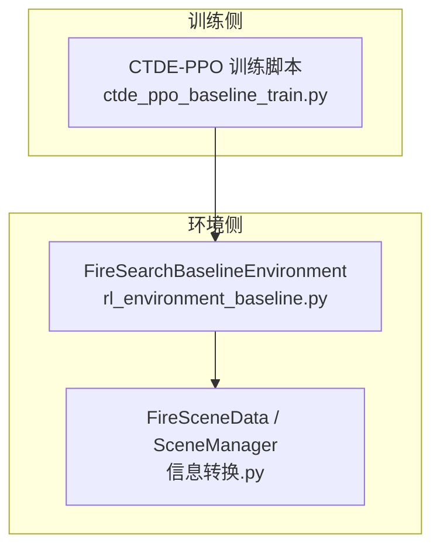
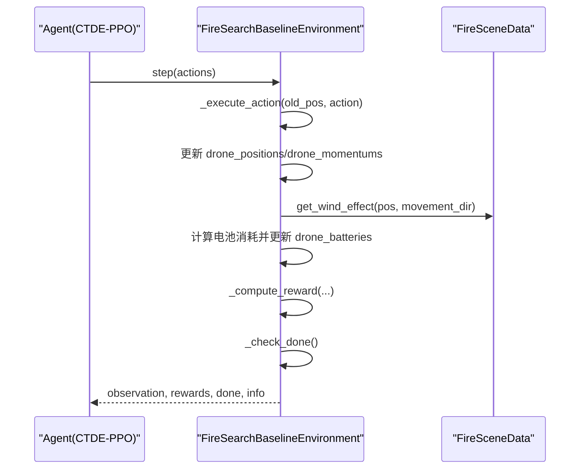
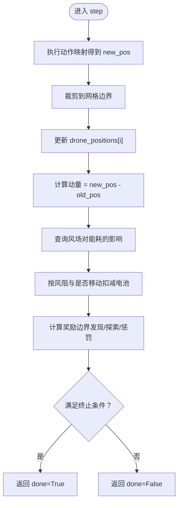
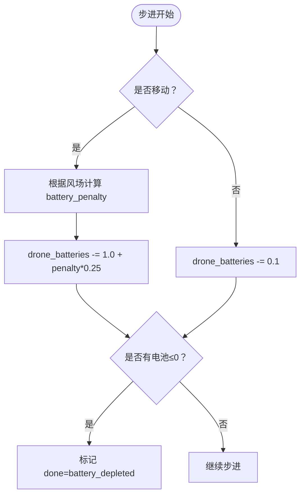
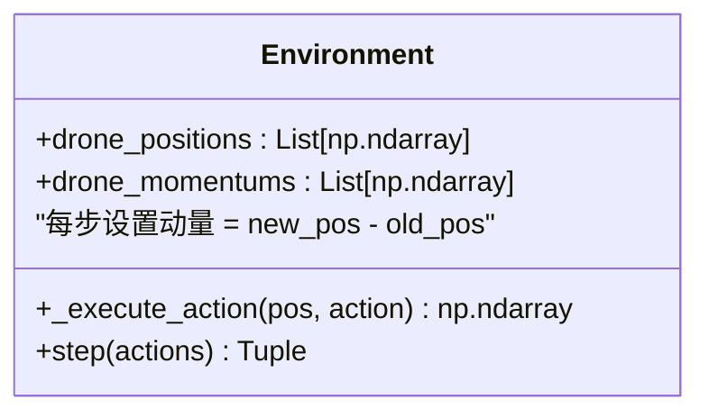
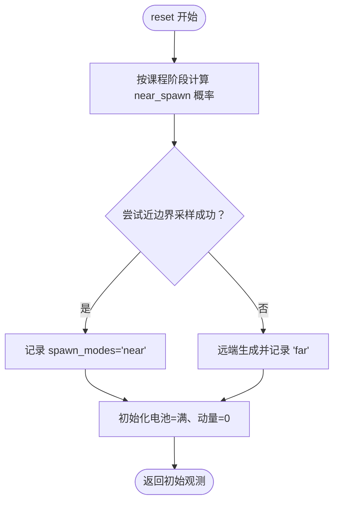
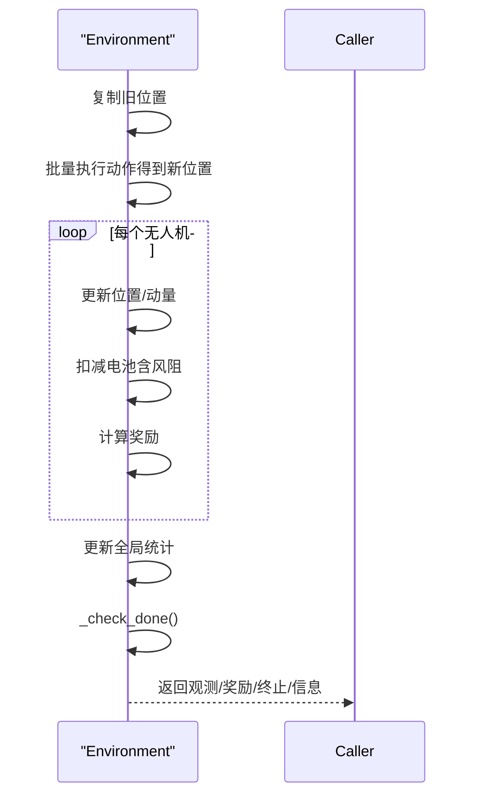
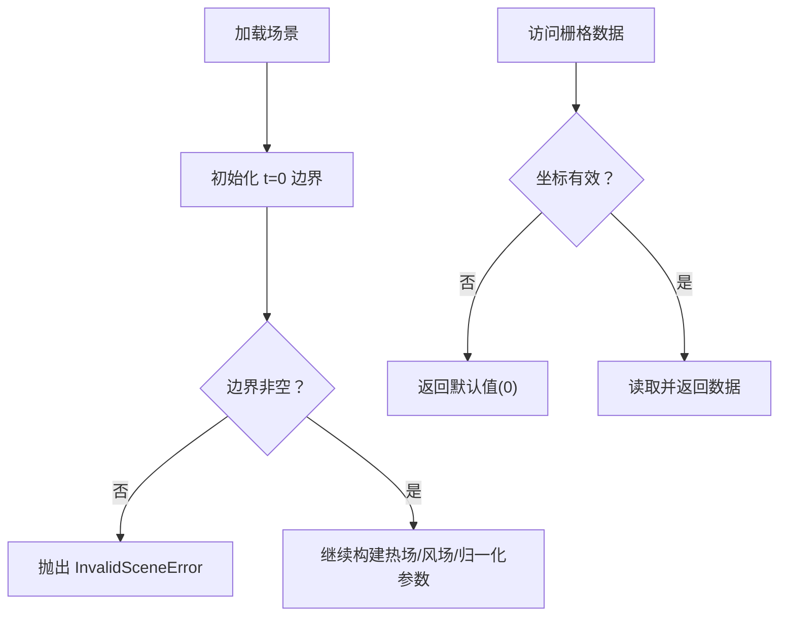

# 无人机状态管理

<cite>
**本文引用的文件**   
- [rl_environment_baseline.py](file://environment_variables/environment_variables/rl_environment_baseline.py)
- [ctde_ppo_baseline_train.py](file://environment_variables/environment_variables/ctde_ppo_baseline_train.py)
- [信息转换.py](file://environment_variables/environment_variables/信息转换.py)
</cite>

## 目录
1. [简介](#简介)
2. [项目结构](#项目结构)
3. [核心组件](#核心组件)
4. [架构总览](#架构总览)
5. [详细组件分析](#详细组件分析)
6. [依赖关系分析](#依赖关系分析)
7. [性能与复杂度](#性能与复杂度)
8. [故障排查指南](#故障排查指南)
9. [结论](#结论)

## 简介
本文件围绕多无人机状态管理系统，系统性阐述以下能力：
- 位置跟踪机制：坐标系统、边界约束与移动限制
- 电池管理系统：电量消耗模型、充电策略与低电量警告
- 动量控制系统：惯性模拟、方向保持与运动平滑
- 初始化过程：随机生成策略、近边界与远端生成的概率控制
- 时序控制与同步：状态更新时序、终止条件与全局观测
- 状态验证与异常处理：场景有效性检查、越界保护与错误传播

## 项目结构
本项目包含训练脚本与环境实现。环境负责多无人机的状态演化（位置、动量、电池）、奖励计算与观测输出；数据模块负责场景加载、热场构建、风场与归一化参数等。

图表来源
- [ctde_ppo_baseline_train.py:1-120](file://environment_variables/environment_variables/ctde_ppo_baseline_train.py#L1-L120)
- [rl_environment_baseline.py:1-120](file://environment_variables/environment_variables/rl_environment_baseline.py#L1-L120)
- [信息转换.py:1282-1327](file://environment_variables/environment_variables/信息转换.py#L1282-L1327)

章节来源
- [ctde_ppo_baseline_train.py:1-120](file://environment_variables/environment_variables/ctde_ppo_baseline_train.py#L1-L120)
- [rl_environment_baseline.py:1-120](file://environment_variables/environment_variables/rl_environment_baseline.py#L1-L120)
- [信息转换.py:1282-1327](file://environment_variables/environment_variables/信息转换.py#L1282-L1327)

## 核心组件
- FireSearchBaselineEnvironment：封装多无人机仿真环境，提供 reset/step、动作执行、奖励计算、观测构造、终止判定等。
- FireSceneData/SceneManager：场景数据加载、边界提取、热场/导航场构建、风场与归一化参数、局部信息接口。
- CTDE-PPO 训练脚本：配置、课程学习、训练循环与评估。

章节来源
- [rl_environment_baseline.py:21-158](file://environment_variables/environment_variables/rl_environment_baseline.py#L21-L158)
- [信息转换.py:219-322](file://environment_variables/environment_variables/信息转换.py#L219-L322)
- [ctde_ppo_baseline_train.py:98-158](file://environment_variables/environment_variables/ctde_ppo_baseline_train.py#L98-L158)

## 架构总览
下图展示一次 step 的调用链路与关键状态流转。

图表来源
- [rl_environment_baseline.py:842-915](file://environment_variables/environment_variables/rl_environment_baseline.py#L842-L915)
- [rl_environment_baseline.py:660-669](file://environment_variables/environment_variables/rl_environment_baseline.py#L660-L669)
- [信息转换.py:1125-1165](file://environment_variables/environment_variables/信息转换.py#L1125-L1165)

## 详细组件分析

### 位置跟踪机制
- 坐标系统与网格
  - 环境使用二维离散网格坐标 (row, col)，范围由场景栅格尺寸决定。
  - 所有位置在动作执行后通过裁剪保证不越界。
- 边界约束与移动限制
  - 动作空间为离散五向（上、下、左、右、静止），新位置按动作向量加到当前位置，再裁剪至 [0, H-1]×[0, W-1]。
  - 视野半径用于可见区域与边界点检测，影响观测与奖励。
- 可见性与边界发现
  - 基于欧氏距离判断边界点是否在视野内，维护已发现边界集合与覆盖率。

图表来源
- [rl_environment_baseline.py:660-669](file://environment_variables/environment_variables/rl_environment_baseline.py#L660-L669)
- [rl_environment_baseline.py:842-915](file://environment_variables/environment_variables/rl_environment_baseline.py#L842-L915)
- [信息转换.py:1125-1165](file://environment_variables/environment_variables/信息转换.py#L1125-L1165)

章节来源
- [rl_environment_baseline.py:660-669](file://environment_variables/environment_variables/rl_environment_baseline.py#L660-L669)
- [rl_environment_baseline.py:842-915](file://environment_variables/environment_variables/rl_environment_baseline.py#L842-L915)
- [信息转换.py:1125-1165](file://environment_variables/environment_variables/信息转换.py#L1125-L1165)

### 电池管理系统
- 电量消耗模型
  - 若发生位移：基础消耗 + 风阻附加项（与风速和风向夹角相关）。
  - 若静止：固定较小消耗。
  - 最大电量 max_battery 与最大步数成比例，随场景或配置调整。
- 充电策略
  - 当前实现未包含充电逻辑；能量仅递减，无恢复。
- 低电量警告与终止
  - 当任意无人机电池 ≤ 0 时，episode 终止并标记“电池耗尽”。
  - 全局状态中包含最低电池比率与“是否存在低电量”标志位，供策略参考。

图表来源
- [rl_environment_baseline.py:842-915](file://environment_variables/environment_variables/rl_environment_baseline.py#L842-L915)
- [rl_environment_baseline.py:824-840](file://environment_variables/environment_variables/rl_environment_baseline.py#L824-L840)
- [信息转换.py:1125-1165](file://environment_variables/environment_variables/信息转换.py#L1125-L1165)

章节来源
- [rl_environment_baseline.py:842-915](file://environment_variables/environment_variables/rl_environment_baseline.py#L842-L915)
- [rl_environment_baseline.py:824-840](file://environment_variables/environment_variables/rl_environment_baseline.py#L824-L840)
- [信息转换.py:1125-1165](file://environment_variables/environment_variables/信息转换.py#L1125-L1165)

### 动量控制系统
- 惯性模拟
  - 每步将动量设为“本次位移向量”，即上一时刻到新位置的差值，作为瞬时速度表征。
- 方向保持与运动平滑
  - 当前未引入阻尼或速度衰减，动量直接等于位移，体现“零惯性”的运动学。
  - 可通过在后续扩展中引入指数衰减或目标速度平滑来增强稳定性。
- 观测中的动量特征
  - 本地观测包含动量的两个分量，便于策略感知当前运动趋势。

图表来源
- [rl_environment_baseline.py:842-915](file://environment_variables/environment_variables/rl_environment_baseline.py#L842-L915)
- [rl_environment_baseline.py:565-612](file://environment_variables/environment_variables/rl_environment_baseline.py#L565-L612)

章节来源
- [rl_environment_baseline.py:842-915](file://environment_variables/environment_variables/rl_environment_baseline.py#L842-L915)
- [rl_environment_baseline.py:565-612](file://environment_variables/environment_variables/rl_environment_baseline.py#L565-L612)

### 无人机初始化过程
- 随机生成策略
  - 训练模式下，按课程阶段概率选择“近边界生成”或“远端生成”。
  - 近边界生成：以边界点为中心，在一定角度与半径范围内采样，并校验边界外扩 margin、最小/最大距离以及与其他无人机的间距。
  - 远端生成：在远离火场质心的区域内均匀采样，确保与火心距离大于阈值。
- 概率控制
  - 阶段1/2/3的近端概率不同，阶段3可由课程管理器动态调节 stage3_near_prob。
- 失败回退
  - 若近边界采样多次失败，则回退为远端生成。

图表来源
- [rl_environment_baseline.py:331-371](file://environment_variables/environment_variables/rl_environment_baseline.py#L331-L371)
- [rl_environment_baseline.py:373-415](file://environment_variables/environment_variables/rl_environment_baseline.py#L373-L415)
- [rl_environment_baseline.py:421-436](file://environment_variables/environment_variables/rl_environment_baseline.py#L421-L436)

章节来源
- [rl_environment_baseline.py:331-371](file://environment_variables/environment_variables/rl_environment_baseline.py#L331-L371)
- [rl_environment_baseline.py:373-415](file://environment_variables/environment_variables/rl_environment_baseline.py#L373-L415)
- [rl_environment_baseline.py:421-436](file://environment_variables/environment_variables/rl_environment_baseline.py#L421-L436)

### 状态更新的时序控制与同步机制
- 单步时序
  - 保存旧位置 → 并行计算新位置 → 逐个无人机更新位置与动量 → 计算风阻与电池消耗 → 计算奖励 → 更新全局统计 → 判定终止。
- 同步性
  - 同一帧内所有无人机的动作先批量执行，随后统一更新状态，保证同一步长内的状态一致性。
- 终止条件
  - 任务完成：达到各阶段覆盖率目标或发现足够边界点。
  - 超时：超过最大步数。
  - 电池耗尽：任一无人机电池 ≤ 0。

图表来源
- [rl_environment_baseline.py:842-915](file://environment_variables/environment_variables/rl_environment_baseline.py#L842-L915)
- [rl_environment_baseline.py:824-840](file://environment_variables/environment_variables/rl_environment_baseline.py#L824-L840)

章节来源
- [rl_environment_baseline.py:842-915](file://environment_variables/environment_variables/rl_environment_baseline.py#L842-L915)
- [rl_environment_baseline.py:824-840](file://environment_variables/environment_variables/rl_environment_baseline.py#L824-L840)

### 状态验证与异常处理逻辑
- 场景有效性
  - 初始化时若 t=0 边界为空，抛出无效场景异常，阻止训练继续。
  - 支持按面积百分比选择初始边界，若结果为空同样抛错。
- 越界保护
  - 所有栅格访问前进行边界检查，越界返回默认值（如热值为 0）。
- 数据集预检
  - 提供工具函数遍历场景，校验必需文件存在与边界有效性，汇总错误信息并一次性抛出。

图表来源
- [信息转换.py:684-721](file://environment_variables/environment_variables/信息转换.py#L684-L721)
- [信息转换.py:1329-1416](file://environment_variables/environment_variables/信息转换.py#L1329-L1416)
- [信息转换.py:1262-1265](file://environment_variables/environment_variables/信息转换.py#L1262-L1265)

章节来源
- [信息转换.py:684-721](file://environment_variables/environment_variables/信息转换.py#L684-L721)
- [信息转换.py:1329-1416](file://environment_variables/environment_variables/信息转换.py#L1329-L1416)
- [信息转换.py:1262-1265](file://environment_variables/environment_variables/信息转换.py#L1262-L1265)

## 依赖关系分析
- 环境与数据耦合
  - 环境依赖数据模块提供的边界点、热场、风场、归一化参数与局部信息接口。
  - 数据模块内部依赖栅格读取、几何形态学操作与数值库。
- 外部依赖
  - numpy、rasterio、scipy、opencv-python 等用于栅格与图像处理。

图表来源
- [rl_environment_baseline.py:1-120](file://environment_variables/environment_variables/rl_environment_baseline.py#L1-L120)
- [信息转换.py:1-20](file://environment_variables/environment_variables/信息转换.py#L1-L20)

章节来源
- [rl_environment_baseline.py:1-120](file://environment_variables/environment_variables/rl_environment_baseline.py#L1-L120)
- [信息转换.py:1-20](file://environment_variables/environment_variables/信息转换.py#L1-L20)

## 性能与复杂度
- 时间复杂度
  - 每步主要开销：动作执行 O(N)、风场查询 O(1)、奖励计算 O(B)（B 为边界点数，通常远小于网格规模）。
  - 可见区域扫描与热力梯度计算受视野半径影响，但采用切片与掩码加速。
- 空间复杂度
  - 存储每无人机的位置、动量、电池；全局 mask 与缓存的热场/导航场占用与栅格尺寸成正比。
- 优化建议
  - 对大规模场景可考虑分块计算或增量更新热场/边界集合。
  - 将频繁访问的边界点集合转为哈希表以提升查找效率（已部分实现）。

[本节为通用性能讨论，无需具体文件引用]

## 故障排查指南
- 常见错误
  - 无效场景：t=0 边界为空或初始化面积百分比导致边界为空。
  - 栅格形状不一致：静态地图与动态栅格尺寸不匹配。
  - 风场缺失：无法从 ASC 或 weather stream 解析风场，将回退到元数据或全图常量。
- 诊断方法
  - 使用数据集预检函数批量校验场景完整性与边界有效性。
  - 检查热场健康指标（饱和比例、高值区零梯度比例等），确保语义层正常。
  - 确认 wind_speed/wind_direction 字段与 shape 一致。

章节来源
- [信息转换.py:1329-1416](file://environment_variables/environment_variables/信息转换.py#L1329-L1416)
- [信息转换.py:972-1012](file://environment_variables/environment_variables/信息转换.py#L972-L1012)
- [信息转换.py:639-682](file://environment_variables/environment_variables/信息转换.py#L639-L682)

## 结论
该多无人机状态管理系统以网格离散坐标为基础，结合风场与热场构建出具备物理意义的仿真环境。其位置跟踪、电池消耗与动量建模清晰明确，初始化策略通过课程学习逐步提升难度。整体设计具备良好的可扩展性，可在现有基础上引入更复杂的动力学、充电策略与更精细的运动平滑算法。