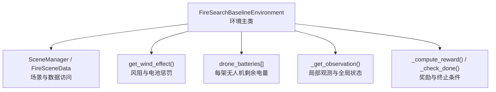
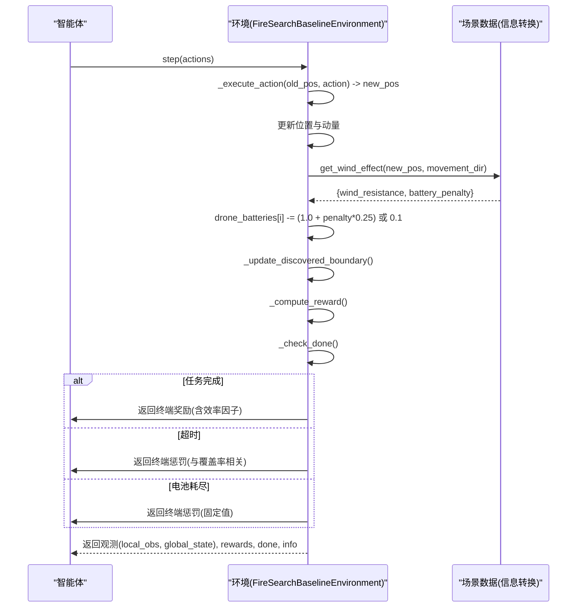
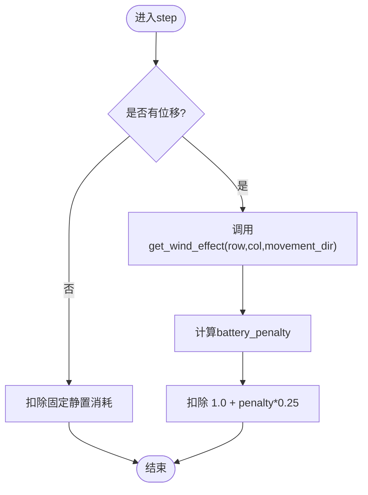
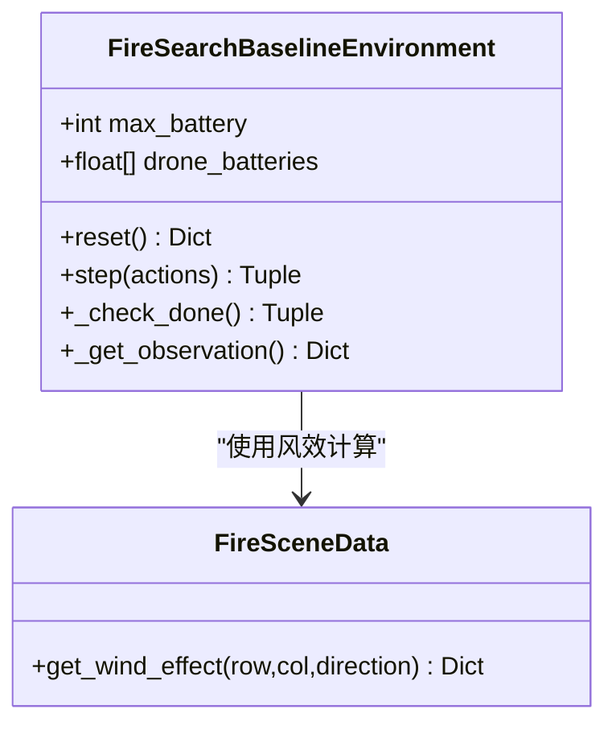
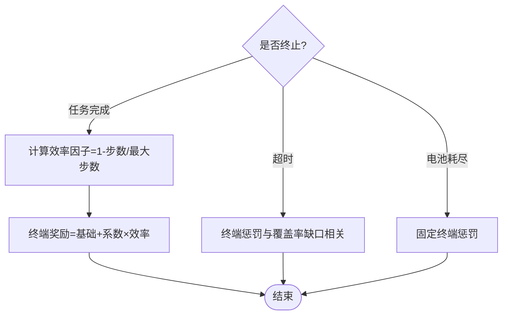
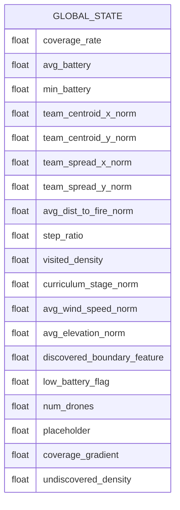
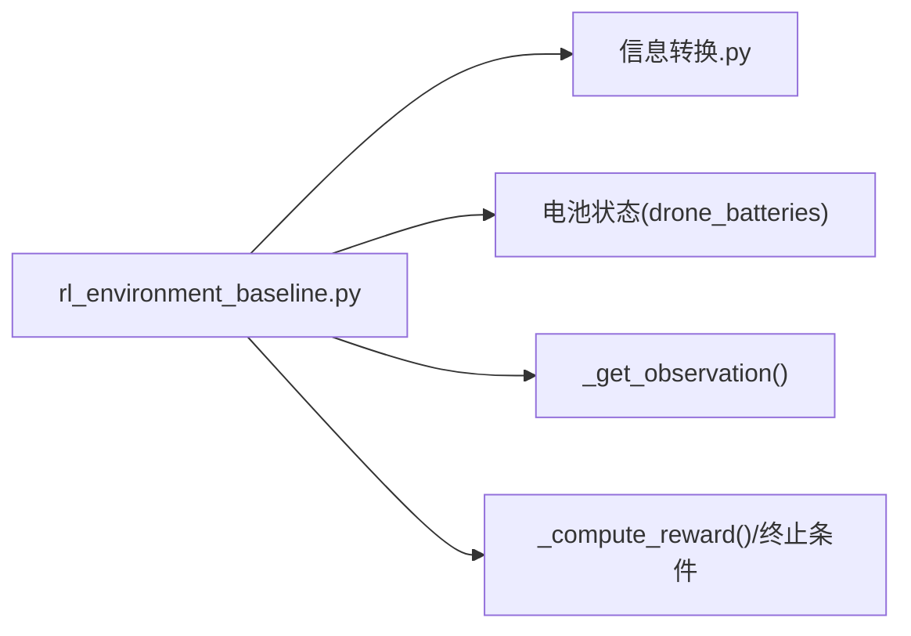

# 电池管理系统

<cite>
**本文引用的文件**   
- [rl_environment_baseline.py](file://environment_variables/environment_variables/rl_environment_baseline.py)
- [信息转换.py](file://environment_variables/environment_variables/信息转换.py)
</cite>

## 目录
1. [简介](#简介)
2. [项目结构](#项目结构)
3. [核心组件](#核心组件)
4. [架构总览](#架构总览)
5. [详细组件分析](#详细组件分析)
6. [依赖关系分析](#依赖关系分析)
7. [性能考量](#性能考量)
8. [故障排查指南](#故障排查指南)
9. [结论](#结论)

## 简介
本文件面向无人机多机协同火场边界搜索任务中的“电池管理系统”，系统性说明以下方面：
- 电池容量模型与最大电量设置
- 电量消耗规则（含风阻影响）
- 充电策略（当前实现）
- 电量状态跟踪（初始化、消耗计算、低电量检测）
- 与奖励函数耦合的电量相关设计（低电量惩罚、能量效率优化、任务完成时的电量评估）
- 观测空间与全局状态中的电量表示及聚合统计
- 电量耗尽的处理逻辑与异常恢复机制

## 项目结构
围绕电池管理的关键代码集中在环境类与数据模块中：
- 环境与步推进化：rl_environment_baseline.py
- 场景与风效计算：信息转换.py

图表来源
- [rl_environment_baseline.py:133-148](file://environment_variables/environment_variables/rl_environment_baseline.py#L133-L148)
- [rl_environment_baseline.py:824-840](file://environment_variables/environment_variables/rl_environment_baseline.py#L824-L840)
- [rl_environment_baseline.py:842-992](file://environment_variables/environment_variables/rl_environment_baseline.py#L842-L992)
- [信息转换.py:1125-1165](file://environment_variables/environment_variables/信息转换.py#L1125-L1165)

章节来源
- [rl_environment_baseline.py:133-148](file://environment_variables/environment_variables/rl_environment_baseline.py#L133-L148)
- [信息转换.py:1125-1165](file://environment_variables/environment_variables/信息转换.py#L1125-L1165)

## 核心组件
- 电池容量与初始化
  - 最大电量按最大步数线性设定，用于将电量归一化到[0,1]区间。
  - 每次重置时，所有无人机电量初始化为满电。
- 电量消耗
  - 移动消耗：基础消耗 + 风阻附加项；静止消耗：固定小值。
  - 风阻附加项由风速、风向与运动方向夹角决定。
- 低电量检测与终止
  - 任一无人机剩余电量≤0即触发“电池耗尽”终止。
- 观测与全局状态
  - 局部观测包含单机的相对电量（已归一化）。
  - 全局状态包含平均电量、最低电量、以及是否存在低电量无人机等聚合特征。
- 奖励与终止
  - 任务完成奖励考虑时间效率（间接体现能耗效率）。
  - 超时与电池耗尽均施加终端惩罚，其中电池耗尽为固定惩罚。
- 充电策略
  - 当前实现未提供充电或电量恢复机制。

章节来源
- [rl_environment_baseline.py:133-137](file://environment_variables/environment_variables/rl_environment_baseline.py#L133-L137)
- [rl_environment_baseline.py:354-358](file://environment_variables/environment_variables/rl_environment_baseline.py#L354-L358)
- [rl_environment_baseline.py:866-872](file://environment_variables/environment_variables/rl_environment_baseline.py#L866-L872)
- [rl_environment_baseline.py:838-840](file://environment_variables/environment_variables/rl_environment_baseline.py#L838-L840)
- [rl_environment_baseline.py:584-602](file://environment_variables/environment_variables/rl_environment_baseline.py#L584-L602)
- [rl_environment_baseline.py:613-653](file://environment_variables/environment_variables/rl_environment_baseline.py#L613-L653)
- [rl_environment_baseline.py:948-961](file://environment_variables/environment_variables/rl_environment_baseline.py#L948-L961)
- [信息转换.py:1125-1165](file://environment_variables/environment_variables/信息转换.py#L1125-L1165)

## 架构总览
下图展示电池在环境步进流程中的关键交互：动作执行→位置更新→风效计算→电量扣减→观测输出→终止判定→终端奖励/惩罚。

图表来源
- [rl_environment_baseline.py:842-992](file://environment_variables/environment_variables/rl_environment_baseline.py#L842-L992)
- [信息转换.py:1125-1165](file://environment_variables/environment_variables/信息转换.py#L1125-L1165)

## 详细组件分析

### 电池容量模型与最大电量设置
- 最大电量与步数关系：max_battery = max_steps × 2.0。该设计使电量上限随任务时长线性缩放，便于在不同场景中保持合理的续航预算。
- 动态调整：当从元数据启用UAV参数时，max_steps可能变化，随后会重新计算max_battery。

章节来源
- [rl_environment_baseline.py:133](file://environment_variables/environment_variables/rl_environment_baseline.py#L133)
- [rl_environment_baseline.py:198-206](file://environment_variables/environment_variables/rl_environment_baseline.py#L198-L206)

### 电量消耗规则
- 移动消耗：
  - 基础消耗：1.0
  - 风阻附加：wind_effect["battery_penalty"] × 0.25
  - 风阻附加来源于风速、风向与运动方向的夹角；顺风或侧顺风不产生额外惩罚，逆风且角度差小于90度时产生惩罚。
- 静止消耗：
  - 无位移时消耗固定小值，避免长时间悬停导致零成本。
- 风效计算要点：
  - 基于归一化风速与运动-风向夹角的余弦阻力，仅在特定角度范围内生效。

图表来源
- [rl_environment_baseline.py:866-872](file://environment_variables/environment_variables/rl_environment_baseline.py#L866-L872)
- [信息转换.py:1125-1165](file://environment_variables/environment_variables/信息转换.py#L1125-L1165)

章节来源
- [rl_environment_baseline.py:866-872](file://environment_variables/environment_variables/rl_environment_baseline.py#L866-L872)
- [信息转换.py:1125-1165](file://environment_variables/environment_variables/信息转换.py#L1125-L1165)

### 充电策略
- 当前实现未包含任何充电或电量恢复逻辑。若需引入充电点或返航补给，可在step流程中增加“到达充电站则恢复电量”的条件分支，并相应调整奖励以鼓励高效往返。

章节来源
- [rl_environment_baseline.py:842-992](file://environment_variables/environment_variables/rl_environment_baseline.py#L842-L992)

### 电量状态跟踪
- 初始化：reset时，为每架无人机分配满电（等于max_battery），并清空其他状态。
- 消耗计算：每步根据是否移动与风效计算扣减。
- 低电量检测：任一无人机剩余电量≤0即标记“电池耗尽”。

图表来源
- [rl_environment_baseline.py:133-148](file://environment_variables/environment_variables/rl_environment_baseline.py#L133-L148)
- [rl_environment_baseline.py:354-358](file://environment_variables/environment_variables/rl_environment_baseline.py#L354-L358)
- [rl_environment_baseline.py:838-840](file://environment_variables/environment_variables/rl_environment_baseline.py#L838-L840)
- [信息转换.py:1125-1165](file://environment_variables/environment_variables/信息转换.py#L1125-L1165)

章节来源
- [rl_environment_baseline.py:354-358](file://environment_variables/environment_variables/rl_environment_baseline.py#L354-L358)
- [rl_environment_baseline.py:838-840](file://environment_variables/environment_variables/rl_environment_baseline.py#L838-L840)

### 电量相关的奖励函数设计
- 低电量惩罚：当“电池耗尽”终止时，对每架无人机施加固定终端惩罚，并按无人机数量分摊至各智能体。
- 能量效率优化：任务完成奖励包含“效率因子”，与所用步数占最大步数的比例相关，间接鼓励更短路径与更少能耗。
- 任务完成时的电量评估：当前未在终端奖励中显式使用最终电量作为评分项，但可通过扩展reward_breakdown加入“剩余电量”指标以便训练期监控。

图表来源
- [rl_environment_baseline.py:948-961](file://environment_variables/environment_variables/rl_environment_baseline.py#L948-L961)

章节来源
- [rl_environment_baseline.py:948-961](file://environment_variables/environment_variables/rl_environment_baseline.py#L948-L961)

### 观测空间与全局状态中的电量表示
- 局部观测（每架无人机）：
  - 包含相对电量：battery / max_battery，范围[0,1]。
- 全局状态（集中式）：
  - 平均电量：avg_battery = mean(drone_batteries)/max_battery
  - 最低电量：min_battery = min(drone_batteries)/max_battery
  - 低电量标志：是否存在任意无人机电量低于阈值（如20%）
  - 其他与环境相关的聚合特征（覆盖率、团队质心、距火源距离等）

图表来源
- [rl_environment_baseline.py:613-653](file://environment_variables/environment_variables/rl_environment_baseline.py#L613-L653)

章节来源
- [rl_environment_baseline.py:584-602](file://environment_variables/environment_variables/rl_environment_baseline.py#L584-L602)
- [rl_environment_baseline.py:613-653](file://environment_variables/environment_variables/rl_environment_baseline.py#L613-L653)

### 电量耗尽处理与异常恢复
- 终止条件：任一无人机剩余电量≤0即返回done=True，done_reason="battery_depleted"。
- 终端惩罚：固定惩罚值，按无人机数量分摊。
- 异常恢复：当前未内置自动恢复（如召回或降落）。如需恢复，可在step中增加“电量低于安全阈值时强制返回基地”的策略分支，并在info中记录事件以便调试。

章节来源
- [rl_environment_baseline.py:838-840](file://environment_variables/environment_variables/rl_environment_baseline.py#L838-L840)
- [rl_environment_baseline.py:958-961](file://environment_variables/environment_variables/rl_environment_baseline.py#L958-L961)

## 依赖关系分析
- 环境类依赖场景数据模块获取风场信息，从而计算风阻与电池惩罚。
- 电池状态仅由环境内部维护，不与其他外部系统耦合，具备良好内聚性。
- 潜在循环依赖：无直接循环导入；环境通过importlib加载数据模块，解耦清晰。

图表来源
- [rl_environment_baseline.py:17](file://environment_variables/environment_variables/rl_environment_baseline.py#L17)
- [rl_environment_baseline.py:866-872](file://environment_variables/environment_variables/rl_environment_baseline.py#L866-L872)
- [信息转换.py:1125-1165](file://environment_variables/environment_variables/信息转换.py#L1125-L1165)

章节来源
- [rl_environment_baseline.py:17](file://environment_variables/environment_variables/rl_environment_baseline.py#L17)
- [rl_environment_baseline.py:866-872](file://environment_variables/environment_variables/rl_environment_baseline.py#L866-L872)
- [信息转换.py:1125-1165](file://environment_variables/environment_variables/信息转换.py#L1125-L1165)

## 性能考量
- 风效计算复杂度：每步对每个无人机进行一次风效查询，时间复杂度O(N)，N为无人机数量。
- 向量操作：全局状态中的均值、最小值、标准差均为向量化计算，开销较低。
- 建议：
  - 若无人机数量较大，可缓存最近一步的风效结果以减少重复计算。
  - 可将低电量标志提前在步内判断，避免不必要的后续计算。

## 故障排查指南
- 现象：无人机频繁“电池耗尽”
  - 检查max_steps与max_battery配置是否合理。
  - 检查风场数据是否异常高，导致wind_resistance与battery_penalty过大。
  - 确认是否长时间逆风移动或原地悬停过多。
- 现象：全局状态中low_battery_flag长期为True
  - 检查低电量阈值（例如20%）是否符合预期。
  - 观察reward_breakdown中r_terminal是否为负，确认电池耗尽惩罚生效。
- 现象：任务完成奖励偏低
  - 检查实际步数接近max_steps的比例，效率因子较小会导致终端奖励降低。

章节来源
- [rl_environment_baseline.py:838-840](file://environment_variables/environment_variables/rl_environment_baseline.py#L838-L840)
- [rl_environment_baseline.py:948-961](file://environment_variables/environment_variables/rl_environment_baseline.py#L948-L961)
- [信息转换.py:1125-1165](file://environment_variables/environment_variables/信息转换.py#L1125-L1165)

## 结论
本电池管理系统以简洁而有效的方式建模了无人机电量生命周期：
- 通过max_battery与max_steps的线性关系建立统一电量预算；
- 结合风场信息实现贴近实际的能耗差异；
- 在观测与全局状态中显式表达电量信息，便于学习算法进行能耗感知决策；
- 通过终端惩罚与效率因子引导智能体在完成任务的同时兼顾能耗效率。

未来可扩展方向包括：
- 引入充电点与返航策略，完善闭环能源管理；
- 在奖励中加入剩余电量或能耗效率的直接反馈；
- 针对不同地形与风场的自适应能耗模型。