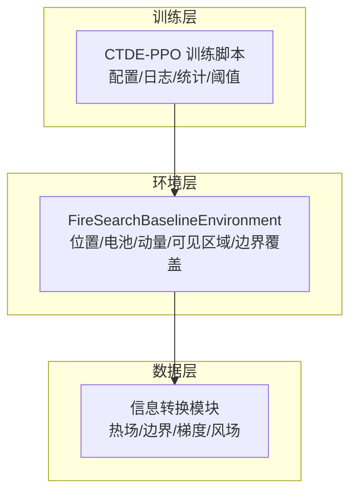
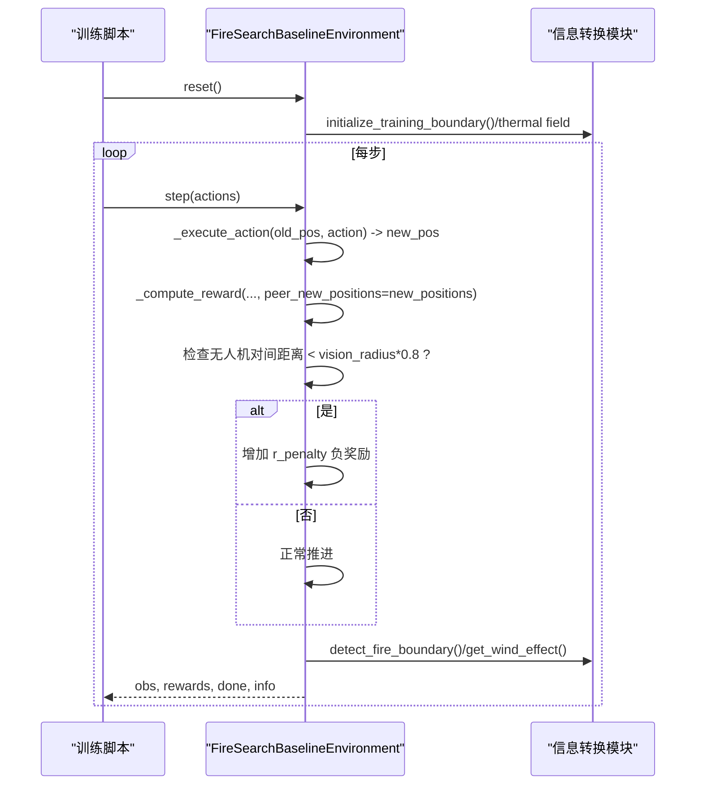
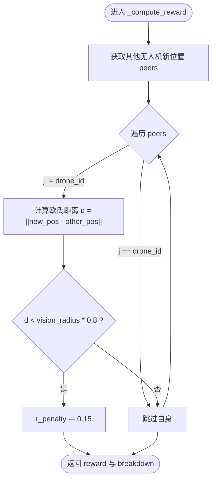
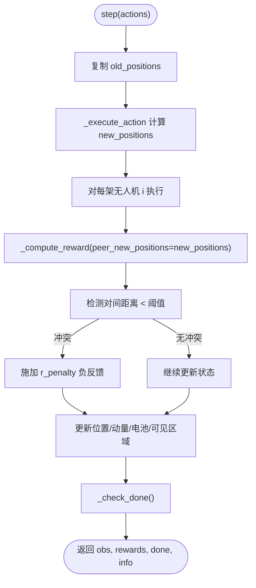
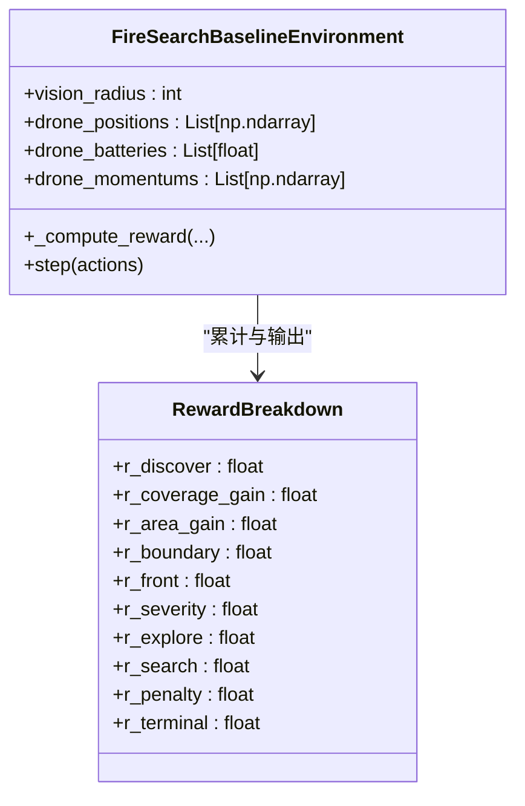
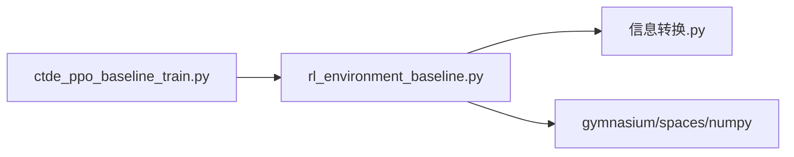

# 碰撞检测与避免

<cite>
**本文引用的文件**   
- [rl_environment_baseline.py](file://environment_variables/environment_variables/rl_environment_baseline.py)
- [ctde_ppo_baseline_train.py](file://environment_variables/environment_variables/ctde_ppo_baseline_train.py)
- [信息转换.py](file://environment_variables/environment_variables/信息转换.py)
</cite>

## 目录
1. [简介](#简介)
2. [项目结构](#项目结构)
3. [核心组件](#核心组件)
4. [架构总览](#架构总览)
5. [详细组件分析](#详细组件分析)
6. [依赖关系分析](#依赖关系分析)
7. [性能考量](#性能考量)
8. [故障排查指南](#故障排查指南)
9. [结论](#结论)
10. [附录](#附录)

## 简介
本文件面向多无人机（UAV）在火灾边界搜索任务中的“碰撞检测与避免”子系统，围绕最小间距约束、冲突检测机制、冲突解决策略、碰撞惩罚机制、碰撞历史追踪与统计分析，以及前瞻性预防与安全缓冲区等主题进行系统化说明。文档以代码仓库中的环境实现为依据，重点解释：
- 最小间距约束算法：基于欧几里得距离的阈值判断逻辑
- 冲突检测机制：实时位置监控与潜在碰撞预测
- 冲突解决策略：避让动作生成与路径重规划思路
- 碰撞惩罚机制：奖励函数中的碰撞惩罚项与负反馈调节
- 碰撞历史追踪与统计分析：记录与评估指标
- 前瞻性与安全缓冲区：参数化安全裕度与课程学习阶段的影响

## 项目结构
该仓库采用“环境+训练脚本+数据预处理”的分层组织方式：
- 环境层：FireSearchBaselineEnvironment 提供多智能体仿真、观测、奖励、终止条件与状态更新
- 训练层：CTDE-PPO 训练循环、配置归一化、日志与统计
- 数据层：场景管理、热场重建、边界检测与热力梯度计算

图表来源
- [rl_environment_baseline.py:1-120](file://environment_variables/environment_variables/rl_environment_baseline.py#L1-L120)
- [ctde_ppo_baseline_train.py:98-200](file://environment_variables/environment_variables/ctde_ppo_baseline_train.py#L98-L200)
- [信息转换.py:743-820](file://environment_variables/environment_variables/信息转换.py#L743-L820)

章节来源
- [rl_environment_baseline.py:1-120](file://environment_variables/environment_variables/rl_environment_baseline.py#L1-L120)
- [ctde_ppo_baseline_train.py:98-200](file://environment_variables/environment_variables/ctde_ppo_baseline_train.py#L98-L200)

## 核心组件
- 最小间距约束与碰撞检测
  - 使用欧几里得距离对无人机对间距离进行计算，并与安全阈值比较
  - 阈值由 vision_radius 派生，体现为“视觉半径×系数”的安全缓冲
- 冲突检测机制
  - 每步执行前收集旧位置，执行后得到新位置；对新位置两两配对进行距离检查
  - 若小于阈值则判定为冲突并施加惩罚
- 冲突解决策略
  - 当前环境未内置显式避障控制器，但通过奖励负反馈引导策略网络学习避让行为
  - 可扩展加入局部避障器或路径重规划模块作为上层决策
- 碰撞惩罚机制
  - 在奖励函数中引入 r_penalty 项，对近距离移动施加负奖励，形成负反馈
- 碰撞历史追踪与统计分析
  - 每步 info 包含平均距火中心距离、完成原因、阶段目标等；可在此基础上扩展碰撞事件计数与分布统计
- 前瞻性与安全缓冲区
  - 通过 vision_radius 控制感知范围与安全缓冲大小；课程学习阶段影响初始生成与探索强度，间接影响碰撞风险

章节来源
- [rl_environment_baseline.py:379-419](file://environment_variables/environment_variables/rl_environment_baseline.py#L379-L419)
- [rl_environment_baseline.py:692-767](file://environment_variables/environment_variables/rl_environment_baseline.py#L692-L767)
- [rl_environment_baseline.py:842-992](file://environment_variables/environment_variables/rl_environment_baseline.py#L842-L992)

## 架构总览
下图展示了从训练到环境再到数据处理的调用链，以及碰撞相关的关键节点。

图表来源
- [rl_environment_baseline.py:842-992](file://environment_variables/environment_variables/rl_environment_baseline.py#L842-L992)
- [信息转换.py:802-820](file://environment_variables/environment_variables/信息转换.py#L802-L820)

## 详细组件分析

### 最小间距约束算法（欧氏距离与阈值）
- 距离计算
  - 使用欧几里得范数计算无人机 i 与 j 的新位置之间的距离
  - 关键实现位于奖励计算中对 peers 的遍历与距离比较
- 阈值设定
  - 阈值 = vision_radius × 0.8
  - vision_radius 可由配置或元数据决定，默认值为 16
- 复杂度
  - 每步 O(N^2)，N 为无人机数量；在本项目中 N 较小，开销可控

图表来源
- [rl_environment_baseline.py:692-767](file://environment_variables/environment_variables/rl_environment_baseline.py#L692-L767)

章节来源
- [rl_environment_baseline.py:692-767](file://environment_variables/environment_variables/rl_environment_baseline.py#L692-L767)

### 冲突检测机制（实时监控与潜在碰撞预测）
- 实时监控
  - 每步先复制旧位置 old_positions，再根据动作计算 new_positions
  - 对 new_positions 进行两两距离检查，若低于阈值即触发冲突信号
- 潜在碰撞预测
  - 当前实现为即时检测，可通过引入速度/动量与时间步长估计未来位置，提前预警
  - 建议扩展：基于动量向量与相对速度构建碰撞时间（CTC）或近点距离（CPA）指标

图表来源
- [rl_environment_baseline.py:842-992](file://environment_variables/environment_variables/rl_environment_baseline.py#L842-L992)

章节来源
- [rl_environment_baseline.py:842-992](file://environment_variables/environment_variables/rl_environment_baseline.py#L842-L992)

### 冲突解决策略（避让动作与路径重规划）
- 当前实现
  - 未内置显式避障控制器；通过奖励负反馈促使策略网络学习避让
- 可扩展方案
  - 局部避障：在动作空间中加入规避方向或角度偏移
  - 路径重规划：基于 A*/RRT 或势场法在网格上重新规划短期轨迹
  - 协同避让：考虑队形保持与分散策略，降低群体聚集概率

[本节为概念性扩展建议，不直接分析具体文件]

### 碰撞惩罚机制（奖励函数中的惩罚项与负反馈）
- 惩罚项
  - 当检测到对间距离小于阈值时，r_penalty 减少固定值，形成负反馈
- 负反馈调节
  - 配合步骤惩罚、空闲惩罚、重复访问惩罚等共同塑造行为
  - 终端惩罚与超时惩罚用于整体效率与覆盖率引导

图表来源
- [rl_environment_baseline.py:36-47](file://environment_variables/environment_variables/rl_environment_baseline.py#L36-L47)
- [rl_environment_baseline.py:692-767](file://environment_variables/environment_variables/rl_environment_baseline.py#L692-L767)

章节来源
- [rl_environment_baseline.py:36-47](file://environment_variables/environment_variables/rl_environment_baseline.py#L36-L47)
- [rl_environment_baseline.py:692-767](file://environment_variables/environment_variables/rl_environment_baseline.py#L692-L767)

### 碰撞历史追踪与统计分析
- 现有统计
  - info 中包含 avg_distance_to_fire、done_reason、stage_target、reward_breakdown 等
- 可扩展统计
  - 新增 collision_count、collision_rate、min_pairwise_distance 序列
  - 按阶段/场景/种子聚合统计，绘制碰撞密度与时序曲线

章节来源
- [rl_environment_baseline.py:966-992](file://environment_variables/environment_variables/rl_environment_baseline.py#L966-L992)

### 前瞻性与安全缓冲区设置
- 安全缓冲区
  - 阈值 = vision_radius × 0.8，随 vision_radius 增大而扩大
  - 初始化阶段也应用了最小间距约束，避免初始重叠
- 课程学习影响
  - 不同课程阶段影响初始生成策略与探索强度，从而改变碰撞风险
- 前瞻建议
  - 引入动量与速度估计，结合时间步长预测未来位置，提前调整动作

章节来源
- [rl_environment_baseline.py:379-419](file://environment_variables/environment_variables/rl_environment_baseline.py#L379-L419)
- [rl_environment_baseline.py:692-767](file://environment_variables/environment_variables/rl_environment_baseline.py#L692-L767)

## 依赖关系分析
- 环境与环境数据
  - 环境依赖 SceneManager 与数据模块进行边界与热场处理
- 训练与环境
  - 训练脚本创建并驱动环境实例，读取 info 进行统计与可视化
- 环境与外部库
  - 使用 numpy 进行数值计算，gymnasium 定义观测与动作空间

图表来源
- [ctde_ppo_baseline_train.py:30-36](file://environment_variables/environment_variables/ctde_ppo_baseline_train.py#L30-L36)
- [rl_environment_baseline.py:12-18](file://environment_variables/environment_variables/rl_environment_baseline.py#L12-L18)
- [信息转换.py:743-820](file://environment_variables/environment_variables/信息转换.py#L743-L820)

章节来源
- [ctde_ppo_baseline_train.py:30-36](file://environment_variables/environment_variables/ctde_ppo_baseline_train.py#L30-L36)
- [rl_environment_baseline.py:12-18](file://environment_variables/environment_variables/rl_environment_baseline.py#L12-L18)

## 性能考量
- 复杂度
  - 碰撞检测每步 O(N^2)，N 为无人机数量；本项目 N 较小，开销可接受
- 内存与缓存
  - 热场与边界检测存在缓存机制，减少重复计算
- 优化建议
  - 对大规模集群可采用空间索引（如四叉树）加速最近邻查询
  - 将碰撞检测与奖励计算解耦，便于并行化

[本节提供一般性指导，不直接分析具体文件]

## 故障排查指南
- 常见问题
  - 碰撞频繁：检查 vision_radius 是否过小；确认课程阶段与初始生成策略
  - 策略不收敛：观察 r_penalty 占比是否过高导致探索不足
  - 边界更新不及时：确认每 20 步的边界刷新逻辑是否正常
- 定位方法
  - 打印 info 中的 avg_distance_to_fire 与 reward_breakdown 的 r_penalty
  - 检查 step 内新旧位置变化与动量更新是否符合预期

章节来源
- [rl_environment_baseline.py:927-942](file://environment_variables/environment_variables/rl_environment_baseline.py#L927-L942)
- [rl_environment_baseline.py:966-992](file://environment_variables/environment_variables/rl_environment_baseline.py#L966-L992)

## 结论
本系统在当前实现中以“距离阈值+奖励负反馈”的方式实现了多无人机间的碰撞检测与避免引导。其核心在于：
- 使用欧几里得距离与 vision_radius 派生的安全阈值进行冲突检测
- 通过 r_penalty 对近距离移动施加负奖励，形成负反馈
- 借助课程学习与初始生成策略降低初始碰撞风险
- 具备扩展基础，可在不破坏现有接口的前提下加入更复杂的前瞻性避障与路径重规划模块

[本节总结性内容，不直接分析具体文件]

## 附录

### 关键参数与默认值
- vision_radius：默认 16（可由配置或元数据覆盖）
- 碰撞阈值：vision_radius × 0.8
- 课程阶段：影响初始生成概率与目标覆盖率
- 步长与最大步数：max_steps 影响终端惩罚与效率评估

章节来源
- [ctde_ppo_baseline_train.py:98-200](file://environment_variables/environment_variables/ctde_ppo_baseline_train.py#L98-L200)
- [rl_environment_baseline.py:49-106](file://environment_variables/environment_variables/rl_environment_baseline.py#L49-L106)