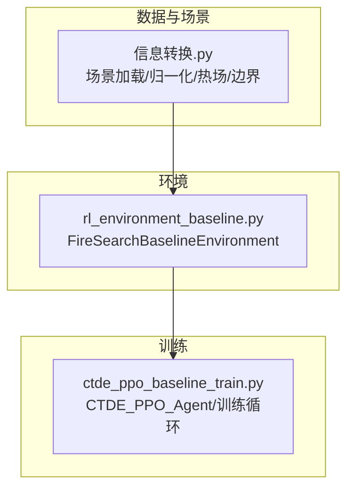
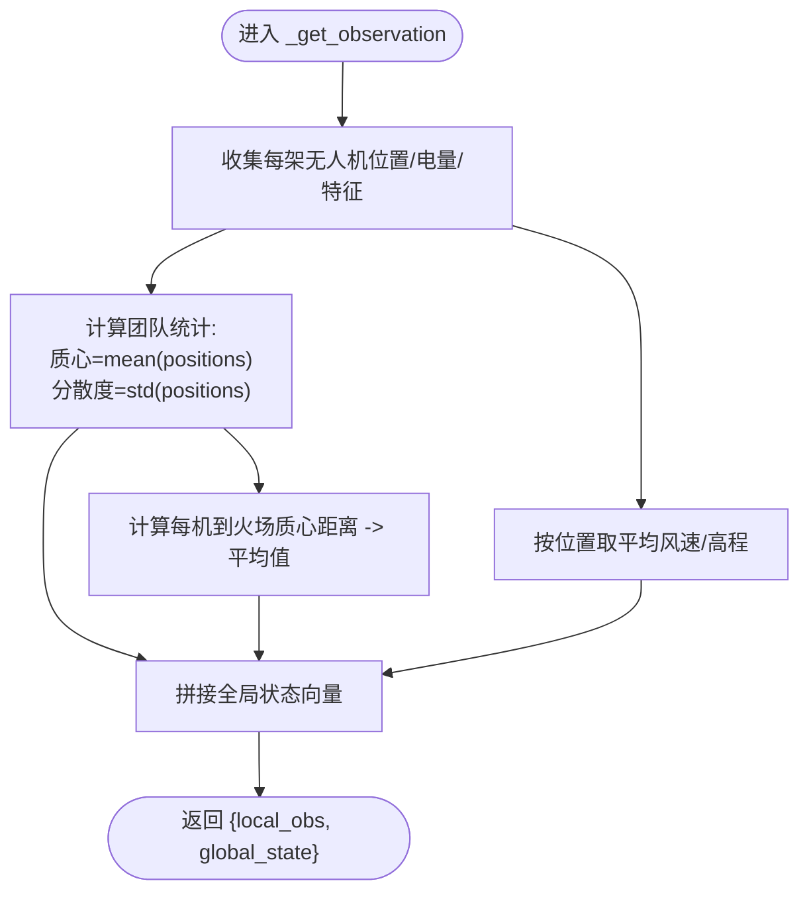
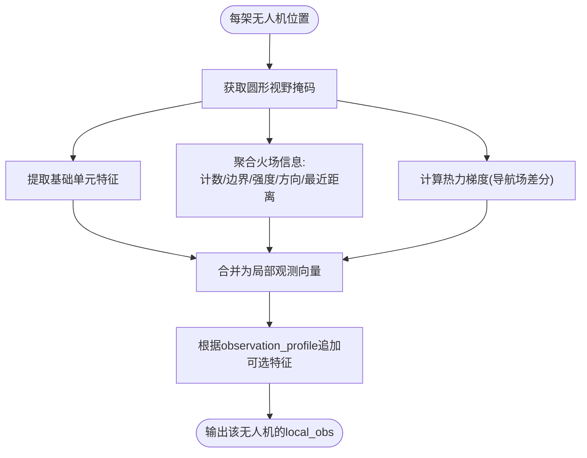
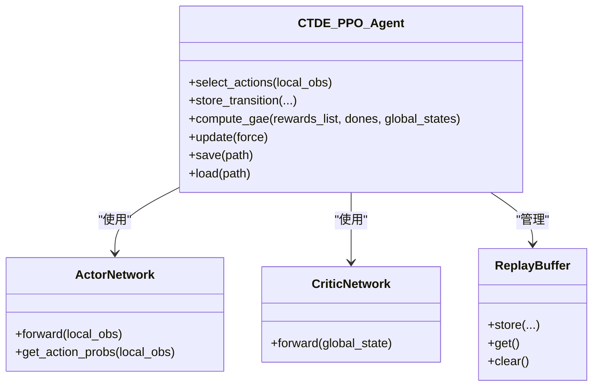
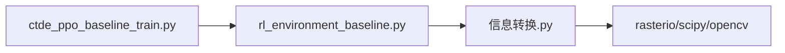

# 通信协议与信息共享

<cite>
**本文引用的文件**   
- [ctde_ppo_baseline_train.py](file://environment_variables/environment_variables/ctde_ppo_baseline_train.py)
- [rl_environment_baseline.py](file://environment_variables/environment_variables/rl_environment_baseline.py)
- [信息转换.py](file://environment_variables/environment_variables/信息转换.py)
</cite>

## 目录
1. [简介](#简介)
2. [项目结构](#项目结构)
3. [核心组件](#核心组件)
4. [架构总览](#架构总览)
5. [详细组件分析](#详细组件分析)
6. [依赖关系分析](#依赖关系分析)
7. [性能考虑](#性能考虑)
8. [故障排查指南](#故障排查指南)
9. [结论](#结论)
10. [附录](#附录)

## 简介
本文件围绕多无人机通信协议与信息聚合机制，系统性阐述以下要点：
- 全局状态的构建机制：团队质心、分散度统计、平均距离测量等指标的计算与用途。
- 局部观测的生成过程：视野范围内的信息收集、特征提取与数据聚合。
- 无人机间的信息共享策略：位置广播、状态同步与协作感知在代码中的体现。
- 集中式训练去中心化执行（CTDE）架构的实现细节。
- 通信延迟模拟与网络拓扑建模的现状与建议。
- 信息过滤与噪声处理机制。

说明：当前仓库实现以“环境提供全局状态给Critic”的方式达成CTDE；并未显式实现无人机间的点对点消息传递或带时延的网络层。因此，关于“通信延迟模拟和网络拓扑建模”，本节将基于现有实现进行现状说明并给出扩展建议。

## 项目结构
本项目包含三个关键模块：
- 环境与场景数据加载：负责从FARSITE场景读取栅格、矢量与元数据，计算边界、热场、风场等，并提供局部视野查询接口。
- 基线环境：封装Gymnasium风格的多无人机搜索任务，定义动作空间、奖励函数、终止条件，以及观测与全局状态构造。
- 训练脚本：实现CTDE-PPO算法，维护Actor（仅用局部观测）、Critic（使用全局状态），并进行课程学习与评估。



图表来源
- [信息转换.py:219-322](file://environment_variables/environment_variables/信息转换.py#L219-L322)
- [rl_environment_baseline.py:21-158](file://environment_variables/environment_variables/rl_environment_baseline.py#L21-L158)
- [ctde_ppo_baseline_train.py:759-822](file://environment_variables/environment_variables/ctde_ppo_baseline_train.py#L759-L822)

章节来源
- [信息转换.py:219-322](file://environment_variables/environment_variables/信息转换.py#L219-L322)
- [rl_environment_baseline.py:21-158](file://environment_variables/environment_variables/rl_environment_baseline.py#L21-L158)
- [ctde_ppo_baseline_train.py:759-822](file://environment_variables/environment_variables/ctde_ppo_baseline_train.py#L759-L822)

## 核心组件
- FireSceneData：场景数据加载、归一化参数推导、边界检测、热势场与导航场计算、局部视野与风场影响等。
- FireSearchBaselineEnvironment：多无人机离散网格移动、可见区域更新、边界覆盖率统计、奖励分解、全局状态与局部观测构造。
- CTDE_PPO_Agent：Actor（局部观测）与Critic（全局状态）网络、PPO更新、KL自适应学习率、回放缓冲与GAE。

章节来源
- [信息转换.py:219-322](file://environment_variables/environment_variables/信息转换.py#L219-L322)
- [rl_environment_baseline.py:21-158](file://environment_variables/environment_variables/rl_environment_baseline.py#L21-L158)
- [ctde_ppo_baseline_train.py:759-822](file://environment_variables/environment_variables/ctde_ppo_baseline_train.py#L759-L822)

## 架构总览
CTDE架构在本项目中的体现：
- 每个无人机拥有独立Actor，输入为“局部观测”。
- 训练阶段存在一个Critic，输入为“全局状态”，用于估计团队价值。
- 训练循环中，环境每步返回“local_obs”和“global_state”，分别喂给Actor与Critic。

```mermaid
sequenceDiagram
participant Env as "环境(FireSearchBaselineEnvironment)"
participant Agent as "CTDE_PPO_Agent"
participant Actor as "Actor(局部观测)"
participant Critic as "Critic(全局状态)"
Env->>Agent : 返回 {local_obs, global_state}
Agent->>Actor : 输入 local_obs
Actor-->>Agent : 动作分布/采样动作
Agent->>Env : 执行动作(actions)
Env-->>Agent : 返回 next_obs, rewards, done, info
Agent->>Critic : 输入 global_state 估计价值
Agent->>Agent : 存储轨迹/计算GAE/更新参数
```

图表来源
- [ctde_ppo_baseline_train.py:849-991](file://environment_variables/environment_variables/ctde_ppo_baseline_train.py#L849-L991)
- [rl_environment_baseline.py:565-658](file://environment_variables/environment_variables/rl_environment_baseline.py#L565-L658)

## 详细组件分析

### 全局状态构建机制
全局状态由环境在每个时间步汇总团队级统计量，供Critic使用。其构建流程如下：
- 覆盖率与进度：当前边界覆盖率、步数比例、已访问单元格密度、未覆盖密度。
- 电池与能耗：平均电量、最低电量、低电量指示。
- 团队几何：团队质心（所有无人机位置的均值）、分散度（各维度的标准差）。
- 火场相关：到火场质心的平均距离。
- 环境上下文：平均风速、平均高程、课程阶段、覆盖率梯度等。



图表来源
- [rl_environment_baseline.py:565-658](file://environment_variables/environment_variables/rl_environment_baseline.py#L565-L658)

章节来源
- [rl_environment_baseline.py:565-658](file://environment_variables/environment_variables/rl_environment_baseline.py#L565-L658)

### 局部观测的生成过程
局部观测针对每架无人机在其圆形视野范围内采集并聚合特征，包括：
- 基础单元特征：强度、DEM、坡度、风速、风向（正弦/余弦编码）。
- 火场信息：视野内火点数量、边界点数、平均/最大强度、最近火点距离、火场方向。
- 热力梯度：从导航场计算的局部梯度方向（用于引导搜索）。
- 运动学：自身动量、相机朝向（相对火场方向）。
- 地形与静态特征：可选加入坡向、燃料模型、冠层属性等。
- 动态前沿特征：可选加入视野内火/前沿占比、强度统计、最近距离等。
- 风险感知特征：可选加入当前位置及邻域严重度均值/最大值。



图表来源
- [rl_environment_baseline.py:565-658](file://environment_variables/environment_variables/rl_environment_baseline.py#L565-L658)
- [信息转换.py:1070-1123](file://environment_variables/environment_variables/信息转换.py#L1070-L1123)
- [信息转换.py:933-970](file://environment_variables/environment_variables/信息转换.py#L933-L970)

章节来源
- [rl_environment_baseline.py:565-658](file://environment_variables/environment_variables/rl_environment_baseline.py#L565-L658)
- [信息转换.py:1070-1123](file://environment_variables/environment_variables/信息转换.py#L1070-L1123)
- [信息转换.py:933-970](file://environment_variables/environment_variables/信息转换.py#L933-L970)

### 无人机间的信息共享策略
在当前实现中，无人机之间没有直接的点对点消息通道。信息共享通过以下方式间接实现：
- 位置广播：全局状态中包含团队质心与分散度，Critic可据此推断团队布局。
- 状态同步：全局状态包含覆盖率、平均/最低电量、平均风速/高程等，便于Critic理解团队整体态势。
- 协作感知：奖励函数对近距离重叠进行搜索惩罚，促使无人机避免聚集，从而形成隐式协作。

注意：这些是“环境侧的全局汇总”，并非“无人机间实时通信”。若需真正的分布式通信，可在环境step中增加消息队列与拓扑控制，并在Actor输入中加入邻居状态。

章节来源
- [rl_environment_baseline.py:565-658](file://environment_variables/environment_variables/rl_environment_baseline.py#L565-L658)
- [rl_environment_baseline.py:746-754](file://environment_variables/environment_variables/rl_environment_baseline.py#L746-L754)

### CTDE架构实现
- Actor网络：接收每架无人机的局部观测，输出离散动作概率分布。
- Critic网络：接收全局状态，输出标量价值估计。
- PPO更新：使用团队平均奖励计算优势与回报，分别更新Actor与Critic。
- KL自适应：支持固定学习率或基于KL误差的学习率调整。



图表来源
- [ctde_ppo_baseline_train.py:460-535](file://environment_variables/environment_variables/ctde_ppo_baseline_train.py#L460-L535)
- [ctde_ppo_baseline_train.py:537-567](file://environment_variables/environment_variables/ctde_ppo_baseline_train.py#L537-L567)
- [ctde_ppo_baseline_train.py:849-991](file://environment_variables/environment_variables/ctde_ppo_baseline_train.py#L849-L991)

章节来源
- [ctde_ppo_baseline_train.py:460-535](file://environment_variables/environment_variables/ctde_ppo_baseline_train.py#L460-L535)
- [ctde_ppo_baseline_train.py:537-567](file://environment_variables/environment_variables/ctde_ppo_baseline_train.py#L537-L567)
- [ctde_ppo_baseline_train.py:849-991](file://environment_variables/environment_variables/ctde_ppo_baseline_train.py#L849-L991)

### 通信延迟模拟与网络拓扑建模
现状：
- 当前代码未实现通信延迟或丢包。
- 未定义无人机间的通信拓扑（如K近邻、半径邻域、全连接等）。

建议扩展方案（概念性，不改变现有行为）：
- 在环境step中引入消息队列：每架无人机维护一个待发送/待接收的消息缓冲区。
- 定义拓扑：按距离阈值或K近邻选择邻居集合。
- 模拟延迟：为每条消息附加到达时间戳，在目标时间步注入接收队列。
- 在Actor输入中融合邻居状态：例如邻居位置、电量、局部观测摘要。
- 在训练循环中记录通信开销（带宽、时延、丢包率）作为诊断指标。

[本节为概念性建议，不直接分析具体文件]

### 信息过滤与噪声处理机制
- 栅格数据清洗：读取栅格时将nodata替换为0，去除NaN/Inf，负值置零。
- 归一化与裁剪：多数特征按场景统计或固定上限进行归一化并裁剪至[0,1]。
- 热势场稳健归一化：先下采样+高斯模糊，再按正样本分位数参考值归一化，最后裁剪至[0,1]。
- 导航场梯度：对log压缩后的导航场做差分，避免高值区梯度消失。
- 视野掩码：仅聚合圆形视野内的有效像素，其余置零，减少无关背景噪声。

章节来源
- [信息转换.py:392-414](file://environment_variables/environment_variables/信息转换.py#L392-L414)
- [信息转换.py:559-602](file://environment_variables/environment_variables/信息转换.py#L559-L602)
- [信息转换.py:759-820](file://environment_variables/environment_variables/信息转换.py#L759-L820)
- [信息转换.py:933-970](file://environment_variables/environment_variables/信息转换.py#L933-L970)
- [信息转换.py:1014-1068](file://environment_variables/environment_variables/信息转换.py#L1014-L1068)

## 依赖关系分析
- 环境依赖数据模块：FireSearchBaselineEnvironment通过importlib动态导入“信息转换”模块，使用SceneManager与FireSceneData提供的能力。
- 训练脚本依赖环境：CTDE_PPO_Agent与训练循环依赖环境的观测与全局状态接口。
- 数据模块内部依赖：使用rasterio、scipy、opencv等进行栅格读写、形态学操作与图像缩放滤波。



图表来源
- [ctde_ppo_baseline_train.py:30-37](file://environment_variables/environment_variables/ctde_ppo_baseline_train.py#L30-L37)
- [rl_environment_baseline.py:17-19](file://environment_variables/environment_variables/rl_environment_baseline.py#L17-L19)
- [信息转换.py:9-13](file://environment_variables/environment_variables/信息转换.py#L9-L13)

章节来源
- [ctde_ppo_baseline_train.py:30-37](file://environment_variables/environment_variables/ctde_ppo_baseline_train.py#L30-L37)
- [rl_environment_baseline.py:17-19](file://environment_variables/environment_variables/rl_environment_baseline.py#L17-L19)
- [信息转换.py:9-13](file://environment_variables/environment_variables/信息转换.py#L9-L13)

## 性能考虑
- 视野聚合采用切片与布尔掩码，避免逐像素循环，提升效率。
- 热势场计算采用下采样+高斯模糊+上采样，降低计算量同时保留语义。
- 全局状态维度较小（约19维），Critic网络轻量，利于快速收敛。
- 课程学习逐步提高难度，有助于稳定训练与提升泛化。

[本节为一般性指导，不直接分析具体文件]

## 故障排查指南
- 场景无效：当t=0边界为空或初始化面积百分比导致空边界时，会抛出InvalidSceneError。建议在训练前运行预检查。
- 热场健康：训练前进行热场健康诊断，关注饱和比例、高热区零梯度比例等指标。
- 形状不一致：栅格与静态地图形状不匹配会报错，需确保数据一致性。
- 风场缺失：若无风场ASC文件，则从weather_stream解析或回退到元数据默认值。

章节来源
- [信息转换.py:684-721](file://environment_variables/environment_variables/信息转换.py#L684-L721)
- [信息转换.py:972-1012](file://environment_variables/environment_variables/信息转换.py#L972-L1012)
- [信息转换.py:525-533](file://environment_variables/environment_variables/信息转换.py#L525-L533)
- [信息转换.py:473-491](file://environment_variables/environment_variables/信息转换.py#L473-L491)

## 结论
本项目实现了CTDE-PPO在多无人机火灾边界搜索任务上的基线：
- 全局状态聚焦团队几何与环境上下文，支撑Critic的价值估计。
- 局部观测强调视野内火场与热力梯度信息，驱动Actor决策。
- 通信方面，当前通过全局汇总间接体现协作，尚未实现点对点消息与延迟拓扑。
- 数据与热场处理具备较强的鲁棒性与噪声抑制能力。

如需进一步贴近真实通信约束，可在环境层引入消息队列、拓扑与延迟模型，并在Actor输入中融合邻居状态，以实现更真实的分布式协作。

[本节为总结性内容，不直接分析具体文件]

## 附录
- 关键配置项：观察模式、奖励模式、课程阶段、KL自适应学习率、批次大小等，详见训练脚本默认配置与校验逻辑。
- 评估与可视化：训练后自动生成训练曲线与泛化评估图，便于监控收敛与稳定性。

章节来源
- [ctde_ppo_baseline_train.py:98-158](file://environment_variables/environment_variables/ctde_ppo_baseline_train.py#L98-L158)
- [ctde_ppo_baseline_train.py:1048-1116](file://environment_variables/environment_variables/ctde_ppo_baseline_train.py#L1048-L1116)