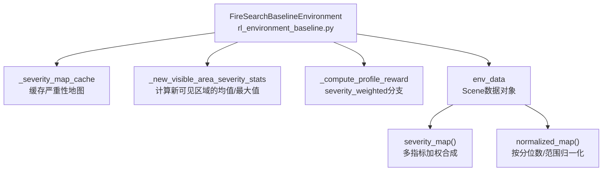
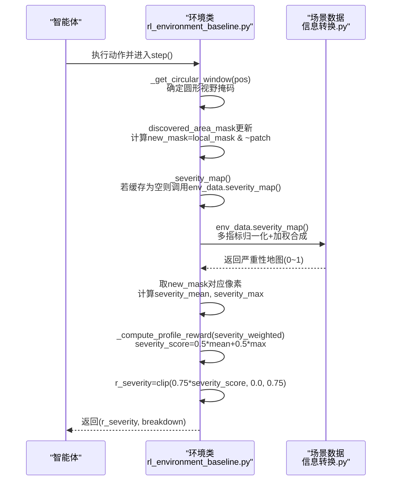
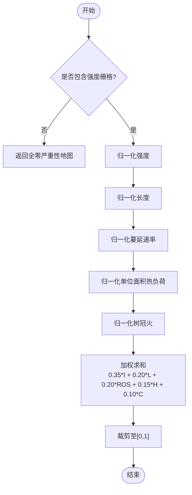
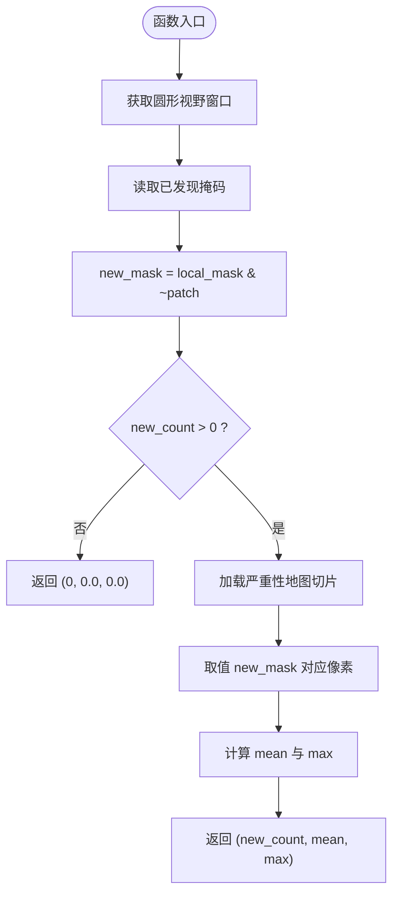
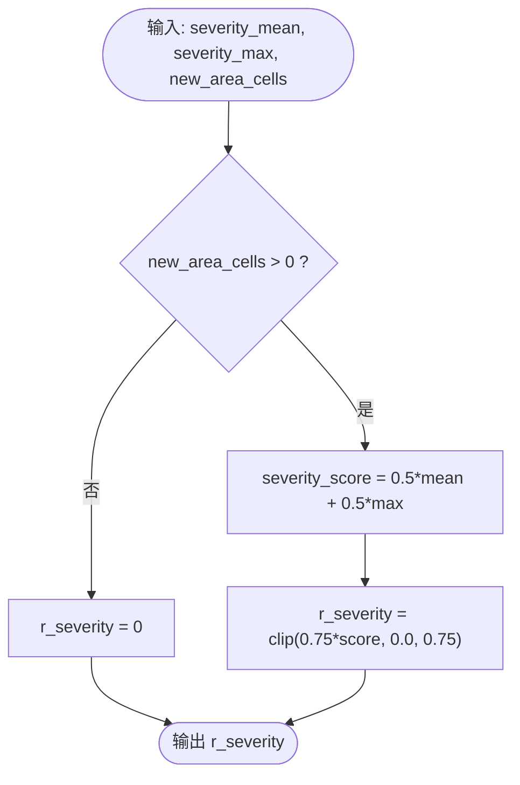
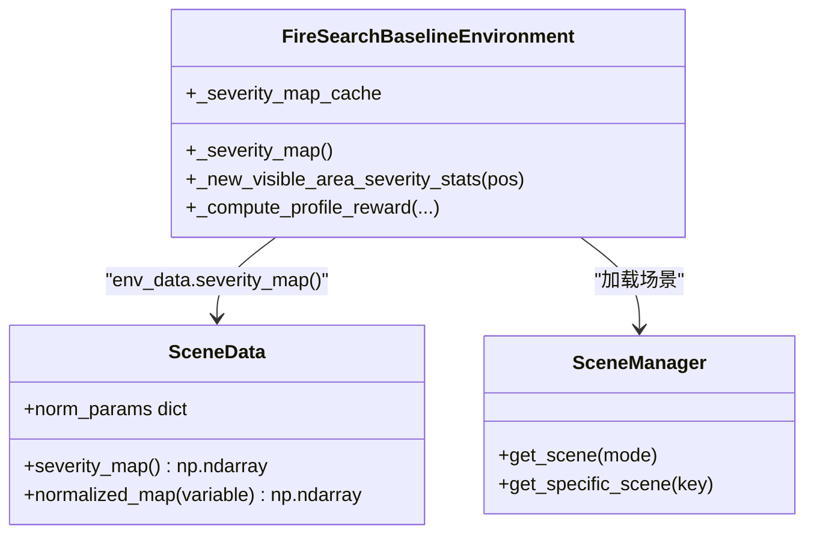

# 严重性加权奖励

<cite>
**本文引用的文件**   
- [rl_environment_baseline.py](file://environment_variables/environment_variables/rl_environment_baseline.py)
- [信息转换.py](file://environment_variables/environment_variables/信息转换.py)
</cite>

## 目录
1. [简介](#简介)
2. [项目结构](#项目结构)
3. [核心组件](#核心组件)
4. [架构总览](#架构总览)
5. [详细组件分析](#详细组件分析)
6. [依赖关系分析](#依赖关系分析)
7. [性能与复杂度](#性能与复杂度)
8. [调优策略与平衡方法](#调优策略与平衡方法)
9. [故障排查指南](#故障排查指南)
10. [结论](#结论)

## 简介
本文件围绕“严重性加权奖励”机制进行系统化文档化，重点解释以下方面：
- _severity_weighted 奖励模式的设计理念与数学模型
- severity_mean 与 severity_max 的特征提取流程
- 严重性地图的生成与缓存（_severity_map_cache、env_data.severity_map）
- 评分与奖励计算：severity_score = 0.5 * severity_mean + 0.5 * severity_max；r_severity = clip(0.75 * severity_score, 0.0, 0.75)
- 在火灾搜索任务中的物理意义与应用价值
- 权重调优策略及与其他奖励函数的平衡方法
- 以代码片段路径形式给出关键实现位置

## 项目结构
与严重性加权奖励相关的核心代码位于环境类与数据场景模块中：
- 环境类负责步级奖励计算、可见区域统计、严重性地图缓存访问
- 场景数据模块负责多源栅格归一化与严重性地图合成

图表来源
- [rl_environment_baseline.py:277-287](file://environment_variables/environment_variables/rl_environment_baseline.py#L277-L287)
- [rl_environment_baseline.py:516-519](file://environment_variables/environment_variables/rl_environment_baseline.py#L516-L519)
- [rl_environment_baseline.py:788-793](file://environment_variables/environment_variables/rl_environment_baseline.py#L788-L793)
- [信息转换.py:903-918](file://environment_variables/environment_variables/信息转换.py#L903-L918)
- [信息转换.py:616-637](file://environment_variables/environment_variables/信息转换.py#L616-L637)

章节来源
- [rl_environment_baseline.py:277-287](file://environment_variables/environment_variables/rl_environment_baseline.py#L277-L287)
- [rl_environment_baseline.py:516-519](file://environment_variables/environment_variables/rl_environment_baseline.py#L516-L519)
- [rl_environment_baseline.py:788-793](file://environment_variables/environment_variables/rl_environment_baseline.py#L788-L793)
- [信息转换.py:903-918](file://environment_variables/environment_variables/信息转换.py#L903-L918)
- [信息转换.py:616-637](file://environment_variables/environment_variables/信息转换.py#L616-L637)

## 核心组件
- 严重性地图生成器：基于多源火场指标（强度、火焰长度、蔓延速率、单位面积热负荷、树冠火概率等）经归一化后线性加权合成，输出[0,1]区间像素图。
- 严重性特征提取器：对无人机视野内“新可见区域”的严重性像素求均值与最大值，作为该步的严重性特征。
- 严重性加权奖励：将上述两个特征以等权组合为severity_score，再乘以0.75并裁剪到[0, 0.75]得到r_severity。

章节来源
- [信息转换.py:903-918](file://environment_variables/environment_variables/信息转换.py#L903-L918)
- [rl_environment_baseline.py:277-287](file://environment_variables/environment_variables/rl_environment_baseline.py#L277-L287)
- [rl_environment_baseline.py:788-793](file://environment_variables/environment_variables/rl_environment_baseline.py#L788-L793)

## 架构总览
下图展示了从场景数据到最终奖励的关键调用链与数据流。

图表来源
- [rl_environment_baseline.py:277-287](file://environment_variables/environment_variables/rl_environment_baseline.py#L277-L287)
- [rl_environment_baseline.py:516-519](file://environment_variables/environment_variables/rl_environment_baseline.py#L516-L519)
- [信息转换.py:903-918](file://environment_variables/environment_variables/信息转换.py#L903-L918)
- [rl_environment_baseline.py:788-793](file://environment_variables/environment_variables/rl_environment_baseline.py#L788-L793)

## 详细组件分析

### 严重性地图生成与缓存
- 生成逻辑：
  - 从场景数据中读取多个火场相关栅格（如强度、火焰长度、蔓延速率、单位面积热负荷、树冠火），分别通过归一化映射到[0,1]。
  - 使用固定权重线性融合：强度0.35、长度0.20、蔓延速率0.20、单位面积热负荷0.15、树冠火0.10，最后裁剪至[0,1]。
- 缓存机制：
  - 环境类维护一个实例级缓存变量，首次访问时调用场景数据的严重性地图方法并保存结果，后续直接复用，避免重复计算。
- 归一化细节：
  - 采用分位数或极值缩放，不同字段有对应的最大参考值；DEM采用[min,max]线性归一化。

图表来源
- [信息转换.py:903-918](file://environment_variables/environment_variables/信息转换.py#L903-L918)
- [信息转换.py:616-637](file://environment_variables/environment_variables/信息转换.py#L616-L637)

章节来源
- [信息转换.py:903-918](file://environment_variables/environment_variables/信息转换.py#L903-L918)
- [信息转换.py:616-637](file://environment_variables/environment_variables/信息转换.py#L616-L637)
- [rl_environment_baseline.py:516-519](file://environment_variables/environment_variables/rl_environment_baseline.py#L516-L519)

### 严重性特征提取（severity_mean 与 severity_max）
- 步骤：
  - 根据当前位置构建圆形视野窗口，并与已发现区域掩码做差，得到“新可见区域”掩码。
  - 若新可见区域为空，返回计数0与两个严重性特征0。
  - 否则，从严重性地图中取出新可见区域像素，计算均值与最大值。
- 复杂度：
  - 时间复杂度O(A)，A为视野内像素数；空间复杂度O(A)。

图表来源
- [rl_environment_baseline.py:277-287](file://environment_variables/environment_variables/rl_environment_baseline.py#L277-L287)
- [rl_environment_baseline.py:516-519](file://environment_variables/environment_variables/rl_environment_baseline.py#L516-L519)

章节来源
- [rl_environment_baseline.py:277-287](file://environment_variables/environment_variables/rl_environment_baseline.py#L277-L287)
- [rl_environment_baseline.py:516-519](file://environment_variables/environment_variables/rl_environment_baseline.py#L516-L519)

### 严重性加权奖励计算
- 触发条件：当reward_profile设置为severity_weighted且新可见区域大于0时生效。
- 计算公式：
  - severity_score = 0.5 * severity_mean + 0.5 * severity_max
  - r_severity = clip(0.75 * severity_score, 0.0, 0.75)
- 设计意图：
  - 等权融合均值与最大值，兼顾整体风险水平与局部极端危险点。
  - 0.75缩放与上界裁剪保证该子项不会主导总奖励，便于与其他奖励项协同。

图表来源
- [rl_environment_baseline.py:788-793](file://environment_variables/environment_variables/rl_environment_baseline.py#L788-L793)

章节来源
- [rl_environment_baseline.py:788-793](file://environment_variables/environment_variables/rl_environment_baseline.py#L788-L793)

### 代码示例路径（不展示具体代码内容）
- 严重性地图生成与缓存
  - [严重性地图合成:903-918](file://environment_variables/environment_variables/信息转换.py#L903-L918)
  - [归一化映射实现:616-637](file://environment_variables/environment_variables/信息转换.py#L616-L637)
  - [严重性地图缓存访问:516-519](file://environment_variables/environment_variables/rl_environment_baseline.py#L516-L519)
- 严重性特征提取
  - [新可见区域严重性统计:277-287](file://environment_variables/environment_variables/rl_environment_baseline.py#L277-L287)
- 严重性加权奖励
  - [severity_weighted分支:788-793](file://environment_variables/environment_variables/rl_environment_baseline.py#L788-L793)

## 依赖关系分析
- 环境类依赖场景数据模块提供严重性地图与归一化能力。
- 严重性地图由多个栅格字段共同决定，任一缺失会回退为零矩阵。
- 缓存仅存在于环境实例生命周期内，场景切换时会重新初始化。

图表来源
- [rl_environment_baseline.py:516-519](file://environment_variables/environment_variables/rl_environment_baseline.py#L516-L519)
- [信息转换.py:903-918](file://environment_variables/environment_variables/信息转换.py#L903-L918)
- [信息转换.py:616-637](file://environment_variables/environment_variables/信息转换.py#L616-L637)

章节来源
- [rl_environment_baseline.py:516-519](file://environment_variables/environment_variables/rl_environment_baseline.py#L516-L519)
- [信息转换.py:903-918](file://environment_variables/environment_variables/信息转换.py#L903-L918)
- [信息转换.py:616-637](file://environment_variables/environment_variables/信息转换.py#L616-L637)

## 性能与复杂度
- 严重性地图生成：
  - 每场景一次，涉及多次栅格归一化与加权求和，时间复杂度O(HW)，H、W为地图尺寸。
- 缓存命中：
  - 单步查询O(1)（数组切片与索引）。
- 特征提取：
  - 每步O(A)，A为视野内像素数，通常远小于HW。
- 内存占用：
  - 严重性地图为float32二维数组，大小约HW字节量级。

优化建议
- 若视野半径较大，可考虑对严重性地图进行下采样后再插值，减少逐像素操作开销。
- 对频繁访问的局部窗口可采用滑动窗口增量更新策略（需权衡实现复杂度）。

[本节为通用性能讨论，无需特定文件引用]

## 调优策略与平衡方法
- 严重性权重调整
  - 当前严重性地图内部权重：强度0.35、长度0.20、蔓延速率0.20、单位面积热负荷0.15、树冠火0.10。可根据任务侧重点调整这些系数，例如更关注蔓延速度时可提升ros权重。
- 奖励融合权重
  - severity_weighted分支的0.75缩放与0.75上限用于控制该项对总奖励的影响幅度。若希望更强调高风险探索，可适当提高缩放系数或上界；反之降低以避免过度冒险。
- 与其他奖励项的平衡
  - 边界覆盖奖励、前沿探测奖励、探索奖励等可与严重性加权并行存在。建议：
    - 保持r_severity的上界不超过其他主要奖励项的量级，防止梯度主导。
    - 在训练早期适当提高探索奖励，后期逐步引入严重性加权引导向高价值区域。
- 参数敏感性
  - 建议对0.5/0.5融合比例、0.75缩放与上界进行网格搜索或贝叶斯优化，结合验证集覆盖率与平均episode奖励评估。

[本节为通用指导，无需特定文件引用]

## 故障排查指南
- 严重性地图为空
  - 现象：所有位置严重性值为0，导致r_severity恒为0。
  - 排查：确认场景数据中包含“intensity”等必要栅格；检查归一化参数是否正确导出。
  - 参考路径：
    - [严重性地图生成:903-918](file://environment_variables/environment_variables/信息转换.py#L903-L918)
    - [归一化映射:616-637](file://environment_variables/environment_variables/信息转换.py#L616-L637)
- 缓存未更新
  - 现象：场景切换后仍使用旧地图。
  - 排查：确保每次加载新场景时重置缓存变量。
  - 参考路径：
    - [缓存初始化与访问:516-519](file://environment_variables/environment_variables/rl_environment_baseline.py#L516-L519)
- 新可见区域始终为0
  - 现象：r_severity从未被触发。
  - 排查：检查已发现掩码更新逻辑与视野窗口计算；确认无人机移动确实带来新像素。
  - 参考路径：
    - [新可见区域统计:277-287](file://environment_variables/environment_variables/rl_environment_baseline.py#L277-L287)

章节来源
- [信息转换.py:903-918](file://environment_variables/environment_variables/信息转换.py#L903-L918)
- [信息转换.py:616-637](file://environment_variables/environment_variables/信息转换.py#L616-L637)
- [rl_environment_baseline.py:516-519](file://environment_variables/environment_variables/rl_environment_baseline.py#L516-L519)
- [rl_environment_baseline.py:277-287](file://environment_variables/environment_variables/rl_environment_baseline.py#L277-L287)

## 结论
严重性加权奖励通过将多源火场指标融合为统一的风险地图，并以均值与最大值表征新探索区域的整体与极端风险，从而引导智能体优先探索高价值、高风险区域。其设计兼顾了稳定性（裁剪与缩放）与灵活性（可调节权重与融合比例），在多奖励框架下具备良好的可扩展性与鲁棒性。实际应用中，应结合任务目标与数据分布进行系统性的参数调优与消融实验。