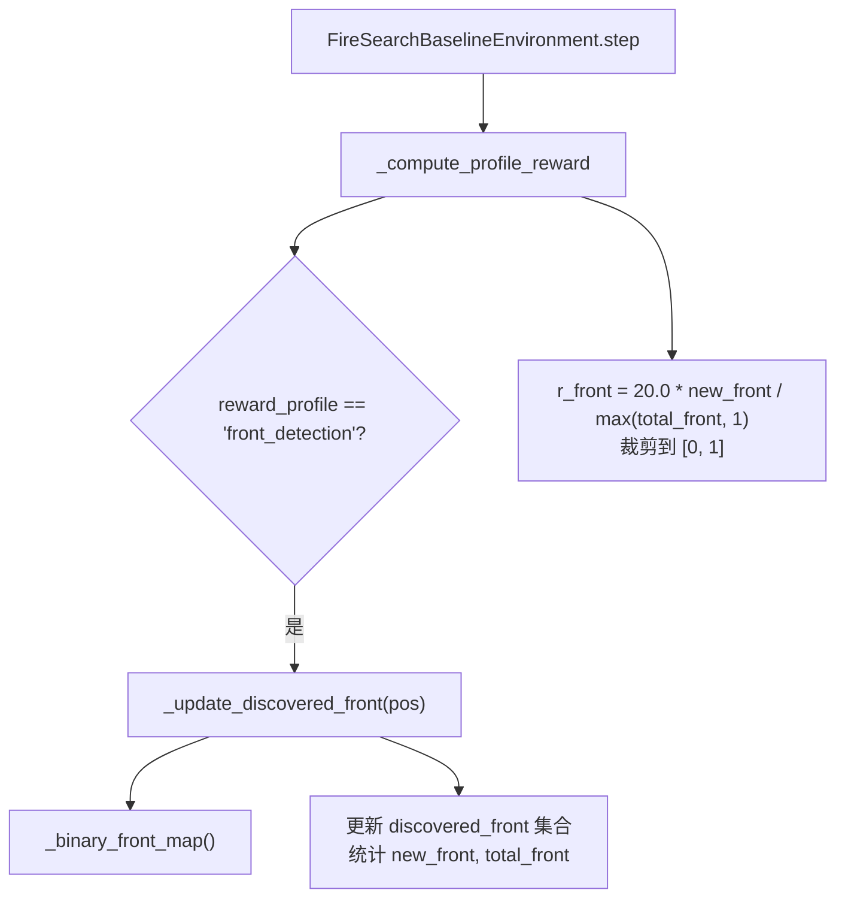
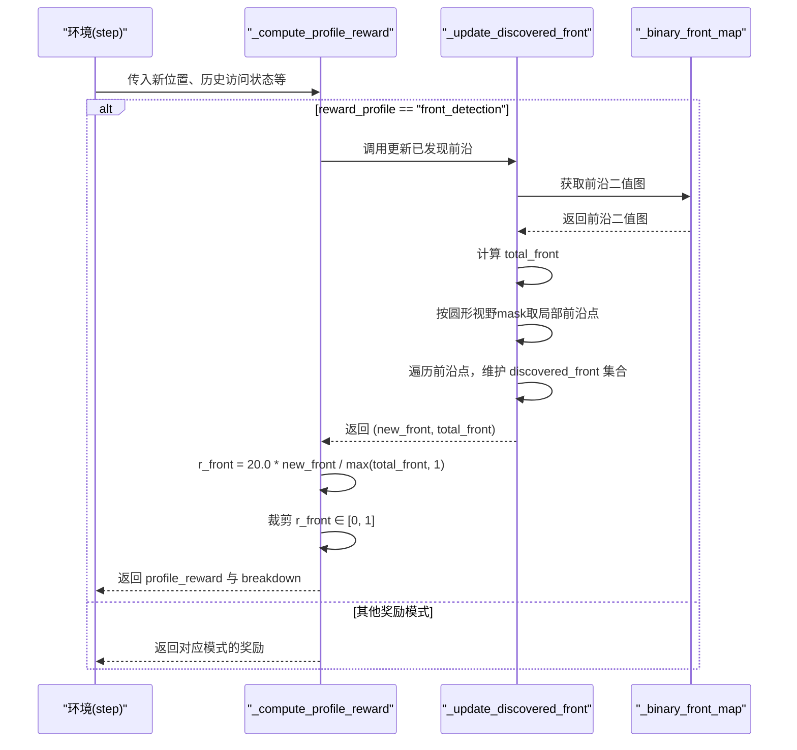
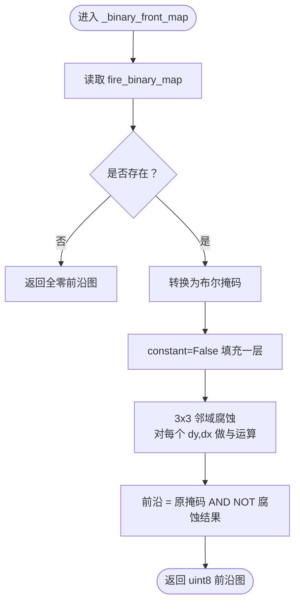
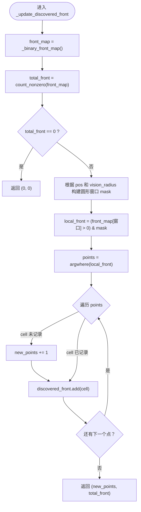
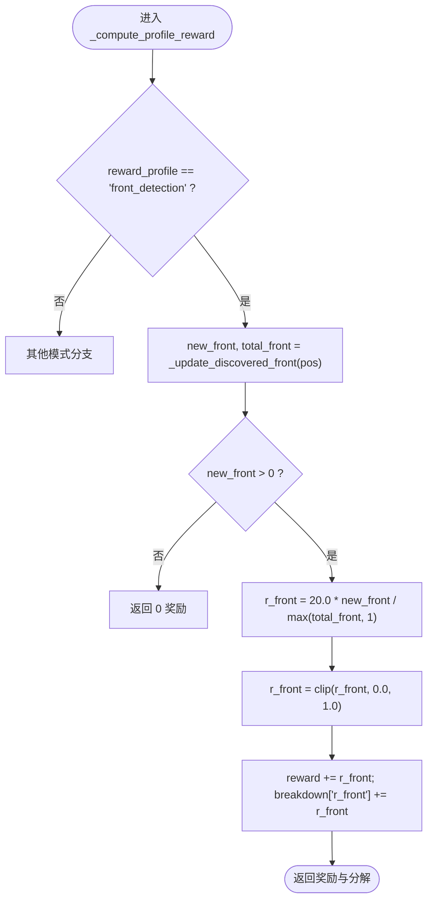
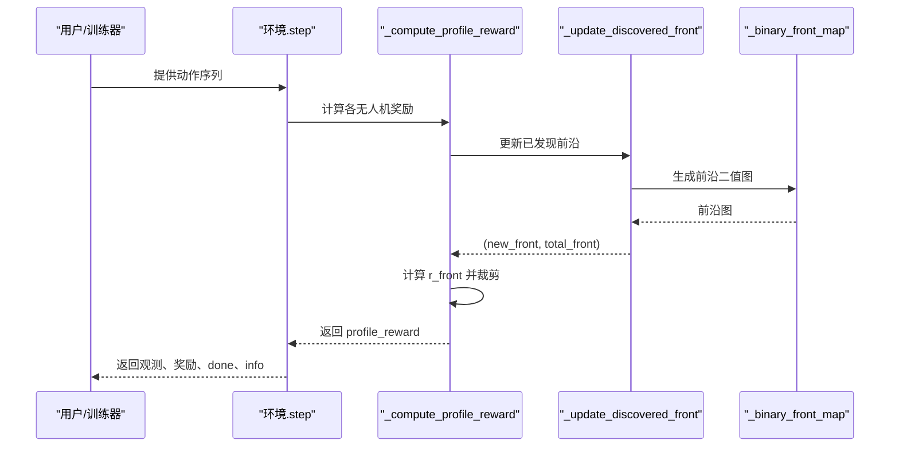
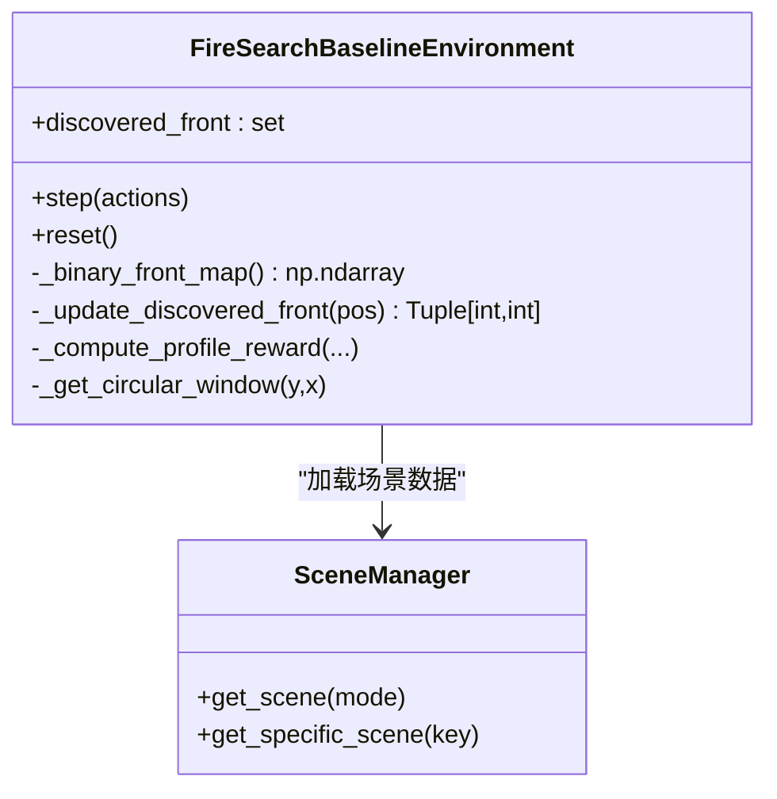

# 前沿检测奖励

<cite>
**本文引用的文件**
- [rl_environment_baseline.py](file://environment_variables/environment_variables/rl_environment_baseline.py)
</cite>

## 目录
1. [简介](#简介)
2. [项目结构](#项目结构)
3. [核心组件](#核心组件)
4. [架构总览](#架构总览)
5. [详细组件分析](#详细组件分析)
6. [依赖关系分析](#依赖关系分析)
7. [性能考虑](#性能考虑)
8. [故障排查指南](#故障排查指南)
9. [结论](#结论)
10. [附录：代码示例路径](#附录代码示例路径)

## 简介
本文件聚焦于“前沿检测奖励”模式（reward_profile = "front_detection"）的实现与工作机制，围绕以下关键点展开：
- _binary_front_map 方法的前沿提取算法、形态学腐蚀操作与前沿点识别逻辑
- _update_discovered_front 的工作原理：局部视野内的前沿点检测、discovered_front 集合维护与 new_front 计数机制
- 前沿检测奖励计算公式 r_front = 20.0 * new_front / total_front，以及上限裁剪为 1.0
- 前沿地图的二值化处理和边缘检测方法
- 参数调优建议与性能优化技巧
- 通过具体代码片段路径展示前沿检测与奖励计算过程

## 项目结构
该功能位于环境类 FireSearchBaselineEnvironment 中，属于多无人机火场边界搜索环境的基线实现。与前沿检测相关的核心逻辑集中在以下位置：
- 前沿二值图生成：_binary_front_map
- 已发现前沿更新与计数：_update_discovered_front
- 前沿检测奖励计算入口：_compute_profile_reward（当 reward_profile == "front_detection"）
- 步骤主循环：step（调用上述函数并汇总奖励）

图表来源
- [rl_environment_baseline.py:769-806](file://environment_variables/environment_variables/rl_environment_baseline.py#L769-L806)
- [rl_environment_baseline.py:289-304](file://environment_variables/environment_variables/rl_environment_baseline.py#L289-L304)
- [rl_environment_baseline.py:504-514](file://environment_variables/environment_variables/rl_environment_baseline.py#L504-L514)

章节来源
- [rl_environment_baseline.py:769-806](file://environment_variables/environment_variables/rl_environment_baseline.py#L769-L806)
- [rl_environment_baseline.py:289-304](file://environment_variables/environment_variables/rl_environment_baseline.py#L289-L304)
- [rl_environment_baseline.py:504-514](file://environment_variables/environment_variables/rl_environment_baseline.py#L504-L514)

## 核心组件
- 前沿二值图生成器：_binary_front_map
  - 输入：env_data.fire_binary_map（火场二值图）
  - 输出：前沿二值图（uint8），值为 1 表示前沿像素，0 表示非前沿
  - 关键步骤：
    - 将 fire_binary_map 转为布尔掩码
    - 使用 3x3 邻域进行形态学腐蚀（逐像素与 3x3 窗口内所有平移后的掩码做与运算）
    - 前沿 = 原掩码 AND NOT 腐蚀结果
- 已发现前沿更新器：_update_discovered_front
  - 输入：当前无人机位置 pos
  - 输出：(new_front, total_front)
  - 关键步骤：
    - 计算全局前沿总数 total_front
    - 基于圆形视野 mask 截取局部区域
    - 在局部区域内识别前沿点，遍历每个前沿点坐标，若不在 discovered_front 则 new_front += 1
    - 将当前视野内的所有前沿点加入 discovered_front 集合
- 前沿检测奖励计算：_compute_profile_reward
  - 条件：reward_profile == "front_detection"
  - 计算：r_front = 20.0 * new_front / max(total_front, 1)，再裁剪至 [0, 1]
  - 累加到 episode 奖励分解 r_breakdown["r_front"]

章节来源
- [rl_environment_baseline.py:504-514](file://environment_variables/environment_variables/rl_environment_baseline.py#L504-L514)
- [rl_environment_baseline.py:289-304](file://environment_variables/environment_variables/rl_environment_baseline.py#L289-L304)
- [rl_environment_baseline.py:769-806](file://environment_variables/environment_variables/rl_environment_baseline.py#L769-L806)

## 架构总览
从 step 到前沿奖励的完整流程如下：

图表来源
- [rl_environment_baseline.py:842-992](file://environment_variables/environment_variables/rl_environment_baseline.py#L842-L992)
- [rl_environment_baseline.py:769-806](file://environment_variables/environment_variables/rl_environment_baseline.py#L769-L806)
- [rl_environment_baseline.py:289-304](file://environment_variables/environment_variables/rl_environment_baseline.py#L289-L304)
- [rl_environment_baseline.py:504-514](file://environment_variables/environment_variables/rl_environment_baseline.py#L504-L514)

## 详细组件分析

### 组件一：_binary_front_map（前沿二值图生成）
- 目标：从火场二值图提取前沿（边界）像素
- 算法要点：
  - 二值化：fire_binary_map > 0 得到布尔掩码
  - 形态学腐蚀：对布尔掩码执行一次 3x3 全连接核的腐蚀（等价于对每个像素与其 3x3 邻域做与运算）
  - 前沿提取：原掩码减去腐蚀结果，即 fire & ~eroded
- 复杂度：O(HW) 像素级操作，常数核大小；内存占用 O(HW)
- 边界处理：使用 constant=False 填充，确保边缘像素参与腐蚀判断
- 适用性：适用于离散栅格上的火场前沿近似，能抑制内部噪声并保留薄边界

图表来源
- [rl_environment_baseline.py:504-514](file://environment_variables/environment_variables/rl_environment_baseline.py#L504-L514)

章节来源
- [rl_environment_baseline.py:504-514](file://environment_variables/environment_variables/rl_environment_baseline.py#L504-L514)

### 组件二：_update_discovered_front（已发现前沿更新）
- 目标：在当前位置的圆形视野内识别新发现的前沿点，并维护全局已发现集合
- 输入：pos（无人机当前位置）
- 输出：(new_front, total_front)
- 关键步骤：
  - 计算全局前沿总数 total_front
  - 根据圆形视野 mask 截取局部区域
  - 在局部区域内筛选前沿点（front_map > 0 且 local_mask 为真）
  - 遍历这些前沿点，若未在 discovered_front 中则 new_front += 1
  - 将所有当前视野内的前沿点加入 discovered_front
- 注意：
  - 当 total_front == 0 时直接返回 (0, 0)，避免除零
  - discovered_front 为全局集合，跨步累积，保证不重复计数

图表来源
- [rl_environment_baseline.py:289-304](file://environment_variables/environment_variables/rl_environment_baseline.py#L289-L304)

章节来源
- [rl_environment_baseline.py:289-304](file://environment_variables/environment_variables/rl_environment_baseline.py#L289-L304)

### 组件三：前沿检测奖励计算（_compute_profile_reward）
- 触发条件：reward_profile == "front_detection"
- 计算流程：
  - 调用 _update_discovered_front(pos) 获取 (new_front, total_front)
  - 若 new_front > 0，计算 r_front = 20.0 * new_front / max(total_front, 1)
  - 将 r_front 裁剪到 [0, 1]
  - 累加到 reward 与 breakdown["r_front"]
- 设计意图：
  - 鼓励无人机探索新的前沿区域
  - 以 total_front 归一化，使奖励在不同场景规模下具有可比性
  - 上限裁剪防止单步奖励过大导致训练不稳定

图表来源
- [rl_environment_baseline.py:769-806](file://environment_variables/environment_variables/rl_environment_baseline.py#L769-L806)

章节来源
- [rl_environment_baseline.py:769-806](file://environment_variables/environment_variables/rl_environment_baseline.py#L769-L806)

### 概念性概览：前沿检测奖励的工作流
下图展示了从环境步进到前沿奖励计算的端到端流程，便于理解整体交互。

图表来源
- [rl_environment_baseline.py:842-992](file://environment_variables/environment_variables/rl_environment_baseline.py#L842-L992)
- [rl_environment_baseline.py:769-806](file://environment_variables/environment_variables/rl_environment_baseline.py#L769-L806)
- [rl_environment_baseline.py:289-304](file://environment_variables/environment_variables/rl_environment_baseline.py#L289-L304)
- [rl_environment_baseline.py:504-514](file://environment_variables/environment_variables/rl_environment_baseline.py#L504-L514)

## 依赖关系分析
- 数据依赖：
  - env_data.fire_binary_map：火场二值图，作为前沿提取的基础
  - env_data.get_local_fire_info、env_data.severity_map：用于其他观测与奖励分支，但前沿检测主要依赖 fire_binary_map
- 内部依赖：
  - _get_circular_window：用于构造圆形视野 mask
  - discovered_front：全局集合，跨步累积
- 外部依赖：
  - numpy：数组与布尔运算、计数、索引
  - gymnasium：环境接口

图表来源
- [rl_environment_baseline.py:1-120](file://environment_variables/environment_variables/rl_environment_baseline.py#L1-L120)
- [rl_environment_baseline.py:504-514](file://environment_variables/environment_variables/rl_environment_baseline.py#L504-L514)
- [rl_environment_baseline.py:289-304](file://environment_variables/environment_variables/rl_environment_baseline.py#L289-L304)
- [rl_environment_baseline.py:769-806](file://environment_variables/environment_variables/rl_environment_baseline.py#L769-L806)

章节来源
- [rl_environment_baseline.py:1-120](file://environment_variables/environment_variables/rl_environment_baseline.py#L1-L120)
- [rl_environment_baseline.py:504-514](file://environment_variables/environment_variables/rl_environment_baseline.py#L504-L514)
- [rl_environment_baseline.py:289-304](file://environment_variables/environment_variables/rl_environment_baseline.py#L289-L304)
- [rl_environment_baseline.py:769-806](file://environment_variables/environment_variables/rl_environment_baseline.py#L769-L806)

## 性能考虑
- 时间复杂度：
  - _binary_front_map：O(HW)，H、W 为栅格尺寸
  - _update_discovered_front：O(HW) 用于计数与局部筛选，实际热点在于局部前沿点数量 K，循环开销 O(K)
- 空间复杂度：
  - 前沿图 O(HW)
  - discovered_front 集合最坏 O(HW)
- 优化建议：
  - 缓存前沿图：若场景短时间不变，可缓存 front_map 并在固定周期刷新，减少重复计算
  - 向量化更新：用集合差集或位图操作替代 Python 层 for 循环，降低 K 遍历时序开销
  - 视野裁剪优化：仅对圆形窗口内的子矩阵进行布尔运算，已在实现中使用局部 mask
  - 阈值与核大小：3x3 核较小，适合薄边界；如需更稳健的边缘，可考虑更大核或多次腐蚀，但会显著增加计算量

## 故障排查指南
- 现象：r_front 始终为 0
  - 可能原因：
    - total_front == 0：无前沿像素，检查 fire_binary_map 是否正确生成
    - new_front == 0：无人机视野内未发现新前沿点，检查 vision_radius 与移动策略
  - 定位路径：
    - 查看 _update_discovered_front 返回值与 discovered_front 增长情况
- 现象：r_front 频繁达到上限 1.0
  - 可能原因：
    - new_front 较大且 total_front 较小，导致比例高
    - 视野过小或前沿稀疏
  - 调整建议：
    - 适当增大 vision_radius 或调整 20.0 系数
    - 引入平滑或衰减因子，避免奖励尖峰
- 现象：训练不稳定或收敛慢
  - 可能原因：
    - 奖励尺度过大或过小
    - 前沿图噪声较多
  - 调整建议：
    - 调整 r_front 上限裁剪范围或缩放系数
    - 对 fire_binary_map 进行轻微平滑或形态学开闭操作后再提取前沿

章节来源
- [rl_environment_baseline.py:289-304](file://environment_variables/environment_variables/rl_environment_baseline.py#L289-L304)
- [rl_environment_baseline.py:504-514](file://environment_variables/environment_variables/rl_environment_baseline.py#L504-L514)
- [rl_environment_baseline.py:769-806](file://environment_variables/environment_variables/rl_environment_baseline.py#L769-L806)

## 结论
前沿检测奖励模式通过简洁而有效的二值前沿提取与增量计数机制，为无人机提供了明确的探索信号。其核心优势在于：
- 前沿提取算法简单高效，易于并行化与缓存
- 增量计数与集合维护避免了重复奖励，鼓励持续探索
- 归一化与上限裁剪保证了奖励的稳定性和可比性
在实际应用中，可通过调节视野半径、前沿核大小与奖励系数来平衡探索效率与训练稳定性。

## 附录：代码示例路径
- 前沿二值图生成（_binary_front_map）
  - 路径：[rl_environment_baseline.py:504-514](file://environment_variables/environment_variables/rl_environment_baseline.py#L504-L514)
- 已发现前沿更新（_update_discovered_front）
  - 路径：[rl_environment_baseline.py:289-304](file://environment_variables/environment_variables/rl_environment_baseline.py#L289-L304)
- 前沿检测奖励计算（_compute_profile_reward）
  - 路径：[rl_environment_baseline.py:769-806](file://environment_variables/environment_variables/rl_environment_baseline.py#L769-L806)
- 步骤主循环与环境接口（step）
  - 路径：[rl_environment_baseline.py:842-992](file://environment_variables/environment_variables/rl_environment_baseline.py#L842-L992)