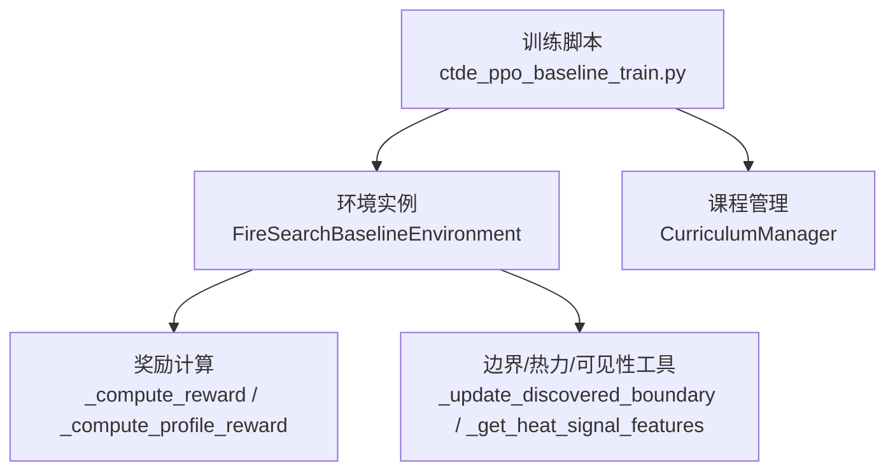
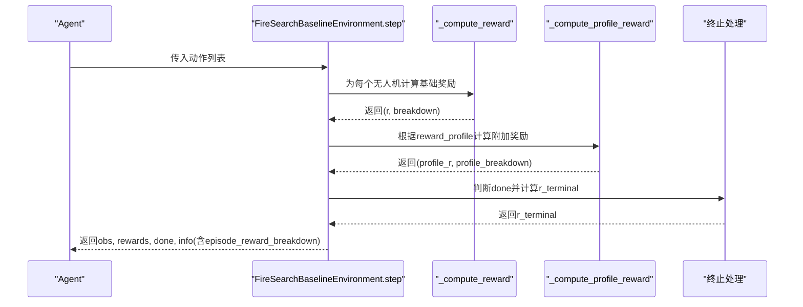
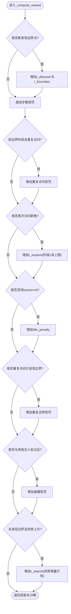
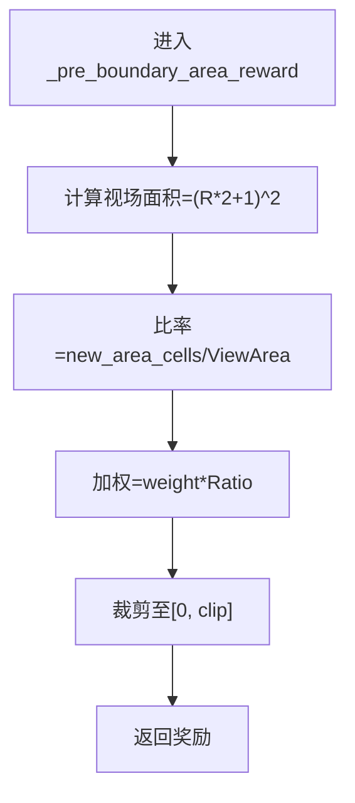
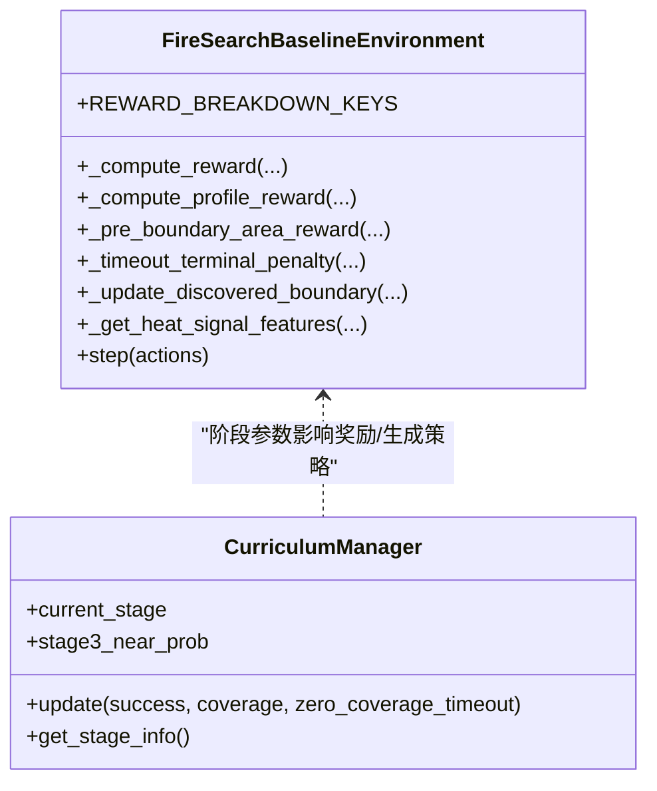

# 奖励分解机制

<cite>
**本文引用的文件**   
- [rl_environment_baseline.py](file://environment_variables/environment_variables/rl_environment_baseline.py)
- [ctde_ppo_baseline_train.py](file://environment_variables/environment_variables/ctde_ppo_baseline_train.py)
</cite>

## 目录
1. [简介](#简介)
2. [项目结构](#项目结构)
3. [核心组件](#核心组件)
4. [架构总览](#架构总览)
5. [详细组件分析](#详细组件分析)
6. [依赖关系分析](#依赖关系分析)
7. [性能与稳定性考量](#性能与稳定性考量)
8. [故障排查指南](#故障排查指南)
9. [结论](#结论)
10. [附录：调试与监控示例](#附录调试与监控示例)

## 简介
本文件围绕“奖励分解机制”展开，系统性解释 REWARD_BREAKDOWN_KEYS 中各奖励分量的定义与作用，深入剖析 _compute_reward 的基础奖励计算逻辑（边界发现奖励、步数惩罚、重复访问惩罚、空闲惩罚、碰撞惩罚），并说明 _pre_boundary_area_reward 的前边界区域引导奖励机制与热势增量检测。同时给出课程学习阶段对奖励权重的动态调整策略，并提供奖励分解数据的收集与分析方法，包括 episode_reward_breakdown 的使用与训练监控要点。

## 项目结构
- 环境实现位于 rl_environment_baseline.py，包含 FireSearchBaselineEnvironment 类，负责观测、动作执行、状态更新与奖励计算。
- 训练脚本 ctde_ppo_baseline_train.py 提供 CTDE-PPO 训练流程、课程管理器 CurriculumManager 以及日志记录与评估汇总逻辑。

图表来源
- [rl_environment_baseline.py:692-767](file://environment_variables/environment_variables/rl_environment_baseline.py#L692-L767)
- [rl_environment_baseline.py:769-806](file://environment_variables/environment_variables/rl_environment_baseline.py#L769-L806)
- [rl_environment_baseline.py:808-819](file://environment_variables/environment_variables/rl_environment_baseline.py#L808-L819)
- [ctde_ppo_baseline_train.py:569-757](file://environment_variables/environment_variables/ctde_ppo_baseline_train.py#L569-L757)

章节来源
- [rl_environment_baseline.py:1-120](file://environment_variables/environment_variables/rl_environment_baseline.py#L1-L120)
- [ctde_ppo_baseline_train.py:1-120](file://environment_variables/environment_variables/ctde_ppo_baseline_train.py#L1-L120)

## 核心组件
- 奖励分解键集合 REWARD_BREAKDOWN_KEYS 定义了所有可追踪的奖励分量键名，用于在每步和每回合累计明细。
- 基础奖励计算 _compute_reward 负责：
  - 边界发现奖励 r_discover/r_boundary
  - 步数惩罚 step_penalty
  - 前边界重复访问惩罚 pre_boundary_repeat_penalty
  - 新区域探索奖励 r_explore
  - 空闲惩罚 idle_penalty
  - 已发现边界重复访问惩罚
  - 多机碰撞惩罚
  - 搜索引导奖励 r_search（基于热势增量）
- 轮廓奖励 _compute_profile_reward 负责根据 reward_profile 注入 r_coverage_gain、r_area_gain、r_front、r_severity 等。
- 终止奖励 r_terminal 在 episode 结束时按完成或超时/耗尽电池进行加/减。

章节来源
- [rl_environment_baseline.py:36-47](file://environment_variables/environment_variables/rl_environment_baseline.py#L36-L47)
- [rl_environment_baseline.py:692-767](file://environment_variables/environment_variables/rl_environment_baseline.py#L692-L767)
- [rl_environment_baseline.py:769-806](file://environment_variables/environment_variables/rl_environment_baseline.py#L769-L806)
- [rl_environment_baseline.py:948-962](file://environment_variables/environment_variables/rl_environment_baseline.py#L948-L962)

## 架构总览
下图展示了单步内从动作到奖励分解的关键调用链与数据流。

图表来源
- [rl_environment_baseline.py:842-992](file://environment_variables/environment_variables/rl_environment_baseline.py#L842-L992)
- [rl_environment_baseline.py:692-767](file://environment_variables/environment_variables/rl_environment_baseline.py#L692-L767)
- [rl_environment_baseline.py:769-806](file://environment_variables/environment_variables/rl_environment_baseline.py#L769-L806)
- [rl_environment_baseline.py:948-962](file://environment_variables/environment_variables/rl_environment_baseline.py#L948-L962)

## 详细组件分析

### 奖励分量定义与作用
- r_discover：首次发现当前时刻真实边界点时的即时奖励，随课程阶段递减以鼓励早期快速定位。
- r_boundary：与 r_discover 同值，作为“边界发现”维度的聚合项，便于统计。
- r_coverage_gain：基于新增可见边界点数相对总边界点的覆盖率增益，乘以权重并裁剪上限，鼓励持续覆盖。
- r_area_gain：在前边界阶段（尚未发现任何边界点）且视野内出现新面积单元时，按视场面积归一化的区域增长奖励，用于引导探索。
- r_front：当 reward_profile 为 front_detection 时，基于新发现前沿点数的比例奖励。
- r_severity：当 reward_profile 为 severity_weighted 时，基于新可见区域的严重度均值与最大值的加权评分。
- r_explore：新访问未访问过的网格单元的探索奖励；在阶段1有累计上限控制，避免过度探索。
- r_search：前边界阶段的弱搜索引导，基于当前位置与上一位置的热势差（仅正增量）给予小幅度奖励，帮助靠近热源。
- r_penalty：汇总各类惩罚，包括步数惩罚、空闲惩罚、重复访问惩罚、碰撞惩罚等。
- r_terminal：回合结束时的终局奖励或惩罚，成功提前完成给正向效率加成，超时或电量耗尽给负向惩罚。

章节来源
- [rl_environment_baseline.py:36-47](file://environment_variables/environment_variables/rl_environment_baseline.py#L36-L47)
- [rl_environment_baseline.py:692-767](file://environment_variables/environment_variables/rl_environment_baseline.py#L692-L767)
- [rl_environment_baseline.py:769-806](file://environment_variables/environment_variables/rl_environment_baseline.py#L769-L806)
- [rl_environment_baseline.py:808-819](file://environment_variables/environment_variables/rl_environment_baseline.py#L808-L819)
- [rl_environment_baseline.py:948-962](file://environment_variables/environment_variables/rl_environment_baseline.py#L948-L962)

### _compute_reward 基础奖励计算逻辑
- 边界发现奖励：若新位置属于当前边界集且未被发现，则依据课程阶段赋予不同大小的 r_discover，并同步计入 r_boundary。
- 步数惩罚：每步固定惩罚，阶段1较小，其他阶段较大，抑制无意义拖延。
- 重复访问惩罚（前边界窗口）：在未检测到任何边界点时，若最近窗口内重复进入同一格，施加额外惩罚，防止原地打转。
- 探索奖励：首次访问新单元格时给予 r_explore；阶段1设置累计上限，避免前期过度探索。
- 空闲惩罚：action==4（停留）时施加 idle_penalty，阶段1较轻，其他阶段更重，鼓励移动。
- 重复边界访问惩罚：再次访问已发现的边界点给予小幅惩罚，减少冗余。
- 碰撞惩罚：与其他无人机距离过近时施加惩罚，促进分散。
- 搜索引导奖励 r_search：仅在未发现边界点时生效，比较当前位置与上一位置的热势值，若为正增量则给予上限受限的小额奖励，形成弱梯度引导。

图表来源
- [rl_environment_baseline.py:692-767](file://environment_variables/environment_variables/rl_environment_baseline.py#L692-L767)

章节来源
- [rl_environment_baseline.py:692-767](file://environment_variables/environment_variables/rl_environment_baseline.py#L692-L767)

### _pre_boundary_area_reward 前边界区域引导奖励机制
- 触发条件：尚未发现任何边界点，且本次移动使视野内新增面积单元（new_area_cells > 0）。
- 计算方式：将 new_area_cells 除以视场面积 (vision_radius*2+1)^2，再乘以预边界区域增益权重，并进行上界裁剪。
- 目的：在缺乏明确边界信号时，通过“看到更多未知区域”的反馈引导智能体向外探索，降低盲目徘徊概率。

图表来源
- [rl_environment_baseline.py:236-239](file://environment_variables/environment_variables/rl_environment_baseline.py#L236-L239)
- [rl_environment_baseline.py:888-891](file://environment_variables/environment_variables/rl_environment_baseline.py#L888-L891)

章节来源
- [rl_environment_baseline.py:236-239](file://environment_variables/environment_variables/rl_environment_baseline.py#L236-L239)
- [rl_environment_baseline.py:888-891](file://environment_variables/environment_variables/rl_environment_baseline.py#L888-L891)

### 课程学习阶段对奖励权重的动态调整策略
- 阶段1：
  - 步数惩罚较小，空闲惩罚较轻，探索奖励有累计上限，鼓励快速发现少量边界点。
  - 目标：尽快建立“能发现边界”的基本能力。
- 阶段2：
  - 步数惩罚增大，空闲惩罚加重，边界发现奖励减小，强调覆盖率提升。
  - 目标：稳定达到中等覆盖率阈值。
- 阶段3：
  - 步数惩罚与空闲惩罚进一步加重，边界发现奖励继续降低，强化高效覆盖与时间效率。
  - 目标：逼近高覆盖率目标，同时控制零覆盖率超时率。
- 课程管理器 CurriculumManager 还负责：
  - 初始面积百分比阶梯式提升（PERCENTILE_LADDER）。
  - 阶段3目标覆盖率阶梯式提升（STAGE3_TARGET_LADDER）。
  - 阶段3 near_prob 退火（STAGE3_NEAR_LADDER），受能力门槛约束（STAGE3_NEAR_GATES）。

章节来源
- [rl_environment_baseline.py:718-740](file://environment_variables/environment_variables/rl_environment_baseline.py#L718-L740)
- [rl_environment_baseline.py:948-962](file://environment_variables/environment_variables/rl_environment_baseline.py#L948-L962)
- [ctde_ppo_baseline_train.py:569-757](file://environment_variables/environment_variables/ctde_ppo_baseline_train.py#L569-L757)

### 奖励分解数据的收集与分析方法
- 每步分解：_compute_reward 与 _compute_profile_reward 分别返回 r_breakdown 字典，step() 将其累加到 step_reward_breakdown。
- 每回合分解：step() 结束时将 step_reward_breakdown 合并入 episode_reward_breakdown，并在 episode 结束时通过 info["reward_breakdown"] 输出。
- 训练日志：训练脚本在 _append_episode_diagnostics 中将 info.get("reward_breakdown") 追加到 training_log["reward_breakdown"]，便于后续分析与可视化。
- 关键指标：
  - r_coverage_gain 与 r_boundary 反映覆盖进展。
  - r_explore 与 r_area_gain 反映探索质量。
  - r_penalty 中的步数/空闲/重复/碰撞分项有助于诊断低效行为。
  - r_terminal 的正负体现任务完成效率或失败原因。

章节来源
- [rl_environment_baseline.py:842-992](file://environment_variables/environment_variables/rl_environment_baseline.py#L842-L992)
- [ctde_ppo_baseline_train.py:452-458](file://environment_variables/environment_variables/ctde_ppo_baseline_train.py#L452-L458)

## 依赖关系分析
- 环境与环境数据：
  - 环境通过 SceneManager 加载场景，使用 env_data 提供的热力场、局部火情信息、边界检测等方法。
- 环境与训练：
  - 训练脚本导入环境模块，创建实例并驱动 step 循环，记录 reward_breakdown 与阶段信息。
- 课程管理与环境交互：
  - CurriculumManager 维护阶段切换与参数退火，影响环境的 spawn 策略与目标阈值，间接改变奖励分布。

图表来源
- [rl_environment_baseline.py:36-47](file://environment_variables/environment_variables/rl_environment_baseline.py#L36-L47)
- [rl_environment_baseline.py:692-767](file://environment_variables/environment_variables/rl_environment_baseline.py#L692-L767)
- [rl_environment_baseline.py:769-806](file://environment_variables/environment_variables/rl_environment_baseline.py#L769-L806)
- [rl_environment_baseline.py:808-819](file://environment_variables/environment_variables/rl_environment_baseline.py#L808-L819)
- [ctde_ppo_baseline_train.py:569-757](file://environment_variables/environment_variables/ctde_ppo_baseline_train.py#L569-L757)

章节来源
- [rl_environment_baseline.py:1-120](file://environment_variables/environment_variables/rl_environment_baseline.py#L1-L120)
- [ctde_ppo_baseline_train.py:1-120](file://environment_variables/environment_variables/ctde_ppo_baseline_train.py#L1-L120)

## 性能与稳定性考量
- 奖励裁剪：coverage_gain 与 area_gain 均进行上界裁剪，避免奖励爆炸导致训练不稳定。
- 探索上限：阶段1的探索奖励累计上限防止早期过度探索。
- 惩罚强度：步数与空闲惩罚随阶段递增，促使后期更注重效率。
- 热势引导：r_search 采用弱引导（上限限制），避免强偏差导致陷入局部最优。
- 课程退火：near_prob 与目标覆盖率阶梯式退火，配合能力门槛，保证难度提升平滑。

## 故障排查指南
- 现象：r_penalty 过大
  - 检查步数惩罚与空闲惩罚是否过高，确认课程阶段是否正确。
  - 检查重复访问与前边界窗口长度配置，避免频繁触发重复惩罚。
  - 检查多机碰撞阈值，必要时调整 vision_radius 相关系数。
- 现象：r_explore 长期为0
  - 确认 visited_cells 更新逻辑是否正常，是否存在路径规划导致始终重复访问。
  - 检查阶段1探索上限是否过早耗尽。
- 现象：r_search 几乎不触发
  - 检查热势信号获取与 delta 计算逻辑，确认 get_thermal_value 返回值范围与阈值。
- 现象：r_terminal 频繁为负
  - 检查超时判定与覆盖率目标，确认 stage_targets 与 max_steps 配置是否合理。
  - 检查电池耗尽逻辑与 wind_effect 导致的能耗。

章节来源
- [rl_environment_baseline.py:718-767](file://environment_variables/environment_variables/rl_environment_baseline.py#L718-L767)
- [rl_environment_baseline.py:948-962](file://environment_variables/environment_variables/rl_environment_baseline.py#L948-L962)

## 结论
该奖励分解机制通过多维度奖励与惩罚的组合，兼顾了“发现边界”、“扩大覆盖”、“有效探索”、“避免低效行为”与“终端效率”等目标。课程学习阶段对权重与目标的动态调整，使得智能体在不同能力水平下获得合适的引导信号。配合完善的分解日志，可在训练过程中精准定位问题并优化超参。

## 附录：调试与监控示例
- 在训练循环中读取 episode 结束时的 info["reward_breakdown"]，并将其写入 training_log["reward_breakdown"]，以便后续统计分析。
- 建议绘制以下曲线：
  - 各分量均值随更新步数的变化（如 r_coverage_gain、r_penalty、r_terminal）。
  - 阶段切换前后 r_explore 与 r_search 的变化趋势。
  - 成功率与覆盖率与 r_terminal 的关系，验证课程退火的合理性。
- 代码片段路径参考：
  - 训练日志追加：[_append_episode_diagnostics:452-458](file://environment_variables/environment_variables/ctde_ppo_baseline_train.py#L452-L458)
  - 环境 step 合并分解：[step 末尾合并:963-965](file://environment_variables/environment_variables/rl_environment_baseline.py#L963-L965)
  - 环境 step 返回 info 中的 reward_breakdown：[info 构造:966-992](file://environment_variables/environment_variables/rl_environment_baseline.py#L966-L992)

章节来源
- [ctde_ppo_baseline_train.py:452-458](file://environment_variables/environment_variables/ctde_ppo_baseline_train.py#L452-L458)
- [rl_environment_baseline.py:963-992](file://environment_variables/environment_variables/rl_environment_baseline.py#L963-L992)