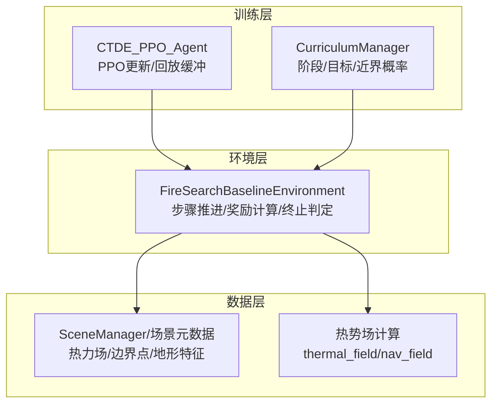
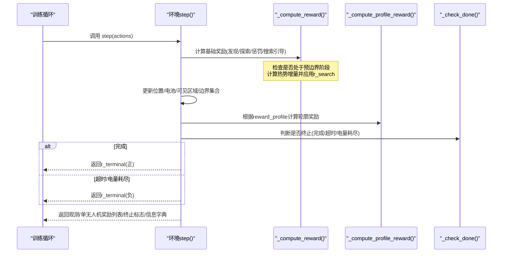
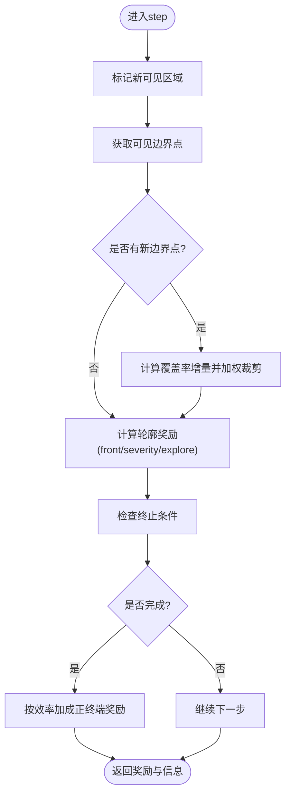
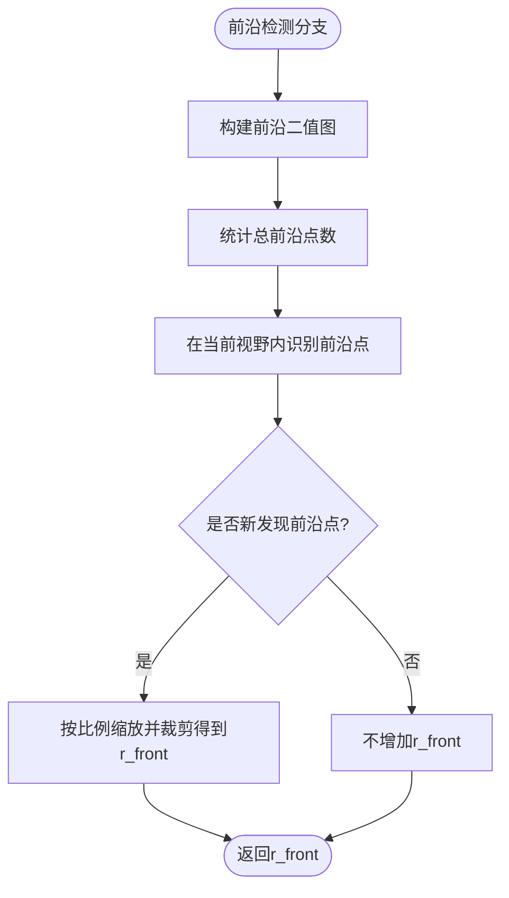
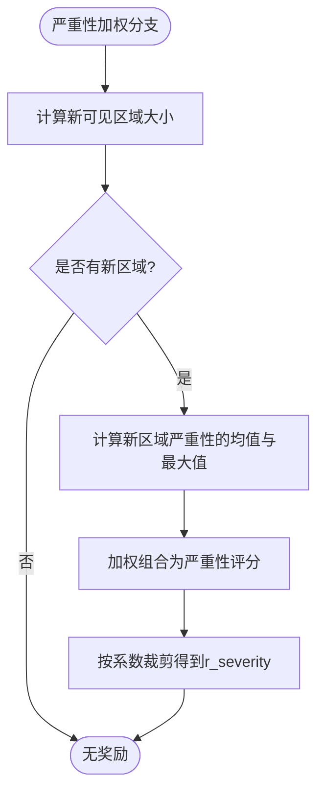
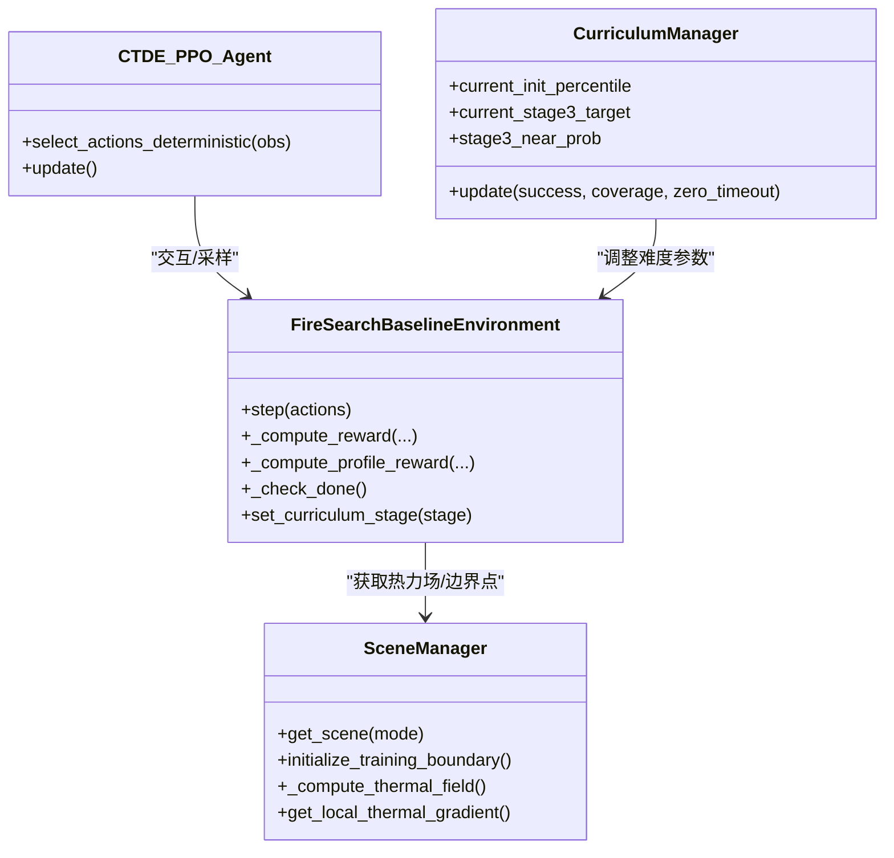

# 奖励系统设计

<cite>
**本文引用的文件**   
- [rl_environment_baseline.py](file://environment_variables/environment_variables/rl_environment_baseline.py)
- [ctde_ppo_baseline_train.py](file://environment_variables/environment_variables/ctde_ppo_baseline_train.py)
- [信息转换.py](file://environment_variables/environment_variables/信息转换.py)
</cite>

## 更新摘要
**变更内容**   
- 新增预边界搜索引导奖励(r_search)机制，提供基于热势梯度的弱强化探索行为
- 更新奖励分解机制，详细说明r_search的计算逻辑和应用条件
- 增强课程学习阶段的奖励调整策略，说明不同难度级别下的r_search权重变化
- 完善预边界搜索引导算法流程，包括热势增量检测和梯度计算

## 目录
1. [引言](#引言)
2. [项目结构](#项目结构)
3. [核心组件](#核心组件)
4. [架构总览](#架构总览)
5. [详细组件分析](#详细组件分析)
6. [依赖关系分析](#依赖关系分析)
7. [性能与稳定性考量](#性能与稳定性考量)
8. [故障排查指南](#故障排查指南)
9. [结论](#结论)
10. [附录：调优与扩展指南](#附录：调优与扩展指南)

## 引言
本文件面向多无人机森林火灾搜索任务的奖励系统，系统性阐述四种奖励配置模式（boundary_coverage、front_detection、severity_weighted、exploration_balanced）的设计理念与实现要点，并给出奖励分解机制（r_discover、r_coverage_gain、r_boundary、r_front、r_severity、r_explore、r_search、r_penalty、r_terminal）的计算逻辑与权重设置。**最新更新**：新增预边界搜索引导奖励(r_search)，通过热势梯度检测在边界发现前提供弱强化信号，引导无人机向热源方向探索。同时说明课程学习阶段的难度调整策略（目标覆盖率、近界生成概率等），并提供边界覆盖率奖励、前沿检测奖励、严重性加权奖励的算法流程、调优建议与扩展方法。

## 项目结构
本项目围绕一个基于 Gymnasium 的环境类与训练脚本组织：
- 环境类负责状态推进、观测构建、奖励计算与终止判定；
- 训练脚本负责 PPO 智能体训练、课程管理器调度、评估与日志记录。



**图表来源**
- [rl_environment_baseline.py:1-120](file://environment_variables/environment_variables/rl_environment_baseline.py#L1-L120)
- [ctde_ppo_baseline_train.py:569-752](file://environment_variables/environment_variables/ctde_ppo_baseline_train.py#L569-L752)
- [信息转换.py:759-820](file://environment_variables/environment_variables/信息转换.py#L759-L820)

**章节来源**
- [rl_environment_baseline.py:1-120](file://environment_variables/environment_variables/rl_environment_baseline.py#L1-L120)
- [ctde_ppo_baseline_train.py:1-120](file://environment_variables/environment_variables/ctde_ppo_baseline_train.py#L1-L120)

## 核心组件
- 环境类 FireSearchBaselineEnvironment
  - 提供 step() 主循环，聚合每步基础奖励与按 reward_profile 选择的"轮廓奖励"；
  - 维护边界覆盖集合、前沿发现集合、已探索区域掩码、热势信号等；
  - 支持多种 observation_profile 与 reward_profile；
  - **新增**：预边界搜索引导奖励(r_search)计算逻辑。
- 训练脚本 ctde_ppo_baseline_train.py
  - 定义 CurriculumManager，管理三阶段课程：初始面积百分比、阶段3目标覆盖率、近界生成概率退火；
  - 驱动训练循环，记录奖励分解与任务得分。
- 数据模块 信息转换.py
  - 提供热势场计算和梯度检测功能；
  - 实现 thermal_field 和 nav_field 的构建；
  - 支持 get_local_thermal_gradient() 方法用于梯度计算。

**章节来源**
- [rl_environment_baseline.py:21-120](file://environment_variables/environment_variables/rl_environment_baseline.py#L21-L120)
- [ctde_ppo_baseline_train.py:569-752](file://environment_variables/environment_variables/ctde_ppo_baseline_train.py#L569-L752)
- [信息转换.py:759-820](file://environment_variables/environment_variables/信息转换.py#L759-L820)

## 架构总览
奖励系统在 step() 中分两段合成：
- 基础奖励：由 _compute_reward() 计算，包含发现边界、探索新格、重复惩罚、空闲惩罚、邻近冲突惩罚、**预边界热势引导**等；
- 轮廓奖励：由 _compute_profile_reward() 根据 reward_profile 选择 front_detection、severity_weighted 或 exploration_balanced 分支；
- 终端奖励：在 _check_done() 后，依据完成/超时/电量耗尽分别给予正负 r_terminal。



**图表来源**
- [rl_environment_baseline.py:842-992](file://environment_variables/environment_variables/rl_environment_baseline.py#L842-L992)
- [rl_environment_baseline.py:692-806](file://environment_variables/environment_variables/rl_environment_baseline.py#L692-L806)
- [rl_environment_baseline.py:824-841](file://environment_variables/environment_variables/rl_environment_baseline.py#L824-L841)

## 详细组件分析

### 奖励分解与计算公式
- r_discover：首次发现当前边界点的即时奖励，随课程阶段递减以鼓励早期快速定位。
- r_coverage_gain：对新增边界点带来的覆盖率增量进行加权并裁剪，避免过大步长奖励。
- r_boundary：累计 r_discover 与 r_coverage_gain 到该分量，便于归因。
- r_front：前沿检测模式下，按新发现前沿点数占总前沿比例缩放并裁剪。
- r_severity：严重性加权模式下，对新可见区域的平均与最大严重性评分加权并裁剪。
- r_explore：探索新格奖励，阶段1有上限控制；exploration_balanced 模式下还包含按视野面积归一化的区域奖励。
- **r_search：预边界阶段的热势梯度引导奖励，仅在未发现任何边界前有效，基于热势增量提供弱强化信号**。
- r_penalty：包括步数惩罚、重复访问惩罚、空闲动作惩罚、重复边界惩罚、无人机间过近惩罚、以及 profile 下的重复惩罚等。
- r_terminal：完成时按效率加成给正奖励；超时按覆盖率缺口给负惩罚；电量耗尽固定负惩罚。

**关键实现路径**
- 基础奖励：[rl_environment_baseline.py:692-767](file://environment_variables/environment_variables/rl_environment_baseline.py#L692-L767)
- **预边界搜索引导奖励(r_search)**：[rl_environment_baseline.py:756-766](file://environment_variables/environment_variables/rl_environment_baseline.py#L756-L766)
- 轮廓奖励：[rl_environment_baseline.py:769-806](file://environment_variables/environment_variables/rl_environment_baseline.py#L769-L806)
- 覆盖率增益：[rl_environment_baseline.py:231-234](file://environment_variables/environment_variables/rl_environment_baseline.py#L231-L234)
- 预边界区域奖励：[rl_environment_baseline.py:236-239](file://environment_variables/environment_variables/rl_environment_baseline.py#L236-L239)
- 超时惩罚：[rl_environment_baseline.py:241-251](file://environment_variables/environment_variables/rl_environment_baseline.py#L241-L251)
- 终端奖励分配：[rl_environment_baseline.py:948-962](file://environment_variables/environment_variables/rl_environment_baseline.py#L948-L962)

**章节来源**
- [rl_environment_baseline.py:231-251](file://environment_variables/environment_variables/rl_environment_baseline.py#L231-L251)
- [rl_environment_baseline.py:692-806](file://environment_variables/environment_variables/rl_environment_baseline.py#L692-L806)
- [rl_environment_baseline.py:948-962](file://environment_variables/environment_variables/rl_environment_baseline.py#L948-L962)

### 四种奖励配置模式

#### boundary_coverage
- 设计意图：聚焦于边界覆盖率提升，通过 r_discover 与 r_coverage_gain 强信号推动无人机沿火线边缘移动。
- 主要分量：r_discover、r_coverage_gain、r_boundary、r_penalty、r_terminal。
- 适用场景：需要稳定收敛到边界追踪行为的基线训练。

**章节来源**
- [rl_environment_baseline.py:231-234](file://environment_variables/environment_variables/rl_environment_baseline.py#L231-L234)
- [rl_environment_baseline.py:692-767](file://environment_variables/environment_variables/rl_environment_baseline.py#L692-L767)

#### front_detection
- 设计意图：鼓励发现并跟踪火线前沿，使用 r_front 按新发现前沿点占比给予奖励。
- 主要分量：r_front、r_penalty、r_terminal。
- 适用场景：强调前沿感知与动态跟踪能力。

**章节来源**
- [rl_environment_baseline.py:769-786](file://environment_variables/environment_variables/rl_environment_baseline.py#L769-L786)

#### severity_weighted
- 设计意图：将新可见区域的严重性（平均与最大）作为奖励信号，促使无人机优先关注高风险区域。
- 主要分量：r_severity、r_penalty、r_terminal。
- 适用场景：风险敏感型搜索任务。

**章节来源**
- [rl_environment_baseline.py:788-793](file://environment_variables/environment_variables/rl_environment_baseline.py#L788-L793)

#### exploration_balanced
- 设计意图：平衡探索与任务导向，在新区域发现时给予按视野面积归一化的奖励，并对重复访问施加轻微惩罚。
- 主要分量：r_explore、r_penalty、r_terminal。
- 适用场景：需要更强空间探索能力的复杂地形。

**章节来源**
- [rl_environment_baseline.py:795-806](file://environment_variables/environment_variables/rl_environment_baseline.py#L795-L806)

### 课程学习阶段的奖励调整策略
- 阶段划分与目标
  - 阶段1：低门槛成功条件（发现少量边界点即结束），提高探索积极性；
  - 阶段2：达到目标覆盖率阈值（stage_targets[2]）即结束；
  - 阶段3：达到更高目标覆盖率阈值（stage_targets[3]）即结束。
- 难度调节参数
  - init_area_percent：初始边界面积百分比阶梯上升；
  - stage3_target：阶段3目标覆盖率逐步提升；
  - stage3_near_prob：阶段3近界生成概率阶梯式下降，迫使无人机从更远距离开始搜索。
- **预边界搜索引导奖励(r_search)的阶段特性**
  - 在所有课程阶段均有效，但仅在未发现任何边界点时触发；
  - 奖励强度基于热势增量计算，不受课程阶段直接影响；
  - 配合阶段1的高探索奖励，加速初期边界发现过程。
- 触发条件
  - 成功率、零覆盖率超时率、平均覆盖率等多指标联合判定；
  - 最小回合数限制与强制推进上限。

**章节来源**
- [ctde_ppo_baseline_train.py:569-752](file://environment_variables/environment_variables/ctde_ppo_baseline_train.py#L569-L752)
- [ctde_ppo_baseline_train.py:1554-1586](file://environment_variables/environment_variables/ctde_ppo_baseline_train.py#L1554-L1586)

### 预边界搜索引导奖励(r_search)算法详解

#### 设计原理
预边界搜索引导奖励(r_search)是一种弱强化信号，旨在无人机尚未发现任何边界点时，通过热势梯度检测引导其向热源方向探索。该机制解决了传统随机探索效率低下的问题，为无人机提供了基于物理信息的导航线索。

#### 数学公式
```
r_search = min(2.0 × Δpotential, 0.5)
其中：Δpotential = potential_now - potential_prev
      potential = max(0.0, thermal_value)
```

#### 触发条件
- 仅当 `len(self.discovered_boundary) == 0` 时生效
- 要求热势增量 Δpotential > 0.0
- 奖励值被裁剪至 [0.0, 0.5] 范围

#### 热势场计算
热势场通过以下流程构建：
1. 基于火焰掩膜和强度图计算源信号
2. 降采样并使用高斯模糊平滑
3. 使用稳健归一化得到 thermal_potential ∈ [0,1]
4. 对势场进行对数压缩得到导航场 nav_field
5. 基于 nav_field 计算局部梯度

**章节来源**
- [rl_environment_baseline.py:756-766](file://environment_variables/environment_variables/rl_environment_baseline.py#L756-L766)
- [信息转换.py:759-820](file://environment_variables/environment_variables/信息转换.py#L759-L820)
- [信息转换.py:933-970](file://environment_variables/environment_variables/信息转换.py#L933-L970)

### 边界覆盖率奖励算法流程


**图表来源**
- [rl_environment_baseline.py:808-823](file://environment_variables/environment_variables/rl_environment_baseline.py#L808-L823)
- [rl_environment_baseline.py:842-992](file://environment_variables/environment_variables/rl_environment_baseline.py#L842-L992)

### 前沿检测奖励算法流程


**图表来源**
- [rl_environment_baseline.py:289-304](file://environment_variables/environment_variables/rl_environment_baseline.py#L289-L304)
- [rl_environment_baseline.py:769-786](file://environment_variables/environment_variables/rl_environment_baseline.py#L769-L786)

### 严重性加权奖励算法流程


**图表来源**
- [rl_environment_baseline.py:277-287](file://environment_variables/environment_variables/rl_environment_baseline.py#L277-287)
- [rl_environment_baseline.py:788-793](file://environment_variables/environment_variables/rl_environment_baseline.py#L788-L793)

## 依赖关系分析
- 环境与训练耦合
  - 训练脚本通过 CurriculumManager 动态调整环境的 init_area_percent、stage3_target、stage3_near_prob 与 curriculum_stage；
  - 环境根据 curriculum_stage 改变 r_discover 强度、步数惩罚、空闲惩罚、终端奖励幅度等。
- 外部数据依赖
  - SceneManager 提供边界点、热力场、地形特征等，影响 r_search 与严重性评分；
  - **热势场计算模块**：提供 thermal_field 和 nav_field，支持 get_local_thermal_gradient() 方法。



**图表来源**
- [rl_environment_baseline.py:842-992](file://environment_variables/environment_variables/rl_environment_baseline.py#L842-L992)
- [ctde_ppo_baseline_train.py:569-752](file://environment_variables/environment_variables/ctde_ppo_baseline_train.py#L569-L752)
- [信息转换.py:759-820](file://environment_variables/environment_variables/信息转换.py#L759-L820)

**章节来源**
- [rl_environment_baseline.py:842-992](file://environment_variables/environment_variables/rl_environment_baseline.py#L842-L992)
- [ctde_ppo_baseline_train.py:569-752](file://environment_variables/environment_variables/ctde_ppo_baseline_train.py#L569-L752)

## 性能与稳定性考量
- 奖励裁剪与上限
  - 覆盖率增益与前沿/严重性奖励均进行裁剪，防止奖励爆炸；
  - 阶段1探索奖励设有上限，避免过度探索导致任务偏离；
  - **r_search 奖励严格裁剪至 [0.0, 0.5] 范围，确保弱强化特性**。
- 惩罚设计
  - 步数惩罚、空闲惩罚、重复访问惩罚、近距离冲突惩罚共同抑制无效行为；
  - 超时惩罚与覆盖率缺口挂钩，强化时间效率。
- 课程学习
  - 通过成功率、零覆盖率超时率、覆盖率等多指标综合推进阶段，避免过早进入高难度；
  - 近界生成概率退火与目标覆盖率提升协同，保证能力稳步增长。
- **热势场健康检查**
  - 通过 diagnose_thermal_health() 方法监控热势场质量；
  - 检查饱和比率、高热区零梯度比例等指标。

**章节来源**
- [rl_environment_baseline.py:231-251](file://environment_variables/environment_variables/rl_environment_baseline.py#L231-L251)
- [rl_environment_baseline.py:692-767](file://environment_variables/environment_variables/rl_environment_baseline.py#L692-L767)
- [ctde_ppo_baseline_train.py:569-752](file://environment_variables/environment_variables/ctde_ppo_baseline_train.py#L569-L752)
- [信息转换.py:972-998](file://environment_variables/environment_variables/信息转换.py#L972-L998)

## 故障排查指南
- 现象：r_terminal 频繁出现较大负值
  - 可能原因：覆盖率未达阶段目标或零覆盖率超时；
  - 排查要点：查看 info["zero_coverage_timeout"] 与覆盖率曲线，确认课程阶段目标是否过高。
- 现象：r_explore 异常高
  - 可能原因：阶段1探索奖励上限未生效或视野半径过大；
  - 排查要点：检查 stage1_explore_reward_cap 与 vision_radius。
- 现象：r_penalty 过大
  - 可能原因：空闲动作过多、重复访问频繁、无人机间距过小；
  - 排查要点：观察 idle 动作比例与最近单元格窗口长度。
- **现象：r_search 始终为零**
  - 可能原因：热势场计算异常、nav_field 为空、或无人机始终在低热势区域；
  - 排查要点：检查 thermal_field 和 nav_field 的初始化状态，验证 get_local_thermal_gradient() 返回值。
- **现象：r_search 奖励不稳定**
  - 可能原因：热势场噪声过大、梯度计算异常；
  - 排查要点：运行 diagnose_thermal_health() 检查热势场质量，确认饱和比率和零梯度比例。

**章节来源**
- [rl_environment_baseline.py:948-962](file://environment_variables/environment_variables/rl_environment_baseline.py#L948-L962)
- [rl_environment_baseline.py:692-767](file://environment_variables/environment_variables/rl_environment_baseline.py#L692-L767)
- [信息转换.py:972-998](file://environment_variables/environment_variables/信息转换.py#L972-L998)

## 结论
本奖励系统通过模块化分解与课程学习相结合，实现了从"易到难"的稳定训练路径。四种奖励配置模式分别侧重边界覆盖、前沿检测、严重性加权与探索平衡，配合严格的裁剪与惩罚机制，确保奖励信号的可控性与可解释性。**新增的预边界搜索引导奖励(r_search)机制通过热势梯度检测，在边界发现前提供弱强化信号，显著提升了初期探索效率**。课程管理器在多指标约束下渐进提升难度，有助于模型在不同场景与阶段保持鲁棒性。

## 附录：调优与扩展指南

### 调优指南
- 边界覆盖率模式
  - 若收敛慢：适度提高 coverage_gain_weight 或降低步数惩罚；
  - 若陷入局部：增大 r_explore 或扩大 vision_radius。
- 前沿检测模式
  - 若前沿发现不稳定：适当提高前沿奖励系数或降低重复惩罚；
  - 若忽略非前沿区域：引入 r_severity 混合或切换至 exploration_balanced。
- 严重性加权模式
  - 若过于冒险：降低严重性系数或提高 r_penalty；
  - 若忽视低风险区：结合 r_coverage_gain 形成混合奖励。
- 探索平衡模式
  - 若探索不足：提高按面积归一化的探索奖励；
  - 若重复访问过多：增强 repeat_penalty 或缩短重复窗口。
- **预边界搜索引导奖励(r_search)调优**
  - 若引导效果不明显：检查热势场质量，确认 nav_field 正常计算；
  - 若引导过强：可降低热势增量系数或调整裁剪上限；
  - 若引导方向错误：检查热势场归一化和梯度计算逻辑。

**章节来源**
- [rl_environment_baseline.py:231-239](file://environment_variables/environment_variables/rl_environment_baseline.py#L231-L239)
- [rl_environment_baseline.py:769-806](file://environment_variables/environment_variables/rl_environment_baseline.py#L769-L806)
- [rl_environment_baseline.py:756-766](file://environment_variables/environment_variables/rl_environment_baseline.py#L756-L766)

### 课程学习参数建议
- 阶段目标
  - stage2_target 与 stage3_target 应循序渐进，避免跳跃过大；
  - 监控 success_rate 与 zero_coverage_timeout_rate，确保双指标达标后再推进。
- 近界生成概率
  - stage3_near_prob 退火需与目标覆盖率进度绑定，避免超前退火导致失败率飙升。
- 初始面积百分比
  - init_area_percent 阶梯上升，确保模型在简单分布上先建立基本策略。
- **预边界搜索引导与课程学习的协同**
  - r_search 在所有阶段均有效，无需针对特定阶段调整；
  - 配合阶段1的高探索奖励，加速初期边界发现过程。

**章节来源**
- [ctde_ppo_baseline_train.py:569-752](file://environment_variables/environment_variables/ctde_ppo_baseline_train.py#L569-L752)

### 扩展机制与自定义奖励函数
- 扩展接口
  - 在 REWARD_PROFILES 中添加新的 reward_profile 名称；
  - 在 _compute_profile_reward() 中为新模式添加分支，计算对应 r_* 分量并写入 r_breakdown；
  - 如需新的观测维度，可在 OBSERVATION_PROFILE_DIMS 中扩展 observation_profile。
- **新增预边界搜索引导奖励的实现参考**
  - 在 REWARD_BREAKDOWN_KEYS 中添加 "r_search" 键；
  - 在 _compute_reward() 中实现热势增量检测和奖励计算逻辑；
  - 确保奖励值经过适当的裁剪和归一化处理。
- 开发步骤
  - 定义新模式的目标与数学表达；
  - 在环境中实现对应的统计量（如新区域、前沿、严重性等）；
  - 编写奖励计算与裁剪逻辑，确保数值范围合理；
  - 在训练脚本中验证新模式的收敛性与稳定性。

**章节来源**
- [rl_environment_baseline.py:30-35](file://environment_variables/environment_variables/rl_environment_baseline.py#L30-L35)
- [rl_environment_baseline.py:769-806](file://environment_variables/environment_variables/rl_environment_baseline.py#L769-L806)
- [rl_environment_baseline.py:36-47](file://environment_variables/environment_variables/rl_environment_baseline.py#L36-L47)
- [rl_environment_baseline.py:756-766](file://environment_variables/environment_variables/rl_environment_baseline.py#L756-L766)