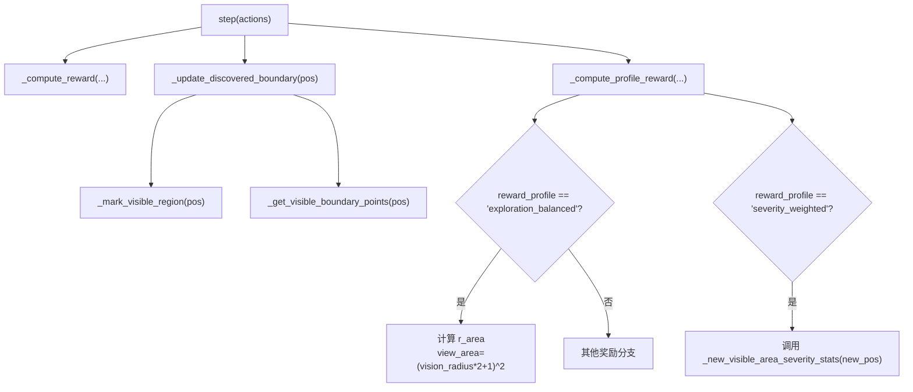
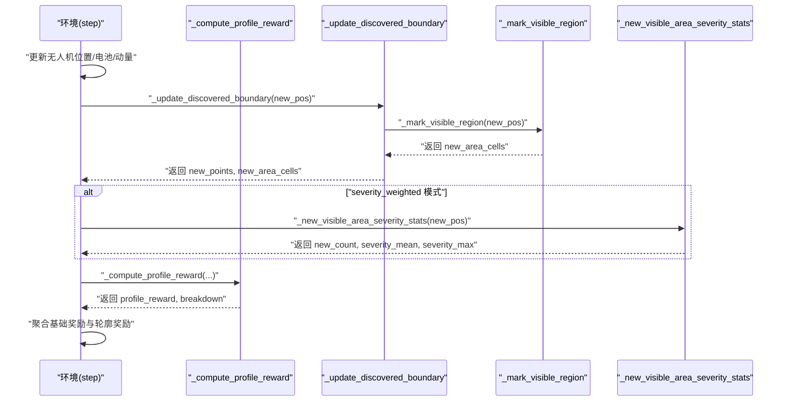
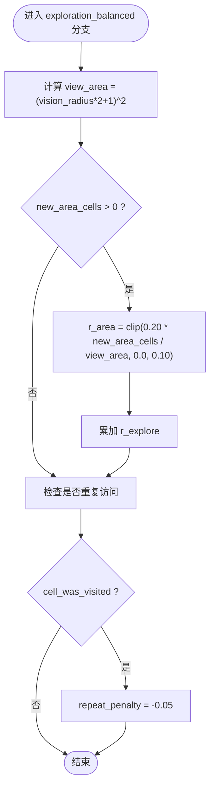
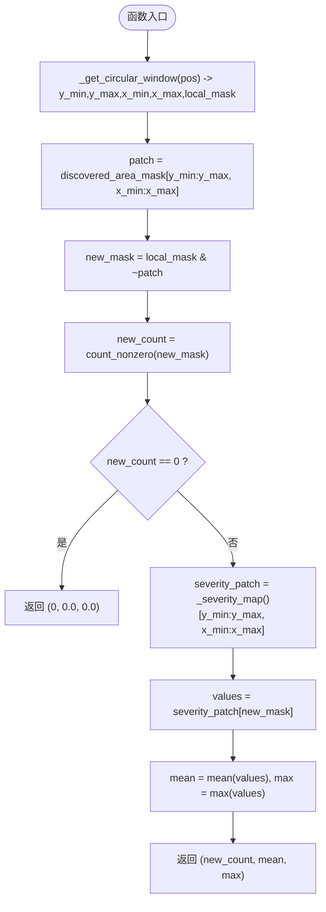
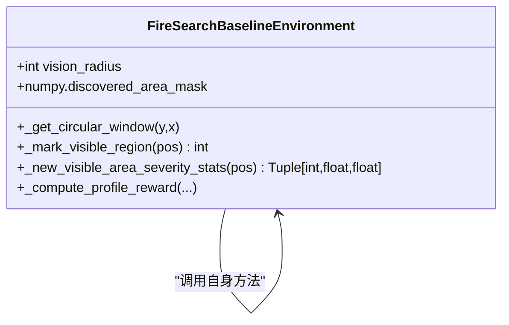
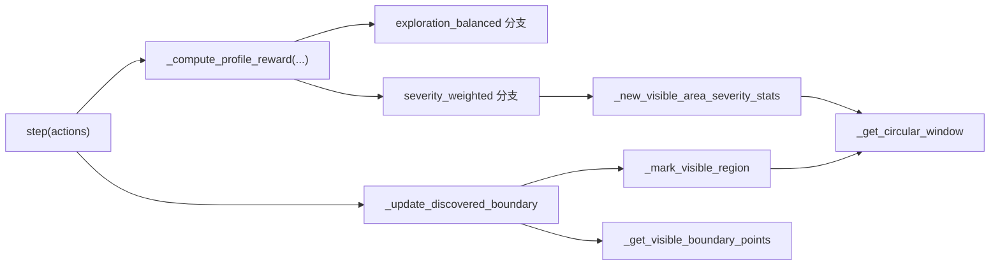

# 探索平衡奖励

<cite>
**本文引用的文件**   
- [rl_environment_baseline.py](file://environment_variables/environment_variables/rl_environment_baseline.py)
</cite>

## 目录
1. [简介](#简介)
2. [项目结构](#项目结构)
3. [核心组件](#核心组件)
4. [架构总览](#架构总览)
5. [详细组件分析](#详细组件分析)
6. [依赖关系分析](#依赖关系分析)
7. [性能考量](#性能考量)
8. [故障排查指南](#故障排查指南)
9. [结论](#结论)
10. [附录：参数调优与配置建议](#附录参数调优与配置建议)

## 简介
本文件围绕“探索平衡奖励”模式（reward_profile="exploration_balanced"）进行系统化文档化，重点解释以下方面：
- 设计理念：在无人机协同搜索中，通过面积归一化的新区域探索奖励，鼓励智能体持续发现未知区域，同时抑制重复访问。
- 新区域检测算法：_new_visible_area_severity_stats 的 local_mask 构建、new_mask 计算与新单元格统计流程。
- 探索奖励公式：r_area = clip(0.20 * new_area_cells / view_area, 0.0, 0.10)，其中 view_area = (vision_radius * 2 + 1)^2。
- 与严重性奖励的结合方式与权重平衡策略。
- 在多无人机协同搜索中的重要性及调度机制。
- 参数调优指南与不同场景下的配置建议。
- 以代码片段路径形式展示关键实现位置，便于读者对照源码理解。

## 项目结构
该功能位于基线多无人机火场边界搜索环境的奖励计算模块中，核心逻辑集中在环境类及其方法中。主要涉及：
- 探索平衡奖励的计算入口与分支处理
- 新可见区域与严重性统计的辅助方法
- 视野窗口与掩码构建工具方法
- 步级主循环中对各奖励分量的聚合

图表来源
- [rl_environment_baseline.py:842-992](file://environment_variables/environment_variables/rl_environment_baseline.py#L842-L992)
- [rl_environment_baseline.py:769-806](file://environment_variables/environment_variables/rl_environment_baseline.py#L769-L806)
- [rl_environment_baseline.py:808-822](file://environment_variables/environment_variables/rl_environment_baseline.py#L808-L822)
- [rl_environment_baseline.py:269-287](file://environment_variables/environment_variables/rl_environment_baseline.py#L269-L287)

章节来源
- [rl_environment_baseline.py:842-992](file://environment_variables/environment_variables/rl_environment_baseline.py#L842-L992)
- [rl_environment_baseline.py:769-806](file://environment_variables/environment_variables/rl_environment_baseline.py#L769-L806)
- [rl_environment_baseline.py:808-822](file://environment_variables/environment_variables/rl_environment_baseline.py#L808-L822)
- [rl_environment_baseline.py:269-287](file://environment_variables/environment_variables/rl_environment_baseline.py#L269-L287)

## 核心组件
- 探索平衡奖励模式：在 _compute_profile_reward 中根据 reward_profile 选择分支；当为 exploration_balanced 时，基于新可见单元格数量与视野面积比计算 r_area，并对重复访问施加惩罚。
- 新区域检测与严重性统计：_new_visible_area_severity_stats 用于计算新可见区域的平均与最大严重性值，供 severity_weighted 模式使用；其内部复用 _get_circular_window 构建 local_mask，并通过 discovered_area_mask 判断新区域。
- 视野窗口与掩码：_get_circular_window 生成圆形视野内的局部掩码 local_mask；_mark_visible_region 更新 discovered_area_mask 并返回新可见单元格数。

章节来源
- [rl_environment_baseline.py:769-806](file://environment_variables/environment_variables/rl_environment_baseline.py#L769-L806)
- [rl_environment_baseline.py:277-287](file://environment_variables/environment_variables/rl_environment_baseline.py#L277-L287)
- [rl_environment_baseline.py:259-275](file://environment_variables/environment_variables/rl_environment_baseline.py#L259-L275)

## 架构总览
下图展示了从 step 到探索奖励计算的完整调用链，包括新区域检测、严重性统计与奖励聚合过程。

图表来源
- [rl_environment_baseline.py:842-992](file://environment_variables/environment_variables/rl_environment_baseline.py#L842-L992)
- [rl_environment_baseline.py:769-806](file://environment_variables/environment_variables/rl_environment_baseline.py#L769-L806)
- [rl_environment_baseline.py:808-822](file://environment_variables/environment_variables/rl_environment_baseline.py#L808-L822)
- [rl_environment_baseline.py:269-287](file://environment_variables/environment_variables/rl_environment_baseline.py#L269-L287)

## 详细组件分析

### 探索平衡奖励模式（exploration_balanced）
- 设计目标：鼓励智能体持续发现未知区域，避免在已访问区域徘徊；通过面积归一化使奖励对视野大小具有尺度不变性。
- 计算公式：
  - view_area = max((vision_radius * 2 + 1)^2, 1.0)
  - r_area = clip(0.20 * new_area_cells / view_area, 0.0, 0.10)
  - 若 cell_was_visited 为真，则施加重复访问惩罚 repeat_penalty = -0.05
- 行为特征：
  - 仅当 new_area_cells > 0 时才给予探索奖励，确保只有真正的新区域才获得正反馈
  - 上限 clip 防止在大视野下出现过大奖励，保持与其他奖励项的平衡
  - 重复访问惩罚有助于减少无效移动

图表来源
- [rl_environment_baseline.py:795-806](file://environment_variables/environment_variables/rl_environment_baseline.py#L795-L806)

章节来源
- [rl_environment_baseline.py:795-806](file://environment_variables/environment_variables/rl_environment_baseline.py#L795-L806)

### 新区域检测与严重性统计（_new_visible_area_severity_stats）
- 输入：当前无人机位置 pos
- 输出：(new_count, severity_mean, severity_max)
- 算法步骤：
  1) 使用 _get_circular_window 获取视野窗口与 local_mask
  2) 取 patch = discovered_area_mask[y_min:y_max, x_min:x_max]
  3) new_mask = local_mask & ~patch，即“在视野内且尚未被记录为新可见”的单元格集合
  4) new_count = count_nonzero(new_mask)
  5) 若 new_count == 0，直接返回 (0, 0.0, 0.0)
  6) 否则，从 _severity_map() 提取对应 patch，按 new_mask 取值，计算均值与最大值
- 复杂度：O(view_area)，受 vision_radius 影响；mask 操作为向量化，效率较高

图表来源
- [rl_environment_baseline.py:277-287](file://environment_variables/environment_variables/rl_environment_baseline.py#L277-L287)
- [rl_environment_baseline.py:259-267](file://environment_variables/environment_variables/rl_environment_baseline.py#L259-L267)
- [rl_environment_baseline.py:516-519](file://environment_variables/environment_variables/rl_environment_baseline.py#L516-L519)

章节来源
- [rl_environment_baseline.py:277-287](file://environment_variables/environment_variables/rl_environment_baseline.py#L277-L287)
- [rl_environment_baseline.py:259-267](file://environment_variables/environment_variables/rl_environment_baseline.py#L259-L267)
- [rl_environment_baseline.py:516-519](file://environment_variables/environment_variables/rl_environment_baseline.py#L516-L519)

### 视野窗口与掩码构建（_get_circular_window 与 _mark_visible_region）
- _get_circular_window：
  - 根据当前位置与 vision_radius 裁剪视野矩形范围
  - 使用二次距离条件生成圆形 local_mask
- _mark_visible_region：
  - 将 local_mask 与 discovered_area_mask 的 patch 做反或计数，得到 newly_visible
  - 将 patch[local_mask] 置为 True，标记为新可见区域

图表来源
- [rl_environment_baseline.py:259-275](file://environment_variables/environment_variables/rl_environment_baseline.py#L259-L275)
- [rl_environment_baseline.py:277-287](file://environment_variables/environment_variables/rl_environment_baseline.py#L277-L287)
- [rl_environment_baseline.py:769-806](file://environment_variables/environment_variables/rl_environment_baseline.py#L769-L806)

章节来源
- [rl_environment_baseline.py:259-275](file://environment_variables/environment_variables/rl_environment_baseline.py#L259-L275)
- [rl_environment_baseline.py:277-287](file://environment_variables/environment_variables/rl_environment_baseline.py#L277-L287)
- [rl_environment_baseline.py:769-806](file://environment_variables/environment_variables/rl_environment_baseline.py#L769-L806)

### 探索奖励与严重性奖励的结合与权重平衡
- 结合方式：
  - 两种模式互斥：当 reward_profile="exploration_balanced" 时，仅计算探索相关奖励；当 reward_profile="severity_weighted" 时，仅计算严重性相关奖励
  - 在 step 主循环中，先计算基础奖励（如边界发现、步惩罚、重复访问等），再叠加 profile_reward
- 权重平衡策略：
  - 探索奖励的上限 clip(0.10) 保证不会主导整体奖励，避免过度偏向探索而忽视任务目标
  - 严重性奖励采用 severity_score = 0.5*mean + 0.5*max，并以 clip(0.75*score, 0.0, 0.75) 控制幅度
  - 通过不同的 clip 上限与系数，可在不同阶段侧重探索或严重性导向

章节来源
- [rl_environment_baseline.py:769-806](file://environment_variables/environment_variables/rl_environment_baseline.py#L769-L806)

### 多无人机协同搜索中的重要性与调度机制
- 重要性：
  - 探索奖励促使无人机分散覆盖未知区域，提升全局覆盖率与收敛速度
  - 重复访问惩罚抑制集群聚集，降低冗余观测
- 调度机制：
  - step 中并行处理多个无人机的动作，分别计算各自奖励并聚合
  - 通过 peer_new_positions 计算与其他无人机的间距，近距离惩罚进一步促进空间分散
  - 课程学习阶段（curriculum_stage）影响初始生成位置与探索奖励上限，逐步引导从近边界到远端探索

章节来源
- [rl_environment_baseline.py:842-992](file://environment_variables/environment_variables/rl_environment_baseline.py#L842-L992)
- [rl_environment_baseline.py:373-436](file://environment_variables/environment_variables/rl_environment_baseline.py#L373-L436)

## 依赖关系分析
- 方法间依赖：
  - _compute_profile_reward 依赖 _new_visible_area_severity_stats（在 severity_weighted 模式下）
  - _update_discovered_boundary 依赖 _mark_visible_region 与 _get_visible_boundary_points
  - _mark_visible_region 与 _new_visible_area_severity_stats 均依赖 _get_circular_window
- 外部依赖：
  - numpy 用于数组与布尔掩码运算
  - gymnasium 提供环境接口

图表来源
- [rl_environment_baseline.py:842-992](file://environment_variables/environment_variables/rl_environment_baseline.py#L842-L992)
- [rl_environment_baseline.py:769-806](file://environment_variables/environment_variables/rl_environment_baseline.py#L769-L806)
- [rl_environment_baseline.py:808-822](file://environment_variables/environment_variables/rl_environment_baseline.py#L808-L822)
- [rl_environment_baseline.py:259-287](file://environment_variables/environment_variables/rl_environment_baseline.py#L259-L287)

章节来源
- [rl_environment_baseline.py:842-992](file://environment_variables/environment_variables/rl_environment_baseline.py#L842-L992)
- [rl_environment_baseline.py:769-806](file://environment_variables/environment_variables/rl_environment_baseline.py#L769-L806)
- [rl_environment_baseline.py:808-822](file://environment_variables/environment_variables/rl_environment_baseline.py#L808-L822)
- [rl_environment_baseline.py:259-287](file://environment_variables/environment_variables/rl_environment_baseline.py#L259-L287)

## 性能考量
- 时间复杂度：
  - 每步对每个无人机执行 O(view_area) 的 mask 操作，view_area 随 vision_radius 平方增长
  - 严重性统计仅在 severity_weighted 模式下触发，避免不必要的开销
- 内存占用：
  - discovered_area_mask 与 confirmed_boundary_mask 为与网格同尺寸的布尔矩阵
  - _severity_map_cache 缓存严重性图，避免重复计算
- 优化建议：
  - 合理设置 vision_radius，权衡感知范围与计算成本
  - 在大规模网格上可考虑分块或稀疏表示以减少内存压力

## 故障排查指南
- 常见问题：
  - 探索奖励始终为 0：检查 new_area_cells 是否为 0，确认 discovered_area_mask 是否正确更新
  - 重复访问惩罚频繁触发：检查 cell_was_visited 逻辑与 visited_cells 维护
  - 严重性统计异常：确认 _severity_map() 返回值有效，new_mask 非空
- 定位方法：
  - 查看 info 中的 reward_breakdown，确认 r_explore 与 r_penalty 的累计
  - 打印 new_area_cells 与 view_area，验证面积归一化效果

章节来源
- [rl_environment_baseline.py:842-992](file://environment_variables/environment_variables/rl_environment_baseline.py#L842-L992)
- [rl_environment_baseline.py:769-806](file://environment_variables/environment_variables/rl_environment_baseline.py#L769-L806)

## 结论
探索平衡奖励模式通过面积归一化与重复访问惩罚，有效引导多无人机在未知区域进行高效探索。其与严重性奖励的互斥设计使得在不同训练阶段可以灵活切换侧重点。配合课程学习与空间分散惩罚，系统能够在复杂火场环境中实现稳健的协同搜索。

## 附录：参数调优与配置建议
- 关键参数：
  - vision_radius：决定视野大小与 view_area，直接影响 r_area 的归一化基准
  - 探索奖励系数 0.20 与上限 0.10：调节探索激励强度与封顶
  - 重复访问惩罚 -0.05：抑制冗余移动
- 调优指南：
  - 小视野场景：适当提高系数或放宽上限，增强探索信号
  - 大视野场景：降低系数或收紧上限，避免探索奖励主导
  - 高严重性区域：切换到 severity_weighted 模式，强化热点导向
- 配置建议：
  - 训练初期（curriculum_stage=1）：启用探索平衡模式，配合近边界生成概率，快速建立基本覆盖
  - 训练中期（stage=2/3）：根据任务目标在探索与严重性之间切换，必要时引入课程学习调整生成策略

章节来源
- [rl_environment_baseline.py:795-806](file://environment_variables/environment_variables/rl_environment_baseline.py#L795-L806)
- [rl_environment_baseline.py:373-436](file://environment_variables/environment_variables/rl_environment_baseline.py#L373-L436)