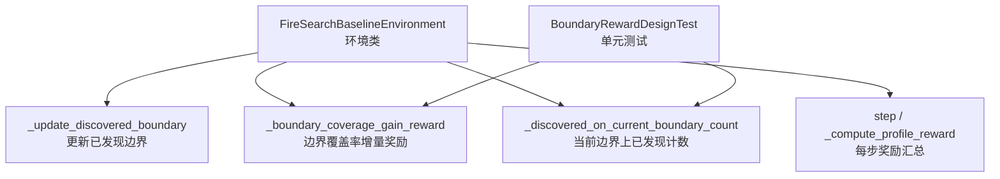
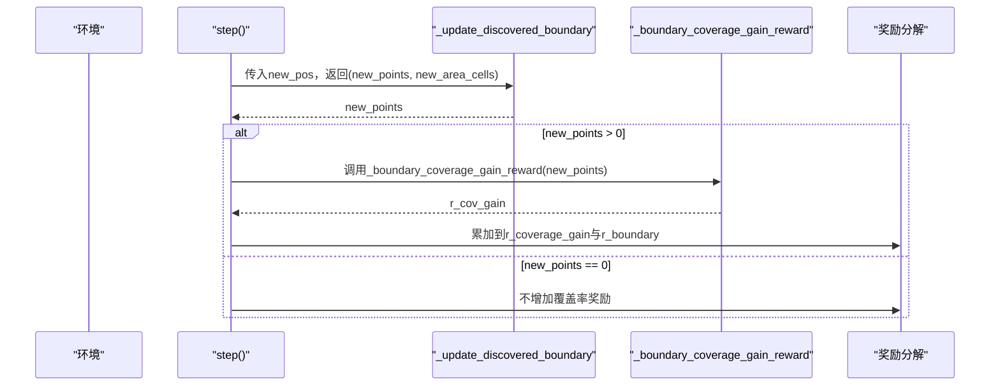
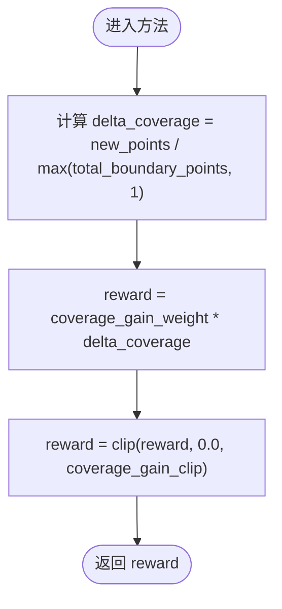
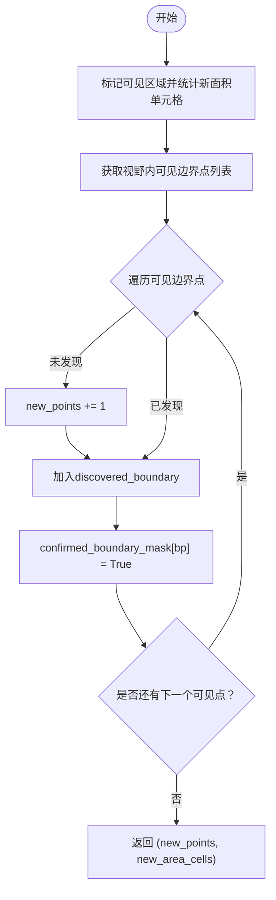
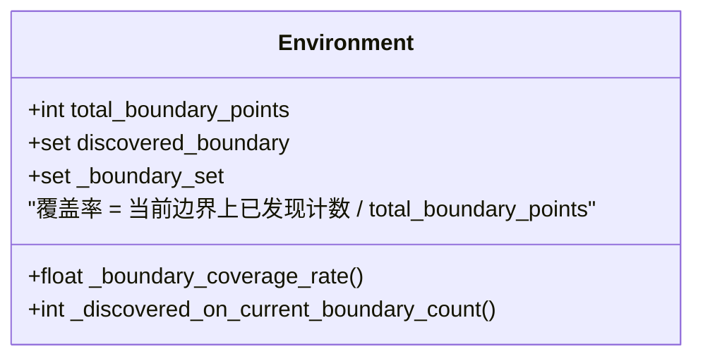
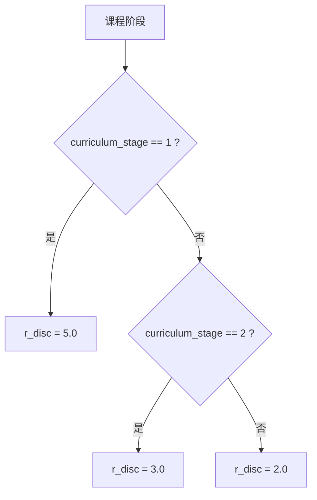
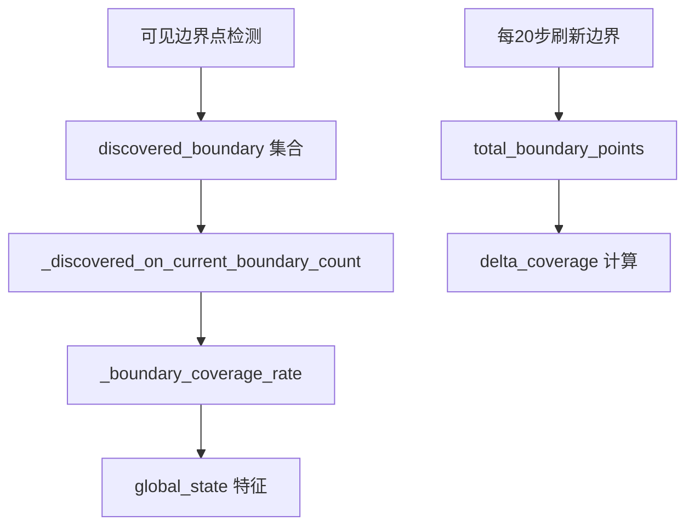

# 边界覆盖率奖励

<cite>
**本文引用的文件**   
- [rl_environment_baseline.py](file://environment_variables/environment_variables/rl_environment_baseline.py)
- [test_boundary_reward_design.py](file://environment_variables/environment_variables/test_boundary_reward_design.py)
</cite>

## 目录
1. [简介](#简介)
2. [项目结构](#项目结构)
3. [核心组件](#核心组件)
4. [架构总览](#架构总览)
5. [详细组件分析](#详细组件分析)
6. [依赖关系分析](#依赖关系分析)
7. [性能与数值稳定性](#性能与数值稳定性)
8. [调优指南与参数配置建议](#调优指南与参数配置建议)
9. [故障排查](#故障排查)
10. [结论](#结论)
11. [附录：计算示例与使用路径](#附录计算示例与使用路径)

## 简介
本文件围绕“边界覆盖率奖励机制”展开，聚焦于 _boundary_coverage_gain_reward 方法的实现原理、delta_coverage 的计算方式、coverage_gain_weight 权重与 coverage_gain_clip 裁剪的作用，以及边界点发现检测逻辑（discovered_boundary 集合维护、_discovered_on_current_boundary_count 计数、total_boundary_points 归一化）。同时说明课程学习阶段对边界发现奖励的影响（r_disc 值随阶段从 5.0→3.0→2.0 递减），并提供调优指南与具体代码示例的使用路径。

## 项目结构
该机制位于多无人机火场搜索基线环境的奖励计算流程中，核心实现集中在环境类的方法与属性中，并通过单元测试验证关键行为。

图表来源
- [rl_environment_baseline.py:231-234](file://environment_variables/environment_variables/rl_environment_baseline.py#L231-L234)
- [rl_environment_baseline.py:808-819](file://environment_variables/environment_variables/rl_environment_baseline.py#L808-L234)
- [rl_environment_baseline.py:253-257](file://environment_variables/environment_variables/rl_environment_baseline.py#L253-L257)
- [rl_environment_baseline.py:842-911](file://environment_variables/environment_variables/rl_environment_baseline.py#L842-L911)
- [test_boundary_reward_design.py:20-33](file://environment_variables/environment_variables/test_boundary_reward_design.py#L20-L33)

章节来源
- [rl_environment_baseline.py:231-234](file://environment_variables/environment_variables/rl_environment_baseline.py#L231-L234)
- [rl_environment_baseline.py:808-819](file://environment_variables/environment_variables/rl_environment_baseline.py#L808-L819)
- [rl_environment_baseline.py:253-257](file://environment_variables/environment_variables/rl_environment_baseline.py#L253-L257)
- [rl_environment_baseline.py:842-911](file://environment_variables/environment_variables/rl_environment_baseline.py#L842-L911)
- [test_boundary_reward_design.py:20-33](file://environment_variables/environment_variables/test_boundary_reward_design.py#L20-L33)

## 核心组件
- 边界覆盖率增量奖励方法：根据新发现的边界点数与总边界点数计算 delta_coverage，再乘以权重并裁剪得到最终奖励。
- 边界点发现检测：通过可见性判断与集合去重维护 discovered_boundary，并在每步统计 new_points。
- 计数与归一化：_discovered_on_current_boundary_count 仅统计属于当前真实边界的已发现点；total_boundary_points 用于归一化 delta_coverage 和覆盖率。
- 课程学习影响：不同阶段的 r_disc 值不同，体现早期强引导、后期弱引导的策略。

章节来源
- [rl_environment_baseline.py:231-234](file://environment_variables/environment_variables/rl_environment_baseline.py#L231-L234)
- [rl_environment_baseline.py:808-819](file://environment_variables/environment_variables/rl_environment_baseline.py#L808-L819)
- [rl_environment_baseline.py:253-257](file://environment_variables/environment_variables/rl_environment_baseline.py#L253-L257)
- [rl_environment_baseline.py:708-716](file://environment_variables/environment_variables/rl_environment_baseline.py#L708-L716)

## 架构总览
下图展示了单步执行过程中，边界覆盖率奖励的调用链路与数据流。

图表来源
- [rl_environment_baseline.py:842-911](file://environment_variables/environment_variables/rl_environment_baseline.py#L842-L911)
- [rl_environment_baseline.py:808-819](file://environment_variables/environment_variables/rl_environment_baseline.py#L808-L819)
- [rl_environment_baseline.py:231-234](file://environment_variables/environment_variables/rl_environment_baseline.py#L231-L234)

## 详细组件分析

### 边界覆盖率增量奖励方法 _boundary_coverage_gain_reward
- 输入：new_points（本次新增发现的边界点数）
- 计算步骤：
  - delta_coverage = new_points / max(total_boundary_points, 1)
  - reward = coverage_gain_weight * delta_coverage
  - 输出：clip(reward, 0.0, coverage_gain_clip)
- 设计要点：
  - 分母使用 max(..., 1) 避免除零。
  - 通过 clip 限制单次奖励上限，防止奖励爆炸。
  - 权重 coverage_gain_weight 控制单位覆盖率增量的奖励强度。

图表来源
- [rl_environment_baseline.py:231-234](file://environment_variables/environment_variables/rl_environment_baseline.py#L231-L234)

章节来源
- [rl_environment_baseline.py:231-234](file://environment_variables/environment_variables/rl_environment_baseline.py#L231-L234)

### 边界点发现检测逻辑
- 可见边界点获取：基于当前位置与视野半径，筛选出在视野内的真实边界点。
- 集合维护：
  - discovered_boundary：记录所有已发现的边界点（去重）。
  - confirmed_boundary_mask：标记已确认的边界位置，用于刷新 discovered_boundary。
- 新增计数：遍历可见边界点，若不在 discovered_boundary 则 new_points += 1，然后统一加入集合并标记为已确认。
- 刷新策略：每20步重新检测真实边界，更新 total_boundary_points 与 _boundary_set，并刷新 discovered_boundary 中与 confirmed_boundary_mask 一致的点。

图表来源
- [rl_environment_baseline.py:808-819](file://environment_variables/environment_variables/rl_environment_baseline.py#L808-L819)
- [rl_environment_baseline.py:320-329](file://environment_variables/environment_variables/rl_environment_baseline.py#L320-L329)
- [rl_environment_baseline.py:927-941](file://environment_variables/environment_variables/rl_environment_baseline.py#L927-L941)

章节来源
- [rl_environment_baseline.py:808-819](file://environment_variables/environment_variables/rl_environment_baseline.py#L808-L819)
- [rl_environment_baseline.py:320-329](file://environment_variables/environment_variables/rl_environment_baseline.py#L320-L329)
- [rl_environment_baseline.py:927-941](file://environment_variables/environment_variables/rl_environment_baseline.py#L927-L941)

### 计数方法与归一化处理
- _discovered_on_current_boundary_count：仅统计 discovered_boundary 中属于当前真实边界集合的点数量，避免将历史或误检点计入。
- total_boundary_points：当前真实边界点的总数，作为 delta_coverage 的分母与覆盖率计算的基准。
- 覆盖率：_boundary_coverage_rate = _discovered_on_current_boundary_count() / max(total_boundary_points, 1)。

图表来源
- [rl_environment_baseline.py:253-257](file://environment_variables/environment_variables/rl_environment_baseline.py#L253-L257)
- [rl_environment_baseline.py:195-196](file://environment_variables/environment_variables/rl_environment_baseline.py#L195-L196)
- [rl_environment_baseline.py:175](file://environment_variables/environment_variables/rl_environment_baseline.py#L175)

章节来源
- [rl_environment_baseline.py:253-257](file://environment_variables/environment_variables/rl_environment_baseline.py#L253-L257)
- [rl_environment_baseline.py:195-196](file://environment_variables/environment_variables/rl_environment_baseline.py#L195-L196)
- [rl_environment_baseline.py:175](file://environment_variables/environment_variables/rl_environment_baseline.py#L175)

### 课程学习阶段对边界发现奖励的影响
- 首次发现边界点时给予 r_disc 奖励，且随阶段递减：
  - 阶段1：r_disc = 5.0
  - 阶段2：r_disc = 3.0
  - 阶段3：r_disc = 2.0
- 目的：早期强化探索边界的行为，后期降低对“首次发现”的依赖，鼓励稳定覆盖。

图表来源
- [rl_environment_baseline.py:708-716](file://environment_variables/environment_variables/rl_environment_baseline.py#L708-L716)

章节来源
- [rl_environment_baseline.py:708-716](file://environment_variables/environment_variables/rl_environment_baseline.py#L708-L716)

## 依赖关系分析
- 边界覆盖率奖励依赖于：
  - 可见边界点检测（视野半径、网格尺寸）
  - discovered_boundary 集合状态
  - total_boundary_points 的动态更新（每20步刷新）
- 与全局状态的关系：
  - global_state 中包含 discovered_boundary_feature（当前边界上已发现比例）与 undiscovered_density（1 - 覆盖率），供策略网络参考。

图表来源
- [rl_environment_baseline.py:306-318](file://environment_variables/environment_variables/rl_environment_baseline.py#L306-L318)
- [rl_environment_baseline.py:253-257](file://environment_variables/environment_variables/rl_environment_baseline.py#L253-L257)
- [rl_environment_baseline.py:927-941](file://environment_variables/environment_variables/rl_environment_baseline.py#L927-L941)
- [rl_environment_baseline.py:628-653](file://environment_variables/environment_variables/rl_environment_baseline.py#L628-L653)

章节来源
- [rl_environment_baseline.py:306-318](file://environment_variables/environment_variables/rl_environment_baseline.py#L306-L318)
- [rl_environment_baseline.py:253-257](file://environment_variables/environment_variables/rl_environment_baseline.py#L253-L257)
- [rl_environment_baseline.py:927-941](file://environment_variables/environment_variables/rl_environment_baseline.py#L927-L941)
- [rl_environment_baseline.py:628-653](file://environment_variables/environment_variables/rl_environment_baseline.py#L628-L653)

## 性能与数值稳定性
- 数值稳定性：
  - 分母使用 max(total_boundary_points, 1) 避免除零。
  - 奖励通过 clip 限制上限，防止梯度不稳定。
- 性能考虑：
  - discovered_boundary 使用集合进行 O(1) 去重与查找。
  - 每20步刷新一次真实边界，减少频繁计算开销。
  - 可见边界点遍历受视野半径与边界点规模影响，建议在大规模场景中优化可见性查询（如空间索引）。

章节来源
- [rl_environment_baseline.py:231-234](file://environment_variables/environment_variables/rl_environment_baseline.py#L231-L234)
- [rl_environment_baseline.py:927-941](file://environment_variables/environment_variables/rl_environment_baseline.py#L927-L941)

## 调优指南与参数配置建议
- coverage_gain_weight（覆盖率增量权重）
  - 作用：放大单位覆盖率增量带来的奖励，驱动策略更关注边界覆盖。
  - 建议：默认 40.0；若训练初期收敛慢，可适当提高；若出现奖励震荡，适当降低。
- coverage_gain_clip（覆盖率增量裁剪上限）
  - 作用：限制单次最大奖励，避免大跳跃导致不稳定。
  - 建议：默认 2.0；若希望更平滑的奖励信号，可降低至 1.0~1.5。
- pre_boundary_area_gain_weight / pre_boundary_area_gain_clip（预边界区域奖励）
  - 作用：在未检测到任何边界点时，基于热势增量与可见区域提供弱引导。
  - 建议：保持较小权重与裁剪，确保不会主导边界覆盖率奖励。
- 课程阶段 r_disc 调整
  - 阶段1→2→3：5.0→3.0→2.0，逐步弱化“首次发现”的强激励，促使策略转向稳定覆盖。
  - 若某阶段成功率长期停滞，可微调 r_disc 或结合 stage_targets 提升目标难度。
- 其他相关参数
  - vision_radius：影响可见边界点数量与计算成本，需与地图尺度匹配。
  - stage_targets：决定完成条件与超时惩罚，影响整体训练节奏。

章节来源
- [rl_environment_baseline.py:92-99](file://environment_variables/environment_variables/rl_environment_baseline.py#L92-L99)
- [rl_environment_baseline.py:708-716](file://environment_variables/environment_variables/rl_environment_baseline.py#L708-L716)
- [rl_environment_baseline.py:241-251](file://environment_variables/environment_variables/rl_environment_baseline.py#L241-L251)

## 故障排查
- 现象：覆盖率始终为0
  - 检查 total_boundary_points 是否为0（初始化或刷新失败）。
  - 检查 discovered_boundary 是否被正确更新与刷新。
  - 检查视野半径与地图尺度是否匹配，导致无法看到边界点。
- 现象：奖励过大或不稳定
  - 检查 coverage_gain_weight 与 coverage_gain_clip 设置是否合理。
  - 观察 step 中的 r_coverage_gain 与 r_boundary 分解项是否异常。
- 现象：课程阶段切换后效果退化
  - 检查 r_disc 是否按阶段正确递减。
  - 核对 stage_targets 与 near_spawn 概率是否适配当前阶段。

章节来源
- [rl_environment_baseline.py:231-234](file://environment_variables/environment_variables/rl_environment_baseline.py#L231-L234)
- [rl_environment_baseline.py:927-941](file://environment_variables/environment_variables/rl_environment_baseline.py#L927-L941)
- [rl_environment_baseline.py:708-716](file://environment_variables/environment_variables/rl_environment_baseline.py#L708-L716)

## 结论
边界覆盖率奖励通过 delta_coverage 的线性缩放与裁剪，提供了稳定而有效的覆盖导向信号。配合课程学习阶段的 r_disc 递减与超时惩罚，能够在训练早期快速建立边界感知能力，并在后期推动稳定覆盖。合理的权重与裁剪设置是保证训练稳定的关键。

## 附录：计算示例与使用路径
- 计算边界覆盖率增量奖励
  - 输入：new_points=5，total_boundary_points=100，coverage_gain_weight=40.0，coverage_gain_clip=2.0
  - 计算：delta_coverage = 5/100 = 0.05；reward = 40.0*0.05 = 2.0；clip(2.0, 0.0, 2.0) = 2.0
  - 使用路径：step 中当 new_points > 0 时调用 _boundary_coverage_gain_reward 并累加到 r_coverage_gain 与 r_boundary。
- 对比预边界区域奖励
  - 测试断言表明：覆盖率奖励应显著大于预边界区域奖励（至少10倍），以确保边界覆盖优先。
- 超时惩罚与零覆盖率额外惩罚
  - 当课程阶段≥2且覆盖率为0时，超时惩罚会叠加额外惩罚，促使策略避免长时间无进展。

章节来源
- [rl_environment_baseline.py:231-234](file://environment_variables/environment_variables/rl_environment_baseline.py#L231-L234)
- [rl_environment_baseline.py:842-911](file://environment_variables/environment_variables/rl_environment_baseline.py#L842-L911)
- [test_boundary_reward_design.py:20-33](file://environment_variables/environment_variables/test_boundary_reward_design.py#L20-L33)
- [rl_environment_baseline.py:241-251](file://environment_variables/environment_variables/rl_environment_baseline.py#L241-L251)