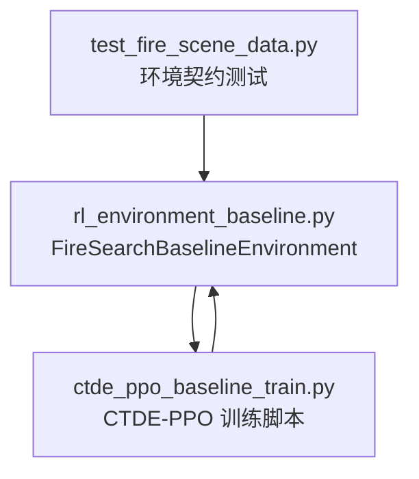
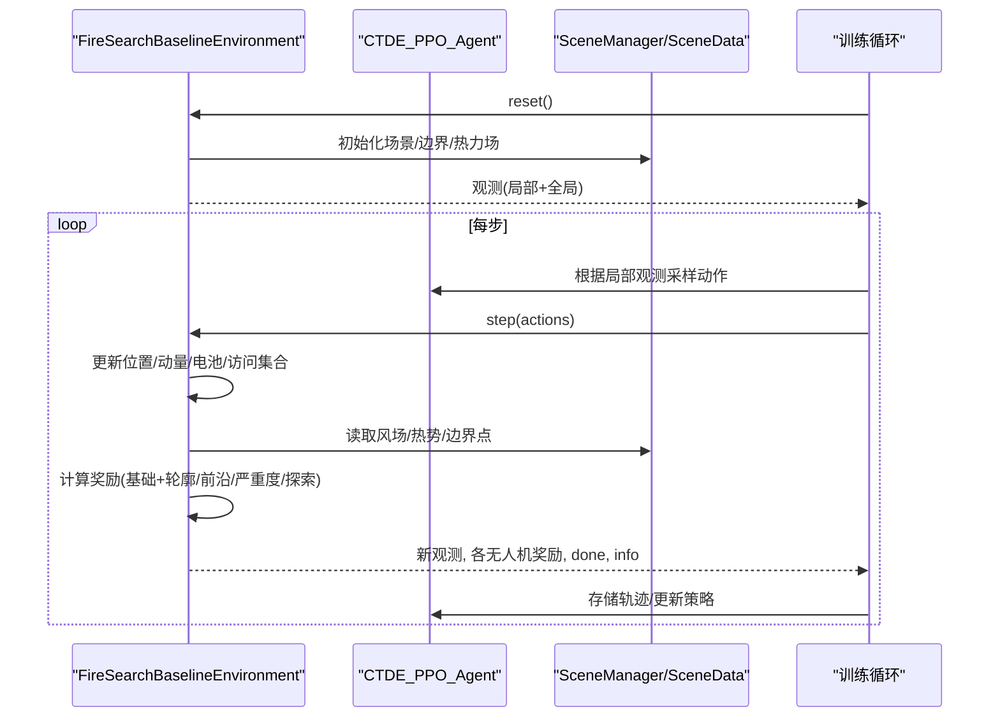
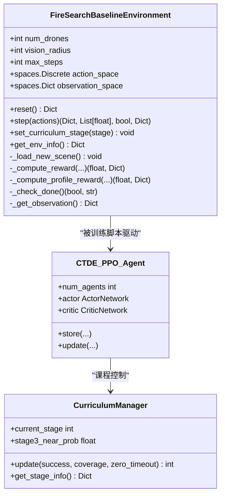
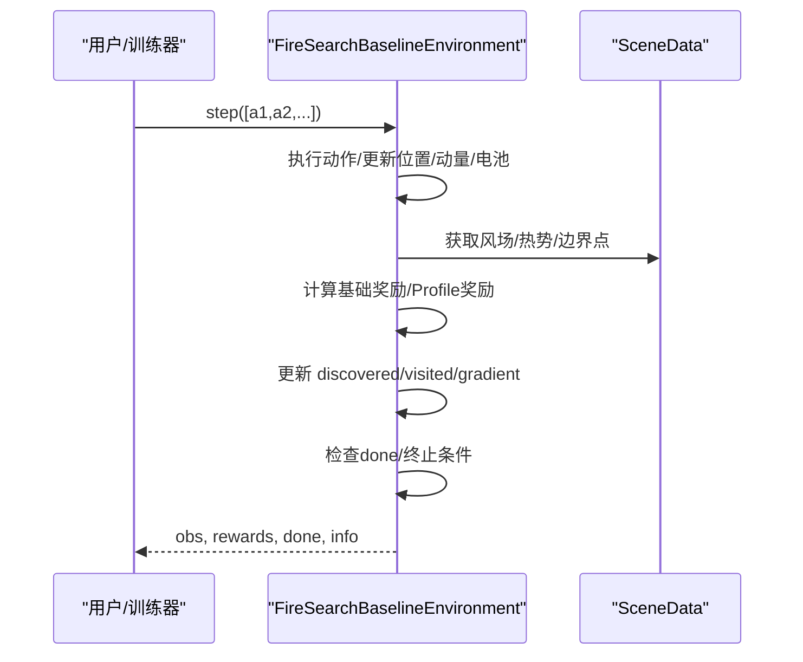
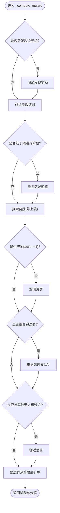
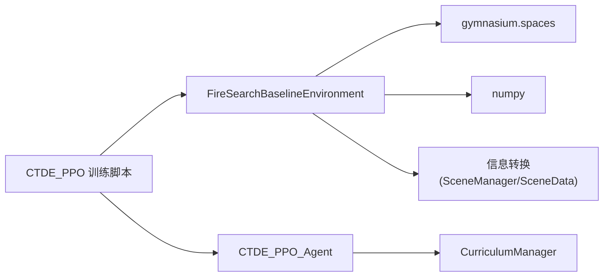

# 强化学习环境

<cite>
**本文引用的文件**
- [rl_environment_baseline.py](file://environment_variables/environment_variables/rl_environment_baseline.py)
- [ctde_ppo_baseline_train.py](file://environment_variables/environment_variables/ctde_ppo_baseline_train.py)
- [test_fire_scene_data.py](file://environment_variables/environment_variables/test_fire_scene_data.py)
</cite>

## 目录
1. [简介](#简介)
2. [项目结构](#项目结构)
3. [核心组件](#核心组件)
4. [架构总览](#架构总览)
5. [详细组件分析](#详细组件分析)
6. [依赖关系分析](#依赖关系分析)
7. [性能与调优建议](#性能与调优建议)
8. [故障排查指南](#故障排查指南)
9. [结论](#结论)
10. [附录：使用示例与配置清单](#附录使用示例与配置清单)

## 简介
本文件围绕 FireSearchBaselineEnvironment 类，系统化阐述其作为 Gymnasium 环境接口的实现细节，包括 reset()、step()、observation_space 等核心方法；详细说明观测空间设计（局部观测维度与全局状态维度）、动作空间定义（5个离散方向）以及奖励函数机制。同时解释多无人机协同搜索的工作流程，涵盖无人机状态管理、碰撞检测、通信协议（集中式全局状态），并提供训练与评估的使用指引、环境配置选项、参数调优建议与常见问题诊断方案。

## 项目结构
与本环境直接相关的核心代码位于 environment_variables/environment_variables 目录下：
- rl_environment_baseline.py：FireSearchBaselineEnvironment 的完整实现
- ctde_ppo_baseline_train.py：CTDE-PPO 基线训练脚本，演示如何加载并驱动该环境进行训练与评估
- test_fire_scene_data.py：包含对环境的断言测试，验证观测形状、奖励分解键等契约

图表来源
- [rl_environment_baseline.py:1-120](file://environment_variables/environment_variables/rl_environment_baseline.py#L1-L120)
- [ctde_ppo_baseline_train.py:1-160](file://environment_variables/environment_variables/ctde_ppo_baseline_train.py#L1-L160)
- [test_fire_scene_data.py:130-262](file://environment_variables/environment_variables/test_fire_scene_data.py#L130-L262)

章节来源
- [rl_environment_baseline.py:1-120](file://environment_variables/environment_variables/rl_environment_baseline.py#L1-L120)
- [ctde_ppo_baseline_train.py:1-160](file://environment_variables/environment_variables/ctde_ppo_baseline_train.py#L1-L160)
- [test_fire_scene_data.py:130-262](file://environment_variables/environment_variables/test_fire_scene_data.py#L130-L262)

## 核心组件
- FireSearchBaselineEnvironment：基于 gym.Env 的多无人机火灾边界搜索环境，支持课程学习、多种观测/奖励配置、动态火场更新与热势引导。
- CTDE_PPO_Agent：在训练脚本中使用的分布式策略网络（Actor/Critic），采用“去中心化执行 + 集中式训练”范式，利用全局状态进行价值估计。
- CurriculumManager：课程管理器，控制初始覆盖比例、阶段目标与近距生成概率退火。

章节来源
- [rl_environment_baseline.py:21-158](file://environment_variables/environment_variables/rl_environment_baseline.py#L21-L158)
- [ctde_ppo_baseline_train.py:749-800](file://environment_variables/environment_variables/ctde_ppo_baseline_train.py#L749-L800)
- [ctde_ppo_baseline_train.py:569-747](file://environment_variables/environment_variables/ctde_ppo_baseline_train.py#L569-L747)

## 架构总览
下图展示了环境、智能体与数据模块之间的交互关系，以及关键的数据流与控制流。

图表来源
- [rl_environment_baseline.py:331-361](file://environment_variables/environment_variables/rl_environment_baseline.py#L331-L361)
- [rl_environment_baseline.py:842-992](file://environment_variables/environment_variables/rl_environment_baseline.py#L842-L992)
- [ctde_ppo_baseline_train.py:749-800](file://environment_variables/environment_variables/ctde_ppo_baseline_train.py#L749-L800)

## 详细组件分析

### 环境与接口契约
- 继承自 gym.Env，提供标准的 reset()/step() 接口，返回 Dict 观测、List[float] 奖励、bool done 与 Dict info。
- observation_space 为 Dict，包含：
  - local_obs：长度为 num_drones 的 Tuple，每个元素是 Box 向量，维度由 observation_profile 决定（见下节）。
  - global_state：Box 向量，固定维度 19。
- action_space：Discrete(5)，对应上/下/左/右/静止。

章节来源
- [rl_environment_baseline.py:108-131](file://environment_variables/environment_variables/rl_environment_baseline.py#L108-L131)
- [rl_environment_baseline.py:89-90](file://environment_variables/environment_variables/rl_environment_baseline.py#L89-L90)
- [rl_environment_baseline.py:660-669](file://environment_variables/environment_variables/rl_environment_baseline.py#L660-L669)

#### 观测空间设计
- 局部观测维度（local_obs_dim）：
  - baseline: 17
  - static_terrain: 24
  - dynamic_front: 23
  - risk_aware: 20
- 全局状态维度（global_state_dim）：固定为 19

局部观测构成（baseline 为例）：
- 归一化坐标 (y/x)、电池占比、强度归一化、视野内火点数密度、到地图中心距离、风速归一化、风向 sin/cos、DEM 归一化、坡度归一化、热梯度 y/x、动量 y/x、相机指向 y/x（相对半径归一化）
- 其他 profile 在此基础上扩展静态地形特征、动态前沿统计或风险感知特征

全局状态构成（19维）：
- 当前覆盖率、平均/最小电池比、团队质心/散布、平均到火重心距离、时间进度、已访问面积比例、课程阶段、平均风速/高程、已确认边界特征、低电量指示、无人机数量、覆盖率梯度、未发现密度等

章节来源
- [rl_environment_baseline.py:24-29](file://environment_variables/environment_variables/rl_environment_baseline.py#L24-L29)
- [rl_environment_baseline.py:565-658](file://environment_variables/environment_variables/rl_environment_baseline.py#L565-L658)
- [test_fire_scene_data.py:158-189](file://environment_variables/environment_variables/test_fire_scene_data.py#L158-L189)

#### 动作空间定义
- Discrete(5)：
  - 0: 向下移动
  - 1: 向上移动
  - 2: 向左移动
  - 3: 向右移动
  - 4: 原地不动
- 动作执行后位置会被裁剪到网格边界内。

章节来源
- [rl_environment_baseline.py:660-669](file://environment_variables/environment_variables/rl_environment_baseline.py#L660-L669)

#### 奖励函数机制
- 基础奖励：
  - 发现边界点奖励（随课程阶段递减）
  - 步数惩罚（随课程阶段变化）
  - 重复区域惩罚（pre-boundary 阶段）
  - 探索奖励（前期有上限）
  - 空闲惩罚（action=4）
  - 重复踩边界惩罚
  - 邻近惩罚（与其他无人机过近）
  - 预边界热势增量引导（无边界发现时）
- 轮廓/前沿/严重度/探索平衡等 profile 奖励：
  - boundary_coverage：按新增可见边界点比例给予奖励
  - front_detection：按新增前沿点比例给予奖励
  - severity_weighted：按新发现区域的严重度均值/最大值加权
  - exploration_balanced：按新发现面积占视域比例给予奖励
- 终止奖励/惩罚：
  - 任务完成：效率加成
  - 超时：与覆盖率缺口挂钩的惩罚
  - 电量耗尽：固定惩罚

章节来源
- [rl_environment_baseline.py:692-767](file://environment_variables/environment_variables/rl_environment_baseline.py#L692-L767)
- [rl_environment_baseline.py:769-806](file://environment_variables/environment_variables/rl_environment_baseline.py#L769-L806)
- [rl_environment_baseline.py:948-962](file://environment_variables/environment_variables/rl_environment_baseline.py#L948-L962)

#### 多无人机协同搜索机制
- 状态管理：
  - 每架无人机维护位置、动量、电池；电池消耗受风场影响
  - 全局维护 visited_cells、discovered_boundary/front、confirmed_boundary_mask、coverage_gradient 等
- 碰撞检测：
  - 若两机距离小于 vision_radius*0.8，施加惩罚以鼓励分散
- 通信协议：
  - 去中心化执行：每机仅用 local_obs 决策
  - 集中式训练：Critic 使用 global_state 进行价值估计，体现 CTDE 思想

章节来源
- [rl_environment_baseline.py:842-926](file://environment_variables/environment_variables/rl_environment_baseline.py#L842-L926)
- [ctde_ppo_baseline_train.py:749-800](file://environment_variables/environment_variables/ctde_ppo_baseline_train.py#L749-L800)

#### 动态火场与热势引导
- 每 20 步更新一次火场边界与热力场，保持环境动态性
- 热信号分层判定：视野内真实火点或热势阈值触发“有热信号”，用于记录首次探测时刻
- 预边界阶段通过热势增量提供弱引导，帮助早期探索

章节来源
- [rl_environment_baseline.py:927-941](file://environment_variables/environment_variables/rl_environment_baseline.py#L927-L941)
- [rl_environment_baseline.py:671-690](file://environment_variables/environment_variables/rl_environment_baseline.py#L671-L690)

#### 课程学习（Curriculum）
- 三阶段：
  - Stage1：快速达成少量边界发现，逐步提升初始覆盖比例
  - Stage2：达到中等覆盖率目标
  - Stage3：达到高覆盖率目标，并退火 near_prob（从近边界生成）
- 指标监控：成功率、覆盖率、零覆盖超时率、阶段最低回合数等

章节来源
- [ctde_ppo_baseline_train.py:569-747](file://environment_variables/environment_variables/ctde_ppo_baseline_train.py#L569-L747)
- [rl_environment_baseline.py:824-841](file://environment_variables/environment_variables/rl_environment_baseline.py#L824-L841)

### 类图（代码级）

图表来源
- [rl_environment_baseline.py:21-158](file://environment_variables/environment_variables/rl_environment_baseline.py#L21-L158)
- [ctde_ppo_baseline_train.py:749-800](file://environment_variables/environment_variables/ctde_ppo_baseline_train.py#L749-L800)
- [ctde_ppo_baseline_train.py:569-747](file://environment_variables/environment_variables/ctde_ppo_baseline_train.py#L569-L747)

### 序列图（step 流程）

图表来源
- [rl_environment_baseline.py:842-992](file://environment_variables/environment_variables/rl_environment_baseline.py#L842-L992)

### 流程图（奖励计算）

图表来源
- [rl_environment_baseline.py:692-767](file://environment_variables/environment_variables/rl_environment_baseline.py#L692-L767)

## 依赖关系分析
- 外部依赖：
  - gymnasium/spaces：环境接口与空间定义
  - numpy：数值计算
  - importlib：动态导入数据模块（信息转换）
- 内部依赖：
  - SceneManager/SceneData：场景与栅格数据加载、边界/热力场计算
  - CTDE_PPO_Agent：策略网络与训练逻辑
  - CurriculumManager：课程学习控制

图表来源
- [rl_environment_baseline.py:1-20](file://environment_variables/environment_variables/rl_environment_baseline.py#L1-L20)
- [ctde_ppo_baseline_train.py:1-40](file://environment_variables/environment_variables/ctde_ppo_baseline_train.py#L1-L40)

章节来源
- [rl_environment_baseline.py:1-20](file://environment_variables/environment_variables/rl_environment_baseline.py#L1-L20)
- [ctde_ppo_baseline_train.py:1-40](file://environment_variables/environment_variables/ctde_ppo_baseline_train.py#L1-L40)

## 性能与调优建议
- 观测维度选择：
  - baseline（17维）适合快速收敛与通用性
  - static_terrain/dynamic_front/risk_aware 在特定任务中可能提升性能但增加输入复杂度
- 奖励权重与裁剪：
  - 调整 coverage_gain_weight/clip、pre_boundary_area_gain_* 等可改变探索与边界发现的平衡
  - 课程阶段不同，步数惩罚与空闲惩罚应配合调整以避免过度保守
- 课程学习：
  - 合理设置 stage2_target/stage3_target 与 stage3_near_prob，避免过早退化导致探索不足
- 训练超参：
  - actor_lr/critic_lr、KL自适应模式、GAE lambda、熵系数等需结合任务规模与场景难度微调
- 并行与批大小：
  - 增大 batch_size 与 ppo_epochs 可提升样本利用率，但需关注显存与稳定性

[本节为通用指导，不直接分析具体文件]

## 故障排查指南
- 观测形状不一致：
  - 检查 observation_profile 是否在允许集合内，且与本地/全局维度匹配
  - 参考测试用例中对 shapes 的断言
- 奖励分解键缺失：
  - 确保 reward_profile 属于允许集合，info["reward_breakdown"] 包含标准键
- 场景参数异常：
  - use_metadata_uav_params=True 时，vision_radius/max_steps 将取自场景元数据
- 动态更新频率：
  - 边界与热力场每 20 步更新一次，若需要更频繁更新，可在 step 中调整刷新间隔

章节来源
- [test_fire_scene_data.py:158-219](file://environment_variables/environment_variables/test_fire_scene_data.py#L158-L219)
- [rl_environment_baseline.py:927-941](file://environment_variables/environment_variables/rl_environment_baseline.py#L927-L941)

## 结论
FireSearchBaselineEnvironment 提供了面向多无人机火灾边界搜索的标准化 Gymnasium 环境，具备灵活的观测/奖励配置、课程学习与动态火场更新能力。配合 CTDE-PPO 训练框架，可实现高效的多机协同搜索策略学习。通过合理的参数调优与问题诊断，可在不同场景与难度下获得稳定且高效的训练结果。

[本节为总结，不直接分析具体文件]

## 附录：使用示例与配置清单

### 基本使用示例（训练与评估）
- 初始化环境：
  - 指定 data_dir、num_drones、vision_radius、max_steps、observation_profile、reward_profile 等
  - 可选 fixed_scene_key 用于固定场景调试
- 训练循环：
  - 调用 env.reset() 获取初始观测
  - 在每步中根据 agent 策略输出 actions，调用 env.step(actions)
  - 收集轨迹并更新策略（参见训练脚本中的 CTDE_PPO_Agent 与训练主循环）
- 评估：
  - 使用不同的 scene_keys 与 eval_stages 进行跨场景泛化评估

章节来源
- [ctde_ppo_baseline_train.py:98-158](file://environment_variables/environment_variables/ctde_ppo_baseline_train.py#L98-L158)
- [ctde_ppo_baseline_train.py:749-800](file://environment_variables/environment_variables/ctde_ppo_baseline_train.py#L749-L800)

### 环境配置选项清单
- 场景与数据
  - data_dir：数据集根目录
  - fixed_scene_key：固定场景键（调试用）
  - scene_keys：按 split 指定的场景键列表
- 无人机与环境
  - num_drones：无人机数量
  - vision_radius：传感器半径（单元格）
  - max_steps：最大步数
  - use_metadata_uav_params：是否使用场景元数据中的 UAV 参数
- 观测与奖励
  - observation_profile：baseline/static_terrain/dynamic_front/risk_aware
  - reward_profile：boundary_coverage/front_detection/severity_weighted/exploration_balanced
- 课程学习
  - curriculum_stage：1/2/3
  - init_percentile/init_area_percent：初始覆盖比例
  - stage2_target/stage3_target：阶段目标覆盖率
  - stage3_near_prob：Stage3 近距生成概率

章节来源
- [rl_environment_baseline.py:49-88](file://environment_variables/environment_variables/rl_environment_baseline.py#L49-L88)
- [ctde_ppo_baseline_train.py:98-158](file://environment_variables/environment_variables/ctde_ppo_baseline_train.py#L98-L158)