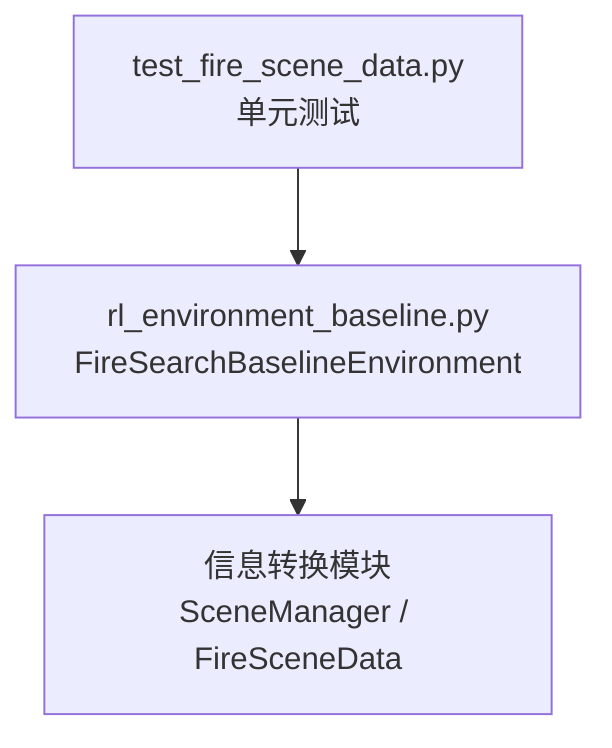
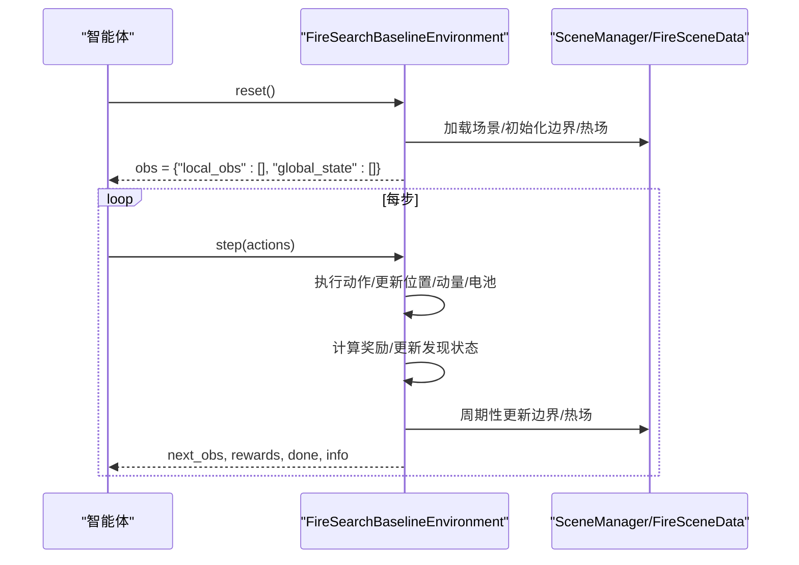
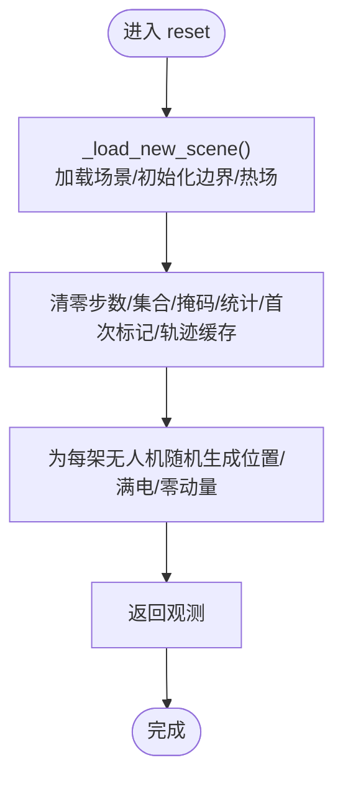
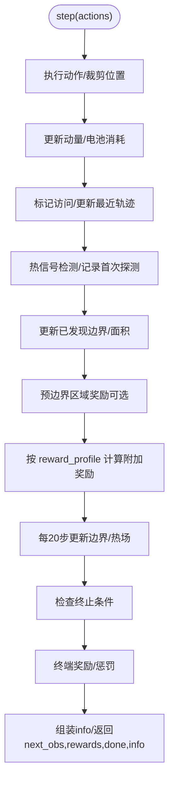
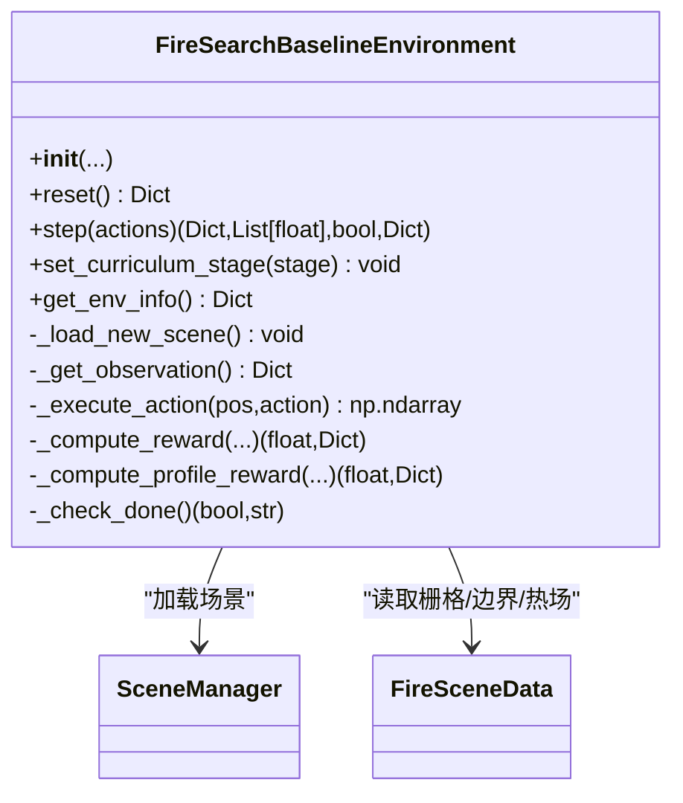

# 环境接口设计

<cite>
**本文引用的文件**   
- [rl_environment_baseline.py](file://environment_variables/environment_variables/rl_environment_baseline.py)
- [test_fire_scene_data.py](file://environment_variables/environment_variables/test_fire_scene_data.py)
</cite>

## 目录
1. [简介](#简介)
2. [项目结构](#项目结构)
3. [核心组件](#核心组件)
4. [架构总览](#架构总览)
5. [详细组件分析](#详细组件分析)
6. [依赖关系分析](#依赖关系分析)
7. [性能考量](#性能考量)
8. [故障排查指南](#故障排查指南)
9. [结论](#结论)
10. [附录：使用示例与最佳实践](#附录使用示例与最佳实践)

## 简介
本文件面向 FireSearchBaselineEnvironment 类的 Gymnasium 环境接口，提供从初始化参数、状态空间定义到生命周期管理（场景加载、重置、步进、终止条件）的系统化说明。文档重点解释 reset()、step()、observation_space 等关键接口的实现细节与调用流程，并给出训练循环的参考用法、常见模式与调优建议。

## 项目结构
该环境位于 environment_variables/environment_variables 目录下，核心实现为 rl_environment_baseline.py；测试用例 test_fire_scene_data.py 覆盖了初始化、观测维度、奖励分解等断言，可作为行为契约的参考。

图表来源
- [rl_environment_baseline.py:1-20](file://environment_variables/environment_variables/rl_environment_baseline.py#L1-L20)
- [test_fire_scene_data.py:1-262](file://environment_variables/environment_variables/test_fire_scene_data.py#L1-L262)

章节来源
- [rl_environment_baseline.py:1-20](file://environment_variables/environment_variables/rl_environment_baseline.py#L1-L20)
- [test_fire_scene_data.py:1-262](file://environment_variables/environment_variables/test_fire_scene_data.py#L1-L262)

## 核心组件
- 类名与基类
  - FireSearchBaselineEnvironment 继承自 gym.Env，遵循 Gymnasium 标准接口。
- 动作空间
  - Discrete(5)，分别对应上、下、左、右、静止。
- 观测空间
  - Dict{"local_obs": Tuple[Box(local_obs_dim,)], "global_state": Box(global_state_dim,)}
  - local_obs_dim 由 observation_profile 决定，支持 baseline/static_terrain/dynamic_front/risk_aware 四种配置。
  - global_state_dim 固定为 19。
- 关键内部变量
  - drone_positions、drone_batteries、drone_momentums：无人机位置、电池电量、动量向量。
  - visited_cells、discovered_boundary、discovered_front、confirmed_boundary_mask：探索与边界发现状态。
  - step_count、max_steps、max_battery、vision_radius：步数与资源约束。
  - boundary_points、total_boundary_points、fire_centroid：动态火场边界与质心。
  - _coverage_gradient、first_heat_step、first_boundary_step、spawn_modes：统计与元信息。

章节来源
- [rl_environment_baseline.py:21-158](file://environment_variables/environment_variables/rl_environment_baseline.py#L21-L158)
- [rl_environment_baseline.py:108-131](file://environment_variables/environment_variables/rl_environment_baseline.py#L108-L131)
- [rl_environment_baseline.py:133-148](file://environment_variables/environment_variables/rl_environment_baseline.py#L133-L148)

## 架构总览
下图展示了环境在 Gymnasium 训练循环中的交互方式，以及与环境内部数据流的关系。

图表来源
- [rl_environment_baseline.py:331-361](file://environment_variables/environment_variables/rl_environment_baseline.py#L331-L361)
- [rl_environment_baseline.py:842-992](file://environment_variables/environment_variables/rl_environment_baseline.py#L842-L992)
- [rl_environment_baseline.py:159-194](file://environment_variables/environment_variables/rl_environment_baseline.py#L159-L194)

## 详细组件分析

### 初始化与参数配置
- 构造参数要点
  - data_dir: 数据集根目录。
  - num_drones: 无人机数量。
  - vision_radius: 视野半径（格点），影响局部观测窗口与可见性判定。
  - max_steps: 最大步数，控制 episode 长度。
  - use_metadata_uav_params: 若为 True，则从场景元数据覆盖 vision_radius 与 max_steps，并据此设置 max_battery。
  - observation_profile: 观测特征配置，决定 local_obs_dim。
  - reward_profile: 奖励配置，决定额外奖励项。
  - curriculum_stage: 课程阶段（1/2/3），影响生成策略、目标覆盖率与惩罚强度。
  - mode: 训练/验证/测试模式，用于按划分选择场景。
  - fixed_scene_key/scene_keys: 指定或限定场景集合。
  - init_percentile/init_area_percent: 初始边界采样比例。
  - stage2_target/stage3_target/stage3_near_prob: 课程阶段目标与近端生成概率。
- 空间与维度
  - action_space: Discrete(5)。
  - observation_space: Dict{"local_obs": Tuple(Box(local_obs_dim,)), "global_state": Box(19,)}。
  - 不同 observation_profile 对应的 local_obs_dim 见常量映射。
- 资源与时间
  - max_battery = max_steps * 2.0（可由 use_metadata_uav_params 覆盖）。
  - 每步移动消耗基础 1.0 + 风阻惩罚系数，静止消耗较小。

章节来源
- [rl_environment_baseline.py:49-106](file://environment_variables/environment_variables/rl_environment_baseline.py#L49-L106)
- [rl_environment_baseline.py:108-131](file://environment_variables/environment_variables/rl_environment_baseline.py#L108-L131)
- [rl_environment_baseline.py:133-148](file://environment_variables/environment_variables/rl_environment_baseline.py#L133-L148)
- [rl_environment_baseline.py:198-207](file://environment_variables/environment_variables/rl_environment_baseline.py#L198-L207)

### 场景加载与生命周期管理
- 场景加载
  - _load_new_scene 根据 fixed_scene_key 或 mode 选择场景，初始化训练边界、热力场，构建边界集合与火场质心，并根据 use_metadata_uav_params 应用 UAV 参数。
- 重置流程
  - reset 会重新加载场景，清空步计数、访问集合、已发现边界/前沿、掩码、梯度统计、首次探测标记、最近轨迹缓存，并为每架无人机随机生成初始位置、满电与零动量。
- 终止条件
  - 课程阶段目标覆盖率达成即提前结束。
  - 达到 max_steps 或任一无人机电池耗尽也结束。
  - 结束时根据原因给予终端奖励或惩罚，并记录 info。

图表来源
- [rl_environment_baseline.py:159-194](file://environment_variables/environment_variables/rl_environment_baseline.py#L159-L194)
- [rl_environment_baseline.py:331-361](file://environment_variables/environment_variables/rl_environment_baseline.py#L331-L361)

章节来源
- [rl_environment_baseline.py:159-194](file://environment_variables/environment_variables/rl_environment_baseline.py#L159-L194)
- [rl_environment_baseline.py:331-361](file://environment_variables/environment_variables/rl_environment_baseline.py#L331-L361)
- [rl_environment_baseline.py:824-841](file://environment_variables/environment_variables/rl_environment_baseline.py#L824-L841)

### 观测空间与特征构造
- local_obs（每架无人机）
  - 包含归一化位置、电池占比、当前格点归一化强度/DEM/坡度/风速、风向正弦余弦、热力梯度、动量、相机方向等。
  - 根据 observation_profile 追加静态地形、动态前沿或风险感知特征。
- global_state（全局）
  - 包含覆盖率、平均/最小电池、团队质心与分散度、距火场平均距离、步数进度、访问密度、课程阶段、平均风速/高程、已确认边界比例、低电量指示、无人机数量、覆盖率梯度、未探索密度等共 19 维。

章节来源
- [rl_environment_baseline.py:565-658](file://environment_variables/environment_variables/rl_environment_baseline.py#L565-L658)
- [rl_environment_baseline.py:521-563](file://environment_variables/environment_variables/rl_environment_baseline.py#L521-L563)
- [rl_environment_baseline.py:534-553](file://environment_variables/environment_variables/rl_environment_baseline.py#L534-L553)
- [rl_environment_baseline.py:554-563](file://environment_variables/environment_variables/rl_environment_baseline.py#L554-L563)

### 动作执行与状态转移
- 动作映射
  - 0: 上，1: 下，2: 左，3: 右，4: 静止。
- 状态更新
  - 新位置裁剪至网格内。
  - 动量更新为当前位置与上一位置的差值。
  - 移动时电池消耗受风阻影响；静止消耗较小。
  - 维护 visited_cells、最近轨迹窗口。
  - 检测热信号（本地火点可见或热势阈值）并记录首次探测步。
  - 更新已发现边界与面积，必要时触发预边界区域奖励。
  - 每 20 步更新一次火场边界与热场，刷新已确认边界集合。

图表来源
- [rl_environment_baseline.py:660-670](file://environment_variables/environment_variables/rl_environment_baseline.py#L660-L670)
- [rl_environment_baseline.py:842-992](file://environment_variables/environment_variables/rl_environment_baseline.py#L842-L992)
- [rl_environment_baseline.py:927-941](file://environment_variables/environment_variables/rl_environment_baseline.py#L927-L941)

章节来源
- [rl_environment_baseline.py:660-670](file://environment_variables/environment_variables/rl_environment_baseline.py#L660-L670)
- [rl_environment_baseline.py:842-992](file://environment_variables/environment_variables/rl_environment_baseline.py#L842-L992)

### 奖励机制与分解
- 通用奖励项
  - 发现边界点、探索新单元格、避免重复/停留、避免过近同行、预边界热势引导等。
- 按 reward_profile 的附加奖励
  - front_detection：基于新发现前沿比例。
  - severity_weighted：基于新可见区域的严重度均值/最大值。
  - exploration_balanced：基于新可见面积比例与重复惩罚。
- 终端奖励/惩罚
  - mission_complete：按效率加权奖励。
  - max_steps_reached：按覆盖率缺口施加惩罚。
  - battery_depleted：固定惩罚。
- 分解键
  - r_discover、r_coverage_gain、r_area_gain、r_boundary、r_front、r_severity、r_explore、r_search、r_penalty、r_terminal。

章节来源
- [rl_environment_baseline.py:692-767](file://environment_variables/environment_variables/rl_environment_baseline.py#L692-L767)
- [rl_environment_baseline.py:769-806](file://environment_variables/environment_variables/rl_environment_baseline.py#L769-L806)
- [rl_environment_baseline.py:948-962](file://environment_variables/environment_variables/rl_environment_baseline.py#L948-L962)
- [rl_environment_baseline.py:36-47](file://environment_variables/environment_variables/rl_environment_baseline.py#L36-L47)

### 观察配置文件与维度
- OBSERVATION_PROFILE_DIMS 定义了四种 profile 的 local/global 维度。
- 通过 _validate_observation_profile 校验输入。

章节来源
- [rl_environment_baseline.py:24-29](file://environment_variables/environment_variables/rl_environment_baseline.py#L24-L29)
- [rl_environment_baseline.py:208-216](file://environment_variables/environment_variables/rl_environment_baseline.py#L208-L216)

### 课程阶段与生成策略
- 课程阶段影响：
  - 近端生成概率（near spawn）随阶段变化。
  - 目标覆盖率阈值（stage2_target、stage3_target）。
  - 步骤惩罚与空闲惩罚强度。
  - 终端奖励/惩罚权重。
- 生成策略
  - near/far 两种，near 在边界附近按阶段范围随机采样，far 远离火场中心。

章节来源
- [rl_environment_baseline.py:373-436](file://environment_variables/environment_variables/rl_environment_baseline.py#L373-L436)
- [rl_environment_baseline.py:241-252](file://environment_variables/environment_variables/rl_environment_baseline.py#L241-L252)
- [rl_environment_baseline.py:718-744](file://environment_variables/environment_variables/rl_environment_baseline.py#L718-L744)

## 依赖关系分析
- 外部依赖
  - gymnasium/gym：环境基类与空间定义。
  - numpy：数值计算。
  - 信息转换模块：动态导入 SceneManager 与 FireSceneData，负责场景索引、栅格读取、边界/热场计算等。
- 耦合与内聚
  - 环境与数据层解耦：通过 SceneManager 获取场景对象，减少硬编码路径。
  - 观测/奖励逻辑集中在环境类中，便于统一调试与扩展。

图表来源
- [rl_environment_baseline.py:17-19](file://environment_variables/environment_variables/rl_environment_baseline.py#L17-L19)
- [rl_environment_baseline.py:101-106](file://environment_variables/environment_variables/rl_environment_baseline.py#L101-L106)
- [rl_environment_baseline.py:159-194](file://environment_variables/environment_variables/rl_environment_baseline.py#L159-L194)

章节来源
- [rl_environment_baseline.py:17-19](file://environment_variables/environment_variables/rl_environment_baseline.py#L17-L19)
- [rl_environment_baseline.py:101-106](file://environment_variables/environment_variables/rl_environment_baseline.py#L101-L106)

## 性能考量
- 观测计算
  - 局部窗口切片与布尔掩码操作频繁，建议保持 vision_radius 适中，避免过大导致内存与计算开销上升。
- 边界更新频率
  - 每 20 步更新一次边界与热场，平衡了精度与性能；如需更高精度可缩短周期但需评估代价。
- 奖励计算
  - 大量标量与数组聚合，注意避免在高频路径中进行不必要的深拷贝。
- 多机并行
  - 单进程环境下，注意 Python GIL 对 NumPy 的影响；可通过批处理或向量化优化热点路径。

## 故障排查指南
- 观测形状不一致
  - 检查 observation_profile 是否合法，确保 local_obs_dim 与期望一致。
- 场景尺寸不匹配
  - 当 static_map 与 fire 栅格尺寸不一致时会抛出异常，需核对数据一致性。
- 终止过早或过晚
  - 调整 max_steps、curriculum_stage 与 stage targets；检查电池消耗与风阻参数。
- 奖励分布异常
  - 查看 info["reward_breakdown"] 定位具体奖励项贡献；检查 pre_boundary_repeat_window 与相关权重。

章节来源
- [test_fire_scene_data.py:111-132](file://environment_variables/environment_variables/test_fire_scene_data.py#L111-L132)
- [test_fire_scene_data.py:244-257](file://environment_variables/environment_variables/test_fire_scene_data.py#L244-L257)
- [rl_environment_baseline.py:208-226](file://environment_variables/environment_variables/rl_environment_baseline.py#L208-L226)

## 结论
FireSearchBaselineEnvironment 提供了完整的 Gymnasium 接口，涵盖多无人机火场边界搜索任务的核心要素：离散动作、分层观测、动态边界与热场、课程化训练与可分解奖励。通过合理配置 num_drones、vision_radius、max_steps 与 observation/reward profiles，可在保证稳定性的同时提升学习效率与泛化能力。

## 附录：使用示例与最佳实践

### 基本训练循环
- 初始化环境
  - 指定 data_dir、num_drones、vision_radius、max_steps、observation_profile、reward_profile 等。
- 主循环
  - 调用 reset 获取初始观测。
  - 在 while not done 中：
    - 依据策略输出 actions（长度为 num_drones 的动作列表）。
    - 调用 step 获取 next_obs、rewards、done、info。
    - 收集样本并更新策略。
- 终止后
  - 利用 info 中的 reward_breakdown、boundary_coverage、done_reason 等进行诊断与日志记录。

章节来源
- [rl_environment_baseline.py:331-361](file://environment_variables/environment_variables/rl_environment_baseline.py#L331-L361)
- [rl_environment_baseline.py:842-992](file://environment_variables/environment_variables/rl_environment_baseline.py#L842-L992)

### 参数调优建议
- num_drones
  - 增加无人机可提升并行探索效率，但需权衡通信与协作复杂度。
- vision_radius
  - 增大可扩大局部视野，提高边界发现速度，但会增加观测维度与计算成本；建议结合网格分辨率与算力预算进行折中。
- max_steps
  - 较短步长利于快速迭代与课程学习，较长步长有利于复杂策略收敛；建议配合 curriculum_stage 逐步放宽。
- observation_profile
  - baseline 适合快速起步；static_terrain 引入地形先验；dynamic_front 强化前沿感知；risk_aware 侧重风险规避。
- reward_profile
  - boundary_coverage 强调边界覆盖；front_detection 关注前沿发现；severity_weighted 重视高风险区域；exploration_balanced 鼓励探索。
- curriculum_stage
  - 阶段 1 以少量边界发现为目标，阶段 2/3 逐步提升覆盖率目标并降低探索奖励上限，促使策略聚焦于高效搜索。

章节来源
- [rl_environment_baseline.py:24-29](file://environment_variables/environment_variables/rl_environment_baseline.py#L24-L29)
- [rl_environment_baseline.py:30-35](file://environment_variables/environment_variables/rl_environment_baseline.py#L30-L35)
- [rl_environment_baseline.py:373-436](file://environment_variables/environment_variables/rl_environment_baseline.py#L373-L436)
- [rl_environment_baseline.py:241-252](file://environment_variables/environment_variables/rl_environment_baseline.py#L241-L252)

### 状态管理机制要点
- 无人机状态
  - 位置、电池、动量在每步更新；电池消耗与风阻相关。
- 探索与发现
  - visited_cells 记录访问历史；discovered_boundary/discovered_front 跟踪已发现边界与前沿；confirmed_boundary_mask 持久化确认结果。
- 动态环境
  - 每 20 步更新边界与热场，并刷新火场质心与已确认边界集合。
- 统计与诊断
  - first_heat_step、first_boundary_step、_coverage_gradient、spawn_modes 等辅助分析与可视化。

章节来源
- [rl_environment_baseline.py:842-992](file://environment_variables/environment_variables/rl_environment_baseline.py#L842-L992)
- [rl_environment_baseline.py:927-941](file://environment_variables/environment_variables/rl_environment_baseline.py#L927-L941)