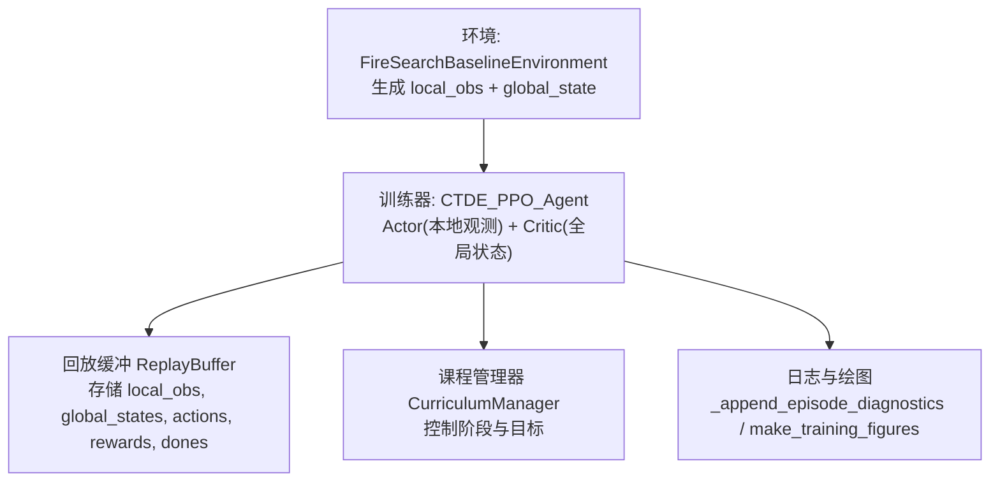
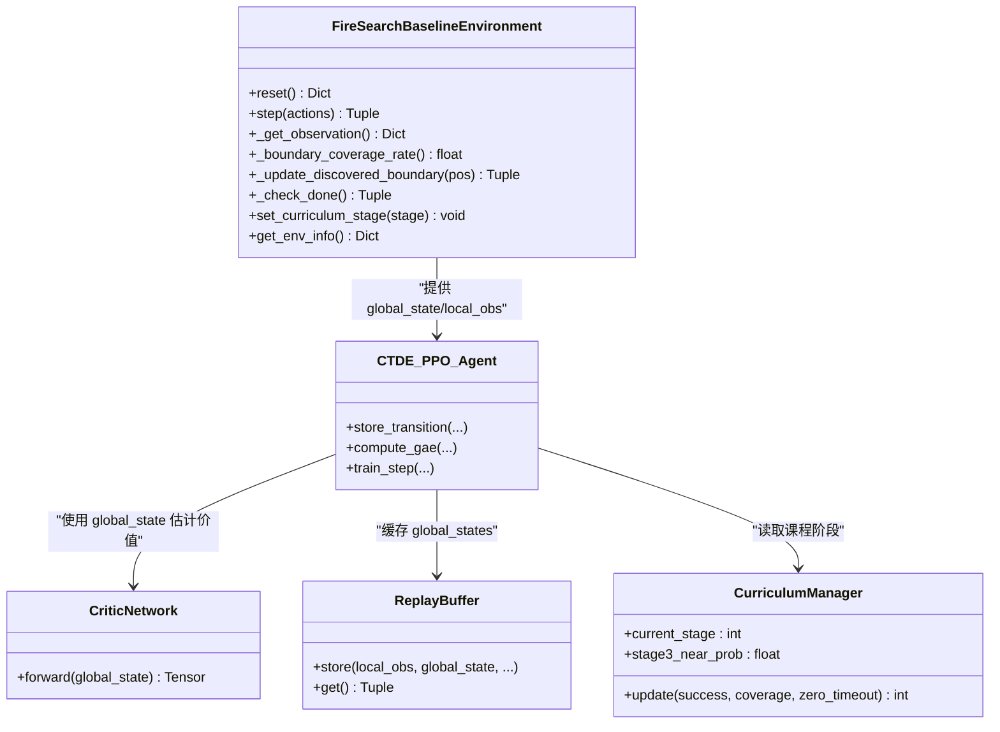

# 全局状态设计

<cite>
**本文引用的文件**
- [rl_environment_baseline.py](file://environment_variables/environment_variables/rl_environment_baseline.py)
- [ctde_ppo_baseline_train.py](file://environment_variables/environment_variables/ctde_ppo_baseline_train.py)
</cite>

## 目录
1. [引言](#引言)
2. [项目结构](#项目结构)
3. [核心组件](#核心组件)
4. [架构总览](#架构总览)
5. [详细组件分析](#详细组件分析)
6. [依赖关系分析](#依赖关系分析)
7. [性能与复杂度](#性能与复杂度)
8. [故障排查指南](#故障排查指南)
9. [结论](#结论)
10. [附录：全局特征清单与计算要点](#附录：全局特征清单与计算要点)

## 引言
本文件围绕“19维全局状态向量”的设计与实现进行系统化说明，覆盖每个特征的物理含义、聚合方法、时间窗口处理与归一化策略；解释该全局状态在CTDE（集中式训练、分布式执行）架构中的作用与优势；并提供监控与调试工具的使用建议。

## 项目结构
- 环境定义位于 rl_environment_baseline.py，负责构建观测空间、动作空间、奖励函数以及每步的局部观测与全局状态生成。
- 训练脚本位于 ctde_ppo_baseline_train.py，包含Actor/Critic网络、回放缓冲、课程学习管理器、训练循环与可视化输出等。



图表来源
- [rl_environment_baseline.py:1-1027](file://environment_variables/environment_variables/rl_environment_baseline.py#L1-L1027)
- [ctde_ppo_baseline_train.py:1-2168](file://environment_variables/environment_variables/ctde_ppo_baseline_train.py#L1-L2168)

章节来源
- [rl_environment_baseline.py:1-1027](file://environment_variables/environment_variables/rl_environment_baseline.py#L1-L1027)
- [ctde_ppo_baseline_train.py:1-2168](file://environment_variables/environment_variables/ctde_ppo_baseline_train.py#L1-L2168)

## 核心组件
- 全局状态维度声明与观测配置：
  - 全局状态维度固定为19，由环境类中的观测配置表给出。
- 全局状态构造位置：
  - 在环境的 _get_observation 中按顺序拼接19个标量特征并返回。
- 全局状态使用位置：
  - 训练脚本的 CriticNetwork 以全局状态为输入，估计价值函数；回放缓冲保存全局状态用于GAE计算与更新。

章节来源
- [rl_environment_baseline.py:24-29](file://environment_variables/environment_variables/rl_environment_baseline.py#L24-L29)
- [rl_environment_baseline.py:565-658](file://environment_variables/environment_variables/rl_environment_baseline.py#L565-L658)
- [ctde_ppo_baseline_train.py:504-534](file://environment_variables/environment_variables/ctde_ppo_baseline_train.py#L504-L534)
- [ctde_ppo_baseline_train.py:537-566](file://environment_variables/environment_variables/ctde_ppo_baseline_train.py#L537-L566)

## 架构总览
CTDE架构下，智能体采用“去中心化策略+集中式价值评估”的模式：
- Actor网络仅接收本地观测，输出动作分布。
- Critic网络接收全局状态，输出状态价值，用于PPO的GAE优势估计与价值损失。
- 全局状态提供团队级信息，使Critic能学习到更稳定的价值基准，提升训练效率与收敛质量。

```mermaid
sequenceDiagram
participant Env as "环境"
participant Agent as "CTDE_PPO_Agent"
participant Actor as "ActorNetwork(本地观测)"
participant Critic as "CriticNetwork(全局状态)"
participant Buffer as "ReplayBuffer"
Env->>Agent : step(actions) -> (local_obs, global_state, rewards, done, info)
Agent->>Actor : 对每个无人机用 local_obs 采样动作
Agent->>Critic : 用 global_state 计算价值 v(s)
Agent->>Buffer : 存入 (local_obs, global_state, action, log_prob, reward, done)
Agent->>Agent : compute_gae(rewards, dones, global_states)
Agent->>Actor : PPO策略更新
Agent->>Critic : PPO价值更新
```

图表来源
- [ctde_ppo_baseline_train.py:759-800](file://environment_variables/environment_variables/ctde_ppo_baseline_train.py#L759-L800)
- [ctde_ppo_baseline_train.py:866-919](file://environment_variables/environment_variables/ctde_ppo_baseline_train.py#L866-L919)
- [ctde_ppo_baseline_train.py:537-566](file://environment_variables/environment_variables/ctde_ppo_baseline_train.py#L537-L566)

## 详细组件分析

### 全局状态向量（19维）构成与计算
以下按构造顺序逐一说明各特征及其计算方法、归一化方式与时间窗口策略。

1. 当前覆盖率（边界覆盖率）
   - 含义：已发现的当前火边界点数占总边界点数的比例。
   - 计算：discovered_boundary ∩ current_boundary 的数量 / total_boundary_points。
   - 归一化：[0,1] 比率。
   - 时间窗口：无显式平滑，随步更新。
   - 参考路径：[rl_environment_baseline.py:253-257](file://environment_variables/environment_variables/rl_environment_baseline.py#L253-L257), [rl_environment_baseline.py:628-630](file://environment_variables/environment_variables/rl_environment_baseline.py#L628-L630)

2. 平均电池电量
   - 含义：所有无人机当前电量占最大电量的均值。
   - 计算：mean(drone_batteries) / max_battery。
   - 归一化：[0,1]。
   - 时间窗口：无。
   - 参考路径：[rl_environment_baseline.py:613-614](file://environment_variables/environment_variables/rl_environment_baseline.py#L613-L614)

3. 最小电池电量
   - 含义：所有无人机中最小电量占比。
   - 计算：min(drone_batteries) / max_battery。
   - 归一化：[0,1]。
   - 时间窗口：无。
   - 参考路径：[rl_environment_baseline.py:613-614](file://environment_variables/environment_variables/rl_environment_baseline.py#L613-L614)

4. 团队质心坐标（x,y）
   - 含义：无人机位置的二维均值，反映团队整体位置。
   - 计算：mean(drone_positions, axis=0)。
   - 归一化：分别除以网格尺寸 grid_size[0], grid_size[1]，得到相对坐标。
   - 时间窗口：无。
   - 参考路径：[rl_environment_baseline.py:615-618](file://environment_variables/environment_variables/rl_environment_baseline.py#L615-L618)

5. 团队分散程度（x,y）
   - 含义：无人机位置的标准差，反映队形分散度。
   - 计算：std(drone_positions, axis=0)。
   - 归一化：分别除以网格尺寸 grid_size[0], grid_size[1]。
   - 时间窗口：无。
   - 参考路径：[rl_environment_baseline.py:615-618](file://environment_variables/environment_variables/rl_environment_baseline.py#L615-L618)

6. 到火源平均距离
   - 含义：无人机到火边界的质心的欧氏距离的平均值。
   - 计算：mean(||pos_i - fire_centroid||)，再除以 map_norm = ||grid_size||。
   - 归一化：按地图对角线长度归一化。
   - 时间窗口：无。
   - 参考路径：[rl_environment_baseline.py:617-618](file://environment_variables/environment_variables/rl_environment_baseline.py#L617-L618)

7. 时间进度
   - 含义：当前步数占最大步数的比例。
   - 计算：step_count / max_steps。
   - 归一化：[0,1]。
   - 时间窗口：无。
   - 参考路径：[rl_environment_baseline.py:642-642](file://environment_variables/environment_variables/rl_environment_baseline.py#L642-L642)

8. 已访问区域密度
   - 含义：历史访问过的单元格数量占网格总面积的比例。
   - 计算：len(visited_cells) / (grid_size[0]*grid_size[1])。
   - 归一化：[0,1]。
   - 时间窗口：累积计数，不重置直到episode结束。
   - 参考路径：[rl_environment_baseline.py:643-643](file://environment_variables/environment_variables/rl_environment_baseline.py#L643-L643)

9. 课程学习阶段
   - 含义：离散的阶段编号归一化为连续值。
   - 计算：curriculum_stage / 3.0。
   - 归一化：[0,1]。
   - 时间窗口：阶段切换时变化。
   - 参考路径：[rl_environment_baseline.py:644-644](file://environment_variables/environment_variables/rl_environment_baseline.py#L644-L644)

10. 平均风速
    - 含义：无人机所在格点的归一化风速均值。
    - 计算：对每个无人机位置调用 _base_cell_features 获取 wind_speed_norm，再求均值。
    - 归一化：已在 _base_cell_features 内按场景最大值裁剪至[0,1]。
    - 时间窗口：无。
    - 参考路径：[rl_environment_baseline.py:620-626](file://environment_variables/environment_variables/rl_environment_baseline.py#L620-L626), [rl_environment_baseline.py:475-483](file://environment_variables/environment_variables/rl_environment_baseline.py#L475-L483)

11. 平均海拔
    - 含义：无人机所在格点的归一化DEM均值。
    - 计算：对每个无人机位置调用 _base_cell_features 获取 dem_norm，再求均值。
    - 归一化：已在 _base_cell_features 内按场景范围裁剪至[0,1]。
    - 时间窗口：无。
    - 参考路径：[rl_environment_baseline.py:620-626](file://environment_variables/environment_variables/rl_environment_baseline.py#L620-L626), [rl_environment_baseline.py:459-464](file://environment_variables/environment_variables/rl_environment_baseline.py#L459-L464)

12. 发现边界特征
    - 含义：在当前边界上被发现的边界点比例。
    - 计算：discovered_on_current_boundary_count / total_boundary_points。
    - 归一化：[0,1]。
    - 时间窗口：无。
    - 参考路径：[rl_environment_baseline.py:628-630](file://environment_variables/environment_variables/rl_environment_baseline.py#L628-L630)

13. 低电量标志
    - 含义：是否存在任意无人机电量低于阈值（max_battery*0.2）。
    - 计算：any(b < 0.2 * max_battery)。
    - 归一化：布尔转浮点。
    - 时间窗口：无。
    - 参考路径：[rl_environment_baseline.py:648-648](file://environment_variables/environment_variables/rl_environment_baseline.py#L648-L648)

14. 无人机数量
    - 含义：当前环境中无人机总数。
    - 计算：num_drones。
    - 归一化：未做额外归一化，保持原始整数。
    - 时间窗口：无。
    - 参考路径：[rl_environment_baseline.py:649-649](file://environment_variables/environment_variables/rl_environment_baseline.py#L649-L649)

15. 覆盖率梯度（预留位）
    - 含义：当前步边界覆盖率的变化率（新发现边界点比例减去前一步），用于指示探索方向的有效性。
    - 计算：_coverage_gradient = (new_on_curve - prev_on_curve) / total_boundary_points。
    - 归一化：理论上可正可负，但当前全局状态中该位置固定为0.0（见下文说明）。
    - 时间窗口：单步差分。
    - 参考路径：[rl_environment_baseline.py:924-925](file://environment_variables/environment_variables/rl_environment_baseline.py#L924-L925), [rl_environment_baseline.py:649-650](file://environment_variables/environment_variables/rl_environment_baseline.py#L649-L650)

16. 未探索密度
    - 含义：1 - 当前覆盖率，表征尚未覆盖的边界比例。
    - 计算：1.0 - current_coverage_rate。
    - 归一化：[0,1]。
    - 时间窗口：无。
    - 参考路径：[rl_environment_baseline.py:631-631](file://environment_variables/environment_variables/rl_environment_baseline.py#L631-L631)

补充说明：
- 全局状态列表长度为19，其中第15项（索引从1开始）在当前实现中被硬编码为0.0，而第17项使用了 _coverage_gradient 的真实值。因此“覆盖率梯度”的实际数据出现在第17维，而非第15维。
- 参考路径：[rl_environment_baseline.py:649-652](file://environment_variables/environment_variables/rl_environment_baseline.py#L649-L652)

章节来源
- [rl_environment_baseline.py:565-658](file://environment_variables/environment_variables/rl_environment_baseline.py#L565-L658)
- [rl_environment_baseline.py:613-652](file://environment_variables/environment_variables/rl_environment_baseline.py#L613-L652)
- [rl_environment_baseline.py:620-631](file://environment_variables/environment_variables/rl_environment_baseline.py#L620-L631)
- [rl_environment_baseline.py:924-925](file://environment_variables/environment_variables/rl_environment_baseline.py#L924-L925)

### 全局状态在CTDE中的作用与中心化训练优势
- 作用：
  - Critic网络以全局状态为输入，获得团队级视角，从而估计更准确的状态价值，指导PPO的优势估计与策略更新。
  - 全局状态帮助Critic理解任务进度（覆盖率、时间进度）、资源约束（电池）、环境态势（风、海拔、距火距离）和探索状态（未探索密度、边界发现情况）。
- 优势：
  - 集中式价值评估可缓解部分可观察性带来的方差问题，提高训练稳定性。
  - 通过全局信息引导Critic学习，有助于策略更快收敛到鲁棒行为。

章节来源
- [ctde_ppo_baseline_train.py:504-534](file://environment_variables/environment_variables/ctde_ppo_baseline_train.py#L504-L534)
- [ctde_ppo_baseline_train.py:866-919](file://environment_variables/environment_variables/ctde_ppo_baseline_train.py#L866-L919)

### 全局状态监控与调试工具使用方法
- 训练期诊断日志：
  - 每回合结束后，将 avg_distance_to_fire、first_heat_step、first_boundary_step、spawn_modes、reward_breakdown 等关键指标追加到 training_log，便于后续分析与可视化。
  - 参考路径：[ctde_ppo_baseline_train.py:452-457](file://environment_variables/environment_variables/ctde_ppo_baseline_train.py#L452-L457)
- 绘图与汇总：
  - 训练完成后，可通过 make_training_figures.py 生成训练曲线与统计图，包括完成率、超时原因分布、成功率、覆盖率等。
  - 参考路径：[ctde_ppo_baseline_train.py:1047-1115](file://environment_variables/environment_variables/ctde_ppo_baseline_train.py#L1047-L1115)
- 验证与测试：
  - test_training_diagnostics_log.py 验证了诊断日志写入的正确性，可用于回归测试。
  - 参考路径：[test_training_diagnostics_log.py:1-36](file://environment_variables/environment_variables/test_training_diagnostics_log.py#L1-L36)

章节来源
- [ctde_ppo_baseline_train.py:452-457](file://environment_variables/environment_variables/ctde_ppo_baseline_train.py#L452-L457)
- [ctde_ppo_baseline_train.py:1047-1115](file://environment_variables/environment_variables/ctde_ppo_baseline_train.py#L1047-L1115)
- [test_training_diagnostics_log.py:1-36](file://environment_variables/environment_variables/test_training_diagnostics_log.py#L1-L36)

## 依赖关系分析
- 环境与环境数据：
  - 环境通过 SceneManager 加载场景数据，并在每步根据动态火边界更新 fire_centroid 与 boundary_points。
- 环境与训练器：
  - 环境返回的 global_state 直接作为 Critic 的输入；local_obs 作为 Actor 的输入。
- 训练器内部依赖：
  - ReplayBuffer 缓存全局状态用于 GAE 计算；CurriculumManager 控制课程阶段，影响全局状态中的 curriculum_stage 字段。



图表来源
- [rl_environment_baseline.py:1-1027](file://environment_variables/environment_variables/rl_environment_baseline.py#L1-L1027)
- [ctde_ppo_baseline_train.py:504-534](file://environment_variables/environment_variables/ctde_ppo_baseline_train.py#L504-L534)
- [ctde_ppo_baseline_train.py:537-566](file://environment_variables/environment_variables/ctde_ppo_baseline_train.py#L537-L566)
- [ctde_ppo_baseline_train.py:569-751](file://environment_variables/environment_variables/ctde_ppo_baseline_train.py#L569-L751)

## 性能与复杂度
- 全局状态计算复杂度：
  - 主要开销来自遍历无人机位置并查询地形特征（风速、海拔），复杂度 O(N_drone)。
  - 边界覆盖率与集合操作涉及边界点集合，最坏情况下与边界点数线性相关。
- 内存占用：
  - ReplayBuffer 存储全局状态，维度固定为19，内存开销较小。
- 优化建议：
  - 若无人机数量较大或边界点较多，可对地形特征查询进行缓存或批量化处理。
  - 边界集合操作可使用位图或更高效的数据结构加速。

[本节为通用性能讨论，无需具体文件引用]

## 故障排查指南
- 全局状态维度不一致：
  - 检查 OBSERVATION_PROFILE_DIMS 中 global_state_dim 是否为19，确保环境初始化正确。
  - 参考路径：[rl_environment_baseline.py:24-29](file://environment_variables/environment_variables/rl_environment_baseline.py#L24-L29)
- 覆盖率梯度未生效：
  - 确认全局状态列表中对应位置是否被硬编码为0.0；如需启用，应改为使用 _coverage_gradient 的值。
  - 参考路径：[rl_environment_baseline.py:649-652](file://environment_variables/environment_variables/rl_environment_baseline.py#L649-L652), [rl_environment_baseline.py:924-925](file://environment_variables/environment_variables/rl_environment_baseline.py#L924-L925)
- 低电量标志异常：
  - 检查 max_battery 的计算逻辑与阈值设置（0.2倍），确保与动作导致的能耗一致。
  - 参考路径：[rl_environment_baseline.py:648-648](file://environment_variables/environment_variables/rl_environment_baseline.py#L648-L648)
- 课程阶段未推进：
  - 查看 CurriculumManager 的门槛条件（成功率、零覆盖率超时率、覆盖率）是否满足。
  - 参考路径：[ctde_ppo_baseline_train.py:621-738](file://environment_variables/environment_variables/ctde_ppo_baseline_train.py#L621-L738)

章节来源
- [rl_environment_baseline.py:24-29](file://environment_variables/environment_variables/rl_environment_baseline.py#L24-L29)
- [rl_environment_baseline.py:648-652](file://environment_variables/environment_variables/rl_environment_baseline.py#L648-L652)
- [rl_environment_baseline.py:924-925](file://environment_variables/environment_variables/rl_environment_baseline.py#L924-L925)
- [ctde_ppo_baseline_train.py:621-738](file://environment_variables/environment_variables/ctde_ppo_baseline_train.py#L621-L738)

## 结论
19维全局状态提供了团队级态势感知与任务进度信息，配合CTDE架构下的集中式价值评估，显著提升了训练的稳定性和收敛速度。通过对每个特征的明确定义与合理的归一化策略，全局状态既具备可读性又利于模型学习。建议在后续迭代中启用覆盖率梯度的真实值，并根据需要引入时间窗口平滑以提升鲁棒性。

[本节为总结性内容，无需具体文件引用]

## 附录：全局特征清单与计算要点
- 特征顺序与含义（与代码构造顺序一致）：
  1. 当前覆盖率（边界覆盖率）
  2. 平均电池电量
  3. 最小电池电量
  4. 团队质心坐标 x（归一化）
  5. 团队质心坐标 y（归一化）
  6. 团队分散程度 x（归一化）
  7. 团队分散程度 y（归一化）
  8. 到火源平均距离（归一化）
  9. 时间进度
  10. 已访问区域密度
  11. 课程学习阶段（归一化）
  12. 平均风速（归一化）
  13. 平均海拔（归一化）
  14. 发现边界特征
  15. 低电量标志
  16. 无人机数量
  17. 覆盖率梯度（当前实现为0.0，实际梯度在第17维使用）
  18. 未探索密度
  19. （注：此处为19维，上述列表共18项，第17项为覆盖率梯度，第18项为未探索密度；请核对代码构造顺序以确保对齐）

- 归一化策略：
  - 比率类特征（覆盖率、时间进度、密度、阶段）均在[0,1]区间。
  - 坐标与分散度按网格尺寸归一化。
  - 距离按地图对角线长度归一化。
  - 地形特征（风速、海拔）在 _base_cell_features 中按场景最大值或范围裁剪至[0,1]。

- 时间窗口处理：
  - 大多数特征为瞬时值，无显式滑动窗口。
  - 覆盖率梯度为单步差分，体现短期变化趋势。
  - 已访问区域密度为累计计数，直至episode结束重置。

章节来源
- [rl_environment_baseline.py:565-658](file://environment_variables/environment_variables/rl_environment_baseline.py#L565-L658)
- [rl_environment_baseline.py:620-631](file://environment_variables/environment_variables/rl_environment_baseline.py#L620-L631)
- [rl_environment_baseline.py:924-925](file://environment_variables/environment_variables/rl_environment_baseline.py#L924-L925)