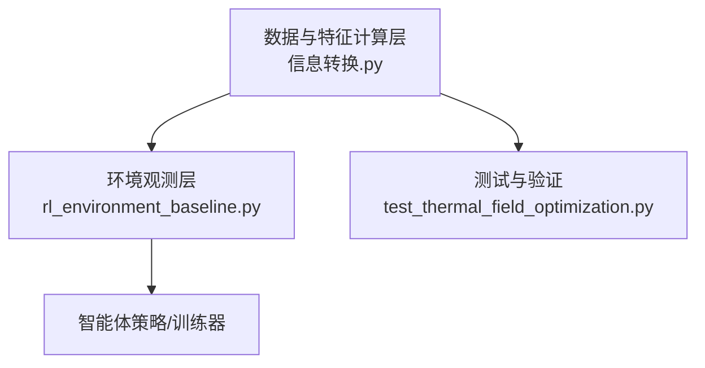
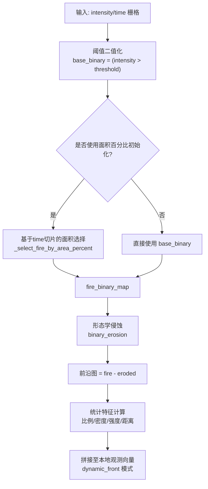
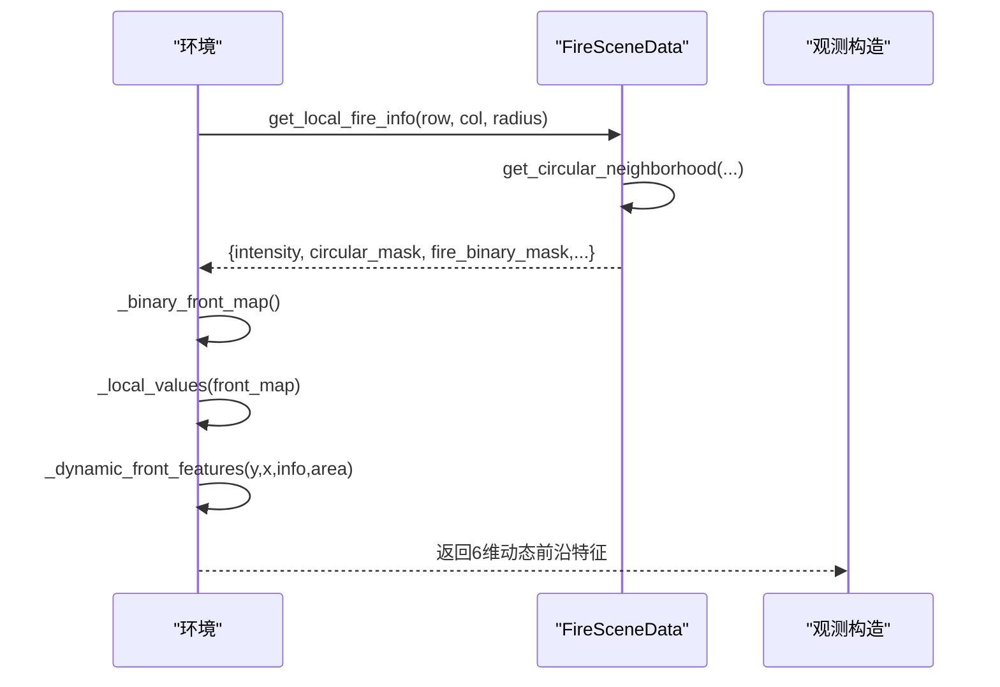
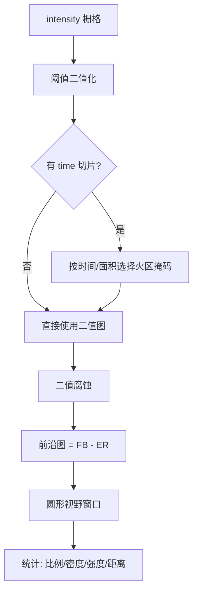
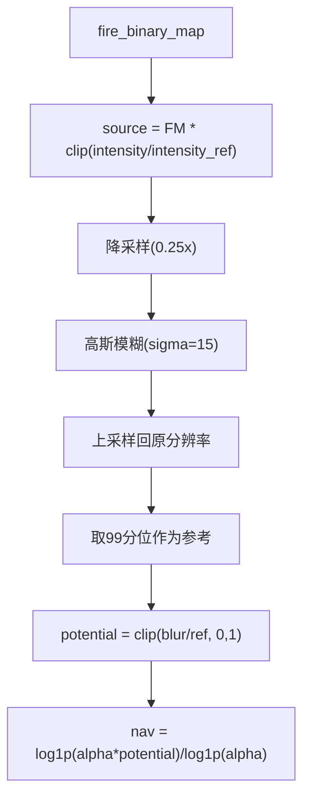
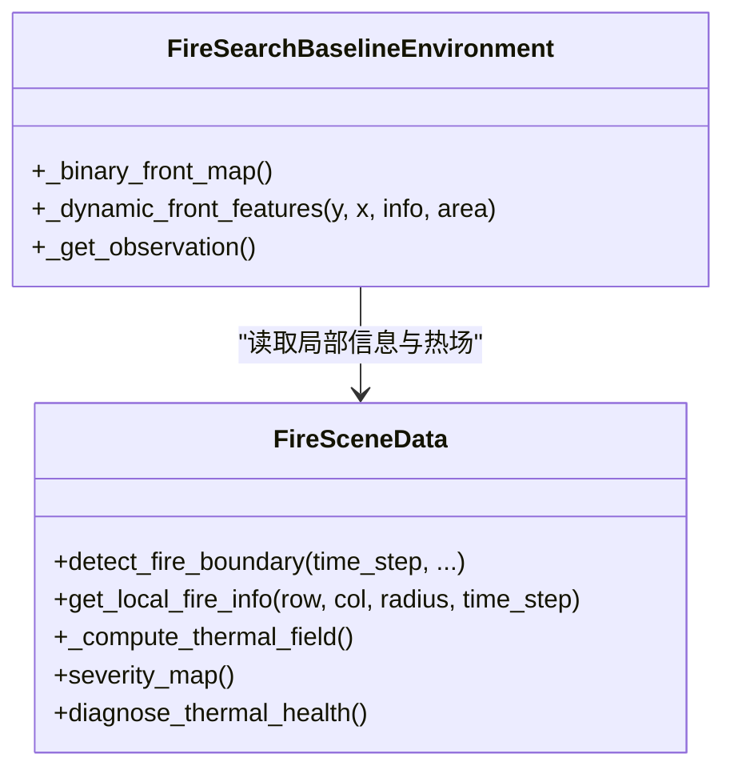

# 动态前沿观测模式

<cite>
**本文引用的文件**   
- [信息转换.py](file://environment_variables/environment_variables/outputs/lr_comparison_20260709_095438/训练结果/训练源码/信息转换.py)
- [rl_environment_baseline.py](file://environment_variables/environment_variables/rl_environment_baseline.py)
- [test_thermal_field_optimization.py](file://environment_variables/environment_variables/test_thermal_field_optimization.py)
</cite>

## 目录
1. [引言](#引言)
2. [项目结构](#项目结构)
3. [核心组件](#核心组件)
4. [架构总览](#架构总览)
5. [详细组件分析](#详细组件分析)
6. [依赖关系分析](#依赖关系分析)
7. [性能与复杂度](#性能与复杂度)
8. [可视化与监控](#可视化与监控)
9. [不同火灾场景下的表现分析](#不同火灾场景下的表现分析)
10. [故障排查指南](#故障排查指南)
11. [结论](#结论)

## 引言
本文件面向“动态前沿观测模式”，在基础观测之上新增6维动态前沿特征，用于帮助无人机在多机协同搜索中自适应地感知并响应火势蔓延的动态变化。该模式通过二值化前沿图构建、形态学操作与统计特征计算，输出以下6个实时指标：
- 视野内火点比例
- 前沿点比例
- 边界点密度
- 平均热强度
- 最大热强度
- 最近火点距离

这些特征与热场语义重建（热势场）结合，为智能体提供稳定的梯度引导与风险感知能力，从而提升对复杂、快速变化的火场态势的适应能力。

## 项目结构
围绕动态前沿观测模式的核心实现主要分布在两个模块：
- 数据与特征计算层：负责从FARSITE栅格数据加载、归一化、前沿检测、热场重建与局部信息聚合。
- 环境观测层：将上述特征组装为多机环境的本地观测向量，并在不同观察配置下切换特征集。

图表来源
- [信息转换.py:219-1426](file://environment_variables/environment_variables/outputs/lr_comparison_20260709_095438/训练结果/训练源码/信息转换.py#L219-L1426)
- [rl_environment_baseline.py:21-658](file://environment_variables/environment_variables/rl_environment_baseline.py#L21-L658)
- [test_thermal_field_optimization.py:1-70](file://environment_variables/environment_variables/test_thermal_field_optimization.py#L1-L70)

章节来源
- [信息转换.py:219-1426](file://environment_variables/environment_variables/outputs/lr_comparison_20260709_095438/训练结果/训练源码/信息转换.py#L219-L1426)
- [rl_environment_baseline.py:21-658](file://environment_variables/environment_variables/rl_environment_baseline.py#L21-L658)

## 核心组件
- FireSceneData：场景数据加载、归一化参数推导、时间切片选择、前沿检测、热场重建、局部邻域聚合与诊断工具。
- FireSearchBaselineEnvironment：多机环境封装，按观察配置拼接本地观测向量，其中包含“dynamic_front”模式的6维动态前沿特征。
- 单元测试：验证热场输出的范围、形状与梯度健康度，确保语义层稳定可用。

章节来源
- [信息转换.py:219-1426](file://environment_variables/environment_variables/outputs/lr_comparison_20260709_095438/训练结果/训练源码/信息转换.py#L219-L1426)
- [rl_environment_baseline.py:21-658](file://environment_variables/environment_variables/rl_environment_baseline.py#L21-L658)
- [test_thermal_field_optimization.py:1-70](file://environment_variables/environment_variables/test_thermal_field_optimization.py#L1-L70)

## 架构总览
下图展示了动态前沿观测模式的数据流与关键处理步骤：从原始强度栅格到二值化前沿图，再到形态学边缘提取与统计特征计算，最终汇入环境观测向量。

图表来源
- [信息转换.py:821-887](file://environment_variables/environment_variables/outputs/lr_comparison_20260709_095438/训练结果/训练源码/信息转换.py#L821-L887)
- [信息转换.py:723-757](file://environment_variables/environment_variables/outputs/lr_comparison_20260709_095438/训练结果/训练源码/信息转换.py#L723-L757)
- [rl_environment_baseline.py:534-552](file://environment_variables/environment_variables/rl_environment_baseline.py#L534-L552)

## 详细组件分析

### 动态前沿特征定义与计算
- 视野内火点比例：以无人机圆形视野为窗口，统计火点像素占比。
- 前沿点比例：在相同窗口内统计前沿像素占比。
- 边界点密度：窗口内边界点数量除以窗口面积。
- 平均热强度：窗口内火点的平均强度，按场景归一化上限缩放。
- 最大热强度：窗口内火点的最大强度，按场景归一化上限缩放。
- 最近火点距离：窗口内所有火点到无人机中心的最近距离，按视野半径归一化。

上述6维特征由环境层的动态前沿函数统一计算并拼接到本地观测向量中。

图表来源
- [信息转换.py:1070-1123](file://environment_variables/environment_variables/outputs/lr_comparison_20260709_095438/训练结果/训练源码/信息转换.py#L1070-L1123)
- [rl_environment_baseline.py:504-514](file://environment_variables/environment_variables/rl_environment_baseline.py#L504-L514)
- [rl_environment_baseline.py:534-552](file://environment_variables/environment_variables/rl_environment_baseline.py#L534-L552)

章节来源
- [rl_environment_baseline.py:534-552](file://environment_variables/environment_variables/rl_environment_baseline.py#L534-L552)
- [信息转换.py:1070-1123](file://environment_variables/environment_variables/outputs/lr_comparison_20260709_095438/训练结果/训练源码/信息转换.py#L1070-L1123)

### 前沿检测算法实现原理
- 二值化前沿图构建：
  - 基于强度阈值生成基础二值图。
  - 若提供时间切片或面积百分比，则依据时间映射或目标面积选择当前时刻的火区掩码。
- 形态学操作：
  - 对火区掩码进行二值腐蚀，得到内部区域。
  - 前沿图 = 火区掩码 - 腐蚀结果，即仅保留边界一层像素。
- 统计特征计算：
  - 在无人机圆形视野窗口内，分别统计火点、前沿点数量，计算比例与密度。
  - 对窗口内的强度值求均值与最大值，并按场景归一化上限缩放。
  - 计算最近火点距离，并以视野半径做归一化。

图表来源
- [信息转换.py:821-887](file://environment_variables/environment_variables/outputs/lr_comparison_20260709_095438/训练结果/训练源码/信息转换.py#L821-L887)
- [信息转换.py:723-757](file://environment_variables/environment_variables/outputs/lr_comparison_20260709_095438/训练结果/训练源码/信息转换.py#L723-L757)

章节来源
- [信息转换.py:821-887](file://environment_variables/environment_variables/outputs/lr_comparison_20260709_095438/训练结果/训练源码/信息转换.py#L821-L887)
- [信息转换.py:723-757](file://environment_variables/environment_variables/outputs/lr_comparison_20260709_095438/训练结果/训练源码/信息转换.py#L723-L757)

### 热场语义重建与导航场
- 语义重建链路：
  - 源信号 = 火区掩码 × clip(intensity / intensity_ref, 0, 1)。
  - 降采样 + 高斯模糊 → 上采样回原分辨率。
  - 以正样本的99百分位作为参考，进行稳健归一化，得到热势 [0,1]。
- 导航场：
  - 对热势进行 log 压缩，增强低值区梯度，避免高热区梯度消失。
- 健康诊断：
  - 检查饱和比例、非零比例、高热区零梯度比例等指标，保障训练稳定性。

图表来源
- [信息转换.py:759-819](file://environment_variables/environment_variables/outputs/lr_comparison_20260709_095438/训练结果/训练源码/信息转换.py#L759-L819)
- [test_thermal_field_optimization.py:25-66](file://environment_variables/environment_variables/test_thermal_field_optimization.py#L25-L66)

章节来源
- [信息转换.py:759-819](file://environment_variables/environment_variables/outputs/lr_comparison_20260709_095438/训练结果/训练源码/信息转换.py#L759-L819)
- [test_thermal_field_optimization.py:25-66](file://environment_variables/environment_variables/test_thermal_field_optimization.py#L25-L66)

### 动态特征如何帮助无人机适应动态变化
- 前沿点比例与边界点密度：指示无人机所处位置靠近活跃前沿的程度，有助于引导其向蔓延方向移动。
- 平均/最大热强度：反映局部燃烧剧烈程度，辅助规避高风险区域或聚焦强热点。
- 最近火点距离：量化威胁紧迫性，驱动无人机保持安全距离或主动逼近以获取更多信息。
- 与热势梯度结合：在未见前沿时，热势梯度提供弱引导，使无人机在预边界阶段也能有效探索。

章节来源
- [rl_environment_baseline.py:534-552](file://environment_variables/environment_variables/rl_environment_baseline.py#L534-L552)
- [信息转换.py:933-970](file://environment_variables/environment_variables/outputs/lr_comparison_20260709_095438/训练结果/训练源码/信息转换.py#L933-L970)

## 依赖关系分析
- 数据层与环境层解耦：环境仅调用数据层的接口获取局部信息与全局状态，便于替换或扩展特征。
- 关键依赖：
  - 形态学操作：二值腐蚀用于提取前沿。
  - 图像重采样与滤波：降采样+高斯模糊+上采样，平衡精度与性能。
  - 统计与几何：窗口内计数、均值、极值、欧氏距离。

图表来源
- [信息转换.py:219-1426](file://environment_variables/environment_variables/outputs/lr_comparison_20260709_095438/训练结果/训练源码/信息转换.py#L219-L1426)
- [rl_environment_baseline.py:21-658](file://environment_variables/environment_variables/rl_environment_baseline.py#L21-L658)

章节来源
- [信息转换.py:219-1426](file://environment_variables/environment_variables/outputs/lr_comparison_20260709_095438/训练结果/训练源码/信息转换.py#L219-L1426)
- [rl_environment_baseline.py:21-658](file://environment_variables/environment_variables/rl_environment_baseline.py#L21-L658)

## 性能与复杂度
- 前沿检测：
  - 二值化 O(HW)，腐蚀 O(HW)，前沿差 O(HW)。
  - 窗口统计 O(A)，A 为圆形视野内像素数。
- 热场重建：
  - 降采样与上采样 O(HW)，高斯模糊 O(HW·k^2)，整体线性于像素规模。
- 空间占用：
  - 存储 fire_binary_map、thermal_field、_nav_field 等中间矩阵，内存与地图尺寸成正比。
- 优化建议：
  - 缓存局部窗口结果，避免重复计算。
  - 根据任务需求调整视野半径与模糊核大小，权衡精度与速度。

[本节为通用性能讨论，不直接分析具体文件]

## 可视化与监控
- 前沿可视化工具：
  - 使用 active_front 方法获取当前时刻的前沿图，叠加在地图上显示。
  - 使用 current_fire 获取火区掩码，便于对比前沿与火区覆盖。
- 特征监控方法：
  - 诊断热场健康：检查饱和比例、非零比例、高热区零梯度比例等，确保梯度可用。
  - 记录动态前沿特征的时序曲线，评估无人机在不同阶段的探测效率。

章节来源
- [信息转换.py:892-901](file://environment_variables/environment_variables/outputs/lr_comparison_20260709_095438/训练结果/训练源码/信息转换.py#L892-L901)
- [信息转换.py:972-1012](file://environment_variables/environment_variables/outputs/lr_comparison_20260709_095438/训练结果/训练源码/信息转换.py#L972-L1012)

## 不同火灾场景下的表现分析
- 快速蔓延型：
  - 前沿点比例与边界点密度上升较快，无人机应优先向高密度前沿区域移动。
  - 最近火点距离缩短，需提高风险规避权重。
- 分散多点型：
  - 平均热强度可能较低但最大热强度突出，建议关注热点并兼顾前沿覆盖。
- 稳定扩散型：
  - 前沿连续且密度稳定，适合采用均衡策略，同时利用热势梯度进行预边界探索。
- 弱信号型：
  - 强度接近阈值，前沿稀疏；依赖热势梯度与探索奖励，避免陷入局部最优。

[本节为概念性分析，不直接引用具体代码文件]

## 故障排查指南
- 热场未初始化：
  - 现象：访问热场或导航场时报错或返回零。
  - 排查：确认 fire_binary_map 已设置，再调用热场重建。
- 无有效前沿：
  - 现象：前沿图为空或边界点数量为0。
  - 排查：检查强度阈值、时间切片与面积百分比参数，确保存在有效火区掩码。
- 梯度消失：
  - 现象：高热区梯度接近零。
  - 排查：查看热场健康诊断报告，调整 log 压缩系数或模糊核大小。
- 数值溢出或饱和：
  - 现象：热场出现大量饱和值。
  - 排查：检查归一化参考值与裁剪范围，确保稳健归一化生效。

章节来源
- [信息转换.py:759-819](file://environment_variables/environment_variables/outputs/lr_comparison_20260709_095438/训练结果/训练源码/信息转换.py#L759-L819)
- [信息转换.py:972-1012](file://environment_variables/environment_variables/outputs/lr_comparison_20260709_095438/训练结果/训练源码/信息转换.py#L972-L1012)

## 结论
动态前沿观测模式通过严谨的二值化与形态学流程，结合稳健的热势重建与导航场设计，为无人机提供了可解释、可监控、可扩展的6维动态前沿特征。这些特征不仅提升了前沿探测与边界覆盖的效率，还在预边界阶段提供了稳定的梯度引导，使智能体能够自适应地应对不同火灾场景的动态变化。配合可视化与健康诊断工具，可在训练与部署过程中持续监控与调优，确保系统鲁棒性与性能。