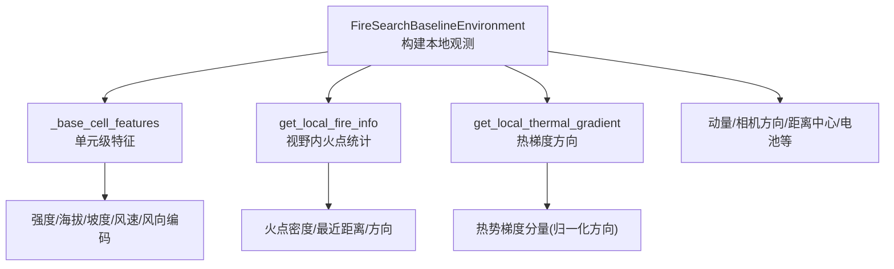
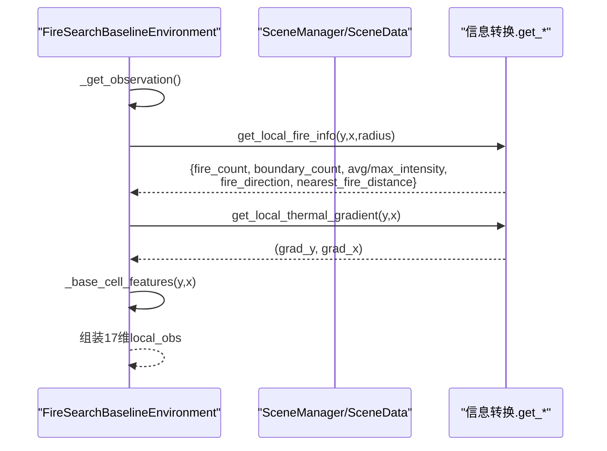
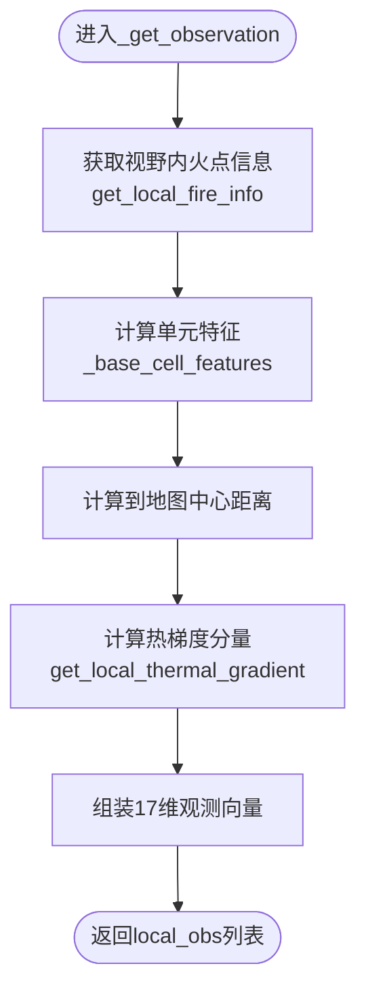
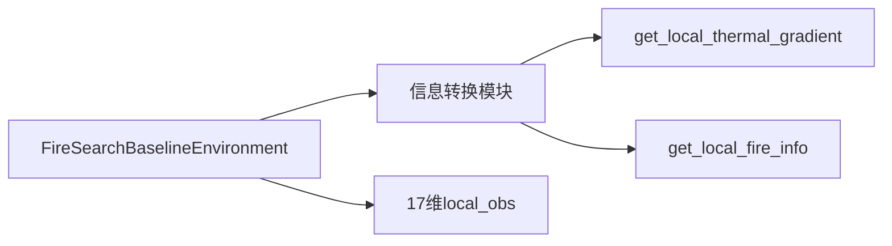

# 基础观测模式

<cite>
**本文引用的文件**   
- [rl_environment_baseline.py](file://environment_variables/environment_variables/rl_environment_baseline.py)
- [信息转换.py](file://environment_variables/environment_variables/信息转换.py)
</cite>

## 目录
1. [简介](#简介)
2. [项目结构](#项目结构)
3. [核心组件](#核心组件)
4. [架构总览](#架构总览)
5. [详细组件分析](#详细组件分析)
6. [依赖关系分析](#依赖关系分析)
7. [性能考量](#性能考量)
8. [故障排查指南](#故障排查指南)
9. [结论](#结论)
10. [附录](#附录)

## 简介
本文件针对“基础观测模式（baseline）”的17维局部观测向量进行系统化文档说明，覆盖每个特征的数学定义、取值范围、归一化方法与物理意义；给出特征提取的实现要点与调试方法；并总结该模式的适用场景与性能特点。

## 项目结构
- 基础观测模式由环境类统一生成：每架无人机一个长度为17的本地观测向量，同时返回全局状态向量用于集中式训练。
- 关键实现位于环境类的观测构造函数中，静态地形、动态前沿、风险感知等扩展特征通过观察配置切换，但“baseline”固定为17维。

图表来源
- [rl_environment_baseline.py:565-658](file://environment_variables/environment_variables/rl_environment_baseline.py#L565-L658)
- [信息转换.py:933-970](file://environment_variables/environment_variables/信息转换.py#L933-L970)
- [信息转换.py:1070-1123](file://environment_variables/environment_variables/信息转换.py#L1070-L1123)

章节来源
- [rl_environment_baseline.py:24-29](file://environment_variables/environment_variables/rl_environment_baseline.py#L24-L29)
- [rl_environment_baseline.py:565-658](file://environment_variables/environment_variables/rl_environment_baseline.py#L565-L658)

## 核心组件
- 观测维度声明：baseline 模式 local_obs_dim=17，global_state_dim=19。
- 观测构造流程：对每架无人机依次计算17个特征，拼接为浮点数组。
- 数据来源：
  - 环境内部状态：位置、电池、动量、步数、覆盖率等。
  - 场景数据与环境接口：热力场、地形、风场、火场边界等。

章节来源
- [rl_environment_baseline.py:24-29](file://environment_variables/environment_variables/rl_environment_baseline.py#L24-L29)
- [rl_environment_baseline.py:565-658](file://environment_variables/environment_variables/rl_environment_baseline.py#L565-L658)

## 架构总览
下图展示了从环境到数据源再到观测向量的调用链。

图表来源
- [rl_environment_baseline.py:565-658](file://environment_variables/environment_variables/rl_environment_baseline.py#L565-L658)
- [信息转换.py:933-970](file://environment_variables/environment_variables/信息转换.py#L933-L970)
- [信息转换.py:1070-1123](file://environment_variables/environment_variables/信息转换.py#L1070-L1123)

## 详细组件分析
本节逐一解释17维局部观测向量的每个特征维度，包括数学定义、取值范围、归一化方法与物理意义，并指出对应实现位置以便定位代码。

### 维度索引与含义
- 0: 无人机Y坐标归一化
- 1: 无人机X坐标归一化
- 2: 电池电量归一化
- 3: 热强度归一化值
- 4: 视野内火点密度
- 5: 到地图中心距离归一化
- 6: 风速归一化
- 7: 风向正弦编码
- 8: 风向余弦编码
- 9: 海拔归一化
- 10: 坡度归一化
- 11: 热梯度Y分量
- 12: 热梯度X分量
- 13: 动量Y分量
- 14: 动量X分量
- 15: 相机方向Y分量（归一化）
- 16: 相机方向X分量（归一化）

### 各维度详细说明

#### 0 无人机Y坐标归一化
- 数学定义: pos_y / grid_height
- 取值范围: [0, 1]
- 归一化方法: 按网格高度线性缩放
- 物理意义: 表示无人机在垂直方向的相对位置，利于尺度无关学习
- 实现参考: [rl_environment_baseline.py:584-586](file://environment_variables/environment_variables/rl_environment_baseline.py#L584-L586)

#### 1 无人机X坐标归一化
- 数学定义: pos_x / grid_width
- 取值范围: [0, 1]
- 归一化方法: 按网格宽度线性缩放
- 物理意义: 表示无人机在水平方向的相对位置
- 实现参考: [rl_environment_baseline.py:584-586](file://environment_variables/environment_variables/rl_environment_baseline.py#L584-L586)

#### 2 电池电量归一化
- 数学定义: battery / max_battery
- 取值范围: [0, 1]
- 归一化方法: 以最大电池容量为分母线性缩放
- 物理意义: 反映剩余能量比例，影响续航与探索策略
- 实现参考: [rl_environment_baseline.py:584-587](file://environment_variables/environment_variables/rl_environment_baseline.py#L584-L587)

#### 3 热强度归一化值
- 数学定义: intensity / intensity_max（若存在fire_binary_map且当前格非火，则置0）
- 取值范围: [0, 1]
- 归一化方法: 使用场景归一化参数中的intensity_max做除法，并clip至[0,1]
- 物理意义: 表征当前位置的热辐射强度相对最大值的大小
- 实现参考: [rl_environment_baseline.py:438-490](file://environment_variables/environment_variables/rl_environment_baseline.py#L438-L490)

#### 4 视野内火点密度
- 数学定义: fire_count / local_area，其中local_area=(2*radius+1)^2
- 取值范围: [0, 1]
- 归一化方法: 用视野面积作为分母，得到密度比例
- 物理意义: 衡量视野范围内火点的密集程度，指导搜索优先级
- 实现参考: [rl_environment_baseline.py:584-589](file://environment_variables/environment_variables/rl_environment_baseline.py#L584-L589)
- 数据来源: [信息转换.py:1070-1123](file://environment_variables/environment_variables/信息转换.py#L1070-L1123)

#### 5 到地图中心距离归一化
- 数学定义: ||pos - center|| / ||grid_size||
- 取值范围: [0, 1]
- 归一化方法: 欧氏距离除以地图对角线长度
- 物理意义: 指示无人机离地图中心的远近，有助于全局探索平衡
- 实现参考: [rl_environment_baseline.py:578-580](file://environment_variables/environment_variables/rl_environment_baseline.py#L578-L580)

#### 6 风速归一化
- 数学定义: wind_speed / wind_speed_max
- 取值范围: [0, 1]
- 归一化方法: 使用场景归一化参数中的wind_speed_max做除法，并clip至[0,1]
- 物理意义: 表征风对飞行能耗与轨迹的影响强度
- 实现参考: [rl_environment_baseline.py:475-483](file://environment_variables/environment_variables/rl_environment_baseline.py#L475-L483)

#### 7 风向正弦编码
- 数学定义: sin(wind_direction_rad)，其中wind_direction_rad=degrees→radians
- 取值范围: [-1, 1]
- 归一化方法: 三角编码保持周期性连续
- 物理意义: 将角度信息转换为可微的二维向量分量
- 实现参考: [rl_environment_baseline.py:485-488](file://environment_variables/environment_variables/rl_environment_baseline.py#L485-L488)

#### 8 风向余弦编码
- 数学定义: cos(wind_direction_rad)
- 取值范围: [-1, 1]
- 归一化方法: 同上
- 物理意义: 与正弦共同构成风向单位向量
- 实现参考: [rl_environment_baseline.py:485-488](file://environment_variables/environment_variables/rl_environment_baseline.py#L485-L488)

#### 9 海拔归一化
- 数学定义: (dem - dem_min) / (dem_max - dem_min)
- 取值范围: [0, 1]
- 归一化方法: 基于场景归一化参数的区间缩放，并clip至[0,1]
- 物理意义: 反映地形高程的相对大小，影响热扩散与可见性
- 实现参考: [rl_environment_baseline.py:459-464](file://environment_variables/environment_variables/rl_environment_baseline.py#L459-L464)

#### 10 坡度归一化
- 数学定义: slope / slope_max
- 取值范围: [0, 1]
- 归一化方法: 使用场景归一化参数中的slope_max做除法，并clip至[0,1]
- 物理意义: 地表倾斜程度，影响火势蔓延与无人机机动难度
- 实现参考: [rl_environment_baseline.py:466-473](file://environment_variables/environment_variables/rl_environment_baseline.py#L466-L473)

#### 11 热梯度Y分量
- 数学定义: 基于nav_field的离散差分dy = h_down - h_up，再归一化为方向分量
- 取值范围: [-1, 1]
- 归一化方法: 先计算dy,dx，再按sqrt(dy^2+dx^2)归一化；若模长过小则返回0
- 物理意义: 指向热势上升的方向（朝向热源），用于引导搜索
- 实现参考: [信息转换.py:933-970](file://environment_variables/environment_variables/信息转换.py#L933-L970)

#### 12 热梯度X分量
- 数学定义: dx = h_right - h_left，归一化方式同Y分量
- 取值范围: [-1, 1]
- 物理意义: 与Y分量共同构成单位梯度方向
- 实现参考: [信息转换.py:933-970](file://environment_variables/environment_variables/信息转换.py#L933-L970)

#### 13 动量Y分量
- 数学定义: new_pos_y - old_pos_y
- 取值范围: {-1, 0, 1}（四邻域移动）
- 物理意义: 记录上一时刻的移动方向，提供运动惯性线索
- 实现参考: [rl_environment_baseline.py:580-581](file://environment_variables/environment_variables/rl_environment_baseline.py#L580-L581)

#### 14 动量X分量
- 数学定义: new_pos_x - old_pos_x
- 取值范围: {-1, 0, 1}
- 物理意义: 同上
- 实现参考: [rl_environment_baseline.py:580-581](file://environment_variables/environment_variables/rl_environment_baseline.py#L580-L581)

#### 15 相机方向Y分量（归一化）
- 数学定义: fire_direction_y / max(vision_radius, 1)
- 取值范围: [-1, 1]
- 归一化方法: 以视野半径为分母，将方向向量缩放到单位圆附近
- 物理意义: 指示火点重心相对于无人机的方向，辅助定向搜索
- 实现参考: [rl_environment_baseline.py:582-583](file://environment_variables/environment_variables/rl_environment_baseline.py#L582-L583)
- 数据来源: [信息转换.py:1070-1123](file://environment_variables/environment_variables/信息转换.py#L1070-L1123)

#### 16 相机方向X分量（归一化）
- 数学定义: fire_direction_x / max(vision_radius, 1)
- 取值范围: [-1, 1]
- 物理意义: 与Y分量共同构成相机指向的火源方向
- 实现参考: [rl_environment_baseline.py:582-583](file://environment_variables/environment_variables/rl_environment_baseline.py#L582-L583)

### 特征提取流程图

图表来源
- [rl_environment_baseline.py:565-658](file://environment_variables/environment_variables/rl_environment_baseline.py#L565-L658)
- [信息转换.py:933-970](file://environment_variables/environment_variables/信息转换.py#L933-L970)
- [信息转换.py:1070-1123](file://environment_variables/environment_variables/信息转换.py#L1070-L1123)

章节来源
- [rl_environment_baseline.py:438-490](file://environment_variables/environment_variables/rl_environment_baseline.py#L438-L490)
- [rl_environment_baseline.py:565-658](file://environment_variables/environment_variables/rl_environment_baseline.py#L565-L658)
- [信息转换.py:933-970](file://environment_variables/environment_variables/信息转换.py#L933-L970)
- [信息转换.py:1070-1123](file://environment_variables/environment_variables/信息转换.py#L1070-L1123)

## 依赖关系分析
- 环境类依赖场景数据模块提供的热场、地形、风场、火场边界等信息。
- 热梯度与火点信息通过信息转换模块的接口获取，确保数值稳定与语义一致。

图表来源
- [rl_environment_baseline.py:565-658](file://environment_variables/environment_variables/rl_environment_baseline.py#L565-L658)
- [信息转换.py:933-970](file://environment_variables/environment_variables/信息转换.py#L933-L970)
- [信息转换.py:1070-1123](file://environment_variables/environment_variables/信息转换.py#L1070-L1123)

章节来源
- [rl_environment_baseline.py:565-658](file://environment_variables/environment_variables/rl_environment_baseline.py#L565-L658)
- [信息转换.py:933-970](file://environment_variables/environment_variables/信息转换.py#L933-L970)
- [信息转换.py:1070-1123](file://environment_variables/environment_variables/信息转换.py#L1070-L1123)

## 性能考量
- 计算复杂度：每步对每架无人机执行常数时间操作，主要开销来自热梯度与火点信息的局部窗口扫描，受vision_radius影响。
- 数值稳定性：所有归一化均使用clip或除数保护，避免除零与溢出；风向采用sin/cos编码避免角度不连续。
- 可扩展性：通过observation_profile切换可增加静态地形、动态前沿、风险感知等特征，但不改变baseline的17维结构。

## 故障排查指南
- 热梯度为零：当热势过低或边界外时，梯度返回0；检查热力场是否初始化以及阈值设置。
  - 参考: [信息转换.py:933-970](file://environment_variables/environment_variables/信息转换.py#L933-L970)
- 火点信息为空：若无火或视野无火，返回默认字典；确认fire_binary_map与intensity数据可用。
  - 参考: [信息转换.py:1070-1123](file://environment_variables/environment_variables/信息转换.py#L1070-L1123)
- 归一化越界：若出现超出[0,1]的情况，检查norm_params是否正确加载与除数保护逻辑。
  - 参考: [rl_environment_baseline.py:438-490](file://environment_variables/environment_variables/rl_environment_baseline.py#L438-L490)
- 观测维度不一致：确认observation_profile为"baseline"，否则可能附加额外特征导致维度变化。
  - 参考: [rl_environment_baseline.py:24-29](file://environment_variables/environment_variables/rl_environment_baseline.py#L24-L29)

章节来源
- [信息转换.py:933-970](file://environment_variables/environment_variables/信息转换.py#L933-L970)
- [信息转换.py:1070-1123](file://environment_variables/environment_variables/信息转换.py#L1070-L1123)
- [rl_environment_baseline.py:438-490](file://environment_variables/environment_variables/rl_environment_baseline.py#L438-L490)
- [rl_environment_baseline.py:24-29](file://environment_variables/environment_variables/rl_environment_baseline.py#L24-L29)

## 结论
基础观测模式以17维轻量特征集提供了无人机位置、能源、热场、地形、风场、运动与相机方向等关键信息，兼顾了表达力与计算效率。其归一化与编码策略保证了数值稳定与学习友好，适用于多机协同火场边界搜索任务。

## 附录
- 适用场景
  - 多无人机协同搜索火场边界，强调快速收敛与低延迟决策。
  - 需要稳定的局部观测输入，便于CTDE-PPO等算法训练。
- 性能特点
  - 低维度、高鲁棒性、易扩展；适合大规模并行训练与部署。
- 调试建议
  - 打印每步local_obs的统计分布，检查异常值与饱和现象。
  - 可视化热梯度方向与相机方向，验证是否与火源位置一致。
  - 对比不同vision_radius下的观测分布，评估感受野对特征的影响。