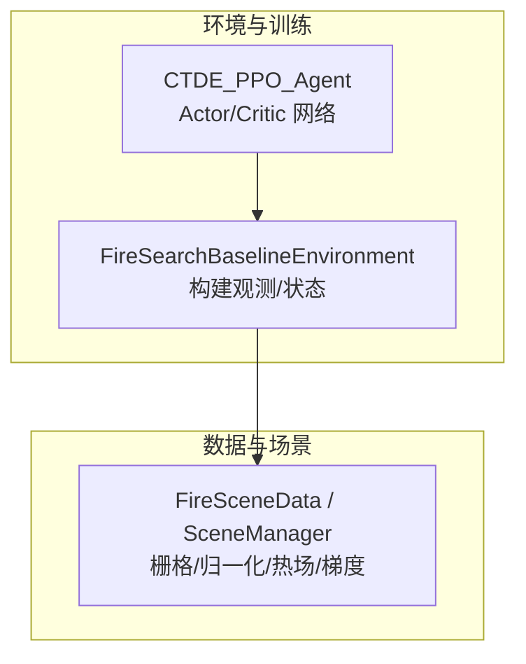
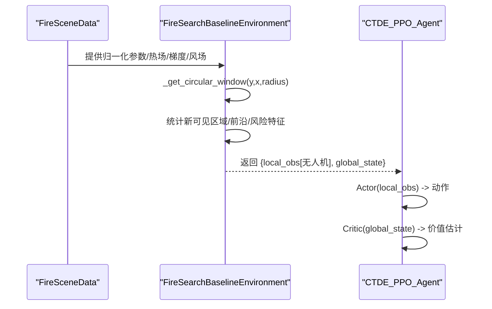
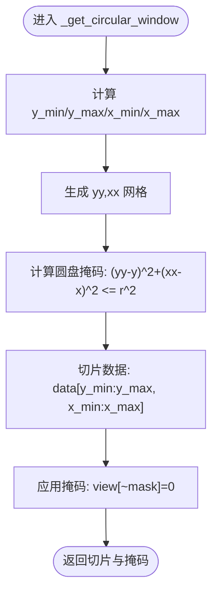
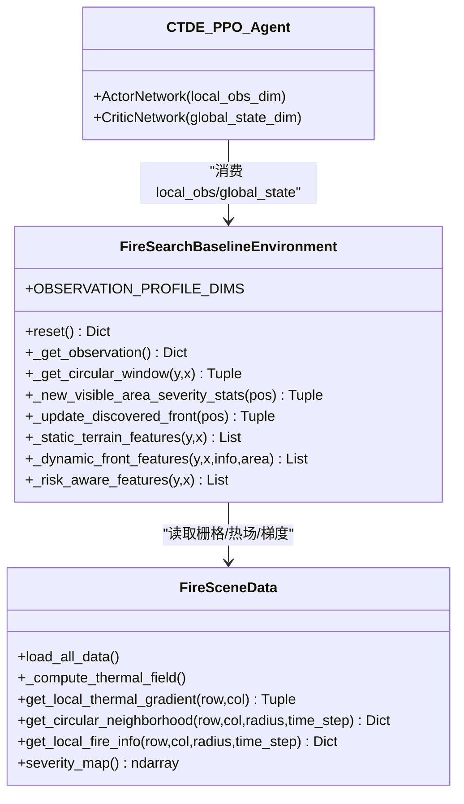

# 观测空间设计

<cite>
**本文引用的文件**   
- [rl_environment_baseline.py](file://environment_variables/environment_variables/rl_environment_baseline.py)
- [ctde_ppo_baseline_train.py](file://environment_variables/environment_variables/ctde_ppo_baseline_train.py)
- [信息转换.py](file://environment_variables/environment_variables/信息转换.py)
</cite>

## 目录
1. [引言](#引言)
2. [项目结构](#项目结构)
3. [核心组件](#核心组件)
4. [架构总览](#架构总览)
5. [详细组件分析](#详细组件分析)
6. [依赖关系分析](#依赖关系分析)
7. [性能考量](#性能考量)
8. [故障排查指南](#故障排查指南)
9. [结论](#结论)
10. [附录](#附录)

## 引言
本文件面向多无人机协同搜索任务中的“观测空间系统”，系统性阐述局部观测（17维）与全局状态（19维）的设计原理、数据构成与计算流程；详解四种观测配置模式（baseline、static_terrain、dynamic_front、risk_aware）的特征提取方法与维度变化；给出无人机位置编码、电池归一化、热梯度计算、风向特征等关键特征的数学定义与实现要点；说明视野范围内信息聚合策略（圆形窗口采样、统计特征、距离加权）的算法实现；并提供可视化示例与调试方法，以及观测空间的扩展机制与自定义特征添加指南。

## 项目结构
围绕观测空间的核心代码分布在三个文件中：
- 环境与环境接口：FireSearchBaselineEnvironment 负责构建局部观测与全局状态，管理视野窗口、边界发现、风险与动态前沿特征等。
- 训练脚本：CTDE-PPO 训练器根据环境暴露的 local_obs_dim 与 global_state_dim 构造 Actor/Critic 网络。
- 场景与数据层：信息转换模块提供栅格加载、归一化参数推导、热场重建、梯度计算、圆形邻域与火场信息聚合等基础能力。

图表来源
- [rl_environment_baseline.py:21-131](file://environment_variables/environment_variables/rl_environment_baseline.py#L21-L131)
- [ctde_ppo_baseline_train.py:460-535](file://environment_variables/environment_variables/ctde_ppo_baseline_train.py#L460-L535)
- [信息转换.py:219-322](file://environment_variables/environment_variables/信息转换.py#L219-L322)

章节来源
- [rl_environment_baseline.py:21-131](file://environment_variables/environment_variables/rl_environment_baseline.py#L21-L131)
- [ctde_ppo_baseline_train.py:460-535](file://environment_variables/environment_variables/ctde_ppo_baseline_train.py#L460-L535)
- [信息转换.py:219-322](file://environment_variables/environment_variables/信息转换.py#L219-L322)

## 核心组件
- FireSearchBaselineEnvironment
  - 维护不同 observation_profile 对应的维度映射，生成每架无人机的局部观测向量与一个全局状态向量。
  - 提供圆形视野窗口、新可见区域统计、前沿更新、风险感知特征等工具。
- CTDE_PPO_Agent
  - 依据 local_obs_dim 与 global_state_dim 初始化 Actor（基于局部观测）与 Critic（基于全局状态）。
- FireSceneData / SceneManager
  - 读取并标准化栅格数据，推导 per-scene 归一化参数，构建热势场与导航场，计算热梯度、风场、严重度图、圆形邻域与火场统计。

章节来源
- [rl_environment_baseline.py:24-29](file://environment_variables/environment_variables/rl_environment_baseline.py#L24-L29)
- [ctde_ppo_baseline_train.py:760-810](file://environment_variables/environment_variables/ctde_ppo_baseline_train.py#L760-L810)
- [信息转换.py:559-602](file://environment_variables/environment_variables/信息转换.py#L559-L602)

## 架构总览
下图展示从数据到观测/状态的端到端流程：场景数据经归一化与热场重建后，环境在每个时间步为每架无人机抽取圆形视野内的统计特征，拼接成本地观测；同时汇总团队级指标形成全局状态。

图表来源
- [rl_environment_baseline.py:259-304](file://environment_variables/environment_variables/rl_environment_baseline.py#L259-L304)
- [信息转换.py:933-970](file://environment_variables/environment_variables/信息转换.py#L933-L970)
- [ctde_ppo_baseline_train.py:460-535](file://environment_variables/environment_variables/ctde_ppo_baseline_train.py#L460-L535)

## 详细组件分析

### 观测配置与维度
- 维度映射表
  - baseline: 本地观测 17 维，全局状态 19 维
  - static_terrain: 本地观测 24 维，全局状态 19 维
  - dynamic_front: 本地观测 23 维，全局状态 19 维
  - risk_aware: 本地观测 20 维，全局状态 19 维
- 选择与校验
  - 训练脚本在配置阶段校验 observation_profile 是否合法，并将维度字典注入训练流程。

章节来源
- [rl_environment_baseline.py:24-29](file://environment_variables/environment_variables/rl_environment_baseline.py#L24-L29)
- [ctde_ppo_baseline_train.py:192-205](file://environment_variables/environment_variables/ctde_ppo_baseline_train.py#L192-L205)

### 局部观测（baseline，17维）构成与含义
以下按顺序列出 baseline 模式的 17 个分量（均为浮点型，已做合理缩放或归一化）：
1. 无人机行坐标归一化：pos_y / grid_height
2. 无人机列坐标归一化：pos_x / grid_width
3. 电池电量归一化：battery / max_battery
4. 当前格强度归一化：intensity_norm（受 fire_binary_map 掩码影响）
5. 视野内火点数密度：fire_count / local_area
6. 距地图中心距离归一化：||pos - center|| / ||grid_size||
7. 风速归一化：wind_speed_norm
8. 风向正弦：sin(wind_direction_rad)
9. 风向余弦：cos(wind_direction_rad)
10. 高程归一化：dem_norm
11. 坡度归一化：slope_norm
12. 热梯度 y 方向单位向量：grad_y
13. 热梯度 x 方向单位向量：grad_x
14. 无人机动量 y 分量：mom_y
15. 无人机动量 x 分量：mom_x
16. 相机指向（朝向火场质心）y 分量归一化：cam_dir_y / vision_radius
17. 相机指向 x 分量归一化：cam_dir_x / vision_radius

说明
- 强度、DEM、坡度、风速均使用 per-scene 归一化参数进行 0~1 裁剪。
- 风向采用 sin/cos 双通道避免角度不连续。
- 热梯度来自 log 压缩后的导航场，避免高值区梯度消失。
- 相机指向由视野内火场质心相对位置计算，并按视野半径归一化。

章节来源
- [rl_environment_baseline.py:565-611](file://environment_variables/environment_variables/rl_environment_baseline.py#L565-L611)
- [信息转换.py:1187-1234](file://environment_variables/environment_variables/信息转换.py#L1187-L1234)
- [信息转换.py:933-970](file://environment_variables/environment_variables/信息转换.py#L933-L970)

### 全局状态（19维）构成与含义
全局状态包含团队级统计与进度信息，用于集中式 Critic 评估：
1. 当前边界覆盖率：discovered_boundary / total_boundary_points
2. 平均电池归一化：mean(battery)/max_battery
3. 最小电池归一化：min(battery)/max_battery
4. 团队质心行坐标归一化：mean(pos_y)/grid_height
5. 团队质心列坐标归一化：mean(pos_x)/grid_width
6. 团队离散程度行：std(pos_y)/grid_height
7. 团队离散程度列：std(pos_x)/grid_width
8. 平均距火场质心距离归一化：mean(||pos - centroid||)/||grid_size||
9. 时间进度：step / max_steps
10. 已访问面积比例：visited_cells / (H*W)
11. 课程阶段归一化：curriculum_stage / 3.0
12. 平均风速归一化：mean(wind_speed_norm)
13. 平均高程归一化：mean(dem_norm)
14. 已确认边界占比：discovered_on_current_boundary / total_boundary_points
15. 低电量指示：any(battery < 0.2 * max_battery)
16. 无人机数量：num_drones
17. 占位项：0.0（预留扩展）
18. 覆盖率趋势：_coverage_gradient（滑动增量）
19. 未探索密度：1.0 - current_coverage_rate

章节来源
- [rl_environment_baseline.py:613-658](file://environment_variables/environment_variables/rl_environment_baseline.py#L613-L658)

### 静态地形特征（static_terrain，+7维）
在 baseline 基础上追加 7 维静态地形特征：
- 坡向正弦/余弦：sin(aspect), cos(aspect)
- 燃料模型归一化：fuel_model_norm
- 冠层覆盖归一化：canopy_cover_norm
- 冠层高归一化：canopy_height_norm
- 冠层底高归一化：canopy_base_height_norm
- 冠层体密度归一化：canopy_bulk_density_norm

这些特征通过 _normalized_static_value 对整幅栅格取最大值作为分母进行 0~1 归一化。

章节来源
- [rl_environment_baseline.py:521-532](file://environment_variables/environment_variables/rl_environment_baseline.py#L521-L532)
- [rl_environment_baseline.py:492-497](file://environment_variables/environment_variables/rl_environment_baseline.py#L492-L497)

### 动态前沿特征（dynamic_front，+6维）
在 baseline 基础上追加 6 维动态前沿相关特征：
- 视野内火点比例：sum(fire > 0) / local_area
- 视野内活跃前沿比例：sum(front > 0) / local_area
- 视野内边界点密度：boundary_count / local_area
- 平均强度归一化：avg_intensity / intensity_max
- 最大强度归一化：max_intensity / intensity_max
- 最近火点距离归一化：nearest_fire_distance / vision_radius

其中 active front 由二值火场图膨胀/腐蚀得到边缘像素集合。

章节来源
- [rl_environment_baseline.py:534-552](file://environment_variables/environment_variables/rl_environment_baseline.py#L534-L552)
- [rl_environment_baseline.py:504-514](file://environment_variables/environment_variables/rl_environment_baseline.py#L504-L514)

### 风险感知特征（risk_aware，+3维）
在 baseline 基础上追加 3 维风险感知特征：
- 当前位置严重度归一化：severity[y, x]
- 视野内严重度均值：mean(severity_patch)
- 视野内严重度最大值：max(severity_patch)

严重度图由强度、火焰长度、蔓延速率、单位面积热量、冠火活动等多源指标加权合成。

章节来源
- [rl_environment_baseline.py:554-563](file://environment_variables/environment_variables/rl_environment_baseline.py#L554-L563)
- [信息转换.py:903-918](file://environment_variables/environment_variables/信息转换.py#L903-L918)

### 关键特征的数学定义与计算方法
- 无人机位置编码
  - 行/列坐标分别除以网格尺寸，得到 [0,1] 范围内的相对位置。
- 电池状态归一化
  - battery / max_battery，max_battery 通常与 max_steps 成比例设置。
- 热梯度计算
  - 先构建热势场 thermal_field ∈ [0,1]，再对 log 压缩后的导航场 nav_field = log1p(α·potential)/log1p(α) 求有限差分，得到单位方向的梯度 (dy,dx)。
- 风向特征
  - 风向角转弧度后以 sin/cos 双通道表示，避免角度跳变；风速按 wind_speed_max 归一化。
- 视野内信息聚合
  - 圆形窗口：以无人机为中心、半径为 vision_radius 的圆盘掩码，裁剪矩形 patch 后仅保留圆内像素。
  - 统计特征：计数、均值、最大值、密度（计数/面积）、比例（如前沿比例）。
  - 距离加权：在部分统计中采用 nearest_fire_distance/vision_radius 进行归一化，体现距离衰减效应。

章节来源
- [rl_environment_baseline.py:259-267](file://environment_variables/environment_variables/rl_environment_baseline.py#L259-L267)
- [信息转换.py:759-819](file://environment_variables/environment_variables/信息转换.py#L759-L819)
- [信息转换.py:933-970](file://environment_variables/environment_variables/信息转换.py#L933-L970)
- [信息转换.py:1187-1234](file://environment_variables/environment_variables/信息转换.py#L1187-L1234)

### 视野范围的信息聚合策略
- 圆形窗口采样
  - 通过 ogird 与距离阈值生成圆盘掩码，将矩形切片与掩码相乘，屏蔽圆外像素。
- 统计特征计算
  - 对新可见区域 mask = circle & ~discovered 进行计数与严重度均值/最大值统计。
  - 前沿检测：对二值火场进行形态学腐蚀，front = fire - eroded，统计圆内前沿像素比例。
- 距离加权
  - 使用最近火点距离与视野半径比值作为归一化特征，反映探测难度与紧迫性。

图表来源
- [rl_environment_baseline.py:259-267](file://environment_variables/environment_variables/rl_environment_baseline.py#L259-L267)
- [信息转换.py:1014-1068](file://environment_variables/environment_variables/信息转换.py#L1014-L1068)

章节来源
- [rl_environment_baseline.py:277-304](file://environment_variables/environment_variables/rl_environment_baseline.py#L277-L304)
- [信息转换.py:1014-1068](file://environment_variables/environment_variables/信息转换.py#L1014-L1068)

### 类与函数关系图（代码级）

图表来源
- [rl_environment_baseline.py:21-131](file://environment_variables/environment_variables/rl_environment_baseline.py#L21-L131)
- [信息转换.py:219-322](file://environment_variables/environment_variables/信息转换.py#L219-L322)
- [ctde_ppo_baseline_train.py:460-535](file://environment_variables/environment_variables/ctde_ppo_baseline_train.py#L460-L535)

## 依赖关系分析
- 环境依赖数据层
  - 环境通过 FireSceneData 获取归一化参数、热场、梯度、风场、严重度图等。
- 训练器依赖环境
  - 训练脚本根据环境的 local_obs_dim 与 global_state_dim 实例化 Actor/Critic。
- 数据层内部依赖
  - 热场重建依赖强度栅格与二值火场；梯度计算依赖导航场；风场可从 ASC 文件或 weather_stream 解析。

图表来源
- [ctde_ppo_baseline_train.py:760-810](file://environment_variables/environment_variables/ctde_ppo_baseline_train.py#L760-L810)
- [rl_environment_baseline.py:21-131](file://environment_variables/environment_variables/rl_environment_baseline.py#L21-L131)
- [信息转换.py:370-490](file://environment_variables/environment_variables/信息转换.py#L370-L490)

章节来源
- [ctde_ppo_baseline_train.py:760-810](file://environment_variables/environment_variables/ctde_ppo_baseline_train.py#L760-L810)
- [rl_environment_baseline.py:21-131](file://environment_variables/environment_variables/rl_environment_baseline.py#L21-L131)
- [信息转换.py:370-490](file://environment_variables/environment_variables/信息转换.py#L370-L490)

## 性能考量
- 圆形窗口与掩码运算
  - 使用 numpy 广播与布尔索引，避免显式循环；建议保持 vision_radius 适中，避免过大导致内存与计算开销上升。
- 热场与梯度
  - 热场采用降采样+高斯模糊+上采样，显著降低计算量；导航场 log 压缩提升梯度稳定性。
- 缓存与复用
  - 严重度图与热场在场景内可缓存；SceneManager 共享场景缓存，避免重复加载与归一化计算。
- 归一化参数
  - per-scene p99.5 或最大值归一化，减少跨场景分布差异，有利于训练稳定。

[本节为通用指导，无需特定文件引用]

## 故障排查指南
- 热场健康诊断
  - 检查饱和比例、高热区零梯度比例、非零比例与分位数，确保热场语义层正常。
- 边界有效性
  - 验证 t=0 边界点是否为空；若为空则场景无效，需调整 init_area_percent 或检查输入栅格。
- 风场形状一致性
  - 风场速度/方向栅格必须与静态地图同形，否则抛出形状不匹配错误。
- 观测维度不一致
  - 若 observation_profile 不在支持列表，训练脚本会抛出异常；请核对配置。

章节来源
- [信息转换.py:972-1012](file://environment_variables/environment_variables/信息转换.py#L972-L1012)
- [信息转换.py:684-721](file://environment_variables/environment_variables/信息转换.py#L684-L721)
- [信息转换.py:670-678](file://environment_variables/environment_variables/信息转换.py#L670-L678)
- [ctde_ppo_baseline_train.py:192-205](file://environment_variables/environment_variables/ctde_ppo_baseline_train.py#L192-L205)

## 结论
本观测空间以“局部观测 + 全局状态”的双通道设计，兼顾分布式决策与集中式评估。baseline 的 17 维聚焦于位置、能量、热力梯度与风向等基础信号；static_terrain/dynamic_front/risk_aware 三种扩展模式分别引入静态地形、动态前沿与风险感知特征，使智能体在不同任务侧重点下具备更强的表征能力。圆形窗口与统计聚合策略在保证实时性的同时，提供了丰富的上下文信息。配合 per-scene 归一化与热场稳健重建，整体观测空间具备良好的数值稳定性与可扩展性。

[本节为总结性内容，无需特定文件引用]

## 附录

### 观测空间扩展机制与自定义特征添加指南
- 新增观测模式
  - 在 FireSearchBaselineEnvironment.OBSERVATION_PROFILE_DIMS 中添加新 profile 及其 local/global 维度。
  - 在 _get_observation 的条件分支中增加对应特征拼接逻辑（参考 static_terrain/dynamic_front/risk_aware 的实现方式）。
- 新增特征字段
  - 若涉及栅格数据，先在 FireSceneData 中完成加载与归一化（参考 normalized_map/_derive_norm_params），并在环境层按需聚合（圆形窗口统计、均值/最大值/密度等）。
  - 对于角度类特征，优先使用 sin/cos 双通道表示。
- 全局状态扩展
  - 在 _get_observation 的全局状态列表中追加团队级统计或进度指标，注意保持 global_state_dim 一致。
- 训练器适配
  - 训练脚本会自动读取 environment 暴露的 local_obs_dim 与 global_state_dim，无需修改网络结构即可适配新维度。
- 可视化与调试
  - 使用 get_circular_neighborhood 输出圆形窗口切片与掩码，结合 matplotlib 绘制视野范围与统计结果。
  - 使用 diagnose_thermal_health 检查热场质量；使用 validate_scene_boundaries 预检数据集边界有效性。

章节来源
- [rl_environment_baseline.py:24-29](file://environment_variables/environment_variables/rl_environment_baseline.py#L24-L29)
- [rl_environment_baseline.py:565-611](file://environment_variables/environment_variables/rl_environment_baseline.py#L565-L611)
- [信息转换.py:616-637](file://environment_variables/environment_variables/信息转换.py#L616-L637)
- [信息转换.py:1014-1068](file://environment_variables/environment_variables/信息转换.py#L1014-L1068)
- [信息转换.py:972-1012](file://environment_variables/environment_variables/信息转换.py#L972-L1012)
- [信息转换.py:1329-1416](file://environment_variables/environment_variables/信息转换.py#L1329-L1416)