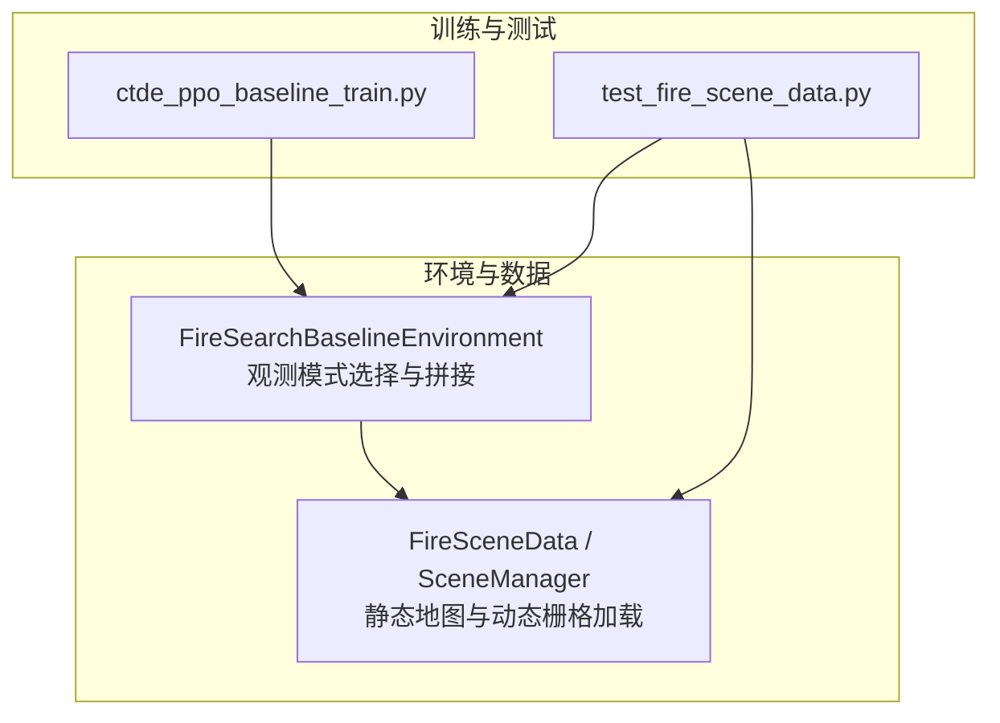
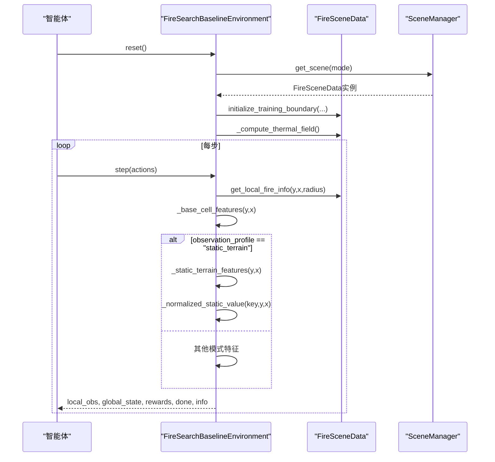
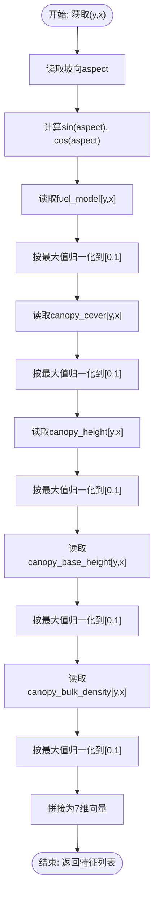
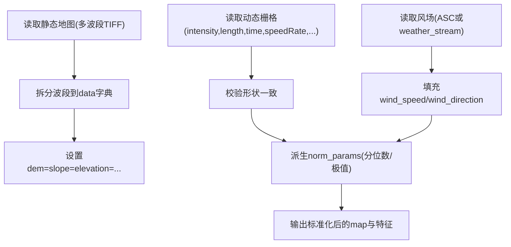
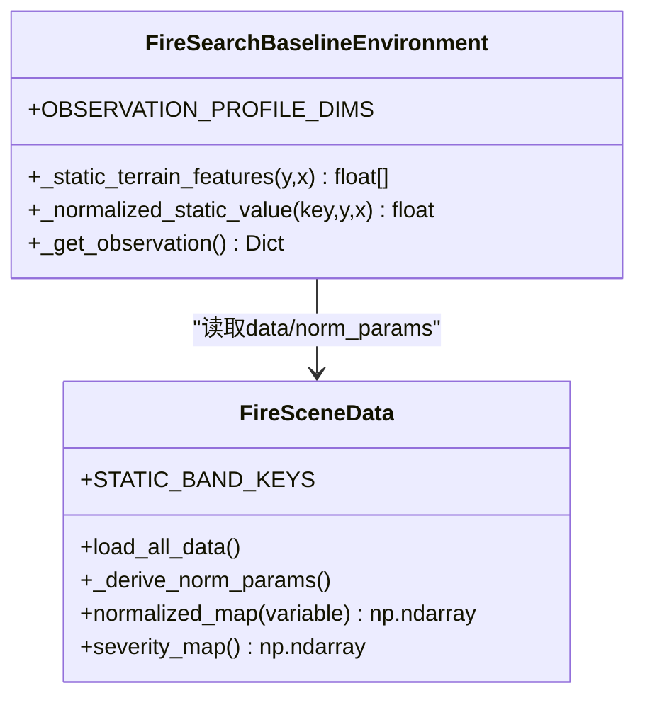
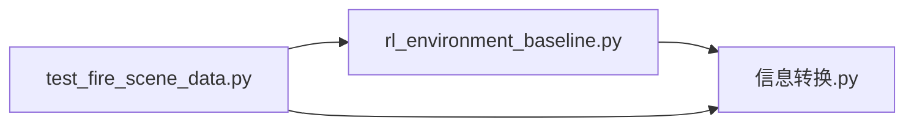

# 静态地形观测模式

<cite>
**本文引用的文件**   
- [rl_environment_baseline.py](file://environment_variables/environment_variables/rl_environment_baseline.py)
- [信息转换.py](file://environment_variables/environment_variables/信息转换.py)
- [test_fire_scene_data.py](file://environment_variables/environment_variables/test_fire_scene_data.py)
</cite>

## 目录
1. [简介](#简介)
2. [项目结构](#项目结构)
3. [核心组件](#核心组件)
4. [架构总览](#架构总览)
5. [详细组件分析](#详细组件分析)
6. [依赖关系分析](#依赖关系分析)
7. [性能与使用建议](#性能与使用建议)
8. [故障排查指南](#故障排查指南)
9. [结论](#结论)
10. [附录：可视化与特征重要性方法](#附录可视化与特征重要性方法)

## 简介
本文件面向“静态地形观测模式”，解释在基础观测之上新增的7维静态环境特征：坡向的正弦余弦编码、燃料模型、冠层覆盖度、冠层高度、冠层底部高度、冠层体积密度等。文档涵盖数据来源、预处理与归一化策略，说明这些静态特征如何影响无人机搜索策略，并提供可视化与特征重要性分析方法，以及该模式相比基础模式的实践建议。

## 项目结构
本项目围绕多无人机火场边界搜索任务构建，包含数据加载与场景管理、环境定义（含多种观测模式）、训练脚本与测试用例。静态地形观测模式由环境类提供，并通过数据模块读取栅格与静态地图，完成归一化与特征构造。

图表来源
- [rl_environment_baseline.py:21-157](file://environment_variables/environment_variables/rl_environment_baseline.py#L21-L157)
- [信息转换.py:219-322](file://environment_variables/environment_variables/信息转换.py#L219-L322)
- [test_fire_scene_data.py:158-189](file://environment_variables/environment_variables/test_fire_scene_data.py#L158-L189)

章节来源
- [rl_environment_baseline.py:21-157](file://environment_variables/environment_variables/rl_environment_baseline.py#L21-L157)
- [信息转换.py:219-322](file://environment_variables/environment_variables/信息转换.py#L219-L322)
- [test_fire_scene_data.py:158-189](file://environment_variables/environment_variables/test_fire_scene_data.py#L158-L189)

## 核心组件
- FireSearchBaselineEnvironment：实现多无人机离散动作空间、局部观测与全局状态，支持多种观测模式（baseline、static_terrain、dynamic_front、risk_aware）。
- FireSceneData / SceneManager：负责从数据集索引加载场景、读取静态地图与动态栅格、计算热势场与梯度、导出标准化参数与各类地图。
- 测试用例：验证不同观测模式的维度一致性、归一化裁剪行为与奖励分解键完整性。

章节来源
- [rl_environment_baseline.py:21-157](file://environment_variables/environment_variables/rl_environment_baseline.py#L21-L157)
- [信息转换.py:219-322](file://environment_variables/environment_variables/信息转换.py#L219-L322)
- [test_fire_scene_data.py:158-189](file://environment_variables/environment_variables/test_fire_scene_data.py#L158-L189)

## 架构总览
下图展示静态地形观测模式的数据流与调用关系：环境在构造时确定观测维度；每步生成观测时，根据所选模式拼接静态地形特征；数据来自静态地图与动态栅格，经统一归一化后进入智能体。

图表来源
- [rl_environment_baseline.py:331-360](file://environment_variables/environment_variables/rl_environment_baseline.py#L331-L360)
- [rl_environment_baseline.py:565-611](file://environment_variables/environment_variables/rl_environment_baseline.py#L565-L611)
- [信息转换.py:698-721](file://environment_variables/environment_variables/信息转换.py#L698-L721)
- [信息转换.py:759-819](file://environment_variables/environment_variables/信息转换.py#L759-L819)

## 详细组件分析

### 静态地形观测模式：7维特征定义与构造
- 坡向正弦余弦编码：将坡向角度转换为sin/cos对，避免方向特征的周期性不连续问题。
- 燃料模型：表征可燃物类型或等级，用于估计燃烧特性。
- 冠层覆盖度：树冠投影覆盖率，影响火势蔓延与可见性。
- 冠层高度：植被垂直尺度，关联冠层火风险。
- 冠层底部高度：地表至冠层底部的距离，决定地表火是否易跃迁为冠层火。
- 冠层体积密度：单位体积内可燃物质量，影响热量释放与传播。

上述7维特征在每步观测中按位置(y,x)采样并拼接至局部观测向量末尾。

图表来源
- [rl_environment_baseline.py:521-532](file://environment_variables/environment_variables/rl_environment_baseline.py#L521-L532)
- [rl_environment_baseline.py:492-498](file://environment_variables/environment_variables/rl_environment_baseline.py#L492-L498)

章节来源
- [rl_environment_baseline.py:521-532](file://environment_variables/environment_variables/rl_environment_baseline.py#L521-L532)
- [rl_environment_baseline.py:492-498](file://environment_variables/environment_variables/rl_environment_baseline.py#L492-L498)

### 数据来源与预处理流程
- 静态地图：通过多波段TIFF加载，包含elevation、slope、aspect、fuel_model、canopy_cover、canopy_height、canopy_base_height、canopy_bulk_density共8个波段，分别映射到data字典中的同名键。
- 动态栅格：强度、长度、时间、速度率等随时间变化的栅格，用于边界检测与热势场计算。
- 风场：优先从ASC文件读取，否则从天气流解析均值风速与风向，填充为全图常量场。
- 归一化参数：基于场景统计与分位数估算，如dem_min/dem_max、slope_max、wind_speed_max、intensity_max等，确保各特征处于稳定数值范围。

图表来源
- [信息转换.py:501-524](file://environment_variables/environment_variables/信息转换.py#L501-L524)
- [信息转换.py:639-682](file://environment_variables/environment_variables/信息转换.py#L639-L682)
- [信息转换.py:559-602](file://environment_variables/environment_variables/信息转换.py#L559-L602)

章节来源
- [信息转换.py:501-524](file://environment_variables/environment_variables/信息转换.py#L501-L524)
- [信息转换.py:639-682](file://environment_variables/environment_variables/信息转换.py#L639-L682)
- [信息转换.py:559-602](file://environment_variables/environment_variables/信息转换.py#L559-L602)

### 归一化策略
- 静态地形特征：采用“按最大值归一化”的策略，即对每个静态字段取全局非负最大值作为分母，并将像素值裁剪到[0,1]区间。缺失字段默认补零。
- 动态与环境特征：DEM按dem_min/dem_max线性缩放；坡度、风速按各自max缩放；风向以sin/cos编码；强度等按分位数或最大参考值缩放。
- 热势场：先按场景强度参考值裁剪，再下采样+高斯模糊，最后按99百分位稳健归一化到[0,1]，并对导航场进行log压缩以保留梯度。

图表来源
- [rl_environment_baseline.py:24-29](file://environment_variables/environment_variables/rl_environment_baseline.py#L24-L29)
- [rl_environment_baseline.py:492-498](file://environment_variables/environment_variables/rl_environment_baseline.py#L492-L498)
- [信息转换.py:237-246](file://environment_variables/environment_variables/信息转换.py#L237-L246)
- [信息转换.py:616-637](file://environment_variables/environment_variables/信息转换.py#L616-L637)

章节来源
- [rl_environment_baseline.py:24-29](file://environment_variables/environment_variables/rl_environment_baseline.py#L24-L29)
- [rl_environment_baseline.py:492-498](file://environment_variables/environment_variables/rl_environment_baseline.py#L492-L498)
- [信息转换.py:237-246](file://environment_variables/environment_variables/信息转换.py#L237-L246)
- [信息转换.py:616-637](file://environment_variables/environment_variables/信息转换.py#L616-L637)

### 静态地形特征对无人机搜索策略的影响机制
- 坡向sin/cos：帮助智能体识别迎风/背风坡向差异，结合风向特征可调整移动方向以降低能耗或提升探测效率。
- 燃料模型：高可燃物区域可能预示更高蔓延速度与强度，智能体可提前靠近边界或规避高风险区。
- 冠层覆盖度/高度/底部高度/体积密度：共同刻画冠层火潜力与蔓延路径，有助于智能体在观测稀疏时做出更合理的探索决策。
- 观测维度变化：启用static_terrain模式后，局部观测维度从17增至24，全局状态维度保持19不变，便于对比学习。

章节来源
- [rl_environment_baseline.py:565-611](file://environment_variables/environment_variables/rl_environment_baseline.py#L565-L611)
- [test_fire_scene_data.py:158-189](file://environment_variables/environment_variables/test_fire_scene_data.py#L158-L189)

## 依赖关系分析
- 环境类依赖数据模块提供的场景对象，读取静态地图与动态栅格，并在每步生成观测时按需拼接特征。
- 数据模块内部依赖rasterio、scipy、cv2等库进行栅格读写、形态学操作与图像滤波。
- 测试用例验证观测维度、归一化裁剪与奖励分解键，确保模式切换的正确性与稳定性。

图表来源
- [rl_environment_baseline.py:17-18](file://environment_variables/environment_variables/rl_environment_baseline.py#L17-L18)
- [test_fire_scene_data.py:1-26](file://environment_variables/environment_variables/test_fire_scene_data.py#L1-26)

章节来源
- [rl_environment_baseline.py:17-18](file://environment_variables/environment_variables/rl_environment_baseline.py#L17-L18)
- [test_fire_scene_data.py:1-26](file://environment_variables/environment_variables/test_fire_scene_data.py#L1-26)

## 性能与使用建议
- 观测维度与计算开销：static_terrain模式增加7维静态特征，每步需额外读取与归一化7个静态栅格像素，开销较小但能显著提升策略对环境先验的利用。
- 训练配置建议：
  - 使用observation_profile="static_terrain"以获得24维局部观测；全局状态维度保持19。
  - 配合reward_profile="boundary_coverage"或"exploration_balanced"以强化边界覆盖与探索平衡。
  - 若传感器半径与最大步数可由元数据驱动，可开启use_metadata_uav_params以适配具体场景。
- 数据准备要点：
  - 确保静态地图包含8个波段且与动态栅格分辨率一致。
  - 检查norm_params日志输出，确认intensity_max、dem_min/max、slope_max、wind_speed_max等合理。
- 评估与对比：
  - 可通过固定scene_key与相同随机种子，比较baseline与static_terrain在边界覆盖率、首次发现边界步数、平均电池消耗等指标上的差异。
  - 关注课程阶段目标（stage2_target、stage3_target）下的收敛速度与稳定性。

章节来源
- [rl_environment_baseline.py:24-29](file://environment_variables/environment_variables/rl_environment_baseline.py#L24-L29)
- [rl_environment_baseline.py:565-611](file://environment_variables/environment_variables/rl_environment_baseline.py#L565-L611)
- [信息转换.py:604-614](file://environment_variables/environment_variables/信息转换.py#L604-L614)
- [test_fire_scene_data.py:158-189](file://environment_variables/environment_variables/test_fire_scene_data.py#L158-L189)

## 故障排查指南
- 静态地图缺失或波段数量不符：会抛出异常提示缺少static_map或波段数不为8。请核对dataset_index.json中static_map路径与波段顺序。
- 栅格形状不一致：当动态栅格与静态地图形状不匹配时会报错，需统一分辨率与裁剪范围。
- 归一化越界：所有归一化输出均被裁剪到[0,1]，若出现异常值，检查norm_params与原始数据分布。
- 热势场健康诊断：可使用diagnose_thermal_health检查饱和比例、零梯度比例与分位数，确保导航场梯度可用。

章节来源
- [信息转换.py:501-524](file://environment_variables/environment_variables/信息转换.py#L501-L524)
- [信息转换.py:525-533](file://environment_variables/environment_variables/信息转换.py#L525-L533)
- [信息转换.py:972-1012](file://environment_variables/environment_variables/信息转换.py#L972-L1012)

## 结论
静态地形观测模式通过在基础观测上引入坡向、燃料模型与冠层相关特征，增强了智能体对环境的先验理解，有助于在复杂地形与植被条件下做出更稳健的搜索决策。其实现简洁、开销可控，并与现有训练与评估流程无缝集成。建议在需要更强环境建模能力的场景中启用该模式，并结合合适的奖励设计与课程阶段目标进行训练与评估。

## 附录：可视化与特征重要性方法
- 可视化建议：
  - 将8个静态波段渲染为灰度图或伪彩色图，叠加边界点与无人机轨迹，直观观察特征与火场的空间关系。
  - 绘制坡向sin/cos的热力图，结合风向矢量，分析无人机在不同坡向区域的移动偏好。
  - 对冠层相关特征（覆盖度、高度、底部高度、体积密度）制作联合分布散点图，辅助理解其对策略的影响。
- 特征重要性分析：
  - 基于训练过程中的注意力权重或策略网络输入重要性（如SHAP、Permutation Importance），对7维静态特征进行排序，量化其对决策的贡献。
  - 对比baseline与static_terrain模式下关键指标的改善幅度，定位最具价值的静态特征。
  - 结合热力场与严重度地图，分析高价值区域与静态特征的空间相关性。

[本节为概念性指导，无需代码来源]