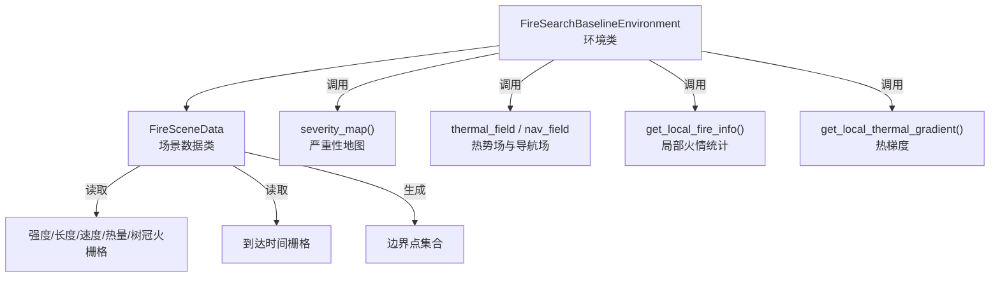
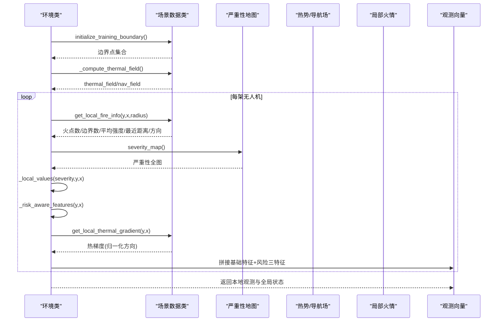
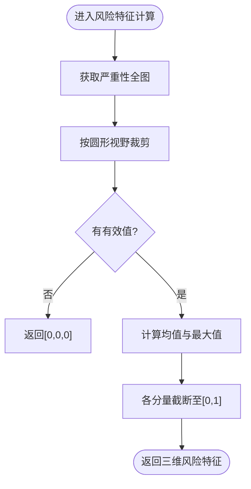
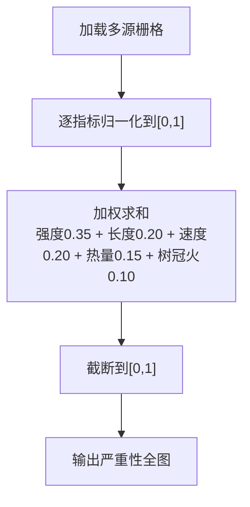
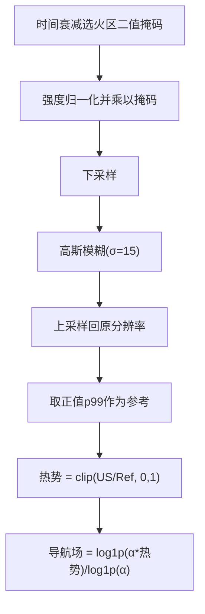
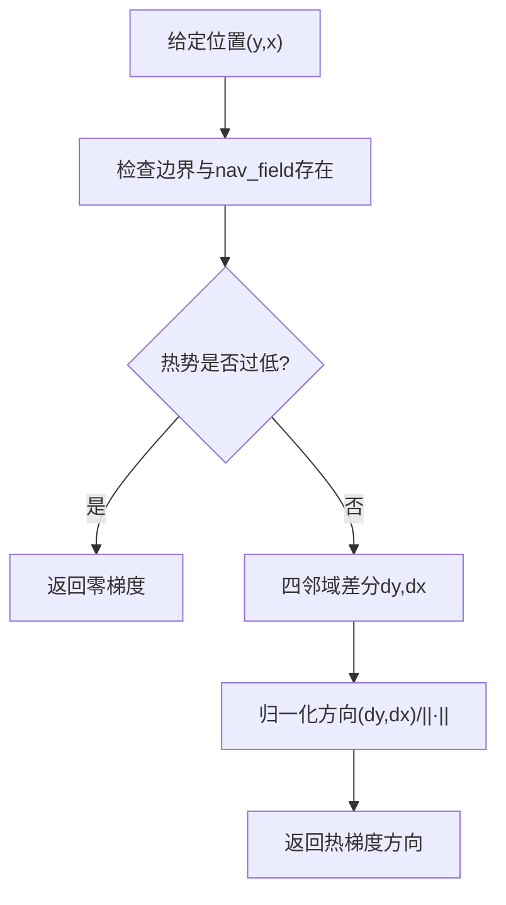
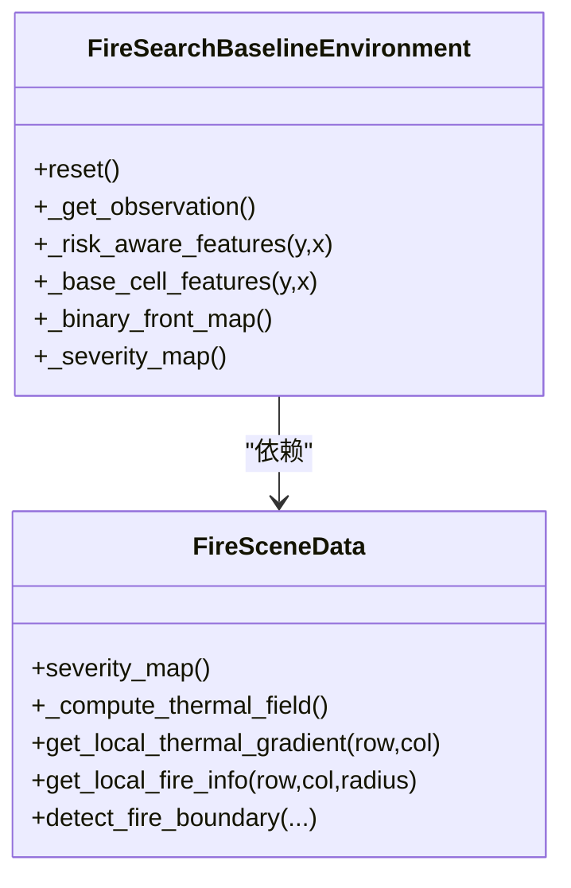
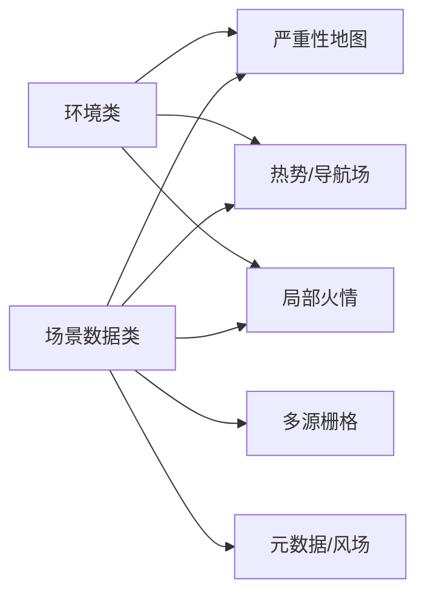
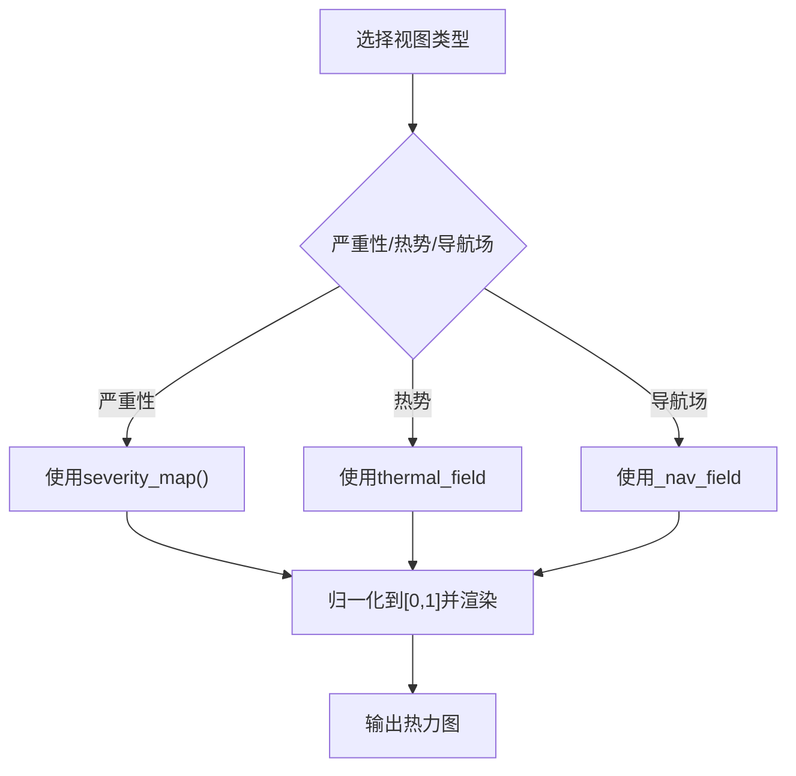
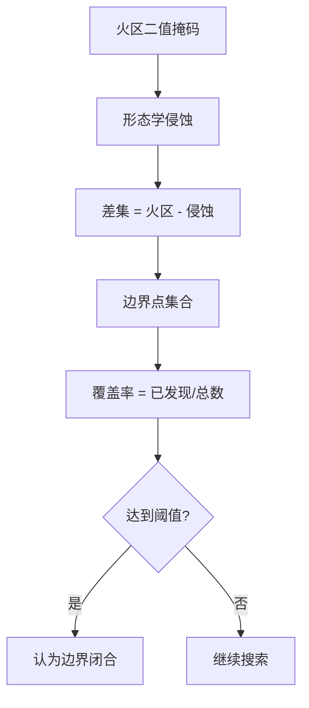

# 风险感知观测模式

<cite>
**本文引用的文件**   
- [rl_environment_baseline.py](file://environment_variables/environment_variables/rl_environment_baseline.py)
- [信息转换.py](file://environment_variables/environment_variables/信息转换.py)
</cite>

## 目录
1. [引言](#引言)
2. [项目结构](#项目结构)
3. [核心组件](#核心组件)
4. [架构总览](#架构总览)
5. [详细组件分析](#详细组件分析)
6. [依赖关系分析](#依赖关系分析)
7. [性能与复杂度](#性能与复杂度)
8. [可视化与安全边界检测](#可视化与安全边界检测)
9. [复杂火灾环境中的安全性与有效性评估](#复杂火灾环境中的安全性与有效性评估)
10. [故障排查指南](#故障排查指南)
11. [结论](#结论)

## 引言
本文件围绕“风险感知观测模式”进行系统化说明。该模式在基础观测之上，新增三维风险特征：当前位置严重性、局部区域平均严重性、局部区域最大严重性，用于引导无人机避开高危区域同时保持搜索效率。文档进一步解释严重性地图的计算方法（热场权重、时间衰减、空间扩散等模型的集成），并提供风险热力图可视化与安全边界检测方法，以及在复杂火灾环境中的安全性与有效性评估建议。

## 项目结构
本项目包含两个关键模块：
- 环境层：提供多机火场边界搜索的强化学习环境接口，支持多种观测配置，包括风险感知模式。
- 数据层：负责场景数据加载、归一化、边界提取、热场重建、严重性地图计算与梯度获取等。

图表来源
- [rl_environment_baseline.py:21-110](file://environment_variables/environment_variables/rl_environment_baseline.py#L21-L110)
- [信息转换.py:219-322](file://environment_variables/environment_variables/信息转换.py#L219-L322)

章节来源
- [rl_environment_baseline.py:21-110](file://environment_variables/environment_variables/rl_environment_baseline.py#L21-L110)
- [信息转换.py:219-322](file://environment_variables/environment_variables/信息转换.py#L219-L322)

## 核心组件
- 风险感知观测维度
  - 位置与状态：坐标、电池、风向风速、地形坡度、热梯度、动量、相机方向等。
  - 风险三特征：当前格点严重性、邻域平均严重性、邻域最大严重性。
- 严重性地图
  - 由多指标归一化后加权合成：强度、火焰长度、蔓延速度、单位面积热量、树冠火活动。
- 热势场与导航场
  - 基于火区二值掩码与强度归一化，经下采样+高斯模糊+稳健归一化得到热势；对热势做log压缩得到导航场，便于梯度稳定。
- 边界与前沿
  - 通过时间衰减选择初始火区，再经形态学侵蚀提取边界；动态前沿可由二值火区与侵蚀差集获得。

章节来源
- [rl_environment_baseline.py:554-611](file://environment_variables/environment_variables/rl_environment_baseline.py#L554-L611)
- [信息转换.py:903-918](file://environment_variables/environment_variables/信息转换.py#L903-L918)
- [信息转换.py:759-819](file://environment_variables/environment_variables/信息转换.py#L759-L819)
- [信息转换.py:821-887](file://environment_variables/environment_variables/信息转换.py#L821-L887)

## 架构总览
下图展示风险感知模式从数据到观测的端到端流程。

图表来源
- [rl_environment_baseline.py:565-611](file://environment_variables/environment_variables/rl_environment_baseline.py#L565-L611)
- [信息转换.py:903-918](file://environment_variables/environment_variables/信息转换.py#L903-L918)
- [信息转换.py:933-970](file://environment_variables/environment_variables/信息转换.py#L933-L970)
- [信息转换.py:1070-1123](file://environment_variables/environment_variables/信息转换.py#L1070-L1123)

## 详细组件分析

### 风险感知观测特征
- 输入：当前格点坐标(y, x)、严重性全图、圆形视野半径。
- 输出：三维风险特征
  - 当前位置严重性：严重性全图在该格点的值。
  - 局部区域平均严重性：圆形视野内有效值的均值。
  - 局部区域最大严重性：圆形视野内有效值的最大值。
- 作用：为策略网络提供“近处危险程度+周边风险分布”的直观信号，辅助规避高风险区域并维持探索效率。

图表来源
- [rl_environment_baseline.py:554-563](file://environment_variables/environment_variables/rl_environment_baseline.py#L554-L563)

章节来源
- [rl_environment_baseline.py:554-563](file://environment_variables/environment_variables/rl_environment_baseline.py#L554-L563)

### 严重性地图计算
- 数据来源：强度、火焰长度、蔓延速度、单位面积热量、树冠火活动等多源栅格。
- 归一化：对各指标按场景统计或固定阈值进行归一化，统一到[0,1]。
- 加权合成：采用固定权重组合（强度权重最高，其次长度与速度，再次热量与树冠火）。
- 输出：严重性全图，范围[0,1]，供风险特征与奖励函数使用。

图表来源
- [信息转换.py:903-918](file://environment_variables/environment_variables/信息转换.py#L903-L918)

章节来源
- [信息转换.py:903-918](file://environment_variables/environment_variables/信息转换.py#L903-L918)

### 热势场与导航场（热场权重、时间衰减、空间扩散）
- 时间衰减：根据“到达时间”栅格与可选的初始面积百分比，选择t时刻的火区二值掩码，实现时间维度的衰减控制。
- 热场权重：以强度栅格为基础，按场景稳健参考值归一化，仅对火区内单元赋权，形成源项。
- 空间扩散：先下采样，再进行高斯模糊，再上采样回原分辨率，模拟热量的空间扩散效应。
- 稳健归一化：取正值的99分位数作为参考，将扩散后的场归一化到[0,1]，避免极端值影响。
- 导航场：对热势做log压缩，提升梯度稳定性，便于后续梯度计算。

图表来源
- [信息转换.py:759-819](file://environment_variables/environment_variables/信息转换.py#L759-L819)
- [信息转换.py:821-887](file://environment_variables/environment_variables/信息转换.py#L821-L887)

章节来源
- [信息转换.py:759-819](file://environment_variables/environment_variables/信息转换.py#L759-L819)
- [信息转换.py:821-887](file://environment_variables/environment_variables/信息转换.py#L821-L887)

### 热梯度与热信号分层判定
- 热梯度：基于导航场在四邻域的差分，归一化为方向向量，表征热势上升最快的方向。
- 热信号分层：结合“视野内真实火点存在”与“当前位置热势阈值”，给出分层的热信号标志，用于奖励与行为引导。

图表来源
- [信息转换.py:933-970](file://environment_variables/environment_variables/信息转换.py#L933-L970)

章节来源
- [信息转换.py:933-970](file://environment_variables/environment_variables/信息转换.py#L933-L970)

### 观测构建与风险特征融合
- 基础特征：位置、电池、强度、风场、地形、热梯度、动量、相机方向等。
- 风险特征：在当前观测配置为“risk_aware”时，追加三维风险特征。
- 全局状态：覆盖度、电池均值/最小值、队形中心与分散、距火重心距离、步数比例、已访问密度、课程阶段、未发现密度等。

图表来源
- [rl_environment_baseline.py:565-611](file://environment_variables/environment_variables/rl_environment_baseline.py#L565-L611)
- [信息转换.py:903-918](file://environment_variables/environment_variables/信息转换.py#L903-L918)
- [信息转换.py:933-970](file://environment_variables/environment_variables/信息转换.py#L933-L970)
- [信息转换.py:1070-1123](file://environment_variables/environment_variables/信息转换.py#L1070-L1123)

章节来源
- [rl_environment_baseline.py:565-611](file://environment_variables/environment_variables/rl_environment_baseline.py#L565-L611)

## 依赖关系分析
- 环境类依赖场景数据类提供的：
  - 严重性全图：用于风险特征与部分奖励设计。
  - 热势/导航场：用于热梯度与热信号分层。
  - 局部火情统计：用于动态前沿与搜索引导。
- 场景数据类依赖栅格数据与元数据：
  - 强度、长度、速度、热量、树冠火等栅格。
  - 到达时间栅格用于时间衰减。
  - 静态地形与风场用于基础特征与风阻惩罚。

图表来源
- [rl_environment_baseline.py:565-611](file://environment_variables/environment_variables/rl_environment_baseline.py#L565-L611)
- [信息转换.py:903-918](file://environment_variables/environment_variables/信息转换.py#L903-L918)
- [信息转换.py:759-819](file://environment_variables/environment_variables/信息转换.py#L759-L819)
- [信息转换.py:1070-1123](file://environment_variables/environment_variables/信息转换.py#L1070-L1123)

章节来源
- [rl_environment_baseline.py:565-611](file://environment_variables/environment_variables/rl_environment_baseline.py#L565-L611)
- [信息转换.py:903-918](file://environment_variables/environment_variables/信息转换.py#L903-L918)
- [信息转换.py:759-819](file://environment_variables/environment_variables/信息转换.py#L759-L819)
- [信息转换.py:1070-1123](file://environment_variables/environment_variables/信息转换.py#L1070-L1123)

## 性能与复杂度
- 严重性地图：一次计算，缓存复用；每个格点O(1)，全图O(HW)。
- 热势场：下采样+高斯模糊+上采样，主要开销在卷积；整体O(HW)。
- 风险特征：每次观测需对圆形视野内像素聚合，复杂度O(r^2)，r为视野半径。
- 热梯度：四邻域差分，O(1)每格点。
- 优化建议：
  - 对大视野可考虑金字塔或多尺度近似。
  - 对频繁调用的局部统计可使用滑动窗口或积分图加速。
  - 合理设置高斯模糊核大小与下采样率平衡精度与速度。

[本节为通用性能讨论，不直接分析具体代码文件]

## 可视化与安全边界检测

### 风险热力图可视化
- 严重性热力图：直接使用严重性全图渲染，颜色映射反映不同区域的综合危险程度。
- 热势热力图：使用thermal_field渲染，体现空间扩散后的热势分布。
- 导航场热力图：使用_nav_field渲染，利于观察梯度方向与平滑性。

图表来源
- [信息转换.py:903-918](file://environment_variables/environment_variables/信息转换.py#L903-L918)
- [信息转换.py:759-819](file://environment_variables/environment_variables/信息转换.py#L759-L819)

章节来源
- [信息转换.py:903-918](file://environment_variables/environment_variables/信息转换.py#L903-L918)
- [信息转换.py:759-819](file://environment_variables/environment_variables/信息转换.py#L759-L819)

### 安全边界检测方法
- 边界定义：对火区二值掩码进行形态学侵蚀，边界为火区与侵蚀后的差集。
- 动态更新：随时间衰减选择不同时刻的火区，边界随之演化。
- 覆盖率度量：比较已发现边界点与总边界点数量，判断闭合程度。

图表来源
- [信息转换.py:821-887](file://environment_variables/environment_variables/信息转换.py#L821-L887)
- [信息转换.py:1167-1185](file://environment_variables/environment_variables/信息转换.py#L1167-L1185)

章节来源
- [信息转换.py:821-887](file://environment_variables/environment_variables/信息转换.py#L821-L887)
- [信息转换.py:1167-1185](file://environment_variables/environment_variables/信息转换.py#L1167-L1185)

## 复杂火灾环境中的安全性与有效性评估
- 安全性指标
  - 进入高危区域比例：基于严重性阈值统计无人机轨迹中高风险格点占比。
  - 热势穿越次数：穿越热势高值区的次数与持续时间。
  - 边界闭合质量：在目标覆盖率下的路径平滑性与绕行代价。
- 有效性指标
  - 边界发现速率：单位时间内新发现的边界点数量。
  - 前沿探测能力：前沿点覆盖率与首次发现时间。
  - 搜索效率：完成目标的步数与能耗。
- 评估方法建议
  - 对比基线观测与风险感知观测在相同场景下的表现差异。
  - 在不同风场、地形与燃料条件下进行泛化测试。
  - 使用热场健康诊断工具检查热势场的饱和与梯度情况，确保评估结果可靠。

[本节为通用评估框架，不直接分析具体代码文件]

## 故障排查指南
- 热场健康诊断
  - 检查热势场是否存在、饱和比例、高值区零梯度比例、非零比例与分位数统计。
  - 若出现大量饱和或零梯度，需调整高斯模糊参数或稳健归一化参考值。
- 边界为空
  - 确认时间衰减参数与初始面积百分比设置是否导致无火区。
  - 检查栅格缺失或形状不一致导致的异常。
- 观测维度错误
  - 确认observation_profile设置为“risk_aware”时，本地观测维度是否正确扩展。

章节来源
- [信息转换.py:972-1012](file://environment_variables/environment_variables/信息转换.py#L972-L1012)
- [信息转换.py:821-887](file://environment_variables/environment_variables/信息转换.py#L821-L887)
- [rl_environment_baseline.py:24-29](file://environment_variables/environment_variables/rl_environment_baseline.py#L24-L29)

## 结论
风险感知观测模式通过在基础观测中引入三维风险特征，显著提升了无人机在复杂火灾环境中的安全性与搜索效率。严重性地图与热势场的结合，既提供了空间扩散与时间衰减的综合风险视图，又为梯度稳定的导航提供了支撑。配合边界检测与覆盖率度量，可在保证安全的前提下高效完成火场边界搜索任务。建议在训练与评估过程中持续监控热场健康与边界闭合质量，以确保系统鲁棒性与泛化能力。