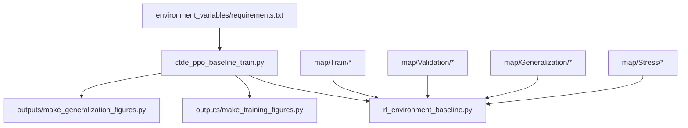
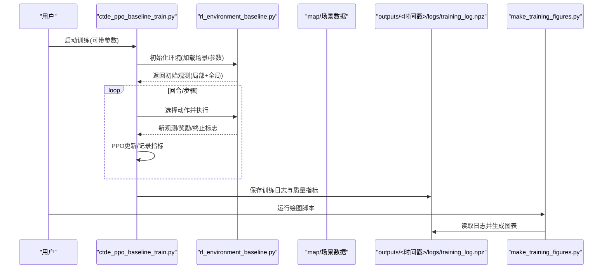
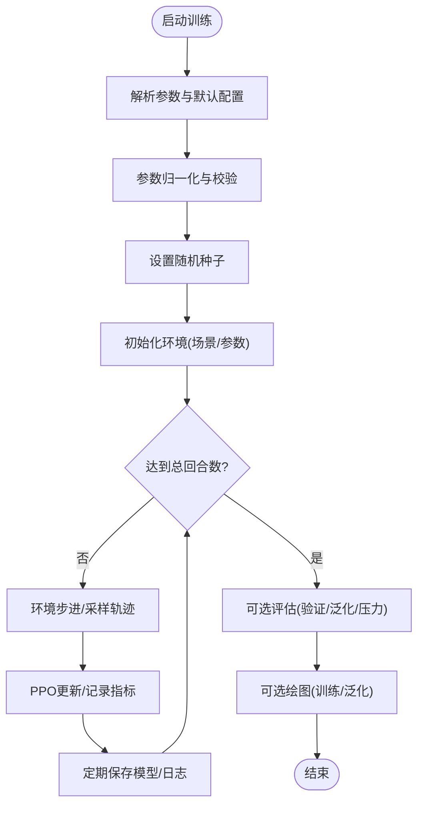
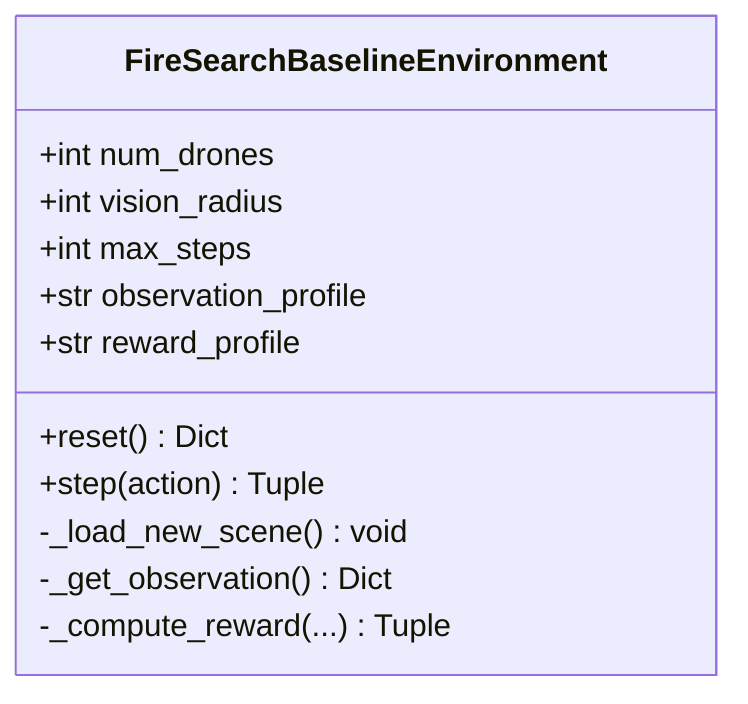
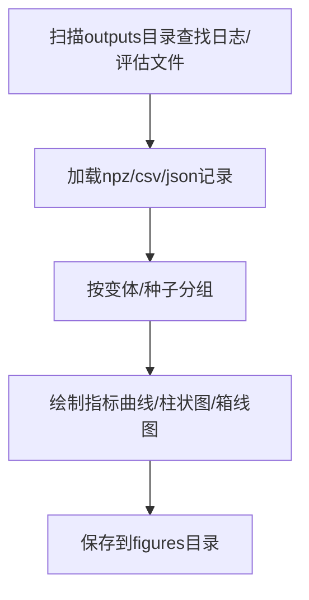
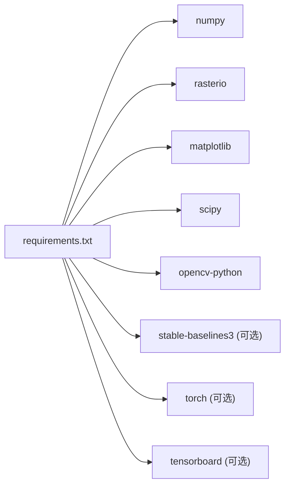

# 快速开始

<cite>
**本文引用的文件**   
- [requirements.txt](file://environment_variables/requirements.txt)
- [ctde_ppo_baseline_train.py](file://environment_variables/environment_variables/ctde_ppo_baseline_train.py)
- [rl_environment_baseline.py](file://environment_variables/environment_variables/rl_environment_baseline.py)
- [make_training_figures.py](file://environment_variables/environment_variables/outputs/make_training_figures.py)
- [make_generalization_figures.py](file://environment_variables/environment_variables/outputs/make_generalization_figures.py)
- [2026-07-06-thermal-field-optimization.md](file://docs/superpowers/plans/2026-07-06-thermal-field-optimization.md)
</cite>

## 目录
1. [简介](#简介)
2. [项目结构](#项目结构)
3. [核心组件](#核心组件)
4. [架构总览](#架构总览)
5. [详细组件分析](#详细组件分析)
6. [依赖分析](#依赖分析)
7. [性能考虑](#性能考虑)
8. [故障排除指南](#故障排除指南)
9. [结论](#结论)
10. [附录](#附录)

## 简介
本指南面向新手，帮助你在30分钟内完成“自适应参数森林火灾搜索强化学习”项目的安装、训练与可视化。你将：
- 准备Python环境并安装依赖
- 运行基线CTDE-PPO训练脚本
- 查看训练结果与生成可视化图表
- 了解目录结构与关键文件职责
- 遇到常见问题时的排障方法

## 项目结构
仓库采用“数据+代码+输出”的清晰分层：
- environment_variables/requirements.txt：环境与依赖清单
- environment_variables/environment_variables/：核心训练与环境实现
  - ctde_ppo_baseline_train.py：CTDE-PPO训练主流程（含配置解析、课程学习、评估与绘图）
  - rl_environment_baseline.py：Gymnasium风格的多无人机火场边界搜索环境
  - outputs/：训练日志与可视化脚本
    - make_training_figures.py：从训练日志生成训练曲线图
    - make_generalization_figures.py：从评估记录生成泛化能力图
- map/：训练/验证/泛化/压力测试场景数据（栅格、矢量、报告等）
- docs/superpowers/plans/：计划文档（包含示例命令行）

图示来源
- [ctde_ppo_baseline_train.py:1-120](file://environment_variables/environment_variables/ctde_ppo_baseline_train.py#L1-L120)
- [rl_environment_baseline.py:1-120](file://environment_variables/environment_variables/rl_environment_baseline.py#L1-L120)
- [make_training_figures.py:1-60](file://environment_variables/environment_variables/outputs/make_training_figures.py#L1-L60)
- [make_generalization_figures.py:1-60](file://environment_variables/environment_variables/outputs/make_generalization_figures.py#L1-L60)

章节来源
- [requirements.txt:1-13](file://environment_variables/requirements.txt#L1-L13)
- [ctde_ppo_baseline_train.py:1-120](file://environment_variables/environment_variables/ctde_ppo_baseline_train.py#L1-L120)
- [rl_environment_baseline.py:1-120](file://environment_variables/environment_variables/rl_environment_baseline.py#L1-L120)
- [make_training_figures.py:1-60](file://environment_variables/environment_variables/outputs/make_training_figures.py#L1-L60)
- [make_generalization_figures.py:1-60](file://environment_variables/environment_variables/outputs/make_generalization_figures.py#L1-L60)

## 核心组件
- 训练入口与流程控制
  - 负责解析参数、初始化环境、构建Agent、执行PPO更新、保存日志与模型、触发评估与绘图
  - 默认配置涵盖数据集路径、观测/奖励配置、PPO超参、课程学习阶段目标、评估策略与绘图设置
- 环境接口
  - 基于Gymnasium的多智能体火场边界搜索环境，提供局部观测与全局状态空间定义、动作空间、奖励分解与终止条件
- 可视化脚本
  - 训练曲线：读取training_log.npz与model_quality_metrics.json，绘制任务得分、覆盖率、成功率、KL稳定性等
  - 泛化评估：读取CSV/JSON评估记录，按变体/种子聚合，绘制分布与汇总图

章节来源
- [ctde_ppo_baseline_train.py:98-158](file://environment_variables/environment_variables/ctde_ppo_baseline_train.py#L98-L158)
- [ctde_ppo_baseline_train.py:284-293](file://environment_variables/environment_variables/ctde_ppo_baseline_train.py#L284-L293)
- [rl_environment_baseline.py:21-158](file://environment_variables/environment_variables/rl_environment_baseline.py#L21-L158)
- [make_training_figures.py:118-176](file://environment_variables/environment_variables/outputs/make_training_figures.py#L118-L176)
- [make_generalization_figures.py:169-246](file://environment_variables/environment_variables/outputs/make_generalization_figures.py#L169-L246)

## 架构总览
下图展示训练端到端的数据与控制流：训练脚本驱动环境交互，收集轨迹，执行PPO更新，保存日志；随后由可视化脚本读取日志生成图表。

图示来源
- [ctde_ppo_baseline_train.py:1-120](file://environment_variables/environment_variables/ctde_ppo_baseline_train.py#L1-L120)
- [rl_environment_baseline.py:1-120](file://environment_variables/environment_variables/rl_environment_baseline.py#L1-L120)
- [make_training_figures.py:118-176](file://environment_variables/environment_variables/outputs/make_training_figures.py#L118-L176)

## 详细组件分析

### 训练脚本（CTDE-PPO）
- 功能要点
  - 参数归一化与校验：统一类型、范围与取值集合（如observation_profile、reward_profile、lr_adapt_mode等）
  - 随机种子设置：确保可复现实验
  - 课程管理器：三阶段难度提升（近距/远距生成、目标覆盖率、near_prob退火）
  - Agent与网络：Actor/Critic网络、ReplayBuffer、PPO更新循环
  - 日志与质量度量：保存episode级指标与模型质量指标（收敛效率、KL稳定性等）
- 典型用法
  - 最小化训练（仅2个回合，不评估、不绘图）：参考计划文档中的示例命令
  - 完整训练：使用默认配置或传入自定义参数覆盖

图示来源
- [ctde_ppo_baseline_train.py:98-158](file://environment_variables/environment_variables/ctde_ppo_baseline_train.py#L98-L158)
- [ctde_ppo_baseline_train.py:284-293](file://environment_variables/environment_variables/ctde_ppo_baseline_train.py#L284-L293)
- [ctde_ppo_baseline_train.py:569-746](file://environment_variables/environment_variables/ctde_ppo_baseline_train.py#L569-L746)

章节来源
- [ctde_ppo_baseline_train.py:98-158](file://environment_variables/environment_variables/ctde_ppo_baseline_train.py#L98-L158)
- [ctde_ppo_baseline_train.py:284-293](file://environment_variables/environment_variables/ctde_ppo_baseline_train.py#L284-L293)
- [ctde_ppo_baseline_train.py:569-746](file://environment_variables/environment_variables/ctde_ppo_baseline_train.py#L569-L746)
- [2026-07-06-thermal-field-optimization.md:127-135](file://docs/superpowers/plans/2026-07-06-thermal-field-optimization.md#L127-L135)

### 环境（FireSearchBaselineEnvironment）
- 功能要点
  - 多无人机动作空间（离散5维）、局部观测与全局状态维度可配置
  - 多种观测/奖励配置（baseline/static_terrain/dynamic_front/risk_aware；boundary_coverage/front_detection/severity_weighted/exploration_balanced）
  - 场景加载与热势场计算、可见区域标记、边界/前沿发现统计
  - 奖励分解：探索、边界发现、惩罚项、超时惩罚等
- 关键接口
  - reset()：重置环境并返回初始观测
  - step(action)：执行动作并返回新观测、奖励、终止标志与诊断信息

图示来源
- [rl_environment_baseline.py:21-158](file://environment_variables/environment_variables/rl_environment_baseline.py#L21-L158)
- [rl_environment_baseline.py:331-361](file://environment_variables/environment_variables/rl_environment_baseline.py#L331-L361)
- [rl_environment_baseline.py:692-767](file://environment_variables/environment_variables/rl_environment_baseline.py#L692-L767)

章节来源
- [rl_environment_baseline.py:21-158](file://environment_variables/environment_variables/rl_environment_baseline.py#L21-L158)
- [rl_environment_baseline.py:331-361](file://environment_variables/environment_variables/rl_environment_baseline.py#L331-L361)
- [rl_environment_baseline.py:692-767](file://environment_variables/environment_variables/rl_environment_baseline.py#L692-L767)

### 可视化脚本（训练与泛化）
- 训练曲线
  - 自动定位最新训练日志，支持多变体对比、滚动平均、均值±标准差填充
  - 输出任务得分、覆盖率、成功率、KL稳定性、损失曲线、阶段转换等
- 泛化评估
  - 支持CSV/JSON多种格式，按变体/种子分组，绘制分布、汇总与场景维度对比

图示来源
- [make_training_figures.py:118-176](file://environment_variables/environment_variables/outputs/make_training_figures.py#L118-L176)
- [make_generalization_figures.py:169-246](file://environment_variables/environment_variables/outputs/make_generalization_figures.py#L169-L246)

章节来源
- [make_training_figures.py:118-176](file://environment_variables/environment_variables/outputs/make_training_figures.py#L118-L176)
- [make_generalization_figures.py:169-246](file://environment_variables/environment_variables/outputs/make_generalization_figures.py#L169-L246)

## 依赖分析
- 必需依赖
  - numpy>=1.21.0
  - rasterio>=1.3.0
  - matplotlib>=3.5.0
  - scipy>=1.10.0
  - opencv-python>=4.8.0
- 可选依赖（用于RL训练）
  - stable-baselines3>=2.0.0
  - torch>=1.11.0
  - tensorboard>=2.10.0

图示来源
- [requirements.txt:1-13](file://environment_variables/requirements.txt#L1-L13)

章节来源
- [requirements.txt:1-13](file://environment_variables/requirements.txt#L1-L13)

## 性能考虑
- 热势场优化
  - 通过低分辨率高斯滤波与缓存机制显著降低计算开销，保持数值近似与输出一致性
  - 在计划文档中给出了回归测试、精度与加速比验收标准
- 训练与绘图
  - 训练过程建议合理设置batch_size、ppo_epochs与窗口大小，避免内存溢出
  - 绘图脚本默认使用Agg后端，适合无头服务器批量出图

章节来源
- [2026-07-06-thermal-field-optimization.md:99-135](file://docs/superpowers/plans/2026-07-06-thermal-field-optimization.md#L99-L135)
- [make_training_figures.py:27-31](file://environment_variables/environment_variables/outputs/make_training_figures.py#L27-L31)
- [make_generalization_figures.py:26-31](file://environment_variables/environment_variables/outputs/make_generalization_figures.py#L26-L31)

## 故障排除指南
- 无法找到训练日志
  - 现象：绘图脚本报错未找到日志
  - 排查：确认训练已正常结束且outputs目录下存在training_log.npz；若路径非绝对，脚本会尝试相对路径解析
  - 参考：[make_training_figures.py:147-176](file://environment_variables/environment_variables/outputs/make_training_figures.py#L147-L176)
- 缺少泛化评估记录
  - 现象：泛化绘图脚本提示未找到eval记录
  - 排查：确保评估输出为detailed_eval_*.csv或*_result_*.json等受支持格式
  - 参考：[make_generalization_figures.py:345-358](file://environment_variables/environment_variables/outputs/make_generalization_figures.py#L345-L358)
- 参数校验失败
  - 现象：observation_profile/reward_profile/lr_adapt_mode等不在允许集合
  - 排查：检查传入值是否匹配环境定义的枚举集合
  - 参考：[rl_environment_baseline.py:208-226](file://environment_variables/environment_variables/rl_environment_baseline.py#L208-L226)、[ctde_ppo_baseline_train.py:193-234](file://environment_variables/environment_variables/ctde_ppo_baseline_train.py#L193-L234)
- 热势场相关错误
  - 现象：热势场计算异常或性能不达预期
  - 排查：确认scipy与opencv-python版本满足要求；参考计划文档中的回归与基准步骤
  - 参考：[2026-07-06-thermal-field-optimization.md:99-135](file://docs/superpowers/plans/2026-07-06-thermal-field-optimization.md#L99-L135)

章节来源
- [make_training_figures.py:147-176](file://environment_variables/environment_variables/outputs/make_training_figures.py#L147-L176)
- [make_generalization_figures.py:345-358](file://environment_variables/environment_variables/outputs/make_generalization_figures.py#L345-L358)
- [rl_environment_baseline.py:208-226](file://environment_variables/environment_variables/rl_environment_baseline.py#L208-L226)
- [ctde_ppo_baseline_train.py:193-234](file://environment_variables/environment_variables/ctde_ppo_baseline_train.py#L193-L234)
- [2026-07-06-thermal-field-optimization.md:99-135](file://docs/superpowers/plans/2026-07-06-thermal-field-optimization.md#L99-L135)

## 结论
通过本指南，你已完成环境搭建、首次训练与可视化全流程。建议后续：
- 调整课程学习与PPO超参以适配不同地图规模
- 利用训练与泛化绘图脚本进行系统对比实验
- 结合热势场优化方案进一步提升训练效率

## 附录

### 环境搭建与运行步骤（30分钟上手）
- 准备Python环境
  - 建议使用Python 3.8及以上版本（根据依赖约束）
- 安装依赖
  - 在项目根目录执行：pip install -r environment_variables/requirements.txt
- 运行最小训练（示例）
  - 参考计划文档中的示例命令，在对应环境下执行短训练（例如仅2个回合，不评估、不绘图）
- 查看训练结果
  - 进入outputs目录，查找最新时间戳子目录下的logs/training_log.npz与model_quality_metrics.json
- 生成训练可视化
  - 运行：python environment_variables/environment_variables/outputs/make_training_figures.py
  - 图表将保存在对应outputs子目录的figures/training_figures下
- 生成泛化可视化（如有评估记录）
  - 运行：python environment_variables/environment_variables/outputs/make_generalization_figures.py
  - 图表将保存在对应outputs子目录的figures/generalization_figures下

章节来源
- [requirements.txt:1-13](file://environment_variables/requirements.txt#L1-L13)
- [2026-07-06-thermal-field-optimization.md:127-135](file://docs/superpowers/plans/2026-07-06-thermal-field-optimization.md#L127-L135)
- [make_training_figures.py:118-176](file://environment_variables/environment_variables/outputs/make_training_figures.py#L118-L176)
- [make_generalization_figures.py:169-246](file://environment_variables/environment_variables/outputs/make_generalization_figures.py#L169-L246)