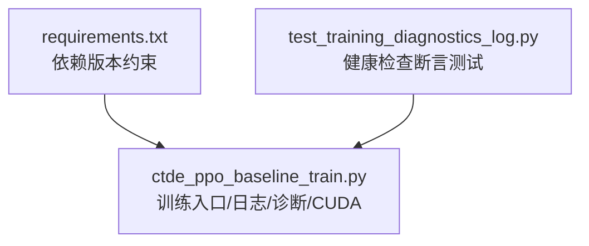
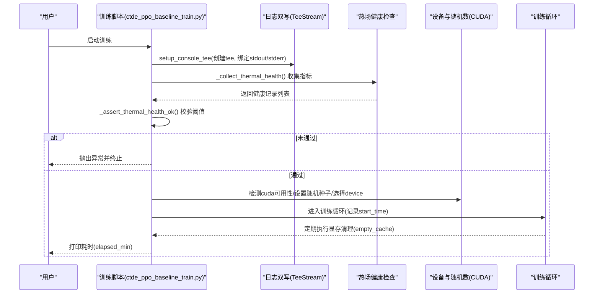
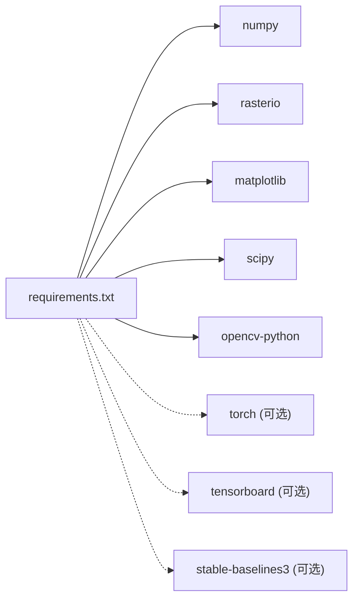

# 故障排除

<cite>
**本文引用的文件**   
- [requirements.txt](file://environment_variables/requirements.txt)
- [ctde_ppo_baseline_train.py](file://environment_variables/environment_variables/ctde_ppo_baseline_train.py)
- [test_training_diagnostics_log.py](file://environment_variables/environment_variables/test_training_diagnostics_log.py)
</cite>

## 目录
1. [简介](#简介)
2. [项目结构](#项目结构)
3. [核心组件](#核心组件)
4. [架构总览](#架构总览)
5. [详细组件分析](#详细组件分析)
6. [依赖关系分析](#依赖关系分析)
7. [性能考虑](#性能考虑)
8. [故障排除指南](#故障排除指南)
9. [结论](#结论)
10. [附录](#附录)

## 简介
本指南面向使用“自适应参数”训练流程的用户与工程师，聚焦于环境安装、依赖冲突、内存不足、GPU驱动问题等常见故障的诊断与修复；同时提供日志分析方法、性能瓶颈定位与优化策略、调试工具与技巧、社区支持渠道与问题报告模板，以及已知问题与临时解决方案清单。内容基于仓库中的训练脚本与环境依赖进行梳理，确保可追溯与可操作。

## 项目结构
本项目包含：
- 环境与依赖定义：requirements.txt
- 训练主流程与诊断逻辑：ctde_ppo_baseline_train.py（含控制台日志双写、热场健康检查、CUDA设备选择与缓存清理、时间统计等）
- 诊断测试用例：test_training_diagnostics_log.py（验证热场健康检查的失败与通过路径）

图表来源
- [requirements.txt:1-13](file://environment_variables/requirements.txt#L1-L13)
- [ctde_ppo_baseline_train.py:78-95](file://environment_variables/environment_variables/ctde_ppo_baseline_train.py#L78-L95)
- [ctde_ppo_baseline_train.py:1229-1279](file://environment_variables/environment_variables/ctde_ppo_baseline_train.py#L1229-L1279)
- [test_training_diagnostics_log.py:38-73](file://environment_variables/environment_variables/test_training_diagnostics_log.py#L38-L73)

章节来源
- [requirements.txt:1-13](file://environment_variables/requirements.txt#L1-L13)
- [ctde_ppo_baseline_train.py:78-95](file://environment_variables/environment_variables/ctde_ppo_baseline_train.py#L78-L95)
- [ctde_ppo_baseline_train.py:1229-1279](file://environment_variables/environment_variables/ctde_ppo_baseline_train.py#L1229-L1279)
- [test_training_diagnostics_log.py:38-73](file://environment_variables/environment_variables/test_training_diagnostics_log.py#L38-L73)

## 核心组件
- 控制台日志双写（TeeStream/setup_console_tee）：将标准输出与错误输出同时写入文件，便于离线分析与复现。
- 热场健康检查（_collect_thermal_health/_assert_thermal_health_ok）：在训练前对场景热场指标进行阈值校验，不达标则提前中断并给出明细。
- CUDA设备与随机数：根据可用GPU自动选择设备，设置CUDA随机种子，并在关键位置释放显存缓存。
- 运行计时：记录训练开始时间与耗时，用于性能评估与瓶颈定位。

章节来源
- [ctde_ppo_baseline_train.py:78-95](file://environment_variables/environment_variables/ctde_ppo_baseline_train.py#L78-L95)
- [ctde_ppo_baseline_train.py:1229-1279](file://environment_variables/environment_variables/ctde_ppo_baseline_train.py#L1229-L1279)
- [ctde_ppo_baseline_train.py:287-289](file://environment_variables/environment_variables/ctde_ppo_baseline_train.py#L287-L289)
- [ctde_ppo_baseline_train.py:805](file://environment_variables/environment_variables/ctde_ppo_baseline_train.py#L805)
- [ctde_ppo_baseline_train.py:1973-1974](file://environment_variables/environment_variables/ctde_ppo_baseline_train.py#L1973-L1974)
- [ctde_ppo_baseline_train.py:1451](file://environment_variables/environment_variables/ctde_ppo_baseline_train.py#L1451)
- [ctde_ppo_baseline_train.py:1782](file://environment_variables/environment_variables/ctde_ppo_baseline_train.py#L1782)

## 架构总览
下图展示了训练启动时的关键流程：日志双写初始化、热场健康检查、设备选择与随机数设置、训练计时与显存清理。

图表来源
- [ctde_ppo_baseline_train.py:78-95](file://environment_variables/environment_variables/ctde_ppo_baseline_train.py#L78-L95)
- [ctde_ppo_baseline_train.py:1229-1279](file://environment_variables/environment_variables/ctde_ppo_baseline_train.py#L1229-L1279)
- [ctde_ppo_baseline_train.py:287-289](file://environment_variables/environment_variables/ctde_ppo_baseline_train.py#L287-L289)
- [ctde_ppo_baseline_train.py:805](file://environment_variables/environment_variables/ctde_ppo_baseline_train.py#L805)
- [ctde_ppo_baseline_train.py:1973-1974](file://environment_variables/environment_variables/ctde_ppo_baseline_train.py#L1973-L1974)
- [ctde_ppo_baseline_train.py:1451](file://environment_variables/environment_variables/ctde_ppo_baseline_train.py#L1451)
- [ctde_ppo_baseline_train.py:1782](file://environment_variables/environment_variables/ctde_ppo_baseline_train.py#L1782)

## 详细组件分析

### 控制台日志双写（TeeStream / setup_console_tee）
- 作用：将stdout与stderr同时写入指定日志文件，避免交互式终端丢失信息。
- 关键点：
  - 首次调用时保存原始流，创建双写对象后替换sys.stdout/sys.stderr。
  - 重复调用相同路径会直接返回，避免重复重定向。
  - 关闭时会恢复原始流并关闭文件句柄。
- 常见问题：
  - 日志路径无权限或不存在导致创建失败。
  - 多次切换不同log_path但未正确关闭旧tee导致输出错乱。
- 建议：
  - 在进程入口处统一调用一次setup_console_tee。
  - 确保日志目录存在且可写。

章节来源
- [ctde_ppo_baseline_train.py:78-95](file://environment_variables/environment_variables/ctde_ppo_baseline_train.py#L78-L95)

### 热场健康检查（_collect_thermal_health / _assert_thermal_health_ok）
- 作用：在训练前遍历数据集划分与场景，计算热场相关指标并与阈值比较，若任一指标越界则抛出异常并中止训练。
- 关键点：
  - 收集阶段为每个场景生成记录，包含split、scene_key及若干指标字段。
  - 断言阶段汇总失败项，最多展示前若干条，其余以计数提示。
- 常见问题：
  - 数据缺失或字段不完整导致断言失败。
  - 阈值过严导致大量场景被判定为不合格。
- 建议：
  - 先运行健康检查，查看失败明细再调整数据或阈值。
  - 针对特定场景单独排查其输入数据完整性。

章节来源
- [ctde_ppo_baseline_train.py:1229-1279](file://environment_variables/environment_variables/ctde_ppo_baseline_train.py#L1229-L1279)
- [test_training_diagnostics_log.py:38-73](file://environment_variables/environment_variables/test_training_diagnostics_log.py#L38-L73)

### CUDA设备与随机数管理
- 作用：根据运行时环境自动选择CPU/GPU，设置CUDA随机种子以保证可复现性，并在训练过程中适时释放显存缓存。
- 关键点：
  - 使用cuda.is_available判断是否启用GPU。
  - 设置全局与所有设备的随机种子。
  - device选择逻辑优先GPU，否则回退到CPU。
  - 定期调用empty_cache释放未使用的显存缓存。
- 常见问题：
  - GPU驱动或CUDA版本不匹配导致不可用。
  - 显存碎片化导致OOM。
- 建议：
  - 明确指定目标设备或使用环境变量控制。
  - 合理批大小与模型规模，配合显存清理。

章节来源
- [ctde_ppo_baseline_train.py:287-289](file://environment_variables/environment_variables/ctde_ppo_baseline_train.py#L287-L289)
- [ctde_ppo_baseline_train.py:805](file://environment_variables/environment_variables/ctde_ppo_baseline_train.py#L805)
- [ctde_ppo_baseline_train.py:1973-1974](file://environment_variables/environment_variables/ctde_ppo_baseline_train.py#L1973-L1974)

### 运行计时与性能观测
- 作用：记录训练开始时间与总耗时，便于对比不同配置下的性能差异。
- 关键点：
  - 在训练入口记录start_time。
  - 训练结束后计算elapsed_min并输出。
- 建议：
  - 结合日志双写，将耗时与关键指标一并落盘。
  - 对不同超参/数据规模进行对照实验。

章节来源
- [ctde_ppo_baseline_train.py:1451](file://environment_variables/environment_variables/ctde_ppo_baseline_train.py#L1451)
- [ctde_ppo_baseline_train.py:1782](file://environment_variables/environment_variables/ctde_ppo_baseline_train.py#L1782)

## 依赖关系分析
- 核心依赖：numpy、rasterio、matplotlib、scipy、opencv-python。
- 可选依赖（强化学习训练）：torch、tensorboard、stable-baselines3（当前注释掉）。
- 风险点：
  - rasterio依赖GDAL系统库，安装易受系统环境差异影响。
  - opencv-python与系统图形栈耦合，某些环境下可能缺少GUI后端。
  - torch与CUDA版本需严格匹配。

图表来源
- [requirements.txt:1-13](file://environment_variables/requirements.txt#L1-L13)

章节来源
- [requirements.txt:1-13](file://environment_variables/requirements.txt#L1-L13)

## 性能考虑
- CPU/GPU利用率分析：
  - 观察训练耗时与吞吐，结合日志中elapsed_min与每步指标变化。
  - 使用系统监控工具（如nvidia-smi、htop）辅助定位瓶颈。
- 内存泄漏检测：
  - 关注显存持续增长现象，确认是否存在未释放的张量引用。
  - 利用脚本内显存清理点作为基线，逐步缩小范围。
- 优化策略：
  - 降低批大小或模型维度缓解显存压力。
  - 减少不必要的中间变量与频繁IO。
  - 合理设置数据加载并行度，避免I/O阻塞。

[本节为通用指导，无需代码来源]

## 故障排除指南

### 环境安装与依赖冲突
- 症状：
  - 导入模块失败（如rasterio、opencv-python）。
  - 安装时报系统库缺失或编译错误。
- 诊断步骤：
  - 核对requirements.txt中版本约束，确认Python版本兼容。
  - 在干净虚拟环境中重新安装，避免历史包污染。
  - 对于rasterio，检查GDAL系统依赖是否满足。
- 解决建议：
  - 使用conda或pip隔离环境，按顺序安装科学计算栈。
  - 遇到GUI相关报错时，切换到非交互后端或服务器模式。

章节来源
- [requirements.txt:1-13](file://environment_variables/requirements.txt#L1-L13)

### 日志无法写入或丢失
- 症状：
  - 控制台无输出或日志文件为空。
- 诊断步骤：
  - 检查setup_console_tee是否已调用且路径有效。
  - 确认日志目录存在且具备写入权限。
- 解决建议：
  - 在进程入口尽早调用日志双写初始化。
  - 使用绝对路径并确保父目录存在。

章节来源
- [ctde_ppo_baseline_train.py:78-95](file://environment_variables/environment_variables/ctde_ppo_baseline_train.py#L78-L95)

### 热场健康检查失败
- 症状：
  - 训练开始前抛出异常，提示热场健康检查失败。
- 诊断步骤：
  - 查看失败明细（split、scene_key、具体指标与阈值）。
  - 使用测试用例思路验证字段完整性与阈值合理性。
- 解决建议：
  - 修正缺失或异常的数据字段。
  - 适当放宽阈值或更换更合适的场景集合。

章节来源
- [ctde_ppo_baseline_train.py:1229-1279](file://environment_variables/environment_variables/ctde_ppo_baseline_train.py#L1229-L1279)
- [test_training_diagnostics_log.py:38-73](file://environment_variables/environment_variables/test_training_diagnostics_log.py#L38-L73)

### GPU不可用或驱动问题
- 症状：
  - 程序始终运行在CPU上，或报CUDA相关错误。
- 诊断步骤：
  - 检查cuda.is_available返回值与设备选择逻辑。
  - 确认CUDA与驱动版本匹配，nvidia-smi可见GPU。
- 解决建议：
  - 更新显卡驱动与CUDA Toolkit至兼容版本。
  - 必要时显式指定设备ID或回退CPU进行最小化复现。

章节来源
- [ctde_ppo_baseline_train.py:287-289](file://environment_variables/environment_variables/ctde_ppo_baseline_train.py#L287-L289)
- [ctde_ppo_baseline_train.py:805](file://environment_variables/environment_variables/ctde_ppo_baseline_train.py#L805)

### 显存不足（OOM）
- 症状：
  - 训练中途崩溃，提示显存不足。
- 诊断步骤：
  - 观察显存增长曲线与batch大小、模型规模的关系。
  - 确认脚本中显存清理点是否生效。
- 解决建议：
  - 减小批大小或模型复杂度。
  - 增加显存清理频率，避免长时间持有大张量。
  - 使用梯度累积替代增大批大小。

章节来源
- [ctde_ppo_baseline_train.py:1973-1974](file://environment_variables/environment_variables/ctde_ppo_baseline_train.py#L1973-L1974)

### 性能瓶颈定位
- 症状：
  - 训练耗时过长，吞吐低。
- 诊断步骤：
  - 对比不同配置的elapsed_min与指标收敛速度。
  - 使用系统监控工具识别CPU/GPU/I/O瓶颈。
- 解决建议：
  - 调整数据加载并行度与缓存策略。
  - 减少不必要的可视化与日志输出。
  - 合并小文件读写，批量处理。

章节来源
- [ctde_ppo_baseline_train.py:1451](file://environment_variables/environment_variables/ctde_ppo_baseline_train.py#L1451)
- [ctde_ppo_baseline_train.py:1782](file://environment_variables/environment_variables/ctde_ppo_baseline_train.py#L1782)

### 调试工具与技巧
- 断点调试：
  - 在关键函数入口（如日志初始化、健康检查、设备选择）设置断点，逐步验证状态。
- 性能剖析：
  - 使用cProfile或第三方剖析器定位热点函数。
  - 结合日志中的耗时输出进行回归对比。
- 内存分析：
  - 使用tracemalloc或可视化工具跟踪张量生命周期。
  - 关注显存清理点前后的峰值变化。

[本节为通用指导，无需代码来源]

### 社区支持与问题报告模板
- 社区渠道：
  - 项目Issue区、讨论区、邮件列表（如有）。
- 问题报告模板：
  - 环境信息：操作系统、Python版本、CUDA/驱动版本、GPU型号。
  - 依赖版本：requirements.txt中关键包版本。
  - 复现步骤：最小可复现代码与命令。
  - 期望行为与实际行为：包括错误堆栈与日志片段。
  - 附件：日志文件、截图、配置文件。

[本节为通用指导，无需代码来源]

### 已知问题与临时解决方案
- 热场健康检查误报：
  - 现象：部分场景因数据字段缺失或阈值过严被判定为失败。
  - 临时方案：先仅运行健康检查，筛选失败场景逐一修复数据或调整阈值。
- 日志路径权限问题：
  - 现象：无法创建日志文件或写入失败。
  - 临时方案：使用绝对路径并确保目录存在与可写。
- CUDA不可用：
  - 现象：始终回退到CPU或报CUDA错误。
  - 临时方案：更新驱动与CUDA版本，或显式指定设备ID。

章节来源
- [ctde_ppo_baseline_train.py:1229-1279](file://environment_variables/environment_variables/ctde_ppo_baseline_train.py#L1229-L1279)
- [ctde_ppo_baseline_train.py:78-95](file://environment_variables/environment_variables/ctde_ppo_baseline_train.py#L78-L95)
- [ctde_ppo_baseline_train.py:287-289](file://environment_variables/environment_variables/ctde_ppo_baseline_train.py#L287-L289)

## 结论
通过日志双写与健康检查机制，项目提供了良好的可观测性与前置质量保障。结合CUDA设备管理与显存清理，可在多硬件环境下稳定运行。建议在日常使用中遵循本指南的排障流程，优先从日志与健康检查入手，逐步定位性能瓶颈与资源问题，并通过标准化问题报告提升协作效率。

[本节为总结性内容，无需代码来源]

## 附录
- 快速自检清单：
  - 依赖安装成功且版本兼容。
  - 日志双写初始化完成并可写入。
  - 热场健康检查通过或已调整阈值。
  - CUDA可用或已回退CPU。
  - 显存充足且清理点生效。
  - 训练耗时与吞吐符合预期。

[本节为补充信息，无需代码来源]