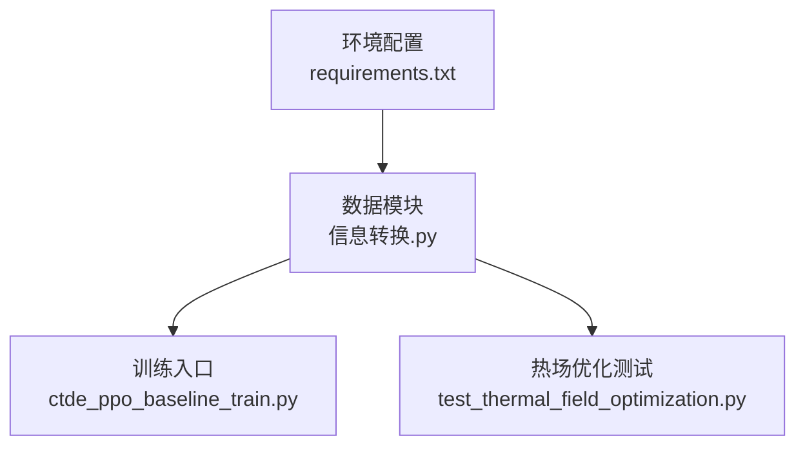
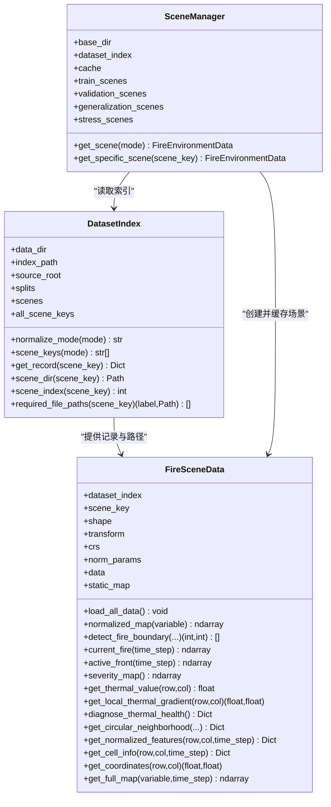
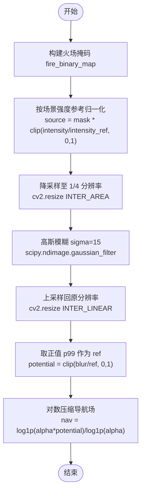
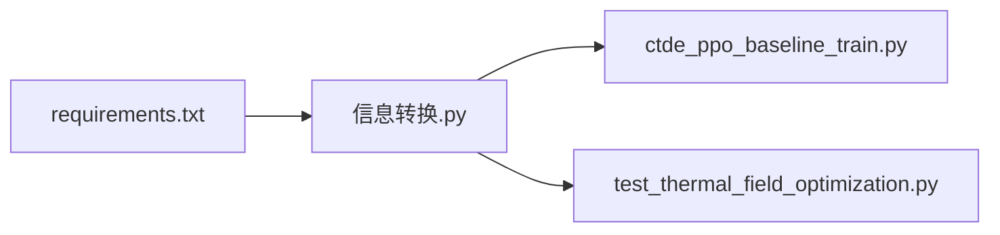
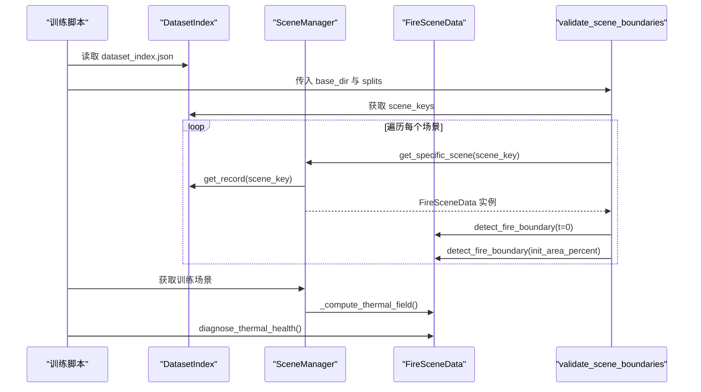

# 数据处理

<cite>
**本文引用的文件**   
- [信息转换.py](file://environment_variables/environment_variables/信息转换.py)
- [test_thermal_field_optimization.py](file://environment_variables/environment_variables/test_thermal_field_optimization.py)
- [ctde_ppo_baseline_train.py](file://environment_variables/environment_variables/ctde_ppo_baseline_train.py)
- [requirements.txt](file://environment_variables/requirements.txt)
</cite>

## 目录
1. [简介](#简介)
2. [项目结构](#项目结构)
3. [核心组件](#核心组件)
4. [架构总览](#架构总览)
5. [详细组件分析](#详细组件分析)
6. [依赖关系分析](#依赖关系分析)
7. [性能考虑](#性能考虑)
8. [故障排查指南](#故障排查指南)
9. [结论](#结论)
10. [附录：API使用示例与数据流程](#附录api使用示例与数据流程)

## 简介
本文件面向数据处理系统的数据模型与实现，重点覆盖以下方面：
- DatasetIndex 数据索引管理：场景清单、模式别名、路径解析与校验。
- FireSceneData 场景数据加载：FARSITE 栅格、矢量、元数据与风场输入的统一装载与校验。
- FARSITE 数据格式支持：多波段静态地图、结果栅格（强度、长度、时间、速率等）、可选扩展栅格、ASC 风场、WXS 天气流、CSV/TXT 报告。
- 热场计算优化算法：基于四分之一分辨率的高斯模糊近似，结合鲁棒归一化与对数压缩导航场。
- 数据归一化策略：分场景稳健缩放、DEM 区间归一化、风向角编码。
- 坐标系统与内存管理：GeoTIFF 变换矩阵与 CRS 保留、float32 与零填充、共享缓存。
- 预处理与后处理流程：从磁盘到内存的完整链路，边界提取、热力场重建、健康诊断。
- 数据验证规则、错误处理与性能优化建议。
- 具体 API 使用示例与调用序列图。

## 项目结构
与数据处理相关的核心代码位于 environment_variables/environment_variables/信息转换.py；训练入口在 ctde_ppo_baseline_train.py；单元测试在 test_thermal_field_optimization.py；依赖声明在 requirements.txt。

图表来源
- [requirements.txt:1-13](file://environment_variables/requirements.txt#L1-L13)
- [信息转换.py:1-1426](file://environment_variables/environment_variables/信息转换.py#L1-L1426)
- [ctde_ppo_baseline_train.py:1268-1305](file://environment_variables/environment_variables/ctde_ppo_baseline_train.py#L1268-L1305)
- [test_thermal_field_optimization.py:1-37](file://environment_variables/environment_variables/test_thermal_field_optimization.py#L1-L37)

章节来源
- [requirements.txt:1-13](file://environment_variables/requirements.txt#L1-L13)
- [信息转换.py:1-1426](file://environment_variables/environment_variables/信息转换.py#L1-L1426)

## 核心组件
- DatasetIndex：负责 dataset_index.json 的解析、模式别名映射、场景键集合、绝对路径推导与必需文件清单生成。
- FireSceneData：封装单个 FARSITE 场景的加载、归一化参数推导、边界检测、热场重建、特征抽取与地理坐标转换。
- SceneManager：按 split 随机选择场景并提供跨实例共享的场景缓存，避免重复 IO 与重复计算。
- validate_scene_boundaries：批量预检场景边界有效性，输出统计并抛出异常汇总无效场景。

章节来源
- [信息转换.py:20-196](file://environment_variables/environment_variables/信息转换.py#L20-L196)
- [信息转换.py:219-1276](file://environment_variables/environment_variables/信息转换.py#L219-L1276)
- [信息转换.py:1282-1326](file://environment_variables/environment_variables/信息转换.py#L1282-L1326)
- [信息转换.py:1329-1416](file://environment_variables/environment_variables/信息转换.py#L1329-L1416)

## 架构总览
下图展示了从数据集索引到场景对象、再到热场与边界的关键交互。

图表来源
- [信息转换.py:20-196](file://environment_variables/environment_variables/信息转换.py#L20-L196)
- [信息转换.py:219-1276](file://environment_variables/environment_variables/信息转换.py#L219-L1276)
- [信息转换.py:1282-1326](file://environment_variables/environment_variables/信息转换.py#L1282-L1326)

## 详细组件分析

### DatasetIndex 数据索引管理
- 功能要点
  - 解析 dataset_index.json，构建 splits 与 scenes 字典。
  - 支持模式别名（如 train/validation/generalization/stress/test/eval）。
  - 将相对路径转换为绝对路径（scene_dir、metadata、rasters、static_map）。
  - 生成 required_file_paths 列表，用于预检缺失文件。
- 关键方法
  - normalize_mode：统一模式名。
  - scene_keys：返回某 split 下的场景键列表。
  - get_record：返回包含绝对路径与索引信息的场景记录。
  - required_file_paths：列出 metadata、static_map、核心栅格、矢量、输入与报告等必需文件。
- 复杂度与健壮性
  - 路径解析为 O(1)，场景检索为 O(1)。
  - 对缺失 index 或未知 scene_key 抛出明确异常。

章节来源
- [信息转换.py:20-196](file://environment_variables/environment_variables/信息转换.py#L20-L196)

### FireSceneData 场景数据加载与处理
- 支持的 FARSITE 数据
  - 静态地图（多波段）：elevation/slope/aspect/fuel_model/canopy_cover/canopy_height/canopy_base_height/canopy_bulk_density。
  - 核心栅格：intensity/length/time/speedRate。
  - 可选扩展栅格：spread_direction/heat_per_unit_area/crown_fire。
  - ASC 风场：wind/wdir.asc 与 wind/wspd.asc。
  - WXS 天气流：inputs/weather_stream.wxs（解析速度/方向均值）。
  - 矢量：vectors/ignition.shp、vectors/fire_perimeter.shp（由索引指定）。
  - 报告：reports/fire_growth_report.csv、reports/Run_log.txt。
- 加载流程
  - _load_static_map：读取多波段静态地图，设置 shape/transform/crs/nodata，并拆分为 static_bands。
  - load_raster：读取 GeoTIFF，处理 nodata/NaN/负值，统一为 float32。
  - load_asc：读取 ASCII Grid，跳过前 6 行头。
  - _parse_weather_stream：解析 WXS，若失败则回退到 metadata.wind 字段。
  - _load_wind_fields：优先读 ASC，否则用 WXS 或 metadata 构造全图常量风场。
  - _derive_norm_params：基于正定值百分位与极值推导归一化参数。
  - load_all_data：串联上述步骤，校验形状一致性，打印日志。
- 归一化策略
  - DEM：按 dem_min/dem_max 线性缩放到 [0,1]。
  - 其他栅格：按各自 max 或 360（方向）进行 clip01 归一化。
  - 风向：以 sin/cos 编码进入特征。
- 边界与热力场
  - detect_fire_boundary：基于 intensity 阈值与 time 掩码，支持按面积百分比选择初始边界。
  - _compute_thermal_field：方案 C 热场语义重建（见下节）。
- 坐标系统
  - transform/crs 来自静态地图；get_coordinates 通过 rasterio.transform.xy 反算经纬/投影坐标。
- 内存管理
  - 全部栅格以 float32 存储，nodata/NaN/负值置零，减少内存占用与数值不稳定。
  - SceneManager 提供跨实例共享缓存，避免重复 IO 与重复计算。

章节来源
- [信息转换.py:219-1276](file://environment_variables/environment_variables/信息转换.py#L219-L1276)

#### 热场计算优化算法（四分之一分辨率高斯模糊近似）
- 目标
  - 在保持语义一致性的前提下，显著降低计算量，得到稳定的 thermal_potential 与便于梯度计算的 nav_field。
- 算法步骤
  - 源信号：fire_mask × clip(intensity / intensity_ref, 0, 1)。
  - 降采样：0.25× 缩小尺寸（INTER_AREA），在高斯模糊前降低像素规模。
  - 高斯模糊：在小图上执行 gaussian_filter(sigma=15, truncate=4.0)。
  - 上采样：双线性插值恢复到原分辨率。
  - 鲁棒归一化：取正值 p99 作为参考 ref，potential = clip(blur/ref, 0, 1)。
  - 导航场：对 potential 做 log1p(alpha*x)/log1p(alpha) 压缩，alpha=20，缓解高值区梯度消失。
- 复杂度
  - 计算量近似为原图的 1/16（面积比），再叠加小图卷积成本，整体远小于全图高斯模糊。
- 正确性与稳定性
  - 通过 per-scene 鲁棒归一化与截断，保证输出范围稳定且可微。
  - 诊断接口 diagnose_thermal_health 提供饱和率、非零比例、高值区零梯度比例等指标。

图表来源
- [信息转换.py:759-819](file://environment_variables/environment_variables/信息转换.py#L759-L819)

章节来源
- [信息转换.py:759-819](file://environment_variables/environment_variables/信息转换.py#L759-L819)
- [test_thermal_field_optimization.py:1-37](file://environment_variables/environment_variables/test_thermal_field_optimization.py#L1-L37)

### SceneManager 场景管理器
- 职责
  - 根据 split 随机选取场景键，并通过 get_specific_scene 创建或复用 FireSceneData 实例。
  - 维护类级共享缓存，避免重复加载与重复归一化参数计算。
- 关键点
  - 初始化时从 DatasetIndex 获取各 split 的 scene_keys。
  - 首次访问某个 scene_key 时创建场景对象并放入缓存。

章节来源
- [信息转换.py:1282-1326](file://environment_variables/environment_variables/信息转换.py#L1282-L1326)

### 数据验证与健康检查
- validate_scene_boundaries
  - 遍历指定 split 或自定义 scene_keys，检查必需文件是否存在。
  - 构造场景对象，计算 t=0 边界点数量，以及按 init_area_percent 选择的初始边界点数量。
  - 汇总无效场景并抛出 InvalidSceneError。
- diagnose_thermal_health
  - 统计饱和率、高值比例、非零比例、高值区零梯度比例、势场分位数等，辅助训练前自检。

章节来源
- [信息转换.py:1329-1416](file://environment_variables/environment_variables/信息转换.py#L1329-L1416)
- [信息转换.py:972-1012](file://environment_variables/environment_variables/信息转换.py#L972-L1012)

## 依赖关系分析
- 外部库
  - numpy/rasterio/scipy/opencv-python/matplotlib 等，用于数组运算、栅格读写、图像处理与可视化。
- 内部耦合
  - SceneManager 依赖 DatasetIndex 与 FireSceneData。
  - FireSceneData 依赖 DatasetIndex 提供的记录与路径。
  - 训练脚本依赖 validate_scene_boundaries 与热场健康检查。

图表来源
- [requirements.txt:1-13](file://environment_variables/requirements.txt#L1-L13)
- [信息转换.py:1-1426](file://environment_variables/environment_variables/信息转换.py#L1-L1426)
- [ctde_ppo_baseline_train.py:1268-1305](file://environment_variables/environment_variables/ctde_ppo_baseline_train.py#L1268-L1305)
- [test_thermal_field_optimization.py:1-37](file://environment_variables/environment_variables/test_thermal_field_optimization.py#L1-L37)

章节来源
- [requirements.txt:1-13](file://environment_variables/requirements.txt#L1-L13)
- [信息转换.py:1-1426](file://environment_variables/environment_variables/信息转换.py#L1-L1426)
- [ctde_ppo_baseline_train.py:1268-1305](file://environment_variables/environment_variables/ctde_ppo_baseline_train.py#L1268-L1305)
- [test_thermal_field_optimization.py:1-37](file://environment_variables/environment_variables/test_thermal_field_optimization.py#L1-L37)

## 性能考虑
- I/O 与缓存
  - SceneManager 使用类级共享缓存，避免多次重复加载同一场景。
- 数据类型与内存
  - 栅格统一 float32，nodata/NaN/负值置零，降低内存与数值风险。
- 计算加速
  - 热场采用 1/4 分辨率高斯模糊近似，显著降低卷积成本。
  - 使用 cv2.resize 的 INTER_AREA/INTER_LINEAR 插值，兼顾速度与质量。
- 并行与批处理
  - 建议在更高层（训练脚本）对多个场景进行并行预检与热场健康检查，注意进程间共享缓存不可序列化问题。

[本节为通用指导，不直接分析具体文件]

## 故障排查指南
- 常见错误与定位
  - 缺少 dataset_index.json：DatasetIndex.__init__ 会抛出 FileNotFoundError。
  - 未知 scene_key：DatasetIndex.get_record 抛出 KeyError。
  - 静态地图缺失或多波段数不符：FireSceneData._load_static_map 抛出 FileNotFoundError/RuntimeError。
  - 栅格形状不一致：_assert_raster_shape 抛出 RuntimeError。
  - 风场形状不一致：load_all_data 末尾校验抛出 RuntimeError。
  - 无有效 t=0 边界：_initialize_boundary 抛出 InvalidSceneError。
- 诊断工具
  - validate_scene_boundaries：批量检查必需文件与边界有效性。
  - diagnose_thermal_health：输出热场饱和率、非零比例、高值区零梯度比例等。
- 建议
  - 先运行 validate_scene_boundaries 确认数据完整性。
  - 对异常场景单独构造 FireSceneData 并调用 diagnose_thermal_health 定位问题。

章节来源
- [信息转换.py:20-196](file://environment_variables/environment_variables/信息转换.py#L20-L196)
- [信息转换.py:219-1276](file://environment_variables/environment_variables/信息转换.py#L219-L1276)
- [信息转换.py:1329-1416](file://environment_variables/environment_variables/信息转换.py#L1329-L1416)

## 结论
该数据处理系统围绕 DatasetIndex 与 FireSceneData 构建了完整的 FARSITE 场景数据管线，涵盖栅格/矢量/元数据/风场的统一加载、稳健归一化、边界提取与热场重建。通过四分之一分辨率高斯模糊近似与对数压缩导航场，系统在精度与性能之间取得良好平衡。配合 SceneManager 的共享缓存与 validate_scene_boundaries 的预检机制，可在大规模场景集上高效、稳定地运行。

[本节为总结，不直接分析具体文件]

## 附录：API使用示例与数据流程

### 使用示例（概念性步骤）
- 初始化索引与场景
  - 使用 DatasetIndex 读取 dataset_index.json，获取 scene_keys 与 record。
  - 通过 FireSceneData 加载场景，自动完成静态地图、核心栅格、风场与归一化参数推导。
- 边界与热力场
  - 调用 detect_fire_boundary 获取 t=0 或按面积百分比的初始边界。
  - 调用 _compute_thermal_field 生成 thermal_field 与 _nav_field。
- 特征与坐标
  - 使用 normalized_map 获取归一化栅格。
  - 使用 get_coordinates 将行列号转为地理坐标。
- 健康检查
  - 调用 diagnose_thermal_health 评估热场质量。
  - 使用 validate_scene_boundaries 批量预检。

章节来源
- [信息转换.py:219-1276](file://environment_variables/environment_variables/信息转换.py#L219-L1276)
- [信息转换.py:1329-1416](file://environment_variables/environment_variables/信息转换.py#L1329-L1416)

### 典型调用序列图（训练前预检与热场健康）

图表来源
- [ctde_ppo_baseline_train.py:1268-1305](file://environment_variables/environment_variables/ctde_ppo_baseline_train.py#L1268-L1305)
- [信息转换.py:1329-1416](file://environment_variables/environment_variables/信息转换.py#L1329-L1416)
- [信息转换.py:1282-1326](file://environment_variables/environment_variables/信息转换.py#L1282-L1326)
- [信息转换.py:759-819](file://environment_variables/environment_variables/信息转换.py#L759-L819)