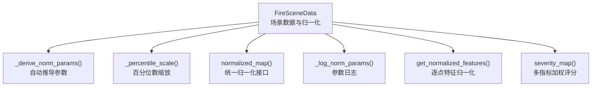
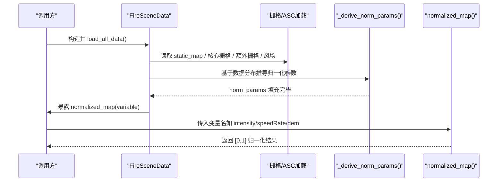
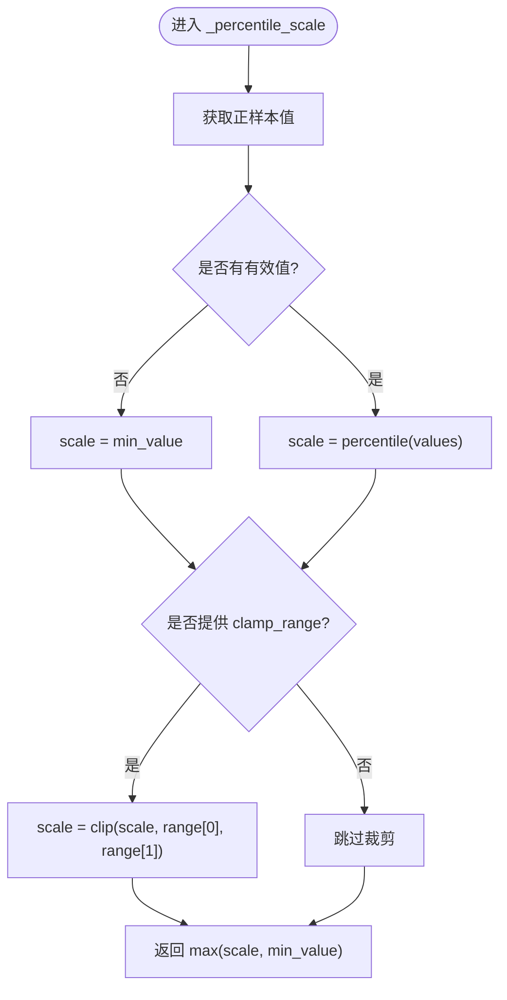
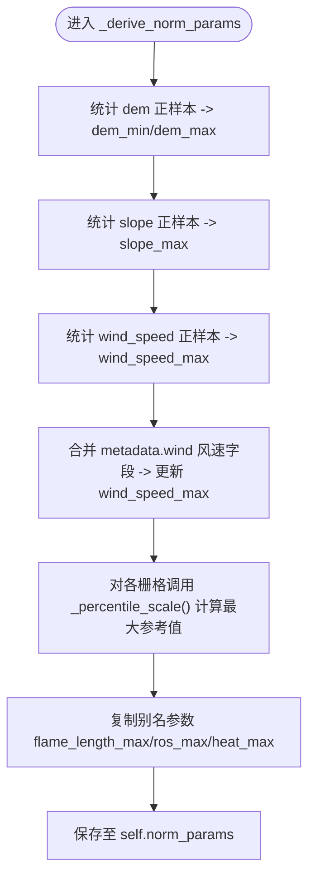
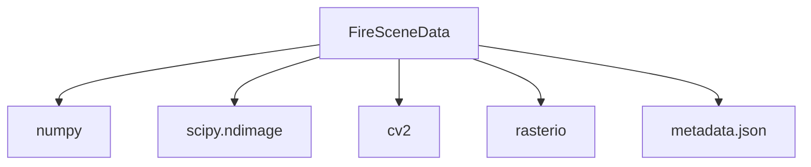

# 数据归一化策略

<cite>
**本文引用的文件**   
- [信息转换.py](file://environment_variables/environment_variables/信息转换.py)
</cite>

## 目录
1. [引言](#引言)
2. [项目结构](#项目结构)
3. [核心组件](#核心组件)
4. [架构总览](#架构总览)
5. [详细组件分析](#详细组件分析)
6. [依赖关系分析](#依赖关系分析)
7. [性能考量](#性能考量)
8. [故障排查指南](#故障排查指南)
9. [结论](#结论)
10. [附录](#附录)

## 引言
本文件面向“数据归一化系统”的实现文档，聚焦于不同数据类型采用的归一化策略与参数推导机制。内容涵盖：
- DEM 数据的 min-max 归一化
- 栅格数据的百分位数缩放
- 风向数据的角度处理（正弦/余弦编码）
- NORM_RASTER_PARAMS 映射表与 NORM_ALIASES 别名的作用
- _derive_norm_params() 自动推导归一化参数的流程（dem_min/dem_max、slope_max、wind_speed_max 等）
- _percentile_scale() 的百分位数计算与范围裁剪机制
- normalized_map() 的使用示例与扩展自定义归一化策略的方法
- 归一化参数的日志记录与验证机制

## 项目结构
归一化相关逻辑集中在场景数据类中，负责加载栅格、静态地形、风场，并基于数据分布自动推导每场景的归一化参数，随后提供统一的归一化访问接口。

图表来源
- [信息转换.py:219-323](file://environment_variables/environment_variables/信息转换.py#L219-L323)
- [信息转换.py:559-603](file://environment_variables/environment_variables/信息转换.py#L559-L603)
- [信息转换.py:543-558](file://environment_variables/environment_variables/信息转换.py#L543-L558)
- [信息转换.py:616-638](file://environment_variables/environment_variables/信息转换.py#L616-L638)
- [信息转换.py:604-615](file://environment_variables/environment_variables/信息转换.py#L604-L615)
- [信息转换.py:1187-1234](file://environment_variables/environment_variables/信息转换.py#L1187-L1234)
- [信息转换.py:903-918](file://environment_variables/environment_variables/信息转换.py#L903-L918)

章节来源
- [信息转换.py:219-323](file://environment_variables/environment_variables/信息转换.py#L219-L323)

## 核心组件
- FireSceneData：场景数据载体，封装了栅格加载、静态地形、风场、边界检测、热场重建以及归一化参数推导与使用。
- 归一化配置常量：
  - NORM_RASTER_PARAMS：将栅格键名映射到对应的归一化参数键名。
  - NORM_ALIASES：为常用别名提供标准化键名映射，便于上层以语义名称调用。
- 关键方法：
  - _percentile_scale()：按百分位统计值进行缩放，支持最小值下限与可选范围裁剪。
  - _derive_norm_params()：从当前场景数据自动推导 dem_min/dem_max、slope_max、wind_speed_max 及各栅格的最大参考值。
  - normalized_map()：对指定变量执行归一化，DEM 采用 min-max，其他栅格采用除以对应最大参考值的方式。
  - _log_norm_params()：打印关键归一化参数摘要，用于可观测性与调试。
  - get_normalized_features()：在单点位置返回已归一化的特征字典，风向采用 sin/cos 编码。

章节来源
- [信息转换.py:224-236](file://environment_variables/environment_variables/信息转换.py#L224-L236)
- [信息转换.py:294-306](file://environment_variables/environment_variables/信息转换.py#L294-L306)
- [信息转换.py:543-558](file://environment_variables/environment_variables/信息转换.py#L543-L558)
- [信息转换.py:559-603](file://environment_variables/environment_variables/信息转换.py#L559-L603)
- [信息转换.py:616-638](file://environment_variables/environment_variables/信息转换.py#L616-L638)
- [信息转换.py:604-615](file://environment_variables/environment_variables/信息转换.py#L604-L615)
- [信息转换.py:1187-1234](file://environment_variables/environment_variables/信息转换.py#L1187-L1234)

## 架构总览
归一化系统在场景初始化时完成数据加载与参数推导，并在后续推理或训练过程中通过统一接口输出归一化后的栅格或特征。

图表来源
- [信息转换.py:639-682](file://environment_variables/environment_variables/信息转换.py#L639-L682)
- [信息转换.py:559-603](file://environment_variables/environment_variables/信息转换.py#L559-L603)
- [信息转换.py:616-638](file://environment_variables/environment_variables/信息转换.py#L616-L638)

## 详细组件分析

### 归一化策略总览
- DEM 数据：min-max 归一化，分母为 dem_max - dem_min，若差值过小则回退为 1.0，最终结果裁剪至 [0,1]。
- 栅格数据（强度、长度、速度、热量、冠层火等）：采用“最大参考值”归一化，即 data / max_ref，max_ref 由 _percentile_scale() 基于正样本百分位统计得到；必要时施加 clamp_range 限制。
- 风向数据：不直接做线性归一化，而是转换为 sin/cos 双通道编码，避免角度周期性带来的数值不连续问题。

章节来源
- [信息转换.py:616-638](file://environment_variables/environment_variables/信息转换.py#L616-L638)
- [信息转换.py:1187-1234](file://environment_variables/environment_variables/信息转换.py#L1187-L1234)

### NORM_RASTER_PARAMS 映射表
- 作用：将栅格键名映射到归一化参数键名，例如 intensity → intensity_max，speedRate → speedRate_max，spread_direction → spread_direction_max 等。
- 影响：normalized_map() 根据该映射决定使用哪个参数作为分母。

章节来源
- [信息转换.py:224-231](file://environment_variables/environment_variables/信息转换.py#L224-L231)

### NORM_ALIASES 别名
- 作用：为常见别名提供标准化键名，如 flame_length → length，ros → speedRate，heat → heat_per_unit_area。
- 影响：normalized_map() 首先通过别名解析真实栅格键名，再走映射表选择参数。

章节来源
- [信息转换.py:232-236](file://environment_variables/environment_variables/信息转换.py#L232-L236)

### _percentile_scale() 百分位数计算与范围裁剪
- 输入：raster_key、percentile（默认 99.5）、min_value（默认 1.0）、clamp_range（可选）。
- 步骤：
  1) 提取正样本（有限且大于 0），若无有效样本则使用 min_value。
  2) 计算 percentile 分位值作为 scale。
  3) 若提供 clamp_range，则将 scale 裁剪到该区间。
  4) 最终返回 max(scale, min_value)，确保分母不为零且具备合理下限。
- 用途：为各栅格生成稳健的最大参考值，降低极端异常值的影响。

图表来源
- [信息转换.py:543-558](file://environment_variables/environment_variables/信息转换.py#L543-L558)

章节来源
- [信息转换.py:543-558](file://environment_variables/environment_variables/信息转换.py#L543-L558)

### _derive_norm_params() 自动推导参数
- 目标：为每个场景计算一组稳健的归一化参数，写入 self.norm_params。
- 主要步骤：
  - dem_min/dem_max：从 dem 的正样本取最小/最大值；若无数据则回退为 0.0/1.0；若 dem_max <= dem_min，强制 dem_max = dem_min + 1.0，防止除零。
  - slope_max：从 slope 正样本取最大值，若无数据则为 1.0。
  - wind_speed_max：从 wind_speed 正样本取最大值，若无数据则为 1.0；同时合并 metadata.wind 中的风速字段（如 wind_speed_mph、peak_wind_speed_mph、wind_speed_range_mph、expected_wind_speed_range_mph），取最大值作为最终 wind_speed_max。
  - 栅格最大参考值：对 intensity、length、speedRate、spread_direction、heat_per_unit_area、crown_fire 分别调用 _percentile_scale() 计算，其中 intensity 支持 clamp_range=(500.0, 8000.0)，spread_direction 设置 min_value=360.0。
  - 别名参数同步：flame_length_max、ros_max、heat_max 分别复制 length_max、speedRate_max、heat_per_unit_area_max。
- 输出：self.norm_params 包含所有需要的归一化参数。

图表来源
- [信息转换.py:559-603](file://environment_variables/environment_variables/信息转换.py#L559-L603)

章节来源
- [信息转换.py:559-603](file://environment_variables/environment_variables/信息转换.py#L559-L603)

### normalized_map() 使用方法与扩展
- 基本用法：
  - 传入变量名（如 "intensity"、"length"、"speedRate"、"heat_per_unit_area"、"crown_fire"、"dem"、"slope"、"wind_speed"）。
  - 内部先通过 NORM_ALIASES 解析别名，再通过 NORM_RASTER_PARAMS 确定参数键名。
  - DEM 走 min-max 路径；其他栅格走 data / max_ref 路径，最后统一裁剪到 [0,1]。
- 示例（概念性描述）：
  - 获取强度归一化图：normalized_map("intensity")
  - 获取传播速率归一化图：normalized_map("speedRate")
  - 获取高程归一化图：normalized_map("dem")
  - 获取坡度归一化图：normalized_map("slope")
  - 获取风速归一化图：normalized_map("wind_speed")
- 扩展自定义归一化策略：
  - 新增栅格类型：在 NORM_RASTER_PARAMS 中添加映射，或在 normalized_map() 分支中增加 key 判断与对应参数键名。
  - 调整百分位策略：修改 _percentile_scale() 的默认 percentile、min_value 或 clamp_range。
  - 新增别名：在 NORM_ALIASES 中添加新别名到标准键的映射。
  - 新增参数推导：在 _derive_norm_params() 中加入新的统计项与参数键。

章节来源
- [信息转换.py:224-236](file://environment_variables/environment_variables/信息转换.py#L224-L236)
- [信息转换.py:616-638](file://environment_variables/environment_variables/信息转换.py#L616-L638)
- [信息转换.py:543-558](file://environment_variables/environment_variables/信息转换.py#L543-L558)
- [信息转换.py:559-603](file://environment_variables/environment_variables/信息转换.py#L559-L603)

### 风向数据的角度处理
- 风向不直接线性归一化，而是转换为 sin/cos 双通道编码，保留角度周期性信息，避免 0°/360° 跳变。
- 在 get_normalized_features() 中，wind_direction 被转换为 wind_dir_sin 与 wind_dir_cos 两个特征。

章节来源
- [信息转换.py:1187-1234](file://environment_variables/environment_variables/信息转换.py#L1187-L1234)

### 归一化参数的日志记录与验证
- 日志记录：_log_norm_params() 会打印关键参数（如 intensity_max、length_max、speedRate_max、heat_per_unit_area_max、crown_fire_max、wind_speed_max）的摘要，便于快速检查参数合理性。
- 验证机制：
  - 在 load_all_data() 末尾调用 _derive_norm_params() 与 _log_norm_params()，确保每次场景加载后参数可用且可观测。
  - severity_map() 使用 normalized_map() 聚合多个归一化指标，间接验证归一化输出的稳定性与一致性。

章节来源
- [信息转换.py:604-615](file://environment_variables/environment_variables/信息转换.py#L604-L615)
- [信息转换.py:639-682](file://environment_variables/environment_variables/信息转换.py#L639-L682)
- [信息转换.py:903-918](file://environment_variables/environment_variables/信息转换.py#L903-L918)

## 依赖关系分析
- 模块内依赖：
  - FireSceneData 依赖 numpy、scipy.ndimage、cv2、rasterio 进行数据处理与图像操作。
  - 归一化逻辑依赖数据加载（static_map、核心栅格、额外栅格、风场）与元数据（metadata.wind）。
- 外部依赖：
  - rasterio：读取栅格元数据与像素值。
  - cv2：下采样与上采样用于热场平滑。
  - scipy.ndimage：形态学操作（如二值腐蚀）用于边界提取。

图表来源
- [信息转换.py:1-14](file://environment_variables/environment_variables/信息转换.py#L1-L14)
- [信息转换.py:392-424](file://environment_variables/environment_variables/信息转换.py#L392-L424)
- [信息转换.py:473-491](file://environment_variables/environment_variables/信息转换.py#L473-L491)
- [信息转换.py:759-820](file://environment_variables/environment_variables/信息转换.py#L759-L820)

章节来源
- [信息转换.py:1-14](file://environment_variables/environment_variables/信息转换.py#L1-L14)

## 性能考量
- 百分位统计：_percentile_scale() 仅对正样本进行统计，减少无效值干扰；对于大栅格，建议关注内存占用与 I/O 开销。
- 分母安全：多处使用 max(..., 1.0) 或 dem_max - dem_min 的最小回退，避免除零与数值不稳定。
- 热场重建：采用下采样+高斯模糊+上采样，平衡平滑效果与计算成本。

## 故障排查指南
- 未知变量键：normalized_map() 若遇到未配置的变量，会抛出 KeyError。请确认变量名是否在 NORM_ALIASES/NORM_RASTER_PARAMS 中正确映射。
- 缺失栅格：load_all_data() 会校验必需栅格是否存在，缺失将抛出 FileNotFoundError。
- 形状不一致：栅格与 static_map 的形状必须一致，否则抛出 RuntimeError。
- 空边界：t=0 无有效火边界时会抛出 InvalidSceneError，需检查 fire_threshold 或时间切片逻辑。
- 参数异常：若 _log_norm_params() 显示某参数异常（如 wind_speed_max 过低），检查 wind 数据来源与 metadata.wind 字段。

章节来源
- [信息转换.py:639-682](file://environment_variables/environment_variables/信息转换.py#L639-L682)
- [信息转换.py:616-638](file://environment_variables/environment_variables/信息转换.py#L616-L638)
- [信息转换.py:684-696](file://environment_variables/environment_variables/信息转换.py#L684-L696)

## 结论
本实现通过“每场景自适应参数推导 + 百分位稳健缩放 + 角度编码”的组合策略，为 DEM、栅格与风向数据提供了稳定、可扩展的归一化方案。NORM_RASTER_PARAMS 与 NORM_ALIASES 使接口简洁且易于扩展；_derive_norm_params() 与 _percentile_scale() 保证了参数推导的鲁棒性；normalized_map() 提供统一访问入口；日志与验证机制提升了可观测性与可靠性。

## 附录
- 典型调用路径（概念性）：
  - 场景初始化：构造 FireSceneData → load_all_data() → _derive_norm_params() → _log_norm_params()
  - 归一化访问：normalized_map("intensity") → 使用 intensity_max 作为分母
  - 特征提取：get_normalized_features(row, col) → 返回 dem_norm、slope_norm、wind_dir_sin/cos 等

章节来源
- [信息转换.py:639-682](file://environment_variables/environment_variables/信息转换.py#L639-L682)
- [信息转换.py:616-638](file://environment_variables/environment_variables/信息转换.py#L616-L638)
- [信息转换.py:1187-1234](file://environment_variables/environment_variables/信息转换.py#L1187-L1234)