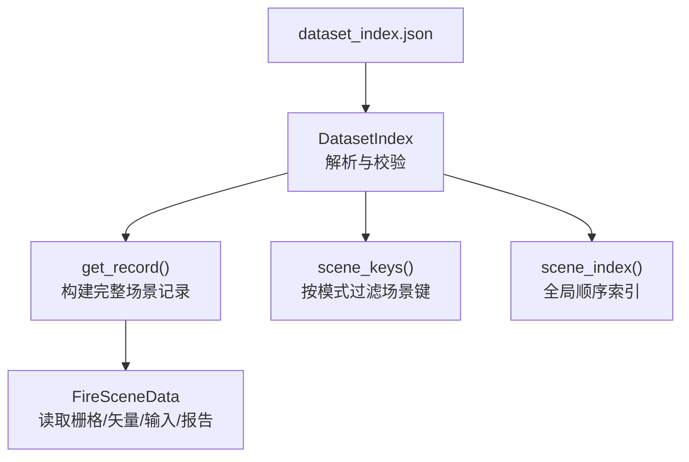
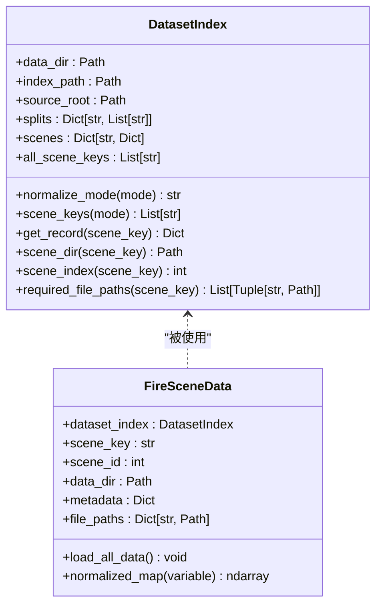
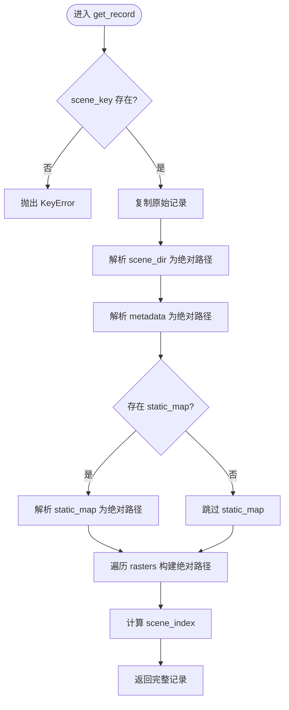

# 数据集索引管理

<cite>
**本文引用的文件**   
- [信息转换.py](file://environment_variables/environment_variables/信息转换.py)
- [dataset_index.json](file://environment_variables/environment_variables/dataset/dataset_index.json)
</cite>

## 目录
1. [简介](#简介)
2. [项目结构](#项目结构)
3. [核心组件](#核心组件)
4. [架构总览](#架构总览)
5. [详细组件分析](#详细组件分析)
6. [依赖关系分析](#依赖关系分析)
7. [性能与复杂度](#性能与复杂度)
8. [故障排查指南](#故障排查指南)
9. [结论](#结论)
10. [附录：使用示例](#附录使用示例)

## 简介
本文件围绕 DatasetIndex 类构建的数据集索引系统，系统性说明 dataset_index.json 的解析与验证机制、场景模式别名（train、validation、generalization、stress 等）的实现原理，以及 get_record() 如何组装完整场景记录（含绝对路径解析、元数据加载与文件依赖检查）、scene_keys() 的模式过滤逻辑和 scene_index() 的索引计算。文档同时提供错误处理策略与异常情况的处理方式，并给出面向使用者的代码级调用示例路径。

## 项目结构
- 索引配置文件
  - dataset_index.json：定义 schema、source_root、splits、raster_files 及 scenes 列表，描述每个场景的路径与元数据。
- 实现模块
  - 信息转换.py：包含 DatasetIndex 类及其相关辅助类与数据加载器。

图表来源
- [信息转换.py:20-134](file://environment_variables/environment_variables/信息转换.py#L20-L134)
- [dataset_index.json:1-98](file://environment_variables/environment_variables/dataset/dataset_index.json#L1-L98)

章节来源
- [信息转换.py:20-134](file://environment_variables/environment_variables/信息转换.py#L20-L134)
- [dataset_index.json:1-98](file://environment_variables/environment_variables/dataset/dataset_index.json#L1-L98)

## 核心组件
- DatasetIndex：负责解析 dataset_index.json，维护 source_root、splits、scenes、all_scene_keys，并提供 normalize_mode、scene_keys、get_record、scene_dir、scene_index、required_file_paths 等方法。
- FireSceneData：基于 DatasetIndex 提供的记录，进一步加载 metadata、静态地图、核心/扩展栅格、风场与输入文件，并进行归一化参数推导与热场计算。

章节来源
- [信息转换.py:20-134](file://environment_variables/environment_variables/信息转换.py#L20-L134)
- [信息转换.py:219-391](file://environment_variables/environment_variables/信息转换.py#L219-L391)

## 架构总览
DatasetIndex 作为“索引层”，将 JSON 中的相对路径与 source_root 组合为绝对路径，并在 get_record() 中补齐 scene_dir_abs、metadata_abs、static_map_abs、rasters_abs 与 scene_index。FireSceneData 作为“数据层”，在构造时通过 _load_metadata() 与 _build_file_paths() 完成具体文件的定位与校验，随后进行栅格读取、形状一致性校验与归一化参数推导。

图表来源
- [信息转换.py:20-134](file://environment_variables/environment_variables/信息转换.py#L20-L134)
- [信息转换.py:219-391](file://environment_variables/environment_variables/信息转换.py#L219-L391)

## 详细组件分析

### dataset_index.json 结构与解析
- 顶层字段
  - version、description：版本与说明。
  - source_root：数据根目录（可为绝对或相对路径）。
  - schema：定义路径基准规则与必填字段。
  - splits：训练/验证/泛化/压力测试四类场景集合。
  - raster_files：标准栅格键到相对路径的映射。
  - scenes：每个场景的详细配置。
- schema.path_base
  - scene_dir、static_map、metadata、rasters、vectors、inputs、reports 的路径基准分别定义为“相对于 source_root”或“相对于 scene_dir”。
- required_scene_fields / required_rasters
  - 定义了场景与栅格字段的必填项，用于后续校验。

解析流程要点
- 初始化时读取 index_path 指向的 JSON，若不存在则抛出 FileNotFoundError。
- 解析 source_root，若为相对路径则以 index_path 所在目录为基进行 resolve。
- 将 splits 与 scenes 拷贝为内部字典/列表，便于后续访问。
- 生成 all_scene_keys：先按固定顺序拼接 train/validation/generalization/stress，再追加不在 splits 中的其他场景键。

章节来源
- [dataset_index.json:1-98](file://environment_variables/environment_variables/dataset/dataset_index.json#L1-L98)
- [信息转换.py:32-66](file://environment_variables/environment_variables/信息转换.py#L32-L66)

### 场景模式别名系统
- MODE_ALIASES 支持以下别名映射：
  - train → train
  - validation → validation
  - generalization → generalization
  - stress → stress
  - test → generalization
  - eval → generalization
- normalize_mode(mode) 会将传入模式标准化为上述合法键之一；未知模式会抛出 ValueError。

章节来源
- [信息转换.py:23-30](file://environment_variables/environment_variables/信息转换.py#L23-L30)
- [信息转换.py:80-87](file://environment_variables/environment_variables/信息转换.py#L80-L87)

### scene_keys() 模式过滤逻辑
- 根据 normalize_mode(mode) 得到的 split 名称，从 self.splits[split] 取出场景键列表。
- 若对应 split 为空，抛出 ValueError，提示该模式下未配置任何场景。

章节来源
- [信息转换.py:89-94](file://environment_variables/environment_variables/信息转换.py#L89-L94)

### get_record() 构建完整场景记录
get_record(scene_key) 的核心步骤：
- 校验 scene_key 是否存在于 self.scenes，否则抛出 KeyError。
- 复制原始记录，计算 scene_dir_abs：
  - 若 scene_dir 为相对路径，以 source_root 为基拼接后 resolve。
- 计算 metadata_abs：
  - 默认 metadata 为 "metadata.json"，若为相对路径则以 scene_dir 为基拼接后 resolve。
- 计算 static_map_abs（可选）：
  - 若存在 static_map，且为相对路径，则以 source_root 为基拼接后 resolve。
- 计算 rasters_abs：
  - 遍历 record.rasters 中各键值对，若为相对路径则以 scene_dir 为基拼接后 resolve。
- 计算 scene_index：
  - 调用 scene_index(scene_key)，返回其在 all_scene_keys 中的位置（从 1 开始），若不在列表中返回 0。
- 返回包含以上绝对路径与索引信息的完整记录。

注意：get_record() 本身不执行文件存在性检查，仅做路径解析与补齐；实际存在性检查由 required_file_paths() 与 FireSceneData 的加载流程完成。

章节来源
- [信息转换.py:96-121](file://environment_variables/environment_variables/信息转换.py#L96-L121)
- [信息转换.py:123-134](file://environment_variables/environment_variables/信息转换.py#L123-L134)

### scene_index() 索引计算
- 若 scene_key 存在于 all_scene_keys，返回其索引位置+1（1-based）。
- 否则返回 0，表示未纳入全局顺序索引。

章节来源
- [信息转换.py:130-134](file://environment_variables/environment_variables/信息转换.py#L130-L134)

### required_file_paths() 文件依赖清单
- 收集必需文件标签与相对路径：
  - metadata、static_map、核心栅格（intensity、length、time、speedRate）、扩展栅格（spread_direction、heat_per_unit_area、crown_fire）。
  - 矢量（ignition、fire_perimeter）、输入（weather_stream、fuel_moisture）、报告（fire_growth_report、run_log）。
- 路径解析规则：
  - 缺失字段用占位符 "__missing_path__" 标记。
  - static_map 以 source_root 为基；其余以 scene_dir 为基。
  - 统一 resolve 为绝对路径。
- 返回值：[(label, absolute_path), ...] 供上层进行存在性检查与日志输出。

章节来源
- [信息转换.py:136-196](file://environment_variables/environment_variables/信息转换.py#L136-L196)

### FireSceneData 与元数据加载、文件依赖检查
- 构造阶段
  - 若未显式传入 scene_record，则通过 dataset_index.scene_keys("train")[0] 获取首个训练场景并调用 dataset_index.get_record() 得到记录。
  - 保存 data_dir = scene_dir_abs，若目录不存在抛出 FileNotFoundError。
  - 调用 _load_metadata() 读取 metadata.json，若缺失抛出 FileNotFoundError。
  - 调用 _build_file_paths() 构建 file_paths 字典，其中 static_map 必须存在，否则抛出 KeyError。
- 栅格加载与形状一致性
  - load_all_data() 依次加载静态地图与核心/扩展栅格，并通过 _assert_raster_shape() 确保所有栅格与静态地图形状一致，不一致则抛出 RuntimeError。
  - 风场优先尝试 wind/wspd.asc 与 wind/wdir.asc；若缺失则从 weather_stream 解析或回退至 metadata.wind 的统计值，并广播为与 shape 一致的网格。
- 归一化参数推导
  - 基于 dem/slope/wind/intensity 等派生 norm_params，用于 normalized_map() 的缩放。
- 边界点与热场
  - _initialize_boundary() 检测 t=0 火边界，若为空则设置 is_valid_scene=False 并抛出 InvalidSceneError。
  - _compute_thermal_field() 基于 fire_binary_map 与 intensity 计算热势场与导航场。

章节来源
- [信息转换.py:219-391](file://environment_variables/environment_variables/信息转换.py#L219-L391)
- [信息转换.py:349-368](file://environment_variables/environment_variables/信息转换.py#L349-L368)
- [信息转换.py:370-391](file://environment_variables/environment_variables/信息转换.py#L370-L391)
- [信息转换.py:392-424](file://environment_variables/environment_variables/信息转换.py#L392-L424)
- [信息转换.py:426-491](file://environment_variables/environment_variables/信息转换.py#L426-L491)
- [信息转换.py:501-533](file://environment_variables/environment_variables/信息转换.py#L501-L533)
- [信息转换.py:559-602](file://environment_variables/environment_variables/信息转换.py#L559-L602)
- [信息转换.py:639-683](file://environment_variables/environment_variables/信息转换.py#L639-L683)
- [信息转换.py:684-721](file://environment_variables/environment_variables/信息转换.py#L684-L721)
- [信息转换.py:759-800](file://environment_variables/environment_variables/信息转换.py#L759-L800)

### 关键流程图：get_record() 构建记录

图表来源
- [信息转换.py:96-121](file://environment_variables/environment_variables/信息转换.py#L96-L121)
- [信息转换.py:123-134](file://environment_variables/environment_variables/信息转换.py#L123-L134)

## 依赖关系分析
- DatasetIndex 依赖 dataset_index.json 的结构约定（schema、splits、scenes）。
- FireSceneData 依赖 DatasetIndex 提供的源根与场景记录，并依赖外部库（rasterio、numpy、scipy、cv2）进行栅格与数组操作。
- 路径解析遵循 schema.path_base 的规则，确保跨平台兼容性与可移植性。

图表来源
- [信息转换.py:20-134](file://environment_variables/environment_variables/信息转换.py#L20-L134)
- [信息转换.py:219-391](file://environment_variables/environment_variables/信息转换.py#L219-L391)
- [dataset_index.json:1-98](file://environment_variables/environment_variables/dataset/dataset_index.json#L1-L98)

章节来源
- [信息转换.py:20-134](file://environment_variables/environment_variables/信息转换.py#L20-L134)
- [信息转换.py:219-391](file://environment_variables/environment_variables/信息转换.py#L219-L391)
- [dataset_index.json:1-98](file://environment_variables/environment_variables/dataset/dataset_index.json#L1-L98)

## 性能与复杂度
- scene_keys()：O(1) 字典查找 + 列表拷贝，时间复杂度 O(N)（N 为该 split 的场景数）。
- get_record()：主要开销在于路径解析与字符串处理，整体近似 O(M)（M 为 rasters 条目数）。
- scene_index()：O(K) 线性搜索（K 为 all_scene_keys 长度），可通过维护反向映射优化为 O(1)。
- required_file_paths()：O(P)（P 为所需文件数量）。
- FireSceneData.load_all_data()：受栅格 I/O 与数组运算影响较大，建议缓存已加载数据与避免重复解析。

[本节为通用性能讨论，无需特定文件引用]

## 故障排查指南
- 索引文件缺失
  - 现象：初始化 DatasetIndex 时报错找不到 dataset_index.json。
  - 原因：data_dir/index_name 指向的路径不存在。
  - 处理：确认 data_dir 与 index_name 参数，或修正工作目录。
- 未知模式
  - 现象：scene_keys(mode) 抛出 ValueError。
  - 原因：mode 不在 MODE_ALIASES 中。
  - 处理：使用 train/validation/generalization/stress/test/eval 之一。
- 模式无场景
  - 现象：scene_keys(mode) 抛出 ValueError。
  - 原因：对应 split 下没有配置任何场景键。
  - 处理：检查 dataset_index.json 的 splits 配置。
- 未知场景键
  - 现象：get_record(scene_key) 抛出 KeyError。
  - 原因：scene_key 不在 scenes 字典中。
  - 处理：核对 scene_key 拼写与大小写。
- 场景目录缺失
  - 现象：FireSceneData 构造时报 FileNotFoundError。
  - 原因：scene_dir_abs 对应的目录不存在。
  - 处理：检查 source_root 与 scene_dir 配置是否正确。
- 元数据缺失
  - 现象：_load_metadata() 抛出 FileNotFoundError。
  - 原因：metadata.json 不存在或路径不正确。
  - 处理：确保 metadata 字段正确且文件存在。
- 静态地图缺失或通道数不符
  - 现象：_build_file_paths() 抛出 KeyError 或 _load_static_map() 抛出 RuntimeError。
  - 原因：缺少 static_map 或静态地图波段数不等于预期。
  - 处理：补充 static_map 并确保多波段栅格符合 STATIC_BAND_KEYS 数量。
- 栅格形状不一致
  - 现象：_assert_raster_shape() 抛出 RuntimeError。
  - 原因：某栅格与静态地图尺寸不一致。
  - 处理：统一重采样或裁剪至相同分辨率与范围。
- 风场形状不一致
  - 现象：load_all_data() 末尾抛出 RuntimeError。
  - 原因：wind_speed 或 wind_direction 的形状与 shape 不一致。
  - 处理：检查 ASC 文件或 weather_stream 解析结果，确保与 shape 一致。
- 无效场景（t=0 火边界为空）
  - 现象：_initialize_boundary() 抛出 InvalidSceneError。
  - 原因：t=0 时刻无法检测到有效火边界。
  - 处理：调整 init_area_percent 或检查 time 栅格与 fire_mask 生成逻辑。

章节来源
- [信息转换.py:32-41](file://environment_variables/environment_variables/信息转换.py#L32-L41)
- [信息转换.py:80-94](file://environment_variables/environment_variables/信息转换.py#L80-L94)
- [信息转换.py:96-121](file://environment_variables/environment_variables/信息转换.py#L96-L121)
- [信息转换.py:271-276](file://environment_variables/environment_variables/信息转换.py#L271-L276)
- [信息转换.py:349-356](file://environment_variables/environment_variables/信息转换.py#L349-L356)
- [信息转换.py:370-391](file://environment_variables/environment_variables/信息转换.py#L370-L391)
- [信息转换.py:501-533](file://environment_variables/environment_variables/信息转换.py#L501-L533)
- [信息转换.py:639-683](file://environment_variables/environment_variables/信息转换.py#L639-L683)
- [信息转换.py:684-721](file://environment_variables/environment_variables/信息转换.py#L684-L721)

## 结论
DatasetIndex 提供了稳定、可扩展的数据集索引能力，通过 schema 约束与路径基准规则，实现了跨平台、可移植的场景管理。配合 FireSceneData 的严格文件依赖检查与形状一致性校验，能够保障数据加载的健壮性。模式别名系统与 scene_index 的设计使得训练/验证/泛化/压力测试的流程更加清晰可控。建议在大规模数据场景中对 scene_index 的反向映射进行优化，并对栅格 I/O 引入缓存以提升性能。

[本节为总结性内容，无需特定文件引用]

## 附录：使用示例
以下为典型使用流程的代码片段路径，读者可根据需要参考相应行号：
- 初始化索引并列出训练场景键
  - [信息转换.py:32-66](file://environment_variables/environment_variables/信息转换.py#L32-L66)
  - [信息转换.py:89-94](file://environment_variables/environment_variables/信息转换.py#L89-L94)
- 获取某个场景的完整记录（含绝对路径与索引）
  - [信息转换.py:96-121](file://environment_variables/environment_variables/信息转换.py#L96-L121)
  - [信息转换.py:123-134](file://environment_variables/environment_variables/信息转换.py#L123-L134)
- 构建文件依赖清单并进行存在性检查
  - [信息转换.py:136-196](file://environment_variables/environment_variables/信息转换.py#L136-L196)
- 加载场景数据（元数据、栅格、风场、归一化参数）
  - [信息转换.py:219-391](file://environment_variables/environment_variables/信息转换.py#L219-L391)
  - [信息转换.py:392-424](file://environment_variables/environment_variables/信息转换.py#L392-L424)
  - [信息转换.py:426-491](file://environment_variables/environment_variables/信息转换.py#L426-L491)
  - [信息转换.py:559-602](file://environment_variables/environment_variables/信息转换.py#L559-L602)
  - [信息转换.py:639-683](file://environment_variables/environment_variables/信息转换.py#L639-L683)
- 初始化训练边界与热场
  - [信息转换.py:684-721](file://environment_variables/environment_variables/信息转换.py#L684-L721)
  - [信息转换.py:759-800](file://environment_variables/environment_variables/信息转换.py#L759-L800)

章节来源
- [信息转换.py:32-66](file://environment_variables/environment_variables/信息转换.py#L32-L66)
- [信息转换.py:89-94](file://environment_variables/environment_variables/信息转换.py#L89-L94)
- [信息转换.py:96-121](file://environment_variables/environment_variables/信息转换.py#L96-L121)
- [信息转换.py:123-134](file://environment_variables/environment_variables/信息转换.py#L123-L134)
- [信息转换.py:136-196](file://environment_variables/environment_variables/信息转换.py#L136-L196)
- [信息转换.py:219-391](file://environment_variables/environment_variables/信息转换.py#L219-L391)
- [信息转换.py:392-424](file://environment_variables/environment_variables/信息转换.py#L392-L424)
- [信息转换.py:426-491](file://environment_variables/environment_variables/信息转换.py#L426-L491)
- [信息转换.py:559-602](file://environment_variables/environment_variables/信息转换.py#L559-L602)
- [信息转换.py:639-683](file://environment_variables/environment_variables/信息转换.py#L639-L683)
- [信息转换.py:684-721](file://environment_variables/environment_variables/信息转换.py#L684-L721)
- [信息转换.py:759-800](file://environment_variables/environment_variables/信息转换.py#L759-L800)