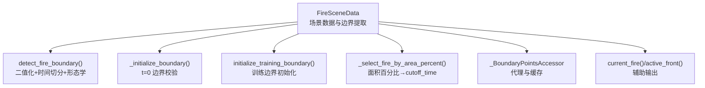
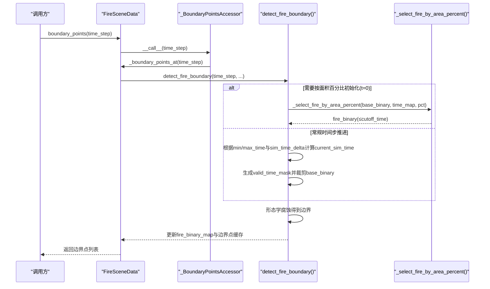
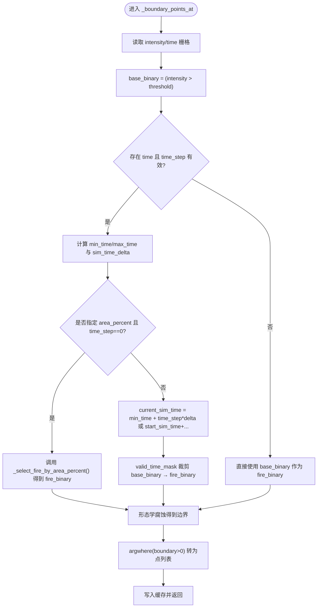
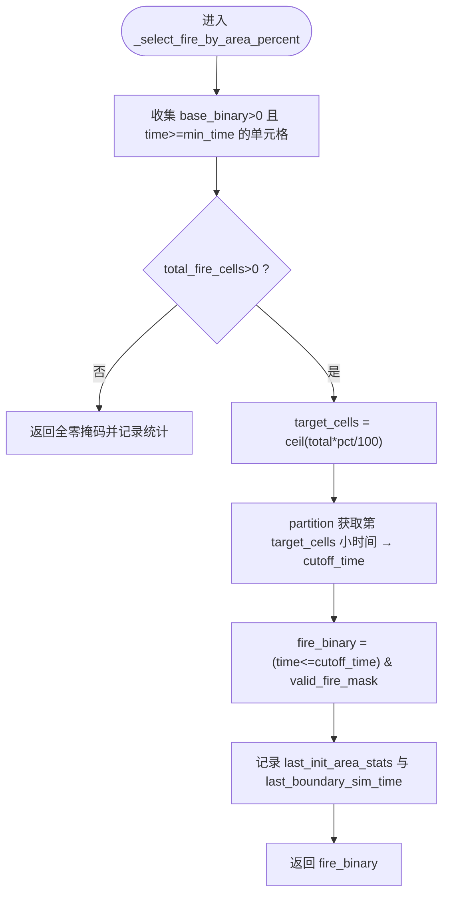
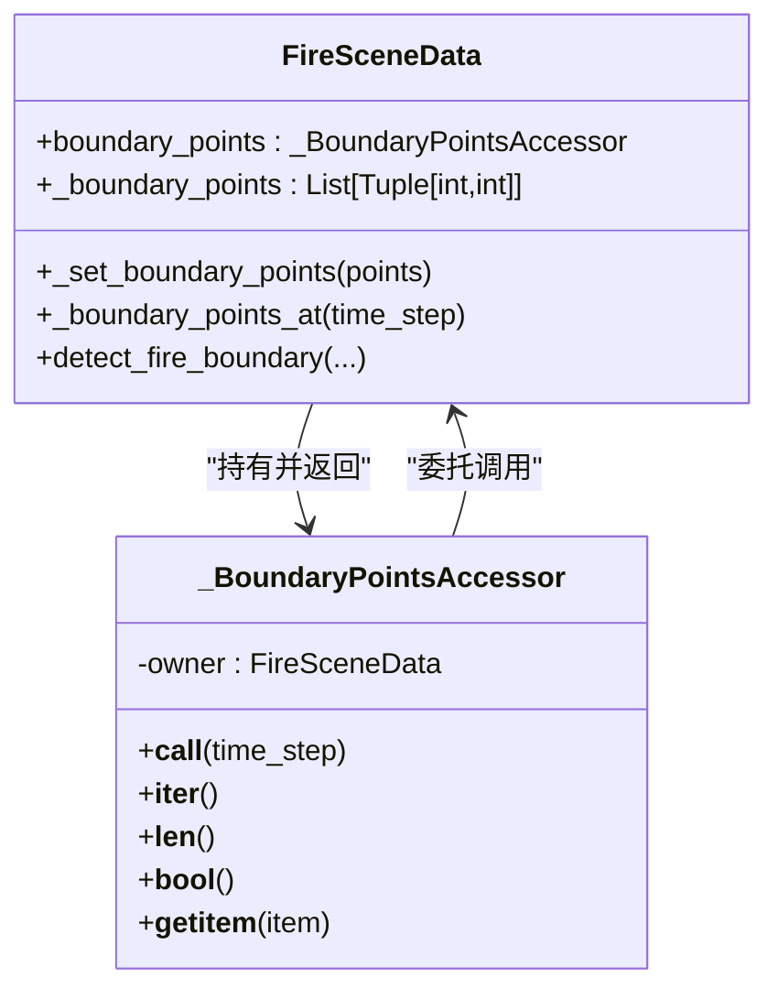
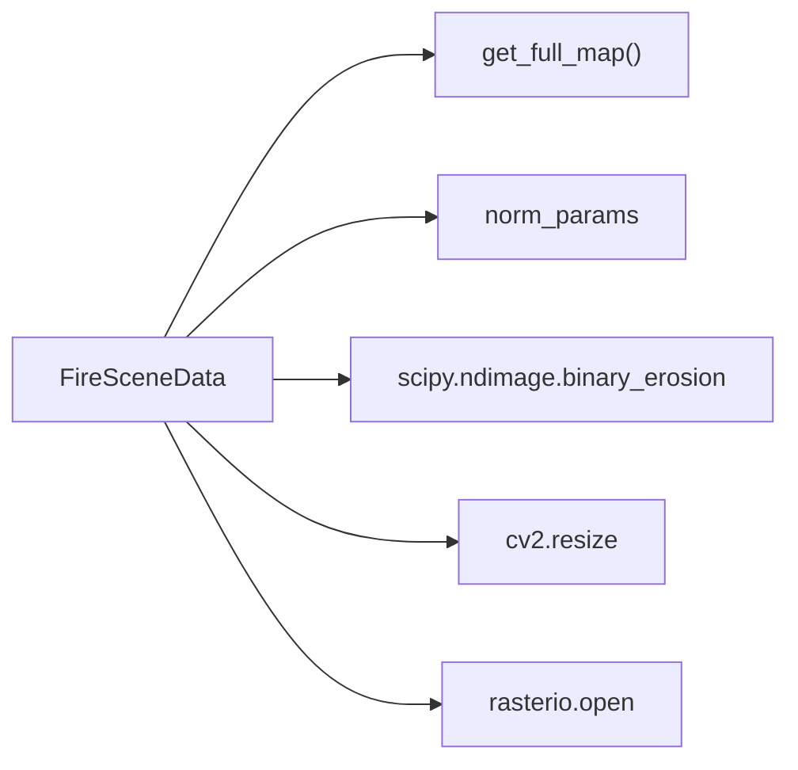

# 火场边界检测

<cite>
**本文引用的文件**   
- [信息转换.py](file://environment_variables/environment_variables/信息转换.py)
</cite>

## 目录
1. [简介](#简介)
2. [项目结构](#项目结构)
3. [核心组件](#核心组件)
4. [架构总览](#架构总览)
5. [详细组件分析](#详细组件分析)
6. [依赖关系分析](#依赖关系分析)
7. [性能考量](#性能考量)
8. [故障排查指南](#故障排查指南)
9. [结论](#结论)
10. [附录：可视化与调试工具使用](#附录可视化与调试工具使用)

## 简介
本技术文档聚焦于“火场边界检测算法”的实现细节，围绕以下关键点展开：
- _boundary_points_at() 的边界点提取流程（二值化掩码、形态学膨胀/腐蚀、时间切分）
- _initialize_boundary() 对 t=0 时刻边界的校验逻辑
- initialize_training_boundary() 的训练边界初始化策略与 init_area_percent 的作用
- _select_fire_by_area_percent() 的面积百分比选择算法与 cutoff_time 计算
- _boundary_points_accessor 代理模式与缓存机制
- 边界点可视化与调试方法
- 边界检测失败的错误处理与恢复策略

## 项目结构
该功能位于环境数据加载与场景管理模块中，核心类为 FireSceneData，提供从栅格数据到火场边界点的完整管线。关键入口包括：
- detect_fire_boundary(): 统一边界提取接口
- _boundary_points_at(): 对外暴露的时间步访问器
- _initialize_boundary(): 构造时验证 t=0 边界有效性
- initialize_training_boundary(): 训练前按面积百分比或百分位初始化边界
- _select_fire_by_area_percent(): 基于时间切分的面积百分比选择
- _BoundaryPointsAccessor: 代理与缓存访问层

图表来源
- [信息转换.py:821-887](file://environment_variables/environment_variables/信息转换.py#L821-L887)
- [信息转换.py:684-696](file://environment_variables/environment_variables/信息转换.py#L684-L696)
- [信息转换.py:698-721](file://environment_variables/environment_variables/信息转换.py#L698-L721)
- [信息转换.py:723-757](file://environment_variables/environment_variables/信息转换.py#L723-L757)
- [信息转换.py:199-217](file://environment_variables/environment_variables/信息转换.py#L199-L217)
- [信息转换.py:892-901](file://environment_variables/environment_variables/信息转换.py#L892-L901)

章节来源
- [信息转换.py:199-217](file://environment_variables/environment_variables/信息转换.py#L199-L217)
- [信息转换.py:684-721](file://environment_variables/environment_variables/信息转换.py#L684-L721)
- [信息转换.py:723-757](file://environment_variables/environment_variables/信息转换.py#L723-L757)
- [信息转换.py:821-901](file://environment_variables/environment_variables/信息转换.py#L821-L901)

## 核心组件
- FireSceneData: 封装场景数据加载、归一化参数推导、热场重建与边界提取等能力
- _BoundaryPointsAccessor: 代理对象，提供对 boundary_points 的迭代、长度、布尔语义与索引访问，内部维护缓存列表
- 边界提取主流程: detect_fire_boundary() 负责二值化、时间窗口裁剪、形态学边缘提取并写入缓存

章节来源
- [信息转换.py:219-348](file://environment_variables/environment_variables/信息转换.py#L219-L348)
- [信息转换.py:199-217](file://environment_variables/environment_variables/信息转换.py#L199-L217)
- [信息转换.py:821-901](file://environment_variables/environment_variables/信息转换.py#L821-L901)

## 架构总览
下图展示了边界检测在 FireSceneData 中的调用链路与数据流。

图表来源
- [信息转换.py:199-217](file://environment_variables/environment_variables/信息转换.py#L199-L217)
- [信息转换.py:821-887](file://environment_variables/environment_variables/信息转换.py#L821-L887)
- [信息转换.py:723-757](file://environment_variables/environment_variables/信息转换.py#L723-L757)

## 详细组件分析

### _boundary_points_at() 边界点提取算法
- 输入: time_step（默认0），可选 fire_threshold、init_percentile、init_area_percent、start_sim_time
- 步骤概览:
  - 获取 intensity 与 time 栅格；以阈值进行二值化得到 base_binary
  - 若存在 time 且 time_step < 大数阈值：
    - 计算非负时间的 min_time 与 max_time，并据此估算 sim_time_delta
    - 若传入 start_sim_time，则 current_sim_time = start_sim_time + time_step * sim_time_delta
    - 否则若 area_percent 不为空且 time_step == 0，走面积百分比路径（见下节）
    - 否则 current_sim_time = min_time + time_step * sim_time_delta
    - 用 valid_time_mask 裁剪 base_binary 得到 fire_binary
  - 若无 time 或超出范围，直接使用 base_binary
  - 形态学腐蚀后取差集得到边界像素坐标，写入缓存并返回

图表来源
- [信息转换.py:821-887](file://environment_variables/environment_variables/信息转换.py#L821-L887)

章节来源
- [信息转换.py:821-887](file://environment_variables/environment_variables/信息转换.py#L821-L887)

### _initialize_boundary() 验证 t=0 时刻边界有效性
- 在构造阶段自动执行，调用 detect_fire_boundary(time_step=0)
- 若返回边界点为空，则标记 is_valid_scene=False，设置 invalid_reason，并抛出 InvalidSceneError
- 用于确保训练不能回退到最终状态边界，必须拥有有效的初始边界

章节来源
- [信息转换.py:684-696](file://environment_variables/environment_variables/信息转换.py#L684-L696)

### initialize_training_boundary() 训练边界初始化逻辑
- 支持两种初始化方式:
  - 仅传 init_percentile: 等价于将 percent 视为面积百分比，走面积百分比路径
  - 显式传 init_area_percent: 优先使用该值
- 当 area_percent 为 None 时，直接取 t=0 边界（不引入时间切分）
- 当 area_percent 有值时，调用 detect_fire_boundary(time_step=0, init_area_percent=...)，并在成功时记录 training_start_sim_time = last_boundary_sim_time
- 若结果为空，同样标记无效并抛出异常

章节来源
- [信息转换.py:698-721](file://environment_variables/environment_variables/信息转换.py#L698-L721)

### _select_fire_by_area_percent() 面积百分比选择与 cutoff_time 计算
- 目标: 在全部已燃区域中，选取最早燃烧的部分，使其面积占比接近目标百分比
- 关键步骤:
  - 统计所有 base_binary>0 且 time>=min_time 的单元格总数 total_fire_cells
  - 若为0，返回全零掩码并记录统计信息
  - 计算 target_cells = ceil(total_fire_cells * pct / 100)
  - 使用 np.partition 快速定位第 target_cells 小的时间值作为 cutoff_time
  - 构建 fire_binary = (time <= cutoff_time) 的掩码
  - 记录 last_init_area_stats（包含 total/init 单元数、实际百分比、cutoff_time）与 last_boundary_sim_time=cutoff_time

图表来源
- [信息转换.py:723-757](file://environment_variables/environment_variables/信息转换.py#L723-L757)

章节来源
- [信息转换.py:723-757](file://environment_variables/environment_variables/信息转换.py#L723-L757)

### _boundary_points_accessor 代理模式与缓存机制
- 代理对象持有 owner(FireSceneData) 引用，__call__ 转发至 _boundary_points_at
- 实现 __iter__/__len__/__bool__/__getitem__，使 boundary_points 可像序列一样使用
- 内部通过 owner._boundary_points 列表作为缓存，_set_boundary_points 负责类型转换与赋值
- 属性 boundary_points 会惰性创建 accessor，保证多次访问一致性

图表来源
- [信息转换.py:199-217](file://environment_variables/environment_variables/信息转换.py#L199-L217)
- [信息转换.py:324-348](file://environment_variables/environment_variables/信息转换.py#L324-L348)
- [信息转换.py:889-890](file://environment_variables/environment_variables/信息转换.py#L889-L890)

章节来源
- [信息转换.py:199-217](file://environment_variables/environment_variables/信息转换.py#L199-L217)
- [信息转换.py:324-348](file://environment_variables/environment_variables/信息转换.py#L324-L348)
- [信息转换.py:889-890](file://environment_variables/environment_variables/信息转换.py#L889-L890)

### 辅助输出与诊断
- current_fire(time_step): 返回当前火场二值掩码
- active_front(time_step): 返回活跃前沿（形态学边缘）
- diagnose_thermal_health(): 热场健康诊断（与边界相关但非边界提取本身）

章节来源
- [信息转换.py:892-901](file://environment_variables/environment_variables/信息转换.py#L892-L901)
- [信息转换.py:972-1012](file://environment_variables/environment_variables/信息转换.py#L972-L1012)

## 依赖关系分析
- 外部库: numpy、scipy.ndimage（形态学）、rasterio（栅格IO）、cv2（缩放）
- 内部依赖:
  - get_full_map(): 提供 intensity/time 栅格切片
  - norm_params: 提供 fire_threshold 等归一化参数
  - last_boundary_sim_time/last_init_area_stats: 记录时间与统计信息，便于调试与后续流程使用

图表来源
- [信息转换.py:1267-1275](file://environment_variables/environment_variables/信息转换.py#L1267-L1275)
- [信息转换.py:821-887](file://environment_variables/environment_variables/信息转换.py#L821-L887)

章节来源
- [信息转换.py:1267-1275](file://environment_variables/environment_variables/信息转换.py#L1267-L1275)
- [信息转换.py:821-887](file://environment_variables/environment_variables/信息转换.py#L821-L887)

## 性能考量
- 二值化与形态学操作均为向量化实现，复杂度近似 O(HW)
- 面积百分比选择使用 np.partition，平均线性复杂度 O(N)，避免全局排序
- 时间切分仅在 time_step 有效时触发，减少不必要的计算
- 建议:
  - 合理设置 fire_threshold，避免过薄或过厚边界导致噪声
  - 对于超大栅格，可考虑先降采样再上采样（代码已在热场重建中使用类似策略）

[本节为通用指导，不涉及具体文件分析]

## 故障排查指南
- 常见错误:
  - 空边界: 当 t=0 或按面积百分比初始化后边界点为空，将抛出 InvalidSceneError
  - 缺失栅格: intensity/time 缺失会导致无法提取边界
  - 形状不一致: 栅格与静态地图尺寸不一致会报错
- 恢复策略:
  - 调整 fire_threshold 或 init_area_percent
  - 检查 metadata 与 required_file_paths 完整性
  - 使用 validate_scene_boundaries() 批量预检数据集

章节来源
- [信息转换.py:684-696](file://environment_variables/environment_variables/信息转换.py#L684-L696)
- [信息转换.py:698-721](file://environment_variables/environment_variables/信息转换.py#L698-L721)
- [信息转换.py:1329-1416](file://environment_variables/environment_variables/信息转换.py#L1329-L1416)

## 结论
该边界检测方案以“强度阈值二值化 + 时间窗口裁剪 + 形态学边缘提取”为核心，结合面积百分比选择与代理缓存机制，提供了稳定、可调试的火场边界提取能力。通过严格的 t=0 校验与批量预检工具，可在训练前发现并修复数据问题，保障后续流程的鲁棒性。

[本节为总结性内容，不涉及具体文件分析]

## 附录：可视化与调试工具使用
- 基础可视化
  - 获取当前火场掩码: current_fire(time_step)
  - 获取活跃前沿: active_front(time_step)
  - 遍历边界点: for p in scene.boundary_points
- 调试信息
  - 查看 last_boundary_sim_time 与 last_init_area_stats，确认 cutoff_time 与实际面积百分比
  - 使用 diagnose_thermal_health() 检查热场质量（间接反映边界合理性）
- 批量预检
  - 调用 validate_scene_boundaries(base_dir, splits, init_percentile, init_area_percent, verbose=True) 输出各场景 t=0 与初始化边界点数及统计

章节来源
- [信息转换.py:892-901](file://environment_variables/environment_variables/信息转换.py#L892-L901)
- [信息转换.py:972-1012](file://environment_variables/environment_variables/信息转换.py#L972-L1012)
- [信息转换.py:1329-1416](file://environment_variables/environment_variables/信息转换.py#L1329-L1416)