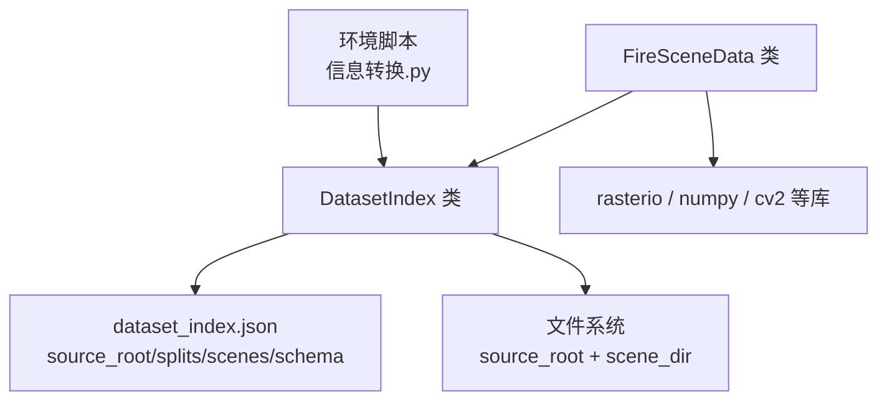
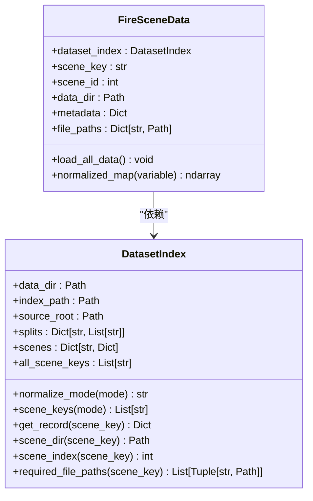
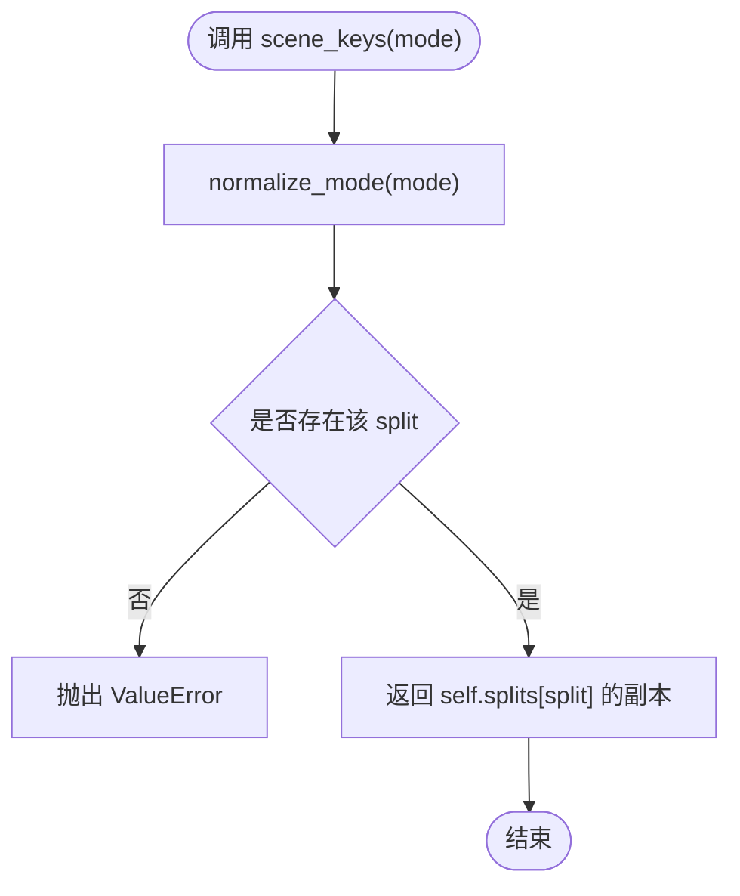
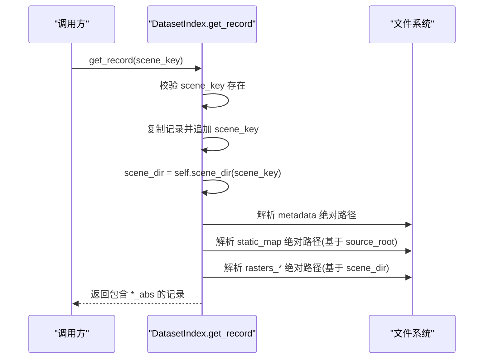
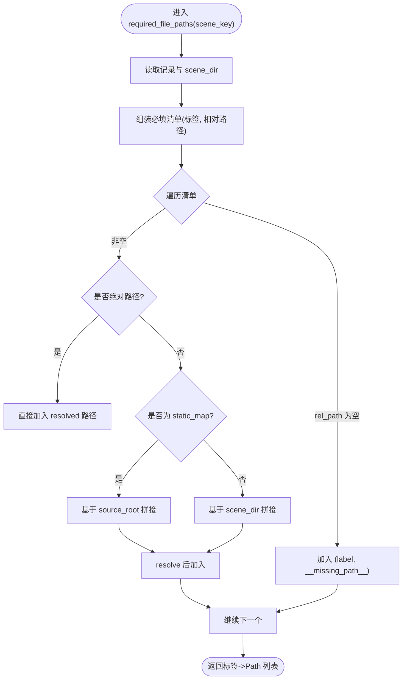
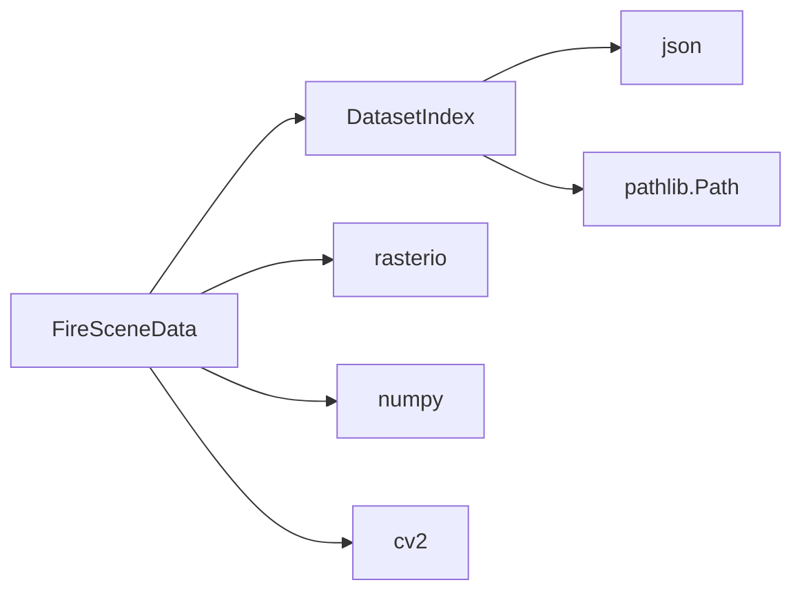

# 数据集索引管理

<cite>
**本文引用的文件**
- [信息转换.py](file://environment_variables/environment_variables/信息转换.py)
- [dataset_index.json](file://environment_variables/environment_variables/dataset/dataset_index.json)
</cite>

## 目录
1. [简介](#简介)
2. [项目结构](#项目结构)
3. [核心组件](#核心组件)
4. [架构总览](#架构总览)
5. [详细组件分析](#详细组件分析)
6. [依赖关系分析](#依赖关系分析)
7. [性能与复杂度](#性能与复杂度)
8. [故障排查指南](#故障排查指南)
9. [结论](#结论)
10. [附录：使用示例](#附录使用示例)

## 简介
本文件围绕 DatasetIndex 类及其数据源 dataset_index.json，系统化说明场景键值管理、模式别名映射、路径解析机制，以及关键方法 scene_keys()、get_record()、required_file_paths() 的行为与实现细节。文档同时提供面向使用者的操作示例，帮助快速进行场景管理与数据访问。

## 项目结构
- 代码入口与核心逻辑位于 environment_variables/environment_variables/信息转换.py，包含 DatasetIndex 与 FireSceneData 等类。
- 数据集索引文件位于 environment_variables/environment_variables/dataset/dataset_index.json，描述根目录、schema、分片（splits）、栅格字段名到相对路径的映射，以及每个场景的详细记录。

图表来源
- [信息转换.py:20-196](file://environment_variables/environment_variables/信息转换.py#L20-L196)
- [dataset_index.json:1-98](file://environment_variables/environment_variables/dataset/dataset_index.json#L1-L98)

章节来源
- [信息转换.py:20-196](file://environment_variables/environment_variables/信息转换.py#L20-L196)
- [dataset_index.json:1-98](file://environment_variables/environment_variables/dataset/dataset_index.json#L1-L98)

## 核心组件
- DatasetIndex：负责加载并缓存 dataset_index.json，维护 source_root、splits、scenes、all_scene_keys，并提供模式归一化、场景筛选、记录构建、路径解析与必填文件清单生成。
- FireSceneData：基于 DatasetIndex 提供的记录，完成具体场景的数据加载、校验与预处理（如栅格读取、风场推导、热场计算等）。

章节来源
- [信息转换.py:20-196](file://environment_variables/environment_variables/信息转换.py#L20-L196)
- [信息转换.py:219-391](file://environment_variables/environment_variables/信息转换.py#L219-L391)

## 架构总览
DatasetIndex 作为“索引层”，将 JSON 中的元数据转换为可查询的对象；FireSceneData 作为“数据层”，依据索引完成实际 I/O 与计算。二者通过 Path 对象与绝对路径进行解耦，屏蔽平台差异。

图表来源
- [信息转换.py:20-196](file://environment_variables/environment_variables/信息转换.py#L20-L196)
- [信息转换.py:219-391](file://environment_variables/environment_variables/信息转换.py#L219-L391)

## 详细组件分析

### dataset_index.json 结构与解析
- 顶层字段
  - version：索引版本
  - description：说明
  - source_root：数据根目录（可为相对路径，会被解析为绝对路径）
  - schema：定义路径基准、必需字段、必需栅格键集合
  - splits：按训练/验证/泛化/压力四组列出场景键列表
  - raster_files：栅格键到相对路径的默认映射（供 schema 参考）
  - scenes：每个场景的完整记录，包含 scene_key、split、scene_dir、static_map、metadata、rasters、vectors、inputs、reports 等

- 路径基准规则（schema.path_base）
  - scene_dir、static_map 以 source_root 为基准
  - metadata、rasters、vectors、inputs、reports 以 scene_dir 为基准

- 解析过程要点
  - 初始化时读取 index 文件，构造 splits、scenes 字典
  - 根据 splits 顺序拼接 all_scene_keys，用于 scene_index() 返回 1-based 序号
  - source_root 若为相对路径，则相对于 index 所在目录解析为绝对路径

章节来源
- [dataset_index.json:1-98](file://environment_variables/environment_variables/dataset/dataset_index.json#L1-L98)
- [信息转换.py:32-66](file://environment_variables/environment_variables/信息转换.py#L32-L66)

### 模式别名映射与场景筛选
- normalize_mode() 支持别名映射：train、validation、generalization、stress、test、eval 均被规范化为标准 split 名称
- scene_keys(mode) 根据标准化后的 split 返回对应场景键列表；若为空则抛出异常

图表来源
- [信息转换.py:80-94](file://environment_variables/environment_variables/信息转换.py#L80-L94)

章节来源
- [信息转换.py:23-30](file://environment_variables/environment_variables/信息转换.py#L23-L30)
- [信息转换.py:80-94](file://environment_variables/environment_variables/信息转换.py#L80-L94)

### get_record() 记录构建与路径解析
- 输入校验：scene_key 必须在 scenes 中，否则抛出 KeyError
- 构建流程
  - 复制原始记录，追加 scene_key、scene_dir_abs、scene_index
  - metadata_abs：若相对路径则以 scene_dir 为基准拼接并 resolve
  - static_map_abs：若存在且为相对路径则以 source_root 为基准拼接并 resolve
  - rasters_abs：遍历 rasters 子项，相对路径均以 scene_dir 为基准拼接并 resolve
- 输出：包含所有绝对路径与索引信息的字典，便于后续 I/O

图表来源
- [信息转换.py:96-121](file://environment_variables/environment_variables/信息转换.py#L96-L121)
- [信息转换.py:123-134](file://environment_variables/environment_variables/信息转换.py#L123-L134)

章节来源
- [信息转换.py:96-121](file://environment_variables/environment_variables/信息转换.py#L96-L121)
- [信息转换.py:123-134](file://environment_variables/environment_variables/信息转换.py#L123-L134)

### required_file_paths() 文件依赖检查
- 目的：返回一个标签到 Path 的列表，涵盖静态地图、栅格数据、矢量文件、输入文件与报告文件的预期位置
- 必检清单
  - metadata：默认 metadata.json
  - static_map：来自记录的 static_map（基于 source_root）
  - 栅格：intensity、length、time、speedRate、spread_direction、heat_per_unit_area、crown_fire（基于 scene_dir）
  - 矢量：ignition.shp、fire_perimeter.shp（基于 scene_dir）
  - 输入：weather_stream.wxs、fuel_moisture_dry.fms（基于 scene_dir）
  - 报告：fire_growth_report.csv、Run_log.txt（基于 scene_dir）
- 路径解析规则
  - 若 rel_path 为空，则用占位符 __missing_path__ 标记缺失
  - 若为绝对路径，直接使用
  - 若为相对路径：
    - static_map 基于 source_root
    - 其余基于 scene_dir
  - 最终全部 resolve 为绝对路径

图表来源
- [信息转换.py:136-196](file://environment_variables/environment_variables/信息转换.py#L136-L196)

章节来源
- [信息转换.py:136-196](file://environment_variables/environment_variables/信息转换.py#L136-L196)

### 场景键值管理与索引
- all_scene_keys：按 train、validation、generalization、stress 的顺序合并 splits，再补充未在 splits 中出现的 scenes 键
- scene_index(scene_key)：在 all_scene_keys 中查找并返回 1-based 序号；不存在返回 0

章节来源
- [信息转换.py:51-66](file://environment_variables/environment_variables/信息转换.py#L51-L66)
- [信息转换.py:130-134](file://environment_variables/environment_variables/信息转换.py#L130-L134)

## 依赖关系分析
- DatasetIndex 依赖 json、pathlib.Path 进行配置加载与路径处理
- FireSceneData 依赖 rasterio、numpy、cv2 等进行栅格与图像处理
- 两者通过绝对路径解耦，避免硬编码路径带来的跨平台问题

图表来源
- [信息转换.py:1-14](file://environment_variables/environment_variables/信息转换.py#L1-L14)
- [信息转换.py:219-391](file://environment_variables/environment_variables/信息转换.py#L219-L391)

章节来源
- [信息转换.py:1-14](file://environment_variables/environment_variables/信息转换.py#L1-L14)
- [信息转换.py:219-391](file://environment_variables/environment_variables/信息转换.py#L219-L391)

## 性能与复杂度
- 时间复杂度
  - scene_keys(mode)：O(1) 查表 + O(k) 返回列表拷贝（k 为该 split 的场景数）
  - get_record(scene_key)：O(1) 字典访问 + O(m) 遍历 rasters 子项（m 为栅格数量）
  - required_file_paths(scene_key)：O(n) 遍历 n 个必填项
  - scene_index(scene_key)：O(N) 线性搜索 N=all_scene_keys 长度
- 空间复杂度
  - 主要开销在于内存中缓存 splits、scenes、all_scene_keys 与 get_record 返回的字典副本
- 优化建议
  - 对频繁使用的 scene_index 可引入反向映射 dict(key->index) 将查找降至 O(1)
  - 对 large datasets 可考虑按需懒加载或分区缓存

章节来源
- [信息转换.py:80-94](file://environment_variables/environment_variables/信息转换.py#L80-L94)
- [信息转换.py:96-121](file://environment_variables/environment_variables/信息转换.py#L96-L121)
- [信息转换.py:130-134](file://environment_variables/environment_variables/信息转换.py#L130-L134)

## 故障排查指南
- 常见错误与定位
  - FileNotFoundError：dataset_index.json 未找到或 scene_dir 不存在
    - 检查 data_dir 与 index_name 参数是否正确
    - 确认 source_root 指向真实数据根目录
  - KeyError：scene_key 未知
    - 确认传入的 scene_key 存在于 scenes 中
  - ValueError：mode 不支持或 split 无场景
    - 使用 normalize_mode 支持的别名：train、validation、generalization、stress、test、eval
  - 文件缺失：required_file_paths 返回的路径不存在
    - 对照清单逐项检查静态地图、栅格、矢量、输入与报告文件
- 调试建议
  - 打印 get_record 返回的 *_abs 字段，核对绝对路径是否符合预期
  - 使用 required_file_paths 批量检查，提前发现缺失文件

章节来源
- [信息转换.py:32-49](file://environment_variables/environment_variables/信息转换.py#L32-L49)
- [信息转换.py:80-94](file://environment_variables/environment_variables/信息转换.py#L80-L94)
- [信息转换.py:96-121](file://environment_variables/environment_variables/信息转换.py#L96-L121)
- [信息转换.py:136-196](file://environment_variables/environment_variables/信息转换.py#L136-L196)

## 结论
DatasetIndex 提供了稳定、可扩展的数据集索引能力：通过 JSON 驱动的配置与严格的解析规则，实现了跨平台的场景管理与路径解析。配合 FireSceneData 的数据加载链路，能够高效地完成从索引到数据的端到端访问。建议在大规模数据下引入索引缓存与预校验流程，以提升鲁棒性与性能。

## 附录：使用示例
以下为典型用法步骤（不展示具体代码内容，仅给出路径引用）：
- 初始化索引
  - 参考：[信息转换.py:32-49](file://environment_variables/environment_variables/信息转换.py#L32-L49)
- 获取某模式的场景键列表
  - 参考：[信息转换.py:80-94](file://environment_variables/environment_variables/信息转换.py#L80-L94)
- 构建场景记录（含绝对路径）
  - 参考：[信息转换.py:96-121](file://environment_variables/environment_variables/信息转换.py#L96-L121)
- 检查必填文件是否存在
  - 参考：[信息转换.py:136-196](file://environment_variables/environment_variables/信息转换.py#L136-L196)
- 基于记录加载场景数据
  - 参考：[信息转换.py:219-391](file://environment_variables/environment_variables/信息转换.py#L219-L391)