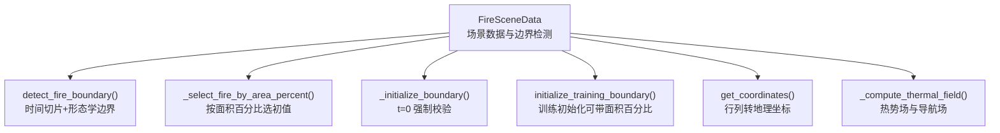
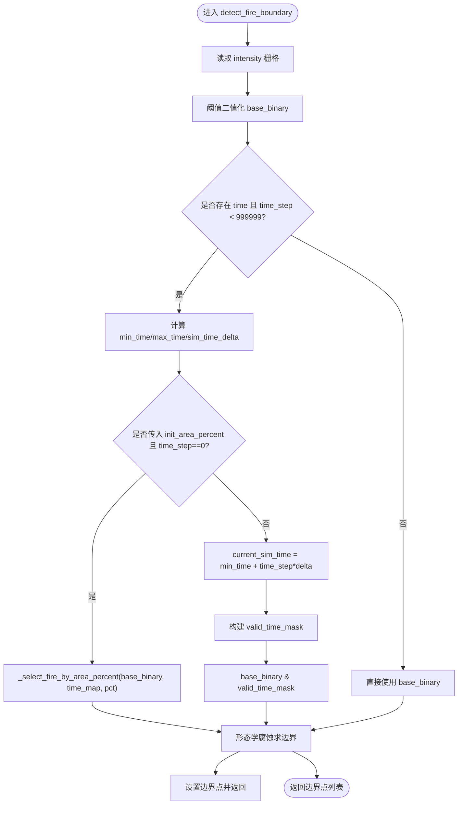
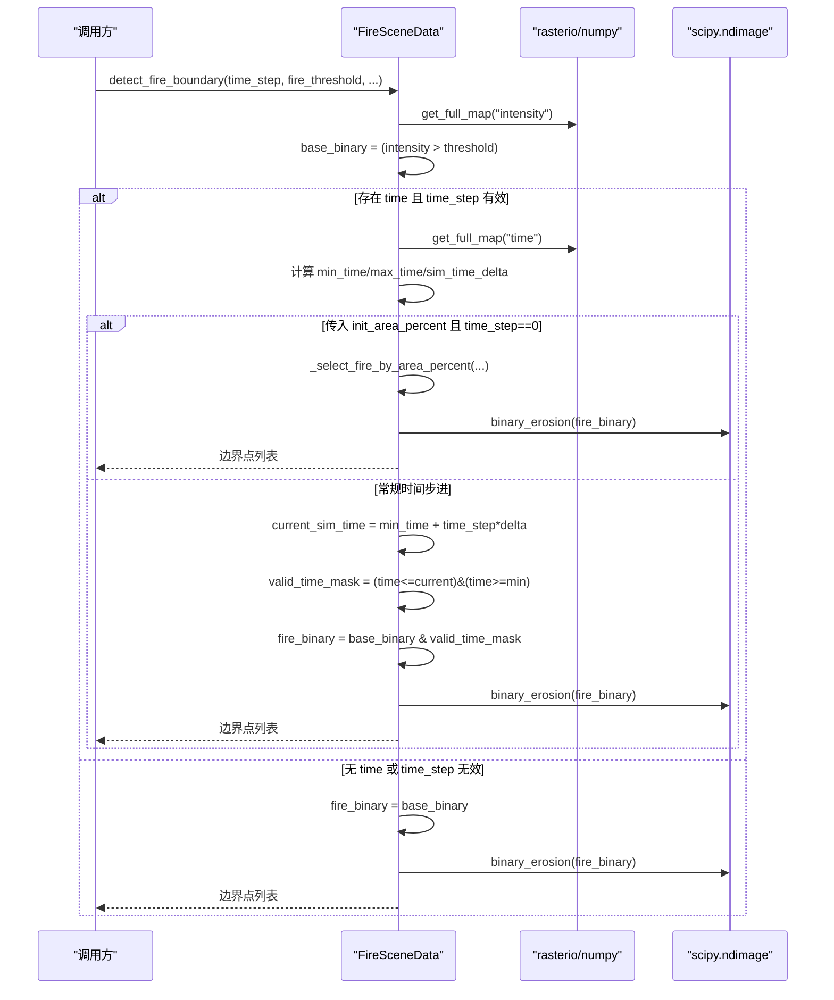
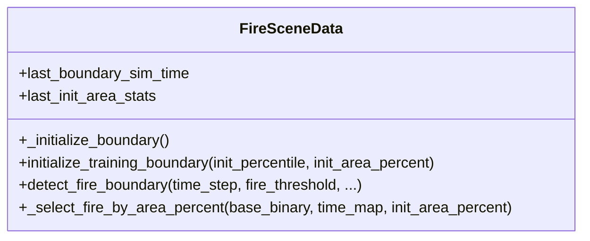
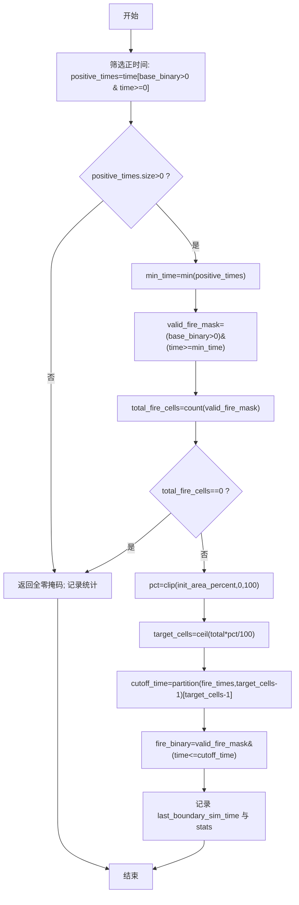
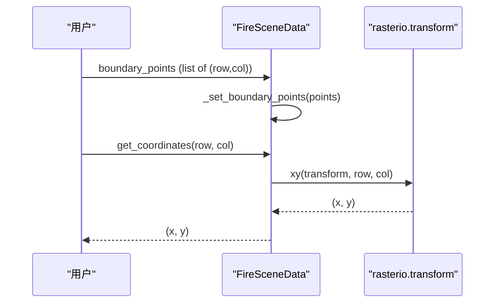
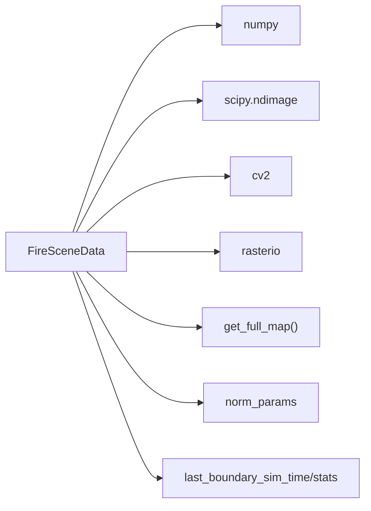

# 火场边界检测

<cite>
**本文引用的文件**   
- [信息转换.py](file://environment_variables/environment_variables/信息转换.py)
</cite>

## 目录
1. [简介](#简介)
2. [项目结构](#项目结构)
3. [核心组件](#核心组件)
4. [架构总览](#架构总览)
5. [详细组件分析](#详细组件分析)
6. [依赖关系分析](#依赖关系分析)
7. [性能与复杂度](#性能与复杂度)
8. [参数调优指南](#参数调优指南)
9. [常见问题与排障](#常见问题与排障)
10. [示例：不同时间步长边界检测与可视化](#示例不同时间步长边界检测与可视化)
11. [结论](#结论)

## 简介
本技术文档聚焦于“火场边界检测”子系统，围绕以下目标展开：
- 深入解释 detect_fire_boundary() 的实现原理，包括时间序列分析与边界点提取算法。
- 说明 _initialize_boundary() 与 initialize_training_boundary() 的区别与应用场景。
- 解析 _select_fire_by_area_percent() 如何基于面积百分比选择初始火场范围。
- 描述边界点的坐标转换与格式化处理过程。
- 提供参数调优指南与常见问题解决方案。
- 给出具体代码示例路径，展示如何进行不同时间步长的边界检测与可视化。

## 项目结构
本仓库包含大量仿真场景数据与训练输出，但边界检测的核心逻辑集中在环境数据类中。关键实现位于 FireSceneData 及其相关方法中，负责加载栅格、归一化、热场重建、边界检测与辅助诊断等。

图表来源
- [信息转换.py:821-887](file://environment_variables/environment_variables/信息转换.py#L821-L887)
- [信息转换.py:723-757](file://environment_variables/environment_variables/信息转换.py#L723-L757)
- [信息转换.py:684-696](file://environment_variables/environment_variables/信息转换.py#L684-L696)
- [信息转换.py:698-721](file://environment_variables/environment_variables/信息转换.py#L698-L721)
- [信息转换.py:1256-1260](file://environment_variables/environment_variables/信息转换.py#L1256-L1260)
- [信息转换.py:759-819](file://environment_variables/environment_variables/信息转换.py#L759-L819)

章节来源
- [信息转换.py:219-322](file://environment_variables/environment_variables/信息转换.py#L219-L322)
- [信息转换.py:684-721](file://environment_variables/environment_variables/信息转换.py#L684-L721)
- [信息转换.py:821-887](file://environment_variables/environment_variables/信息转换.py#L821-L887)
- [信息转换.py:1256-1260](file://environment_variables/environment_variables/信息转换.py#L1256-L1260)

## 核心组件
- FireSceneData：封装单场景数据加载、归一化、热场计算、边界检测、局部邻域特征、风场影响、边界闭合度检查等。
- DatasetIndex：管理数据集索引与场景元数据，用于定位栅格、矢量与输入文件。
- SceneManager：跨训练/验证/泛化/压力测试的批量场景管理与缓存。

本节重点围绕 FireSceneData 中的边界检测相关方法与属性进行说明。

章节来源
- [信息转换.py:219-322](file://environment_variables/environment_variables/信息转换.py#L219-L322)
- [信息转换.py:1278-1280](file://environment_variables/environment_variables/信息转换.py#L1278-L1280)
- [信息转换.py:1282-1326](file://environment_variables/environment_variables/信息转换.py#L1282-L1326)

## 架构总览
下图展示了从场景数据到边界点输出的整体流程，以及关键分支（面积百分比初始化、时间步长推进、形态学边界提取）。

图表来源
- [信息转换.py:821-887](file://environment_variables/environment_variables/信息转换.py#L821-L887)
- [信息转换.py:723-757](file://environment_variables/environment_variables/信息转换.py#L723-L757)

## 详细组件分析

### detect_fire_boundary() 实现原理
- 输入参数
  - time_step：时间步序号，用于在时间序列上推进当前模拟时刻。
  - fire_threshold：强度阈值，默认来自归一化参数。
  - init_percentile / init_area_percent：当为 None 时等价；若传入 area_percent 且 time_step==0，则走面积百分比初始化分支。
  - start_sim_time：可选起始模拟时间，配合 time_step 线性推进。
- 处理步骤
  1) 获取 intensity 栅格并进行阈值二值化得到 base_binary。
  2) 若存在 time 栅格且 time_step 有效：
     - 计算 min_time、max_time 与 sim_time_delta（基于时间范围按比例分配 800 个步长）。
     - 若传入 init_area_percent 且 time_step==0：调用 _select_fire_by_area_percent() 直接生成初始火场掩码，随后进行形态学边界提取并返回。
     - 否则根据 current_sim_time 构造 valid_time_mask，将 base_binary 与时间掩码相与得到 fire_binary。
  3) 若无 time 或 time_step 无效：直接使用 base_binary。
  4) 对 fire_binary 执行形态学腐蚀，边界 = fire_binary - eroded，取所有边界像素坐标作为结果。
  5) 更新内部状态：fire_binary_map、last_boundary_sim_time、boundary_points 缓存。
- 输出
  - 边界点列表，每个点为 (row, col) 整数坐标。

图表来源
- [信息转换.py:821-887](file://environment_variables/environment_variables/信息转换.py#L821-L887)
- [信息转换.py:723-757](file://environment_variables/environment_variables/信息转换.py#L723-L757)

章节来源
- [信息转换.py:821-887](file://environment_variables/environment_variables/信息转换.py#L821-L887)

### _initialize_boundary() 与 initialize_training_boundary() 的区别与应用场景
- _initialize_boundary()
  - 作用：在对象构造后自动调用，固定使用 time_step=0 检测 t=0 边界。
  - 约束：若 t=0 边界为空，标记场景无效并抛出异常，阻止后续训练。
  - 适用：通用场景加载时的强一致性校验，确保训练起点有有效边界。
- initialize_training_boundary()
  - 作用：显式初始化训练边界，支持两种模式：
    - 不传面积百分比：等价于 t=0 边界检测。
    - 传入 init_area_percent：通过 _select_fire_by_area_percent() 选择初始火场范围，并记录 last_boundary_sim_time 作为训练起始模拟时间。
  - 适用：需要以一定面积比例作为训练起点的场景，例如课程学习或稳定性控制。

图表来源
- [信息转换.py:684-696](file://environment_variables/environment_variables/信息转换.py#L684-L696)
- [信息转换.py:698-721](file://environment_variables/environment_variables/信息转换.py#L698-L721)
- [信息转换.py:821-887](file://environment_variables/environment_variables/信息转换.py#L821-L887)
- [信息转换.py:723-757](file://environment_variables/environment_variables/信息转换.py#L723-L757)

章节来源
- [信息转换.py:684-696](file://environment_variables/environment_variables/信息转换.py#L684-L696)
- [信息转换.py:698-721](file://environment_variables/environment_variables/信息转换.py#L698-L721)

### _select_fire_by_area_percent() 面积百分比选择算法
- 目的：在 t=0 附近选择一个合适的初始火场范围，使得初始火场面积占整个火场历史面积的指定百分比。
- 步骤
  1) 统计 base_binary 为正的时间值集合，确定 min_time。
  2) 构建 valid_fire_mask = (base_binary>0) & (time_map >= min_time)。
  3) 计算 total_fire_cells = valid_fire_mask 的非零计数。
  4) 若 total_fire_cells == 0：返回全零掩码，并记录统计信息。
  5) 将 init_area_percent 裁剪至 [0,100]，计算 target_cells = ceil(total * pct/100)。
  6) 对 valid_fire_mask 内的 time_map 值做分区排序，取第 target_cells 小的时间作为 cutoff_time。
  7) 生成 fire_binary = valid_fire_mask & (time_map <= cutoff_time)。
  8) 记录 last_boundary_sim_time=cutoff_time 与 last_init_area_stats（含实际百分比等）。
- 复杂度
  - 主要开销在于分区排序 O(N log N) 或近似 O(N)，N 为有效火场像素数。
- 输出
  - 初始火场二值掩码，供后续形态学边界提取。

图表来源
- [信息转换.py:723-757](file://environment_variables/environment_variables/信息转换.py#L723-L757)

章节来源
- [信息转换.py:723-757](file://environment_variables/environment_variables/信息转换.py#L723-L757)

### 边界点坐标转换与格式化
- 内部存储格式
  - 边界点统一保存为 (row, col) 整数元组列表，便于网格操作与可视化。
- 坐标转换
  - 通过 get_coordinates(row, col) 将行列坐标转换为地理坐标 (x, y)，使用 rasterio.transform.xy 依据 transform 矩阵完成转换。
- 格式化
  - _set_boundary_points() 对输入点进行类型转换与清理，确保为整型元组。

图表来源
- [信息转换.py:340-347](file://environment_variables/environment_variables/信息转换.py#L340-L347)
- [信息转换.py:1256-1260](file://environment_variables/environment_variables/信息转换.py#L1256-L1260)

章节来源
- [信息转换.py:340-347](file://environment_variables/environment_variables/信息转换.py#L340-L347)
- [信息转换.py:1256-1260](file://environment_variables/environment_variables/信息转换.py#L1256-L1260)

## 依赖关系分析
- 外部库
  - numpy：数组运算、分区排序、计数。
  - scipy.ndimage：形态学腐蚀。
  - cv2：图像缩放（热场重建中使用）。
  - rasterio：栅格读写与坐标变换。
- 内部依赖
  - get_full_map()：统一访问 intensity/time 等栅格。
  - norm_params：提供 fire_threshold 等归一化参数。
  - last_boundary_sim_time / last_init_area_stats：记录边界检测与面积百分比选择的中间状态。

图表来源
- [信息转换.py:821-887](file://environment_variables/environment_variables/信息转换.py#L821-L887)
- [信息转换.py:1267-1275](file://environment_variables/environment_variables/信息转换.py#L1267-L1275)
- [信息转换.py:294-306](file://environment_variables/environment_variables/信息转换.py#L294-L306)

章节来源
- [信息转换.py:821-887](file://environment_variables/environment_variables/信息转换.py#L821-L887)
- [信息转换.py:1267-1275](file://environment_variables/environment_variables/信息转换.py#L1267-L1275)
- [信息转换.py:294-306](file://environment_variables/environment_variables/信息转换.py#L294-L306)

## 性能与复杂度
- 时间复杂度
  - detect_fire_boundary(): O(HW) 用于阈值与形态学操作；若走面积百分比分支，额外 O(N log N) 或近似 O(N) 的分区排序，N 为有效火场像素数。
  - _select_fire_by_area_percent(): O(N log N) 或近似 O(N)。
- 空间复杂度
  - 主要占用为 intermediate masks（base_binary、valid_time_mask、fire_binary），均为 H×W 布尔/整型数组。
- 优化建议
  - 对大分辨率地图，先下采样再阈值与形态学，最后上采样回原分辨率（热场重建已采用类似策略）。
  - 合理设置 fire_threshold 以减少噪声区域，降低 N。
  - 复用 last_boundary_sim_time 与缓存的 fire_binary_map，避免重复计算。

[本节为一般性指导，无需特定文件引用]

## 参数调优指南
- fire_threshold
  - 作用：决定哪些像素被视为“火”。过高会漏掉边缘，过低会引入噪声。
  - 建议：从 norm_params["fire_threshold"] 默认值出发，结合 severity_map 与 active_front 可视化微调。
- time_step 与 sim_time_delta
  - 作用：控制时间推进粒度。sim_time_delta 由时间范围按比例分配到 800 步。
  - 建议：若需更平滑轨迹，可增加时间步数或调整 delta；注意边界点数量随时间变化。
- init_area_percent
  - 作用：在 t=0 附近选择初始火场面积占比。
  - 建议：小比例（如 1%-5%）适合稳定起步；较大比例可能使初始边界过于扩张，影响训练收敛。
- start_sim_time
  - 作用：自定义起始模拟时间，配合 time_step 线性推进。
  - 建议：用于回放或对齐外部时间线。

章节来源
- [信息转换.py:821-887](file://environment_variables/environment_variables/信息转换.py#L821-L887)
- [信息转换.py:723-757](file://environment_variables/environment_variables/信息转换.py#L723-L757)
- [信息转换.py:294-306](file://environment_variables/environment_variables/信息转换.py#L294-L306)

## 常见问题与排障
- 问题：t=0 边界为空
  - 现象：_initialize_boundary() 抛出 InvalidSceneError。
  - 原因：threshold 过高或 intensity 缺失。
  - 解决：降低 fire_threshold，检查 intensity 栅格是否存在与形状一致。
- 问题：init_area_percent 导致初始边界为空
  - 现象：initialize_training_boundary() 抛出 InvalidSceneError。
  - 原因：所选面积比例过小或时间分布稀疏。
  - 解决：增大 init_area_percent，或检查 time 栅格与正时间集合。
- 问题：边界点过多或过少
  - 现象：active_front 或边界可视化异常。
  - 原因：形态学腐蚀核大小与阈值不合适。
  - 解决：调整 fire_threshold 与时间窗口；必要时在后处理阶段进行连通域过滤。
- 问题：坐标转换结果为空
  - 现象：get_coordinates() 返回 None。
  - 原因：transform 未正确加载。
  - 解决：确认静态地图加载成功，transform/crs 非空。

章节来源
- [信息转换.py:684-696](file://environment_variables/environment_variables/信息转换.py#L684-L696)
- [信息转换.py:698-721](file://environment_variables/environment_variables/信息转换.py#L698-L721)
- [信息转换.py:1256-1260](file://environment_variables/environment_variables/信息转换.py#L1256-L1260)

## 示例：不同时间步长边界检测与可视化
以下为可直接参考的代码片段路径，展示如何调用接口进行边界检测与坐标转换：

- 基础边界检测（t=0）
  - 参考路径：[信息转换.py:821-887](file://environment_variables/environment_variables/信息转换.py#L821-L887)
- 基于面积百分比的初始边界
  - 参考路径：[信息转换.py:698-721](file://environment_variables/environment_variables/信息转换.py#L698-L721)
  - 参考路径：[信息转换.py:723-757](file://environment_variables/environment_variables/信息转换.py#L723-L757)
- 时间步进边界检测
  - 参考路径：[信息转换.py:821-887](file://environment_variables/environment_variables/信息转换.py#L821-L887)
- 坐标转换与格式化
  - 参考路径：[信息转换.py:340-347](file://environment_variables/environment_variables/信息转换.py#L340-L347)
  - 参考路径：[信息转换.py:1256-1260](file://environment_variables/environment_variables/信息转换.py#L1256-L1260)
- 热力场与活跃前沿（辅助可视化）
  - 参考路径：[信息转换.py:759-819](file://environment_variables/environment_variables/信息转换.py#L759-L819)
  - 参考路径：[信息转换.py:898-901](file://environment_variables/environment_variables/信息转换.py#L898-L901)

示例要点（以路径代替代码内容）：
- 使用 detect_fire_boundary(time_step=0) 获取 t=0 边界点。
- 使用 initialize_training_boundary(init_area_percent=5.0) 获得初始边界并记录 last_boundary_sim_time。
- 循环 time_step 调用 detect_fire_boundary(time_step=i) 获取各时刻边界，并用 get_coordinates(row, col) 转为地理坐标以便绘图。
- 使用 active_front(time_step=i) 获取活跃前沿掩码，叠加到地图上观察边界演化。

章节来源
- [信息转换.py:821-887](file://environment_variables/environment_variables/信息转换.py#L821-L887)
- [信息转换.py:698-721](file://environment_variables/environment_variables/信息转换.py#L698-L721)
- [信息转换.py:723-757](file://environment_variables/environment_variables/信息转换.py#L723-L757)
- [信息转换.py:340-347](file://environment_variables/environment_variables/信息转换.py#L340-L347)
- [信息转换.py:1256-1260](file://environment_variables/environment_variables/信息转换.py#L1256-L1260)
- [信息转换.py:759-819](file://environment_variables/environment_variables/信息转换.py#L759-L819)
- [信息转换.py:898-901](file://environment_variables/environment_variables/信息转换.py#L898-L901)

## 结论
本系统通过“阈值二值化 + 时间掩码 + 形态学边界提取”的组合，实现了稳健的火场边界检测。_select_fire_by_area_percent() 提供了可控的初始火场选择机制，配合 _initialize_boundary() 与 initialize_training_boundary() 可在训练前保证边界有效性。坐标转换与格式化确保了边界点在网格与地理坐标系间无缝切换。通过合理调参与可视化验证，可实现对不同时间步长的边界检测与动态追踪。