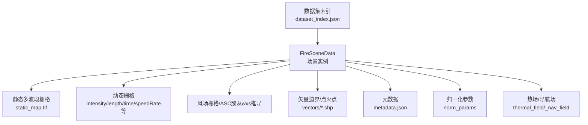
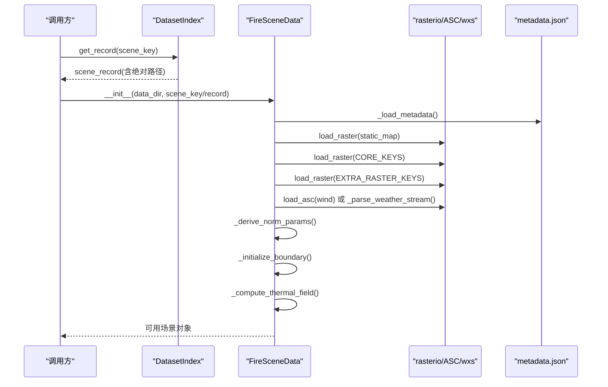
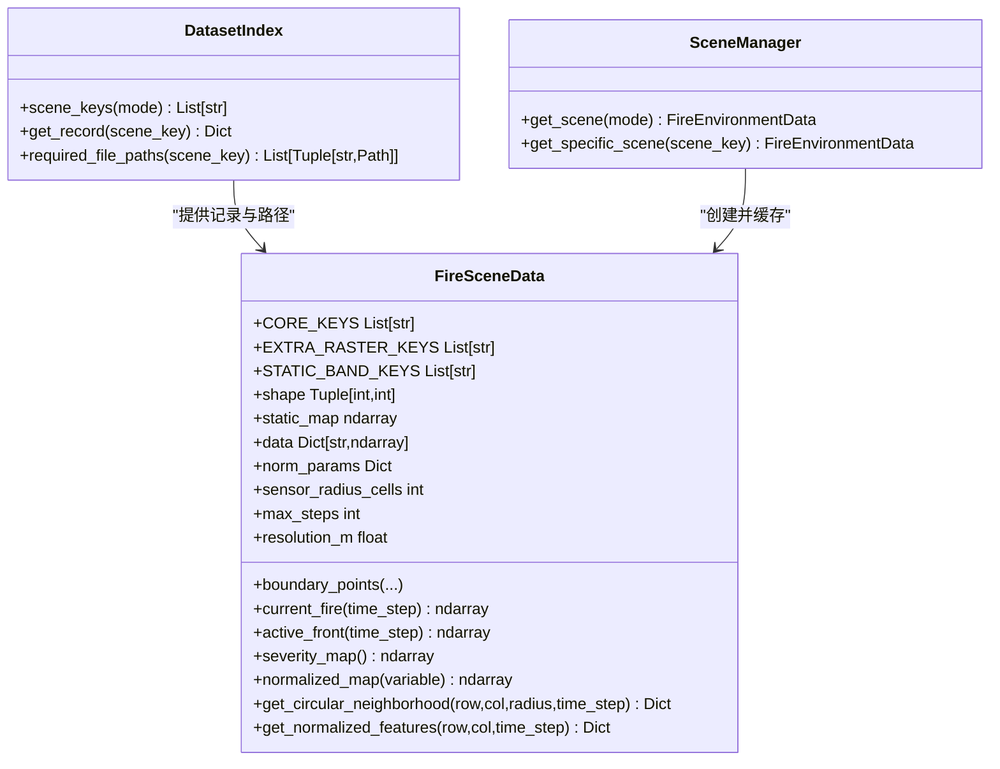
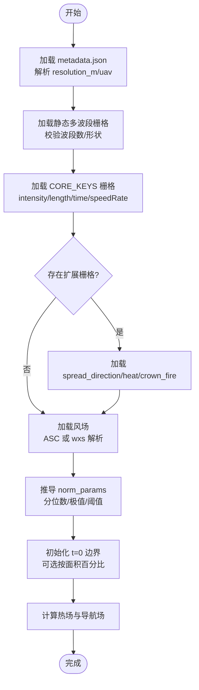
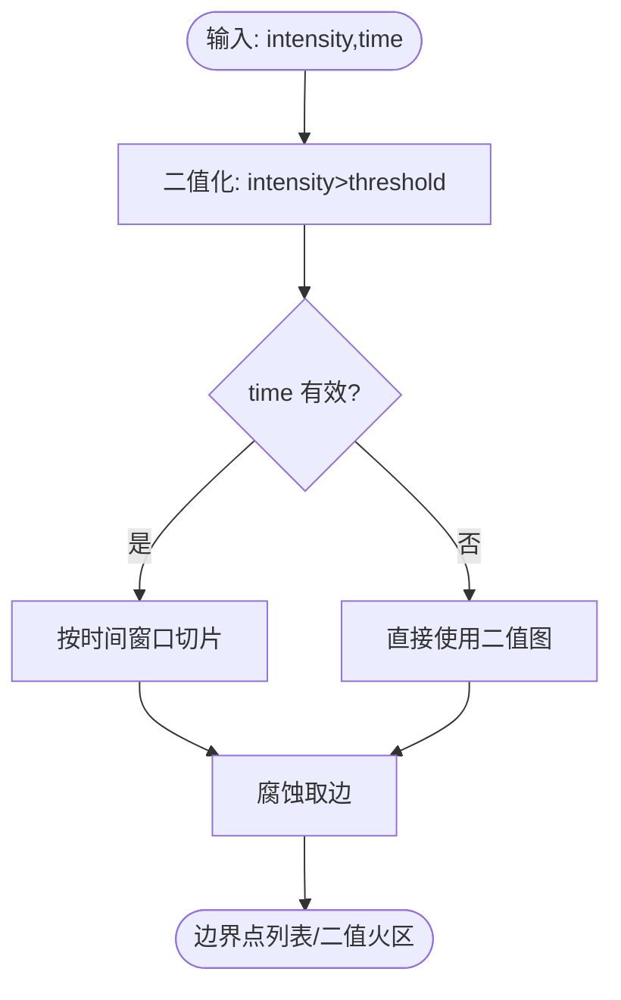
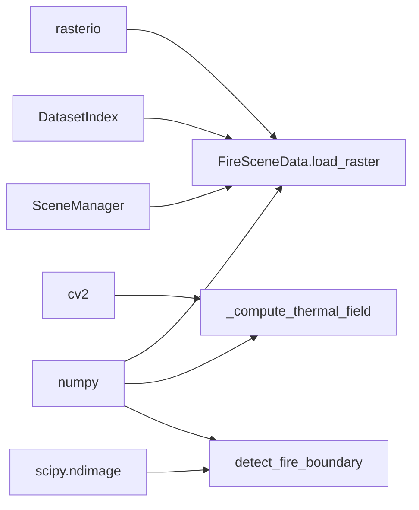

# 火灾场景数据加载

<cite>
**本文引用的文件**   
- [信息转换.py](file://environment_variables/environment_variables/信息转换.py)
- [test_fire_scene_data.py](file://environment_variables/environment_variables/test_fire_scene_data.py)
- [metadata.json](file://map/Generalization/6/scene1/metadata.json)
</cite>

## 目录
1. [简介](#简介)
2. [项目结构](#项目结构)
3. [核心组件](#核心组件)
4. [架构总览](#架构总览)
5. [详细组件分析](#详细组件分析)
6. [依赖关系分析](#依赖关系分析)
7. [性能考虑](#性能考虑)
8. [故障排查指南](#故障排查指南)
9. [结论](#结论)
10. [附录：使用示例与最佳实践](#附录使用示例与最佳实践)

## 简介
本文件围绕 FireSceneData 类，系统化说明 FARSITE 火灾模拟数据的加载与处理流程。内容涵盖静态地图、动态栅格与矢量数据的读取；核心键值（intensity、length、time、speedRate）与扩展键值的区别与用途；metadata.json 解析与 uav 配置处理；传感器半径计算、最大步数设置与环境参数初始化；数据验证规则与形状一致性检查；并提供具体代码路径示例，展示如何加载和使用火灾场景数据。

## 项目结构
仓库中与数据加载相关的关键位置如下：
- 数据模型与加载逻辑：environment_variables/environment_variables/信息转换.py
- 单元测试用例：environment_variables/environment_variables/test_fire_scene_data.py
- 场景元数据样例：map/Generalization/6/scene1/metadata.json

图表来源
- [信息转换.py:219-323](file://environment_variables/environment_variables/信息转换.py#L219-L323)
- [信息转换.py:370-390](file://environment_variables/environment_variables/信息转换.py#L370-L390)
- [信息转换.py:638-682](file://environment_variables/environment_variables/信息转换.py#L638-L682)
- [metadata.json:1-174](file://map/Generalization/6/scene1/metadata.json#L1-L174)

章节来源
- [信息转换.py:219-323](file://environment_variables/environment_variables/信息转换.py#L219-L323)
- [信息转换.py:370-390](file://environment_variables/environment_variables/信息转换.py#L370-L390)
- [信息转换.py:638-682](file://environment_variables/environment_variables/信息转换.py#L638-L682)
- [metadata.json:1-174](file://map/Generalization/6/scene1/metadata.json#L1-L174)

## 核心组件
- DatasetIndex：基于 dataset/dataset_index.json 的索引管理，负责场景键到绝对路径的解析、必需文件清单构建、源根目录定位。
- FireSceneData：单场景数据容器，负责加载静态地图、动态栅格、风场、元数据，计算归一化参数、构造火边界、生成热场与导航场，提供观测与局部邻域访问接口。
- SceneManager：按 split 组织场景集合，支持缓存复用场景实例，避免重复读盘与重复计算。

关键常量与键集
- CORE_KEYS = ["intensity", "length", "time", "speedRate"]
- EXTRA_RASTER_KEYS = ["spread_direction", "heat_per_unit_area", "crown_fire"]
- STATIC_BAND_KEYS = ["elevation","slope","aspect","fuel_model","canopy_cover","canopy_height","canopy_base_height","canopy_bulk_density"]

章节来源
- [信息转换.py:219-246](file://environment_variables/environment_variables/信息转换.py#L219-L246)
- [信息转换.py:20-196](file://environment_variables/environment_variables/信息转换.py#L20-L196)
- [信息转换.py:1282-1326](file://environment_variables/environment_variables/信息转换.py#L1282-L1326)

## 架构总览
下图展示了从索引到场景实例的数据流与主要处理阶段。

图表来源
- [信息转换.py:248-323](file://environment_variables/environment_variables/信息转换.py#L248-L323)
- [信息转换.py:349-390](file://environment_variables/environment_variables/信息转换.py#L349-L390)
- [信息转换.py:392-424](file://environment_variables/environment_variables/信息转换.py#L392-L424)
- [信息转换.py:426-490](file://environment_variables/environment_variables/信息转换.py#L426-L490)
- [信息转换.py:559-614](file://environment_variables/environment_variables/信息转换.py#L559-L614)
- [信息转换.py:638-682](file://environment_variables/environment_variables/信息转换.py#L638-L682)
- [信息转换.py:684-722](file://environment_variables/environment_variables/信息转换.py#L684-L722)
- [信息转换.py:759-820](file://environment_variables/environment_variables/信息转换.py#L759-L820)

## 详细组件分析

### FireSceneData 类概览
- 职责：封装单个 FARSITE 场景的所有数据与派生量，提供标准化访问方法。
- 重要属性：
  - shape/static_map/static_bands：静态地形与多波段栅格
  - data：所有栅格数组字典（包含核心与可选扩展键）
  - norm_params：每场景派生的归一化参数
  - boundary_points/fire_binary_map：t=0 或指定时间步的火边界与二值掩码
  - thermal_field/_nav_field：热势场与对数压缩导航场
  - sensor_radius_cells/max_steps/resolution_m：UAV 感知与仿真步长

图表来源
- [信息转换.py:20-196](file://environment_variables/environment_variables/信息转换.py#L20-L196)
- [信息转换.py:219-323](file://environment_variables/environment_variables/信息转换.py#L219-L323)
- [信息转换.py:1282-1326](file://environment_variables/environment_variables/信息转换.py#L1282-L1326)

章节来源
- [信息转换.py:219-323](file://environment_variables/environment_variables/信息转换.py#L219-L323)
- [信息转换.py:1282-1326](file://environment_variables/environment_variables/信息转换.py#L1282-L1326)

### 数据加载与处理流程
- 元数据解析：读取 metadata.json，提取 resolution_m、uav.sensor_radius_m、uav.max_steps 等。
- 静态地图加载：读取多波段静态栅格，校验波段数量与顺序，填充 static_bands 与 data[elevation/slope/aspect/fuel...]。
- 动态栅格加载：强制加载 CORE_KEYS，可选加载 EXTRA_RASTER_KEYS；统一进行 nodata/NaN 清理与非负裁剪。
- 风场处理：优先读取 wind/wdir.asc 与 wind/wspd.asc；否则从 inputs/weather_stream.wxs 解析平均风速与风向，或回退至 metadata.wind 字段。
- 归一化参数推导：基于各栅格的正样本分位数与统计极值，生成 intensity_max/length_max/speedRate_max/... 等。
- 火边界初始化：基于 intensity > fire_threshold 的二值图，结合 time 通道选择 t=0 或按面积百分比截断，得到边界点序列。
- 热场与导航场：在火区内以 intensity/intensity_ref 做鲁棒归一化，下采样+高斯模糊后上采样，再按 p99 参考值归一化得到 thermal_field，并对数压缩得到 _nav_field。

图表来源
- [信息转换.py:349-390](file://environment_variables/environment_variables/信息转换.py#L349-L390)
- [信息转换.py:392-424](file://environment_variables/environment_variables/信息转换.py#L392-L424)
- [信息转换.py:426-490](file://environment_variables/environment_variables/信息转换.py#L426-L490)
- [信息转换.py:559-614](file://environment_variables/environment_variables/信息转换.py#L559-L614)
- [信息转换.py:638-682](file://environment_variables/environment_variables/信息转换.py#L638-L682)
- [信息转换.py:684-722](file://environment_variables/environment_variables/信息转换.py#L684-L722)
- [信息转换.py:759-820](file://environment_variables/environment_variables/信息转换.py#L759-L820)

章节来源
- [信息转换.py:349-390](file://environment_variables/environment_variables/信息转换.py#L349-L390)
- [信息转换.py:392-424](file://environment_variables/environment_variables/信息转换.py#L392-L424)
- [信息转换.py:426-490](file://environment_variables/environment_variables/信息转换.py#L426-L490)
- [信息转换.py:559-614](file://environment_variables/environment_variables/信息转换.py#L559-L614)
- [信息转换.py:638-682](file://environment_variables/environment_variables/信息转换.py#L638-L682)
- [信息转换.py:684-722](file://environment_variables/environment_variables/信息转换.py#L684-L722)
- [信息转换.py:759-820](file://environment_variables/environment_variables/信息转换.py#L759-L820)

### 核心键值与扩展键值
- 核心键值（CORE_KEYS）
  - intensity：火线强度栅格，用于判定火区与严重度
  - length：火焰长度栅格
  - time：到达时间栅格，用于时间切片与边界演化
  - speedRate：蔓延速率栅格
- 扩展键值（EXTRA_RASTER_KEYS）
  - spread_direction：蔓延方向
  - heat_per_unit_area：单位面积热量
  - crown_fire：树冠火活动
- 用途差异
  - 核心键为训练/评估必需，缺失将直接报错
  - 扩展键为可选增强特征，若存在则参与严重度与热场计算

章节来源
- [信息转换.py:222-231](file://environment_variables/environment_variables/信息转换.py#L222-L231)
- [信息转换.py:638-682](file://environment_variables/environment_variables/信息转换.py#L638-L682)

### metadata.json 解析与 UAV 配置
- 关键字段
  - resolution_m：像素分辨率（米），用于将传感器半径换算为网格单元半径
  - uav.sensor_radius_m：无人机传感器半径（米）
  - uav.max_steps：最大仿真步数
- 处理逻辑
  - 通过 _load_metadata 读取 metadata.json
  - 根据 resolution_m 与 sensor_radius_m 计算 sensor_radius_cells = ceil(sensor_radius_m / resolution_m)
  - max_steps 直接从 uav.max_steps 获取

章节来源
- [信息转换.py:349-356](file://environment_variables/environment_variables/信息转换.py#L349-L356)
- [信息转换.py:274-284](file://environment_variables/environment_variables/信息转换.py#L274-L284)
- [metadata.json:136-143](file://map/Generalization/6/scene1/metadata.json#L136-L143)

### 传感器半径计算与最大步数设置
- 传感器半径（单元格）
  - 公式：ceil(sensor_radius_m / resolution_m)
  - 当 resolution_m <= 0 时返回 0
- 最大步数
  - 直接使用 uav.max_steps
- 环境默认行为
  - 测试覆盖表明：当 use_metadata_uav_params=True 时，环境会采用 scene.sensor_radius_cells 与 scene.max_steps 作为默认

章节来源
- [信息转换.py:276-284](file://environment_variables/environment_variables/信息转换.py#L276-L284)
- [test_fire_scene_data.py:221-242](file://environment_variables/environment_variables/test_fire_scene_data.py#L221-L242)

### 环境参数初始化过程
- 初始化顺序
  - 解析 metadata → 构建文件路径 → 加载静态地图 → 加载核心栅格 → 加载可选栅格 → 加载风场 → 推导 norm_params → 初始化边界 → 计算热场
- 输出日志
  - 打印场景 key、shape、已加载栅格数量
  - 打印 norm_params 摘要（如 intensity_max、length_max、speedRate_max 等）

章节来源
- [信息转换.py:638-682](file://environment_variables/environment_variables/信息转换.py#L638-L682)
- [信息转换.py:604-614](file://environment_variables/environment_variables/信息转换.py#L604-L614)

### 数据验证规则与形状一致性检查
- 静态地图波段校验
  - 要求波段数等于 STATIC_BAND_KEYS 的长度，否则抛出运行时错误
- 栅格形状一致性
  - 每个动态栅格必须与静态地图 shape 一致，不一致时抛出运行时错误，并附带文件名提示
- 风场形状一致性
  - 风场速度/方向栅格需与 shape 一致，否则报错
- 边界有效性
  - t=0 边界为空时标记场景无效并抛出 InvalidSceneError
- 单元测试覆盖
  - 覆盖形状不匹配的错误消息包含文件名
  - 覆盖 normalized_map 输出范围在 [0,1]
  - 覆盖 norm_params 包含必要键

章节来源
- [信息转换.py:501-532](file://environment_variables/environment_variables/信息转换.py#L501-L532)
- [信息转换.py:670-678](file://environment_variables/environment_variables/信息转换.py#L670-L678)
- [信息转换.py:684-693](file://environment_variables/environment_variables/信息转换.py#L684-L693)
- [test_fire_scene_data.py:244-257](file://environment_variables/environment_variables/test_fire_scene_data.py#L244-L257)
- [test_fire_scene_data.py:67-109](file://environment_variables/environment_variables/test_fire_scene_data.py#L67-L109)

### 边界检测与时间切片
- 基础二值化：intensity > fire_threshold
- 时间切片：利用 time 栅格与当前 sim_time 筛选 ≤ current_sim_time 的像元
- 面积百分比截断：按 init_area_percent 选择前若干最早燃烧像元，得到初始边界
- 形态学边缘：对二值火区执行腐蚀后差值得到 active front

图表来源
- [信息转换.py:820-887](file://environment_variables/environment_variables/信息转换.py#L820-L887)

章节来源
- [信息转换.py:820-887](file://environment_variables/environment_variables/信息转换.py#L820-L887)

### 热场与导航场计算
- 语义重建链路
  - source = fire_mask * clip(intensity / intensity_ref, 0, 1)
  - downsample + gaussian_filter(sigma=15)
  - upsample 回全分辨率
  - 参考值 ref = p99(blur[blur>eps])
  - potential = clip(blur/ref, 0, 1)
  - nav = log1p(alpha*potential)/log1p(alpha)，alpha=20
- 健康诊断
  - 提供 diagnose_thermal_health 统计饱和比例、非零比例、高值区零梯度比例等指标

章节来源
- [信息转换.py:759-820](file://environment_variables/environment_variables/信息转换.py#L759-L820)
- [信息转换.py:972-1012](file://environment_variables/environment_variables/信息转换.py#L972-L1012)

## 依赖关系分析
- 外部库
  - rasterio：读取 GeoTIFF 栅格
  - cv2：图像缩放（下采样/上采样）
  - scipy.ndimage：形态学操作（binary_erosion）
  - numpy：数值计算
- 内部模块
  - DatasetIndex：路径与索引管理
  - SceneManager：场景缓存与分发

图表来源
- [信息转换.py:392-424](file://environment_variables/environment_variables/信息转换.py#L392-L424)
- [信息转换.py:759-820](file://environment_variables/environment_variables/信息转换.py#L759-L820)
- [信息转换.py:820-887](file://environment_variables/environment_variables/信息转换.py#L820-L887)
- [信息转换.py:20-196](file://environment_variables/environment_variables/信息转换.py#L20-L196)
- [信息转换.py:1282-1326](file://environment_variables/environment_variables/信息转换.py#L1282-L1326)

章节来源
- [信息转换.py:392-424](file://environment_variables/environment_variables/信息转换.py#L392-L424)
- [信息转换.py:759-820](file://environment_variables/environment_variables/信息转换.py#L759-L820)
- [信息转换.py:820-887](file://environment_variables/environment_variables/信息转换.py#L820-L887)
- [信息转换.py:20-196](file://environment_variables/environment_variables/信息转换.py#L20-L196)
- [信息转换.py:1282-1326](file://environment_variables/environment_variables/信息转换.py#L1282-L1326)

## 性能考虑
- 栅格读取与清洗：rasterio.read().astype(np.float32) 配合 nan_to_num 与负值裁剪，减少后续异常分支开销
- 热场计算：先下采样再高斯模糊，最后上采样，显著降低计算量
- 归一化参数：基于分位数与极值一次性推导，避免多次扫描
- 场景缓存：SceneManager 跨实例共享缓存，避免重复 IO 与重复计算

[本节为通用指导，无需特定文件引用]

## 故障排查指南
- 常见错误与定位
  - 静态地图波段数不匹配：检查多波段栅格是否包含 STATIC_BAND_KEYS 对应波段
  - 栅格形状不一致：确保所有动态栅格与静态地图 shape 一致
  - 风场形状不一致：确认 wind ASC 或从 wxs 推导的风场与 shape 一致
  - t=0 边界为空：检查 intensity 阈值与 time 通道，必要时调整 fire_threshold 或 init_area_percent
- 调试建议
  - 使用 validate_scene_boundaries 批量预检场景
  - 使用 diagnose_thermal_health 检查热场健康状态
  - 查看 print 日志中的 norm_params 摘要与“Scene loaded”信息

章节来源
- [信息转换.py:501-532](file://environment_variables/environment_variables/信息转换.py#L501-L532)
- [信息转换.py:670-678](file://environment_variables/environment_variables/信息转换.py#L670-L678)
- [信息转换.py:684-693](file://environment_variables/environment_variables/信息转换.py#L684-L693)
- [信息转换.py:1329-1416](file://environment_variables/environment_variables/信息转换.py#L1329-L1416)
- [信息转换.py:972-1012](file://environment_variables/environment_variables/信息转换.py#L972-L1012)

## 结论
FireSceneData 提供了完整的 FARSITE 场景数据加载与预处理管线，涵盖静态地图、动态栅格、风场与元数据解析，并通过严格的形状与波段校验保证数据一致性。其派生的归一化参数、热场与导航场为下游环境与算法提供稳定、可解释的特征表示。配合 SceneManager 的场景缓存机制，可在大规模训练与评估中显著提升效率。

[本节为总结性内容，无需特定文件引用]

## 附录：使用示例与最佳实践
以下示例仅给出代码片段路径，便于快速定位实现与用法。

- 通过 DatasetIndex 与 FireSceneData 加载场景
  - 参考：[信息转换.py:248-323](file://environment_variables/environment_variables/信息转换.py#L248-L323)
- 读取静态地图与动态栅格
  - 参考：[信息转换.py:501-532](file://environment_variables/environment_variables/信息转换.py#L501-L532)、[信息转换.py:638-682](file://environment_variables/environment_variables/信息转换.py#L638-L682)
- 解析 metadata.json 与 UAV 配置
  - 参考：[信息转换.py:349-356](file://environment_variables/environment_variables/信息转换.py#L349-L356)、[metadata.json:136-143](file://map/Generalization/6/scene1/metadata.json#L136-L143)
- 计算传感器半径与最大步数
  - 参考：[信息转换.py:276-284](file://environment_variables/environment_variables/信息转换.py#L276-L284)
- 获取归一化栅格与严重度图
  - 参考：[信息转换.py:616-637](file://environment_variables/environment_variables/信息转换.py#L616-L637)、[信息转换.py:903-918](file://environment_variables/environment_variables/信息转换.py#L903-L918)
- 获取当前火区与活跃前沿
  - 参考：[信息转换.py:892-901](file://environment_variables/environment_variables/信息转换.py#L892-L901)
- 获取圆形邻域与局部特征
  - 参考：[信息转换.py:1014-1068](file://environment_variables/environment_variables/信息转换.py#L1014-L1068)、[信息转换.py:1187-1234](file://environment_variables/environment_variables/信息转换.py#L1187-L1234)
- 单元测试验证
  - 参考：[test_fire_scene_data.py:32-109](file://environment_variables/environment_variables/test_fire_scene_data.py#L32-L109)、[test_fire_scene_data.py:244-257](file://environment_variables/environment_variables/test_fire_scene_data.py#L244-L257)

章节来源
- [信息转换.py:248-323](file://environment_variables/environment_variables/信息转换.py#L248-L323)
- [信息转换.py:501-532](file://environment_variables/environment_variables/信息转换.py#L501-L532)
- [信息转换.py:638-682](file://environment_variables/environment_variables/信息转换.py#L638-L682)
- [信息转换.py:349-356](file://environment_variables/environment_variables/信息转换.py#L349-L356)
- [metadata.json:136-143](file://map/Generalization/6/scene1/metadata.json#L136-L143)
- [信息转换.py:276-284](file://environment_variables/environment_variables/信息转换.py#L276-L284)
- [信息转换.py:616-637](file://environment_variables/environment_variables/信息转换.py#L616-L637)
- [信息转换.py:903-918](file://environment_variables/environment_variables/信息转换.py#L903-L918)
- [信息转换.py:892-901](file://environment_variables/environment_variables/信息转换.py#L892-L901)
- [信息转换.py:1014-1068](file://environment_variables/environment_variables/信息转换.py#L1014-L1068)
- [信息转换.py:1187-1234](file://environment_variables/environment_variables/信息转换.py#L1187-L1234)
- [test_fire_scene_data.py:32-109](file://environment_variables/environment_variables/test_fire_scene_data.py#L32-L109)
- [test_fire_scene_data.py:244-257](file://environment_variables/environment_variables/test_fire_scene_data.py#L244-L257)