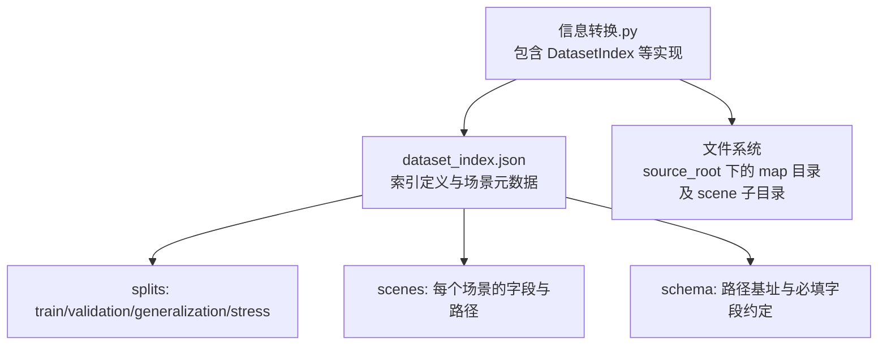
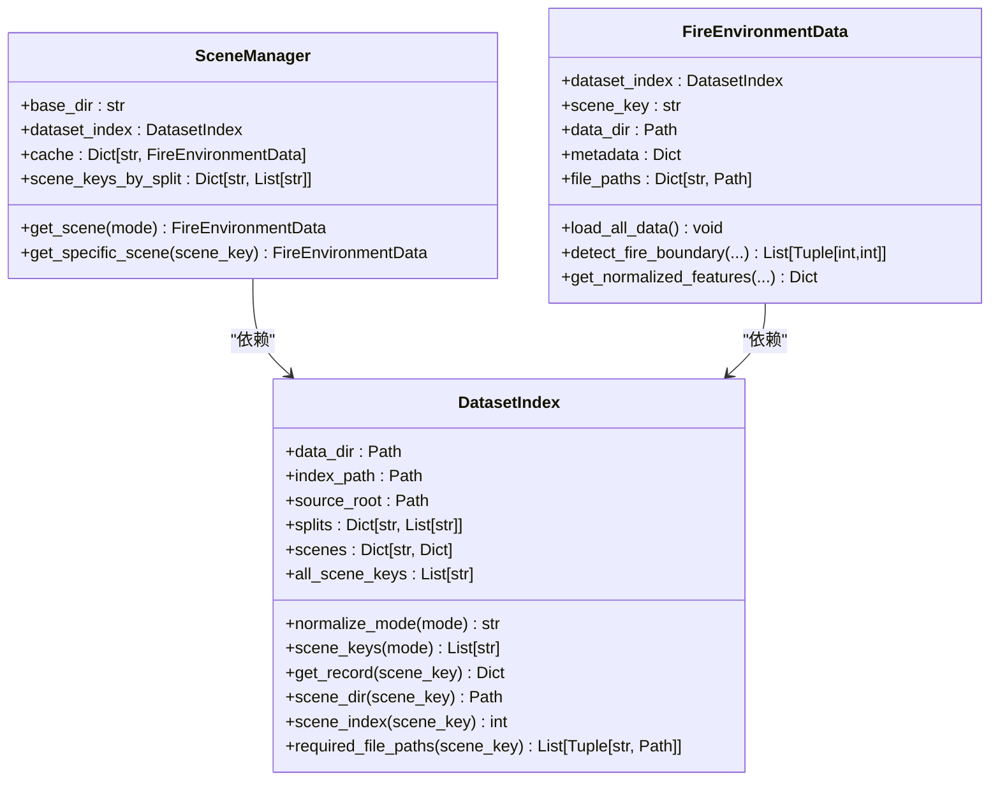
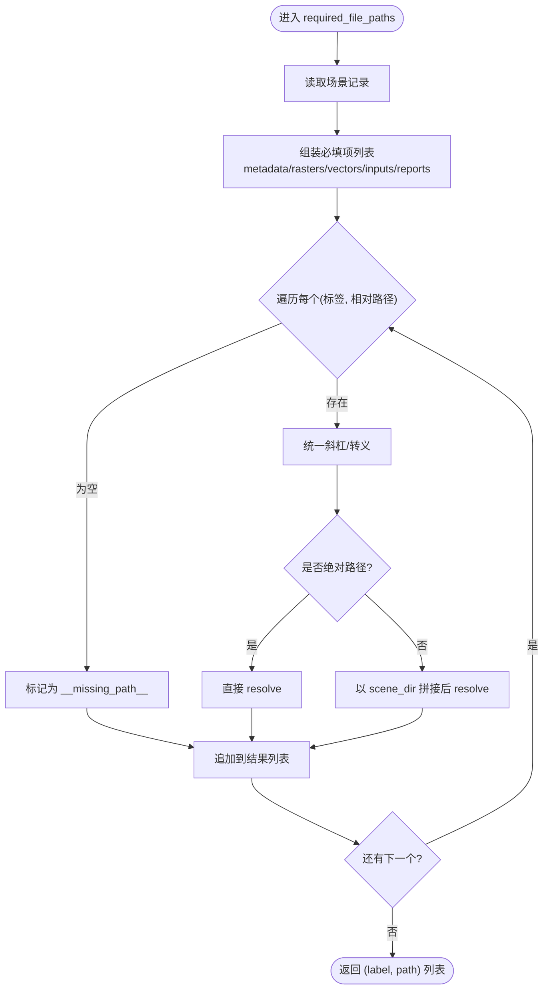
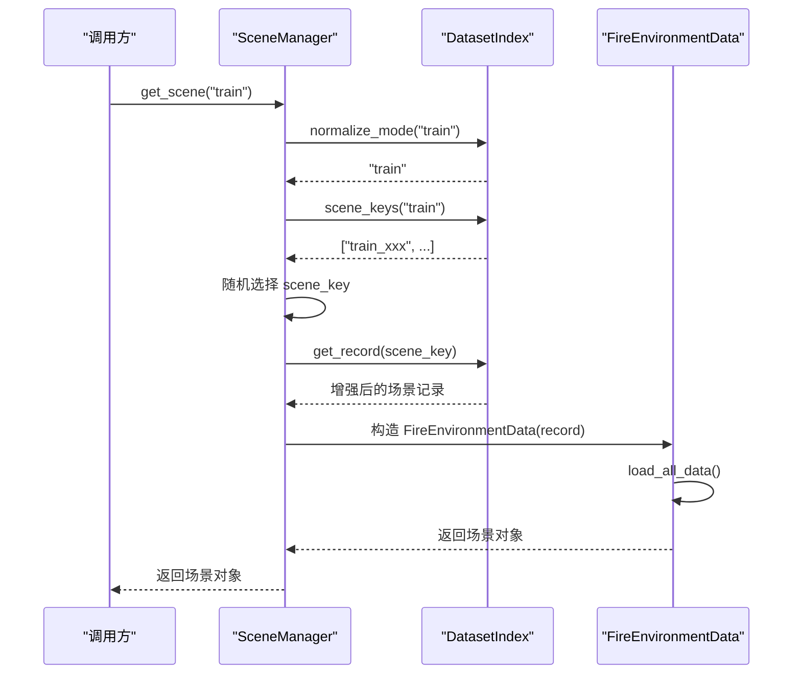
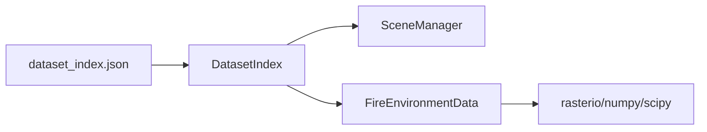

# 数据集索引管理

<cite>
**本文引用的文件**   
- [信息转换.py](file://environment_variables/environment_variables/outputs/lr_comparison_20260611_093948/训练结果/训练源码/信息转换.py)
- [dataset_index.json](file://environment_variables/environment_variables/dataset/dataset_index.json)
</cite>

## 目录
1. [简介](#简介)
2. [项目结构](#项目结构)
3. [核心组件](#核心组件)
4. [架构总览](#架构总览)
5. [详细组件分析](#详细组件分析)
6. [依赖关系分析](#依赖关系分析)
7. [性能与复杂度](#性能与复杂度)
8. [故障排查指南](#故障排查指南)
9. [结论](#结论)
10. [附录：使用示例路径](#附录使用示例路径)

## 简介
本技术文档围绕 DatasetIndex 类及其配套的数据集索引体系展开，重点说明以下方面：
- dataset_index.json 的解析与验证流程
- 场景模式（train、validation、generalization、stress）的别名映射与规范化处理
- 场景目录路径解析逻辑（相对路径到绝对路径的转换规则）
- required_file_paths 方法如何构建完整的路径依赖图，包括静态地图、栅格数据、矢量文件和输入文件的校验
- 基于 DatasetIndex 的场景查询与遍历方式
- 错误处理与异常策略

## 项目结构
仓库中与数据集索引相关的关键位置如下：
- 索引定义文件：environment_variables/environment_variables/dataset/dataset_index.json
- 实现代码：environment_variables/environment_variables/outputs/lr_comparison_20260611_093948/训练结果/训练源码/信息转换.py

图表来源
- [信息转换.py:18-174](file://environment_variables/environment_variables/outputs/lr_comparison_20260611_093948/训练结果/训练源码/信息转换.py#L18-L174)
- [dataset_index.json:1-1600](file://environment_variables/environment_variables/dataset/dataset_index.json#L1-L1600)

章节来源
- [信息转换.py:18-174](file://environment_variables/environment_variables/outputs/lr_comparison_20260611_093948/训练结果/训练源码/信息转换.py#L18-L174)
- [dataset_index.json:1-1600](file://environment_variables/environment_variables/dataset/dataset_index.json#L1-L1600)

## 核心组件
- DatasetIndex：负责加载并缓存 dataset_index.json，提供场景键列表、记录获取、路径解析、必需文件路径生成等能力。
- SceneManager：基于 DatasetIndex 对场景进行按模式随机选择与缓存。
- FireEnvironmentData：在 DatasetIndex 基础上加载具体场景的栅格、矢量与报告文件，并进行边界检测、SDF 与热场计算等。

章节来源
- [信息转换.py:18-174](file://environment_variables/environment_variables/outputs/lr_comparison_20260611_093948/训练结果/训练源码/信息转换.py#L18-L174)
- [信息转换.py:899-939](file://environment_variables/environment_variables/outputs/lr_comparison_20260611_093948/训练结果/训练源码/信息转换.py#L899-L939)
- [信息转换.py:177-897](file://environment_variables/environment_variables/outputs/lr_comparison_20260611_093948/训练结果/训练源码/信息转换.py#L177-L897)

## 架构总览
DatasetIndex 作为“索引层”，将 JSON 描述与磁盘上的实际文件解耦；SceneManager 作为“访问层”，屏蔽随机采样与缓存细节；FireEnvironmentData 作为“数据层”，完成具体数据的读取与预处理。

图表来源
- [信息转换.py:18-174](file://environment_variables/environment_variables/outputs/lr_comparison_20260611_093948/训练结果/训练源码/信息转换.py#L18-L174)
- [信息转换.py:899-939](file://environment_variables/environment_variables/outputs/lr_comparison_20260611_093948/训练结果/训练源码/信息转换.py#L899-L939)
- [信息转换.py:177-897](file://environment_variables/environment_variables/outputs/lr_comparison_20260611_093948/训练结果/训练源码/信息转换.py#L177-L897)

## 详细组件分析

### DatasetIndex 类
职责与关键点：
- 初始化时定位 data_dir 与 index_path，若不存在则抛出 FileNotFoundError。
- 解析 source_root，支持相对路径（相对于 index_path 所在目录）与绝对路径两种形式。
- 加载 splits 与 scenes，并维护 all_scene_keys（优先来自 splits，未出现的额外场景也加入）。
- normalize_mode 将用户传入的模式名标准化为内部标准模式，支持别名映射。
- scene_keys 返回指定模式的场景键列表，若无配置则抛出 ValueError。
- get_record 返回带 scene_dir_abs 与 scene_index 的增强记录。
- scene_dir 将 scene_dir 解析为绝对路径（优先使用 source_root）。
- required_file_paths 构建场景所需的全部文件路径清单，用于预检与后续加载。

#### 模式别名映射与规范化
- 内置 MODE_ALIASES 将 test、eval 映射到 generalization，其他保持原样。
- normalize_mode 会先小写化再查表，未知模式抛出 ValueError。

章节来源
- [信息转换.py:21-28](file://environment_variables/environment_variables/outputs/lr_comparison_20260611_093948/训练结果/训练源码/信息转换.py#L21-L28)
- [信息转换.py:78-92](file://environment_variables/environment_variables/outputs/lr_comparison_20260611_093948/训练结果/训练源码/信息转换.py#L78-L92)

#### 场景目录路径解析
- _resolve_data_dir 优先使用绝对路径；否则尝试当前工作目录拼接；最后回退到脚本所在目录拼接。
- scene_dir 中，若 scene_dir 非绝对路径，则以 source_root 为根拼接后 resolve。
- source_root 若为相对路径，则基于 index_path.parent 拼接并 resolve。

章节来源
- [信息转换.py:30-47](file://environment_variables/environment_variables/outputs/lr_comparison_20260611_093948/训练结果/训练源码/信息转换.py#L30-L47)
- [信息转换.py:65-76](file://environment_variables/environment_variables/outputs/lr_comparison_20260611_093948/训练结果/训练源码/信息转换.py#L65-L76)
- [信息转换.py:105-110](file://environment_variables/environment_variables/outputs/lr_comparison_20260611_093948/训练结果/训练源码/信息转换.py#L105-L110)

#### required_file_paths 路径依赖图构建
该方法按固定顺序收集以下类别的文件路径（标签→相对路径），并以 scene_dir 为基准解析为绝对路径：
- metadata：默认 metadata.json
- 栅格数据（rasters）：intensity、length、time、speedRate、spread_direction、heat_per_unit_area、crown_fire
- 矢量文件（vectors）：ignition、fire_perimeter
- 输入文件（inputs）：weather_stream、fuel_moisture
- 报告文件（reports）：fire_growth_report、run_log

对于缺失字段的情况，会以占位符 __missing_path__ 表示，便于后续检查发现缺失。

图表来源
- [信息转换.py:118-174](file://environment_variables/environment_variables/outputs/lr_comparison_20260611_093948/训练结果/训练源码/信息转换.py#L118-L174)

章节来源
- [信息转换.py:118-174](file://environment_variables/environment_variables/outputs/lr_comparison_20260611_093948/训练结果/训练源码/信息转换.py#L118-L174)

### dataset_index.json 结构与解析
顶层关键字段：
- version、description：版本与描述
- source_root：数据根目录（可为绝对或相对路径）
- schema：路径基址约定与必填字段、栅格字段约定
- splits：四个模式对应的场景键集合
- raster_files：栅格键到相对路径的映射（供参考）
- scenes：每个场景的详细元数据与路径

解析过程要点：
- 构造函数读取 JSON 后，提取 splits 与 scenes，并构建 all_scene_keys。
- source_root 若为相对路径，则基于 index_path.parent 拼接并 resolve。
- schema 定义了路径基址与必填字段，但 DatasetIndex 的实现主要依赖 splits 与 scenes 的实际内容。

章节来源
- [dataset_index.json:1-1600](file://environment_variables/environment_variables/dataset/dataset_index.json#L1-L1600)
- [信息转换.py:30-64](file://environment_variables/environment_variables/outputs/lr_comparison_20260611_093948/训练结果/训练源码/信息转换.py#L30-L64)

### SceneManager 与场景遍历
- 通过 DatasetIndex 获取各 split 的场景键列表，支持外部覆盖。
- get_scene 根据模式随机选择一个场景键，并调用 get_specific_scene 创建或从缓存中取出 FireEnvironmentData。
- 构造 FireEnvironmentData 时会再次依据 DatasetIndex 提供的 record 进行数据加载。

章节来源
- [信息转换.py:899-939](file://environment_variables/environment_variables/outputs/lr_comparison_20260611_093948/训练结果/训练源码/信息转换.py#L899-L939)
- [信息转换.py:177-240](file://environment_variables/environment_variables/outputs/lr_comparison_20260611_093948/训练结果/训练源码/信息转换.py#L177-L240)

### 关键流程时序（场景获取与预检）

图表来源
- [信息转换.py:899-939](file://environment_variables/environment_variables/outputs/lr_comparison_20260611_093948/训练结果/训练源码/信息转换.py#L899-L939)
- [信息转换.py:177-240](file://environment_variables/environment_variables/outputs/lr_comparison_20260611_093948/训练结果/训练源码/信息转换.py#L177-L240)

## 依赖关系分析
- DatasetIndex 仅依赖标准库与 pathlib/json，不耦合具体数据格式。
- SceneManager 依赖 DatasetIndex 与 numpy（用于随机选择）。
- FireEnvironmentData 依赖 rasterio、numpy、scipy，用于栅格读写与图像处理。
- dataset_index.json 作为外部契约，约束了场景路径与字段结构。

图表来源
- [信息转换.py:18-174](file://environment_variables/environment_variables/outputs/lr_comparison_20260611_093948/训练结果/训练源码/信息转换.py#L18-L174)
- [信息转换.py:899-939](file://environment_variables/environment_variables/outputs/lr_comparison_20260611_093948/训练结果/训练源码/信息转换.py#L899-L939)
- [信息转换.py:177-897](file://environment_variables/environment_variables/outputs/lr_comparison_20260611_093948/训练结果/训练源码/信息转换.py#L177-L897)

## 性能与复杂度
- 初始化阶段：JSON 解析 O(N)，N 为 scenes 数量；内存占用与场景数线性相关。
- scene_keys：O(1) 字典查找。
- get_record：O(1) 字典查找与浅拷贝。
- required_file_paths：O(K)，K 为必填项数量（常数级，约十多项）。
- 整体遍历：若对全量场景执行预检，时间复杂度 O(S*K + S*L)，S 为场景总数，L 为数据加载开销（由 FireEnvironmentData 决定）。

[本节为通用性能讨论，无需特定文件引用]

## 故障排查指南
常见异常与处理策略：
- FileNotFoundError：当 dataset_index.json 不存在或 scene_dir 不存在时抛出。建议在初始化前确认 data_dir 与 source_root 指向正确。
- ValueError：当传入未知 mode 或某 split 无场景配置时抛出。请检查 normalize_mode 的别名映射与 splits 配置。
- KeyError：当 scene_key 不在 scenes 中时抛出。请核对场景键是否存在于 splits 或 scenes。
- RuntimeError：在 FireEnvironmentData 中，当栅格形状不一致或缺少必要数据时抛出。需确保同一场景内所有栅格具有相同 shape。
- InvalidSceneError：当 t=0 火边界为空或初始化面积百分比导致边界为空时抛出。可调整 init_percentile/init_area_percent 或检查 time/intensity 数据。

建议的预检流程：
- 使用 validate_scene_boundaries 对所有场景进行文件完整性与边界有效性检查，快速定位问题场景。

章节来源
- [信息转换.py:30-47](file://environment_variables/environment_variables/outputs/lr_comparison_20260611_093948/训练结果/训练源码/信息转换.py#L30-L47)
- [信息转换.py:78-92](file://environment_variables/environment_variables/outputs/lr_comparison_20260611_093948/训练结果/训练源码/信息转换.py#L78-L92)
- [信息转换.py:94-103](file://environment_variables/environment_variables/outputs/lr_comparison_20260611_093948/训练结果/训练源码/信息转换.py#L94-L103)
- [信息转换.py:206-240](file://environment_variables/environment_variables/outputs/lr_comparison_20260611_093948/训练结果/训练源码/信息转换.py#L206-L240)
- [信息转换.py:438-475](file://environment_variables/environment_variables/outputs/lr_comparison_20260611_093948/训练结果/训练源码/信息转换.py#L438-L475)
- [信息转换.py:942-1029](file://environment_variables/environment_variables/outputs/lr_comparison_20260611_093948/训练结果/训练源码/信息转换.py#L942-L1029)

## 结论
DatasetIndex 提供了稳定、可扩展的数据集索引能力，通过 JSON 驱动的路径与元数据管理，结合严格的模式别名与路径解析机制，使得多场景、多模态数据的组织与访问变得清晰可靠。配合 SceneManager 与 FireEnvironmentData，可实现从索引到数据的高效流水线。推荐在生产环境中启用 validate_scene_boundaries 进行预检，以确保训练与评估过程的稳定性。

[本节为总结性内容，无需特定文件引用]

## 附录：使用示例路径
以下为常用操作与对应代码片段路径（不包含具体代码内容）：
- 初始化索引并获取训练场景键列表
  - [信息转换.py:30-92](file://environment_variables/environment_variables/outputs/lr_comparison_20260611_093948/训练结果/训练源码/信息转换.py#L30-L92)
- 获取某个场景的增强记录（含绝对路径与索引号）
  - [信息转换.py:94-103](file://environment_variables/environment_variables/outputs/lr_comparison_20260611_093948/训练结果/训练源码/信息转换.py#L94-L103)
- 构建场景必需文件路径清单（用于预检）
  - [信息转换.py:118-174](file://environment_variables/environment_variables/outputs/lr_comparison_20260611_093948/训练结果/训练源码/信息转换.py#L118-L174)
- 通过 SceneManager 随机获取场景对象
  - [信息转换.py:899-939](file://environment_variables/environment_variables/outputs/lr_comparison_20260611_093948/训练结果/训练源码/信息转换.py#L899-L939)
- 批量预检场景边界与文件完整性
  - [信息转换.py:942-1029](file://environment_variables/environment_variables/outputs/lr_comparison_20260611_093948/训练结果/训练源码/信息转换.py#L942-L1029)