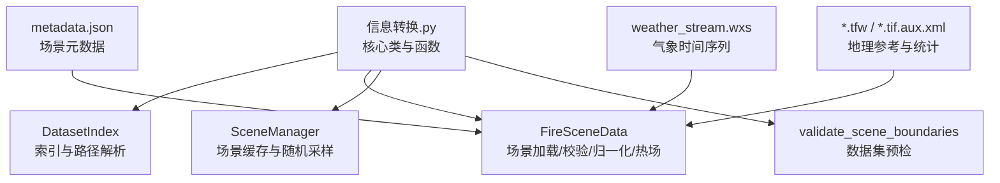
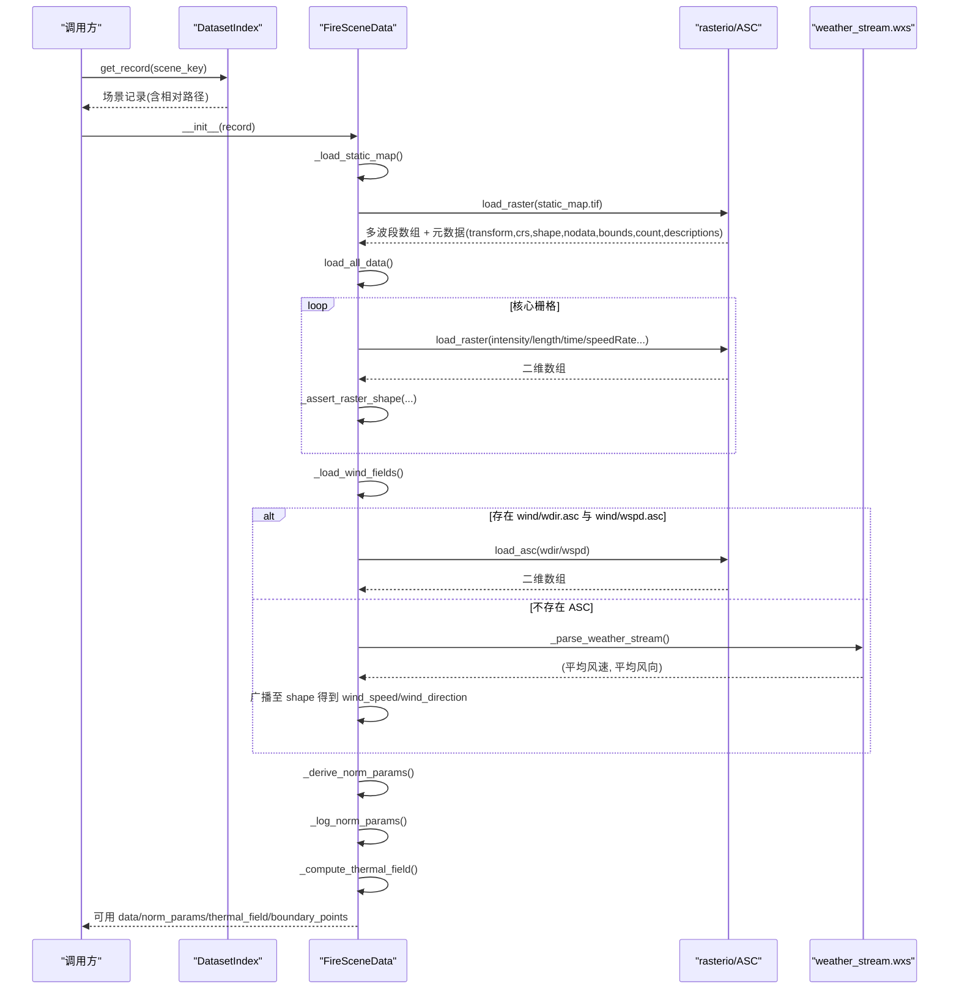
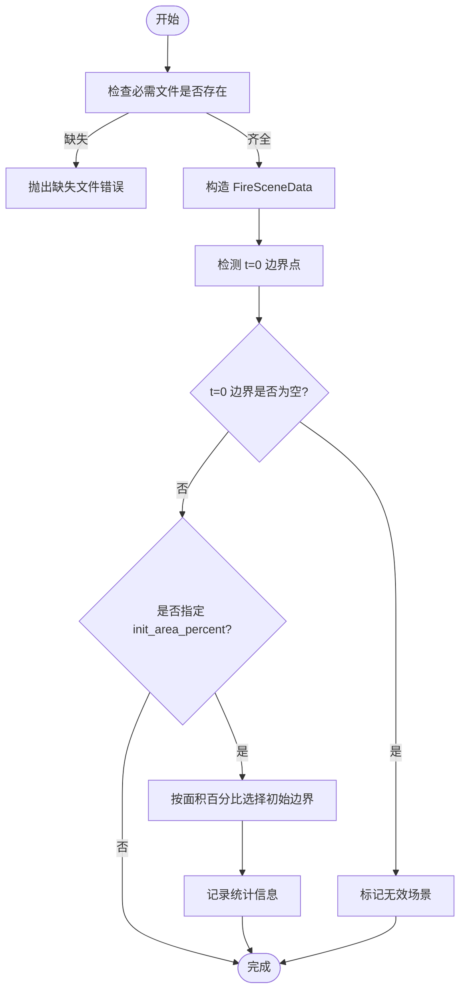
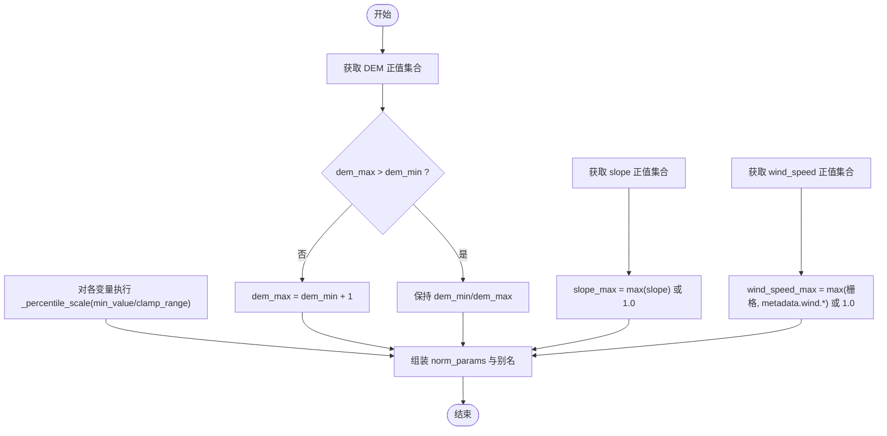
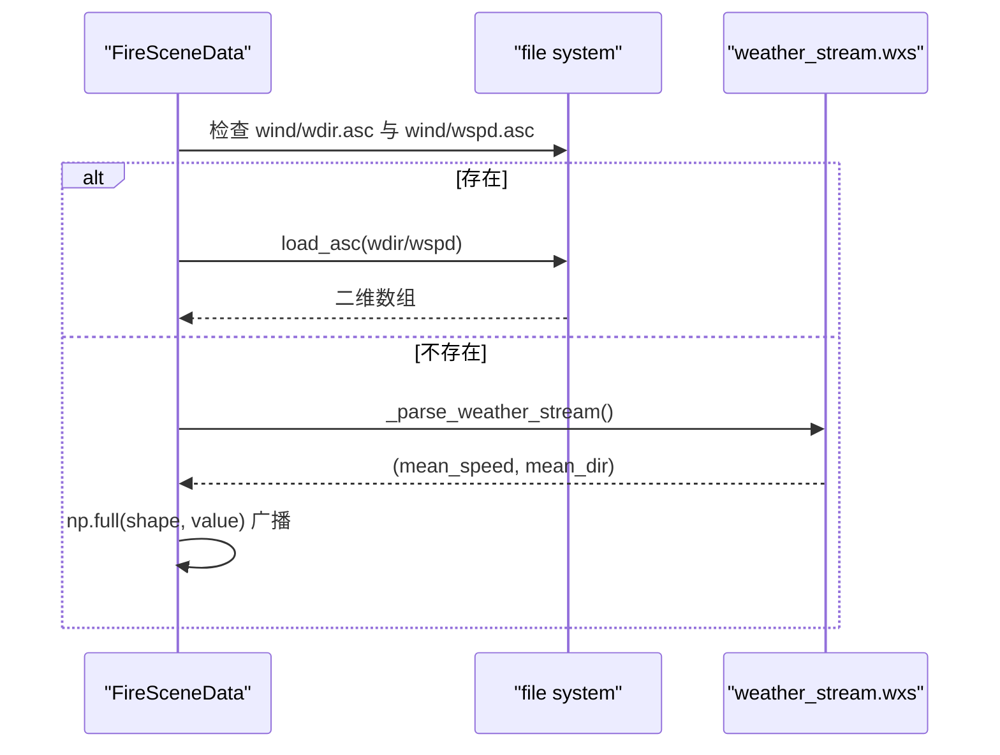
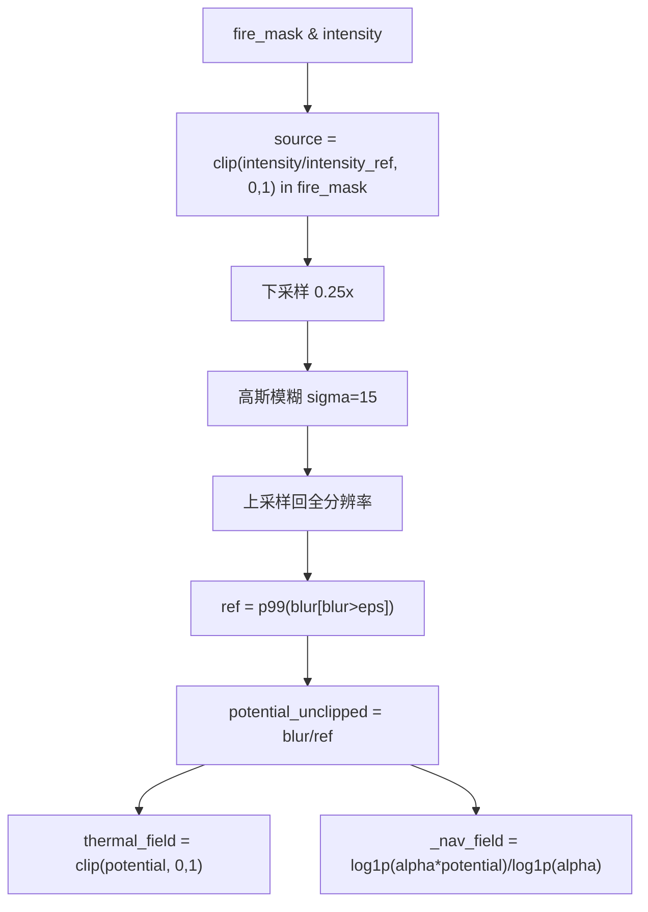
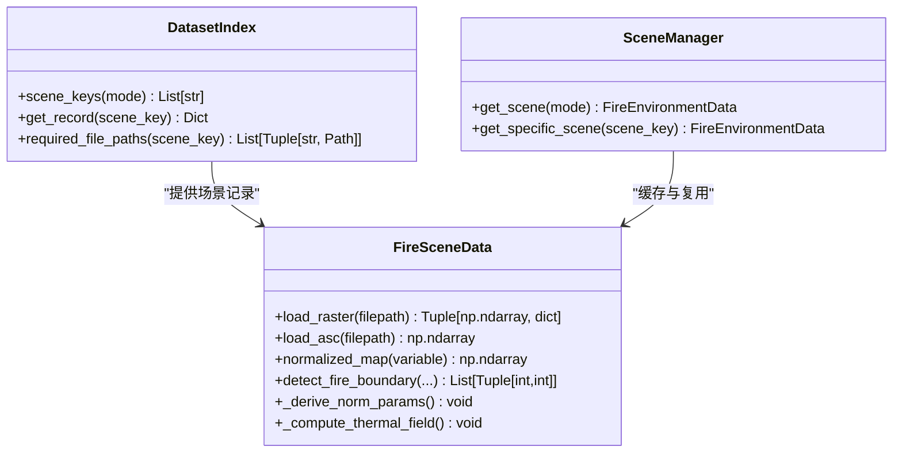

# 栅格数据处理

<cite>
**本文引用的文件**   
- [信息转换.py](file://environment_variables/environment_variables/信息转换.py)
- [metadata.json](file://map/Generalization/6/scene1/metadata.json)
- [weather_stream.wxs](file://map/Generalization/6/scene1/inputs/weather_stream.wxs)
- [map6.tfw](file://map/Generalization/6/map6/map6.tfw)
</cite>

## 目录
1. [简介](#简介)
2. [项目结构](#项目结构)
3. [核心组件](#核心组件)
4. [架构总览](#架构总览)
5. [详细组件分析](#详细组件分析)
6. [依赖关系分析](#依赖关系分析)
7. [性能考虑](#性能考虑)
8. [故障排查指南](#故障排查指南)
9. [结论](#结论)
10. [附录：代码示例路径](#附录代码示例路径)

## 简介
本技术文档面向栅格数据处理系统，聚焦以下目标：
- GeoTIFF 文件的读取与处理流程（含多波段图像与元数据提取）
- 形状一致性检查与数据验证机制
- 归一化参数推导算法（百分位数缩放与范围裁剪策略）
- 标准化地图计算与边界框处理
- 风场数据生成逻辑（从 weather_stream 解析与 ASC 格式读取）
- 提供具体代码示例路径以复现不同栅格数据的处理方式

该系统围绕 FARSITE 场景的栅格产物进行统一加载、校验、归一化与热场语义重建，为后续训练与评估提供稳定输入。

## 项目结构
仓库中与栅格数据处理直接相关的核心实现位于 environment_variables/environment_variables/信息转换.py；示例场景数据位于 map/... 目录下，包含 metadata.json、weather_stream.wxs、TFW 等辅助文件。

图表来源
- [信息转换.py:219-323](file://environment_variables/environment_variables/信息转换.py#L219-L323)
- [信息转换.py:1282-1327](file://environment_variables/environment_variables/信息转换.py#L1282-L1327)
- [信息转换.py:1329-1416](file://environment_variables/environment_variables/信息转换.py#L1329-L1416)
- [metadata.json:1-174](file://map/Generalization/6/scene1/metadata.json#L1-L174)
- [weather_stream.wxs:1-13](file://map/Generalization/6/scene1/inputs/weather_stream.wxs#L1-L13)
- [map6.tfw:1-7](file://map/Generalization/6/map6/map6.tfw#L1-L7)

章节来源
- [信息转换.py:219-323](file://environment_variables/environment_variables/信息转换.py#L219-L323)
- [metadata.json:1-174](file://map/Generalization/6/scene1/metadata.json#L1-L174)
- [weather_stream.wxs:1-13](file://map/Generalization/6/scene1/inputs/weather_stream.wxs#L1-L13)
- [map6.tfw:1-7](file://map/Generalization/6/map6/map6.tfw#L1-L7)

## 核心组件
- DatasetIndex：基于 dataset_index.json 构建场景索引，解析绝对路径，提供 split 与 scene_key 查询。
- FireSceneData：单场景数据加载器，负责：
  - 静态多波段栅格加载（elevation/slope/aspect/fuel_model/canopy_* 等）
  - 动态栅格加载（intensity/length/time/speedRate/spread_direction/heat_per_unit_area/crown_fire）
  - 风场字段生成（优先 ASC，否则从 weather_stream 或 metadata 推导）
  - 形状一致性校验与 nodata/NaN 清理
  - 归一化参数推导（百分位数+范围裁剪）
  - 标准化地图计算（按变量映射到对应最大/范围）
  - 热场语义重建（强度掩膜→高斯模糊→稳健归一化→对数压缩导航场）
  - 火场边界检测与面积百分比初始化
- SceneManager：跨实例共享场景缓存，避免重复 IO 与重算。
- validate_scene_boundaries：批量预检场景有效性（缺失文件、t=0 边界为空等）。

章节来源
- [信息转换.py:20-196](file://environment_variables/environment_variables/信息转换.py#L20-L196)
- [信息转换.py:219-323](file://environment_variables/environment_variables/信息转换.py#L219-L323)
- [信息转换.py:1282-1327](file://environment_variables/environment_variables/信息转换.py#L1282-L1327)
- [信息转换.py:1329-1416](file://environment_variables/environment_variables/信息转换.py#L1329-L1416)

## 架构总览
下图展示了从场景索引到最终可用特征的关键调用链与数据流。

图表来源
- [信息转换.py:219-323](file://environment_variables/environment_variables/信息转换.py#L219-L323)
- [信息转换.py:392-424](file://environment_variables/environment_variables/信息转换.py#L392-L424)
- [信息转换.py:426-491](file://environment_variables/environment_variables/信息转换.py#L426-L491)
- [信息转换.py:559-614](file://environment_variables/environment_variables/信息转换.py#L559-L614)
- [信息转换.py:759-820](file://environment_variables/environment_variables/信息转换.py#L759-L820)

## 详细组件分析

### GeoTIFF 读取与多波段处理
- 读取入口：load_raster(filepath)
  - 使用 rasterio.open 打开文件，读取所有波段并转为 float32
  - 将 nodata 值置零，并用 nan_to_num 替换 NaN/Inf，负值置零
  - 若 count==1，自动降维为二维
  - 返回数据与元数据字典（transform、crs、shape、nodata、bounds、count、descriptions）
- 多波段静态地图：_load_static_map()
  - 要求波段数等于 STATIC_BAND_KEYS 长度，否则抛出异常
  - 将各波段分别写入 static_bands 与 data，并将 elevation 映射为 dem
- 元数据与地理参考
  - transform/crs 用于坐标转换（get_coordinates）
  - bounds 可用于边界框判断与可视化
  - aux.xml 中的统计信息可作为质量检查参考（非必须）

章节来源
- [信息转换.py:392-414](file://environment_variables/environment_variables/信息转换.py#L392-L414)
- [信息转换.py:501-524](file://environment_variables/environment_variables/信息转换.py#L501-L524)
- [信息转换.py:1256-1260](file://environment_variables/environment_variables/信息转换.py#L1256-L1260)
- [map6.tfw:1-7](file://map/Generalization/6/map6/map6.tfw#L1-L7)

### 形状一致性检查与数据验证
- 形状一致性：_assert_raster_shape(key, filepath, shape)
  - 对比当前场景 shape（来自静态地图），不一致则抛出运行时错误
- 必需文件检查：required_file_paths(scene_key)
  - 列出 metadata、static_map、核心栅格、向量、输入与报告等路径
- 场景预检：validate_scene_boundaries(base_dir, ...)
  - 检查缺失文件
  - 构造场景对象并检测 t=0 边界点数量
  - 可选按 init_area_percent 选择初始火场边界并输出统计
  - 汇总无效原因并抛出 InvalidSceneError

图表来源
- [信息转换.py:136-196](file://environment_variables/environment_variables/信息转换.py#L136-L196)
- [信息转换.py:1329-1416](file://environment_variables/environment_variables/信息转换.py#L1329-L1416)
- [信息转换.py:684-721](file://environment_variables/environment_variables/信息转换.py#L684-L721)

章节来源
- [信息转换.py:136-196](file://environment_variables/environment_variables/信息转换.py#L136-L196)
- [信息转换.py:525-532](file://environment_variables/environment_variables/信息转换.py#L525-L532)
- [信息转换.py:1329-1416](file://environment_variables/environment_variables/信息转换.py#L1329-L1416)

### 归一化参数推导算法（百分位数缩放与范围裁剪）
- 正样本过滤：_positive_values(data)
  - 仅保留有限且大于 0 的值
- 百分位缩放：_percentile_scale(raster_key, percentile=99.5, min_value=1.0, clamp_range=None)
  - 若无有效值，回退到 min_value
  - 支持 clamp_range 进行范围裁剪
- 参数推导：_derive_norm_params()
  - DEM：dem_min/dem_max（若相等则 dem_max=dem_min+1）
  - Slope：slope_max（至少为 1）
  - Wind speed：结合栅格最大值与 metadata.wind 中的 mph/峰值/范围字段
  - 其他变量：通过 _percentile_scale 计算 intensity/length/speedRate/spread_direction/heat_per_unit_area/crown_fire 的最大值
  - 生成别名映射：flame_length_max=length_max、ros_max=speedRate_max、heat_max=heat_per_unit_area_max

图表来源
- [信息转换.py:534-557](file://environment_variables/environment_variables/信息转换.py#L534-L557)
- [信息转换.py:559-614](file://environment_variables/environment_variables/信息转换.py#L559-L614)

章节来源
- [信息转换.py:534-557](file://environment_variables/environment_variables/信息转换.py#L534-L557)
- [信息转换.py:559-614](file://environment_variables/environment_variables/信息转换.py#L559-L614)

### 标准化地图计算与边界框处理
- normalized_map(variable)
  - 支持别名映射（如 flame_length→length）
  - DEM：按 dem_min/dem_max 线性归一化并 clip[0,1]
  - 其他变量：按对应 *_max 参数归一化并 clip[0,1]
  - 特殊键：slope 使用 slope_max，wind_speed 使用 wind_speed_max
- 边界框与坐标
  - get_coordinates(row,col) 使用 transform 反算经纬度
  - _check_bounds(row,col) 确保行列在 shape 范围内
  - get_full_map(variable,time_step) 安全切片时序栅格

章节来源
- [信息转换.py:616-637](file://environment_variables/environment_variables/信息转换.py#L616-L637)
- [信息转换.py:1256-1275](file://environment_variables/environment_variables/信息转换.py#L1256-L1275)

### 风场数据生成逻辑（weather_stream 与 ASC）
- 优先路径：wind/wdir.asc 与 wind/wspd.asc
  - load_asc 跳过前 6 行头信息，逐行解析数值矩阵
- 回退路径：_parse_weather_stream()
  - 若文件不存在或无有效行，回退到 metadata.wind 中的 wind_speed_mph/方向
  - 否则解析列 7/8（风速/风向），计算平均风速与平均风向（单位弧度转角度）
- 广播：将标量风场填充为与 shape 一致的二维数组

图表来源
- [信息转换.py:415-424](file://environment_variables/environment_variables/信息转换.py#L415-L424)
- [信息转换.py:426-491](file://environment_variables/environment_variables/信息转换.py#L426-L491)
- [weather_stream.wxs:1-13](file://map/Generalization/6/scene1/inputs/weather_stream.wxs#L1-L13)

章节来源
- [信息转换.py:415-424](file://environment_variables/environment_variables/信息转换.py#L415-L424)
- [信息转换.py:426-491](file://environment_variables/environment_variables/信息转换.py#L426-L491)
- [weather_stream.wxs:1-13](file://map/Generalization/6/scene1/inputs/weather_stream.wxs#L1-L13)

### 热场语义重建与导航场
- 输入：fire_binary_map 与 intensity 栅格
- 步骤：
  - 仅在火区内将 intensity/intensity_ref 裁剪到 [0,1]
  - 下采样（0.25x）+ 高斯模糊（sigma=15）
  - 上采样回原分辨率
  - 稳健归一化：取正值 p99 作为 ref，potential = blur/ref，clip[0,1]
  - 导航场：log1p(alpha*potential)/log1p(alpha)，alpha=20，便于梯度计算
- 诊断：diagnose_thermal_health 输出饱和比例、高值区零梯度比例、分位数等

图表来源
- [信息转换.py:759-820](file://environment_variables/environment_variables/信息转换.py#L759-L820)

章节来源
- [信息转换.py:759-820](file://environment_variables/environment_variables/信息转换.py#L759-L820)

### 火场边界检测与面积百分比初始化
- detect_fire_boundary(time_step, fire_threshold, init_percentile, init_area_percent, start_sim_time)
  - 基于 intensity>threshold 的二值化
  - 若提供 time 栅格且 time_step 有效：
    - 根据时间范围与步长计算当前模拟时间
    - 可选按 init_area_percent 选择截止时间的火场掩膜
  - 通过形态学腐蚀求活跃前沿（边界点）
- initialize_training_boundary(init_percentile/init_area_percent)
  - 封装上述逻辑，设置 training_start_sim_time 与 last_init_area_stats

章节来源
- [信息转换.py:821-887](file://environment_variables/environment_variables/信息转换.py#L821-L887)
- [信息转换.py:698-721](file://environment_variables/environment_variables/信息转换.py#L698-L721)

## 依赖关系分析
- 外部库
  - rasterio：GeoTIFF 读写与地理参考
  - numpy/scipy：数值计算、形态学操作、高斯滤波
  - cv2：图像缩放（下采样/上采样）
- 内部耦合
  - DatasetIndex 为 FireSceneData 提供场景记录与路径解析
  - FireSceneData 聚合所有栅格与风场，导出标准化特征与热场
  - SceneManager 复用 FireSceneData 实例，减少重复 IO
  - validate_scene_boundaries 依赖 DatasetIndex 与 FireSceneData 做批处理校验

图表来源
- [信息转换.py:20-196](file://environment_variables/environment_variables/信息转换.py#L20-L196)
- [信息转换.py:219-323](file://environment_variables/environment_variables/信息转换.py#L219-L323)
- [信息转换.py:1282-1327](file://environment_variables/environment_variables/信息转换.py#L1282-L1327)

章节来源
- [信息转换.py:20-196](file://environment_variables/environment_variables/信息转换.py#L20-L196)
- [信息转换.py:219-323](file://environment_variables/environment_variables/信息转换.py#L219-L323)
- [信息转换.py:1282-1327](file://environment_variables/environment_variables/信息转换.py#L1282-L1327)

## 性能考虑
- 缓存策略：SceneManager 使用类级共享缓存，避免重复读盘与重算
- 内存与精度：栅格统一转为 float32，降低内存占用
- 稳健归一化：采用 p99/p99.5 与范围裁剪，降低极端值影响
- 计算优化：先下采样再高斯模糊，再上采样，显著降低计算量
- 边界框与形状校验：尽早失败，避免后续昂贵计算

## 故障排查指南
- 常见错误与定位
  - 缺少必需文件：required_file_paths 与 validate_scene_boundaries 会明确列出缺失项
  - 形状不匹配：_assert_raster_shape 会指出 static_map 与目标栅格的 shape 差异
  - 风场缺失：若 ASC 不存在且 weather_stream 无法解析，将回退到 metadata.wind；仍失败需检查路径与编码
  - 热场为空：若 fire_binary_map 未初始化或 intensity 缺失，_compute_thermal_field 会抛错
- 诊断工具
  - diagnose_thermal_health：输出饱和比例、高值区零梯度比例、分位数等指标
  - boundary_points 与 current_fire/active_front：快速确认边界与前沿状态

章节来源
- [信息转换.py:136-196](file://environment_variables/environment_variables/信息转换.py#L136-L196)
- [信息转换.py:525-532](file://environment_variables/environment_variables/信息转换.py#L525-L532)
- [信息转换.py:759-820](file://environment_variables/environment_variables/信息转换.py#L759-L820)
- [信息转换.py:972-1012](file://environment_variables/environment_variables/信息转换.py#L972-L1012)

## 结论
该栅格数据处理系统以 DatasetIndex 与 FireSceneData 为核心，实现了从多源栅格与文本到统一标准化特征的完整链路。其关键优势包括：
- 严格的形状一致性与数据完整性校验
- 稳健的归一化参数推导（百分位数+范围裁剪）
- 高效的热场语义重建与导航场设计
- 灵活的风场生成策略（ASC 优先，weather_stream 回退）
- 可复用的场景管理与批量预检工具

## 附录：代码示例路径
以下为可直接定位的代码片段路径，便于对照实现细节与复现实验：

- GeoTIFF 读取与元数据提取
  - [load_raster:392-414](file://environment_variables/environment_variables/信息转换.py#L392-L414)
  - [_load_static_map:501-524](file://environment_variables/environment_variables/信息转换.py#L501-L524)
  - [get_coordinates:1256-1260](file://environment_variables/environment_variables/信息转换.py#L1256-L1260)

- 形状一致性检查与数据验证
  - [_assert_raster_shape:525-532](file://environment_variables/environment_variables/信息转换.py#L525-L532)
  - [required_file_paths:136-196](file://environment_variables/environment_variables/信息转换.py#L136-L196)
  - [validate_scene_boundaries:1329-1416](file://environment_variables/environment_variables/信息转换.py#L1329-L1416)

- 归一化参数推导（百分位数与范围裁剪）
  - [_positive_values:534-537](file://environment_variables/environment_variables/信息转换.py#L534-L537)
  - [_percentile_scale:543-557](file://environment_variables/environment_variables/信息转换.py#L543-L557)
  - [_derive_norm_params:559-614](file://environment_variables/environment_variables/信息转换.py#L559-L614)

- 标准化地图计算与边界框处理
  - [normalized_map:616-637](file://environment_variables/environment_variables/信息转换.py#L616-L637)
  - [_check_bounds:1262-1265](file://environment_variables/environment_variables/信息转换.py#L1262-L1265)
  - [get_full_map:1267-1275](file://environment_variables/environment_variables/信息转换.py#L1267-L1275)

- 风场数据生成（weather_stream 与 ASC）
  - [load_asc:415-424](file://environment_variables/environment_variables/信息转换.py#L415-L424)
  - [_parse_weather_stream:426-491](file://environment_variables/environment_variables/信息转换.py#L426-L491)
  - [_load_wind_fields:473-491](file://environment_variables/environment_variables/信息转换.py#L473-L491)

- 热场语义重建与导航场
  - [_compute_thermal_field:759-820](file://environment_variables/environment_variables/信息转换.py#L759-L820)
  - [diagnose_thermal_health:972-1012](file://environment_variables/environment_variables/信息转换.py#L972-L1012)

- 火场边界检测与面积百分比初始化
  - [detect_fire_boundary:821-887](file://environment_variables/environment_variables/信息转换.py#L821-L887)
  - [initialize_training_boundary:698-721](file://environment_variables/environment_variables/信息转换.py#L698-L721)

- 场景管理与缓存
  - [SceneManager:1282-1327](file://environment_variables/environment_variables/信息转换.py#L1282-L1327)