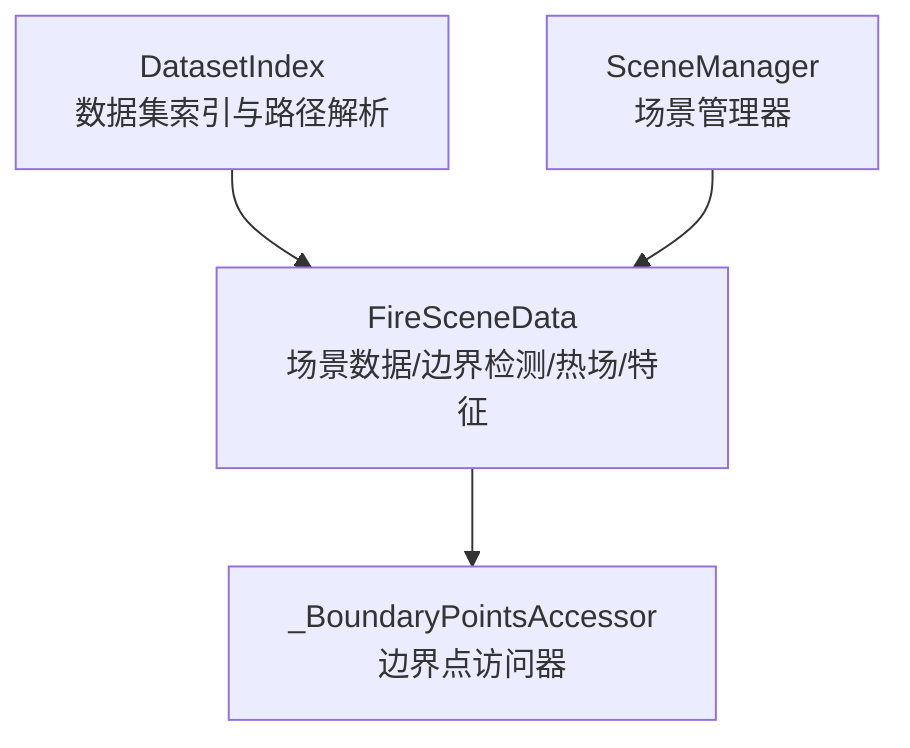
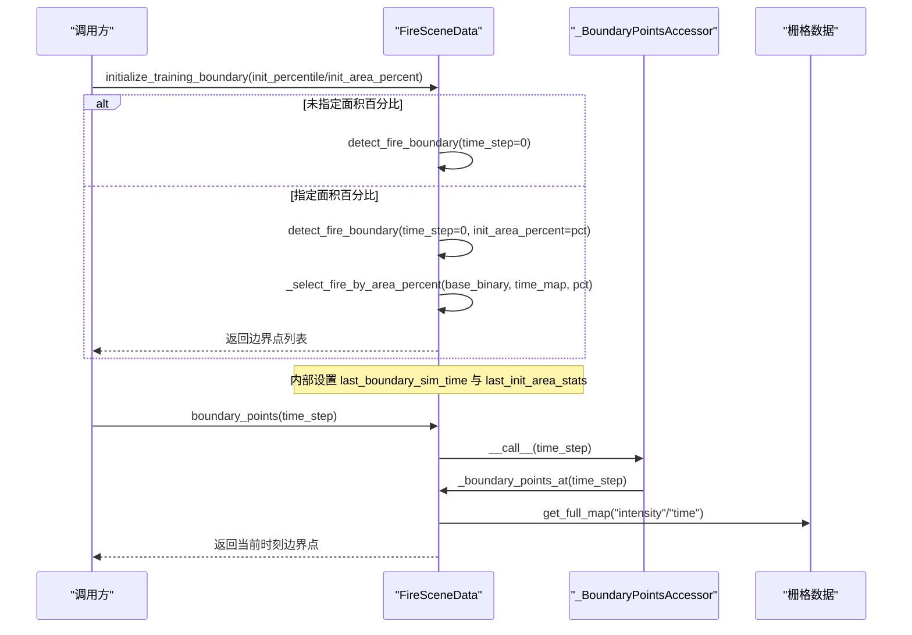
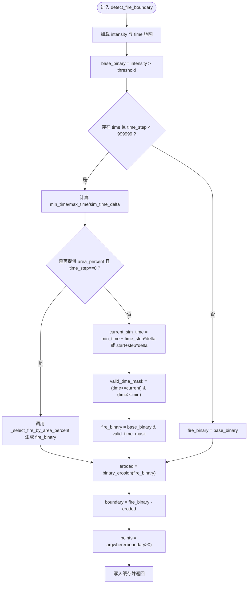
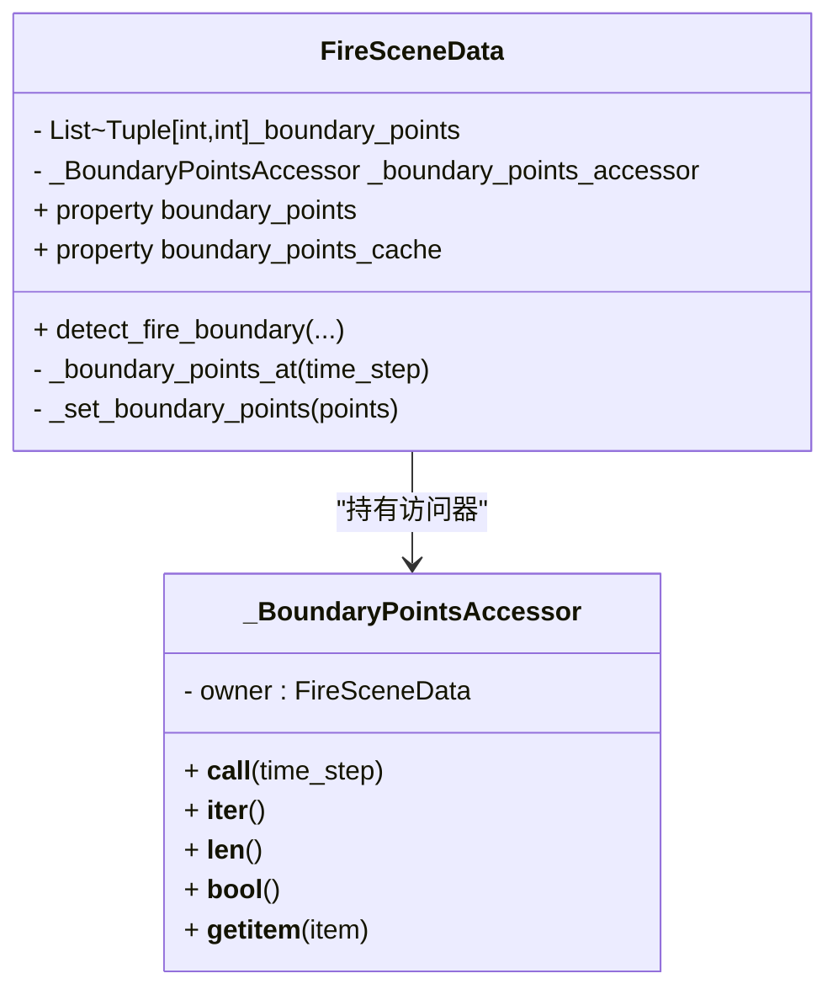
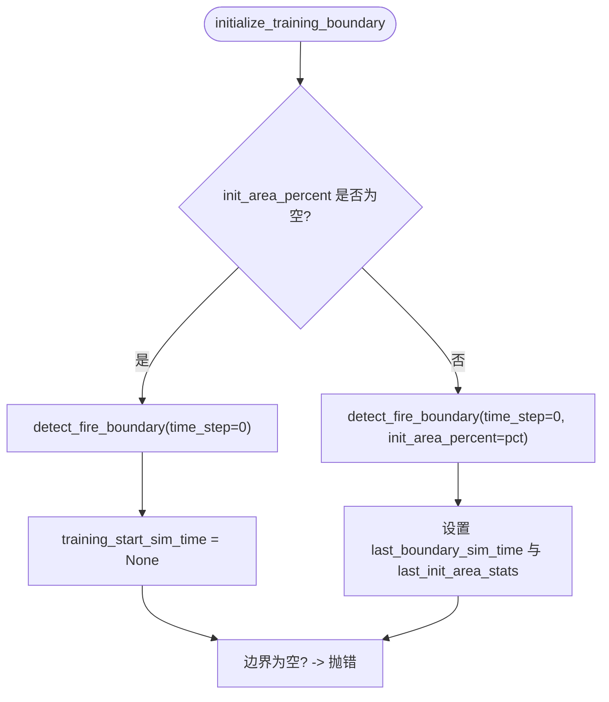
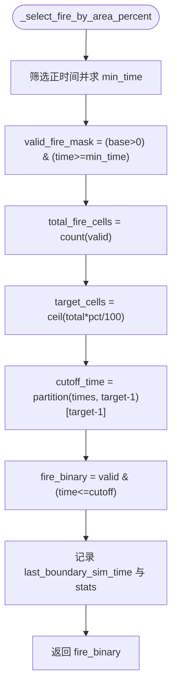
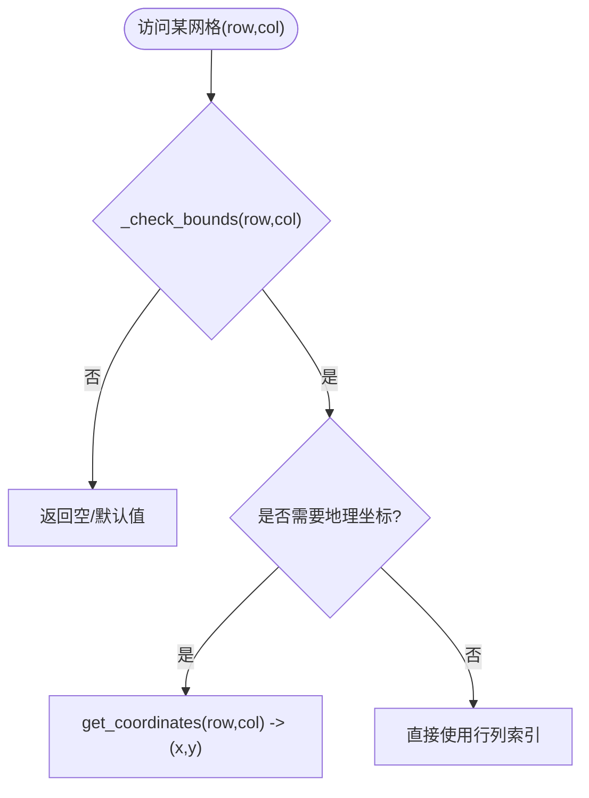
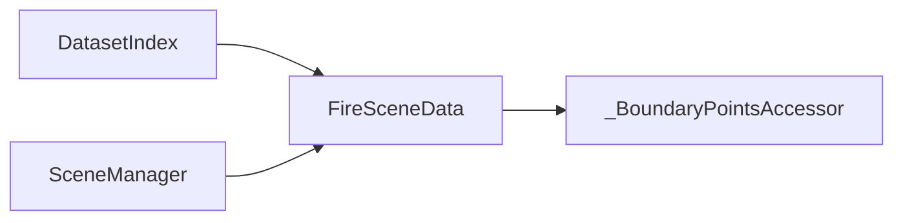

# 火场边界检测系统

<cite>
**本文引用的文件**   
- [信息转换.py](file://environment_variables/environment_variables/信息转换.py)
</cite>

## 目录
1. [简介](#简介)
2. [项目结构](#项目结构)
3. [核心组件](#核心组件)
4. [架构总览](#架构总览)
5. [详细组件分析](#详细组件分析)
6. [依赖关系分析](#依赖关系分析)
7. [性能考量](#性能考量)
8. [故障排查指南](#故障排查指南)
9. [结论](#结论)
10. [附录：使用示例与最佳实践](#附录使用示例与最佳实践)

## 简介
本技术文档围绕“火场边界检测系统”的自动检测算法、缓存与访问器模式、训练边界初始化策略（固定时间步长与面积百分比控制）、以及坐标转换与有效性验证进行系统化说明。重点解释以下能力：
- 基于时间戳的边界点提取方法
- 边界点缓存机制与访问器模式的实现
- 训练边界初始化的两种模式：固定时间步长与面积百分比控制
- _select_fire_by_area_percent 的实现原理，包括时间阈值计算与区域选择策略
- 边界点的坐标转换与有效性验证
- 提供具体代码路径以展示如何进行边界检测与初始化训练场景

## 项目结构
本项目将数据加载、归一化、热场重建、边界检测与场景管理集中在单一模块中，便于快速集成与调试。关键类职责如下：
- DatasetIndex：数据集索引与路径解析
- FireSceneData：单场景数据加载、归一化、边界检测、热场计算、特征提取
- _BoundaryPointsAccessor：边界点访问器，封装缓存读取与迭代语义
- SceneManager：场景管理与共享缓存

图表来源
- [信息转换.py:20-197](file://environment_variables/environment_variables/信息转换.py#L20-L197)
- [信息转换.py:199-218](file://environment_variables/environment_variables/信息转换.py#L199-L218)
- [信息转换.py:219-1276](file://environment_variables/environment_variables/信息转换.py#L219-L1276)
- [信息转换.py:1282-1327](file://environment_variables/environment_variables/信息转换.py#L1282-L1327)

章节来源
- [信息转换.py:20-197](file://environment_variables/environment_variables/信息转换.py#L20-L197)
- [信息转换.py:219-1276](file://environment_variables/environment_variables/信息转换.py#L219-L1276)
- [信息转换.py:1282-1327](file://environment_variables/environment_variables/信息转换.py#L1282-L1327)

## 核心组件
- 边界检测入口：detect_fire_boundary
- 面积百分比初始化：initialize_training_boundary + _select_fire_by_area_percent
- 边界点缓存与访问器：_boundary_points_accessor / boundary_points_cache
- 坐标转换与有效性检查：get_coordinates / _check_bounds
- 热场与导航场：_compute_thermal_field / get_local_thermal_gradient

章节来源
- [信息转换.py:821-887](file://environment_variables/environment_variables/信息转换.py#L821-L887)
- [信息转换.py:698-757](file://environment_variables/environment_variables/信息转换.py#L698-L757)
- [信息转换.py:199-218](file://environment_variables/environment_variables/信息转换.py#L199-L218)
- [信息转换.py:1256-1265](file://environment_variables/environment_variables/信息转换.py#L1256-L1265)
- [信息转换.py:759-819](file://environment_variables/environment_variables/信息转换.py#L759-L819)

## 架构总览
下图展示了从场景加载到边界检测与热场计算的端到端流程，以及训练边界初始化分支。

图表来源
- [信息转换.py:698-757](file://environment_variables/environment_variables/信息转换.py#L698-L757)
- [信息转换.py:821-887](file://environment_variables/environment_variables/信息转换.py#L821-L887)
- [信息转换.py:199-218](file://environment_variables/environment_variables/信息转换.py#L199-L218)

## 详细组件分析

### 基于时间戳的边界点提取方法
- 输入：强度图 intensity、时间图 time、可选阈值 fire_threshold、可选起始仿真时间 start_sim_time、可选时间步 time_step
- 步骤：
  - 根据阈值生成基础二值掩码 base_binary
  - 若存在时间图且 time_step < 999999：
    - 计算有效时间范围 [min_time, max_time]
    - 计算每步时间增量 sim_time_delta = (max-min)*0.8/800
    - 若提供 start_sim_time，则 current_sim_time = start_sim_time + time_step * sim_time_delta；否则 current_sim_time = min_time + time_step * sim_time_delta
    - 取 time_map <= current_sim_time 且 >= min_time 的掩码得到 fire_binary
  - 若未使用时间约束或无有效时间：直接使用 base_binary
  - 对 fire_binary 执行形态学腐蚀，边界 = fire_binary - eroded，argwhere 得到像素坐标列表
  - 更新 last_boundary_sim_time 与内部缓存
- 输出：边界点坐标列表 [(row, col), ...]

图表来源
- [信息转换.py:821-887](file://environment_variables/environment_variables/信息转换.py#L821-L887)

章节来源
- [信息转换.py:821-887](file://environment_variables/environment_variables/信息转换.py#L821-L887)

### 边界点缓存机制与访问器模式
- 缓存字段：_boundary_points（内部列表）
- 访问器：_BoundaryPointsAccessor
  - __call__(time_step)：委托给 _boundary_points_at(time_step)，后者调用 detect_fire_boundary
  - __iter__/__len__/__bool__/__getitem__：直接读取 boundary_points_cache
- 属性：
  - boundary_points：返回访问器实例
  - boundary_points_cache：返回当前缓存副本
- 设置：boundary_points.setter 通过 _set_boundary_points 规范化为整数坐标

图表来源
- [信息转换.py:199-218](file://environment_variables/environment_variables/信息转换.py#L199-L218)
- [信息转换.py:324-348](file://environment_variables/environment_variables/信息转换.py#L324-L348)
- [信息转换.py:889-890](file://environment_variables/environment_variables/信息转换.py#L889-L890)

章节来源
- [信息转换.py:199-218](file://environment_variables/environment_variables/信息转换.py#L199-L218)
- [信息转换.py:324-348](file://environment_variables/environment_variables/信息转换.py#L324-L348)
- [信息转换.py:889-890](file://environment_variables/environment_variables/信息转换.py#L889-L890)

### 训练边界初始化：固定时间步长 vs 面积百分比控制
- 固定时间步长模式：
  - 调用 initialize_training_boundary(init_percentile=None, init_area_percent=None)
  - 内部走 detect_fire_boundary(time_step=0)，不设置 last_boundary_sim_time（保持 None）
- 面积百分比控制模式：
  - 调用 initialize_training_boundary(init_percentile=5.0, init_area_percent=5.0)
  - 内部走 detect_fire_boundary(time_step=0, init_area_percent=5.0)
  - 触发 _select_fire_by_area_percent，设置 last_boundary_sim_time 与 last_init_area_stats
- 校验：
  - 若结果为空，标记 is_valid_scene=False 并抛出 InvalidSceneError

图表来源
- [信息转换.py:698-721](file://environment_variables/environment_variables/信息转换.py#L698-L721)

章节来源
- [信息转换.py:698-721](file://environment_variables/environment_variables/信息转换.py#L698-L721)

### _select_fire_by_area_percent 实现原理
- 目标：在全部燃烧区域内，按面积百分比选择最早燃烧的单元格集合，从而确定一个“时间截断” cutoff_time
- 关键步骤：
  - 过滤正时间：positive_times = time_map[(base_binary>0) & (time_map>=0)]
  - 计算 min_time = min(positive_times) 或 0.0
  - 构建有效燃烧掩码 valid_fire_mask = (base_binary>0) & (time_map>=min_time)
  - 统计 total_fire_cells
  - 计算目标单元格数 target_cells = ceil(total * pct / 100)
  - 使用 np.partition 选取第 target_cells-1 小的时间作为 cutoff_time
  - 生成 fire_binary = valid_fire_mask & (time_map <= cutoff_time)
  - 记录 last_boundary_sim_time = cutoff_time 与 last_init_area_stats（含实际百分比）
- 复杂度：O(N log N) 最坏情况，但 partition 平均 O(N)

图表来源
- [信息转换.py:723-757](file://environment_variables/environment_variables/信息转换.py#L723-L757)

章节来源
- [信息转换.py:723-757](file://environment_variables/environment_variables/信息转换.py#L723-L757)

### 边界点的坐标转换与有效性验证
- 坐标转换：get_coordinates(row, col) 使用 rasterio.transform.xy 将行列号转换为地理坐标 (x, y)
- 有效性检查：_check_bounds(row, col) 确保行列在 shape 范围内
- 使用建议：
  - 在访问任何栅格或特征前，先调用 _check_bounds
  - 需要地理坐标时，再调用 get_coordinates

图表来源
- [信息转换.py:1256-1265](file://environment_variables/environment_variables/信息转换.py#L1256-L1265)

章节来源
- [信息转换.py:1256-1265](file://environment_variables/environment_variables/信息转换.py#L1256-L1265)

## 依赖关系分析
- 外部库：numpy、rasterio、scipy.ndimage、cv2
- 内部依赖：
  - FireSceneData 依赖 DatasetIndex 提供的场景元数据与路径解析
  - FireSceneData 内部维护 _BoundaryPointsAccessor 用于统一访问边界点
  - SceneManager 复用 FireSceneData 实例并共享缓存，避免重复 I/O 与计算

图表来源
- [信息转换.py:20-197](file://environment_variables/environment_variables/信息转换.py#L20-L197)
- [信息转换.py:199-218](file://environment_variables/environment_variables/信息转换.py#L199-L218)
- [信息转换.py:1282-1327](file://environment_variables/environment_variables/信息转换.py#L1282-L1327)

章节来源
- [信息转换.py:20-197](file://environment_variables/environment_variables/信息转换.py#L20-L197)
- [信息转换.py:1282-1327](file://environment_variables/environment_variables/信息转换.py#L1282-L1327)

## 性能考量
- 边界检测主要开销：
  - 栅格读取与形状校验
  - 形态学腐蚀（binary_erosion）
  - 当使用面积百分比时，partition 操作在大规模栅格上具有线性期望复杂度
- 热场计算：
  - 下采样+高斯模糊+上采样，降低计算量
  - 使用百分位稳健归一化，避免极端值影响
- 建议：
  - 批量处理时复用 SceneManager 的共享缓存
  - 对大分辨率地图优先使用面积百分比模式以减少无效时间步遍历

[本节为通用指导，无需特定文件引用]

## 故障排查指南
- 常见错误：InvalidSceneError
  - 触发条件：t=0 边界为空，或按面积百分比初始化后仍为空
  - 定位方法：
    - 检查 required_file_paths 是否存在缺失文件
    - 打印 last_init_area_stats 中的 actual_init_area_percent 与 cutoff_time
    - 确认 intensity/time 栅格形状一致且非全零
- 诊断工具：
  - diagnose_thermal_health：检查热场饱和比例、梯度分布等
  - check_boundary_closure：评估已发现边界覆盖率

章节来源
- [信息转换.py:16-18](file://environment_variables/environment_variables/信息转换.py#L16-L18)
- [信息转换.py:1329-1416](file://environment_variables/environment_variables/信息转换.py#L1329-L1416)
- [信息转换.py:972-1012](file://environment_variables/environment_variables/信息转换.py#L972-L1012)
- [信息转换.py:1167-1185](file://environment_variables/environment_variables/信息转换.py#L1167-L1185)

## 结论
本系统通过“强度阈值 + 时间掩码 + 形态学边缘”的组合实现了高效的火场边界检测；借助访问器模式与缓存机制，边界点获取具备一致性与可迭代性；训练边界初始化支持固定时间步长与面积百分比两种模式，后者通过时间截断保证可控的训练难度与稳定性；坐标转换与有效性检查保障了后续空间分析与地理可视化的正确性。

[本节为总结性内容，无需特定文件引用]

## 附录：使用示例与最佳实践
以下为可直接复用的代码片段路径，涵盖边界检测与训练场景初始化：

- 初始化场景并获取 t=0 边界点
  - 参考路径：[信息转换.py:684-696](file://environment_variables/environment_variables/信息转换.py#L684-L696)
- 使用面积百分比初始化训练边界
  - 参考路径：[信息转换.py:698-721](file://environment_variables/environment_variables/信息转换.py#L698-L721)
- 手动调用 detect_fire_boundary 并查看 last_init_area_stats
  - 参考路径：[信息转换.py:821-887](file://environment_variables/environment_variables/信息转换.py#L821-L887)
- 通过访问器获取边界点
  - 参考路径：[信息转换.py:199-218](file://environment_variables/environment_variables/信息转换.py#L199-L218)
- 坐标转换与边界检查
  - 参考路径：[信息转换.py:1256-1265](file://environment_variables/environment_variables/信息转换.py#L1256-L1265)

章节来源
- [信息转换.py:684-696](file://environment_variables/environment_variables/信息转换.py#L684-L696)
- [信息转换.py:698-721](file://environment_variables/environment_variables/信息转换.py#L698-L721)
- [信息转换.py:821-887](file://environment_variables/environment_variables/信息转换.py#L821-L887)
- [信息转换.py:199-218](file://environment_variables/environment_variables/信息转换.py#L199-L218)
- [信息转换.py:1256-1265](file://environment_variables/environment_variables/信息转换.py#L1256-L1265)