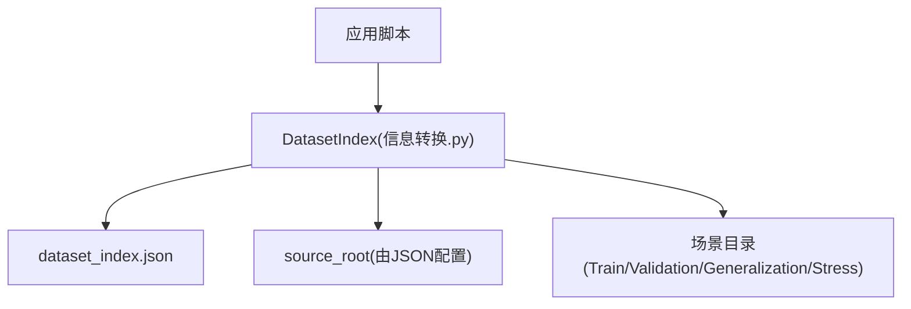
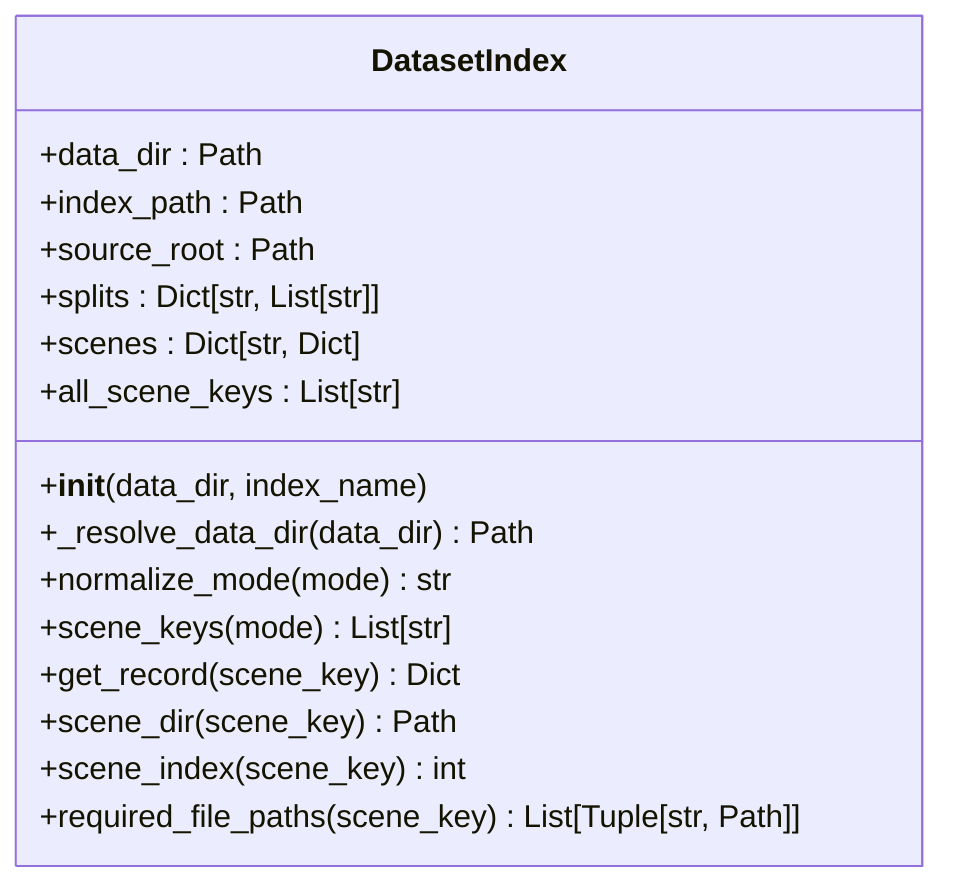
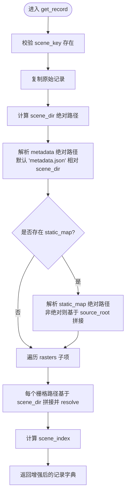
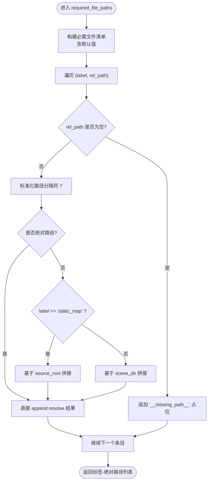
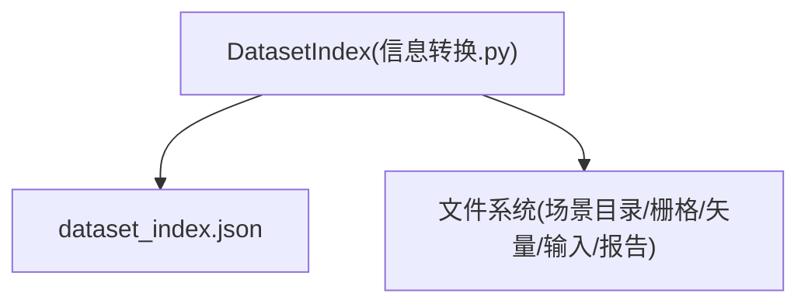

# 数据集索引管理

<cite>
**本文引用的文件**   
- [信息转换.py](file://environment_variables/environment_variables/信息转换.py)
- [dataset_index.json](file://environment_variables/environment_variables/dataset/dataset_index.json)
</cite>

## 目录
1. [简介](#简介)
2. [项目结构](#项目结构)
3. [核心组件](#核心组件)
4. [架构总览](#架构总览)
5. [详细组件分析](#详细组件分析)
6. [依赖关系分析](#依赖关系分析)
7. [性能与复杂度](#性能与复杂度)
8. [故障排查指南](#故障排查指南)
9. [结论](#结论)
10. [附录：使用示例与最佳实践](#附录使用示例与最佳实践)

## 简介
本技术文档围绕 DatasetIndex 类展开，系统性阐述数据集索引系统的架构设计与实现细节。重点覆盖以下方面：
- dataset_index.json 的解析与验证流程
- 场景模式（train、validation、generalization、stress）的别名映射与规范化处理
- scene_keys() 方法如何按模式筛选场景
- get_record() 方法如何构建包含绝对路径的完整场景记录字典
- required_file_paths() 方法的文件路径解析逻辑与相对路径到绝对路径的转换规则
- source_root 的处理机制与路径验证流程
- 结合具体代码片段路径展示如何正确使用 DatasetIndex 进行场景管理与数据访问

## 项目结构
DatasetIndex 的核心实现位于“环境变量”模块中的“信息转换.py”，其配套的索引配置文件为“dataset/dataset_index.json”。该 JSON 定义了数据集版本、schema、source_root、splits、scenes 等元数据，供 DatasetIndex 在初始化时加载并缓存。

图表来源
- [信息转换.py:20-196](file://environment_variables/environment_variables/信息转换.py#L20-L196)
- [dataset_index.json:1-120](file://environment_variables/environment_variables/dataset/dataset_index.json#L1-L120)

章节来源
- [信息转换.py:20-196](file://environment_variables/environment_variables/信息转换.py#L20-L196)
- [dataset_index.json:1-120](file://environment_variables/environment_variables/dataset/dataset_index.json#L1-L120)

## 核心组件
- DatasetIndex：负责加载 dataset_index.json，维护 splits 和 scenes 索引，提供模式归一化、场景键查询、记录构建与必需文件路径解析等能力。
- dataset_index.json：定义数据集 schema、source_root、splits、scenes 及 raster_files 等元数据，作为 DatasetIndex 的数据源。

章节来源
- [信息转换.py:20-196](file://environment_variables/environment_variables/信息转换.py#L20-L196)
- [dataset_index.json:1-120](file://environment_variables/environment_variables/dataset/dataset_index.json#L1-L120)

## 架构总览
DatasetIndex 采用“配置驱动 + 内存索引”的轻量架构：
- 启动阶段：解析 data_dir 与 index_name，定位并读取 dataset_index.json；根据 source_root 计算绝对根路径；将 splits 与 scenes 载入内存。
- 运行时：通过 normalize_mode 对模式进行别名映射；scene_keys 返回指定模式的场景键列表；get_record 生成带绝对路径的完整记录；required_file_paths 输出必需文件的标签与绝对路径清单。

图表来源
- [信息转换.py:20-196](file://environment_variables/environment_variables/信息转换.py#L20-L196)

## 详细组件分析

### 初始化与数据目录解析
- _resolve_data_dir：优先使用绝对路径；若为相对路径，则尝试在当前工作目录下解析；若仍不存在，回退到脚本所在目录拼接相对路径。
- __init__：校验 dataset_index.json 是否存在；以 UTF-8 编码加载 JSON；从 index 中读取 source_root，若非绝对路径则以 index_path.parent 为基准拼接并 resolve；同时构建 splits 与 scenes 的内存副本，并汇总 all_scene_keys。

章节来源
- [信息转换.py:32-78](file://environment_variables/environment_variables/信息转换.py#L32-L78)
- [dataset_index.json:1-10](file://environment_variables/environment_variables/dataset/dataset_index.json#L1-L10)

### 模式别名映射与规范化
- MODE_ALIASES：支持 train、validation、generalization、stress 四种标准模式，并提供 test、eval 作为 generalization 的别名。
- normalize_mode：将输入模式小写后查表映射；未知模式抛出 ValueError，提示期望值集合。

章节来源
- [信息转换.py:23-30](file://environment_variables/environment_variables/信息转换.py#L23-L30)
- [信息转换.py:80-87](file://environment_variables/environment_variables/信息转换.py#L80-L87)

### 场景筛选：scene_keys(mode)
- 先调用 normalize_mode 获取规范化的 split 名称；再从 splits 中取出对应场景键列表；若为空则抛出 ValueError，提示未配置任何场景。

章节来源
- [信息转换.py:89-94](file://environment_variables/environment_variables/信息转换.py#L89-L94)
- [dataset_index.json:34-88](file://environment_variables/environment_variables/dataset/dataset_index.json#L34-L88)

### 构建完整场景记录：get_record(scene_key)
- 校验 scene_key 存在；复制原始记录；计算 scene_dir 绝对路径；补齐 metadata_abs、static_map_abs（如存在）、rasters_abs（遍历 rasters 子项），以及 scene_index。
- 路径解析规则：
  - metadata：默认 "metadata.json"，相对于 scene_dir；
  - static_map：若存在且非绝对路径，则基于 source_root 拼接；
  - rasters：每个栅格相对路径均基于 scene_dir 拼接；
  - 所有路径最终 resolve 为绝对路径字符串。

图表来源
- [信息转换.py:96-121](file://environment_variables/environment_variables/信息转换.py#L96-L121)

章节来源
- [信息转换.py:96-121](file://environment_variables/environment_variables/信息转换.py#L96-L121)

### 必需文件路径解析：required_file_paths(scene_key)
- 构造必需文件清单，包括：
  - metadata（默认 "metadata.json"）
  - static_map（必填，缺失会保留空路径占位）
  - 核心栅格：intensity、length、time、speedRate
  - 扩展栅格：spread_direction、heat_per_unit_area、crown_fire
  - 矢量：ignition（默认 "vectors/ignition.shp"）、fire_perimeter（默认 "vectors/fire_perimeter.shp"）
  - 输入：weather_stream（默认 "inputs/weather_stream.wxs"）、fuel_moisture（默认 "inputs/fuel_moisture_dry.fms"）
  - 报告：fire_growth_report（默认 "reports/fire_growth_report.csv"）、run_log（默认 "reports/Run_log.txt"）
- 路径解析规则：
  - 若 rel_path 为空，标记为 "__missing_path__" 占位；
  - 若为非绝对路径：
    - static_map 基于 source_root 拼接；
    - 其余基于 scene_dir 拼接；
  - 最终全部 resolve 为绝对路径。

图表来源
- [信息转换.py:136-196](file://environment_variables/environment_variables/信息转换.py#L136-L196)

章节来源
- [信息转换.py:136-196](file://environment_variables/environment_variables/信息转换.py#L136-L196)

### source_root 处理与路径验证
- source_root 来自 dataset_index.json 的顶层字段；若为相对路径，则以 index_path.parent 为基准拼接并 resolve，确保得到绝对路径。
- 后续所有基于 source_root 的路径解析（如 static_map）均以该绝对路径为基座。

章节来源
- [dataset_index.json:1-10](file://environment_variables/environment_variables/dataset/dataset_index.json#L1-L10)
- [信息转换.py:46-49](file://environment_variables/environment_variables/信息转换.py#L46-L49)

## 依赖关系分析
- DatasetIndex 仅依赖 Python 标准库（json、os、pathlib）与类型注解，无第三方运行时耦合。
- 与 dataset_index.json 强耦合：JSON 结构变更会影响初始化与路径解析行为。
- 与文件系统交互：大量路径操作与 resolve，需保证 source_root 与场景目录结构正确。

图表来源
- [信息转换.py:20-196](file://environment_variables/environment_variables/信息转换.py#L20-L196)
- [dataset_index.json:1-120](file://environment_variables/environment_variables/dataset/dataset_index.json#L1-L120)

章节来源
- [信息转换.py:20-196](file://environment_variables/environment_variables/信息转换.py#L20-L196)
- [dataset_index.json:1-120](file://environment_variables/environment_variables/dataset/dataset_index.json#L1-L120)

## 性能与复杂度
- 初始化阶段：
  - JSON 解析 O(N)，N 为 scenes 数量；
  - splits 与 scenes 拷贝 O(N)；
  - all_scene_keys 聚合 O(S+U)，S 为 splits 总数，U 为未在 splits 中出现的额外场景数。
- 运行时方法：
  - normalize_mode：O(1) 哈希查找；
  - scene_keys：O(K) 列表拷贝，K 为该模式下场景数；
  - get_record：O(R)，R 为 rasters 子项数量；
  - required_file_paths：O(F)，F 为必需文件条目数（固定常量级）。
- 空间复杂度：主要存储 splits、scenes 与 all_scene_keys，线性于场景规模。

[本节为通用性能讨论，不直接分析具体文件]

## 故障排查指南
- FileNotFoundError：当 data_dir/index_name 指向的 dataset_index.json 不存在时抛出。检查 data_dir 是否正确、index_name 是否匹配。
- KeyError：当传入的 scene_key 不在 scenes 中时抛出。确认 scene_key 拼写与 dataset_index.json 一致。
- ValueError：
  - 未知模式：normalize_mode 遇到不在 MODE_ALIASES 的模式；
  - 某 split 下无场景：scene_keys 返回空列表时抛出。
- 路径问题：
  - static_map 缺失或路径错误：get_record 与 required_file_paths 会基于 source_root 拼接；请确认 dataset_index.json 中 source_root 与 static_map 相对路径正确。
  - 栅格/矢量/输入/报告路径缺失：required_file_paths 会以 "__missing_path__" 占位，便于快速定位缺失项。

章节来源
- [信息转换.py:37-41](file://environment_variables/environment_variables/信息转换.py#L37-L41)
- [信息转换.py:80-94](file://environment_variables/environment_variables/信息转换.py#L80-L94)
- [信息转换.py:96-121](file://environment_variables/environment_variables/信息转换.py#L96-L121)
- [信息转换.py:136-196](file://environment_variables/environment_variables/信息转换.py#L136-L196)

## 结论
DatasetIndex 提供了简洁而稳健的数据集索引管理能力：通过 JSON 配置驱动、严格的模式别名映射、完善的绝对路径解析与必需文件清单生成，使得上层训练/评估流程可以稳定地按模式组织与访问场景数据。建议在使用前校验 dataset_index.json 的完整性与 source_root 的正确性，并在异常发生时依据上述排查指南快速定位问题。

[本节为总结性内容，不直接分析具体文件]

## 附录：使用示例与最佳实践
以下为常见用法与关键步骤的代码片段路径指引（不直接粘贴代码，仅提供行号范围以便查阅）：

- 初始化与数据目录解析
  - [信息转换.py:32-78](file://environment_variables/environment_variables/信息转换.py#L32-L78)
  - [dataset_index.json:1-10](file://environment_variables/environment_variables/dataset/dataset_index.json#L1-L10)

- 模式别名映射与规范化
  - [信息转换.py:23-30](file://environment_variables/environment_variables/信息转换.py#L23-L30)
  - [信息转换.py:80-87](file://environment_variables/environment_variables/信息转换.py#L80-L87)

- 按模式筛选场景
  - [信息转换.py:89-94](file://environment_variables/environment_variables/信息转换.py#L89-L94)
  - [dataset_index.json:34-88](file://environment_variables/environment_variables/dataset/dataset_index.json#L34-L88)

- 构建完整场景记录（含绝对路径）
  - [信息转换.py:96-121](file://environment_variables/environment_variables/信息转换.py#L96-L121)

- 必需文件路径解析（含相对路径到绝对路径转换）
  - [信息转换.py:136-196](file://environment_variables/environment_variables/信息转换.py#L136-L196)

- source_root 处理与路径验证
  - [dataset_index.json:1-10](file://environment_variables/environment_variables/dataset/dataset_index.json#L1-L10)
  - [信息转换.py:46-49](file://environment_variables/environment_variables/信息转换.py#L46-L49)

最佳实践建议：
- 始终通过 normalize_mode 传入模式，避免直接使用内部 split 名；
- 在批量处理前调用 required_file_paths 进行预检，提前发现缺失文件；
- 若自定义 source_root，确保其为绝对路径或在 dataset_index.json 中以相对路径正确表达；
- 对 get_record 返回的记录，优先使用 *_abs 字段进行文件读写，避免路径歧义。

[本节为使用指导，不直接分析具体文件]