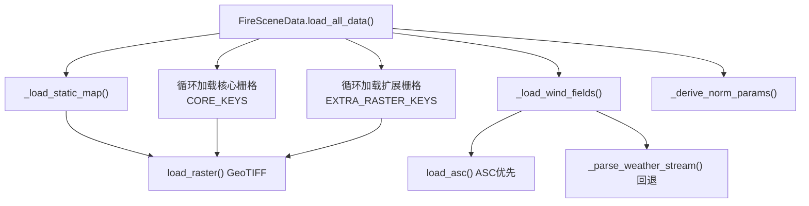
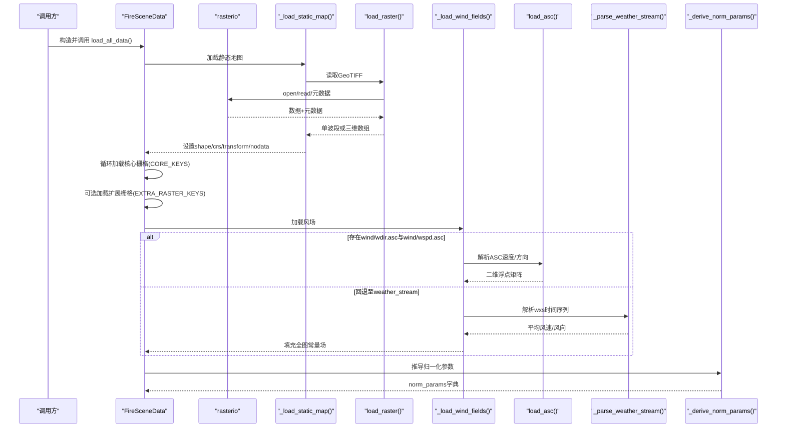
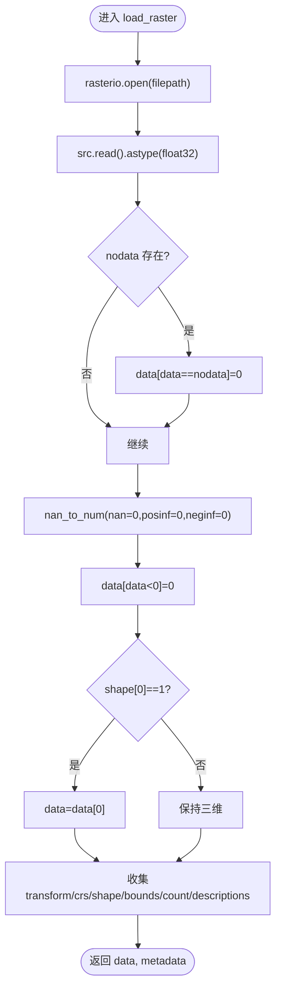
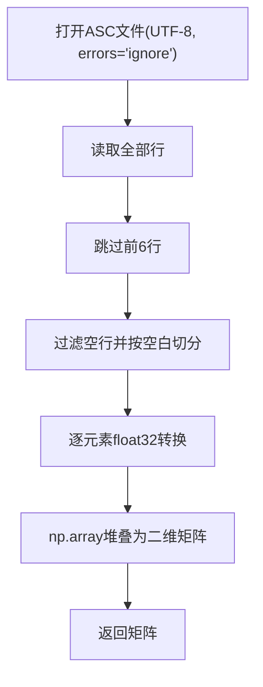
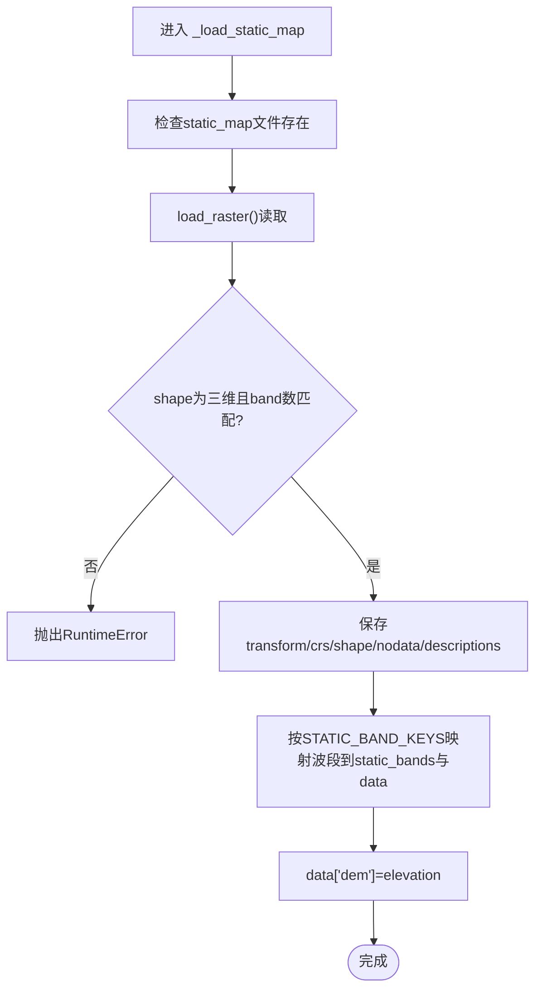
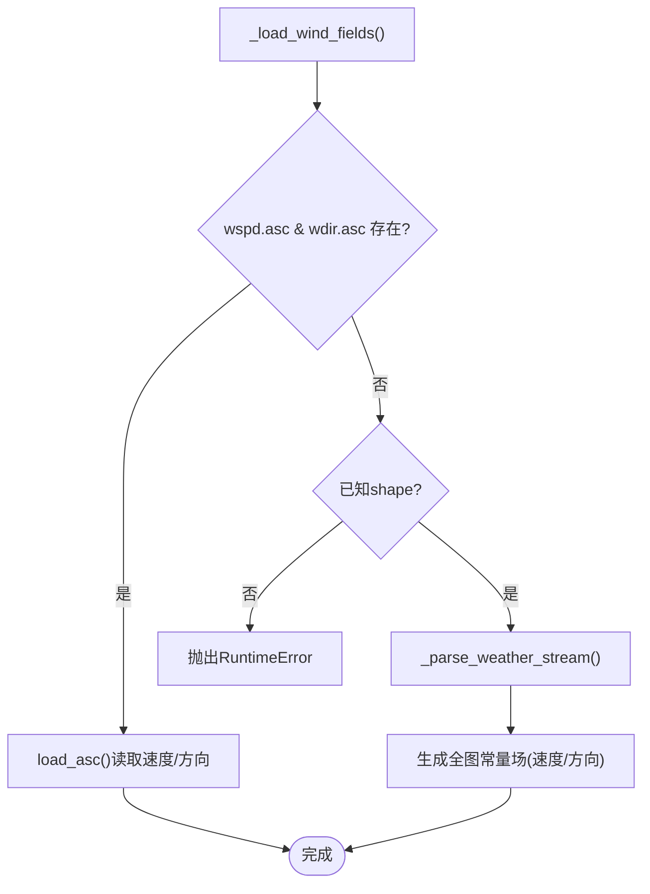
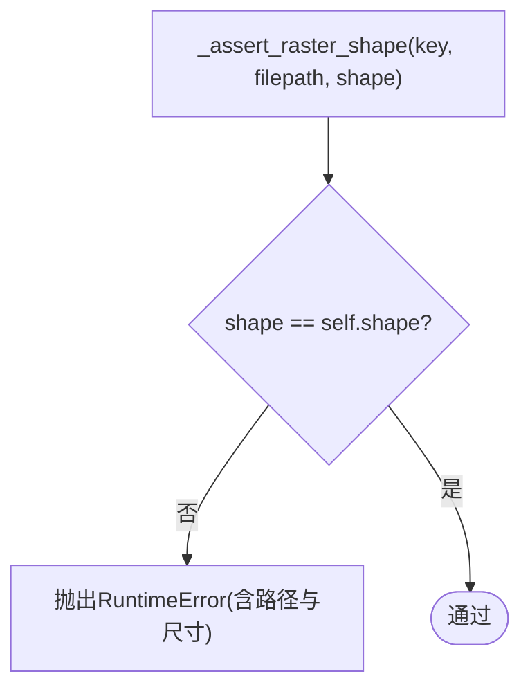
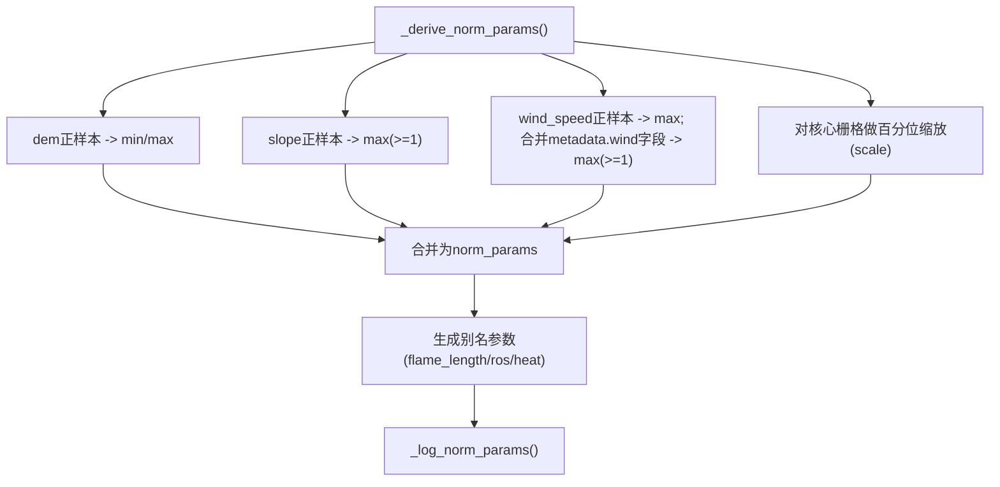
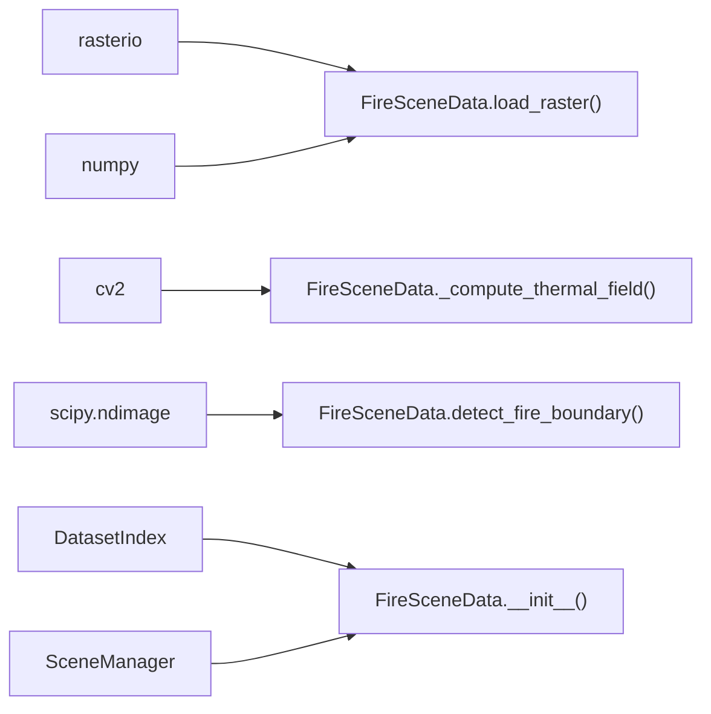

# 栅格数据处理

<cite>
**本文引用的文件**   
- [信息转换.py](file://environment_variables/environment_variables/outputs/lr_comparison_20260709_095438/训练结果/训练源码/信息转换.py)
</cite>

## 目录
1. [简介](#简介)
2. [项目结构](#项目结构)
3. [核心组件](#核心组件)
4. [架构总览](#架构总览)
5. [详细组件分析](#详细组件分析)
6. [依赖关系分析](#依赖关系分析)
7. [性能考量](#性能考量)
8. [故障排查指南](#故障排查指南)
9. [结论](#结论)
10. [附录：示例与用法路径](#附录示例与用法路径)

## 简介
本技术文档聚焦于栅格数据加载与处理的核心实现，围绕以下关键方法展开：
- load_raster()：GeoTIFF读取、数据类型转换与无效值处理
- load_asc()：ASCII风场数据的解析逻辑
- _load_static_map()：多波段静态地图的波段键值映射与数据校验
- _load_wind_fields()：风场数据加载策略（ASC优先与weather_stream回退）
- 形状一致性检查与错误处理机制
- 正数值过滤与归一化参数的派生计算过程
- 典型使用流程与代码片段路径指引

## 项目结构
该功能位于“信息转换”模块中，主要类为 FireSceneData，负责场景级栅格数据加载、风场合成、归一化参数推导与热场构建。其调用链贯穿 load_all_data()，内部依次执行静态地图加载、核心栅格加载、可选栅格加载、风场加载与归一化参数推导。

图表来源
- [信息转换.py:392-414](file://environment_variables/environment_variables/outputs/lr_comparison_20260709_095438/训练结果/训练源码/信息转换.py#L392-L414)
- [信息转换.py:415-424](file://environment_variables/environment_variables/outputs/lr_comparison_20260709_095438/训练结果/训练源码/信息转换.py#L415-L424)
- [信息转换.py:473-490](file://environment_variables/environment_variables/outputs/lr_comparison_20260709_095438/训练结果/训练源码/信息转换.py#L473-L490)
- [信息转换.py:501-523](file://environment_variables/environment_variables/outputs/lr_comparison_20260709_095438/训练结果/训练源码/信息转换.py#L501-L523)
- [信息转换.py:639-682](file://environment_variables/environment_variables/outputs/lr_comparison_20260709_095438/训练结果/训练源码/信息转换.py#L639-L682)

章节来源
- [信息转换.py:219-323](file://environment_variables/environment_variables/outputs/lr_comparison_20260709_095438/训练结果/训练源码/信息转换.py#L219-L323)
- [信息转换.py:639-682](file://environment_variables/environment_variables/outputs/lr_comparison_20260709_095438/训练结果/训练源码/信息转换.py#L639-L682)

## 核心组件
- FireSceneData：封装单个FARSITE场景的数据加载、风场合成、归一化参数推导、边界提取与热场计算等能力。
- DatasetIndex：提供数据集索引、场景元数据与绝对路径解析。
- SceneManager：按划分（train/validation/generalization/stress）管理场景实例并共享缓存。

本节重点说明栅格数据加载相关的方法与流程。

章节来源
- [信息转换.py:219-323](file://environment_variables/environment_variables/outputs/lr_comparison_20260709_095438/训练结果/训练源码/信息转换.py#L219-L323)
- [信息转换.py:20-196](file://environment_variables/environment_variables/outputs/lr_comparison_20260709_095438/训练结果/训练源码/信息转换.py#L20-L196)
- [信息转换.py:1282-1327](file://environment_variables/environment_variables/outputs/lr_comparison_20260709_095438/训练结果/训练源码/信息转换.py#L1282-L1327)

## 架构总览
下图展示了从场景初始化到栅格数据加载、风场生成与归一化参数推导的整体流程。

图表来源
- [信息转换.py:639-682](file://environment_variables/environment_variables/outputs/lr_comparison_20260709_095438/训练结果/训练源码/信息转换.py#L639-L682)
- [信息转换.py:501-523](file://environment_variables/environment_variables/outputs/lr_comparison_20260709_095438/训练结果/训练源码/信息转换.py#L501-L523)
- [信息转换.py:392-414](file://environment_variables/environment_variables/outputs/lr_comparison_20260709_095438/训练结果/训练源码/信息转换.py#L392-L414)
- [信息转换.py:415-424](file://environment_variables/environment_variables/outputs/lr_comparison_20260709_095438/训练结果/训练源码/信息转换.py#L415-L424)
- [信息转换.py:473-490](file://environment_variables/environment_variables/outputs/lr_comparison_20260709_095438/训练结果/训练源码/信息转换.py#L473-L490)
- [信息转换.py:426-471](file://environment_variables/environment_variables/outputs/lr_comparison_20260709_095438/训练结果/训练源码/信息转换.py#L426-L471)
- [信息转换.py:559-602](file://environment_variables/environment_variables/outputs/lr_comparison_20260709_095438/训练结果/训练源码/信息转换.py#L559-L602)

## 详细组件分析

### load_raster()：GeoTIFF读取、类型转换与无效值处理
- 打开与读取：通过 rasterio.open 打开文件，读取全部波段并转为 float32。
- 无效值处理：将 nodata 位置置零；用 nan_to_num 替换 NaN/Inf 为 0；将所有负值置零。
- 维度规整：若 count==1，则压缩掉第一维，返回二维数组；否则保留三维。
- 元数据收集：保存 transform、crs、shape、bounds、count、descriptions 等。
- 异常包装：捕获所有异常并抛出包含文件路径的 RuntimeError，便于定位问题。

图表来源
- [信息转换.py:392-414](file://environment_variables/environment_variables/outputs/lr_comparison_20260709_095438/训练结果/训练源码/信息转换.py#L392-L414)

章节来源
- [信息转换.py:392-414](file://environment_variables/environment_variables/outputs/lr_comparison_20260709_095438/训练结果/训练源码/信息转换.py#L392-L414)

### load_asc()：ASCII风场数据解析
- 编码容错：以 utf-8 打开，errors="ignore" 避免非法字符中断。
- 跳过头部：忽略前6行（常见ASCII头），仅解析后续数值行。
- 数值解析：每行按空白分割，逐元素转 float32，最终堆叠为二维数组。
- 异常包装：捕获异常并抛出包含文件路径的 RuntimeError。

图表来源
- [信息转换.py:415-424](file://environment_variables/environment_variables/outputs/lr_comparison_20260709_095438/训练结果/训练源码/信息转换.py#L415-L424)

章节来源
- [信息转换.py:415-424](file://environment_variables/environment_variables/outputs/lr_comparison_20260709_095438/训练结果/训练源码/信息转换.py#L415-L424)

### _load_static_map()：多波段静态地图与波段键值映射
- 文件存在性校验：缺失则抛出 FileNotFoundError。
- 读取与维度校验：要求为三维且第一维等于预定义波段数（如高程、坡度、坡向、燃料模型、冠层覆盖、冠层高度、冠层底高、冠层密度）。
- 元数据传播：将 transform、crs、shape、nodata、descriptions 保存到实例字段。
- 波段映射：按 STATIC_BAND_KEYS 顺序将各波段写入 static_bands 与 data 字典，并将 elevation 同时赋给 dem。

图表来源
- [信息转换.py:501-523](file://environment_variables/environment_variables/outputs/lr_comparison_20260709_095438/训练结果/训练源码/信息转换.py#L501-L523)
- [信息转换.py:237-246](file://environment_variables/environment_variables/outputs/lr_comparison_20260709_095438/训练结果/训练源码/信息转换.py#L237-L246)

章节来源
- [信息转换.py:501-523](file://environment_variables/environment_variables/outputs/lr_comparison_20260709_095438/训练结果/训练源码/信息转换.py#L501-L523)
- [信息转换.py:237-246](file://environment_variables/environment_variables/outputs/lr_comparison_20260709_095438/训练结果/训练源码/信息转换.py#L237-L246)

### _load_wind_fields()：风场加载策略（ASC优先与weather_stream回退）
- 优先路径：若 wind/wspd.asc 与 wind/wdir.asc 均存在，则分别调用 load_asc() 得到速度与方向场。
- 回退路径：若缺少ASC文件，则基于已知的 shape 生成常量场：
  - 先尝试解析 inputs/weather_stream.wxs，统计有效行的风速均值与风向平均角（弧度转角度后取模360）。
  - 若无法解析或无有效行，则回退到 metadata.wind 中的近似风速与方向。
- 形状一致性：在 load_all_data() 末尾对 wind_speed 与 wind_direction 的形状进行二次校验，不匹配则抛出 RuntimeError。

图表来源
- [信息转换.py:473-490](file://environment_variables/environment_variables/outputs/lr_comparison_20260709_095438/训练结果/训练源码/信息转换.py#L473-L490)
- [信息转换.py:426-471](file://environment_variables/environment_variables/outputs/lr_comparison_20260709_095438/训练结果/训练源码/信息转换.py#L426-L471)
- [信息转换.py:670-678](file://environment_variables/environment_variables/outputs/lr_comparison_20260709_095438/训练结果/训练源码/信息转换.py#L670-L678)

章节来源
- [信息转换.py:473-490](file://environment_variables/environment_variables/outputs/lr_comparison_20260709_095438/训练结果/训练源码/信息转换.py#L473-L490)
- [信息转换.py:426-471](file://environment_variables/environment_variables/outputs/lr_comparison_20260709_095438/训练结果/训练源码/信息转换.py#L426-L471)
- [信息转换.py:670-678](file://environment_variables/environment_variables/outputs/lr_comparison_20260709_095438/训练结果/训练源码/信息转换.py#L670-L678)

### 形状一致性检查与错误处理
- 统一断言：_assert_raster_shape() 对比每个栅格与静态地图的 shape，不一致即抛出 RuntimeError，并附带静态地图与实际栅格的路径与尺寸信息。
- 风场二次校验：在 load_all_data() 末尾再次检查 wind_speed 与 wind_direction 是否与全局 shape 一致。
- 异常包装：所有IO与解析异常均被捕获并转换为包含具体路径的 RuntimeError，便于快速定位。

图表来源
- [信息转换.py:525-532](file://environment_variables/environment_variables/outputs/lr_comparison_20260709_095438/训练结果/训练源码/信息转换.py#L525-L532)
- [信息转换.py:670-678](file://environment_variables/environment_variables/outputs/lr_comparison_20260709_095438/训练结果/训练源码/信息转换.py#L670-L678)

章节来源
- [信息转换.py:525-532](file://environment_variables/environment_variables/outputs/lr_comparison_20260709_095438/训练结果/训练源码/信息转换.py#L525-L532)
- [信息转换.py:670-678](file://environment_variables/environment_variables/outputs/lr_comparison_20260709_095438/训练结果/训练源码/信息转换.py#L670-L678)

### 正数值过滤与归一化参数推导
- 正数值过滤：_positive_values() 仅保留有限正值（排除NaN/Inf与<=0的值），用于稳健统计。
- 百分位缩放：_percentile_scale() 对指定变量取正样本的指定分位数作为尺度，支持最小值下限与范围裁剪。
- 归一化参数推导：_derive_norm_params() 综合以下来源：
  - DEM：取正样本的最小/最大值，若极差<=0则强制加1保证非零分母。
  - Slope：取正样本的最大值，至少为1。
  - Wind speed：取正样本最大值，并与 metadata.wind 中的多种风速字段比较取最大，至少为1。
  - 其他栅格（intensity、length、speedRate、spread_direction、heat_per_unit_area、crown_fire）：使用百分位缩放，其中 spread_direction_min_value 固定为360。
  - 别名映射：flame_length_max/ros_max/heat_max 复用 length_max/speedRate_max/heat_per_unit_area_max。
- 日志输出：_log_norm_params() 打印关键归一化参数摘要。

图表来源
- [信息转换.py:535-537](file://environment_variables/environment_variables/outputs/lr_comparison_20260709_095438/训练结果/训练源码/信息转换.py#L535-L537)
- [信息转换.py:543-557](file://environment_variables/environment_variables/outputs/lr_comparison_20260709_095438/训练结果/训练源码/信息转换.py#L543-L557)
- [信息转换.py:559-602](file://environment_variables/environment_variables/outputs/lr_comparison_20260709_095438/训练结果/训练源码/信息转换.py#L559-L602)
- [信息转换.py:604-614](file://environment_variables/environment_variables/outputs/lr_comparison_20260709_095438/训练结果/训练源码/信息转换.py#L604-L614)

章节来源
- [信息转换.py:535-537](file://environment_variables/environment_variables/outputs/lr_comparison_20260709_095438/训练结果/训练源码/信息转换.py#L535-L537)
- [信息转换.py:543-557](file://environment_variables/environment_variables/outputs/lr_comparison_20260709_095438/训练结果/训练源码/信息转换.py#L543-L557)
- [信息转换.py:559-602](file://environment_variables/environment_variables/outputs/lr_comparison_20260709_095438/训练结果/训练源码/信息转换.py#L559-L602)
- [信息转换.py:604-614](file://environment_variables/environment_variables/outputs/lr_comparison_20260709_095438/训练结果/训练源码/信息转换.py#L604-L614)

### normalized_map()：归一化与取值
- 变量别名：NORM_ALIASES 将 flame_length/ros/heat 映射到 length/speedRate/heat_per_unit_area。
- DEM特殊处理：按 (dem - dem_min)/(dem_max - dem_min) 归一化，分母至少为1，结果截断到[0,1]。
- 其他变量：根据 NORM_RASTER_PARAMS 选择对应max参数，除以max并截断到[0,1]。
- slope 与 wind_speed 使用各自专用max参数。

章节来源
- [信息转换.py:616-637](file://environment_variables/environment_variables/outputs/lr_comparison_20260709_095438/训练结果/训练源码/信息转换.py#L616-L637)
- [信息转换.py:224-236](file://environment_variables/environment_variables/outputs/lr_comparison_20260709_095438/训练结果/训练源码/信息转换.py#L224-L236)

## 依赖关系分析
- 外部库：
  - rasterio：GeoTIFF读写与地理变换信息获取
  - numpy：数值计算与数组操作
  - cv2：图像缩放（热场构建中使用）
  - scipy.ndimage：形态学操作（边界提取）与高斯滤波（热场平滑）
- 内部依赖：
  - FireSceneData 依赖 DatasetIndex 提供的场景记录与路径解析
  - SceneManager 复用 FireSceneData 实例并共享缓存

图表来源
- [信息转换.py:392-414](file://environment_variables/environment_variables/outputs/lr_comparison_20260709_095438/训练结果/训练源码/信息转换.py#L392-L414)
- [信息转换.py:759-819](file://environment_variables/environment_variables/outputs/lr_comparison_20260709_095438/训练结果/训练源码/信息转换.py#L759-L819)
- [信息转换.py:821-887](file://environment_variables/environment_variables/outputs/lr_comparison_20260709_095438/训练结果/训练源码/信息转换.py#L821-L887)
- [信息转换.py:20-196](file://environment_variables/environment_variables/outputs/lr_comparison_20260709_095438/训练结果/训练源码/信息转换.py#L20-L196)
- [信息转换.py:1282-1327](file://environment_variables/environment_variables/outputs/lr_comparison_20260709_095438/训练结果/训练源码/信息转换.py#L1282-L1327)

章节来源
- [信息转换.py:392-414](file://environment_variables/environment_variables/outputs/lr_comparison_20260709_095438/训练结果/训练源码/信息转换.py#L392-L414)
- [信息转换.py:759-819](file://environment_variables/environment_variables/outputs/lr_comparison_20260709_095438/训练结果/训练源码/信息转换.py#L759-L819)
- [信息转换.py:821-887](file://environment_variables/environment_variables/outputs/lr_comparison_20260709_095438/训练结果/训练源码/信息转换.py#L821-L887)
- [信息转换.py:20-196](file://environment_variables/environment_variables/outputs/lr_comparison_20260709_095438/训练结果/训练源码/信息转换.py#L20-L196)
- [信息转换.py:1282-1327](file://environment_variables/environment_variables/outputs/lr_comparison_20260709_095438/训练结果/训练源码/信息转换.py#L1282-L1327)

## 性能考量
- 数据类型：统一使用 float32 降低内存占用与提升运算效率。
- 无效值清理：一次性将 nodata/NaN/Inf/负值置零，避免后续多次判断分支。
- 维度规整：单波段时降维，减少不必要的广播开销。
- 风场回退：当ASC缺失时直接生成常量场，避免额外IO与复杂插值。
- 归一化参数：采用稳健统计（分位数）与上限裁剪，提高跨场景稳定性。

## 故障排查指南
- 静态地图缺失或波段数不匹配：检查 dataset_index.json 中 static_map 路径与多波段数量是否满足 STATIC_BAND_KEYS 长度。
- 栅格形状不一致：确保所有栅格与静态地图具有相同的高宽；必要时重投影或重采样。
- ASC解析失败：确认 wind/wdir.asc 与 wind/wspd.asc 格式符合“前6行头+数值行”，编码为UTF-8。
- weather_stream回退：若 wxs 解析为空，请检查 inputs/weather_stream.wxs 是否包含有效行与列索引；或确保 metadata.wind 中包含风速/方向字段。
- 风场形状不一致：检查 _load_wind_fields() 生成的常量场是否与 shape 一致；若仍不一致，回溯静态地图加载阶段。
- 归一化参数异常：观察 _log_norm_params() 输出，确认 intensity_max、length_max、speedRate_max、heat_per_unit_area_max、wind_speed_max 等合理。

章节来源
- [信息转换.py:501-523](file://environment_variables/environment_variables/outputs/lr_comparison_20260709_095438/训练结果/训练源码/信息转换.py#L501-L523)
- [信息转换.py:525-532](file://environment_variables/environment_variables/outputs/lr_comparison_20260709_095438/训练结果/训练源码/信息转换.py#L525-L532)
- [信息转换.py:415-424](file://environment_variables/environment_variables/outputs/lr_comparison_20260709_095438/训练结果/训练源码/信息转换.py#L415-L424)
- [信息转换.py:426-471](file://environment_variables/environment_variables/outputs/lr_comparison_20260709_095438/训练结果/训练源码/信息转换.py#L426-L471)
- [信息转换.py:670-678](file://environment_variables/environment_variables/outputs/lr_comparison_20260709_095438/训练结果/训练源码/信息转换.py#L670-L678)
- [信息转换.py:604-614](file://environment_variables/environment_variables/outputs/lr_comparison_20260709_095438/训练结果/训练源码/信息转换.py#L604-L614)

## 结论
该栅格数据处理模块以 FireSceneData 为核心，提供了健壮的 GeoTIFF 读取、ASCII 风场解析、多波段静态地图映射、风场回退策略、严格的形状一致性检查以及稳健的归一化参数推导。整体设计兼顾了数据可靠性与运行效率，适用于大规模场景批处理与在线推理。

## 附录：示例与用法路径
以下为不同栅格数据类型的处理方法入口与关键步骤路径，便于快速定位实现细节：
- GeoTIFF读取与无效值处理
  - 入口：load_raster()
  - 参考路径：[信息转换.py:392-414](file://environment_variables/environment_variables/outputs/lr_comparison_20260709_095438/训练结果/训练源码/信息转换.py#L392-L414)
- ASCII风场解析
  - 入口：load_asc()
  - 参考路径：[信息转换.py:415-424](file://environment_variables/environment_variables/outputs/lr_comparison_20260709_095438/训练结果/训练源码/信息转换.py#L415-L424)
- 多波段静态地图加载与波段映射
  - 入口：_load_static_map()
  - 参考路径：[信息转换.py:501-523](file://environment_variables/environment_variables/outputs/lr_comparison_20260709_095438/训练结果/训练源码/信息转换.py#L501-L523)
- 风场加载策略（ASC优先与weather_stream回退）
  - 入口：_load_wind_fields()
  - 参考路径：[信息转换.py:473-490](file://environment_variables/environment_variables/outputs/lr_comparison_20260709_095438/训练结果/训练源码/信息转换.py#L473-L490)
  - 回退解析：_parse_weather_stream()
  - 参考路径：[信息转换.py:426-471](file://environment_variables/environment_variables/outputs/lr_comparison_20260709_095438/训练结果/训练源码/信息转换.py#L426-L471)
- 形状一致性检查
  - 入口：_assert_raster_shape()
  - 参考路径：[信息转换.py:525-532](file://environment_variables/environment_variables/outputs/lr_comparison_20260709_095438/训练结果/训练源码/信息转换.py#L525-L532)
- 正数值过滤与归一化参数推导
  - 入口：_positive_values() / _percentile_scale() / _derive_norm_params()
  - 参考路径：[信息转换.py:535-537](file://environment_variables/environment_variables/outputs/lr_comparison_20260709_095438/训练结果/训练源码/信息转换.py#L535-L537)、[信息转换.py:543-557](file://environment_variables/environment_variables/outputs/lr_comparison_20260709_095438/训练结果/训练源码/信息转换.py#L543-L557)、[信息转换.py:559-602](file://environment_variables/environment_variables/outputs/lr_comparison_20260709_095438/训练结果/训练源码/信息转换.py#L559-L602)
- 归一化取值
  - 入口：normalized_map()
  - 参考路径：[信息转换.py:616-637](file://environment_variables/environment_variables/outputs/lr_comparison_20260709_095438/训练结果/训练源码/信息转换.py#L616-L637)